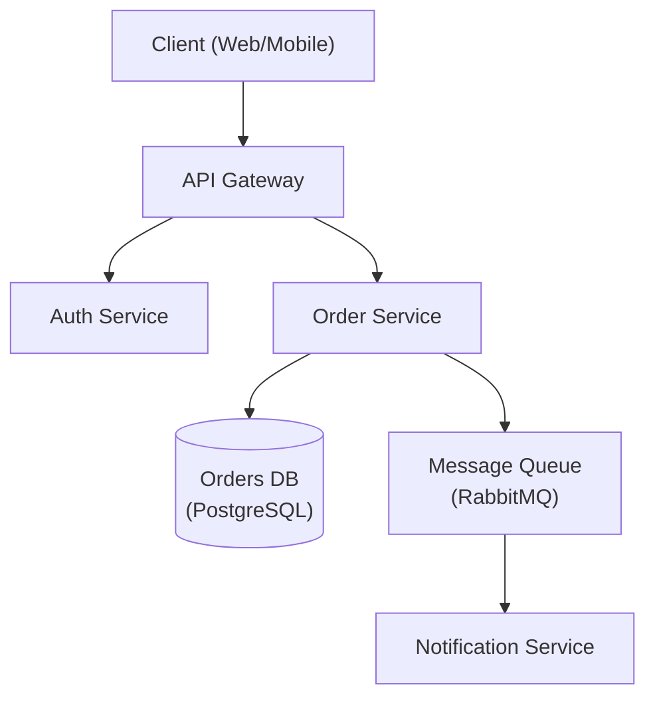
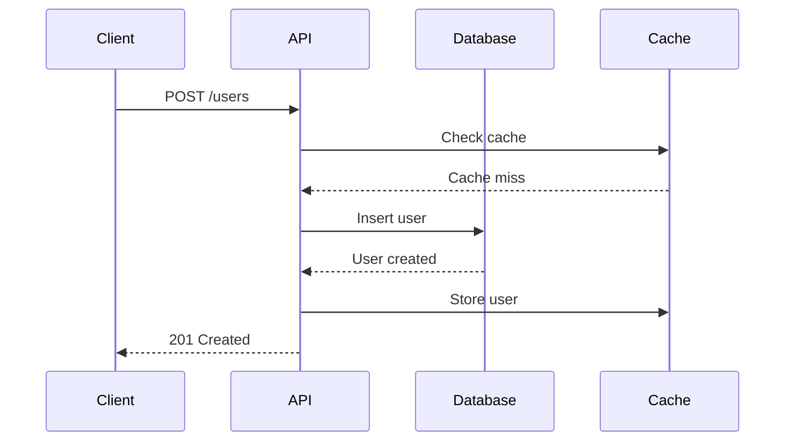
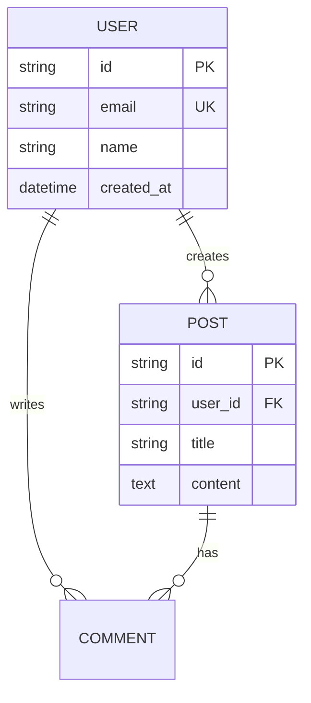
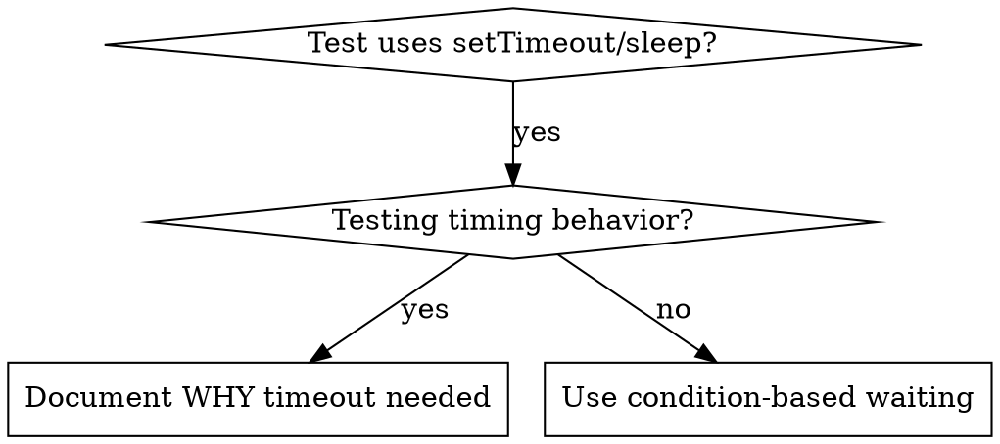
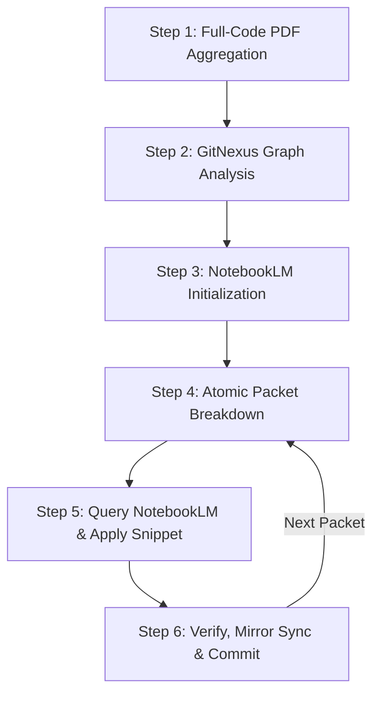
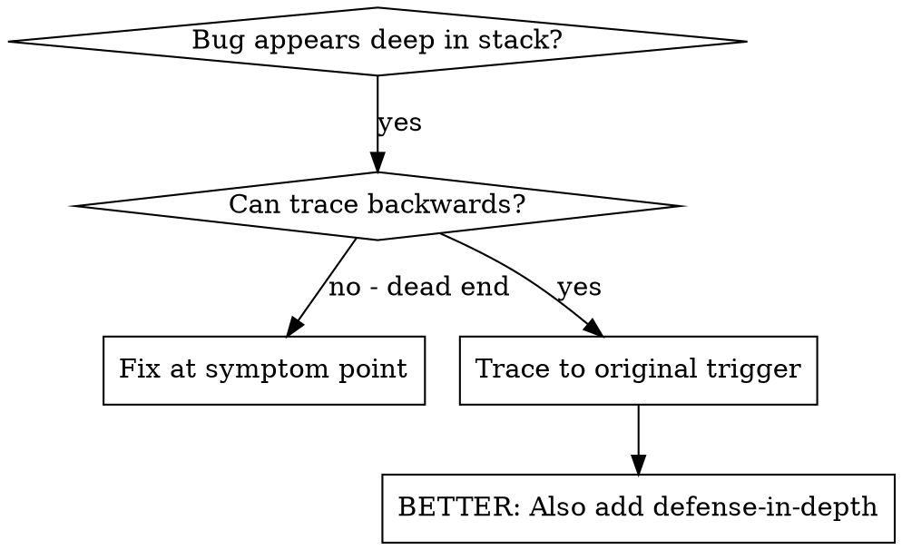
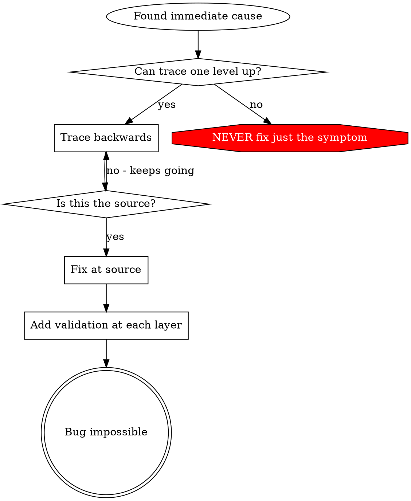
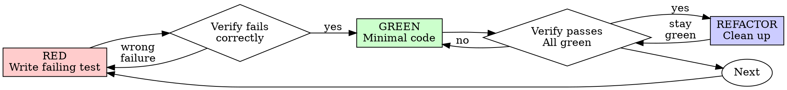
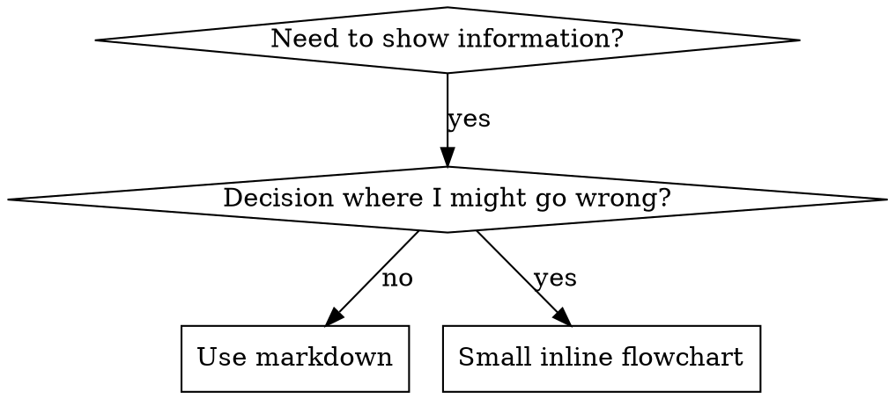

# B-SDD SKILLS INVENTORY & ONTOLOGY DUMP

**Згенеровано:** 2026-09-21 19:01:21Z  
**Хост збірки:** `192.168.3.161` (AntiGravity AGI Orchestrator)  
**Джерело:** `/home/vokov/.agents/skills`  
**Загальна кількість скілів:** **53**  
**Загальна кількість файлів коду/конфігів:** **233**  
**Стандарт онтології:** B-SDD Methodology v1.2 / ADR-001..020 (SkillADR)  

> [!NOTE]
> Цей дамп містить повний зріз системних, інфраструктурних та доменних скілів.
> Призначений для автоматичного семантичного індексування в Google NotebookLM,
> KùzuDB/GitNexus та генерації нод ДРАКОН-схем в Astryx Cockpit.

---

## Таблиця-Каталог Скілів (Skills Catalog)

| # | Назва скіла | Опис | Склад / Ресурси |
|---|---|---|---|
| 1 | [**api-designer**](#skill-api-designer) | Use when designing REST or GraphQL APIs, creating OpenAPI specifications, or planning API architecture. Invoke for resource modeling, versioning strategies, ... | `SKILL.md`, `references/error-handling.md` +4 |
| 2 | [**architecture-designer**](#skill-architecture-designer) | Use when designing new high-level system architecture, reviewing existing designs, or making architectural decisions. Invoke to create architecture diagrams,... | `SKILL.md`, `references/adr-template.md` +4 |
| 3 | [**ast-grep**](#skill-ast-grep) | Guide for writing ast-grep rules to perform structural code search and analysis. Use when users need to search codebases using Abstract Syntax Tree (AST) pat... | `SKILL.md`, `README.md` +1 |
| 4 | [**astryx-scaffolder**](#skill-astryx-scaffolder) | Scaffolds Astryx Cockpit UI components, interactive DRAKON canvas widgets, real-time telemetry panels, and multi-tenant operator workbench interfaces. | `SKILL.md`, `scripts/scaffold_component.py` |
| 5 | [**b-sdd**](#skill-b-sdd) | Enforces bitemporal architectural invariants, ADR compliance, and pre-flight compilation under the B-SDD framework. | `SKILL.md` (1 файл) |
| 6 | [**brainstorming**](#skill-brainstorming) | Use when creating or developing, before writing code or implementation plans - refines rough ideas into fully-formed designs through collaborative questionin... | `SKILL.md` (1 файл) |
| 7 | [**caveman**](#skill-caveman) | Ultra-compressed communication mode. Cuts output tokens 65% (measured) by speaking like caveman while keeping full technical accuracy. Supports intensity lev... | `SKILL.md`, `README.md` |
| 8 | [**cli-developer**](#skill-cli-developer) | Use when building CLI tools, implementing argument parsing, or adding interactive prompts. Invoke for parsing flags and subcommands, displaying progress bars... | `SKILL.md`, `references/design-patterns.md` +4 |
| 9 | [**code-documenter**](#skill-code-documenter) | Generates, formats, and validates technical documentation — including docstrings, OpenAPI/Swagger specs, JSDoc annotations, doc portals, and user guides. Use... | `SKILL.md`, `references/api-docs-fastapi-django.md` +7 |
| 10 | [**code-reviewer**](#skill-code-reviewer) | Analyzes code diffs and files to identify bugs, security vulnerabilities (SQL injection, XSS, insecure deserialization), code smells, N+1 queries, naming iss... | `SKILL.md`, `references/common-issues.md` +5 |
| 11 | [**codebase-design**](#skill-codebase-design) | Shared vocabulary for designing deep modules. Use when the user wants to design or improve a module's interface, find deepening opportunities, decide where a... | `SKILL.md`, `DEEPENING.md` +1 |
| 12 | [**condition-based-waiting**](#skill-condition-based-waiting) | Use when tests have race conditions, timing dependencies, or inconsistent pass/fail behavior - replaces arbitrary timeouts with condition polling to wait for... | `SKILL.md`, `example.ts` |
| 13 | [**defense-in-depth**](#skill-defense-in-depth) | Use when invalid data causes failures deep in execution, requiring validation at multiple system layers - validates at every layer data passes through to mak... | `SKILL.md` (1 файл) |
| 14 | [**diagnosing-bugs**](#skill-diagnosing-bugs) | Diagnosis loop for hard bugs and performance regressions. Use when the user says "diagnose"/"debug this", or reports something broken/throwing/failing/slow. | `SKILL.md`, `scripts/hitl-loop.template.sh` |
| 15 | [**drakon-compiler**](#skill-drakon-compiler) | Compiles DRAKON visual algorithm diagrams into Intermediate Representation (IR) and executable macro-prompts using planar graph solver (C=0, X=0) and strict ... | `SKILL.md`, `scripts/compile_drakon.py` |
| 16 | [**executing-plans**](#skill-executing-plans) | Use when partner provides a complete implementation plan to execute in controlled batches with review checkpoints - loads plan, reviews critically, executes ... | `SKILL.md` (1 файл) |
| 17 | [**find-skills**](#skill-find-skills) | Helps users discover and install agent skills when they ask questions like "how do I do X", "find a skill for X", "is there a skill that can...", or express ... | `SKILL.md` (1 файл) |
| 18 | [**frontend-design**](#skill-frontend-design) | Create distinctive, production-grade frontend interfaces with high design quality. Use this skill when the user asks to build web components, pages, or appli... | `SKILL.md`, `LICENSE.txt` |
| 19 | [**grill-with-docs**](#skill-grill-with-docs) | A relentless interview to sharpen a plan or design, which also creates docs (ADR's and glossary) as we go. | `SKILL.md` (1 файл) |
| 20 | [**handoff**](#skill-handoff) | Compact the current conversation into a handoff document for another agent to pick up. | `SKILL.md` (1 файл) |
| 21 | [**improve-codebase-architecture**](#skill-improve-codebase-architecture) | Scan a codebase for deepening opportunities, present them as a visual HTML report, then grill through whichever one you pick. | `SKILL.md`, `HTML-REPORT.md` |
| 22 | [**intent-continuity**](#skill-intent-continuity) | Enforces non-drifting code implementation backed by active bitemporal architectural rules, ADR compliance, and Utopia DB bitemporal synchronization. | `SKILL.md` (1 файл) |
| 23 | [**investigate-first**](#skill-investigate-first) | Diagnose ambiguous failures before editing. Use for unknown causes, intermittent behavior, performance regressions, or investigations needing evidence-ranked... | `SKILL.md`, `agents/openai.yaml` |
| 24 | [**kindle-release-pipeline**](#skill-kindle-release-pipeline) | Autonomous pipeline for compiling B-SDD architecture documentation, ADRs, and sprint summaries into standard EPUB 3.0 ebooks and dispatching them directly to... | `SKILL.md`, `scripts/bsdd_to_kindle.py` +5 |
| 25 | [**laya-decision-router**](#skill-laya-decision-router) | Sub-40ms System 1 non-autoregressive decision engine for task classification, prompt guardrails, and typed skill routing. | `SKILL.md` (1 файл) |
| 26 | [**make-interfaces-feel-better**](#skill-make-interfaces-feel-better) | Design engineering principles for making interfaces feel polished. Use when building UI components, reviewing frontend code, implementing animations, hover s... | `SKILL.md`, `animations.md` +3 |
| 27 | [**mcp-builder**](#skill-mcp-builder) | Guide for creating high-quality MCP (Model Context Protocol) servers that enable LLMs to interact with external services through well-designed tools. Use whe... | `SKILL.md`, `LICENSE.txt` +8 |
| 28 | [**notebooklm**](#skill-notebooklm) | Complete API for Google NotebookLM - full programmatic access including features not in the web UI. Create notebooks, add sources, generate all artifact type... | `SKILL.md` (1 файл) |
| 29 | [**notebooklm-gitnexus-copilot**](#skill-notebooklm-gitnexus-copilot) | Token-efficient AI pair programming methodology using Full-Code PDF aggregation, GitNexus code intelligence graph, and Google NotebookLM MCP. Supports atomic... | `SKILL.md` (1 файл) |
| 30 | [**root-cause-tracing**](#skill-root-cause-tracing) | Use when errors occur deep in execution and you need to trace back to find the original trigger - systematically traces bugs backward through call stack, add... | `SKILL.md`, `find-polluter.sh` |
| 31 | [**safe-refactor**](#skill-safe-refactor) | Restructure code while preserving behavior. Use for extraction, consolidation, ownership moves, or cleanup where verification must bracket structural edits. | `SKILL.md`, `agents/openai.yaml` |
| 32 | [**skill-audit**](#skill-skill-audit) | Use when auditing the skills installed in ~/.claude/skills/ for structure quality, metadata completeness, and instruction usefulness. Run after installing ne... | `SKILL.md` (1 файл) |
| 33 | [**skill-creator**](#skill-skill-creator) | Guide for creating effective skills. This skill should be used when users want to create a new skill (or update an existing skill) that extends Claude's capa... | `SKILL.md`, `LICENSE.txt` +5 |
| 34 | [**subagent-driven-development**](#skill-subagent-driven-development) | Use when executing implementation plans with independent tasks in the current session - dispatches fresh subagent for each task with code review between task... | `SKILL.md` (1 файл) |
| 35 | [**surgical-patch**](#skill-surgical-patch) | Fix bugs and small behavior changes at the narrowest responsible layer. Use when regression proof, preserved surrounding behavior, and task-relevant tests ma... | `SKILL.md`, `agents/openai.yaml` |
| 36 | [**systematic-debugging**](#skill-systematic-debugging) | Use when encountering any bug, test failure, or unexpected behavior, before proposing fixes - four-phase framework (root cause investigation, pattern analysi... | `SKILL.md`, `CREATION-LOG.md` +4 |
| 37 | [**test-driven-development**](#skill-test-driven-development) | Use when implementing any feature or bugfix, before writing implementation code - write the test first, watch it fail, write minimal code to pass; ensures te... | `SKILL.md` (1 файл) |
| 38 | [**testing-anti-patterns**](#skill-testing-anti-patterns) | Use when writing or changing tests, adding mocks, or tempted to add test-only methods to production code - prevents testing mock behavior, production polluti... | `SKILL.md` (1 файл) |
| 39 | [**theme-factory**](#skill-theme-factory) | Toolkit for styling artifacts with a theme. These artifacts can be slides, docs, reportings, HTML landing pages, etc. There are 10 pre-set themes with colors... | `SKILL.md`, `LICENSE.txt` +10 |
| 40 | [**to-spec**](#skill-to-spec) | Turn the current conversation into a spec and publish it to the project issue tracker — no interview, just synthesis of what you've already discussed. | `SKILL.md` (1 файл) |
| 41 | [**to-tickets**](#skill-to-tickets) | Break a plan, spec, or the current conversation into a set of tracer-bullet tickets, each declaring its blocking edges, published to the configured tracker —... | `SKILL.md` (1 файл) |
| 42 | [**using-git-worktrees**](#skill-using-git-worktrees) | Use when starting feature work that needs isolation from current workspace or before executing implementation plans - creates isolated git worktrees with sma... | `SKILL.md` (1 файл) |
| 43 | [**utopia-intent-ledger**](#skill-utopia-intent-ledger) | Manages bitemporal WORM ledger transactions, validates tripartite ADR ontology, and executes atomic synchronization with Utopia DB intent store and knowledge... | `SKILL.md`, `scripts/sync_utopia.py` +1 |
| 44 | [**vercel-composition-patterns**](#skill-vercel-composition-patterns) | React composition patterns that scale. Use when refactoring components with boolean prop proliferation, building flexible component libraries, or designing r... | `SKILL.md`, `AGENTS.md` +9 |
| 45 | [**vercel-react-best-practices**](#skill-vercel-react-best-practices) | React and Next.js performance optimization guidelines from Vercel Engineering. This skill should be used when writing, reviewing, or refactoring React/Next.j... | `SKILL.md`, `AGENTS.md` +71 |
| 46 | [**verification-before-completion**](#skill-verification-before-completion) | Use when about to claim work is complete, fixed, or passing, before committing or creating PRs - requires running verification commands and confirming output... | `SKILL.md` (1 файл) |
| 47 | [**wayfinder**](#skill-wayfinder) | Plan a huge chunk of work — more than one agent session can hold — as a shared map of investigation tickets on your issue tracker, and resolve them one at a ... | `SKILL.md` (1 файл) |
| 48 | [**web-artifacts-builder**](#skill-web-artifacts-builder) | Suite of tools for creating elaborate, multi-component claude.ai HTML artifacts using modern frontend web technologies (React, Tailwind CSS, shadcn/ui). Use ... | `SKILL.md`, `LICENSE.txt` +2 |
| 49 | [**web-design-guidelines**](#skill-web-design-guidelines) | Review UI code for Web Interface Guidelines compliance. Use when asked to "review my UI", "check accessibility", "audit design", "review UX", or "check my si... | `SKILL.md` (1 файл) |
| 50 | [**webapp-testing**](#skill-webapp-testing) | Toolkit for interacting with and testing local web applications using Playwright. Supports verifying frontend functionality, debugging UI behavior, capturing... | `SKILL.md`, `LICENSE.txt` +4 |
| 51 | [**writing-great-skills**](#skill-writing-great-skills) | Reference for writing and editing skills well — the vocabulary and principles that make a skill predictable. | `SKILL.md`, `GLOSSARY.md` |
| 52 | [**writing-plans**](#skill-writing-plans) | Use when design is complete and you need detailed implementation tasks for engineers with zero codebase context - creates comprehensive implementation plans ... | `SKILL.md` (1 файл) |
| 53 | [**writing-skills**](#skill-writing-skills) | Use when creating new skills, editing existing skills, or verifying skills work before deployment - applies TDD to process documentation by testing with suba... | `SKILL.md`, `anthropic-best-practices.md` +1 |

---

## Повний Вміст Скілів (Full Skills Code & Instructions)

<a id="skill-api-designer"></a>
### [1/53] Скіл: `api-designer`

**Каталог:** `~/.agents/skills/api-designer`  
**Опис:** Use when designing REST or GraphQL APIs, creating OpenAPI specifications, or planning API architecture. Invoke for resource modeling, versioning strategies, pagination patterns, error handling standards.  
**Файлів у складі:** 6  

#### Файл: `api-designer/SKILL.md` (7,734 байт)
````markdown
---
name: api-designer
description: Use when designing REST or GraphQL APIs, creating OpenAPI specifications, or planning API architecture. Invoke for resource modeling, versioning strategies, pagination patterns, error handling standards.
license: MIT
metadata:
  author: https://github.com/Jeffallan
  version: "1.1.0"
  domain: api-architecture
  triggers: API design, REST API, OpenAPI, API specification, API architecture, resource modeling, API versioning, GraphQL schema, API documentation
  role: architect
  scope: design
  output-format: specification
  related-skills: graphql-architect, fastapi-expert, nestjs-expert, spring-boot-engineer, security-reviewer
---

# API Designer

Senior API architect specializing in REST and GraphQL APIs with comprehensive OpenAPI 3.1 specifications.

## Core Workflow

1. **Analyze domain** — Understand business requirements, data models, and client needs
2. **Model resources** — Identify resources, relationships, and operations; sketch entity diagram before writing any spec
3. **Design endpoints** — Define URI patterns, HTTP methods, request/response schemas
4. **Specify contract** — Create OpenAPI 3.1 spec; validate before proceeding: `npx @redocly/cli lint openapi.yaml`
5. **Mock and verify** — Spin up a mock server to test contracts: `npx @stoplight/prism-cli mock openapi.yaml`
6. **Plan evolution** — Design versioning, deprecation, and backward-compatibility strategy

## Reference Guide

Load detailed guidance based on context:

| Topic | Reference | Load When |
|-------|-----------|-----------|
| REST Patterns | `references/rest-patterns.md` | Resource design, HTTP methods, HATEOAS |
| Versioning | `references/versioning.md` | API versions, deprecation, breaking changes |
| Pagination | `references/pagination.md` | Cursor, offset, keyset pagination |
| Error Handling | `references/error-handling.md` | Error responses, RFC 7807, status codes |
| OpenAPI | `references/openapi.md` | OpenAPI 3.1, documentation, code generation |

## Constraints

### MUST DO
- Follow REST principles (resource-oriented, proper HTTP methods)
- Use consistent naming conventions (snake_case or camelCase — pick one, apply everywhere)
- Include comprehensive OpenAPI 3.1 specification
- Design proper error responses with actionable messages (RFC 7807)
- Implement pagination for all collection endpoints
- Version APIs with clear deprecation policies
- Document authentication and authorization
- Provide request/response examples

### MUST NOT DO
- Use verbs in resource URIs (use `/users/{id}`, not `/getUser/{id}`)
- Return inconsistent response structures
- Skip error code documentation
- Ignore HTTP status code semantics
- Design APIs without a versioning strategy
- Expose implementation details in the API surface
- Create breaking changes without a migration path
- Omit rate limiting considerations

## Templates

### OpenAPI 3.1 Resource Endpoint (copy-paste starter)

```yaml
openapi: "3.1.0"
info:
  title: Example API
  version: "1.1.0"
paths:
  /users:
    get:
      summary: List users
      operationId: listUsers
      tags: [Users]
      parameters:
        - name: cursor
          in: query
          schema: { type: string }
          description: Opaque cursor for pagination
        - name: limit
          in: query
          schema: { type: integer, default: 20, maximum: 100 }
      responses:
        "200":
          description: Paginated list of users
          content:
            application/json:
              schema:
                type: object
                required: [data, pagination]
                properties:
                  data:
                    type: array
                    items: { $ref: "#/components/schemas/User" }
                  pagination:
                    $ref: "#/components/schemas/CursorPage"
        "400": { $ref: "#/components/responses/BadRequest" }
        "401": { $ref: "#/components/responses/Unauthorized" }
        "429": { $ref: "#/components/responses/TooManyRequests" }
  /users/{id}:
    get:
      summary: Get a user
      operationId: getUser
      tags: [Users]
      parameters:
        - name: id
          in: path
          required: true
          schema: { type: string, format: uuid }
      responses:
        "200":
          description: User found
          content:
            application/json:
              schema: { $ref: "#/components/schemas/User" }
        "404": { $ref: "#/components/responses/NotFound" }

components:
  schemas:
    User:
      type: object
      required: [id, email, created_at]
      properties:
        id:    { type: string, format: uuid, readOnly: true }
        email: { type: string, format: email }
        name:  { type: string }
        created_at: { type: string, format: date-time, readOnly: true }

    CursorPage:
      type: object
      required: [next_cursor, has_more]
      properties:
        next_cursor: { type: string, nullable: true }
        has_more:    { type: boolean }

    Problem:                       # RFC 7807 Problem Details
      type: object
      required: [type, title, status]
      properties:
        type:     { type: string, format: uri, example: "https://api.example.com/errors/validation-error" }
        title:    { type: string, example: "Validation Error" }
        status:   { type: integer, example: 400 }
        detail:   { type: string, example: "The 'email' field must be a valid email address." }
        instance: { type: string, format: uri, example: "/users/req-abc123" }

  responses:
    BadRequest:
      description: Invalid request parameters
      content:
        application/problem+json:
          schema: { $ref: "#/components/schemas/Problem" }
    Unauthorized:
      description: Missing or invalid authentication
      content:
        application/problem+json:
          schema: { $ref: "#/components/schemas/Problem" }
    NotFound:
      description: Resource not found
      content:
        application/problem+json:
          schema: { $ref: "#/components/schemas/Problem" }
    TooManyRequests:
      description: Rate limit exceeded
      headers:
        Retry-After: { schema: { type: integer } }
      content:
        application/problem+json:
          schema: { $ref: "#/components/schemas/Problem" }

  securitySchemes:
    BearerAuth:
      type: http
      scheme: bearer
      bearerFormat: JWT

security:
  - BearerAuth: []
```

### RFC 7807 Error Response (copy-paste)

```json
{
  "type": "https://api.example.com/errors/validation-error",
  "title": "Validation Error",
  "status": 422,
  "detail": "The 'email' field must be a valid email address.",
  "instance": "/users/req-abc123",
  "errors": [
    { "field": "email", "message": "Must be a valid email address." }
  ]
}
```

- Always use `Content-Type: application/problem+json` for error responses.
- `type` must be a stable, documented URI — never a generic string.
- `detail` must be human-readable and actionable.
- Extend with `errors[]` for field-level validation failures.

## Output Checklist

When delivering an API design, provide:
1. Resource model and relationships (diagram or table)
2. Endpoint specifications with URIs and HTTP methods
3. OpenAPI 3.1 specification (YAML)
4. Authentication and authorization flows
5. Error response catalog (all 4xx/5xx with `type` URIs)
6. Pagination and filtering patterns
7. Versioning and deprecation strategy
8. Validation result: `npx @redocly/cli lint openapi.yaml` passes with no errors

## Knowledge Reference

REST architecture, OpenAPI 3.1, GraphQL, HTTP semantics, JSON:API, HATEOAS, OAuth 2.0, JWT, RFC 7807 Problem Details, API versioning patterns, pagination strategies, rate limiting, webhook design, SDK generation

````

#### Файл: `api-designer/references/error-handling.md` (11,580 байт)
````markdown
# API Error Handling

## Error Response Design

Consistent, informative error responses are critical for API usability.

## Standard Error Format

### Basic Error Response

```json
{
  "error": {
    "code": "RESOURCE_NOT_FOUND",
    "message": "User with ID 123 not found",
    "details": null
  }
}
```

### RFC 7807 Problem Details

Standardized error format (application/problem+json):

```http
HTTP/1.1 404 Not Found
Content-Type: application/problem+json

{
  "type": "https://api.example.com/errors/resource-not-found",
  "title": "Resource Not Found",
  "status": 404,
  "detail": "User with ID 123 does not exist",
  "instance": "/users/123"
}
```

**Fields:**
- `type` - URI reference identifying error type
- `title` - Short, human-readable summary
- `status` - HTTP status code
- `detail` - Human-readable explanation specific to this occurrence
- `instance` - URI reference for this specific occurrence

### Extended Error Response

```json
{
  "error": {
    "code": "VALIDATION_ERROR",
    "message": "Request validation failed",
    "details": [
      {
        "field": "email",
        "code": "INVALID_FORMAT",
        "message": "Email must be a valid email address"
      },
      {
        "field": "age",
        "code": "OUT_OF_RANGE",
        "message": "Age must be between 18 and 120"
      }
    ],
    "request_id": "req_123456",
    "timestamp": "2024-01-15T10:30:00Z",
    "documentation_url": "https://api.example.com/docs/errors#validation-error"
  }
}
```

## Error Categories

### 1. Validation Errors (400 Bad Request)

Client sent invalid data.

```http
POST /users
Content-Type: application/json

{
  "name": "",
  "email": "invalid-email",
  "age": 15
}

Response: 400 Bad Request
{
  "error": {
    "code": "VALIDATION_ERROR",
    "message": "Request validation failed",
    "details": [
      {
        "field": "name",
        "code": "REQUIRED",
        "message": "Name is required"
      },
      {
        "field": "email",
        "code": "INVALID_FORMAT",
        "message": "Email must be a valid email address"
      },
      {
        "field": "age",
        "code": "OUT_OF_RANGE",
        "message": "Age must be at least 18",
        "constraints": {
          "min": 18,
          "max": 120
        }
      }
    ]
  }
}
```

### 2. Authentication Errors (401 Unauthorized)

Missing or invalid authentication credentials.

```http
GET /users/123
Authorization: Bearer invalid_token

Response: 401 Unauthorized
WWW-Authenticate: Bearer realm="api", error="invalid_token"

{
  "error": {
    "code": "INVALID_TOKEN",
    "message": "The access token is invalid or has expired",
    "details": {
      "reason": "token_expired",
      "expired_at": "2024-01-15T10:00:00Z"
    }
  }
}
```

**Common auth error codes:**
- `MISSING_TOKEN` - No auth token provided
- `INVALID_TOKEN` - Token is malformed or invalid
- `EXPIRED_TOKEN` - Token has expired
- `REVOKED_TOKEN` - Token has been revoked

### 3. Authorization Errors (403 Forbidden)

Authenticated but not authorized to perform action.

```http
DELETE /users/123
Authorization: Bearer valid_token

Response: 403 Forbidden
{
  "error": {
    "code": "INSUFFICIENT_PERMISSIONS",
    "message": "You do not have permission to delete this user",
    "details": {
      "required_permission": "users:delete",
      "your_permissions": ["users:read", "users:update"]
    }
  }
}
```

### 4. Not Found Errors (404 Not Found)

Resource doesn't exist.

```http
GET /users/99999

Response: 404 Not Found
{
  "error": {
    "code": "RESOURCE_NOT_FOUND",
    "message": "User with ID 99999 not found",
    "details": {
      "resource_type": "User",
      "resource_id": "99999"
    }
  }
}
```

### 5. Conflict Errors (409 Conflict)

Request conflicts with current state.

```http
POST /users
Content-Type: application/json

{
  "email": "existing@example.com",
  "name": "John Doe"
}

Response: 409 Conflict
{
  "error": {
    "code": "RESOURCE_ALREADY_EXISTS",
    "message": "User with email 'existing@example.com' already exists",
    "details": {
      "field": "email",
      "value": "existing@example.com",
      "existing_resource": "/users/123"
    }
  }
}
```

### 6. Rate Limiting (429 Too Many Requests)

Client exceeded rate limit.

```http
GET /users

Response: 429 Too Many Requests
Retry-After: 60
X-RateLimit-Limit: 100
X-RateLimit-Remaining: 0
X-RateLimit-Reset: 1705320000

{
  "error": {
    "code": "RATE_LIMIT_EXCEEDED",
    "message": "You have exceeded the rate limit",
    "details": {
      "limit": 100,
      "window": "1 hour",
      "retry_after": 60,
      "reset_at": "2024-01-15T11:00:00Z"
    }
  }
}
```

### 7. Server Errors (500 Internal Server Error)

Unexpected server error.

```http
GET /users/123

Response: 500 Internal Server Error
{
  "error": {
    "code": "INTERNAL_SERVER_ERROR",
    "message": "An unexpected error occurred. Please try again later.",
    "request_id": "req_123456",
    "timestamp": "2024-01-15T10:30:00Z"
  }
}
```

**Never expose:**
- Stack traces
- Database errors
- Internal paths
- Sensitive configuration

### 8. Service Unavailable (503 Service Unavailable)

Service temporarily unavailable.

```http
GET /users

Response: 503 Service Unavailable
Retry-After: 300

{
  "error": {
    "code": "SERVICE_UNAVAILABLE",
    "message": "Service is temporarily unavailable due to maintenance",
    "details": {
      "retry_after": 300,
      "maintenance_end": "2024-01-15T12:00:00Z"
    }
  }
}
```

## Error Code Catalog

Define standard error codes for your API:

```json
{
  "VALIDATION_ERROR": {
    "status": 400,
    "description": "Request validation failed",
    "subcodes": {
      "REQUIRED": "Required field is missing",
      "INVALID_FORMAT": "Field has invalid format",
      "OUT_OF_RANGE": "Value is out of allowed range",
      "INVALID_ENUM": "Value is not in allowed set"
    }
  },
  "AUTHENTICATION_ERROR": {
    "status": 401,
    "description": "Authentication failed",
    "subcodes": {
      "MISSING_TOKEN": "No authentication token provided",
      "INVALID_TOKEN": "Token is invalid",
      "EXPIRED_TOKEN": "Token has expired"
    }
  },
  "AUTHORIZATION_ERROR": {
    "status": 403,
    "description": "Insufficient permissions",
    "subcodes": {
      "INSUFFICIENT_PERMISSIONS": "Missing required permission",
      "RESOURCE_FORBIDDEN": "Access to resource is forbidden"
    }
  },
  "RESOURCE_NOT_FOUND": {
    "status": 404,
    "description": "Resource not found"
  },
  "CONFLICT_ERROR": {
    "status": 409,
    "description": "Request conflicts with current state",
    "subcodes": {
      "RESOURCE_ALREADY_EXISTS": "Resource already exists",
      "CONCURRENT_MODIFICATION": "Resource was modified by another request"
    }
  },
  "RATE_LIMIT_EXCEEDED": {
    "status": 429,
    "description": "Rate limit exceeded"
  },
  "INTERNAL_SERVER_ERROR": {
    "status": 500,
    "description": "Internal server error"
  }
}
```

## Validation Error Details

### Field-Level Validation

```json
{
  "error": {
    "code": "VALIDATION_ERROR",
    "message": "Request validation failed",
    "details": [
      {
        "field": "credit_card.number",
        "code": "INVALID_FORMAT",
        "message": "Credit card number must be 16 digits",
        "value_provided": "1234",
        "constraints": {
          "pattern": "^[0-9]{16}$"
        }
      },
      {
        "field": "items[0].quantity",
        "code": "OUT_OF_RANGE",
        "message": "Quantity must be at least 1",
        "value_provided": 0,
        "constraints": {
          "min": 1,
          "max": 1000
        }
      }
    ]
  }
}
```

### Cross-Field Validation

```json
{
  "error": {
    "code": "VALIDATION_ERROR",
    "message": "Request validation failed",
    "details": [
      {
        "fields": ["start_date", "end_date"],
        "code": "INVALID_RANGE",
        "message": "End date must be after start date",
        "values_provided": {
          "start_date": "2024-01-20",
          "end_date": "2024-01-15"
        }
      }
    ]
  }
}
```

## Request ID Tracking

Always include request ID for debugging:

```http
Response Headers:
X-Request-ID: req_abc123

Response Body:
{
  "error": {
    "code": "INTERNAL_SERVER_ERROR",
    "message": "An unexpected error occurred",
    "request_id": "req_abc123"
  }
}
```

Clients can reference request ID in support tickets.

## Error Documentation

Document all possible errors for each endpoint:

```yaml
/users/{id}:
  get:
    responses:
      '200':
        description: Success
      '401':
        description: Authentication failed
        content:
          application/json:
            schema:
              $ref: '#/components/schemas/Error'
            examples:
              missing_token:
                value:
                  error:
                    code: MISSING_TOKEN
                    message: No authentication token provided
              invalid_token:
                value:
                  error:
                    code: INVALID_TOKEN
                    message: Token is invalid or expired
      '404':
        description: User not found
        content:
          application/json:
            schema:
              $ref: '#/components/schemas/Error'
            examples:
              not_found:
                value:
                  error:
                    code: RESOURCE_NOT_FOUND
                    message: User with ID 123 not found
```

## Retry Guidance

Help clients understand if they should retry:

```json
{
  "error": {
    "code": "SERVICE_UNAVAILABLE",
    "message": "Service temporarily unavailable",
    "retry": {
      "retryable": true,
      "retry_after": 60,
      "max_retries": 3,
      "backoff": "exponential"
    }
  }
}
```

### Retryable Errors

- 408 Request Timeout
- 429 Too Many Requests (with Retry-After)
- 500 Internal Server Error (sometimes)
- 502 Bad Gateway
- 503 Service Unavailable
- 504 Gateway Timeout

### Non-Retryable Errors

- 400 Bad Request
- 401 Unauthorized
- 403 Forbidden
- 404 Not Found
- 409 Conflict
- 422 Unprocessable Entity

## Multi-Language Support

Support error messages in multiple languages:

```http
GET /users/invalid
Accept-Language: es

Response: 404 Not Found
Content-Language: es
{
  "error": {
    "code": "RESOURCE_NOT_FOUND",
    "message": "Usuario con ID 'invalid' no encontrado"
  }
}
```

Always include `code` so clients can implement their own translations.

## Best Practices

1. **Use standard HTTP status codes** - Don't return 200 for errors
2. **Include machine-readable codes** - Error codes for client logic
3. **Provide human-readable messages** - Clear explanations
4. **Be specific but safe** - Don't expose sensitive information
5. **Include request ID** - For tracking and debugging
6. **Document all errors** - Every possible error for each endpoint
7. **Be consistent** - Same format across all endpoints
8. **Help clients retry** - Indicate if error is retryable
9. **Validate early** - Return validation errors immediately
10. **Log errors server-side** - Track errors for monitoring

## Anti-Patterns

Avoid these mistakes:

- **Generic error messages** - "Error occurred" without details
- **Exposing stack traces** - Security risk
- **Inconsistent error format** - Different structure per endpoint
- **Missing error codes** - Only human-readable messages
- **Wrong status codes** - Returning 200 with error in body
- **No request ID** - Makes debugging impossible
- **Undocumented errors** - Clients don't know what to expect
- **Too much information** - Exposing internal implementation

````

#### Файл: `api-designer/references/openapi.md` (16,380 байт)
````markdown
# OpenAPI 3.1 Specification

## What is OpenAPI?

OpenAPI (formerly Swagger) is a standard for describing REST APIs. It enables:
- Interactive documentation
- Code generation (SDKs, clients, servers)
- API testing tools
- Contract validation
- Mock servers

## Basic Structure

### Minimal OpenAPI 3.1 Spec

```yaml
openapi: 3.1.0
info:
  title: My API
  version: 1.0.0
  description: A sample API
  contact:
    name: API Support
    email: support@example.com
    url: https://example.com/support
  license:
    name: Apache 2.0
    url: https://www.apache.org/licenses/LICENSE-2.0.html

servers:
  - url: https://api.example.com/v1
    description: Production server
  - url: https://staging-api.example.com/v1
    description: Staging server
  - url: http://localhost:3000/v1
    description: Local development

paths:
  /users:
    get:
      summary: List users
      description: Retrieve a paginated list of users
      operationId: listUsers
      tags:
        - Users
      responses:
        '200':
          description: Successful response
          content:
            application/json:
              schema:
                type: object
                properties:
                  data:
                    type: array
                    items:
                      $ref: '#/components/schemas/User'

components:
  schemas:
    User:
      type: object
      required:
        - id
        - email
      properties:
        id:
          type: integer
          format: int64
          example: 123
        email:
          type: string
          format: email
          example: john@example.com
        name:
          type: string
          example: John Doe
```

## Info Object

Metadata about the API:

```yaml
info:
  title: Users API
  version: 1.0.0
  description: |
    # Users API

    This API manages user accounts and profiles.

    ## Features
    - User CRUD operations
    - Authentication with JWT
    - Role-based authorization

  termsOfService: https://example.com/terms

  contact:
    name: API Support Team
    email: api-support@example.com
    url: https://example.com/support

  license:
    name: MIT
    url: https://opensource.org/licenses/MIT

  x-api-id: users-api-v1
  x-audience: external
```

## Servers

Define API base URLs:

```yaml
servers:
  - url: https://api.example.com/v1
    description: Production
    variables:
      version:
        default: v1
        enum:
          - v1
          - v2

  - url: https://{environment}.example.com/v1
    description: Dynamic environment
    variables:
      environment:
        default: api
        enum:
          - api
          - staging
          - dev
```

## Paths and Operations

### Complete Endpoint Example

```yaml
paths:
  /users:
    get:
      summary: List users
      description: Retrieve a paginated list of users with optional filtering
      operationId: listUsers
      tags:
        - Users

      parameters:
        - name: offset
          in: query
          description: Number of items to skip
          required: false
          schema:
            type: integer
            minimum: 0
            default: 0

        - name: limit
          in: query
          description: Maximum number of items to return
          required: false
          schema:
            type: integer
            minimum: 1
            maximum: 100
            default: 20

        - name: status
          in: query
          description: Filter by user status
          required: false
          schema:
            type: string
            enum:
              - active
              - inactive
              - suspended

      security:
        - bearerAuth: []

      responses:
        '200':
          description: Successful response
          content:
            application/json:
              schema:
                $ref: '#/components/schemas/UserListResponse'
              examples:
                success:
                  $ref: '#/components/examples/UserListSuccess'

        '401':
          $ref: '#/components/responses/Unauthorized'

        '429':
          $ref: '#/components/responses/RateLimitExceeded'

    post:
      summary: Create user
      description: Create a new user account
      operationId: createUser
      tags:
        - Users

      requestBody:
        required: true
        content:
          application/json:
            schema:
              $ref: '#/components/schemas/CreateUserRequest'
            examples:
              basic:
                $ref: '#/components/examples/CreateUserBasic'

      responses:
        '201':
          description: User created successfully
          headers:
            Location:
              description: URL of the created user
              schema:
                type: string
                format: uri
          content:
            application/json:
              schema:
                $ref: '#/components/schemas/User'

        '400':
          $ref: '#/components/responses/ValidationError'

        '409':
          description: User already exists
          content:
            application/json:
              schema:
                $ref: '#/components/schemas/Error'

  /users/{userId}:
    parameters:
      - name: userId
        in: path
        description: User ID
        required: true
        schema:
          type: integer
          format: int64

    get:
      summary: Get user
      description: Retrieve a specific user by ID
      operationId: getUser
      tags:
        - Users

      responses:
        '200':
          description: Successful response
          content:
            application/json:
              schema:
                $ref: '#/components/schemas/User'

        '404':
          $ref: '#/components/responses/NotFound'

    put:
      summary: Update user
      description: Replace user data
      operationId: updateUser
      tags:
        - Users

      requestBody:
        required: true
        content:
          application/json:
            schema:
              $ref: '#/components/schemas/UpdateUserRequest'

      responses:
        '200':
          description: User updated successfully
          content:
            application/json:
              schema:
                $ref: '#/components/schemas/User'

        '404':
          $ref: '#/components/responses/NotFound'

    delete:
      summary: Delete user
      description: Delete a user account
      operationId: deleteUser
      tags:
        - Users

      responses:
        '204':
          description: User deleted successfully

        '404':
          $ref: '#/components/responses/NotFound'
```

## Components

Reusable components for your API spec.

### Schemas

```yaml
components:
  schemas:
    User:
      type: object
      required:
        - id
        - email
        - name
      properties:
        id:
          type: integer
          format: int64
          readOnly: true
          example: 123
        email:
          type: string
          format: email
          example: john@example.com
        name:
          type: string
          minLength: 1
          maxLength: 100
          example: John Doe
        status:
          type: string
          enum:
            - active
            - inactive
            - suspended
          default: active
        created_at:
          type: string
          format: date-time
          readOnly: true
          example: "2024-01-15T10:30:00Z"
        metadata:
          type: object
          additionalProperties:
            type: string

    CreateUserRequest:
      type: object
      required:
        - email
        - name
      properties:
        email:
          type: string
          format: email
        name:
          type: string
          minLength: 1
          maxLength: 100
        metadata:
          type: object
          additionalProperties:
            type: string

    UserListResponse:
      type: object
      properties:
        data:
          type: array
          items:
            $ref: '#/components/schemas/User'
        pagination:
          $ref: '#/components/schemas/Pagination'

    Pagination:
      type: object
      properties:
        offset:
          type: integer
          minimum: 0
        limit:
          type: integer
          minimum: 1
        total:
          type: integer
          minimum: 0
        has_more:
          type: boolean

    Error:
      type: object
      required:
        - error
      properties:
        error:
          type: object
          required:
            - code
            - message
          properties:
            code:
              type: string
              example: RESOURCE_NOT_FOUND
            message:
              type: string
              example: User with ID 123 not found
            details:
              type: object
            request_id:
              type: string
              example: req_abc123
```

### Security Schemes

```yaml
components:
  securitySchemes:
    bearerAuth:
      type: http
      scheme: bearer
      bearerFormat: JWT
      description: JWT access token

    apiKey:
      type: apiKey
      in: header
      name: X-API-Key
      description: API key for authentication

    oauth2:
      type: oauth2
      flows:
        authorizationCode:
          authorizationUrl: https://auth.example.com/oauth/authorize
          tokenUrl: https://auth.example.com/oauth/token
          scopes:
            users:read: Read user data
            users:write: Create and update users
            users:delete: Delete users
```

Apply security globally or per-operation:

```yaml
# Global security
security:
  - bearerAuth: []

# Or per-operation
paths:
  /users:
    get:
      security:
        - bearerAuth: []
        - apiKey: []  # Alternative auth method
```

### Responses

Reusable response definitions:

```yaml
components:
  responses:
    NotFound:
      description: Resource not found
      content:
        application/json:
          schema:
            $ref: '#/components/schemas/Error'
          example:
            error:
              code: RESOURCE_NOT_FOUND
              message: The requested resource was not found

    Unauthorized:
      description: Authentication required
      headers:
        WWW-Authenticate:
          schema:
            type: string
          description: Authentication method
      content:
        application/json:
          schema:
            $ref: '#/components/schemas/Error'

    ValidationError:
      description: Validation failed
      content:
        application/json:
          schema:
            $ref: '#/components/schemas/Error'
          example:
            error:
              code: VALIDATION_ERROR
              message: Request validation failed
              details:
                - field: email
                  code: INVALID_FORMAT
                  message: Email must be a valid email address

    RateLimitExceeded:
      description: Rate limit exceeded
      headers:
        X-RateLimit-Limit:
          schema:
            type: integer
          description: Request limit per hour
        X-RateLimit-Remaining:
          schema:
            type: integer
          description: Remaining requests
        X-RateLimit-Reset:
          schema:
            type: integer
            format: int64
          description: Time when limit resets (Unix timestamp)
        Retry-After:
          schema:
            type: integer
          description: Seconds to wait before retry
      content:
        application/json:
          schema:
            $ref: '#/components/schemas/Error'
```

### Examples

```yaml
components:
  examples:
    UserListSuccess:
      summary: Successful user list response
      value:
        data:
          - id: 1
            email: john@example.com
            name: John Doe
            status: active
            created_at: "2024-01-15T10:30:00Z"
          - id: 2
            email: jane@example.com
            name: Jane Smith
            status: active
            created_at: "2024-01-16T14:20:00Z"
        pagination:
          offset: 0
          limit: 20
          total: 150
          has_more: true

    CreateUserBasic:
      summary: Create user with minimal fields
      value:
        email: newuser@example.com
        name: New User
```

## Data Types

### Primitive Types

```yaml
# String
type: string
example: "Hello World"

# String with format
type: string
format: email
example: "user@example.com"

# Integer
type: integer
format: int64
example: 123

# Number (float)
type: number
format: double
example: 99.99

# Boolean
type: boolean
example: true

# Date-time
type: string
format: date-time
example: "2024-01-15T10:30:00Z"

# Date
type: string
format: date
example: "2024-01-15"

# UUID
type: string
format: uuid
example: "550e8400-e29b-41d4-a716-446655440000"

# URI
type: string
format: uri
example: "https://example.com/users/123"
```

### Arrays

```yaml
type: array
items:
  type: string
minItems: 1
maxItems: 10
uniqueItems: true
example: ["tag1", "tag2", "tag3"]

# Array of objects
type: array
items:
  $ref: '#/components/schemas/User'
```

### Objects

```yaml
type: object
required:
  - name
  - email
properties:
  name:
    type: string
  email:
    type: string
    format: email
  age:
    type: integer
    minimum: 0
    maximum: 120

# Additional properties
additionalProperties: false  # Strict - no extra properties
additionalProperties: true   # Allow any extra properties
additionalProperties:        # Extra properties must be strings
  type: string
```

### Enums

```yaml
type: string
enum:
  - active
  - inactive
  - suspended
default: active
```

### OneOf / AnyOf / AllOf

```yaml
# OneOf - exactly one schema matches
oneOf:
  - $ref: '#/components/schemas/CreditCard'
  - $ref: '#/components/schemas/BankAccount'

# AnyOf - one or more schemas match
anyOf:
  - $ref: '#/components/schemas/User'
  - $ref: '#/components/schemas/Organization'

# AllOf - all schemas must match (inheritance)
allOf:
  - $ref: '#/components/schemas/BaseUser'
  - type: object
    properties:
      admin_level:
        type: integer
```

## Validation

### String Validation

```yaml
type: string
minLength: 1
maxLength: 100
pattern: "^[a-zA-Z0-9_-]+$"
format: email
```

### Number Validation

```yaml
type: integer
minimum: 0
maximum: 100
exclusiveMinimum: true  # > 0 instead of >= 0
multipleOf: 5
```

### Array Validation

```yaml
type: array
minItems: 1
maxItems: 10
uniqueItems: true
```

## Tags

Organize endpoints into logical groups:

```yaml
tags:
  - name: Users
    description: User management operations
  - name: Orders
    description: Order management
  - name: Products
    description: Product catalog

paths:
  /users:
    get:
      tags:
        - Users
```

## Documentation

### Markdown Support

```yaml
description: |
  # User Management

  This endpoint allows you to manage users.

  ## Features
  - Create users
  - Update profiles
  - Delete accounts

  ## Authentication
  Requires JWT bearer token.

  ## Example
  ```json
  {
    "name": "John Doe",
    "email": "john@example.com"
  }
  ```
```

## Code Generation

Generate SDKs from OpenAPI spec:

```bash
# Generate TypeScript client
openapi-generator-cli generate \
  -i openapi.yaml \
  -g typescript-axios \
  -o ./client

# Generate Python client
openapi-generator-cli generate \
  -i openapi.yaml \
  -g python \
  -o ./python-client

# Generate server stub
openapi-generator-cli generate \
  -i openapi.yaml \
  -g nodejs-express-server \
  -o ./server
```

## Validation Tools

Validate OpenAPI spec:

```bash
# Using Swagger CLI
swagger-cli validate openapi.yaml

# Using Spectral (advanced linting)
spectral lint openapi.yaml
```

## Best Practices

1. **Use components** - Reuse schemas, responses, parameters
2. **Add examples** - Include realistic examples for all schemas
3. **Document thoroughly** - Every endpoint, parameter, response
4. **Version your spec** - Track changes to the specification
5. **Validate regularly** - Use tools to catch errors
6. **Use $ref** - Reference components instead of duplicating
7. **Include error responses** - Document all possible errors
8. **Add operationId** - Unique ID for each operation (for code gen)
9. **Tag endpoints** - Organize into logical groups
10. **Provide security schemes** - Document authentication clearly

````

#### Файл: `api-designer/references/pagination.md` (9,634 байт)
````markdown
# Pagination Patterns

## Why Paginate?

Large collections can't be returned all at once due to:
- Performance (slow queries, large payloads)
- Memory constraints (server and client)
- Network timeouts
- Poor user experience

Always paginate collection endpoints.

## Pagination Strategies

### 1. Offset-Based Pagination

Most common and intuitive. Uses `offset` (skip) and `limit` (page size).

**Request:**
```http
GET /users?offset=20&limit=10
```

**Response:**
```json
{
  "data": [
    {"id": 21, "name": "User 21"},
    {"id": 22, "name": "User 22"}
  ],
  "pagination": {
    "offset": 20,
    "limit": 10,
    "total": 150,
    "has_more": true
  },
  "links": {
    "first": "/users?offset=0&limit=10",
    "prev": "/users?offset=10&limit=10",
    "next": "/users?offset=30&limit=10",
    "last": "/users?offset=140&limit=10"
  }
}
```

**Advantages:**
- Simple to implement
- Easy to understand
- Random access (jump to any page)
- Shows total count

**Disadvantages:**
- Performance degrades with large offsets (database scans many rows)
- Inconsistent results if data changes during pagination
- Inefficient for real-time data
- Database must count total rows (expensive)

**Use when:**
- Small to medium datasets
- Data doesn't change frequently
- Need random page access
- Need total count

### 2. Page-Based Pagination

Simplified offset pagination using page numbers.

**Request:**
```http
GET /users?page=3&per_page=10
```

**Response:**
```json
{
  "data": [...],
  "pagination": {
    "page": 3,
    "per_page": 10,
    "total_pages": 15,
    "total_count": 150
  },
  "links": {
    "first": "/users?page=1&per_page=10",
    "prev": "/users?page=2&per_page=10",
    "next": "/users?page=4&per_page=10",
    "last": "/users?page=15&per_page=10"
  }
}
```

**Calculation:**
- `offset = (page - 1) * per_page`
- `total_pages = ceil(total_count / per_page)`

**Same pros/cons as offset-based, but:**
- More intuitive for users (page 1, page 2)
- Common in web applications

### 3. Cursor-Based Pagination

Uses an opaque cursor (pointer) to the next set of results.

**Request:**
```http
GET /users?limit=10
GET /users?cursor=eyJpZCI6MTIzfQ&limit=10
```

**Response:**
```json
{
  "data": [
    {"id": 21, "name": "User 21"},
    {"id": 22, "name": "User 22"}
  ],
  "pagination": {
    "next_cursor": "eyJpZCI6MzB9",
    "prev_cursor": "eyJpZCI6MjB9",
    "has_more": true
  },
  "links": {
    "next": "/users?cursor=eyJpZCI6MzB9&limit=10",
    "prev": "/users?cursor=eyJpZCI6MjB9&limit=10"
  }
}
```

**Cursor structure (base64 encoded):**
```json
{"id": 30, "sort": "created_at"}
```

**Implementation:**
```sql
-- First page
SELECT * FROM users ORDER BY created_at DESC LIMIT 10;

-- Next page (cursor points to last item)
SELECT * FROM users
WHERE created_at < '2024-01-15T10:30:00Z'
ORDER BY created_at DESC
LIMIT 10;
```

**Advantages:**
- Consistent results (no skipped/duplicate items)
- Efficient for large datasets
- Works well with real-time data
- No expensive COUNT query
- Better database performance

**Disadvantages:**
- No random access (can't jump to page 10)
- No total count
- More complex to implement
- Cursor is opaque (users can't modify it)

**Use when:**
- Large datasets
- Data changes frequently
- Infinite scroll UI
- Real-time feeds
- Performance is critical

### 4. Keyset Pagination

Similar to cursor but uses actual field values instead of opaque cursor.

**Request:**
```http
GET /users?after_id=20&limit=10
GET /users?after_created_at=2024-01-15T10:30:00Z&limit=10
```

**Response:**
```json
{
  "data": [
    {"id": 21, "name": "User 21", "created_at": "2024-01-15T11:00:00Z"},
    {"id": 22, "name": "User 22", "created_at": "2024-01-15T11:30:00Z"}
  ],
  "pagination": {
    "after_id": 30,
    "limit": 10,
    "has_more": true
  },
  "links": {
    "next": "/users?after_id=30&limit=10"
  }
}
```

**Implementation:**
```sql
SELECT * FROM users
WHERE id > 20
ORDER BY id ASC
LIMIT 10;
```

**Advantages:**
- Very efficient (uses index)
- Transparent cursor (human readable)
- Consistent results
- Simple implementation

**Disadvantages:**
- Requires indexed column
- No random access
- Sorting limited to cursor field
- Complex for multi-field sorting

**Use when:**
- Simple ordering (by ID, timestamp)
- Need efficient pagination
- Want transparent cursor
- Have proper indexes

### 5. Seek Pagination (Time-Based)

Specialized keyset pagination for time-series data.

**Request:**
```http
GET /events?since=2024-01-15T10:00:00Z&until=2024-01-15T11:00:00Z&limit=100
```

**Response:**
```json
{
  "data": [...],
  "pagination": {
    "since": "2024-01-15T10:00:00Z",
    "until": "2024-01-15T11:00:00Z",
    "limit": 100,
    "has_more": true
  },
  "links": {
    "next": "/events?since=2024-01-15T11:00:00Z&until=2024-01-15T12:00:00Z&limit=100"
  }
}
```

**Use for:**
- Time-series data
- Logs and events
- Activity streams
- Analytics data

## Default Limits

Always set reasonable defaults and maximum limits:

```json
{
  "default_limit": 20,
  "max_limit": 100,
  "min_limit": 1
}
```

**Validation:**
```http
GET /users?limit=1000

Response: 400 Bad Request
{
  "error": {
    "code": "INVALID_LIMIT",
    "message": "Limit must be between 1 and 100. Default is 20."
  }
}
```

## Response Format

### Standard Pagination Object

```json
{
  "data": [...],
  "pagination": {
    "limit": 10,
    "offset": 20,
    "total": 150,
    "has_more": true,
    "has_previous": true
  }
}
```

### Link Header (RFC 5988)

```http
Link: </users?offset=0&limit=10>; rel="first",
      </users?offset=10&limit=10>; rel="prev",
      </users?offset=30&limit=10>; rel="next",
      </users?offset=140&limit=10>; rel="last"
```

**Used by:** GitHub API

### Embedded Links

```json
{
  "data": [...],
  "_links": {
    "self": { "href": "/users?offset=20&limit=10" },
    "first": { "href": "/users?offset=0&limit=10" },
    "prev": { "href": "/users?offset=10&limit=10" },
    "next": { "href": "/users?offset=30&limit=10" },
    "last": { "href": "/users?offset=140&limit=10" }
  }
}
```

## Sorting with Pagination

Always support sorting when paginating:

```http
GET /users?sort=created_at&order=desc&limit=10
GET /users?sort=-created_at&limit=10                    # Descending
GET /users?sort=last_name,first_name&limit=10           # Multi-field
```

**For cursor pagination, cursor must include sort fields:**
```json
{
  "cursor": {
    "id": 123,
    "created_at": "2024-01-15T10:30:00Z",
    "sort_fields": ["created_at", "id"]
  }
}
```

## Filtering with Pagination

Combine filtering with pagination:

```http
GET /users?status=active&role=admin&offset=0&limit=10
```

**Important:** Apply filters before pagination:
1. Filter records
2. Count filtered results
3. Apply pagination
4. Return paginated subset

## Total Count

### Include Total Count

```json
{
  "data": [...],
  "pagination": {
    "total": 1523,
    "limit": 10,
    "offset": 20
  }
}
```

**Pros:**
- Clients know total results
- Can calculate total pages
- Better UX (show "Page 3 of 153")

**Cons:**
- COUNT query is expensive
- Slows down response
- Inaccurate for large/changing datasets

### Omit Total Count

```json
{
  "data": [...],
  "pagination": {
    "has_more": true,
    "limit": 10
  }
}
```

**Use when:**
- Large datasets (COUNT is too slow)
- Real-time data (count changes constantly)
- Cursor pagination
- Infinite scroll UI

### Optional Total Count

Let client request total count:

```http
GET /users?limit=10&include_total=true
```

## Edge Cases

### Empty Results

```json
{
  "data": [],
  "pagination": {
    "offset": 0,
    "limit": 10,
    "total": 0,
    "has_more": false
  }
}
```

### Last Page

```json
{
  "data": [{"id": 150, "name": "Last User"}],
  "pagination": {
    "offset": 140,
    "limit": 10,
    "total": 150,
    "has_more": false
  },
  "links": {
    "first": "/users?offset=0&limit=10",
    "prev": "/users?offset=130&limit=10",
    "next": null
  }
}
```

### Out of Range

```http
GET /users?offset=10000&limit=10

Response: 200 OK (empty results)
{
  "data": [],
  "pagination": {
    "offset": 10000,
    "limit": 10,
    "total": 150,
    "has_more": false
  }
}
```

Or return 404 for pages that don't exist:
```http
GET /users?page=1000&per_page=10

Response: 404 Not Found
{
  "error": {
    "code": "PAGE_NOT_FOUND",
    "message": "Page 1000 does not exist. Total pages: 15"
  }
}
```

## Best Practices

1. **Always paginate collections** - Never return unbounded lists
2. **Set reasonable defaults** - Default limit of 20-50 items
3. **Enforce maximum limits** - Prevent excessive loads (max 100-1000)
4. **Include has_more flag** - Tell clients if more results exist
5. **Provide navigation links** - Make it easy to get next/prev pages
6. **Document pagination** - Explain cursor format, limits, defaults
7. **Be consistent** - Use same pagination pattern across all endpoints
8. **Consider performance** - Choose strategy based on data size/type
9. **Support sorting** - Let clients control result order
10. **Handle edge cases** - Empty results, last page, invalid cursors

## Comparison Matrix

| Feature | Offset | Page | Cursor | Keyset |
|---------|--------|------|--------|--------|
| Performance | Poor for large offsets | Poor | Excellent | Excellent |
| Random access | Yes | Yes | No | No |
| Total count | Yes | Yes | No | Optional |
| Consistency | Poor | Poor | Excellent | Excellent |
| Complexity | Simple | Simple | Medium | Medium |
| Real-time data | Poor | Poor | Excellent | Excellent |
| Database load | High | High | Low | Low |
| Use case | Small datasets | Web UIs | Feeds/streams | Large datasets |

````

#### Файл: `api-designer/references/rest-patterns.md` (7,516 байт)
````markdown
# REST Design Patterns

## Resource-Oriented Architecture

REST APIs are built around resources, not actions. Resources are the nouns of your API.

### Resource Identification

**Good Resource URIs:**
```
GET    /users                  # Collection
GET    /users/{id}             # Individual resource
GET    /users/{id}/orders      # Nested collection
POST   /users                  # Create resource
PUT    /users/{id}             # Replace resource
PATCH  /users/{id}             # Update resource
DELETE /users/{id}             # Delete resource
```

**Bad Resource URIs:**
```
POST   /getUser                # Verb in URI
POST   /createUser             # Verb in URI
GET    /user?action=delete     # Action as query param
```

### Resource Naming Conventions

- Use plural nouns for collections: `/users`, `/orders`, `/products`
- Use lowercase and hyphens for readability: `/shipping-addresses`
- Avoid deep nesting (max 2-3 levels): `/users/{id}/orders/{orderId}`
- Use query parameters for filtering: `/users?status=active&role=admin`

## HTTP Method Semantics

### Safe and Idempotent Methods

| Method | Safe | Idempotent | Use Case |
|--------|------|------------|----------|
| GET | Yes | Yes | Retrieve resource(s) |
| POST | No | No | Create resource, non-idempotent operations |
| PUT | No | Yes | Replace entire resource |
| PATCH | No | No | Partial update |
| DELETE | No | Yes | Remove resource |
| HEAD | Yes | Yes | Get metadata only |
| OPTIONS | Yes | Yes | Get allowed methods |

### Method Usage

**GET - Retrieve Resources**
```http
GET /users/123
Accept: application/json

Response: 200 OK
{
  "id": 123,
  "name": "John Doe",
  "email": "john@example.com",
  "created_at": "2024-01-15T10:30:00Z"
}
```

**POST - Create Resources**
```http
POST /users
Content-Type: application/json

{
  "name": "Jane Smith",
  "email": "jane@example.com"
}

Response: 201 Created
Location: /users/124
{
  "id": 124,
  "name": "Jane Smith",
  "email": "jane@example.com",
  "created_at": "2024-01-16T14:20:00Z"
}
```

**PUT - Replace Resource**
```http
PUT /users/123
Content-Type: application/json

{
  "name": "John Doe Updated",
  "email": "john.new@example.com"
}

Response: 200 OK
{
  "id": 123,
  "name": "John Doe Updated",
  "email": "john.new@example.com",
  "updated_at": "2024-01-17T09:15:00Z"
}
```

**PATCH - Partial Update**
```http
PATCH /users/123
Content-Type: application/json

{
  "email": "john.updated@example.com"
}

Response: 200 OK
{
  "id": 123,
  "name": "John Doe",
  "email": "john.updated@example.com",
  "updated_at": "2024-01-17T10:00:00Z"
}
```

**DELETE - Remove Resource**
```http
DELETE /users/123

Response: 204 No Content
```

## HTTP Status Codes

### Success Codes (2xx)

- **200 OK** - Request succeeded (GET, PUT, PATCH)
- **201 Created** - Resource created (POST), include Location header
- **202 Accepted** - Request accepted for async processing
- **204 No Content** - Success with no response body (DELETE)

### Redirection (3xx)

- **301 Moved Permanently** - Resource permanently moved
- **302 Found** - Temporary redirect
- **304 Not Modified** - Cached version is still valid

### Client Errors (4xx)

- **400 Bad Request** - Invalid request syntax or validation error
- **401 Unauthorized** - Authentication required or failed
- **403 Forbidden** - Authenticated but not authorized
- **404 Not Found** - Resource doesn't exist
- **405 Method Not Allowed** - HTTP method not supported for resource
- **409 Conflict** - Request conflicts with current state (e.g., duplicate)
- **422 Unprocessable Entity** - Valid syntax but semantic errors
- **429 Too Many Requests** - Rate limit exceeded

### Server Errors (5xx)

- **500 Internal Server Error** - Unexpected server error
- **502 Bad Gateway** - Invalid response from upstream server
- **503 Service Unavailable** - Server temporarily unavailable
- **504 Gateway Timeout** - Upstream server timeout

## HATEOAS (Hypermedia)

### Hypermedia-Driven APIs

Include links to related resources and available actions:

```json
{
  "id": 123,
  "name": "John Doe",
  "email": "john@example.com",
  "_links": {
    "self": { "href": "/users/123" },
    "orders": { "href": "/users/123/orders" },
    "update": { "href": "/users/123", "method": "PATCH" },
    "delete": { "href": "/users/123", "method": "DELETE" }
  }
}
```

### HAL (Hypertext Application Language)

```json
{
  "id": 123,
  "name": "John Doe",
  "_links": {
    "self": { "href": "/users/123" }
  },
  "_embedded": {
    "orders": [
      {
        "id": 456,
        "total": 99.99,
        "_links": {
          "self": { "href": "/orders/456" }
        }
      }
    ]
  }
}
```

## Content Negotiation

### Accept Headers

```http
GET /users/123
Accept: application/json

GET /users/123
Accept: application/xml

GET /users/123
Accept: application/hal+json
```

### Response Content-Type

```http
Content-Type: application/json; charset=utf-8
Content-Type: application/problem+json
Content-Type: application/hal+json
```

## Idempotency

### Idempotent Operations

**PUT - Always idempotent:**
Multiple identical PUT requests produce the same result as a single request.

**DELETE - Idempotent:**
First DELETE returns 204, subsequent DELETEs return 404 (same end state).

**POST - Not idempotent by default:**
Use `Idempotency-Key` header for idempotent POST:

```http
POST /payments
Idempotency-Key: 550e8400-e29b-41d4-a716-446655440000
Content-Type: application/json

{
  "amount": 100.00,
  "currency": "USD"
}
```

Server stores idempotency key and returns same response for duplicate requests.

## Cache Control

### Cache Headers

```http
Cache-Control: public, max-age=3600
Cache-Control: private, no-cache
Cache-Control: no-store
ETag: "33a64df551425fcc55e4d42a148795d9f25f89d4"
Last-Modified: Wed, 15 Jan 2024 10:30:00 GMT
```

### Conditional Requests

```http
GET /users/123
If-None-Match: "33a64df551425fcc55e4d42a148795d9f25f89d4"

Response: 304 Not Modified
```

```http
PUT /users/123
If-Match: "33a64df551425fcc55e4d42a148795d9f25f89d4"
Content-Type: application/json

{
  "name": "Updated Name"
}

Response: 412 Precondition Failed (if ETag doesn't match)
```

## URI Patterns

### Consistent URI Structure

```
/{version}/{resource}
/{version}/{resource}/{id}
/{version}/{resource}/{id}/{sub-resource}
/{version}/{resource}/{id}/{sub-resource}/{sub-id}
```

### Query Parameters

**Filtering:**
```
GET /users?status=active&role=admin
GET /products?category=electronics&price_min=100&price_max=500
```

**Sorting:**
```
GET /users?sort=created_at
GET /users?sort=-created_at          # Descending
GET /users?sort=name,created_at      # Multiple fields
```

**Field Selection:**
```
GET /users?fields=id,name,email
GET /users?exclude=password,social_security_number
```

**Search:**
```
GET /users?q=john
GET /products?search=laptop
```

## Best Practices

1. **Use nouns, not verbs** - Resources are nouns, methods are verbs
2. **Plural collections** - Use `/users` not `/user`
3. **Consistent naming** - Choose snake_case or camelCase and stick to it
4. **Proper status codes** - Use appropriate HTTP status codes
5. **Include metadata** - Pagination, filtering, sorting info in responses
6. **Version your API** - Plan for evolution from day one
7. **Document everything** - OpenAPI specs, examples, error codes
8. **Security by default** - HTTPS, authentication, rate limiting
9. **Support filtering** - Enable clients to get exactly what they need
10. **Implement HATEOAS** - Make APIs self-documenting and discoverable

````

#### Файл: `api-designer/references/versioning.md` (7,945 байт)
````markdown
# API Versioning Strategies

## Why Version APIs?

API versioning allows you to evolve your API while maintaining backward compatibility for existing clients. Breaking changes require a new version.

### Breaking Changes

Changes that require a new version:
- Removing or renaming fields
- Changing field types (string to integer)
- Adding required fields to requests
- Changing response structure
- Removing endpoints
- Changing HTTP status codes for same scenario
- Changing authentication mechanisms

### Non-Breaking Changes

Safe changes that don't require a new version:
- Adding new endpoints
- Adding optional request fields
- Adding new fields to responses (clients should ignore unknown fields)
- Fixing bugs
- Performance improvements
- Adding new HTTP methods to existing resources

## Versioning Strategies

### 1. URI Versioning

Most common and visible approach. Version is part of the URL path.

```http
GET /v1/users/123
GET /v2/users/123
```

**Advantages:**
- Clear and visible in URLs
- Easy to understand and implement
- Simple routing and caching
- Can run multiple versions simultaneously

**Disadvantages:**
- Violates REST principle (same resource, different URIs)
- Requires updating client code to change version
- Can lead to URI proliferation

**Implementation:**
```
/v1/users
/v1/products
/v2/users      # New version with breaking changes
/v2/products
```

### 2. Header Versioning

Version specified in HTTP headers (Accept header or custom header).

**Accept Header:**
```http
GET /users/123
Accept: application/vnd.myapi.v1+json

GET /users/123
Accept: application/vnd.myapi.v2+json
```

**Custom Header:**
```http
GET /users/123
API-Version: 1

GET /users/123
API-Version: 2
```

**Advantages:**
- URIs remain stable
- More RESTful (same resource, same URI)
- Separates versioning from resource identification

**Disadvantages:**
- Less visible (harder to debug)
- More complex routing
- Difficult to test in browser
- Cache complexity

### 3. Query Parameter Versioning

Version specified as query parameter.

```http
GET /users/123?version=1
GET /users/123?version=2

# or
GET /users/123?api-version=1
GET /users/123?api-version=2
```

**Advantages:**
- Simple to implement
- Easy to test
- Visible in URLs

**Disadvantages:**
- Pollutes query string
- Not semantic (version not a filter)
- Can interfere with other query params

### 4. Content Negotiation

Client specifies desired version through content negotiation.

```http
GET /users/123
Accept: application/vnd.myapi+json; version=1

GET /users/123
Accept: application/vnd.myapi+json; version=2
```

**Advantages:**
- Very RESTful
- Flexible content type negotiation
- Stable URIs

**Disadvantages:**
- Complex implementation
- Less intuitive for developers
- Harder to test

## Recommended Approach

**URI versioning is recommended for most APIs** because:
- It's the most explicit and discoverable
- Easy to understand and debug
- Simple to implement and maintain
- Clear separation between versions

```
/v1/users
/v2/users
/v3/users
```

## Version Format

### Major Versions Only

Use simple major versions (v1, v2, v3) for public APIs:
```
/v1/users
/v2/users
```

**Advantages:**
- Simple and clear
- Easy to communicate
- Forces thoughtful breaking changes

### Date-Based Versions

Some APIs use dates for versions:
```
/2024-01-01/users
/2024-06-15/users
```

**Used by:** Stripe, GitHub API

**Advantages:**
- Clear when version was released
- Easy to understand timeline
- No confusion about major/minor

**Disadvantages:**
- Less intuitive for clients
- Harder to understand what changed

## Version Lifecycle

### 1. Introduction Phase

New version is released alongside existing version:
```
/v1/users  # Still supported
/v2/users  # New version available
```

Announce new version:
- Blog post explaining changes
- Migration guide
- Breaking changes list
- Timeline for v1 deprecation

### 2. Deprecation Phase

Mark old version as deprecated but keep it running:

```http
GET /v1/users/123

Response:
Deprecation: true
Sunset: Wed, 15 Jan 2025 00:00:00 GMT
Link: </v2/users/123>; rel="successor-version"

{
  "id": 123,
  "name": "John Doe"
}
```

**Deprecation Headers:**
- `Deprecation: true` - Indicates version is deprecated
- `Sunset: <date>` - When version will be removed (RFC 8594)
- `Link: <url>; rel="successor-version"` - Points to new version

### 3. Sunset Phase

Old version is shut down on announced date.

Return 410 Gone for deprecated endpoints:
```http
GET /v1/users/123

Response: 410 Gone
{
  "error": {
    "code": "VERSION_SUNSET",
    "message": "API v1 was sunset on 2025-01-15. Please use v2.",
    "documentation_url": "https://api.example.com/docs/migration-v1-to-v2"
  }
}
```

## Deprecation Policy

### Recommended Timeline

1. **Announce deprecation** - At least 6 months before sunset
2. **Support period** - Run both versions for 6-12 months
3. **Sunset date** - Clear date communicated in advance
4. **Grace period** - 30 days of 410 Gone responses before complete shutdown

### Communication Channels

- API response headers
- Email to registered developers
- Blog posts and changelog
- Dashboard notifications
- Documentation updates
- Status page announcements

## Migration Strategy

### Provide Migration Guide

```markdown
# Migrating from v1 to v2

## Breaking Changes

### User Resource Changes

**v1:**
```json
{
  "id": 123,
  "name": "John Doe",
  "email": "john@example.com"
}
```

**v2:**
```json
{
  "id": 123,
  "first_name": "John",
  "last_name": "Doe",
  "email": "john@example.com"
}
```

**Migration:**
- Split `name` field into `first_name` and `last_name`
- Update client code to use new fields
```

### Offer Tools

- Migration scripts
- SDK updates
- API diff viewer
- Compatibility layer (temporary)

## Version Discovery

### Root Endpoint

```http
GET /

Response:
{
  "versions": {
    "v1": {
      "status": "deprecated",
      "sunset_date": "2025-01-15",
      "documentation_url": "https://api.example.com/docs/v1"
    },
    "v2": {
      "status": "current",
      "documentation_url": "https://api.example.com/docs/v2"
    },
    "v3": {
      "status": "beta",
      "documentation_url": "https://api.example.com/docs/v3"
    }
  }
}
```

### Version Info Endpoint

```http
GET /v2/version

Response:
{
  "version": "v2",
  "released": "2024-01-15",
  "status": "stable",
  "sunset_date": null
}
```

## OpenAPI Versioning

### Separate Specs per Version

```
openapi-v1.yaml
openapi-v2.yaml
openapi-v3.yaml
```

Each spec is complete and independent.

### Single Spec with Servers

```yaml
openapi: 3.1.0
info:
  title: My API
  version: 2.0.0
servers:
  - url: https://api.example.com/v1
    description: Version 1 (deprecated)
  - url: https://api.example.com/v2
    description: Version 2 (current)
```

## Best Practices

1. **Version from day one** - Start with /v1, not /api
2. **Major versions only** - Use v1, v2, v3 (not v1.1, v1.2)
3. **Long deprecation periods** - Give clients time to migrate (6-12 months)
4. **Clear communication** - Use headers, docs, emails
5. **Maintain old versions** - Support at least 2 versions simultaneously
6. **Document changes** - Provide detailed migration guides
7. **Use semantic versioning** - For internal/SDK versioning
8. **Never break without warning** - Always announce breaking changes
9. **Provide tools** - Migration scripts, updated SDKs
10. **Monitor usage** - Track which versions are being used

## Anti-Patterns

Avoid these mistakes:

- **Breaking changes without version bump** - Breaks existing clients
- **Too many versions** - Maintenance nightmare (max 2-3 active versions)
- **Short deprecation periods** - Frustrates developers
- **No migration path** - Makes upgrades painful
- **Surprise sunsets** - Breaks production apps without warning
- **Inconsistent versioning** - Different strategies for different endpoints
- **Versioning individual endpoints** - Use consistent version across API

````

---

<a id="skill-architecture-designer"></a>
### [2/53] Скіл: `architecture-designer`

**Каталог:** `~/.agents/skills/architecture-designer`  
**Опис:** Use when designing new high-level system architecture, reviewing existing designs, or making architectural decisions. Invoke to create architecture diagrams, write Architecture Decision Records (ADRs), evaluate technology trade-offs, design component interactions, and plan for scalability. Use for system design, architecture review, microservices structuring, ADR authoring, scalability planning, and infrastructure pattern selection — distinct from code-level design patterns or database-only design tasks.  
**Файлів у складі:** 6  

#### Файл: `architecture-designer/SKILL.md` (4,644 байт)
````markdown
---
name: architecture-designer
description: Use when designing new high-level system architecture, reviewing existing designs, or making architectural decisions. Invoke to create architecture diagrams, write Architecture Decision Records (ADRs), evaluate technology trade-offs, design component interactions, and plan for scalability. Use for system design, architecture review, microservices structuring, ADR authoring, scalability planning, and infrastructure pattern selection — distinct from code-level design patterns or database-only design tasks.
license: MIT
metadata:
  author: https://github.com/Jeffallan
  version: "1.1.1"
  domain: api-architecture
  triggers: architecture, system design, design pattern, microservices, scalability, ADR, technical design, infrastructure
  role: expert
  scope: design
  output-format: document
  related-skills: fullstack-guardian, devops-engineer, secure-code-guardian, microservices-architect, code-reviewer
---

# Architecture Designer

Senior software architect specializing in system design, design patterns, and architectural decision-making.

## Role Definition

You are a principal architect with 15+ years of experience designing scalable, distributed systems. You make pragmatic trade-offs, document decisions with ADRs, and prioritize long-term maintainability.

## When to Use This Skill

- Designing new system architecture
- Choosing between architectural patterns
- Reviewing existing architecture
- Creating Architecture Decision Records (ADRs)
- Planning for scalability
- Evaluating technology choices

## Core Workflow

1. **Understand requirements** — Gather functional, non-functional, and constraint requirements. _Verify full requirements coverage before proceeding._
2. **Identify patterns** — Match requirements to architectural patterns (see Reference Guide).
3. **Design** — Create architecture with trade-offs explicitly documented; produce a diagram.
4. **Document** — Write ADRs for all key decisions.
5. **Review** — Validate with stakeholders. _If review fails, return to step 3 with recorded feedback._

## Reference Guide

Load detailed guidance based on context:

| Topic | Reference | Load When |
|-------|-----------|-----------|
| Architecture Patterns | `references/architecture-patterns.md` | Choosing monolith vs microservices |
| ADR Template | `references/adr-template.md` | Documenting decisions |
| System Design | `references/system-design.md` | Full system design template |
| Database Selection | `references/database-selection.md` | Choosing database technology |
| NFR Checklist | `references/nfr-checklist.md` | Gathering non-functional requirements |

## Constraints

### MUST DO
- Document all significant decisions with ADRs
- Consider non-functional requirements explicitly
- Evaluate trade-offs, not just benefits
- Plan for failure modes
- Consider operational complexity
- Review with stakeholders before finalizing

### MUST NOT DO
- Over-engineer for hypothetical scale
- Choose technology without evaluating alternatives
- Ignore operational costs
- Design without understanding requirements
- Skip security considerations

## Output Templates

When designing architecture, provide:
1. Requirements summary (functional + non-functional)
2. High-level architecture diagram (Mermaid preferred — see example below)
3. Key decisions with trade-offs (ADR format — see example below)
4. Technology recommendations with rationale
5. Risks and mitigation strategies

### Architecture Diagram (Mermaid)



### ADR Example

```markdown
# ADR-001: Use PostgreSQL for Order Storage

## Status
Accepted

## Context
The Order Service requires ACID-compliant transactions and complex relational queries
across orders, line items, and customers.

## Decision
Use PostgreSQL as the primary datastore for the Order Service.

## Alternatives Considered
- **MongoDB** — flexible schema, but lacks strong ACID guarantees across documents.
- **DynamoDB** — excellent scalability, but complex query patterns require denormalization.

## Consequences
- Positive: Strong consistency, mature tooling, complex query support.
- Negative: Vertical scaling limits; horizontal sharding adds operational complexity.

## Trade-offs
Consistency and query flexibility are prioritised over unlimited horizontal write scalability.
```


````

#### Файл: `architecture-designer/references/adr-template.md` (2,752 байт)
````markdown
# ADR Template

## ADR Format

```markdown
# ADR-{number}: {Title}

## Status
[Proposed | Accepted | Deprecated | Superseded by ADR-XXX]

## Context
[Describe the situation and forces at play. What is the problem?
What constraints exist? What are we trying to achieve?]

## Decision
[State the decision clearly. What are we going to do?]

## Consequences

### Positive
- [Benefit 1]
- [Benefit 2]

### Negative
- [Drawback 1]
- [Drawback 2]

### Neutral
- [Side effect that is neither good nor bad]

## Alternatives Considered
[What other options were evaluated and why were they rejected?]

## References
- [Link to relevant documentation]
- [Link to discussion/RFC]
```

## Example: Database Selection

```markdown
# ADR-001: Use PostgreSQL for primary database

## Status
Accepted

## Context
We need a relational database for our e-commerce platform that:
- Handles complex transactions with strong consistency
- Supports JSON for flexible product attributes
- Scales to millions of products and orders
- Works well with our existing Python/Node stack

Team has experience with PostgreSQL and MySQL.
Budget allows for managed database service.

## Decision
Use PostgreSQL as the primary database, hosted on AWS RDS.

## Consequences

### Positive
- ACID compliance for financial transactions
- Rich feature set (JSON, full-text search, CTEs)
- Strong community and tooling
- Excellent performance with proper indexing
- Free and open source

### Negative
- Vertical scaling has limits (addressed with read replicas)
- Requires DBA expertise for optimization
- AWS RDS costs for high availability

### Neutral
- Team will need to learn PostgreSQL-specific features
- Migration from current SQLite dev database needed

## Alternatives Considered

**MySQL**
- Rejected: Less feature-rich for JSON operations
- Considered: Similar cost, familiar to team

**MongoDB**
- Rejected: Relational data model needed for orders/inventory
- Considered: Great for product catalog flexibility

**CockroachDB**
- Rejected: Higher cost, team unfamiliar
- Considered: Better horizontal scaling

## References
- https://www.postgresql.org/docs/current/
- Internal RFC: Database Selection for E-commerce Platform
```

## ADR Naming Convention

```
docs/
└── adr/
    ├── 0001-use-postgresql-database.md
    ├── 0002-adopt-microservices.md
    ├── 0003-implement-event-sourcing.md
    └── README.md
```

## Quick Reference

| Section | Purpose | Key Question |
|---------|---------|--------------|
| Status | Current state | Is this active? |
| Context | Background | Why are we deciding? |
| Decision | The choice | What did we choose? |
| Consequences | Impact | What happens now? |
| Alternatives | Options | What else was considered? |

````

#### Файл: `architecture-designer/references/architecture-patterns.md` (4,605 байт)
````markdown
# Architecture Patterns

## Pattern Comparison

| Pattern | Best For | Team Size | Trade-offs |
|---------|----------|-----------|------------|
| **Monolith** | Simple domain, small team | 1-10 | Simple deploy; hard to scale parts |
| **Modular Monolith** | Growing complexity | 5-20 | Module boundaries; still single deploy |
| **Microservices** | Complex domain, large org | 20+ | Independent scale; operational complexity |
| **Serverless** | Variable load, event-driven | Any | Auto-scale; cold starts, vendor lock |
| **Event-Driven** | Async processing | 10+ | Loose coupling; debugging complexity |

## Monolith

```
┌─────────────────────────────────────┐
│            Application              │
│  ┌─────┐  ┌─────┐  ┌─────┐         │
│  │Users│  │Orders│ │Products│       │
│  └─────┘  └─────┘  └─────┘         │
│  └──────────┬──────────────┘        │
│          Database                    │
└─────────────────────────────────────┘
```

**When to Use**:
- Starting a new project
- Small team (< 10 developers)
- Simple domain
- Rapid iteration needed

**Pros**: Simple deployment, easy debugging, no network latency
**Cons**: Hard to scale independently, technology locked, deployment risk

## Microservices

```
┌──────────┐  ┌──────────┐  ┌──────────┐
│  Users   │  │  Orders  │  │ Products │
│ Service  │  │ Service  │  │ Service  │
└────┬─────┘  └────┬─────┘  └────┬─────┘
     │             │             │
┌────▼────┐  ┌────▼────┐  ┌────▼────┐
│ User DB │  │Order DB │  │ Prod DB │
└─────────┘  └─────────┘  └─────────┘
```

**When to Use**:
- Large team (20+ developers)
- Complex domain with clear boundaries
- Different scaling requirements per service
- Polyglot technology needs

**Pros**: Independent scaling, team autonomy, fault isolation
**Cons**: Distributed system complexity, eventual consistency, operational overhead

## Event-Driven

```
┌──────────┐     ┌─────────────┐     ┌──────────┐
│ Producer │────▶│ Message Bus │────▶│ Consumer │
└──────────┘     │  (Kafka)    │     └──────────┘
                 └─────────────┘
                       │
                       ▼
                 ┌──────────┐
                 │ Consumer │
                 └──────────┘
```

**When to Use**:
- Async processing required
- Loose coupling between services
- Event sourcing needs
- High throughput messaging

**Pros**: Decoupled services, scalable, audit trail
**Cons**: Eventual consistency, debugging complexity, message ordering

## CQRS (Command Query Responsibility Segregation)

```
┌─────────┐         ┌─────────────┐
│ Commands│────────▶│ Write Model │──┐
└─────────┘         └─────────────┘  │
                                     ▼
                              ┌──────────┐
                              │  Events  │
                              └──────────┘
                                     │
┌─────────┐         ┌─────────────┐  │
│ Queries │◀────────│ Read Model  │◀─┘
└─────────┘         └─────────────┘
```

**When to Use**:
- Read/write ratio heavily skewed
- Complex read queries
- Event sourcing architecture
- Different optimization needs

## Quick Reference

| Requirement | Recommended Pattern |
|-------------|---------------------|
| Simple CRUD app | Monolith |
| Growing startup | Modular Monolith |
| Enterprise scale | Microservices |
| Variable load | Serverless |
| Async processing | Event-Driven |
| Read-heavy | CQRS |

````

#### Файл: `architecture-designer/references/database-selection.md` (2,569 байт)
````markdown
# Database Selection

## Database Types

| Type | Examples | Best For |
|------|----------|----------|
| **Relational** | PostgreSQL, MySQL | Transactions, complex queries, relationships |
| **Document** | MongoDB, Firestore | Flexible schemas, rapid iteration |
| **Key-Value** | Redis, DynamoDB | Caching, sessions, high throughput |
| **Time-Series** | TimescaleDB, InfluxDB | Metrics, IoT, analytics |
| **Graph** | Neo4j, Neptune | Relationships, social networks |
| **Search** | Elasticsearch, Meilisearch | Full-text search, logs |

## Relational (PostgreSQL, MySQL)

```
Best For:
- Financial transactions (ACID compliance)
- Complex queries with joins
- Data integrity requirements
- Structured, predictable schemas

When to Avoid:
- Highly variable schemas
- Massive horizontal scaling needs
- Simple key-value access patterns
```

| Feature | PostgreSQL | MySQL |
|---------|------------|-------|
| JSON support | Excellent (JSONB) | Good (JSON) |
| Full-text search | Built-in | Basic |
| Extensions | Rich ecosystem | Limited |
| Replication | Streaming, logical | Statement, row-based |

## Document (MongoDB, Firestore)

```
Best For:
- Flexible, evolving schemas
- Hierarchical data (nested documents)
- Rapid prototyping
- Content management

When to Avoid:
- Complex transactions across documents
- Heavy relational queries
- Strict schema requirements
```

## Key-Value (Redis, DynamoDB)

```
Best For:
- Session storage
- Caching layer
- Real-time leaderboards
- Rate limiting counters

When to Avoid:
- Complex queries
- Relational data
- Large value sizes (>1MB)
```

## Time-Series (TimescaleDB, InfluxDB)

```
Best For:
- Metrics and monitoring
- IoT sensor data
- Financial tick data
- Event logging with timestamps

When to Avoid:
- Frequent updates to existing records
- Complex relational queries
- Non-time-based access patterns
```

## Decision Matrix

| Requirement | Recommended |
|-------------|-------------|
| ACID transactions | PostgreSQL, MySQL |
| Flexible schema | MongoDB, Firestore |
| High-speed caching | Redis |
| Time-series data | TimescaleDB, InfluxDB |
| Social relationships | Neo4j |
| Full-text search | Elasticsearch |
| Serverless scale | DynamoDB, Firestore |

## Quick Reference

| Question | If Yes → |
|----------|----------|
| Need ACID transactions? | Relational (PostgreSQL) |
| Schema changes frequently? | Document (MongoDB) |
| Sub-millisecond reads? | Key-Value (Redis) |
| Time-based queries? | Time-Series |
| Traversing relationships? | Graph (Neo4j) |
| Full-text search primary? | Elasticsearch |

````

#### Файл: `architecture-designer/references/nfr-checklist.md` (3,046 байт)
````markdown
# Non-Functional Requirements Checklist

## NFR Categories

### Scalability

| Question | Common Targets |
|----------|----------------|
| Expected concurrent users? | 100 / 1K / 10K / 100K |
| Requests per second? | 10 / 100 / 1000 / 10000 |
| Data volume? | GB / TB / PB |
| Growth rate? | 10% / 50% / 100% per year |
| Peak vs average load? | 2x / 5x / 10x |

### Performance

| Question | Common Targets |
|----------|----------------|
| API response time? | < 100ms / 200ms / 500ms p95 |
| Page load time? | < 1s / 2s / 3s |
| Database query time? | < 10ms / 50ms / 100ms |
| Batch processing throughput? | 1K / 10K / 100K records/hour |

### Availability

| Target | Downtime/Year | Use Case |
|--------|---------------|----------|
| 99% | 3.65 days | Internal tools |
| 99.9% | 8.76 hours | Business apps |
| 99.95% | 4.38 hours | E-commerce |
| 99.99% | 52.6 minutes | Financial systems |
| 99.999% | 5.26 minutes | Life-critical |

### Security

| Question | Considerations |
|----------|----------------|
| Authentication required? | JWT, OAuth, SAML, MFA |
| Authorization model? | RBAC, ABAC, ACL |
| Data sensitivity? | Public, internal, confidential, PII |
| Compliance requirements? | GDPR, HIPAA, PCI DSS, SOC 2 |
| Encryption needs? | At rest, in transit, end-to-end |

### Reliability

| Question | Considerations |
|----------|----------------|
| Acceptable data loss? | RPO: 0 / 1hr / 24hr |
| Recovery time target? | RTO: 1hr / 4hr / 24hr |
| Backup frequency? | Real-time / hourly / daily |
| Disaster recovery? | Single region / multi-region |

### Maintainability

| Question | Considerations |
|----------|----------------|
| Deployment frequency? | Daily / weekly / monthly |
| Deployment strategy? | Blue-green, canary, rolling |
| Monitoring requirements? | Logs, metrics, traces, alerts |
| On-call requirements? | 24/7, business hours |

### Cost

| Question | Considerations |
|----------|----------------|
| Infrastructure budget? | $/month, $/user, $/request |
| Operational budget? | FTE for maintenance |
| Cost optimization? | Reserved instances, spot instances |
| Cost alerts? | Thresholds for notification |

## Template

```markdown
## Non-Functional Requirements

### Performance
- API response time: < 200ms p95
- Page load time: < 2s
- Database query time: < 50ms

### Scalability
- Concurrent users: 10,000
- Requests per second: 1,000
- Data volume: 1TB

### Availability
- Target: 99.9% (8.76 hours/year downtime)
- RPO: 1 hour
- RTO: 4 hours

### Security
- Authentication: JWT with refresh tokens
- Authorization: Role-based (admin, user, guest)
- Compliance: GDPR, SOC 2

### Observability
- Logging: Structured JSON to ELK
- Metrics: Prometheus + Grafana
- Tracing: OpenTelemetry
- Alerts: PagerDuty integration
```

## Quick Reference

| Category | Key Metric |
|----------|------------|
| Performance | Response time (p95) |
| Scalability | Concurrent users, RPS |
| Availability | Uptime percentage |
| Reliability | RPO, RTO |
| Security | Compliance requirements |
| Cost | $/month budget |

````

#### Файл: `architecture-designer/references/system-design.md` (3,009 байт)
````markdown
# System Design Template

## Design Template

```markdown
# System: {System Name}

## Requirements

### Functional
- [What the system must do]
- [Core features and capabilities]

### Non-Functional
- **Performance**: Response time < 200ms p95
- **Availability**: 99.9% uptime (8.76 hours downtime/year)
- **Scalability**: Support 10,000 concurrent users
- **Security**: PCI DSS compliance required

### Constraints
- Budget: $X/month for infrastructure
- Timeline: MVP in 3 months
- Team: 5 backend, 3 frontend engineers

## High-Level Architecture

```
┌─────────────┐     ┌─────────────┐     ┌─────────────┐
│   Client    │────▶│  API Gateway │────▶│  Service    │
│   (Web)     │     │   (Kong)    │     │  (Node.js)  │
└─────────────┘     └─────────────┘     └─────────────┘
                           │                   │
                           ▼                   ▼
                    ┌─────────────┐     ┌─────────────┐
                    │    Auth     │     │  Database   │
                    │  (Auth0)    │     │ (PostgreSQL)│
                    └─────────────┘     └─────────────┘
```

## Component Details

### API Layer
- Technology: Node.js with Express/NestJS
- Responsibilities: Request routing, validation, auth
- Scaling: Horizontal via load balancer

### Data Layer
- Primary: PostgreSQL (transactions, relationships)
- Cache: Redis (sessions, hot data)
- Storage: S3 (files, images)

### External Services
- Auth: Auth0 (SSO, MFA)
- Email: SendGrid (transactional)
- Monitoring: Datadog (APM, logs)

## Key Decisions

| Decision | Rationale |
|----------|-----------|
| PostgreSQL over MongoDB | Relational data, ACID needed |
| Redis for caching | Sub-ms latency required |
| Auth0 over custom | Reduce security risk |

## Scaling Strategy

### Current (MVP)
- Single region deployment
- 2 API instances behind ALB
- Single RDS instance

### Future (10x growth)
- Multi-region with CDN
- Auto-scaling API (2-10 instances)
- RDS read replicas

## Security Considerations
- All traffic over TLS 1.3
- JWT tokens with 15-min expiry
- Rate limiting: 100 req/min per user
- WAF for common attacks

## Failure Modes

| Failure | Impact | Mitigation |
|---------|--------|------------|
| DB down | Full outage | Multi-AZ failover |
| Cache down | Degraded perf | Fallback to DB |
| Auth down | No new logins | Cache valid tokens |
```

## Quick Reference

| Section | Key Questions |
|---------|---------------|
| Requirements | What must it do? How well? |
| Architecture | What components? How connected? |
| Decisions | Why these choices? |
| Scaling | How to grow? |
| Failures | What can break? How to recover? |

````

---

<a id="skill-ast-grep"></a>
### [3/53] Скіл: `ast-grep`

**Каталог:** `~/.agents/skills/ast-grep`  
**Опис:** Guide for writing ast-grep rules to perform structural code search and analysis. Use when users need to search codebases using Abstract Syntax Tree (AST) patterns, find specific code structures, or perform complex code queries that go beyond simple text search. This skill should be used when users ask to search for code patterns, find specific language constructs, or locate code with particular structural characteristics.  
**Файлів у складі:** 3  

#### Файл: `ast-grep/README.md` (6,134 байт)
````markdown
# ast-grep Skill for Claude Code

A Claude Code skill that enables powerful structural code search using Abstract Syntax Tree (AST) patterns. Search your codebase based on code structure rather than just text matching.

## What is This?

Agent Skills are modular capabilities that extend Claude’s functionality. Each Skill packages instructions, metadata, and optional resources (scripts, templates) that Claude uses automatically when relevant.

ast-grep skill teaches Claude how to write and use ast-grep rules to perform advanced code searches. Unlike traditional text-based search (grep, ripgrep), ast-grep understands the structure of your code, allowing you to find patterns like:

- "Find all async functions that don't have error handling"
- "Locate all React components that use a specific hook"
- "Find functions with more than 3 parameters"
- "Search for console.log calls inside class methods"


## Prerequisites

You need to have ast-grep installed on your system:

```bash
# macOS
brew install ast-grep

# npm
npm install -g @ast-grep/cli

# cargo
cargo install ast-grep
```

Verify installation:
```bash
ast-grep --version
```

## Installation

1. Clone or download this repository to your Claude Code skills directory:

```bash
# If you have a skills directory configured
cp -r ast-grep ~/.claude/skills/

# Or place it wherever your Claude Code skills are located
```

2. The skill should be automatically detected by Claude Code. You can verify by checking available skills in Claude Code.

3. You will need to ask Claude to use this skill explicitly in your queries, like "Use ast-grep to find...". Claude code, as of Nov 2025, cannot pick up ast-grep for proper use cases automatically.

## How to Use

Once installed, simply ask Claude to search your code using structural patterns. Claude will automatically use this skill when appropriate.

### Example Queries

**Find async functions with await:**
```
Find all async functions in this project that use await
```

**Find missing error handling:**
```
Show me async functions that don't have try-catch blocks
```

**Find specific function calls:**
```
Find all places where we call console.log with more than one argument
```

**Find code in specific contexts:**
```
Find all setState calls inside useEffect hooks
```

### How It Works

When you ask Claude to search for code patterns:

1. Claude analyzes your query and determines if ast-grep is appropriate
2. It creates example code that matches your search criteria
3. It writes an ast-grep rule to match the pattern
4. It tests the rule against the example code
5. Once verified, it searches your entire codebase
6. Results are presented with file paths and line numbers

## Supported Languages

ast-grep supports many programming languages including:

- JavaScript/TypeScript
- Python
- Rust
- Go
- Java
- C/C++
- Ruby
- PHP
- And many more

## Key Features

- **Structure-aware search**: Matches code based on AST structure, not just text
- **Metavariables**: Use `$VAR` to match any expression, statement, or identifier
- **Relational queries**: Find code inside specific contexts (e.g., "find X inside Y")
- **Composite logic**: Combine rules with AND, OR, NOT operations
- **Test-driven approach**: Rules are tested before running on your codebase

## Advanced Usage

### Direct ast-grep Commands

While Claude will handle most use cases automatically, you can also use ast-grep directly:

```bash
# Simple pattern search
ast-grep run --pattern 'console.log($ARG)' --lang javascript .

# Complex rule-based search
ast-grep scan --inline-rules "id: my-rule
language: javascript
rule:
  kind: function_declaration
  has:
    pattern: await \$EXPR
    stopBy: end" .
```

### Debugging

If a search isn't working as expected, ask Claude to:
- Show you the ast-grep rule it created
- Inspect the AST structure of your code
- Test the rule against example code

## Files in This Skill

- `SKILL.md` - Main skill instructions for Claude
- `references/rule_reference.md` - Comprehensive ast-grep rule documentation
- `README.md` - This file

## Tips for Best Results

1. **Be specific**: The more details you provide, the better the search results
2. **Provide examples**: If possible, show Claude an example of what you want to find
3. **Iterate**: Start with a broad search and narrow it down
4. **Ask for explanations**: Ask Claude to explain the ast-grep rule it creates

## Examples of What You Can Search For

### Code Quality
- Functions without return statements
- Functions with too many parameters
- Unused variables
- Missing null checks

### Patterns
- React hooks usage patterns
- API call patterns
- Database query patterns
- Error handling patterns

### Refactoring
- Find all uses of deprecated functions
- Locate code that needs migration
- Find inconsistent patterns across codebase

### Security
- Potential SQL injection points
- Unsafe eval usage
- Missing input validation

## Troubleshooting

**Claude isn't using the skill:**
- Make sure ast-grep is installed (`ast-grep --version`)
- Try being more explicit: "Use ast-grep to search for..."

**No results found:**
- Try a simpler query first
- Ask Claude to show you the rule and test it
- Provide an example of code you want to match

**Unexpected results:**
- Refine your query with more details
- Ask Claude to exclude certain patterns
- Request to see the AST structure of your code

## Contributing

To improve this skill:
1. Edit `SKILL.md` to update Claude's instructions
2. Add examples to `references/` directory
3. Test with various code patterns

## Resources

- [ast-grep Official Documentation](https://ast-grep.github.io/)
- [ast-grep Playground](https://ast-grep.github.io/playground.html) - Test patterns online
- [ast-grep GitHub](https://github.com/ast-grep/ast-grep)

## License

This skill follows ast-grep's MIT license for any included documentation or examples.

## Support

For issues with:
- **This skill**: Open an issue in this repository
- **ast-grep itself**: Visit [ast-grep GitHub](https://github.com/ast-grep/ast-grep)
- **Claude Code**: Check [Claude Code documentation](https://code.claude.com/)

````

#### Файл: `ast-grep/SKILL.md` (9,434 байт)
````markdown
---
name: ast-grep
description: Guide for writing ast-grep rules to perform structural code search and analysis. Use when users need to search codebases using Abstract Syntax Tree (AST) patterns, find specific code structures, or perform complex code queries that go beyond simple text search. This skill should be used when users ask to search for code patterns, find specific language constructs, or locate code with particular structural characteristics.
---

# ast-grep Code Search

## Overview

This skill helps translate natural language queries into ast-grep rules for structural code search. ast-grep uses Abstract Syntax Tree (AST) patterns to match code based on its structure rather than just text, enabling powerful and precise code search across large codebases.

## When to Use This Skill

Use this skill when users:
- Need to search for code patterns using structural matching (e.g., "find all async functions that don't have error handling")
- Want to locate specific language constructs (e.g., "find all function calls with specific parameters")
- Request searches that require understanding code structure rather than just text
- Ask to search for code with particular AST characteristics
- Need to perform complex code queries that traditional text search cannot handle

## General Workflow

Follow this process to help users write effective ast-grep rules:

### Step 1: Understand the Query

Clearly understand what the user wants to find. Ask clarifying questions if needed:
- What specific code pattern or structure are they looking for?
- Which programming language?
- Are there specific edge cases or variations to consider?
- What should be included or excluded from matches?

### Step 2: Create Example Code

Write a simple code snippet that represents what the user wants to match. Save this to a temporary file for testing.

**Example:**
If searching for "async functions that use await", create a test file:

```javascript
// test_example.js
async function example() {
  const result = await fetchData();
  return result;
}
```

### Step 3: Write the ast-grep Rule

Translate the pattern into an ast-grep rule. Start simple and add complexity as needed.

**Key principles:**
- Always use `stopBy: end` for relational rules (`inside`, `has`) to ensure search goes to the end of the direction
- Use `pattern` for simple structures
- Use `kind` with `has`/`inside` for complex structures
- Break complex queries into smaller sub-rules using `all`, `any`, or `not`

**Example rule file (test_rule.yml):**
```yaml
id: async-with-await
language: javascript
rule:
  kind: function_declaration
  has:
    pattern: await $EXPR
    stopBy: end
```

See `references/rule_reference.md` for comprehensive rule documentation.

### Step 4: Test the Rule

Use ast-grep CLI to verify the rule matches the example code. There are two main approaches:

**Option A: Test with inline rules (for quick iterations)**
```bash
echo "async function test() { await fetch(); }" | ast-grep scan --inline-rules "id: test
language: javascript
rule:
  kind: function_declaration
  has:
    pattern: await \$EXPR
    stopBy: end" --stdin
```

**Option B: Test with rule files (recommended for complex rules)**
```bash
ast-grep scan --rule test_rule.yml test_example.js
```

**Debugging if no matches:**
1. Simplify the rule (remove sub-rules)
2. Add `stopBy: end` to relational rules if not present
3. Use `--debug-query` to understand the AST structure (see below)
4. Check if `kind` values are correct for the language

### Step 5: Search the Codebase

Once the rule matches the example code correctly, search the actual codebase:

**For simple pattern searches:**
```bash
ast-grep run --pattern 'console.log($ARG)' --lang javascript /path/to/project
```

**For complex rule-based searches:**
```bash
ast-grep scan --rule my_rule.yml /path/to/project
```

**For inline rules (without creating files):**
```bash
ast-grep scan --inline-rules "id: my-rule
language: javascript
rule:
  pattern: \$PATTERN" /path/to/project
```

## ast-grep CLI Commands

### Inspect Code Structure (--debug-query)

Dump the AST structure to understand how code is parsed:

```bash
ast-grep run --pattern 'async function example() { await fetch(); }' \
  --lang javascript \
  --debug-query=cst
```

**Available formats:**
- `cst`: Concrete Syntax Tree (shows all nodes including punctuation)
- `ast`: Abstract Syntax Tree (shows only named nodes)
- `pattern`: Shows how ast-grep interprets your pattern

**Use this to:**
- Find the correct `kind` values for nodes
- Understand the structure of code you want to match
- Debug why patterns aren't matching

**Example:**
```bash
# See the structure of your target code
ast-grep run --pattern 'class User { constructor() {} }' \
  --lang javascript \
  --debug-query=cst

# See how ast-grep interprets your pattern
ast-grep run --pattern 'class $NAME { $$$BODY }' \
  --lang javascript \
  --debug-query=pattern
```

### Test Rules (scan with --stdin)

Test a rule against code snippet without creating files:

```bash
echo "const x = await fetch();" | ast-grep scan --inline-rules "id: test
language: javascript
rule:
  pattern: await \$EXPR" --stdin
```

**Add --json for structured output:**
```bash
echo "const x = await fetch();" | ast-grep scan --inline-rules "..." --stdin --json
```

### Search with Patterns (run)

Simple pattern-based search for single AST node matches:

```bash
# Basic pattern search
ast-grep run --pattern 'console.log($ARG)' --lang javascript .

# Search specific files
ast-grep run --pattern 'class $NAME' --lang python /path/to/project

# JSON output for programmatic use
ast-grep run --pattern 'function $NAME($$$)' --lang javascript --json .
```

**When to use:**
- Simple, single-node matches
- Quick searches without complex logic
- When you don't need relational rules (inside/has)

### Search with Rules (scan)

YAML rule-based search for complex structural queries:

```bash
# With rule file
ast-grep scan --rule my_rule.yml /path/to/project

# With inline rules
ast-grep scan --inline-rules "id: find-async
language: javascript
rule:
  kind: function_declaration
  has:
    pattern: await \$EXPR
    stopBy: end" /path/to/project

# JSON output
ast-grep scan --rule my_rule.yml --json /path/to/project
```

**When to use:**
- Complex structural searches
- Relational rules (inside, has, precedes, follows)
- Composite logic (all, any, not)
- When you need the power of full YAML rules

**Tip:** For relational rules (inside/has), always add `stopBy: end` to ensure complete traversal.

## Tips for Writing Effective Rules

### Always Use stopBy: end

For relational rules, always use `stopBy: end` unless there's a specific reason not to:

```yaml
has:
  pattern: await $EXPR
  stopBy: end
```

This ensures the search traverses the entire subtree rather than stopping at the first non-matching node.

### Start Simple, Then Add Complexity

Begin with the simplest rule that could work:
1. Try a `pattern` first
2. If that doesn't work, try `kind` to match the node type
3. Add relational rules (`has`, `inside`) as needed
4. Combine with composite rules (`all`, `any`, `not`) for complex logic

### Use the Right Rule Type

- **Pattern**: For simple, direct code matching (e.g., `console.log($ARG)`)
- **Kind + Relational**: For complex structures (e.g., "function containing await")
- **Composite**: For logical combinations (e.g., "function with await but not in try-catch")

### Debug with AST Inspection

When rules don't match:
1. Use `--debug-query=cst` to see the actual AST structure
2. Check if metavariables are being detected correctly
3. Verify the node `kind` matches what you expect
4. Ensure relational rules are searching in the right direction

### Escaping in Inline Rules

When using `--inline-rules`, escape metavariables in shell commands:
- Use `\$VAR` instead of `$VAR` (shell interprets `$` as variable)
- Or use single quotes: `'$VAR'` works in most shells

**Example:**
```bash
# Correct: escaped $
ast-grep scan --inline-rules "rule: {pattern: 'console.log(\$ARG)'}" .

# Or use single quotes
ast-grep scan --inline-rules 'rule: {pattern: "console.log($ARG)"}' .
```

## Common Use Cases

### Find Functions with Specific Content

Find async functions that use await:
```bash
ast-grep scan --inline-rules "id: async-await
language: javascript
rule:
  all:
    - kind: function_declaration
    - has:
        pattern: await \$EXPR
        stopBy: end" /path/to/project
```

### Find Code Inside Specific Contexts

Find console.log inside class methods:
```bash
ast-grep scan --inline-rules "id: console-in-class
language: javascript
rule:
  pattern: console.log(\$\$\$)
  inside:
    kind: method_definition
    stopBy: end" /path/to/project
```

### Find Code Missing Expected Patterns

Find async functions without try-catch:
```bash
ast-grep scan --inline-rules "id: async-no-trycatch
language: javascript
rule:
  all:
    - kind: function_declaration
    - has:
        pattern: await \$EXPR
        stopBy: end
    - not:
        has:
          pattern: try { \$\$\$ } catch (\$E) { \$\$\$ }
          stopBy: end" /path/to/project
```

## Resources

### references/
Contains detailed documentation for ast-grep rule syntax:
- `rule_reference.md`: Comprehensive ast-grep rule documentation covering atomic rules, relational rules, composite rules, and metavariables

Load these references when detailed rule syntax information is needed.

````

#### Файл: `ast-grep/references/rule_reference.md` (10,697 байт)
````markdown
# ast-grep Rule Reference

This document provides comprehensive documentation for ast-grep rule syntax, covering all rule types and metavariables.

## Introduction to ast-grep Rules

ast-grep rules are declarative specifications for matching and filtering Abstract Syntax Tree (AST) nodes. They enable structural code search and analysis by defining conditions an AST node must meet to be matched.

### Rule Categories

ast-grep rules are categorized into three types:

* **Atomic Rules**: Match individual AST nodes based on intrinsic properties like code patterns (`pattern`), node type (`kind`), or text content (`regex`).
* **Relational Rules**: Define conditions based on a target node's position or relationship to other nodes (e.g., `inside`, `has`, `precedes`, `follows`).
* **Composite Rules**: Combine other rules using logical operations (AND, OR, NOT) to form complex matching criteria (e.g., `all`, `any`, `not`, `matches`).

## Anatomy of an ast-grep Rule Object

The ast-grep rule object is the core configuration unit defining how ast-grep identifies and filters AST nodes. It's typically written in YAML format.

### General Structure

Every field within an ast-grep Rule Object is optional, but at least one "positive" key (e.g., `kind`, `pattern`) must be present.

A node matches a rule if it satisfies all fields defined within that rule object, implying an implicit logical AND operation.

For rules using metavariables that depend on prior matching, explicit `all` composite rules are recommended to guarantee execution order.

### Rule Object Properties

| Property | Type | Category | Purpose | Example |
| :--- | :--- | :--- | :--- | :--- |
| `pattern` | String or Object | Atomic | Matches AST node by code pattern. | `pattern: console.log($ARG)` |
| `kind` | String | Atomic | Matches AST node by its kind name. | `kind: call_expression` |
| `regex` | String | Atomic | Matches node's text by Rust regex. | `regex: ^[a-z]+$` |
| `nthChild` | number, string, Object | Atomic | Matches nodes by their index within parent's children. | `nthChild: 1` |
| `range` | RangeObject | Atomic | Matches node by character-based start/end positions. | `range: { start: { line: 0, column: 0 }, end: { line: 0, column: 10 } }` |
| `inside` | Object | Relational | Target node must be inside node matching sub-rule. | `inside: { pattern: class $C { $$$ }, stopBy: end }` |
| `has` | Object | Relational | Target node must have descendant matching sub-rule. | `has: { pattern: await $EXPR, stopBy: end }` |
| `precedes` | Object | Relational | Target node must appear before node matching sub-rule. | `precedes: { pattern: return $VAL }` |
| `follows` | Object | Relational | Target node must appear after node matching sub-rule. | `follows: { pattern: import $M from '$P' }` |
| `all` | Array<Rule> | Composite | Matches if all sub-rules match. | `all: [ { kind: call_expression }, { pattern: foo($A) } ]` |
| `any` | Array<Rule> | Composite | Matches if any sub-rules match. | `any: [ { pattern: foo() }, { pattern: bar() } ]` |
| `not` | Object | Composite | Matches if sub-rule does not match. | `not: { pattern: console.log($ARG) }` |
| `matches` | String | Composite | Matches if predefined utility rule matches. | `matches: my-utility-rule-id` |

## Atomic Rules

Atomic rules match individual AST nodes based on their intrinsic properties.

### pattern: String and Object Forms

The `pattern` rule matches a single AST node based on a code pattern.

**String Pattern**: Directly matches using ast-grep's pattern syntax with metavariables.

```yaml
pattern: console.log($ARG)
```

**Object Pattern**: Offers granular control for ambiguous patterns or specific contexts.

* `selector`: Pinpoints a specific part of the parsed pattern to match.
  ```yaml
  pattern:
    selector: field_definition
    context: class { $F }
  ```

* `context`: Provides surrounding code context for correct parsing.

* `strictness`: Modifies the pattern's matching algorithm (`cst`, `smart`, `ast`, `relaxed`, `signature`).
  ```yaml
  pattern:
    context: foo($BAR)
    strictness: relaxed
  ```

### kind: Matching by Node Type

The `kind` rule matches an AST node by its `tree_sitter_node_kind` name, derived from the language's Tree-sitter grammar. Useful for targeting constructs like `call_expression` or `function_declaration`.

```yaml
kind: call_expression
```

### regex: Text-Based Node Matching

The `regex` rule matches the entire text content of an AST node using a Rust regular expression. It's not a "positive" rule, meaning it matches any node whose text satisfies the regex, regardless of its structural kind.

### nthChild: Positional Node Matching

The `nthChild` rule finds nodes by their 1-based index within their parent's children list, counting only named nodes by default.

* `number`: Matches the exact nth child. Example: `nthChild: 1`
* `string`: Matches positions using An+B formula. Example: `2n+1`
* `Object`: Provides granular control:
  * `position`: `number` or An+B string.
  * `reverse`: `true` to count from the end.
  * `ofRule`: An ast-grep rule to filter the sibling list before counting.

### range: Position-Based Node Matching

The `range` rule matches an AST node based on its character-based start and end positions. A `RangeObject` defines `start` and `end` fields, each with 0-based `line` and `column`. `start` is inclusive, `end` is exclusive.

## Relational Rules

Relational rules filter targets based on their position relative to other AST nodes. They can include `stopBy` and `field` options.

### inside: Matching Within a Parent Node

Requires the target node to be inside another node matching the `inside` sub-rule.

```yaml
inside:
  pattern: class $C { $$$ }
  stopBy: end
```

### has: Matching with a Descendant Node

Requires the target node to have a descendant node matching the `has` sub-rule.

```yaml
has:
  pattern: await $EXPR
  stopBy: end
```

### precedes and follows: Sequential Node Matching

* `precedes`: Target node must appear before a node matching the `precedes` sub-rule.
* `follows`: Target node must appear after a node matching the `follows` sub-rule.

Both include `stopBy` but not `field`.

### stopBy and field: Refining Relational Searches

**stopBy**: Controls search termination for relational rules.

* `"neighbor"` (default): Stops when immediate surrounding node doesn't match.
* `"end"`: Searches to the end of the direction (root for `inside`, leaf for `has`).
* `Rule object`: Stops when a surrounding node matches the provided rule (inclusive).

**field**: Specifies a sub-node within the target node that should match the relational rule. Only for `inside` and `has`.

**Best Practice**: When unsure, always use `stopBy: end` to ensure the search goes to the end of the direction.

## Composite Rules

Composite rules combine atomic and relational rules using logical operations.

### all: Conjunction (AND) of Rules

Matches a node only if all sub-rules in the list match. Guarantees order of rule matching, important for metavariables.

```yaml
all:
  - kind: call_expression
  - pattern: console.log($ARG)
```

### any: Disjunction (OR) of Rules

Matches a node if any sub-rules in the list match.

```yaml
any:
  - pattern: console.log($ARG)
  - pattern: console.warn($ARG)
  - pattern: console.error($ARG)
```

### not: Negation (NOT) of a Rule

Matches a node if the single sub-rule does not match.

```yaml
not:
  pattern: console.log($ARG)
```

### matches: Rule Reuse and Utility Rules

Takes a rule-id string, matching if the referenced utility rule matches. Enables rule reuse and recursive rules.

## Metavariables

Metavariables are placeholders in patterns to match dynamic content in the AST.

### $VAR: Single Named Node Capture

Captures a single named node in the AST.

* **Valid**: `$META`, `$META_VAR`, `$_`
* **Invalid**: `$invalid`, `$123`, `$KEBAB-CASE`
* **Example**: `console.log($GREETING)` matches `console.log('Hello World')`.
* **Reuse**: `$A == $A` matches `a == a` but not `a == b`.

### $$VAR: Single Unnamed Node Capture

Captures a single unnamed node (e.g., operators, punctuation).

**Example**: To match the operator in `a + b`, use `$$OP`.

```yaml
rule:
  kind: binary_expression
  has:
    field: operator
    pattern: $$OP
```

### $$$MULTI_META_VARIABLE: Multi-Node Capture

Matches zero or more AST nodes (non-greedy). Useful for variable numbers of arguments or statements.

* **Example**: `console.log($$$)` matches `console.log()`, `console.log('hello')`, and `console.log('debug:', key, value)`.
* **Example**: `function $FUNC($$$ARGS) { $$$ }` matches functions with varying parameters/statements.

### Non-Capturing Metavariables (_VAR)

Metavariables starting with an underscore (`_`) are not captured. They can match different content even if named identically, optimizing performance.

* **Example**: `$_FUNC($_FUNC)` matches `test(a)` and `testFunc(1 + 1)`.

### Important Considerations for Metavariable Detection

* **Syntax Matching**: Only exact metavariable syntax (e.g., `$A`, `$$B`, `$$$C`) is recognized.
* **Exclusive Content**: Metavariable text must be the only text within an AST node.
* **Non-working**: `obj.on$EVENT`, `"Hello $WORLD"`, `a $OP b`, `$jq`.

The ast-grep playground is useful for debugging patterns and visualizing metavariables.

## Common Patterns and Examples

### Finding Functions with Specific Content

Find functions that contain await expressions:

```yaml
rule:
  kind: function_declaration
  has:
    pattern: await $EXPR
    stopBy: end
```

### Finding Code Inside Specific Contexts

Find console.log calls inside class methods:

```yaml
rule:
  pattern: console.log($$$)
  inside:
    kind: method_definition
    stopBy: end
```

### Combining Multiple Conditions

Find async functions that use await but don't have try-catch:

```yaml
rule:
  all:
    - kind: function_declaration
    - has:
        pattern: await $EXPR
        stopBy: end
    - not:
        has:
          pattern: try { $$$ } catch ($E) { $$$ }
          stopBy: end
```

### Matching Multiple Alternatives

Find any type of console method call:

```yaml
rule:
  any:
    - pattern: console.log($$$)
    - pattern: console.warn($$$)
    - pattern: console.error($$$)
    - pattern: console.debug($$$)
```

## Troubleshooting Tips

1. **Rule doesn't match**: Use `dump_syntax_tree` to see the actual AST structure
2. **Relational rule issues**: Ensure `stopBy: end` is set for deep searches
3. **Wrong node kind**: Check the language's Tree-sitter grammar for correct kind names
4. **Metavariable not working**: Ensure it's the only content in its AST node
5. **Pattern too complex**: Break it down into simpler sub-rules using `all`

````

---

<a id="skill-astryx-scaffolder"></a>
### [4/53] Скіл: `astryx-scaffolder`

**Каталог:** `~/.agents/skills/astryx-scaffolder`  
**Опис:** Scaffolds Astryx Cockpit UI components, interactive DRAKON canvas widgets, real-time telemetry panels, and multi-tenant operator workbench interfaces.  
**Файлів у складі:** 2  

#### Файл: `astryx-scaffolder/SKILL.md` (1,603 байт)
````markdown
---
name: astryx-scaffolder
description: Scaffolds Astryx Cockpit UI components, interactive DRAKON canvas widgets, real-time telemetry panels, and multi-tenant operator workbench interfaces.
---

# Astryx Cockpit Scaffolder Skill

Generates and validates user interface components, DRAKON diagram canvas widgets, and telemetry panels for the Astryx Sovereign Workbench Cockpit adhering to the Astryx Design System (ADR-009, ADR-010).

---

## 1. Design System Principles

1. **Astryx Visual Palette:** High-contrast dark theme optimized for low-latency operations, deep slates, cyan highlights, and emerald status beacons.
2. **Zones Architecture:**
   - **Zone A:** Sovereign Project & Mesh Leases Switcher.
   - **Zone B:** Multi-Tenant DRAKON Visual Canvas with $C=0, X=0$ planarity guarantees.
   - **Zone C:** Live ADR Inspector & Bitemporal Timeline.
   - **Zone D:** Real-time HITL Execution Terminal & Telemetry Monitor.
3. **Ergonomic Standards:** Keyboard-first shortcuts, responsive desktop/tablet layouts, and zero external runtime dependencies on unverified CDNs.

---

## 2. Usage & Commands

### A. Scaffold a Canvas or Telemetry Component
```bash
python3 ~/.agents/skills/astryx-scaffolder/scripts/scaffold_component.py --name DrakonVisualFlow --category canvas --output-dir b-sdd-ui/src/components
```

---

## 3. Invariants & Architecture Compliance

- **ADR-009 (Astryx Design System):** Enforces layout stability, zone isolation, and visual consistency.
- **ADR-010 (Universal Multi-Project & Standard Algorithm Catalog):** Seamless integration with multi-project state management.

````

#### Файл: `astryx-scaffolder/scripts/scaffold_component.py` (2,225 байт)
````python
#!/usr/bin/env python3
"""
Astryx Cockpit UI Component Scaffolder.
Generates React/Tailwind component boilerplate adhering to Astryx Design System (ADR-009, ADR-010).
100% Pure Python Standard Library (ADR-002).
"""
import argparse
import os
import sys
from pathlib import Path

COMPONENT_TEMPLATE = """import React from 'react';

interface {name}Props {{
  title?: string;
  className?: string;
  onAction?: () => void;
}}

export const {name}: React.FC<{name}Props> = ({{
  title = '{name}',
  className = '',
  onAction,
}}) => {{
  return (
    <div className={`p-4 bg-slate-900 border border-slate-800 rounded-lg text-slate-100 ${{className}}`}>
      <div className="flex items-center justify-between mb-3 border-b border-slate-800 pb-2">
        <h3 className="text-sm font-semibold tracking-wide uppercase text-cyan-400">{{title}}</h3>
        <span className="inline-block w-2 h-2 rounded-full bg-emerald-500 animate-pulse" />
      </div>
      <div className="text-xs text-slate-400">
        Astryx Sovereign Cockpit Component ({category})
      </div>
      {{onAction && (
        <button
          onClick={{onAction}}
          className="mt-3 px-3 py-1.5 text-xs bg-cyan-600 hover:bg-cyan-500 text-white rounded transition"
        >
          Execute
        </button>
      )}}
    </div>
  );
}};

export default {name};
"""


def main():
    parser = argparse.ArgumentParser(description="Scaffold an Astryx Cockpit UI component.")
    parser.add_argument("--name", "-n", required=True, help="Component name (e.g. DrakonMinimap)")
    parser.add_argument("--category", "-c", default="canvas", choices=["canvas", "telemetry", "inspector", "dialog"], help="Component category")
    parser.add_argument("--output-dir", "-o", default="b-sdd-ui/src/components", help="Target output directory")
    args = parser.parse_args()

    comp_name = args.name
    out_dir = Path(args.output_dir)
    out_dir.mkdir(parents=True, exist_ok=True)

    file_path = out_dir / f"{comp_name}.tsx"
    rendered = COMPONENT_TEMPLATE.format(name=comp_name, category=args.category)
    file_path.write_text(rendered, encoding="utf-8")
    print(f"Scaffolded Astryx component: {file_path}")


if __name__ == "__main__":
    main()

````

---

<a id="skill-b-sdd"></a>
### [5/53] Скіл: `b-sdd`

**Каталог:** `~/.agents/skills/b-sdd`  
**Опис:** Enforces bitemporal architectural invariants, ADR compliance, and pre-flight compilation under the B-SDD framework.  
**Файлів у складі:** 1  

#### Файл: `b-sdd/SKILL.md` (3,445 байт)
````markdown
---
name: b-sdd
description: Enforces bitemporal architectural invariants, ADR compliance, and pre-flight compilation under the B-SDD framework.
---

# B-SDD (Bitemporal Spec-Driven Development) Agent Skill

When operating in any repository governed by the **B-SDD Framework**, you MUST follow this operational protocol:

## 1. Pre-Flight Phase (Always First)
Before planning or writing code:
1. Ensure `.context/active_rules.md` is compiled. If starting fresh, invoke `./run_agy.sh` or run:
   ```bash
   python3 -m src.cli.main compile
   ```
2. Read `.context/active_rules.md`. These are **MANDATORY ARCHITECTURAL INVARIANTS**. You must never violate or bypass them.
3. Check the `RECOMMENDED PROCEDURAL SKILLS` section at the bottom of `.context/active_rules.md`.
   - If a recommended skill matches your task (e.g. `architecture-designer`, `safe-refactor`), activate and follow its playbook.
   - If a needed capability is absent, invoke `find-skills` to locate it.

## 2. Decision & Supersession Protocol (Changing Architecture)
When introducing a new architecture pattern or retiring an old one:
1. Do NOT delete old ADRs or leave conflicting rules in the repo.
2. Create a new ADR using the CLI or template:
   ```bash
   python3 -m src.cli.main adr new "Your Decision Title" --component <domain> --supersedes ADR-XXX
   ```
3. Ensure the new ADR contains a `## Invariants` section and explicit `* **Supersedes:** ADR-XXX`.
4. Synchronize with Utopia DB:
   ```bash
   python3 -m src.cli.main sync
   ```
   This atomically marks the old decision as `superseded` (`valid_to = NOW`) and prevents any agent from resurrecting deprecated patterns.

## 3. The Rule of 2 (Autonomous Skill Crystallization)
If you observe or execute an operational sequence, diagnostic workflow, or API integration that repeats **$\ge 2$ times** without a standardized agent skill:
- Stop and propose creating a permanent skill.
- Use `skill-creator` to scaffold and test `.agents/skills/<new-skill>/SKILL.md`.

## 4. Verification Gate (Before Any Commit)
Before committing or completing a task:
1. Run the automated architecture fitness suite:
   ```bash
   pytest -v tests/test_architecture_fitness.py
   ```
2. Ensure all 5 criteria pass:
   - Compile latency < 50ms.
   - Context word count < 500 words.
   - Zero external third-party dependencies in `src/`.
   - Supersession DAG integrity verified.
   - Procedural skill recommendations verified.

## 5. Invariant FL-01: Closed-Loop Orchestration & Artifact Delivery
### INVARIANT FL-01: CLOSED-LOOP ORCHESTRATION & ARTIFACT DELIVERY
1. **Roles Separation:**
   - **Telegram:** Passive HITL window for the Human Operator only.
   - **Gemini Spark:** Autonomous Chief Architect & Sprint Orchestrator.
2. **Mandatory Step Exit Gate:**
   - Жоден крок спринту (Scout / Contract / Impl / Fitness) НЕ вважається завершеним, доки звітний JSON та лог тестів не опубліковано у NotebookLM (ID: `205ee2ec-e0d2-4ba6-badf-44f2de02c7e2`).
   - Назва джерела в NotebookLM повинна строго відповідати конвенції:
     `INBOX_GEMINI_<SPRINT_ID>_<STEP>_REPORT`
   - Локального збереження у `logs/*.json` НЕДОСТАТНЬО. Агент зобов'язаний виконати виклик `notebooklm/sources_add_text` перед відправкою події успіху.


````

---

<a id="skill-brainstorming"></a>
### [6/53] Скіл: `brainstorming`

**Каталог:** `~/.agents/skills/brainstorming`  
**Опис:** Use when creating or developing, before writing code or implementation plans - refines rough ideas into fully-formed designs through collaborative questioning, alternative exploration, and incremental validation. Don't use during clear 'mechanical' processes  
**Файлів у складі:** 1  

#### Файл: `brainstorming/SKILL.md` (2,563 байт)
````markdown
---
name: brainstorming
description: Use when creating or developing, before writing code or implementation plans - refines rough ideas into fully-formed designs through collaborative questioning, alternative exploration, and incremental validation. Don't use during clear 'mechanical' processes
---

# Brainstorming Ideas Into Designs

## Overview

Help turn ideas into fully formed designs and specs through natural collaborative dialogue.

Start by understanding the current project context, then ask questions one at a time to refine the idea. Once you understand what you're building, present the design in small sections (200-300 words), checking after each section whether it looks right so far.

## The Process

**Understanding the idea:**
- Check out the current project state first (files, docs, recent commits)
- Ask questions one at a time to refine the idea
- Prefer multiple choice questions when possible, but open-ended is fine too
- Only one question per message - if a topic needs more exploration, break it into multiple questions
- Focus on understanding: purpose, constraints, success criteria

**Exploring approaches:**
- Propose 2-3 different approaches with trade-offs
- Present options conversationally with your recommendation and reasoning
- Lead with your recommended option and explain why

**Presenting the design:**
- Once you believe you understand what you're building, present the design
- Break it into sections of 200-300 words
- Ask after each section whether it looks right so far
- Cover: architecture, components, data flow, error handling, testing
- Be ready to go back and clarify if something doesn't make sense

## After the Design

**Documentation:**
- Write the validated design to `docs/plans/YYYY-MM-DD-<topic>-design.md`
- Use elements-of-style:writing-clearly-and-concisely skill if available
- Commit the design document to git

**Implementation (if continuing):**
- Ask: "Ready to set up for implementation?"
- Use superpowers:using-git-worktrees to create isolated workspace
- Use superpowers:writing-plans to create detailed implementation plan

## Key Principles

- **One question at a time** - Don't overwhelm with multiple questions
- **Multiple choice preferred** - Easier to answer than open-ended when possible
- **YAGNI ruthlessly** - Remove unnecessary features from all designs
- **Explore alternatives** - Always propose 2-3 approaches before settling
- **Incremental validation** - Present design in sections, validate each
- **Be flexible** - Go back and clarify when something doesn't make sense

````

---

<a id="skill-caveman"></a>
### [7/53] Скіл: `caveman`

**Каталог:** `~/.agents/skills/caveman`  
**Опис:** Ultra-compressed communication mode. Cuts output tokens 65% (measured) by speaking like caveman while keeping full technical accuracy. Supports intensity levels: lite, full (default), ultra, wenyan-lite, wenyan-full, wenyan-ultra. Use when user says "caveman mode", "talk like caveman", "use caveman", "less tokens", "be brief", or invokes /caveman. Also auto-triggers when token efficiency is requested.  
**Файлів у складі:** 2  

#### Файл: `caveman/README.md` (1,898 байт)
````markdown
# caveman

Talk like smart caveman. Same brain, fewer tokens.

## What it does

Compress every model response to caveman-style prose. Drops articles, filler, pleasantries, and hedging. Keeps every technical detail, code block, error string, and symbol exact. Cuts 65% of output tokens (measured) with full accuracy preserved. Mode persists for the whole session until changed or stopped.

Six intensity levels:

| Level | What change |
|-------|-------------|
| `lite` | Drop filler/hedging. Sentences stay full. Professional but tight. |
| `full` | Default. Drop articles, fragments OK, short synonyms. |
| `ultra` | Bare fragments. Abbreviations (DB, auth, fn). Arrows for causality. |
| `wenyan-lite` | Classical Chinese register, light compression. |
| `wenyan-full` | Maximum 文言文. 80-90% character reduction. |
| `wenyan-ultra` | Extreme classical compression. |

Auto-clarity rule: caveman drops to normal prose for security warnings, irreversible-action confirmations, multi-step sequences where fragment ambiguity risks misread, and when user repeats a question. Resumes after the clear part.

## How to invoke

```
/caveman              # full mode (default)
/caveman lite         # lighter compression
/caveman ultra        # extreme compression
/caveman wenyan       # classical Chinese
stop caveman          # back to normal prose
```

## Example output

Question: "Why does my React component re-render?"

Normal prose:
> Your component re-renders because you create a new object reference each render. Wrapping it in `useMemo` will fix the issue.

Caveman (full):
> New object ref each render. Inline object prop = new ref = re-render. Wrap in `useMemo`.

Caveman (ultra):
> Inline obj prop → new ref → re-render. `useMemo`.

## See also

- [`SKILL.md`](./SKILL.md) — full LLM-facing instructions
- [Caveman README](../../README.md) — repo overview, install, benchmarks

````

#### Файл: `caveman/SKILL.md` (6,216 байт)
````markdown
---
name: caveman
description: >
  Ultra-compressed communication mode. Cuts output tokens 65% (measured) by speaking like caveman
  while keeping full technical accuracy. Supports intensity levels: lite, full (default), ultra,
  wenyan-lite, wenyan-full, wenyan-ultra.
  Use when user says "caveman mode", "talk like caveman", "use caveman", "less tokens",
  "be brief", or invokes /caveman. Also auto-triggers when token efficiency is requested.
---

Respond terse like smart caveman. All technical substance stay. Only fluff die.

## Persistence

ACTIVE EVERY RESPONSE. No revert after many turns. No filler drift. Still active if unsure. Off only: "stop caveman" / "normal mode".

Default: **full**. Switch: `/caveman lite|full|ultra|wenyan-lite|wenyan-full|wenyan-ultra|off`.

## Rules

Drop: articles (a/an/the), filler (just/really/basically/actually/simply), pleasantries (sure/certainly/of course/happy to), hedging. Fragments OK. Short synonyms (big not extensive, fix not "implement a solution for"). No tool-call narration, no decorative tables/emoji, no dumping long raw error logs unless asked — quote shortest decisive line. Standard well-known tech acronyms OK (DB/API/HTTP); never invent new abbreviations (cfg/impl/req/res/fn) — tokenizer split them same as full word: zero token saved, reader still decode. Full word cheaper AND clearer. No causal arrows (→) either — own token, save nothing. Technical terms exact. Code blocks unchanged. Errors quoted exact.

Never drop not/never/no/only/except — flip meaning worse than any token saved. Numbers, units exact.

Tool calls: fire direct. No preamble, plan, or progress note before or between calls. After result: next call direct or final answer — never announce next call. Text before call only to clarify, warn security/irreversible, or resolve ambiguity.

Preserve user's dominant language exactly — reply in the language user writes, never switch regardless of example text or multilingual context elsewhere. Compress the style, not the language. Every emitted line in that language — openings, pre-tool status lines, all — not just final reply. ALWAYS keep technical terms, code, API names, CLI commands, commit-type keywords (feat/fix/...), and exact error strings verbatim — unless user explicitly ask for translation.

'Drop articles' = article languages only. Where small markers carry case/role (particles, postpositions), keep them — grammar, not filler; compress politeness/filler instead.

No self-reference. Never name or announce the style. No "caveman mode on", "me caveman think", no third-person caveman tags. Output caveman-only — never normal answer plus "Caveman:" recap. Exception: user explicitly ask what the mode is.

Pattern: `[thing] [action] [reason]. [next step].`

Not: "Sure! I'd be happy to help you with that. The issue you're experiencing is likely caused by..."
Yes: "Bug in auth middleware. Token expiry check use `<` not `<=`. Fix:"

## Intensity

| Level | What change |
|-------|------------|
| **lite** | No filler/hedging. Keep articles + full sentences. Professional but tight |
| **full** | Drop articles, fragments OK, short synonyms. Classic caveman. No tool-call narration, no decorative tables/emoji, no long raw error-log dumps unless asked. Standard acronyms OK; no invented abbreviations |
| **ultra** | Strip conjunctions when cause-then-effect stay unambiguous. One word when one word enough. State each fact once. NO prose abbreviations (cfg/impl/req/res/fn/auth), NO arrows (X → Y) — measured zero token saving under tokenizer, cost decode clarity. Code symbols, function names, API names, error strings: never touch |
| **wenyan-lite** | Semi-classical. Drop filler/hedging but keep grammar structure, classical register |
| **wenyan-full** | Maximum classical terseness. Fully 文言文. 80-90% character reduction — chars, not tokens. Classical sentence patterns, verbs precede objects, subjects often omitted, classical particles (之/乃/為/其) |
| **wenyan-ultra** | Extreme abbreviation while keeping classical Chinese feel. Maximum compression, ultra terse |

Example — "Why React component re-render?"
- lite: "Your component re-renders because you create a new object reference each render. Wrap it in `useMemo`."
- full: "New object ref each render. Inline object prop = new ref = re-render. Wrap in `useMemo`."
- ultra: "Inline obj prop, new ref, re-render. `useMemo`."
- wenyan-lite: "組件頻重繪，以每繪新生對象參照故。以 useMemo 包之。"
- wenyan-full: "每繪新生對象參照，故重繪；以 useMemo 包之則免。"
- wenyan-ultra: "新參照則重繪。useMemo 包之。"

Example — "Explain database connection pooling."
- lite: "Connection pooling reuses open connections instead of creating new ones per request. Avoids repeated handshake overhead."
- full: "Pool reuse open DB connections. No new connection per request. Skip handshake overhead."
- ultra: "Pool reuse open DB connections. No per-request handshake."
- wenyan-full: "池蓄已開之連，不逐請而新開，省握手之費。"
- wenyan-ultra: "池蓄連，免逐請新開，省握手。"

Classical chars = wenyan modes only. Never swap a word to a classical char to shrink at non-wenyan levels.

## Auto-Clarity

Drop caveman when:
- Security warnings
- Irreversible action confirmations
- Multi-step sequences where fragment order or omitted conjunctions risk misread
- Compression itself creates technical ambiguity (e.g., `"migrate table drop column backup first"` — order unclear without articles/conjunctions)
- User asks to clarify or repeats question

Resume caveman after clear part done.

Example shows FORMAT only — write warning in session language, not example's.

Example — destructive op:
> **Warning:** This will permanently delete all rows in the `users` table and cannot be undone.
> ```sql
> DROP TABLE users;
> ```
> Caveman resume. Verify backup exist first.

## Boundaries

Persisted outside chat: write normal prose — code, comments, commits, docs, issue/PR/MR text, memory files, third-party messages (/caveman-compress exempt). "stop caveman" or "normal mode": revert. Level persist until changed or session end.
````

---

<a id="skill-cli-developer"></a>
### [8/53] Скіл: `cli-developer`

**Каталог:** `~/.agents/skills/cli-developer`  
**Опис:** Use when building CLI tools, implementing argument parsing, or adding interactive prompts. Invoke for parsing flags and subcommands, displaying progress bars and spinners, generating bash/zsh/fish completion scripts, CLI design, shell completions, and cross-platform terminal applications using commander, click, typer, or cobra.  
**Файлів у складі:** 6  

#### Файл: `cli-developer/SKILL.md` (4,525 байт)
````markdown
---
name: cli-developer
description: Use when building CLI tools, implementing argument parsing, or adding interactive prompts. Invoke for parsing flags and subcommands, displaying progress bars and spinners, generating bash/zsh/fish completion scripts, CLI design, shell completions, and cross-platform terminal applications using commander, click, typer, or cobra.
license: MIT
metadata:
  author: https://github.com/Jeffallan
  version: "1.1.0"
  domain: devops
  triggers: CLI, command-line, terminal app, argument parsing, shell completion, interactive prompt, progress bar, commander, click, typer, cobra
  role: specialist
  scope: implementation
  output-format: code
  related-skills: devops-engineer
---

# CLI Developer

## Core Workflow

1. **Analyze UX** — Identify user workflows, command hierarchy, common tasks. Validate by listing all commands and their expected `--help` output before writing code.
2. **Design commands** — Plan subcommands, flags, arguments, configuration. Confirm flag naming is consistent and no existing signatures are broken.
3. **Implement** — Build with the appropriate CLI framework for the language (see Reference Guide below). After wiring up commands, run `<cli> --help` to verify help text renders correctly and `<cli> --version` to confirm version output.
4. **Polish** — Add completions, help text, error messages, progress indicators. Verify TTY detection for color output and graceful SIGINT handling.
5. **Test** — Run cross-platform smoke tests; benchmark startup time (target: <50ms).

## Reference Guide

Load detailed guidance based on context:

| Topic | Reference | Load When |
|-------|-----------|-----------|
| Design Patterns | `references/design-patterns.md` | Subcommands, flags, config, architecture |
| Node.js CLIs | `references/node-cli.md` | commander, yargs, inquirer, chalk |
| Python CLIs | `references/python-cli.md` | click, typer, argparse, rich |
| Go CLIs | `references/go-cli.md` | cobra, viper, bubbletea |
| UX Patterns | `references/ux-patterns.md` | Progress bars, colors, help text |

## Quick-Start Example

### Node.js (commander)

```js
#!/usr/bin/env node
// npm install commander
const { program } = require('commander');

program
  .name('mytool')
  .description('Example CLI')
  .version('1.0.0');

program
  .command('greet <name>')
  .description('Greet a user')
  .option('-l, --loud', 'uppercase the greeting')
  .action((name, opts) => {
    const msg = `Hello, ${name}!`;
    console.log(opts.loud ? msg.toUpperCase() : msg);
  });

program.parse();
```

For Python (click/typer) and Go (cobra) quick-start examples, see `references/python-cli.md` and `references/go-cli.md`.

## Constraints

### MUST DO
- Keep startup time under 50ms
- Provide clear, actionable error messages
- Support `--help` and `--version` flags
- Use consistent flag naming conventions
- Handle SIGINT (Ctrl+C) gracefully
- Validate user input early
- Support both interactive and non-interactive modes
- Test on Windows, macOS, and Linux

### MUST NOT DO

- **Block on synchronous I/O unnecessarily** — use async reads or stream processing instead.
- **Print to stdout when output will be piped** — write logs/diagnostics to stderr.
- **Use colors when output is not a TTY** — detect before applying color:
  ```js
  // Node.js
  const useColor = process.stdout.isTTY;
  ```
  ```python
  # Python
  import sys
  use_color = sys.stdout.isatty()
  ```
  ```go
  // Go
  import "golang.org/x/term"
  useColor := term.IsTerminal(int(os.Stdout.Fd()))
  ```
- **Break existing command signatures** — treat flag/subcommand renames as breaking changes.
- **Require interactive input in CI/CD environments** — always provide non-interactive fallbacks via flags or env vars.
- **Hardcode paths or platform-specific logic** — use `os.homedir()` / `os.UserHomeDir()` / `Path.home()` instead.
- **Ship without shell completions** — all three frameworks above have built-in completion generation.

## Output Templates

When implementing CLI features, provide:
1. Command structure (main entry point, subcommands)
2. Configuration handling (files, env vars, flags)
3. Core implementation with error handling
4. Shell completion scripts if applicable
5. Brief explanation of UX decisions

## Knowledge Reference

CLI frameworks (commander, yargs, oclif, click, typer, argparse, cobra, viper), terminal UI (chalk, inquirer, rich, bubbletea), testing (snapshot testing, E2E), distribution (npm, pip, homebrew, releases), performance optimization

````

#### Файл: `cli-developer/references/design-patterns.md` (5,249 байт)
````markdown
# CLI Design Patterns

## Command Hierarchy

```
mycli                           # Root command
├── init [options]              # Simple command
├── config
│   ├── get <key>              # Nested subcommand
│   ├── set <key> <value>
│   └── list
├── deploy [environment]        # Command with args
│   ├── --dry-run              # Flag
│   ├── --force
│   └── --config <file>        # Option with value
└── plugins
    ├── install <name>
    ├── list
    └── remove <name>
```

## Flag Conventions

```bash
# Boolean flags (presence = true)
mycli deploy --force --dry-run

# Short + long forms
mycli -v --verbose
mycli -c config.yml --config config.yml

# Required vs optional
mycli deploy <env>              # Positional (required)
mycli deploy --env production   # Flag (optional)

# Multiple values
mycli install pkg1 pkg2 pkg3    # Variadic args
mycli --exclude node_modules --exclude .git
```

## Configuration Layers

Priority order (highest to lowest):

1. **Command-line flags** - Explicit user intent
2. **Environment variables** - Runtime context
3. **Config files (project)** - `.myclirc`, `mycli.config.js`
4. **Config files (user)** - `~/.myclirc`, `~/.config/mycli/config.yml`
5. **Config files (system)** - `/etc/mycli/config.yml`
6. **Defaults** - Hard-coded sensible defaults

```javascript
// Example config resolution
const config = {
  ...systemDefaults,
  ...loadSystemConfig(),
  ...loadUserConfig(),
  ...loadProjectConfig(),
  ...loadEnvVars(),
  ...parseCliFlags(),
};
```

## Exit Codes

Standard POSIX exit codes:

```javascript
const EXIT_CODES = {
  SUCCESS: 0,
  GENERAL_ERROR: 1,
  MISUSE: 2,              // Invalid arguments
  PERMISSION_DENIED: 77,
  NOT_FOUND: 127,
  SIGINT: 130,            // Ctrl+C
};
```

## Plugin Architecture

```
mycli/
├── core/                      # Core functionality
├── plugins/
│   ├── aws/                  # Plugin: AWS integration
│   │   ├── package.json
│   │   └── index.js
│   └── github/               # Plugin: GitHub integration
│       ├── package.json
│       └── index.js
└── plugin-loader.js          # Discovery & loading
```

Plugin discovery:
1. Check `~/.mycli/plugins/`
2. Check `node_modules/mycli-plugin-*`
3. Check `MYCLI_PLUGIN_PATH` env var

## Error Handling Patterns

```javascript
// Good: Actionable error messages
Error: Config file not found at /path/to/config.yml

Tried locations:
  • ./mycli.config.yml
  • ~/.myclirc
  • /etc/mycli/config.yml

Run 'mycli init' to create a config file, or use --config to specify location.

// Bad: Unhelpful errors
Error: ENOENT
```

## Interactive vs Non-Interactive

```javascript
// Detect if running in CI/CD
const isCI = process.env.CI === 'true' || !process.stdout.isTTY;

if (isCI) {
  // Non-interactive: fail fast with clear errors
  if (!options.environment) {
    throw new Error('--environment required in non-interactive mode');
  }
} else {
  // Interactive: prompt user
  const environment = await prompt({
    type: 'select',
    message: 'Select environment:',
    choices: ['development', 'staging', 'production'],
  });
}
```

## State Management

```
~/.mycli/
├── config.yml           # User configuration
├── cache/               # Cached data
│   ├── plugins.json
│   └── api-responses/
├── credentials.json     # Sensitive data (600 perms)
└── state.json          # Session state
```

## Performance Patterns

```javascript
// Lazy loading: Don't load unused dependencies
if (command === 'deploy') {
  const deploy = require('./commands/deploy'); // Load on demand
  await deploy.run();
}

// Caching: Avoid repeated API calls
const cache = new Cache('~/.mycli/cache', { ttl: 3600 });
let plugins = await cache.get('plugins');
if (!plugins) {
  plugins = await fetchPlugins();
  await cache.set('plugins', plugins);
}

// Async operations: Don't block unnecessarily
await Promise.all([
  validateConfig(),
  checkForUpdates(),
  loadPlugins(),
]);
```

## Versioning & Updates

```javascript
// Check for updates (non-blocking)
checkForUpdates().then(update => {
  if (update.available) {
    console.log(`Update available: ${update.version}`);
    console.log(`Run: npm install -g mycli@latest`);
  }
}).catch(() => {
  // Silently fail - don't interrupt user workflow
});

// Version compatibility
const MIN_NODE_VERSION = '18.0.0';
if (!semver.satisfies(process.version, `>=${MIN_NODE_VERSION}`)) {
  console.error(`mycli requires Node.js ${MIN_NODE_VERSION} or higher`);
  process.exit(1);
}
```

## Help Text Design

```
USAGE
  mycli deploy [environment] [options]

ARGUMENTS
  environment  Target environment (development|staging|production)

OPTIONS
  -c, --config <file>  Path to config file
  -f, --force          Skip confirmation prompts
  -d, --dry-run        Preview changes without executing
  -v, --verbose        Show detailed output

EXAMPLES
  # Deploy to production
  mycli deploy production

  # Preview staging deployment
  mycli deploy staging --dry-run

  # Use custom config
  mycli deploy --config ./custom.yml

Learn more: https://docs.mycli.dev/deploy
```

````

#### Файл: `cli-developer/references/go-cli.md` (10,971 байт)
````markdown
# Go CLI Development

## Cobra (Recommended)

Powerful CLI framework used by kubectl, hugo, docker.

```go
// cmd/root.go
package cmd

import (
    "fmt"
    "os"
    "github.com/spf13/cobra"
    "github.com/spf13/viper"
)

var (
    cfgFile string
    verbose bool
)

var rootCmd = &cobra.Command{
    Use:   "mycli",
    Short: "My awesome CLI tool",
    Long: `A longer description of your CLI application`,
    Version: "1.0.0",
}

func Execute() {
    if err := rootCmd.Execute(); err != nil {
        fmt.Fprintln(os.Stderr, err)
        os.Exit(1)
    }
}

func init() {
    cobra.OnInitialize(initConfig)

    rootCmd.PersistentFlags().StringVar(&cfgFile, "config", "", "config file")
    rootCmd.PersistentFlags().BoolVarP(&verbose, "verbose", "v", false, "verbose output")

    viper.BindPFlag("verbose", rootCmd.PersistentFlags().Lookup("verbose"))
}

func initConfig() {
    if cfgFile != "" {
        viper.SetConfigFile(cfgFile)
    } else {
        home, err := os.UserHomeDir()
        cobra.CheckErr(err)

        viper.AddConfigPath(home)
        viper.AddConfigPath(".")
        viper.SetConfigType("yaml")
        viper.SetConfigName(".mycli")
    }

    viper.AutomaticEnv()

    if err := viper.ReadInConfig(); err == nil {
        fmt.Fprintln(os.Stderr, "Using config file:", viper.ConfigFileUsed())
    }
}

// cmd/init.go
package cmd

import (
    "fmt"
    "github.com/spf13/cobra"
)

var (
    template string
    force    bool
)

var initCmd = &cobra.Command{
    Use:   "init [name]",
    Short: "Initialize a new project",
    Args:  cobra.ExactArgs(1),
    RunE: func(cmd *cobra.Command, args []string) error {
        name := args[0]
        return initProject(name, template, force)
    },
}

func init() {
    rootCmd.AddCommand(initCmd)

    initCmd.Flags().StringVarP(&template, "template", "t", "default", "Project template")
    initCmd.Flags().BoolVarP(&force, "force", "f", false, "Overwrite existing")
}

func initProject(name, template string, force bool) error {
    fmt.Printf("Creating %s from %s\n", name, template)
    return nil
}

// cmd/deploy.go
package cmd

import (
    "fmt"
    "github.com/spf13/cobra"
)

var (
    dryRun bool
)

var deployCmd = &cobra.Command{
    Use:   "deploy [environment]",
    Short: "Deploy to environment",
    Args:  cobra.ExactArgs(1),
    ValidArgs: []string{"dev", "staging", "prod"},
    RunE: func(cmd *cobra.Command, args []string) error {
        env := args[0]
        return deploy(env, dryRun)
    },
}

func init() {
    rootCmd.AddCommand(deployCmd)
    deployCmd.Flags().BoolVar(&dryRun, "dry-run", false, "Preview only")
}

func deploy(env string, dryRun bool) error {
    if dryRun {
        fmt.Printf("Would deploy to: %s\n", env)
    } else {
        fmt.Printf("Deploying to %s...\n", env)
    }
    return nil
}

// main.go
package main

import "mycli/cmd"

func main() {
    cmd.Execute()
}
```

## Viper (Configuration)

Configuration management with multiple sources.

```go
package config

import (
    "fmt"
    "github.com/spf13/viper"
)

type Config struct {
    Environment string `mapstructure:"environment"`
    Timeout     int    `mapstructure:"timeout"`
    Verbose     bool   `mapstructure:"verbose"`
    API         APIConfig `mapstructure:"api"`
}

type APIConfig struct {
    Endpoint string `mapstructure:"endpoint"`
    Token    string `mapstructure:"token"`
}

func Load() (*Config, error) {
    // Set defaults
    viper.SetDefault("environment", "development")
    viper.SetDefault("timeout", 30)
    viper.SetDefault("verbose", false)

    // Config file locations
    viper.SetConfigName("config")
    viper.SetConfigType("yaml")
    viper.AddConfigPath("/etc/mycli/")
    viper.AddConfigPath("$HOME/.config/mycli")
    viper.AddConfigPath(".")

    // Environment variables
    viper.SetEnvPrefix("MYCLI")
    viper.AutomaticEnv()

    // Read config
    if err := viper.ReadInConfig(); err != nil {
        if _, ok := err.(viper.ConfigFileNotFoundError); !ok {
            return nil, fmt.Errorf("failed to read config: %w", err)
        }
    }

    // Unmarshal into struct
    var cfg Config
    if err := viper.Unmarshal(&cfg); err != nil {
        return nil, fmt.Errorf("failed to unmarshal config: %w", err)
    }

    return &cfg, nil
}
```

## Bubble Tea (Interactive TUI)

Modern terminal UI framework for interactive CLIs.

```go
package main

import (
    "fmt"
    "os"

    tea "github.com/charmbracelet/bubbletea"
    "github.com/charmbracelet/lipgloss"
)

// Model
type model struct {
    choices  []string
    cursor   int
    selected map[int]struct{}
}

func initialModel() model {
    return model{
        choices:  []string{"TypeScript", "ESLint", "Prettier", "Jest"},
        selected: make(map[int]struct{}),
    }
}

// Init
func (m model) Init() tea.Cmd {
    return nil
}

// Update
func (m model) Update(msg tea.Msg) (tea.Model, tea.Cmd) {
    switch msg := msg.(type) {
    case tea.KeyMsg:
        switch msg.String() {
        case "ctrl+c", "q":
            return m, tea.Quit

        case "up", "k":
            if m.cursor > 0 {
                m.cursor--
            }

        case "down", "j":
            if m.cursor < len(m.choices)-1 {
                m.cursor++
            }

        case " ":
            _, ok := m.selected[m.cursor]
            if ok {
                delete(m.selected, m.cursor)
            } else {
                m.selected[m.cursor] = struct{}{}
            }

        case "enter":
            return m, tea.Quit
        }
    }

    return m, nil
}

// View
func (m model) View() string {
    s := "Select features:\n\n"

    for i, choice := range m.choices {
        cursor := " "
        if m.cursor == i {
            cursor = ">"
        }

        checked := " "
        if _, ok := m.selected[i]; ok {
            checked = "x"
        }

        s += fmt.Sprintf("%s [%s] %s\n", cursor, checked, choice)
    }

    s += "\nPress space to select, enter to confirm, q to quit.\n"

    return s
}

func main() {
    p := tea.NewProgram(initialModel())
    if _, err := p.Run(); err != nil {
        fmt.Printf("Error: %v", err)
        os.Exit(1)
    }
}
```

## Progress Indicators

```go
package main

import (
    "fmt"
    "time"

    "github.com/schollz/progressbar/v3"
)

func main() {
    // Simple progress bar
    bar := progressbar.Default(100, "Downloading")
    for i := 0; i < 100; i++ {
        bar.Add(1)
        time.Sleep(40 * time.Millisecond)
    }

    // Custom progress bar
    bar = progressbar.NewOptions(100,
        progressbar.OptionEnableColorCodes(true),
        progressbar.OptionShowBytes(true),
        progressbar.OptionSetWidth(15),
        progressbar.OptionSetDescription("[cyan][1/3][reset] Downloading..."),
        progressbar.OptionSetTheme(progressbar.Theme{
            Saucer:        "[green]=[reset]",
            SaucerHead:    "[green]>[reset]",
            SaucerPadding: " ",
            BarStart:      "[",
            BarEnd:        "]",
        }),
    )

    for i := 0; i < 100; i++ {
        bar.Add(1)
        time.Sleep(40 * time.Millisecond)
    }
}
```

## Spinner

```go
package main

import (
    "fmt"
    "time"

    "github.com/briandowns/spinner"
)

func main() {
    s := spinner.New(spinner.CharSets[11], 100*time.Millisecond)
    s.Suffix = " Installing dependencies..."
    s.Start()

    time.Sleep(4 * time.Second)

    s.UpdateCharSet(spinner.CharSets[9])
    s.Suffix = " Processing..."
    time.Sleep(2 * time.Second)

    s.Stop()
    fmt.Println("✓ Done!")
}
```

## Colored Output

```go
package main

import (
    "github.com/fatih/color"
)

func main() {
    // Basic colors
    color.Blue("Info: Starting deployment...")
    color.Green("Success: Deployment complete!")
    color.Yellow("Warning: Deprecated flag used")
    color.Red("Error: Deployment failed")

    // Custom styles
    success := color.New(color.FgGreen, color.Bold).PrintlnFunc()
    error := color.New(color.FgRed, color.Bold).PrintlnFunc()

    success("✓ Build successful")
    error("✗ Build failed")

    // Printf-style
    color.Cyan("Processing %d files...\n", 42)

    // Disable colors for CI
    if os.Getenv("CI") != "" {
        color.NoColor = true
    }
}
```

## Error Handling

```go
package main

import (
    "errors"
    "fmt"
    "os"
    "syscall"

    "github.com/spf13/cobra"
)

var deployCmd = &cobra.Command{
    Use:   "deploy",
    Short: "Deploy application",
    RunE: func(cmd *cobra.Command, args []string) error {
        if err := deploy(); err != nil {
            return handleError(err)
        }
        return nil
    },
}

func handleError(err error) error {
    var exitCode int

    switch {
    case errors.Is(err, os.ErrPermission):
        fmt.Fprintln(os.Stderr, "Permission denied")
        fmt.Fprintln(os.Stderr, "Try running with sudo or check file permissions")
        exitCode = 77

    case errors.Is(err, os.ErrNotExist):
        fmt.Fprintf(os.Stderr, "File not found: %v\n", err)
        exitCode = 127

    default:
        fmt.Fprintf(os.Stderr, "Deployment failed: %v\n", err)
        if os.Getenv("DEBUG") != "" {
            fmt.Fprintf(os.Stderr, "%+v\n", err)
        }
        exitCode = 1
    }

    os.Exit(exitCode)
    return nil
}

// Handle SIGINT (Ctrl+C)
func main() {
    // Setup signal handling
    c := make(chan os.Signal, 1)
    signal.Notify(c, os.Interrupt, syscall.SIGTERM)

    go func() {
        <-c
        fmt.Println("\nOperation cancelled")
        os.Exit(130)
    }()

    cmd.Execute()
}
```

## Testing

```go
package cmd

import (
    "bytes"
    "testing"

    "github.com/spf13/cobra"
    "github.com/stretchr/testify/assert"
)

func TestInitCommand(t *testing.T) {
    cmd := &cobra.Command{Use: "test"}
    cmd.AddCommand(initCmd)

    b := bytes.NewBufferString("")
    cmd.SetOut(b)
    cmd.SetArgs([]string{"init", "my-project"})

    err := cmd.Execute()
    assert.NoError(t, err)
    assert.Contains(t, b.String(), "Creating my-project")
}

func TestInitWithTemplate(t *testing.T) {
    cmd := &cobra.Command{Use: "test"}
    cmd.AddCommand(initCmd)

    b := bytes.NewBufferString("")
    cmd.SetOut(b)
    cmd.SetArgs([]string{"init", "my-project", "--template", "react"})

    err := cmd.Execute()
    assert.NoError(t, err)
    assert.Contains(t, b.String(), "react")
}
```

## Build & Distribution

```makefile
# Makefile
VERSION := $(shell git describe --tags --always --dirty)
LDFLAGS := -ldflags "-X main.version=$(VERSION)"

.PHONY: build
build:
	go build $(LDFLAGS) -o bin/mycli main.go

.PHONY: install
install:
	go install $(LDFLAGS)

.PHONY: test
test:
	go test -v ./...

.PHONY: release
release:
	GOOS=linux GOARCH=amd64 go build $(LDFLAGS) -o bin/mycli-linux-amd64
	GOOS=darwin GOARCH=amd64 go build $(LDFLAGS) -o bin/mycli-darwin-amd64
	GOOS=darwin GOARCH=arm64 go build $(LDFLAGS) -o bin/mycli-darwin-arm64
	GOOS=windows GOARCH=amd64 go build $(LDFLAGS) -o bin/mycli-windows-amd64.exe
```

````

#### Файл: `cli-developer/references/node-cli.md` (8,443 байт)
````markdown
# Node.js CLI Development

## Commander.js (Recommended)

Modern, elegant CLI framework with TypeScript support.

```javascript
#!/usr/bin/env node
import { Command } from 'commander';
import { version } from './package.json';

const program = new Command();

program
  .name('mycli')
  .description('My awesome CLI tool')
  .version(version);

// Simple command
program
  .command('init')
  .description('Initialize a new project')
  .option('-t, --template <type>', 'Project template', 'default')
  .option('-f, --force', 'Overwrite existing files')
  .action(async (options) => {
    console.log(`Initializing with template: ${options.template}`);
  });

// Command with arguments
program
  .command('deploy <environment>')
  .description('Deploy to environment')
  .option('--dry-run', 'Preview without executing')
  .action(async (environment, options) => {
    if (options.dryRun) {
      console.log(`Would deploy to: ${environment}`);
    } else {
      await deploy(environment);
    }
  });

// Nested subcommands
const config = program.command('config').description('Manage configuration');

config
  .command('get <key>')
  .description('Get config value')
  .action((key) => console.log(getConfig(key)));

config
  .command('set <key> <value>')
  .description('Set config value')
  .action((key, value) => setConfig(key, value));

program.parse();
```

## Yargs (Alternative)

Powerful argument parsing with middleware support.

```javascript
#!/usr/bin/env node
import yargs from 'yargs';
import { hideBin } from 'yargs/helpers';

yargs(hideBin(process.argv))
  .command(
    'deploy <env>',
    'Deploy to environment',
    (yargs) => {
      return yargs
        .positional('env', {
          describe: 'Environment name',
          choices: ['dev', 'staging', 'prod'],
        })
        .option('force', {
          alias: 'f',
          type: 'boolean',
          description: 'Force deployment',
        });
    },
    async (argv) => {
      await deploy(argv.env, { force: argv.force });
    }
  )
  .middleware([(argv) => {
    // Validate before all commands
    if (!isConfigValid()) {
      throw new Error('Invalid config');
    }
  }])
  .demandCommand()
  .help()
  .parse();
```

## Interactive Prompts (Inquirer)

Beautiful interactive prompts for user input.

```javascript
import inquirer from 'inquirer';

// Text input
const { name } = await inquirer.prompt([
  {
    type: 'input',
    name: 'name',
    message: 'Project name:',
    default: 'my-project',
    validate: (input) => input.length > 0 || 'Name required',
  },
]);

// Select from list
const { environment } = await inquirer.prompt([
  {
    type: 'list',
    name: 'environment',
    message: 'Select environment:',
    choices: ['development', 'staging', 'production'],
    default: 'development',
  },
]);

// Checkbox (multi-select)
const { features } = await inquirer.prompt([
  {
    type: 'checkbox',
    name: 'features',
    message: 'Select features:',
    choices: [
      { name: 'TypeScript', checked: true },
      { name: 'ESLint', checked: true },
      { name: 'Prettier', checked: true },
      { name: 'Jest', checked: false },
    ],
  },
]);

// Confirmation
const { confirmed } = await inquirer.prompt([
  {
    type: 'confirm',
    name: 'confirmed',
    message: 'Deploy to production?',
    default: false,
  },
]);

// Password
const { password } = await inquirer.prompt([
  {
    type: 'password',
    name: 'password',
    message: 'Enter password:',
    mask: '*',
  },
]);
```

## Terminal Output (Chalk)

Colorful terminal output with proper TTY detection.

```javascript
import chalk from 'chalk';

// Basic colors
console.log(chalk.blue('Info: ') + 'Starting deployment...');
console.log(chalk.green('Success: ') + 'Deployment complete');
console.log(chalk.yellow('Warning: ') + 'Deprecated flag used');
console.log(chalk.red('Error: ') + 'Deployment failed');

// Styles
console.log(chalk.bold.underline('Important'));
console.log(chalk.dim('Less important'));

// Templates
const success = chalk.green.bold;
const error = chalk.red.bold;
console.log(success('✓') + ' Build successful');
console.log(error('✗') + ' Build failed');

// Disable colors for CI
const log = {
  info: (msg) => console.log(chalk.blue('ℹ'), msg),
  success: (msg) => console.log(chalk.green('✔'), msg),
  warn: (msg) => console.log(chalk.yellow('⚠'), msg),
  error: (msg) => console.log(chalk.red('✖'), msg),
};

// Auto-detects TTY and CI environments
```

## Progress Indicators (Ora)

Elegant terminal spinners and progress indicators.

```javascript
import ora from 'ora';

// Simple spinner
const spinner = ora('Loading...').start();
await doWork();
spinner.succeed('Done!');

// Update text
const spinner = ora('Starting...').start();
spinner.text = 'Processing...';
await process();
spinner.text = 'Finalizing...';
await finalize();
spinner.succeed('Complete!');

// Different states
spinner.start('Installing dependencies...');
// ... work
spinner.succeed('Dependencies installed');
// or
spinner.fail('Installation failed');
// or
spinner.warn('Some packages skipped');
// or
spinner.info('Using cached packages');

// Multiple spinners
const spinners = {
  api: ora('Deploying API...').start(),
  web: ora('Deploying web app...').start(),
  db: ora('Running migrations...').start(),
};

await Promise.all([
  deployApi().then(() => spinners.api.succeed()),
  deployWeb().then(() => spinners.web.succeed()),
  runMigrations().then(() => spinners.db.succeed()),
]);
```

## Progress Bars (cli-progress)

```javascript
import cliProgress from 'cli-progress';

// Single progress bar
const bar = new cliProgress.SingleBar({}, cliProgress.Presets.shades_classic);
bar.start(100, 0);

for (let i = 0; i <= 100; i++) {
  await processItem(i);
  bar.update(i);
}

bar.stop();

// Multi-progress
const multibar = new cliProgress.MultiBar({
  clearOnComplete: false,
  hideCursor: true,
});

const bar1 = multibar.create(100, 0, { task: 'API' });
const bar2 = multibar.create(100, 0, { task: 'Web' });

await Promise.all([
  processApi(bar1),
  processWeb(bar2),
]);

multibar.stop();
```

## File System Helpers

```javascript
import fs from 'fs-extra';
import { globby } from 'globby';
import path from 'path';

// Copy with template
await fs.copy('templates/app', targetDir, {
  filter: (src) => !src.includes('node_modules'),
});

// Read/write JSON
const config = await fs.readJson('config.json');
await fs.writeJson('output.json', data, { spaces: 2 });

// Ensure directory exists
await fs.ensureDir('dist/assets');

// Find files
const files = await globby(['src/**/*.ts', '!src/**/*.test.ts']);
```

## Error Handling

```javascript
import { Command } from 'commander';

program
  .command('deploy')
  .action(async () => {
    try {
      await deploy();
    } catch (error) {
      if (error.code === 'EACCES') {
        console.error(chalk.red('Permission denied'));
        console.error('Try running with sudo or check file permissions');
        process.exit(77);
      } else if (error.code === 'ENOENT') {
        console.error(chalk.red('File not found:'), error.path);
        process.exit(127);
      } else {
        console.error(chalk.red('Deployment failed:'), error.message);
        if (process.env.DEBUG) {
          console.error(error.stack);
        }
        process.exit(1);
      }
    }
  });

// Handle SIGINT (Ctrl+C)
process.on('SIGINT', () => {
  console.log('\nOperation cancelled');
  process.exit(130);
});
```

## Package.json Setup

```json
{
  "name": "mycli",
  "version": "1.0.0",
  "type": "module",
  "bin": {
    "mycli": "./bin/cli.js"
  },
  "files": [
    "bin/",
    "lib/",
    "templates/"
  ],
  "engines": {
    "node": ">=18.0.0"
  },
  "dependencies": {
    "commander": "^11.0.0",
    "inquirer": "^9.0.0",
    "chalk": "^5.0.0",
    "ora": "^7.0.0"
  }
}
```

## Testing CLIs

```javascript
import { execaCommand } from 'execa';
import { describe, it, expect } from 'vitest';

describe('mycli', () => {
  it('shows version', async () => {
    const { stdout } = await execaCommand('node bin/cli.js --version');
    expect(stdout).toMatch(/\d+\.\d+\.\d+/);
  });

  it('shows help', async () => {
    const { stdout } = await execaCommand('node bin/cli.js --help');
    expect(stdout).toContain('Usage:');
  });

  it('handles invalid command', async () => {
    await expect(
      execaCommand('node bin/cli.js invalid')
    ).rejects.toThrow();
  });
});
```

````

#### Файл: `cli-developer/references/python-cli.md` (10,437 байт)
````markdown
# Python CLI Development

## Typer (Recommended - Modern)

FastAPI-style CLI framework with automatic help generation.

```python
#!/usr/bin/env python3
import typer
from typing import Optional
from enum import Enum

app = typer.Typer()

class Environment(str, Enum):
    dev = "development"
    staging = "staging"
    prod = "production"

@app.command()
def init(
    name: str = typer.Argument(..., help="Project name"),
    template: str = typer.Option("default", help="Project template"),
    force: bool = typer.Option(False, "--force", "-f", help="Overwrite existing"),
):
    """Initialize a new project"""
    typer.echo(f"Creating {name} from {template}")
    if force:
        typer.echo("Force mode enabled")

@app.command()
def deploy(
    environment: Environment = typer.Argument(..., help="Target environment"),
    dry_run: bool = typer.Option(False, "--dry-run", help="Preview only"),
    config: Optional[typer.FileText] = typer.Option(None, help="Config file"),
):
    """Deploy to environment"""
    if dry_run:
        typer.echo(f"Would deploy to: {environment.value}")
    else:
        typer.echo(f"Deploying to {environment.value}...")

# Nested commands
config_app = typer.Typer()
app.add_typer(config_app, name="config", help="Manage configuration")

@config_app.command("get")
def config_get(key: str):
    """Get config value"""
    typer.echo(f"Value: {get_config(key)}")

@config_app.command("set")
def config_set(key: str, value: str):
    """Set config value"""
    set_config(key, value)
    typer.echo(f"Set {key} = {value}")

if __name__ == "__main__":
    app()
```

## Click (Widely Used)

Powerful, composable CLI framework.

```python
import click

@click.group()
@click.version_option()
def cli():
    """My awesome CLI tool"""
    pass

@cli.command()
@click.argument('name')
@click.option('--template', default='default', help='Project template')
@click.option('--force', '-f', is_flag=True, help='Overwrite existing')
def init(name, template, force):
    """Initialize a new project"""
    click.echo(f"Creating {name} from {template}")

@cli.command()
@click.argument('environment', type=click.Choice(['dev', 'staging', 'prod']))
@click.option('--dry-run', is_flag=True, help='Preview only')
@click.option('--config', type=click.File('r'), help='Config file')
def deploy(environment, dry_run, config):
    """Deploy to environment"""
    if dry_run:
        click.secho(f"Would deploy to: {environment}", fg='yellow')
    else:
        click.secho(f"Deploying to {environment}...", fg='green')

# Nested groups
@cli.group()
def config():
    """Manage configuration"""
    pass

@config.command('get')
@click.argument('key')
def config_get(key):
    """Get config value"""
    click.echo(get_config(key))

@config.command('set')
@click.argument('key')
@click.argument('value')
def config_set(key, value):
    """Set config value"""
    set_config(key, value)

if __name__ == '__main__':
    cli()
```

## Rich Terminal Output

Beautiful terminal formatting and progress indicators.

```python
from rich.console import Console
from rich.table import Table
from rich.progress import Progress, SpinnerColumn, TextColumn
from rich.panel import Panel
from rich.syntax import Syntax
from rich import print as rprint

console = Console()

# Styled output
console.print("[bold blue]Info:[/] Starting deployment...")
console.print("[bold green]Success:[/] Deployment complete!")
console.print("[bold yellow]Warning:[/] Deprecated flag used")
console.print("[bold red]Error:[/] Deployment failed")

# Tables
table = Table(title="Deployments")
table.add_column("Environment", style="cyan")
table.add_column("Status", style="magenta")
table.add_column("Time", style="green")

table.add_row("Production", "✓ Success", "2m 34s")
table.add_row("Staging", "✗ Failed", "1m 12s")
console.print(table)

# Panels
console.print(Panel.fit(
    "Deploy to production?",
    title="Confirmation",
    border_style="red"
))

# Syntax highlighting
code = '''
def deploy(env: str):
    print(f"Deploying to {env}")
'''
console.print(Syntax(code, "python", theme="monokai"))

# Progress bars
with Progress() as progress:
    task = progress.add_task("[cyan]Deploying...", total=100)
    for i in range(100):
        do_work()
        progress.update(task, advance=1)

# Spinners
with Progress(
    SpinnerColumn(),
    TextColumn("[progress.description]{task.description}"),
) as progress:
    task = progress.add_task("Installing dependencies...")
    install_dependencies()
```

## Interactive Prompts (questionary)

```python
import questionary

# Text input
name = questionary.text(
    "Project name:",
    default="my-project",
    validate=lambda x: len(x) > 0 or "Name required"
).ask()

# Select from list
environment = questionary.select(
    "Select environment:",
    choices=["development", "staging", "production"],
    default="development"
).ask()

# Checkbox (multi-select)
features = questionary.checkbox(
    "Select features:",
    choices=[
        questionary.Choice("TypeScript", checked=True),
        questionary.Choice("ESLint", checked=True),
        questionary.Choice("Prettier", checked=True),
        questionary.Choice("Jest", checked=False),
    ]
).ask()

# Confirmation
confirmed = questionary.confirm(
    "Deploy to production?",
    default=False
).ask()

if confirmed:
    deploy()

# Password
password = questionary.password("Enter password:").ask()
```

## Argparse (Standard Library)

Built-in argument parsing (verbose but no dependencies).

```python
import argparse
import sys

def main():
    parser = argparse.ArgumentParser(
        prog='mycli',
        description='My awesome CLI tool',
    )
    parser.add_argument('--version', action='version', version='1.0.0')

    subparsers = parser.add_subparsers(dest='command', required=True)

    # Init command
    init_parser = subparsers.add_parser('init', help='Initialize project')
    init_parser.add_argument('name', help='Project name')
    init_parser.add_argument('--template', default='default', help='Template')
    init_parser.add_argument('-f', '--force', action='store_true')

    # Deploy command
    deploy_parser = subparsers.add_parser('deploy', help='Deploy')
    deploy_parser.add_argument(
        'environment',
        choices=['dev', 'staging', 'prod'],
        help='Target environment'
    )
    deploy_parser.add_argument('--dry-run', action='store_true')
    deploy_parser.add_argument('--config', type=argparse.FileType('r'))

    args = parser.parse_args()

    if args.command == 'init':
        init(args.name, args.template, args.force)
    elif args.command == 'deploy':
        deploy(args.environment, args.dry_run, args.config)

if __name__ == '__main__':
    main()
```

## Error Handling

```python
import typer
import sys
from pathlib import Path

app = typer.Typer()

@app.command()
def deploy():
    try:
        perform_deploy()
    except PermissionError as e:
        typer.secho("Permission denied", fg=typer.colors.RED, err=True)
        typer.echo("Try running with sudo or check file permissions")
        raise typer.Exit(code=77)
    except FileNotFoundError as e:
        typer.secho(f"File not found: {e.filename}", fg=typer.colors.RED, err=True)
        raise typer.Exit(code=127)
    except Exception as e:
        typer.secho(f"Deployment failed: {e}", fg=typer.colors.RED, err=True)
        if os.getenv('DEBUG'):
            import traceback
            traceback.print_exc()
        raise typer.Exit(code=1)

# Handle KeyboardInterrupt (Ctrl+C)
def main():
    try:
        app()
    except KeyboardInterrupt:
        typer.echo("\nOperation cancelled")
        sys.exit(130)

if __name__ == "__main__":
    main()
```

## Configuration Management

```python
from pathlib import Path
from typing import Any
import json
import os

class Config:
    def __init__(self):
        self.config_paths = [
            Path("/etc/mycli/config.json"),          # System
            Path.home() / ".config" / "mycli" / "config.json",  # User
            Path.cwd() / "mycli.json",               # Project
        ]

    def load(self) -> dict[str, Any]:
        config = self._defaults()

        # Load from files (lowest to highest priority)
        for path in self.config_paths:
            if path.exists():
                with path.open() as f:
                    config.update(json.load(f))

        # Override with environment variables
        for key in config.keys():
            env_var = f"MYCLI_{key.upper()}"
            if env_var in os.environ:
                config[key] = os.environ[env_var]

        return config

    def _defaults(self) -> dict[str, Any]:
        return {
            "environment": "development",
            "verbose": False,
            "timeout": 30,
        }
```

## Setup.py / pyproject.toml

```toml
# pyproject.toml
[build-system]
requires = ["setuptools>=61.0"]
build-backend = "setuptools.build_meta"

[project]
name = "mycli"
version = "1.0.0"
description = "My awesome CLI tool"
requires-python = ">=3.10"
dependencies = [
    "typer[all]>=0.9.0",
    "rich>=13.0.0",
    "questionary>=2.0.0",
]

[project.scripts]
mycli = "mycli.cli:main"

[project.optional-dependencies]
dev = [
    "pytest>=7.0.0",
    "pytest-cov>=4.0.0",
]
```

## Testing CLIs

```python
from typer.testing import CliRunner
from mycli.cli import app

runner = CliRunner()

def test_version():
    result = runner.invoke(app, ["--version"])
    assert result.exit_code == 0
    assert "1.0.0" in result.stdout

def test_init():
    result = runner.invoke(app, ["init", "my-project"])
    assert result.exit_code == 0
    assert "Creating my-project" in result.stdout

def test_init_with_template():
    result = runner.invoke(app, ["init", "my-project", "--template", "react"])
    assert result.exit_code == 0
    assert "react" in result.stdout

def test_invalid_command():
    result = runner.invoke(app, ["invalid"])
    assert result.exit_code != 0
```

## Progress Bars (tqdm)

```python
from tqdm import tqdm
import time

# Simple progress bar
for i in tqdm(range(100), desc="Processing"):
    process_item(i)

# Custom format
with tqdm(total=100, desc="Downloading", unit="MB") as pbar:
    for chunk in download_chunks():
        pbar.update(len(chunk))

# Multiple progress bars
from tqdm import trange

for epoch in trange(10, desc="Epochs"):
    for batch in trange(100, desc="Batches", leave=False):
        train_batch(batch)
```

````

#### Файл: `cli-developer/references/ux-patterns.md` (10,115 байт)
````markdown
# CLI UX Patterns

## Progress Indicators

### When to Use What

```
Determinate (known total):
  [████████████░░░░░░░░] 60% (3/5 files)
  Use: File operations, downloads, batch processing

Indeterminate (unknown duration):
  ⠋ Loading...
  Use: API calls, database queries, waiting for external services

Multi-step:
  ✓ Dependencies installed
  ⠋ Building application...
  ⏳ Running tests...
  Use: Multi-phase operations (build, deploy, etc.)
```

### Progress Bar Best Practices

```
Good:
[████████████░░░░░░░░] 60% | 120/200 MB | 2.4 MB/s | ETA: 33s
↑ Visual     ↑ Percent  ↑ Progress  ↑ Rate     ↑ Time

Components:
- Visual bar (20-40 chars)
- Percentage (when known)
- Current/total (with units)
- Speed/rate (when applicable)
- ETA (estimated time remaining)

Bad:
Processing... (no feedback)
60% (no context)
[████████████████████████████████████████] (too wide)
```

### Spinner Styles

```
⠋ ⠙ ⠹ ⠸ ⠼ ⠴ ⠦ ⠧ ⠇ ⠏   Dots (elegant, low-key)
⣾ ⣽ ⣻ ⢿ ⡿ ⣟ ⣯ ⣷        Blocks (bold, attention)
◐ ◓ ◑ ◒                  Circle (classic)
▖ ▘ ▝ ▗                  Corners (minimal)
⠁ ⠂ ⠄ ⡀ ⢀ ⠠ ⠐ ⠈        Line (subtle)

Choose based on:
- Terminal compatibility (stick to ASCII for Windows)
- Branding (match your tool's personality)
- Context (subtle for background, bold for main task)
```

## Color Usage

### Semantic Colors

```
Red:     Errors, failures, destructive actions
Yellow:  Warnings, deprecations, non-critical issues
Green:   Success, completion, positive feedback
Blue:    Information, hints, neutral messages
Cyan:    Commands, code, technical details
Magenta: Highlights, special items
Gray:    Less important, metadata, timestamps

Examples:
✓ Success: Deployment complete
✗ Error: File not found
⚠ Warning: Deprecated flag --old-flag
ℹ Info: Using cache from ~/.mycli/cache
```

### When to Disable Colors

```javascript
// Detect non-TTY output (piped to file, etc.)
const noColor = !process.stdout.isTTY ||
                process.env.NO_COLOR ||
                process.env.CI === 'true';

if (noColor) {
  // Disable colors
}

// Support NO_COLOR standard
// https://no-color.org/
```

### Color Accessibility

```
- Don't rely on color alone (use symbols too)
- Provide high contrast (test with various terminals)
- Support color blindness (red/green alternatives)

Good:
✓ Build successful (green)
✗ Build failed (red)
↑ Symbols work without color

Bad:
Success (only color, no symbol)
Failed (only color, no symbol)
```

## Help Text Design

### Command Help Structure

```
USAGE
  mycli <command> [options]

COMMANDS
  init         Initialize a new project
  deploy       Deploy to environment
  config       Manage configuration
  plugins      Manage plugins

OPTIONS
  -h, --help     Show help
  -v, --version  Show version
  --config FILE  Config file path

Run 'mycli <command> --help' for more information on a command.

EXAMPLES
  # Initialize a new project
  mycli init my-app

  # Deploy to production
  mycli deploy production --dry-run

Learn more: https://docs.mycli.dev
```

### Subcommand Help

```
USAGE
  mycli deploy <environment> [options]

ARGUMENTS
  environment    Target environment (required)
                 Values: development, staging, production

OPTIONS
  -c, --config <file>    Config file path
                         Default: ./mycli.config.yml

  -f, --force            Skip confirmation prompts
                         Use with caution in production

  -d, --dry-run          Preview changes without executing
                         Shows what would happen

  -v, --verbose          Show detailed output
                         Includes debug information

EXAMPLES
  # Deploy to production (with confirmation)
  mycli deploy production

  # Preview staging deployment
  mycli deploy staging --dry-run

  # Use custom config
  mycli deploy production --config ./prod.yml

  # Force deploy without prompts
  mycli deploy production --force

For more information, visit https://docs.mycli.dev/deploy
```

## Error Messages

### Good Error Messages

```
Pattern: [Context] → [Problem] → [Solution]

Example 1: File not found
✗ Error: Config file not found

Searched locations:
  • ./mycli.config.yml
  • ~/.config/mycli/config.yml
  • /etc/mycli/config.yml

Solutions:
  • Run 'mycli init' to create a config file
  • Use --config to specify a different location
  • Check file permissions

Example 2: Validation error
✗ Error: Invalid environment 'prod'

Expected one of:
  • development
  • staging
  • production

Did you mean 'production'?

Example 3: Permission error
✗ Error: Permission denied writing to /etc/mycli/config.yml

This operation requires elevated permissions.

Try:
  • Run with sudo: sudo mycli config set key value
  • Use user config: mycli config set --user key value
  • Check file permissions: ls -la /etc/mycli/config.yml
```

### Error Message Guidelines

```
DO:
✓ Be specific ("Port 3000 already in use" not "Port unavailable")
✓ Show context ("in file config.yml, line 42")
✓ Suggest solutions ("Try running 'mycli fix'")
✓ Use plain language ("File not found" not "ENOENT")

DON'T:
✗ Show stack traces to users (save for --debug)
✗ Use jargon ("EACCES: permission denied")
✗ Leave users stuck ("Invalid input" with no explanation)
✗ Be vague ("Something went wrong")
```

## Interactive Prompts

### Prompt Types

```
Text Input:
  Project name: my-awesome-app
  ↑ Clear label

Select (Single Choice):
  ? Select environment: (Use arrow keys)
  ❯ development
    staging
    production

Checkbox (Multiple Choice):
  ? Select features: (Press space to select, enter to confirm)
  ◉ TypeScript
  ◯ ESLint
  ◉ Prettier
  ◯ Jest

Confirmation:
  ? Deploy to production? (y/N)
  ↑ Default is No (safer)

Password:
  ? Enter password: ********
  ↑ Masked input
```

### Prompt Guidelines

```
DO:
✓ Show keyboard hints ("Use arrow keys", "Press space")
✓ Provide sensible defaults (pre-select common choices)
✓ Allow skipping with Ctrl+C
✓ Validate input immediately
✓ Show preview/summary before final action

DON'T:
✗ Require interaction in CI/CD environments
✗ Ask obvious questions (confirm every action)
✗ Hide what will happen next
✗ Make users repeat information
```

## Output Formatting

### Tables

```
Good:
┌─────────────┬──────────┬──────────┐
│ Environment │ Status   │ Updated  │
├─────────────┼──────────┼──────────┤
│ production  │ ✓ Active │ 2h ago   │
│ staging     │ ✓ Active │ 5m ago   │
│ development │ ✗ Down   │ 1d ago   │
└─────────────┴──────────┴──────────┘

Minimal (for scripting):
Environment  Status  Updated
production   Active  2h ago
staging      Active  5m ago
development  Down    1d ago

JSON (for programmatic use):
[
  {"env": "production", "status": "active", "updated": "2h ago"},
  {"env": "staging", "status": "active", "updated": "5m ago"}
]
```

### Lists

```
Bulleted:
Features:
  • TypeScript support
  • Hot reload
  • Auto-formatting

Numbered:
Steps to deploy:
  1. Build application
  2. Run tests
  3. Deploy to server
  4. Verify deployment

Tree:
my-app/
├── src/
│   ├── components/
│   └── utils/
├── tests/
└── package.json
```

## Status Messages

### Real-time Updates

```
Multi-step process:
✓ Dependencies installed (2.3s)
✓ Application built (8.1s)
⠋ Running tests... (current)
⏳ Deploying... (pending)
⏳ Verifying... (pending)

Updates:
⠋ Installing dependencies...
  → npm install
✓ Dependencies installed (2.3s)

⠋ Building application...
  → webpack build
✓ Application built (8.1s)
  → Output: dist/ (2.4 MB)
```

### Summary/Completion

```
✓ Deployment complete!

Summary:
  Environment:  production
  Version:      v1.2.3
  Duration:     2m 34s
  Deployed:     2023-12-14 10:30:45 UTC

Next steps:
  • View logs: mycli logs production
  • Monitor:   mycli status production
  • Rollback:  mycli rollback production

URL: https://app.example.com
```

## Debugging & Verbose Mode

```
Normal mode (default):
✓ Deployed to production (2m 34s)

Verbose mode (--verbose):
[10:30:12] Starting deployment...
[10:30:13] Loading config from ./mycli.config.yml
[10:30:14] Connecting to production server...
[10:30:15] Uploading files (124 files, 2.4 MB)...
[10:30:28] Running post-deploy hooks...
[10:32:46] ✓ Deployment complete

Debug mode (--debug):
[DEBUG] Config loaded: {env: 'production', ...}
[DEBUG] SSH connection established: user@host
[DEBUG] Executing: rsync -avz ./dist/ user@host:/var/www/
[DEBUG] Output: sending incremental file list...
[DEBUG] Exit code: 0
✓ Deployed to production (2m 34s)

Usage:
# Normal: concise output
mycli deploy production

# Verbose: detailed steps
mycli deploy production --verbose

# Debug: everything including internals
DEBUG=* mycli deploy production
```

## Man Page Format

```
NAME
    mycli-deploy - Deploy application to environment

SYNOPSIS
    mycli deploy <environment> [options]

DESCRIPTION
    Deploy your application to the specified environment.
    Supports development, staging, and production environments.

OPTIONS
    -c, --config <file>
        Path to configuration file
        Default: ./mycli.config.yml

    -f, --force
        Skip all confirmation prompts
        Use with caution in production

    -d, --dry-run
        Preview deployment without executing
        Shows what would be deployed

EXAMPLES
    Deploy to production:
        mycli deploy production

    Preview staging deployment:
        mycli deploy staging --dry-run

SEE ALSO
    mycli-init(1), mycli-config(1), mycli-rollback(1)
```

````

---

<a id="skill-code-documenter"></a>
### [9/53] Скіл: `code-documenter`

**Каталог:** `~/.agents/skills/code-documenter`  
**Опис:** Generates, formats, and validates technical documentation — including docstrings, OpenAPI/Swagger specs, JSDoc annotations, doc portals, and user guides. Use when adding docstrings to functions or classes, creating API documentation, building documentation sites, or writing tutorials and user guides. Invoke for OpenAPI/Swagger specs, JSDoc, doc portals, getting started guides.  
**Файлів у складі:** 9  

#### Файл: `code-documenter/SKILL.md` (5,404 байт)
````markdown
---
name: code-documenter
description: Generates, formats, and validates technical documentation — including docstrings, OpenAPI/Swagger specs, JSDoc annotations, doc portals, and user guides. Use when adding docstrings to functions or classes, creating API documentation, building documentation sites, or writing tutorials and user guides. Invoke for OpenAPI/Swagger specs, JSDoc, doc portals, getting started guides.
license: MIT
metadata:
  author: https://github.com/Jeffallan
  version: "1.1.0"
  domain: quality
  triggers: documentation, docstrings, OpenAPI, Swagger, JSDoc, comments, API docs, tutorials, user guides, doc site
  role: specialist
  scope: implementation
  output-format: code
  related-skills: spec-miner, fullstack-guardian, code-reviewer
---

# Code Documenter

Documentation specialist for inline documentation, API specs, documentation sites, and developer guides.

## When to Use This Skill

Applies to any task involving code documentation, API specs, or developer-facing guides. See the reference table below for specific sub-topics.

## Core Workflow

1. **Discover** - Ask for format preference and exclusions
2. **Detect** - Identify language and framework
3. **Analyze** - Find undocumented code
4. **Document** - Apply consistent format
5. **Validate** - Test all code examples compile/run:
   - Python: `python -m doctest file.py` for doctest blocks; `pytest --doctest-modules` for module-wide checks
   - TypeScript/JavaScript: `tsc --noEmit` to confirm typed examples compile
   - OpenAPI: validate spec with `npx @redocly/cli lint openapi.yaml`
   - If validation fails: fix examples and re-validate before proceeding to the Report step
6. **Report** - Generate coverage summary

## Quick-Reference Examples

### Google-style Docstring (Python)
```python
def fetch_user(user_id: int, active_only: bool = True) -> dict:
    """Fetch a single user record by ID.

    Args:
        user_id: Unique identifier for the user.
        active_only: When True, raise an error for inactive users.

    Returns:
        A dict containing user fields (id, name, email, created_at).

    Raises:
        ValueError: If user_id is not a positive integer.
        UserNotFoundError: If no matching user exists.
    """
```

### NumPy-style Docstring (Python)
```python
def compute_similarity(vec_a: np.ndarray, vec_b: np.ndarray) -> float:
    """Compute cosine similarity between two vectors.

    Parameters
    ----------
    vec_a : np.ndarray
        First input vector, shape (n,).
    vec_b : np.ndarray
        Second input vector, shape (n,).

    Returns
    -------
    float
        Cosine similarity in the range [-1, 1].

    Raises
    ------
    ValueError
        If vectors have different lengths.
    """
```

### JSDoc (TypeScript)
```typescript
/**
 * Fetches a paginated list of products from the catalog.
 *
 * @param {string} categoryId - The category to filter by.
 * @param {number} [page=1] - Page number (1-indexed).
 * @param {number} [limit=20] - Maximum items per page.
 * @returns {Promise<ProductPage>} Resolves to a page of product records.
 * @throws {NotFoundError} If the category does not exist.
 *
 * @example
 * const page = await fetchProducts('electronics', 2, 10);
 * console.log(page.items);
 */
async function fetchProducts(
  categoryId: string,
  page = 1,
  limit = 20
): Promise<ProductPage> { ... }
```

## Reference Guide

Load detailed guidance based on context:

| Topic | Reference | Load When |
|-------|-----------|-----------|
| Python Docstrings | `references/python-docstrings.md` | Google, NumPy, Sphinx styles |
| TypeScript JSDoc | `references/typescript-jsdoc.md` | JSDoc patterns, TypeScript |
| FastAPI/Django API | `references/api-docs-fastapi-django.md` | Python API documentation |
| NestJS/Express API | `references/api-docs-nestjs-express.md` | Node.js API documentation |
| Coverage Reports | `references/coverage-reports.md` | Generating documentation reports |
| Documentation Systems | `references/documentation-systems.md` | Doc sites, static generators, search, testing |
| Interactive API Docs | `references/interactive-api-docs.md` | OpenAPI 3.1, portals, GraphQL, WebSocket, gRPC, SDKs |
| User Guides & Tutorials | `references/user-guides-tutorials.md` | Getting started, tutorials, troubleshooting, FAQs |

## Constraints

### MUST DO
- Ask for format preference before starting
- Detect framework for correct API doc strategy
- Document all public functions/classes
- Include parameter types and descriptions
- Document exceptions/errors
- Test code examples in documentation
- Generate coverage report

### MUST NOT DO
- Assume docstring format without asking
- Apply wrong API doc strategy for framework
- Write inaccurate or untested documentation
- Skip error documentation
- Document obvious getters/setters verbosely
- Create documentation that's hard to maintain

## Output Formats

Depending on the task, provide:
1. **Code Documentation:** Documented files + coverage report
2. **API Docs:** OpenAPI specs + portal configuration
3. **Doc Sites:** Site configuration + content structure + build instructions
4. **Guides/Tutorials:** Structured markdown with examples + diagrams

## Knowledge Reference

Google/NumPy/Sphinx docstrings, JSDoc, OpenAPI 3.0/3.1, AsyncAPI, gRPC/protobuf, FastAPI, Django, NestJS, Express, GraphQL, Docusaurus, MkDocs, VitePress, Swagger UI, Redoc, Stoplight

````

#### Файл: `code-documenter/references/api-docs-fastapi-django.md` (4,148 байт)
````markdown
# API Documentation: FastAPI & Django

## FastAPI (Auto-generates from types)

FastAPI automatically generates OpenAPI documentation from type hints and docstrings.

### Endpoint Documentation

```python
from fastapi import FastAPI, HTTPException, status
from pydantic import BaseModel, Field

class UserCreate(BaseModel):
    """User creation request body."""

    name: str = Field(..., min_length=1, max_length=100, example="John Doe")
    email: str = Field(..., example="john@example.com")

class UserResponse(BaseModel):
    """User response with generated ID."""

    id: int = Field(..., example=1)
    name: str
    email: str

@app.post(
    "/users",
    response_model=UserResponse,
    status_code=status.HTTP_201_CREATED,
    summary="Create a new user",
    tags=["Users"],
)
async def create_user(user: UserCreate) -> UserResponse:
    """Create a new user account.

    Args:
        user: User creation data including name and email.

    Returns:
        Created user with generated ID.

    Raises:
        HTTPException: 400 if email already exists.
    """
```

### Router with Tags

```python
from fastapi import APIRouter

router = APIRouter(
    prefix="/users",
    tags=["Users"],
    responses={404: {"description": "Not found"}},
)

@router.get(
    "/{user_id}",
    response_model=UserResponse,
    summary="Get user by ID",
)
async def get_user(user_id: int) -> UserResponse:
    """Retrieve a user by their unique identifier."""
```

## Django REST Framework (drf-spectacular)

### ViewSet Documentation

```python
from rest_framework import viewsets, status
from rest_framework.decorators import action
from drf_spectacular.utils import extend_schema, OpenApiParameter

class UserViewSet(viewsets.ModelViewSet):
    """
    ViewSet for managing user accounts.

    list: Get all users with pagination.
    create: Create a new user account.
    retrieve: Get a specific user by ID.
    update: Update all user fields.
    partial_update: Update specific user fields.
    destroy: Delete a user account.
    """

    queryset = User.objects.all()
    serializer_class = UserSerializer

    @extend_schema(
        summary="Get current user",
        description="Returns the authenticated user's profile",
        responses={200: UserSerializer},
    )
    @action(detail=False, methods=["get"])
    def me(self, request):
        """Get the authenticated user's profile."""
        serializer = self.get_serializer(request.user)
        return Response(serializer.data)
```

### Serializer Documentation

```python
from rest_framework import serializers

class UserSerializer(serializers.ModelSerializer):
    """Serializer for user model with validation."""

    class Meta:
        model = User
        fields = ["id", "name", "email", "created_at"]
        read_only_fields = ["id", "created_at"]

    name = serializers.CharField(
        help_text="User's display name",
        max_length=100,
    )
    email = serializers.EmailField(
        help_text="User's email address (unique)",
    )
```

### Custom Schema

```python
from drf_spectacular.utils import extend_schema, OpenApiExample

@extend_schema(
    request=UserCreateSerializer,
    responses={
        201: UserSerializer,
        400: OpenApiTypes.OBJECT,
    },
    examples=[
        OpenApiExample(
            "Valid request",
            value={"name": "John", "email": "john@example.com"},
        ),
    ],
)
def create(self, request):
    """Create a new user."""
```

## Quick Reference

| Framework | Documentation Source | Output |
|-----------|---------------------|--------|
| FastAPI | Type hints + docstrings | Auto Swagger UI |
| DRF | Serializers + drf-spectacular | Auto Swagger UI |

| FastAPI Decorator | Purpose |
|-------------------|---------|
| `summary` | Short endpoint description |
| `description` | Detailed description |
| `tags` | Group endpoints |
| `response_model` | Response schema |
| `responses` | Additional response codes |

| DRF Decorator | Purpose |
|---------------|---------|
| `@extend_schema` | Customize schema |
| `OpenApiParameter` | Query/path params |
| `OpenApiExample` | Request examples |

````

#### Файл: `code-documenter/references/api-docs-nestjs-express.md` (4,950 байт)
````markdown
# API Documentation: NestJS & Express

## NestJS (@nestjs/swagger)

NestJS requires explicit decorators for OpenAPI documentation.

### Controller Documentation

```typescript
import { Controller, Post, Body, Get, Param } from '@nestjs/common';
import {
  ApiTags,
  ApiOperation,
  ApiResponse,
  ApiParam,
  ApiBearerAuth,
} from '@nestjs/swagger';

@ApiTags('Users')
@ApiBearerAuth()
@Controller('users')
export class UsersController {
  @Post()
  @ApiOperation({ summary: 'Create a new user' })
  @ApiResponse({
    status: 201,
    description: 'User created successfully',
    type: UserDto,
  })
  @ApiResponse({
    status: 400,
    description: 'Invalid input data',
  })
  async create(@Body() dto: CreateUserDto): Promise<UserDto> {
    return this.usersService.create(dto);
  }

  @Get(':id')
  @ApiOperation({ summary: 'Get user by ID' })
  @ApiParam({
    name: 'id',
    description: 'User unique identifier',
    example: '123',
  })
  @ApiResponse({ status: 200, type: UserDto })
  @ApiResponse({ status: 404, description: 'User not found' })
  async findOne(@Param('id') id: string): Promise<UserDto> {
    return this.usersService.findOne(id);
  }
}
```

### DTO Documentation

```typescript
import { ApiProperty, ApiPropertyOptional } from '@nestjs/swagger';
import { IsEmail, IsString, MinLength } from 'class-validator';

export class CreateUserDto {
  @ApiProperty({
    description: "User's display name",
    example: 'John Doe',
    minLength: 1,
    maxLength: 100,
  })
  @IsString()
  @MinLength(1)
  name: string;

  @ApiProperty({
    description: "User's email address",
    example: 'john@example.com',
  })
  @IsEmail()
  email: string;

  @ApiPropertyOptional({
    description: 'Profile picture URL',
    example: 'https://example.com/avatar.jpg',
  })
  avatarUrl?: string;
}
```

## Express (swagger-jsdoc)

Express uses JSDoc comments with swagger annotations.

### Setup

```javascript
const swaggerJsdoc = require('swagger-jsdoc');
const swaggerUi = require('swagger-ui-express');

const options = {
  definition: {
    openapi: '3.0.0',
    info: {
      title: 'API Documentation',
      version: '1.0.0',
    },
  },
  apis: ['./routes/*.js'],
};

const specs = swaggerJsdoc(options);
app.use('/api-docs', swaggerUi.serve, swaggerUi.setup(specs));
```

### Route Documentation

```javascript
/**
 * @swagger
 * /users:
 *   post:
 *     summary: Create a new user
 *     tags: [Users]
 *     requestBody:
 *       required: true
 *       content:
 *         application/json:
 *           schema:
 *             $ref: '#/components/schemas/CreateUser'
 *     responses:
 *       201:
 *         description: User created successfully
 *         content:
 *           application/json:
 *             schema:
 *               $ref: '#/components/schemas/User'
 *       400:
 *         description: Invalid input
 */
router.post('/users', createUser);

/**
 * @swagger
 * /users/{id}:
 *   get:
 *     summary: Get user by ID
 *     tags: [Users]
 *     parameters:
 *       - in: path
 *         name: id
 *         required: true
 *         schema:
 *           type: string
 *         description: User ID
 *     responses:
 *       200:
 *         description: User found
 *         content:
 *           application/json:
 *             schema:
 *               $ref: '#/components/schemas/User'
 *       404:
 *         description: User not found
 */
router.get('/users/:id', getUser);
```

### Schema Documentation

```javascript
/**
 * @swagger
 * components:
 *   schemas:
 *     CreateUser:
 *       type: object
 *       required:
 *         - name
 *         - email
 *       properties:
 *         name:
 *           type: string
 *           description: User's display name
 *           example: John Doe
 *         email:
 *           type: string
 *           format: email
 *           description: User's email address
 *           example: john@example.com
 *     User:
 *       allOf:
 *         - $ref: '#/components/schemas/CreateUser'
 *         - type: object
 *           properties:
 *             id:
 *               type: string
 *               description: Unique identifier
 *             createdAt:
 *               type: string
 *               format: date-time
 */
```

## Quick Reference

| NestJS Decorator | Purpose |
|------------------|---------|
| `@ApiTags()` | Group endpoints |
| `@ApiOperation()` | Endpoint summary |
| `@ApiResponse()` | Response documentation |
| `@ApiParam()` | Path parameter |
| `@ApiQuery()` | Query parameter |
| `@ApiBody()` | Request body |
| `@ApiBearerAuth()` | Auth requirement |
| `@ApiProperty()` | DTO property |

| Express swagger-jsdoc | Purpose |
|-----------------------|---------|
| `@swagger` | Start swagger block |
| `tags` | Group endpoints |
| `summary` | Short description |
| `parameters` | Path/query params |
| `requestBody` | Request body schema |
| `responses` | Response schemas |
| `$ref` | Reference schema |

````

#### Файл: `code-documenter/references/coverage-reports.md` (3,032 байт)
````markdown
# Coverage Reports

## Documentation Coverage Report Template

```markdown
# Documentation Report: {project_name}

## Summary
- **Files analyzed**: 45
- **Functions documented**: 120/150 (80%)
- **Classes documented**: 25/25 (100%)
- **API endpoints documented**: 30/30 (100%)

## Coverage Before/After
- Before: 45%
- After: 92%

## Files Modified

| File | Functions Added | Notes |
|------|-----------------|-------|
| src/services/user.ts | 8 | All public methods |
| src/services/auth.ts | 5 | Added examples |
| src/controllers/users.ts | 6 | Added @Api decorators |
| src/dto/user.dto.ts | 4 | Added @ApiProperty |

## API Documentation

- **Framework**: NestJS
- **Strategy**: @nestjs/swagger decorators
- **Swagger UI**: /api/docs
- **OpenAPI spec**: /api-json

## Documentation Style

- **Python**: Google style docstrings
- **TypeScript**: JSDoc with @param, @returns
- **API**: OpenAPI 3.0 via decorators

## Next Steps

### Recommendations
1. Run `npm run docs:lint` to validate JSDoc
2. Add `eslint-plugin-jsdoc` to enforce documentation
3. Consider adding examples for complex functions
4. Set up documentation CI checks

### Missing Documentation
| File | Missing | Priority |
|------|---------|----------|
| src/utils/crypto.ts | 3 functions | High |
| src/helpers/date.ts | 2 functions | Medium |

### CI Integration
```yaml
# Add to CI pipeline
- name: Check documentation
  run: npm run docs:check

- name: Generate API docs
  run: npm run docs:generate
```
```

## Checklist During Documentation

```markdown
## Documentation Checklist

### Before Starting
- [ ] Confirmed format preference (Google/JSDoc/etc.)
- [ ] Identified files to exclude (tests, generated)
- [ ] Detected framework for API docs

### Functions/Methods
- [ ] All public functions documented
- [ ] Parameters described with types
- [ ] Return values documented
- [ ] Exceptions/errors documented
- [ ] Examples added for complex functions

### Classes
- [ ] Class purpose described
- [ ] Constructor parameters documented
- [ ] Public methods documented
- [ ] Important attributes explained

### API Endpoints
- [ ] All endpoints have summaries
- [ ] Request bodies documented
- [ ] Response schemas defined
- [ ] Error responses documented
- [ ] Authentication requirements noted

### Final Checks
- [ ] Ran documentation linter
- [ ] Verified Swagger UI renders correctly
- [ ] No inaccurate documentation
- [ ] Coverage report generated
```

## Framework-Specific Linting

```bash
# JavaScript/TypeScript - ESLint
npm install eslint-plugin-jsdoc --save-dev
# Add to .eslintrc: "plugins": ["jsdoc"]

# Python - pydocstyle
pip install pydocstyle
pydocstyle --convention=google src/

# Python - interrogate (coverage)
pip install interrogate
interrogate -v src/
```

## Quick Reference

| Metric | Good | Acceptable | Poor |
|--------|------|------------|------|
| Function coverage | >90% | 70-90% | <70% |
| Class coverage | 100% | >90% | <90% |
| API endpoint coverage | 100% | 100% | <100% |
| Example coverage | >50% | 30-50% | <30% |

````

#### Файл: `code-documenter/references/documentation-systems.md` (6,080 байт)
````markdown
# Documentation Systems & Infrastructure

## Static Site Generators

### Docusaurus (Meta)

```bash
# Setup
npx create-docusaurus@latest docs classic
cd docs && npm start

# Structure
docs/
├── docs/           # Documentation pages
├── blog/           # Blog posts
├── src/
│   └── pages/      # Custom pages
└── docusaurus.config.js
```

**docusaurus.config.js:**
```javascript
module.exports = {
  title: 'My API',
  tagline: 'Build amazing things',
  url: 'https://docs.example.com',
  baseUrl: '/',

  themeConfig: {
    navbar: {
      items: [
        {to: '/docs/intro', label: 'Docs', position: 'left'},
        {to: '/api', label: 'API', position: 'left'},
      ],
    },

    // Algolia search
    algolia: {
      apiKey: 'YOUR_API_KEY',
      indexName: 'your_index',
      contextualSearch: true,
    },

    prism: {
      theme: lightCodeTheme,
      darkTheme: darkCodeTheme,
      additionalLanguages: ['python', 'rust'],
    },
  },
};
```

### MkDocs (Python)

```yaml
# mkdocs.yml
site_name: My API Documentation
theme:
  name: material
  features:
    - navigation.tabs
    - navigation.sections
    - toc.integrate
    - search.suggest
    - search.highlight
  palette:
    - scheme: default
      toggle:
        icon: material/brightness-7
        name: Switch to dark mode
    - scheme: slate
      toggle:
        icon: material/brightness-4
        name: Switch to light mode

plugins:
  - search
  - mkdocstrings:
      handlers:
        python:
          options:
            show_source: true
  - git-revision-date-localized

markdown_extensions:
  - pymdownx.highlight
  - pymdownx.superfences
  - admonition
  - codehilite

nav:
  - Home: index.md
  - Getting Started: getting-started.md
  - API Reference: api/
```

### VitePress (Vue)

```typescript
// .vitepress/config.ts
export default defineConfig({
  title: 'API Docs',
  description: 'Developer documentation',

  themeConfig: {
    nav: [
      { text: 'Guide', link: '/guide/' },
      { text: 'API', link: '/api/' },
    ],

    sidebar: {
      '/guide/': [
        {
          text: 'Introduction',
          items: [
            { text: 'Getting Started', link: '/guide/getting-started' },
            { text: 'Configuration', link: '/guide/config' },
          ],
        },
      ],
    },

    search: {
      provider: 'local',
    },

    editLink: {
      pattern: 'https://github.com/user/repo/edit/main/docs/:path',
    },
  },
});
```

## Multi-Version Documentation

### Version Switcher

```javascript
// Docusaurus versions
{
  versions: {
    current: {
      label: '2.0 (Next)',
      path: 'next',
    },
  },
  onlyIncludeVersions: ['current', '1.5', '1.4'],
}
```

### Migration Guides

```markdown
# Migration Guide: v1 to v2

## Breaking Changes

### Authentication
**v1:**
```python
client.authenticate(api_key)
```

**v2:**
```python
client = Client(api_key=api_key)  # Pass in constructor
```

### Renamed Methods
| v1 | v2 | Notes |
|----|----|----- |
| `get_user()` | `fetch_user()` | Async now |
| `delete_user()` | `remove_user()` | Returns Promise |

## Deprecation Timeline
- v1.x: Supported until Dec 2025
- v2.0: Released Jan 2025
- v2.1: Current (June 2025)
```

## Search Implementation

### Algolia DocSearch

```html
<!-- Add to theme -->
<link rel="stylesheet" href="https://cdn.jsdelivr.net/npm/@docsearch/css@3" />

<script src="https://cdn.jsdelivr.net/npm/@docsearch/js@3"></script>
<script>
  docsearch({
    appId: 'YOUR_APP_ID',
    apiKey: 'YOUR_API_KEY',
    indexName: 'your_index',
    container: '#docsearch',
  });
</script>
```

### Local Search (Lunr.js)

```javascript
const idx = lunr(function() {
  this.ref('id');
  this.field('title', { boost: 10 });
  this.field('content');

  documents.forEach(doc => this.add(doc));
});

// Search
const results = idx.search('authentication');
```

## Documentation Testing

### Link Checking

```bash
# linkcheck (Python)
pip install linkchecker
linkchecker http://localhost:3000/docs

# broken-link-checker (Node)
npm install -g broken-link-checker
blc http://localhost:3000 -ro
```

### Code Example Testing

```python
# doctest for Python examples
"""
>>> add(2, 3)
5
>>> add(-1, 1)
0
"""

# Run tests
python -m doctest -v docs/*.md
```

```javascript
// Jest for TypeScript examples
// Extract code blocks and test
import { runExamples } from './test-docs';

test('API examples work', async () => {
  const examples = extractExamples('./docs/api.md');
  await expect(runExamples(examples)).resolves.toBeTruthy();
});
```

## Performance Optimization

### Build Optimization

```javascript
// Webpack/Vite config
export default {
  build: {
    rollupOptions: {
      output: {
        manualChunks: {
          'vendor': ['react', 'react-dom'],
        },
      },
    },
  },

  optimizeDeps: {
    include: ['prismjs'],
  },
};
```

### CDN & Caching

```nginx
# nginx.conf
location /docs {
  expires 1y;
  add_header Cache-Control "public, immutable";
}

location ~* \.(html)$ {
  expires 1h;
  add_header Cache-Control "public, must-revalidate";
}
```

## Analytics Integration

### Google Analytics

```javascript
// Docusaurus
gtag: {
  trackingID: 'G-XXXXXXXXXX',
  anonymizeIP: true,
},
```

### Custom Analytics

```javascript
// Track search queries
function trackSearch(query, results) {
  analytics.track('docs_search', {
    query,
    resultCount: results.length,
    timestamp: new Date(),
  });
}
```

## Quick Reference

| Tool | Best For | Tech Stack |
|------|----------|-----------|
| Docusaurus | React projects, versioning | React, MDX |
| MkDocs | Python projects, simple setup | Python, Jinja2 |
| VitePress | Vue projects, fast builds | Vue, Vite |
| Nextra | Next.js integration | React, Next.js |
| Mintlify | Modern UI, AI search | React |

| Search Solution | Cost | Features |
|----------------|------|----------|
| Algolia DocSearch | Free (OSS) | Fast, typo-tolerant |
| Local (Lunr.js) | Free | Offline, no server |
| Typesense | Free (self-host) | Privacy-focused |
| Meilisearch | Free (self-host) | Fast, relevance |

````

#### Файл: `code-documenter/references/interactive-api-docs.md` (10,190 байт)
````markdown
# Interactive API Documentation

## OpenAPI 3.1 Advanced Features

### Reusable Components

```yaml
openapi: 3.1.0
info:
  title: Users API
  version: 2.0.0

components:
  # Reusable schemas
  schemas:
    User:
      type: object
      required: [id, email]
      properties:
        id:
          type: string
          format: uuid
          example: "123e4567-e89b-12d3-a456-426614174000"
        email:
          type: string
          format: email
          example: "user@example.com"

    Error:
      type: object
      properties:
        code:
          type: string
        message:
          type: string
        details:
          type: object

    PaginatedResponse:
      type: object
      properties:
        data:
          type: array
          items: {}
        total:
          type: integer
        page:
          type: integer

  # Reusable parameters
  parameters:
    PageParam:
      name: page
      in: query
      schema:
        type: integer
        default: 1
        minimum: 1

    LimitParam:
      name: limit
      in: query
      schema:
        type: integer
        default: 20
        minimum: 1
        maximum: 100

  # Security schemes
  securitySchemes:
    BearerAuth:
      type: http
      scheme: bearer
      bearerFormat: JWT

    ApiKeyAuth:
      type: apiKey
      in: header
      name: X-API-Key

    OAuth2:
      type: oauth2
      flows:
        authorizationCode:
          authorizationUrl: https://api.example.com/oauth/authorize
          tokenUrl: https://api.example.com/oauth/token
          scopes:
            read:users: Read user data
            write:users: Modify user data

  # Reusable responses
  responses:
    NotFound:
      description: Resource not found
      content:
        application/json:
          schema:
            $ref: '#/components/schemas/Error'

    Unauthorized:
      description: Authentication required
      content:
        application/json:
          schema:
            $ref: '#/components/schemas/Error'

paths:
  /users:
    get:
      summary: List users
      parameters:
        - $ref: '#/components/parameters/PageParam'
        - $ref: '#/components/parameters/LimitParam'
      security:
        - BearerAuth: []
      responses:
        '200':
          description: Success
          content:
            application/json:
              schema:
                allOf:
                  - $ref: '#/components/schemas/PaginatedResponse'
                  - type: object
                    properties:
                      data:
                        type: array
                        items:
                          $ref: '#/components/schemas/User'
```

## Interactive Documentation Portals

### Swagger UI Customization

```javascript
// Custom Swagger UI
const swaggerUi = require('swagger-ui-express');
const swaggerDocument = require('./openapi.json');

const options = {
  customCss: '.swagger-ui .topbar { display: none }',
  customSiteTitle: "API Docs",
  customfavIcon: "/favicon.ico",
  swaggerOptions: {
    persistAuthorization: true,
    displayRequestDuration: true,
    filter: true,
    tryItOutEnabled: true,
    requestInterceptor: (req) => {
      req.headers['X-Custom-Header'] = 'value';
      return req;
    },
  },
};

app.use('/api-docs', swaggerUi.serve, swaggerUi.setup(swaggerDocument, options));
```

### Redoc (Modern Alternative)

```html
<!DOCTYPE html>
<html>
<head>
  <title>API Documentation</title>
  <link href="https://fonts.googleapis.com/css?family=Montserrat:300,400,700|Roboto:300,400,700" rel="stylesheet">
</head>
<body>
  <redoc spec-url='./openapi.yaml'
    hide-download-button
    required-props-first
    native-scrollbars
    theme='{
      "colors": {
        "primary": {
          "main": "#4285F4"
        }
      },
      "typography": {
        "fontSize": "16px",
        "fontFamily": "Roboto, sans-serif"
      }
    }'>
  </redoc>
  <script src="https://cdn.redoc.ly/redoc/latest/bundles/redoc.standalone.js"></script>
</body>
</html>
```

### Stoplight Elements

```javascript
import { API } from '@stoplight/elements';
import '@stoplight/elements/styles.min.css';

function App() {
  return (
    <API
      apiDescriptionUrl="./openapi.yaml"
      router="hash"
      layout="sidebar"
      tryItCredentialsPolicy="include"
    />
  );
}
```

## Multi-Protocol Documentation

### GraphQL Schema Documentation

```graphql
"""
User account in the system
"""
type User {
  """
  Unique user identifier
  """
  id: ID!

  """
  User's email address (unique)
  @example "user@example.com"
  """
  email: String!

  """
  Display name
  @example "John Doe"
  """
  name: String!

  """
  User's posts (paginated)
  """
  posts(
    """Number of items per page (max 100)"""
    limit: Int = 20
    """Page offset"""
    offset: Int = 0
  ): PostConnection!
}

type Query {
  """
  Fetch a user by ID
  """
  user(
    """User's unique identifier"""
    id: ID!
  ): User

  """
  Search users by name or email
  """
  searchUsers(
    """Search query"""
    query: String!
    """Maximum results to return"""
    limit: Int = 10
  ): [User!]!
}

type Mutation {
  """
  Create a new user account
  """
  createUser(
    """User creation input"""
    input: CreateUserInput!
  ): CreateUserPayload!
}

"""
Input for creating a user
"""
input CreateUserInput {
  """User's email address"""
  email: String!
  """Display name"""
  name: String!
}
```

**GraphQL Playground:**
```javascript
const { ApolloServer } = require('apollo-server');

const server = new ApolloServer({
  typeDefs,
  resolvers,
  introspection: true,  // Enable in dev
  playground: {
    settings: {
      'editor.theme': 'dark',
      'editor.fontSize': 14,
    },
  },
});
```

### WebSocket Protocol Documentation

```yaml
# AsyncAPI 2.0
asyncapi: 2.5.0
info:
  title: Chat WebSocket API
  version: 1.0.0
  description: Real-time chat messaging

channels:
  chat/{roomId}:
    parameters:
      roomId:
        description: Chat room identifier
        schema:
          type: string

    subscribe:
      summary: Receive messages
      message:
        oneOf:
          - $ref: '#/components/messages/ChatMessage'
          - $ref: '#/components/messages/UserJoined'

    publish:
      summary: Send a message
      message:
        $ref: '#/components/messages/ChatMessage'

components:
  messages:
    ChatMessage:
      name: message
      payload:
        type: object
        properties:
          userId:
            type: string
          content:
            type: string
          timestamp:
            type: string
            format: date-time

    UserJoined:
      name: userJoined
      payload:
        type: object
        properties:
          userId:
            type: string
          username:
            type: string
```

### gRPC Documentation

```protobuf
syntax = "proto3";

package users.v1;

// User service manages user accounts
service UserService {
  // Get a user by ID
  // Returns: User object or NOT_FOUND error
  rpc GetUser(GetUserRequest) returns (User) {}

  // List all users with pagination
  // Returns: Paginated list of users
  rpc ListUsers(ListUsersRequest) returns (ListUsersResponse) {}

  // Create a new user
  // Returns: Created user or ALREADY_EXISTS error
  rpc CreateUser(CreateUserRequest) returns (User) {}

  // Stream user updates in real-time
  // Returns: Stream of user update events
  rpc WatchUsers(WatchUsersRequest) returns (stream UserEvent) {}
}

// User account
message User {
  // Unique identifier
  string id = 1;

  // Email address (unique, required)
  string email = 2;

  // Display name
  string name = 3;

  // Account creation timestamp
  google.protobuf.Timestamp created_at = 4;
}
```

## SDK Documentation Strategies

### Multi-Language Examples

```markdown
# Create User

## Python
```python
from myapi import Client

client = Client(api_key="your_key")
user = client.users.create(
    name="John Doe",
    email="john@example.com"
)
print(user.id)
```

## TypeScript
```typescript
import { Client } from '@myapi/sdk';

const client = new Client({ apiKey: 'your_key' });
const user = await client.users.create({
  name: 'John Doe',
  email: 'john@example.com',
});
console.log(user.id);
```

## Go
```go
import "github.com/myapi/sdk-go"

client := sdk.NewClient("your_key")
user, err := client.Users.Create(ctx, &sdk.CreateUserInput{
    Name:  "John Doe",
    Email: "john@example.com",
})
if err != nil {
    log.Fatal(err)
}
fmt.Println(user.ID)
```

## Ruby
```ruby
require 'myapi'

client = MyAPI::Client.new(api_key: 'your_key')
user = client.users.create(
  name: 'John Doe',
  email: 'john@example.com'
)
puts user.id
```
```

### SDK Reference Template

```markdown
# Users SDK

## Installation
```bash
npm install @myapi/sdk
```

## Configuration
```typescript
import { Client } from '@myapi/sdk';

const client = new Client({
  apiKey: process.env.API_KEY,
  baseUrl: 'https://api.example.com',  // Optional
  timeout: 30000,  // Optional, default 30s
});
```

## Methods

### `client.users.create(data)`
Create a new user.

**Parameters:**
- `data.name` (string, required) - User's display name
- `data.email` (string, required) - User's email address

**Returns:** Promise<User>

**Throws:**
- `ValidationError` - Invalid input data
- `ConflictError` - Email already exists
- `AuthenticationError` - Invalid API key

**Example:**
```typescript
const user = await client.users.create({
  name: 'John Doe',
  email: 'john@example.com',
});
```

## Error Handling
```typescript
import { ValidationError, ConflictError } from '@myapi/sdk';

try {
  await client.users.create(data);
} catch (error) {
  if (error instanceof ValidationError) {
    console.error('Invalid data:', error.fields);
  } else if (error instanceof ConflictError) {
    console.error('User already exists');
  }
}
```
```

## Quick Reference

| Tool | Protocol | Features |
|------|----------|----------|
| Swagger UI | REST | Try-it-out, auth |
| Redoc | REST | Clean, responsive |
| Stoplight | REST | Modern, mock server |
| GraphQL Playground | GraphQL | Explorer, history |
| AsyncAPI Studio | WebSocket | Visual editor |
| grpcui | gRPC | Interactive console |

````

#### Файл: `code-documenter/references/python-docstrings.md` (2,964 байт)
````markdown
# Python Docstrings

## Google Style (Recommended)

```python
def calculate_total(items: list[Item], tax_rate: float = 0.0) -> float:
    """Calculate total cost including tax.

    Args:
        items: List of items to calculate total for.
        tax_rate: Tax rate as decimal (e.g., 0.08 for 8%).

    Returns:
        Total cost including tax.

    Raises:
        ValueError: If tax_rate is negative or items is empty.

    Example:
        >>> calculate_total([Item(10), Item(20)], 0.1)
        33.0
    """
```

## NumPy Style

```python
def calculate_total(items: list[Item], tax_rate: float = 0.0) -> float:
    """
    Calculate total cost including tax.

    Parameters
    ----------
    items : list[Item]
        List of items to calculate total for.
    tax_rate : float, optional
        Tax rate as decimal (e.g., 0.08 for 8%). Default is 0.0.

    Returns
    -------
    float
        Total cost including tax.

    Raises
    ------
    ValueError
        If tax_rate is negative or items is empty.

    Examples
    --------
    >>> calculate_total([Item(10), Item(20)], 0.1)
    33.0
    """
```

## Sphinx Style

```python
def calculate_total(items: list[Item], tax_rate: float = 0.0) -> float:
    """Calculate total cost including tax.

    :param items: List of items to calculate total for.
    :type items: list[Item]
    :param tax_rate: Tax rate as decimal (e.g., 0.08 for 8%).
    :type tax_rate: float
    :returns: Total cost including tax.
    :rtype: float
    :raises ValueError: If tax_rate is negative or items is empty.

    .. code-block:: python

        >>> calculate_total([Item(10), Item(20)], 0.1)
        33.0
    """
```

## Class Documentation

```python
class UserService:
    """Service for managing user operations.

    This service handles CRUD operations for users and
    integrates with the authentication system.

    Attributes:
        db: Database session for queries.
        cache: Redis client for caching.

    Example:
        >>> service = UserService(db, cache)
        >>> user = await service.create_user(data)
    """

    def __init__(self, db: AsyncSession, cache: Redis) -> None:
        """Initialize UserService.

        Args:
            db: Database session for queries.
            cache: Redis client for caching.
        """
```

## Quick Reference

| Style | Args Format | Returns Format |
|-------|-------------|----------------|
| Google | `Args:` block | `Returns:` block |
| NumPy | `Parameters` section | `Returns` section |
| Sphinx | `:param name:` | `:returns:` |

## Sections Available

| Section | Google | NumPy | Sphinx |
|---------|--------|-------|--------|
| Parameters | `Args:` | `Parameters` | `:param:` |
| Returns | `Returns:` | `Returns` | `:returns:` |
| Raises | `Raises:` | `Raises` | `:raises:` |
| Examples | `Example:` | `Examples` | `.. code-block::` |
| Notes | `Note:` | `Notes` | `.. note::` |
| Attributes | `Attributes:` | `Attributes` | `:ivar:` |

````

#### Файл: `code-documenter/references/typescript-jsdoc.md` (3,110 байт)
````markdown
# TypeScript JSDoc

## Function Documentation

```typescript
/**
 * Calculate total cost including tax.
 *
 * @param items - List of items to calculate total for
 * @param taxRate - Tax rate as decimal (e.g., 0.08 for 8%)
 * @returns Total cost including tax
 * @throws {Error} If taxRate is negative or items is empty
 *
 * @example
 * ```typescript
 * const total = calculateTotal(items, 0.08);
 * console.log(total); // 108.00
 * ```
 */
function calculateTotal(items: Item[], taxRate = 0): number {
```

## Class Documentation

```typescript
/**
 * Service for managing user operations.
 *
 * Handles CRUD operations and integrates with authentication system.
 *
 * @example
 * ```typescript
 * const service = new UserService(db, cache);
 * const user = await service.create(userData);
 * ```
 */
class UserService {
  /**
   * Create a new UserService instance.
   *
   * @param db - Database connection
   * @param cache - Redis cache client
   */
  constructor(
    private readonly db: Database,
    private readonly cache: Cache,
  ) {}
}
```

## Interface Documentation

```typescript
/**
 * User data transfer object.
 *
 * @interface UserDto
 */
interface UserDto {
  /** Unique user identifier */
  id: string;

  /** User's email address (unique) */
  email: string;

  /** User's display name */
  name: string;

  /** Account creation timestamp */
  createdAt: Date;
}
```

## Generic Types

```typescript
/**
 * Paginated response wrapper.
 *
 * @template T - Type of items in the data array
 */
interface PaginatedResponse<T> {
  /** Array of items for current page */
  data: T[];

  /** Total number of items across all pages */
  total: number;

  /** Current page number (1-indexed) */
  page: number;

  /** Number of items per page */
  limit: number;
}
```

## Async Functions

```typescript
/**
 * Fetch user by ID from database.
 *
 * @param id - User's unique identifier
 * @returns Promise resolving to user data or null if not found
 * @throws {DatabaseError} If connection fails
 *
 * @async
 */
async function findUserById(id: string): Promise<User | null> {
```

## Quick Reference

| Tag | Purpose | Example |
|-----|---------|---------|
| `@param` | Parameter description | `@param name - User's name` |
| `@returns` | Return value | `@returns User object` |
| `@throws` | Exception thrown | `@throws {Error} If invalid` |
| `@example` | Usage example | Code block |
| `@see` | Reference link | `@see UserService` |
| `@deprecated` | Mark deprecated | `@deprecated Use v2 instead` |
| `@template` | Generic type param | `@template T - Item type` |
| `@async` | Async function | Mark async |
| `@private` | Private member | Internal use |
| `@readonly` | Read-only property | Cannot modify |

## Common Patterns

```typescript
// Optional parameters
/** @param [options] - Optional configuration */

// Default values
/** @param [limit=10] - Items per page (default: 10) */

// Multiple types
/** @param input - Input value (string or number) */

// Callback parameters
/**
 * @callback FilterFn
 * @param item - Item to filter
 * @returns Whether item passes filter
 */
```

````

#### Файл: `code-documenter/references/user-guides-tutorials.md` (11,000 байт)
````markdown
# User Guides & Tutorials

## Tutorial Structure

### Progressive Learning Path

```markdown
# Getting Started with API

## Prerequisites
Before you begin, ensure you have:
- [ ] Node.js 18+ installed
- [ ] An API key from your dashboard
- [ ] Basic knowledge of REST APIs

## Quick Start (5 minutes)

### 1. Install the SDK
```bash
npm install @myapi/sdk
```

### 2. Create Your First Request
```typescript
import { Client } from '@myapi/sdk';

const client = new Client({ apiKey: 'your_key' });
const users = await client.users.list();
console.log(users);
```

### 3. Verify It Works
Run the code and you should see a list of users.

**Expected output:**
```json
{
  "data": [
    { "id": "1", "name": "Alice" },
    { "id": "2", "name": "Bob" }
  ],
  "total": 2
}
```

## Next Steps
- [Authentication Guide](/docs/auth) - Learn about OAuth and API keys
- [Advanced Queries](/docs/queries) - Filtering, sorting, pagination
- [Error Handling](/docs/errors) - Handle errors gracefully
```

### Step-by-Step Tutorial

```markdown
# Tutorial: Building a User Dashboard

**What you'll learn:**
- Fetching user data from the API
- Handling pagination
- Displaying data in a table
- Adding real-time updates

**Time:** 30 minutes
**Level:** Intermediate

## Step 1: Set Up the Project

Create a new project:
```bash
mkdir user-dashboard
cd user-dashboard
npm init -y
npm install @myapi/sdk react
```

## Step 2: Fetch Users

Create `src/api/users.ts`:
```typescript
import { Client } from '@myapi/sdk';

const client = new Client({ apiKey: process.env.API_KEY });

export async function getUsers(page = 1, limit = 20) {
  const response = await client.users.list({ page, limit });
  return response;
}
```

**What's happening:**
1. We import the SDK client
2. Initialize it with our API key from environment
3. Create a helper function that fetches paginated users

## Step 3: Create the Component

Create `src/components/UserTable.tsx`:
```typescript
import { useState, useEffect } from 'react';
import { getUsers } from '../api/users';

export function UserTable() {
  const [users, setUsers] = useState([]);
  const [loading, setLoading] = useState(true);

  useEffect(() => {
    async function fetchData() {
      const data = await getUsers();
      setUsers(data.data);
      setLoading(false);
    }
    fetchData();
  }, []);

  if (loading) return <div>Loading...</div>;

  return (
    <table>
      <thead>
        <tr>
          <th>Name</th>
          <th>Email</th>
        </tr>
      </thead>
      <tbody>
        {users.map(user => (
          <tr key={user.id}>
            <td>{user.name}</td>
            <td>{user.email}</td>
          </tr>
        ))}
      </tbody>
    </table>
  );
}
```

## Step 4: Test It

Run your app:
```bash
npm run dev
```

You should see a table with user data.

## Checkpoint
At this point, you have:
- [x] Set up the SDK
- [x] Created an API helper
- [x] Built a user table component
- [ ] Added pagination
- [ ] Added real-time updates

## Next: Adding Pagination

[Continue to Step 5 →](/docs/tutorial/step-5)
```

## Information Architecture

### Content Hierarchy

```markdown
Documentation/
├── Getting Started/
│   ├── Quick Start (5 min)
│   ├── Installation
│   ├── Authentication
│   └── First Request
│
├── Guides/
│   ├── User Management
│   ├── File Uploads
│   ├── Webhooks
│   └── Rate Limiting
│
├── API Reference/
│   ├── Users API
│   ├── Files API
│   └── Webhooks API
│
├── SDK Documentation/
│   ├── Python SDK
│   ├── TypeScript SDK
│   └── Go SDK
│
├── Tutorials/
│   ├── Build a Dashboard (30 min)
│   ├── Integrate Authentication (45 min)
│   └── Real-time Sync (60 min)
│
└── Resources/
    ├── Troubleshooting
    ├── FAQ
    ├── Best Practices
    └── Migration Guides
```

## Writing Techniques

### Task-Based Writing

```markdown
# How to Upload a File

**Goal:** Upload an image file to your account storage

**Time:** 5 minutes

## Steps

### 1. Prepare the file
Get the file from user input or file system:
```typescript
const file = document.querySelector('input[type="file"]').files[0];
```

### 2. Create form data
```typescript
const formData = new FormData();
formData.append('file', file);
formData.append('folder', 'avatars');
```

### 3. Upload with the SDK
```typescript
const result = await client.files.upload(formData);
console.log('File URL:', result.url);
```

## Common Issues

**"File too large" error:**
Maximum file size is 10MB. Compress images before uploading.

**"Invalid file type" error:**
Only .jpg, .png, .gif are allowed. Check the file extension.

## Related
- [File API Reference](/api/files)
- [Handling Upload Progress](/guides/upload-progress)
```

### Progressive Disclosure

```markdown
# Authentication

## Basic: API Keys (Recommended for Getting Started)

API keys are the simplest way to authenticate.

```typescript
const client = new Client({ apiKey: 'your_key' });
```

**When to use:** Scripts, internal tools, testing

[Generate an API key →](/dashboard/api-keys)

<details>
<summary>Advanced: OAuth 2.0</summary>

For user-facing applications, use OAuth 2.0.

### Authorization Code Flow

1. Redirect user to authorization URL:
```typescript
const authUrl = client.oauth.getAuthUrl({
  redirectUri: 'https://yourapp.com/callback',
  scopes: ['read:users', 'write:users'],
});
window.location.href = authUrl;
```

2. Handle the callback:
```typescript
const code = new URLSearchParams(window.location.search).get('code');
const tokens = await client.oauth.exchangeCode(code);
```

3. Use the access token:
```typescript
const client = new Client({ accessToken: tokens.access_token });
```

[Full OAuth guide →](/guides/oauth)
</details>

<details>
<summary>Enterprise: JWT Tokens</summary>

For service-to-service authentication, use JWTs.

```typescript
const jwt = createJWT({
  issuer: 'your-service',
  subject: 'service-account-id',
  privateKey: process.env.PRIVATE_KEY,
});

const client = new Client({ jwt });
```

[JWT setup guide →](/guides/jwt)
</details>
```

## Visual Communication

### Diagram Integration

```markdown
# System Architecture

## Request Flow



## Data Model


```

### Screenshot Annotations

```markdown
# Dashboard Overview


**Key features:**

1. **Navigation** - Switch between sections
2. **API Key** - Copy your key (click to reveal)
3. **Usage Stats** - Current month's API calls
4. **Quick Actions** - Generate new key, view docs
5. **Recent Activity** - Last 10 API requests

## Creating Your First API Key

1. Click "Generate New Key" (highlighted in green)
2. Enter a description like "Production API"
3. Select permissions (default: all)
4. Click "Create"
5. **Important:** Copy the key immediately - it won't be shown again


```

## Troubleshooting Guides

### Problem-Solution Format

```markdown
# Troubleshooting

## Authentication Errors

### "Invalid API key"

**Symptoms:**
- 401 Unauthorized error
- Error message: "Invalid API key"

**Causes:**
1. API key was copied incorrectly (extra spaces)
2. API key was revoked
3. Using test key in production environment

**Solutions:**

**1. Verify the key:**
```bash
# Check for extra spaces
echo -n "$API_KEY" | wc -c  # Should be exactly 32 characters
```

**2. Regenerate the key:**
- Go to [dashboard](/dashboard)
- Click "Revoke & Regenerate"
- Update your environment variables

**3. Check environment:**
```typescript
console.log('Environment:', process.env.NODE_ENV);
console.log('API URL:', client.baseUrl);
```

**Still not working?**
[Contact support](/support) with your request ID from the error response.

---

### "Rate limit exceeded"

**Symptoms:**
- 429 Too Many Requests error
- Requests failing intermittently

**Immediate fix:**
Wait 60 seconds and retry.

**Long-term solutions:**

**1. Implement exponential backoff:**
```typescript
async function retryWithBackoff(fn, maxRetries = 3) {
  for (let i = 0; i < maxRetries; i++) {
    try {
      return await fn();
    } catch (error) {
      if (error.status === 429 && i < maxRetries - 1) {
        await sleep(Math.pow(2, i) * 1000);
        continue;
      }
      throw error;
    }
  }
}
```

**2. Batch requests:**
Instead of 100 individual requests, use batch endpoints.

**3. Upgrade your plan:**
[View plans](/pricing) - Higher tiers have increased limits.
```

## FAQ Section

```markdown
# Frequently Asked Questions

## General

### What's included in the free tier?
- 1,000 API requests/month
- 1GB storage
- Community support
- All core features

### How do I upgrade?
Click "Upgrade" in your [dashboard](/dashboard) and select a plan.

## Technical

### Can I use this in production?
Yes, the API is production-ready with 99.9% SLA on paid plans.

### What's the rate limit?
- Free: 10 requests/minute
- Pro: 100 requests/minute
- Enterprise: Custom limits

### Do you support webhooks?
Yes! See [Webhooks Guide](/guides/webhooks) for setup.

### Which regions are available?
Currently: US East, US West, EU Central, Asia Pacific.

## Billing

### How does billing work?
- Monthly subscription
- Pay-as-you-go for overages
- Cancel anytime

### What payment methods do you accept?
Credit card, PayPal, wire transfer (annual plans only).

---

**Can't find your answer?**
- [Browse all docs](/docs)
- [Ask the community](https://community.example.com)
- [Contact support](/support)
```

## Quick Reference

| Content Type | Best For | Key Elements |
|-------------|----------|-------------|
| Quick Start | New users (5 min) | Prerequisites, minimal code, verify |
| Tutorial | Learning by doing | Steps, checkpoints, working code |
| How-To Guide | Specific tasks | Goal, steps, troubleshooting |
| Reference | Looking up details | Comprehensive, searchable |
| Explanation | Understanding concepts | Why, not how |

| Writing Principle | Technique |
|------------------|-----------|
| Clarity | Active voice, short sentences |
| Scannability | Headings, lists, code blocks |
| Completeness | Prerequisites, next steps, related links |
| Accuracy | Test all code, version specifics |

````

---

<a id="skill-code-reviewer"></a>
### [10/53] Скіл: `code-reviewer`

**Каталог:** `~/.agents/skills/code-reviewer`  
**Опис:** Analyzes code diffs and files to identify bugs, security vulnerabilities (SQL injection, XSS, insecure deserialization), code smells, N+1 queries, naming issues, and architectural concerns, then produces a structured review report with prioritized, actionable feedback. Use when reviewing pull requests, conducting code quality audits, identifying refactoring opportunities, or checking for security issues. Invoke for PR reviews, code quality checks, refactoring suggestions, review code, code quality. Complements specialized skills (security-reviewer, test-master) by providing broad-scope review across correctness, performance, maintainability, and test coverage in a single pass.  
**Файлів у складі:** 7  

#### Файл: `code-reviewer/SKILL.md` (5,089 байт)
````markdown
---
name: code-reviewer
description: Analyzes code diffs and files to identify bugs, security vulnerabilities (SQL injection, XSS, insecure deserialization), code smells, N+1 queries, naming issues, and architectural concerns, then produces a structured review report with prioritized, actionable feedback. Use when reviewing pull requests, conducting code quality audits, identifying refactoring opportunities, or checking for security issues. Invoke for PR reviews, code quality checks, refactoring suggestions, review code, code quality. Complements specialized skills (security-reviewer, test-master) by providing broad-scope review across correctness, performance, maintainability, and test coverage in a single pass.
license: MIT
allowed-tools: Read, Grep, Glob
metadata:
  author: https://github.com/Jeffallan
  version: "1.1.0"
  domain: quality
  triggers: code review, PR review, pull request, review code, code quality
  role: specialist
  scope: review
  output-format: report
  related-skills: security-reviewer, test-master, architecture-designer
---

# Code Reviewer

Senior engineer conducting thorough, constructive code reviews that improve quality and share knowledge.

## When to Use This Skill

- Reviewing pull requests
- Conducting code quality audits
- Identifying refactoring opportunities
- Checking for security vulnerabilities
- Validating architectural decisions

## Core Workflow

1. **Context** — Read PR description, understand the problem being solved. **Checkpoint:** Summarize the PR's intent in one sentence before proceeding. If you cannot, ask the author to clarify.
2. **Structure** — Review architecture and design decisions. Ask: Does this follow existing patterns in the codebase? Are new abstractions justified?
3. **Details** — Check code quality, security, and performance. Apply the checks in the Reference Guide below. Ask: Are there N+1 queries, hardcoded secrets, or injection risks?
4. **Tests** — Validate test coverage and quality. Ask: Are edge cases covered? Do tests assert behavior, not implementation?
5. **Feedback** — Produce a categorized report using the Output Template. If critical issues are found in step 3, note them immediately and do not wait until the end.

> **Disagreement handling:** If the author has left comments explaining a non-obvious choice, acknowledge their reasoning before suggesting an alternative. Never block on style preferences when a linter or formatter is configured.

## Reference Guide

Load detailed guidance based on context:

<!-- Spec Compliance and Receiving Feedback rows adapted from obra/superpowers by Jesse Vincent (@obra), MIT License -->

| Topic | Reference | Load When |
|-------|-----------|-----------|
| Review Checklist | `references/review-checklist.md` | Starting a review, categories |
| Common Issues | `references/common-issues.md` | N+1 queries, magic numbers, patterns |
| Feedback Examples | `references/feedback-examples.md` | Writing good feedback |
| Report Template | `references/report-template.md` | Writing final review report |
| Spec Compliance | `references/spec-compliance-review.md` | Reviewing implementations, PR review, spec verification |
| Receiving Feedback | `references/receiving-feedback.md` | Responding to review comments, handling feedback |

## Review Patterns (Quick Reference)

### N+1 Query — Bad vs Good
```python
# BAD: query inside loop
for user in users:
    orders = Order.objects.filter(user=user)  # N+1

# GOOD: prefetch in bulk
users = User.objects.prefetch_related('orders').all()
```

### Magic Number — Bad vs Good
```python
# BAD
if status == 3:
    ...

# GOOD
ORDER_STATUS_SHIPPED = 3
if status == ORDER_STATUS_SHIPPED:
    ...
```

### Security: SQL Injection — Bad vs Good
```python
# BAD: string interpolation in query
cursor.execute(f"SELECT * FROM users WHERE id = {user_id}")

# GOOD: parameterized query
cursor.execute("SELECT * FROM users WHERE id = %s", [user_id])
```

## Constraints

### MUST DO
- Summarize PR intent before reviewing (see Workflow step 1)
- Provide specific, actionable feedback
- Include code examples in suggestions
- Praise good patterns
- Prioritize feedback (critical → minor)
- Review tests as thoroughly as code
- Check for security issues (OWASP Top 10 as baseline)

### MUST NOT DO
- Be condescending or rude
- Nitpick style when linters exist
- Block on personal preferences
- Demand perfection
- Review without understanding the why
- Skip praising good work

## Output Template

Code review report must include:
1. **Summary** — One-sentence intent recap + overall assessment
2. **Critical issues** — Must fix before merge (bugs, security, data loss)
3. **Major issues** — Should fix (performance, design, maintainability)
4. **Minor issues** — Nice to have (naming, readability)
5. **Positive feedback** — Specific patterns done well
6. **Questions for author** — Clarifications needed
7. **Verdict** — Approve / Request Changes / Comment

## Knowledge Reference

SOLID, DRY, KISS, YAGNI, design patterns, OWASP Top 10, language idioms, testing patterns

````

#### Файл: `code-reviewer/references/common-issues.md` (2,999 байт)
````markdown
# Common Issues

## N+1 Query Problem

```typescript
// N+1 queries - BAD
const posts = await Post.findAll();
for (const post of posts) {
  post.author = await User.findById(post.authorId); // N queries!
}

// Single query with join - GOOD
const posts = await Post.findAll({ include: [User] });

// Or batch load
const posts = await Post.findAll();
const authorIds = posts.map(p => p.authorId);
const authors = await User.findByIds(authorIds);
```

## Missing Error Handling

```typescript
// Unhandled rejection - BAD
const data = await fetch('/api/data').then(r => r.json());

// Proper error handling - GOOD
try {
  const response = await fetch('/api/data');
  if (!response.ok) {
    throw new Error(`HTTP ${response.status}`);
  }
  const data = await response.json();
} catch (error) {
  logger.error('Failed to fetch data', { error });
  throw new DataFetchError('Could not load data');
}
```

## Magic Numbers/Strings

```typescript
// Magic number - BAD
if (user.age >= 18) { ... }
setTimeout(fn, 86400000);

// Named constant - GOOD
const MINIMUM_AGE = 18;
const ONE_DAY_MS = 24 * 60 * 60 * 1000;

if (user.age >= MINIMUM_AGE) { ... }
setTimeout(fn, ONE_DAY_MS);
```

## Deep Nesting

```typescript
// Deep nesting - BAD
if (user) {
  if (user.isActive) {
    if (user.hasPermission) {
      doSomething();
    }
  }
}

// Early returns - GOOD
if (!user || !user.isActive || !user.hasPermission) {
  return;
}
doSomething();
```

## God Functions

```typescript
// Does too much - BAD
async function processOrder(order) {
  // validate
  // check inventory
  // process payment
  // send email
  // update database
  // log analytics
}

// Single responsibility - GOOD
async function processOrder(order) {
  await validateOrder(order);
  await reserveInventory(order);
  await chargePayment(order);
  await sendConfirmation(order);
}
```

## Mutable Shared State

```typescript
// Shared mutable - BAD
const config = { debug: false };
function enableDebug() {
  config.debug = true;
}

// Immutable pattern - GOOD
function createConfig(overrides = {}) {
  return Object.freeze({ debug: false, ...overrides });
}
```

## Missing Null Checks

```typescript
// Unsafe access - BAD
const name = user.profile.name;

// Safe access - GOOD
const name = user?.profile?.name ?? 'Unknown';
```

## Synchronous File Operations

```typescript
// Blocks event loop - BAD
const data = fs.readFileSync('file.txt');

// Non-blocking - GOOD
const data = await fs.promises.readFile('file.txt');
```

## Quick Reference

| Issue | Impact | Fix |
|-------|--------|-----|
| N+1 queries | Performance | Eager load or batch |
| Missing error handling | Reliability | Try/catch + logging |
| Magic numbers | Maintainability | Named constants |
| Deep nesting | Readability | Early returns |
| God functions | Testability | Single responsibility |
| Mutable shared state | Bugs | Immutable patterns |
| Missing null checks | Crashes | Optional chaining |
| Sync file operations | Performance | Async operations |

````

#### Файл: `code-reviewer/references/feedback-examples.md` (3,458 байт)
````markdown
# Feedback Examples

## Good vs Bad Feedback

### Be Specific, Not Vague

```markdown
BAD: "This is confusing"

GOOD: "This function handles both validation and persistence. Consider
      splitting into `validateUser()` and `saveUser()` for single
      responsibility and easier testing."
```

### Be Actionable, Not Just Critical

```markdown
BAD: "Fix the query"

GOOD: "This will cause N+1 queries - one per post. Use `include: [Author]`
      to eager load authors in a single query. See: [link to docs]"
```

### Be Constructive, Not Demanding

```markdown
BAD: "Add tests"

GOOD: "Missing test for the case when `email` is already taken. Add a test
      that verifies 409 is returned with appropriate error message."
```

### Ask Questions, Don't Assume

```markdown
BAD: "This is wrong"

GOOD: "I notice this returns null instead of throwing. Is that intentional?
      The other methods throw on not-found. Should this be consistent?"
```

## Praise Examples

Reinforce good patterns with specific praise:

```markdown
"Great use of early returns here - much more readable than nested ifs!"

"Nice extraction of this validation logic into a reusable function."

"Excellent error messages - they'll help debugging in production."

"Good choice using a discriminated union here instead of optional fields."

"Appreciate the comprehensive test coverage, especially the edge cases."
```

## Feedback by Category

### Critical (Must Fix)

```markdown
**[CRITICAL] Security: SQL Injection**
Location: `src/users/service.ts:45`

The query uses string interpolation:
`SELECT * FROM users WHERE id = ${id}`

This is vulnerable to SQL injection. Use parameterized query:
`db.query('SELECT * FROM users WHERE id = $1', [id])`
```

### Major (Should Fix)

```markdown
**[MAJOR] Performance: N+1 Query**
Location: `src/posts/service.ts:23`

Current code fetches users in a loop (N+1 problem):
```typescript
for (const post of posts) {
  post.author = await User.findById(post.authorId);
}
```

Suggestion: Use eager loading:
```typescript
const posts = await Post.findAll({ include: [User] });
```

Impact: ~100 extra DB queries per request with current approach.
```

### Minor (Nice to Have)

```markdown
**[MINOR] Naming: Unclear variable**
Location: `src/utils/date.ts:12`

`d` is unclear. Consider `createdDate` or `timestamp` for better readability.

**[MINOR] Style: Prefer const**
Location: `src/config/index.ts:8`

`let config` is never reassigned. Use `const` for immutability.
```

## Question Format

```markdown
**[QUESTION]**
Location: `src/orders/service.ts:67`

What's the expected behavior when the user has an existing pending order?
Should this:
- Return the existing order?
- Create a new one anyway?
- Return an error?
```

## Summary Format

```markdown
## Summary

Overall this is a solid implementation of the user registration flow.
The validation logic is clean and the error handling is comprehensive.

**Blocking Issues**: 1 critical (SQL injection)
**Suggestions**: 2 major, 3 minor

Once the SQL injection is fixed, this is ready to merge. The major
suggestions are performance improvements worth considering.
```

## Quick Reference

| Feedback Type | Tone | Required Action |
|---------------|------|-----------------|
| Critical | Firm, clear | Must fix before merge |
| Major | Suggestive | Should fix |
| Minor | Optional | Nice to have |
| Praise | Positive | None - reinforcement |
| Question | Curious | Response needed |

````

#### Файл: `code-reviewer/references/receiving-feedback.md` (6,680 байт)
````markdown
# Receiving Feedback

---

## Core Mindset

> "Verify before implementing. Ask before assuming. Technical correctness over social comfort."

Code review feedback is a technical discussion, not a social one. Focus on the code, not on feelings.

---

## The Six-Step Process

### Step 1: Read Completely

**Without reacting.** Read the entire comment before forming any response.

```markdown
❌ BAD: Read first sentence → start typing defense
✅ GOOD: Read entire comment → understand full context → then respond
```

### Step 2: Restate Requirements

Rephrase the reviewer's feedback in your own words to confirm understanding.

```markdown
Reviewer: "This function is doing too much. It handles validation,
transformation, and persistence all in one place."

Your restatement: "You're suggesting I split this into three separate
functions: validate(), transform(), and persist()?"
```

### Step 3: Check Against Codebase

Verify the feedback against actual code conditions before responding.

```typescript
// Reviewer says: "This will throw if user is null"

// Check the code:
function getUsername(user: User): string {
  return user.name;  // No null check - reviewer is correct
}

// Or discover context:
function getUsername(user: User): string {
  return user.name;  // TypeScript enforces User, null not possible
}
```

### Step 4: Evaluate Technical Soundness

Consider whether the feedback applies to your specific stack and context.

```markdown
Reviewer: "You should use useMemo here for performance"

Evaluate:
- Is this component re-rendering frequently? → Check React DevTools
- Is the computation expensive? → Profile it
- Does React 19's compiler auto-optimize this? → Check version
```

### Step 5: Respond with Substance

Provide technical acknowledgment or reasoned objection.

```markdown
✅ GOOD: "Fixed. Split into validate(), transform(), persist()
         at lines 24, 45, 67."

✅ GOOD: "Respectfully disagree. This list has max 5 items
         (see schema.ts:12), so filter performance is O(5)."

❌ BAD: "You're absolutely right! Great catch!"
❌ BAD: "I don't think that's necessary."
```

### Step 6: Implement One at a Time

Address each piece of feedback individually with verification.

```markdown
Feedback item 1: Add null check
→ Implement → Test → Commit → Verify → Move to next

Feedback item 2: Extract helper function
→ Implement → Test → Commit → Verify → Move to next

NOT: Try to address all feedback in one massive commit
```

---

## Avoiding Agreement Theater

### The Problem

Performative agreement wastes time and provides no information. When you write "Great point!" you're adding noise, not signal.

### Forbidden Phrases

| Phrase | Why It's Wrong |
|--------|----------------|
| "You're absolutely right!" | Sycophantic, adds no information |
| "Great point!" | Empty praise, not a response |
| "Excellent feedback!" | Flattery, not engagement |
| "Thanks for catching this!" | Unnecessary, just fix it |
| "I really appreciate..." | Social fluff, not technical |

### Actions Demonstrate Understanding

```markdown
❌ "You're absolutely right! Great catch on that null check!
    Thanks so much for pointing this out!"

✅ "Fixed. Added null check at line 42."
```

The code change shows you understood. Words are redundant.

### When Acknowledgment IS Appropriate

Brief, technical acknowledgment when learning something new:

```markdown
✅ "I wasn't aware of that edge case. Added handling at line 42."
✅ "Good point about thread safety. Added mutex at line 67."
```

---

## When to Push Back

### Valid Reasons to Disagree

Push back with technical reasoning when feedback:

| Situation | How to Respond |
|-----------|----------------|
| Breaks existing functionality | "This change would break Feature X (see test at tests/feature-x.spec.ts:34)" |
| Lacks full codebase context | "This pattern exists because of Y (see architecture.md#constraints)" |
| Violates YAGNI | "This flexibility isn't needed yet - only one caller exists" |
| Is technically incorrect | "This actually works because of Z (link to docs)" |
| Conflicts with established architecture | "This conflicts with our JWT approach (see auth/README.md)" |

### Good Pushback Format

```markdown
## Template
This conflicts with [X]. [Evidence]. Was that the intent, or should we [alternative]?

## Example
This conflicts with our JWT authentication architecture (see auth/token.js:45).
Switching to sessions would require restructuring the API middleware.
Was that the intent, or should we keep JWT?
```

### Bad Pushback

```markdown
❌ "I don't think that's right."
❌ "That won't work."
❌ "We've always done it this way."
❌ "That's too much work."
```

---

## Verification Before Claiming Fixed

### The Checklist

Before writing "Fixed" or "Done":

- [ ] Change is implemented
- [ ] Tests pass (full suite, not just changed files)
- [ ] Specific behavior mentioned in feedback is verified
- [ ] Edge cases are tested
- [ ] No unintended side effects introduced

### Acceptable Responses

```markdown
✅ "Fixed. Added null check. Tests pass."
✅ "Fixed at line 42. Verified with test case X."
✅ "Implemented. All 47 tests pass."
```

### Unacceptable Responses

```markdown
❌ "I think this addresses your concern."
❌ "Should be fixed now."
❌ "Done, I believe."
❌ "Fixed (probably)."
```

### When You Can't Verify

If you cannot verify a fix:

```markdown
✅ "Implemented the change, but I'm unable to verify because
    [specific reason]. Can you confirm on your end?"
```

---

## Quick Reference

| Situation | Response |
|-----------|----------|
| Reviewer is correct | "Fixed. [What you changed]." |
| You need clarification | "To confirm: you're suggesting [restatement]?" |
| Reviewer is incorrect | "This works because [evidence]. [Link to proof]." |
| You disagree on approach | "This conflicts with [X]. Should we [alternative]?" |
| You learned something | "I wasn't aware of [X]. Fixed at line [N]." |
| You can't verify | "Implemented. Unable to verify because [reason]." |

---

## Anti-Patterns

| Pattern | Problem | Fix |
|---------|---------|-----|
| Defensive responses | Creates conflict, wastes time | Assume good faith, respond technically |
| Apologetic responses | Unprofessional, adds noise | Just fix it |
| Delayed responses | Blocks review cycle | Respond within hours, not days |
| Vague responses | Leaves reviewer uncertain | Be specific about changes |
| Ignoring feedback | Disrespectful, creates friction | Address every point |

---

*Content adapted from [obra/superpowers](https://github.com/obra/superpowers) by Jesse Vincent (@obra), MIT License.*

````

#### Файл: `code-reviewer/references/report-template.md` (3,075 байт)
````markdown
# Report Template

## Full Review Report Template

```markdown
# Code Review: [PR Title]

## Summary
[1-2 sentence overview of the changes and overall assessment]

**Verdict**: [ ] Approve | [x] Request Changes | [ ] Comment

## Critical Issues (Must Fix)

### 1. [File:Line] Security: SQL Injection Risk
- **Current**: String interpolation in query
- **Suggested**: Use parameterized query
- **Impact**: Potential data breach

```typescript
// Current (vulnerable)
const query = `SELECT * FROM users WHERE id = ${id}`;

// Suggested (secure)
const query = 'SELECT * FROM users WHERE id = $1';
db.query(query, [id]);
```

## Major Issues (Should Fix)

### 1. [File:Line] Performance: N+1 Query
- **Current**: Fetching users in loop
- **Suggested**: Use eager loading with include
- **Impact**: ~100 extra DB queries per request

### 2. [File:Line] Logic: Missing edge case
- **Current**: No handling for empty array
- **Suggested**: Add guard clause
- **Impact**: Potential runtime error

## Minor Issues (Nice to Have)

### 1. [File:Line] Naming: Unclear variable name
- **Current**: `d`
- **Suggested**: `createdDate`

### 2. [File:Line] Style: Inconsistent formatting
- **Current**: Mixed quotes
- **Suggested**: Use single quotes consistently

## Positive Feedback
- Clean separation of concerns in service layer
- Comprehensive input validation on DTOs
- Good test coverage for edge cases
- Excellent error messages

## Questions for Author
- What's the expected behavior when X happens?
- Should this support pagination for large datasets?
- Is the retry logic intentional or accidental?

## Test Coverage Assessment
- [ ] Happy path tested
- [x] Error cases tested
- [ ] Edge cases tested (missing empty array test)
- [x] Integration tests present

## Checklist
- [x] No security vulnerabilities
- [ ] Performance is acceptable (N+1 issue)
- [x] Code is readable
- [x] Tests are adequate
- [x] Documentation is present
```

## Verdict Guidelines

| Verdict | When to Use |
|---------|-------------|
| **Approve** | No blocking issues, minor suggestions only |
| **Request Changes** | Critical or major issues must be fixed |
| **Comment** | Questions need answers, no blocking issues |

## Severity Definitions

| Severity | Definition | Examples |
|----------|------------|----------|
| **Critical** | Security risk, data loss, crashes | SQL injection, auth bypass |
| **Major** | Significant performance, maintainability | N+1 queries, god functions |
| **Minor** | Style, naming, small improvements | Variable names, formatting |

## Time Boxing

| Section | Suggested Time |
|---------|----------------|
| Context & understanding | 5 minutes |
| Critical/security review | 10 minutes |
| Logic & performance | 15 minutes |
| Tests review | 10 minutes |
| Writing report | 10 minutes |
| **Total** | ~50 minutes |

## Quick Checks Before Submitting

- [ ] All critical issues have clear remediation
- [ ] Major issues explain the impact
- [ ] At least one positive comment included
- [ ] Questions are specific and answerable
- [ ] Verdict matches the issues found

````

#### Файл: `code-reviewer/references/review-checklist.md` (2,485 байт)
````markdown
# Review Checklist

## Comprehensive Review Checklist

| Category | Key Questions |
|----------|---------------|
| **Design** | Does it fit existing patterns? Right abstraction level? |
| **Logic** | Edge cases handled? Race conditions? Null checks? |
| **Security** | Input validated? Auth checked? Secrets safe? |
| **Performance** | N+1 queries? Memory leaks? Caching needed? |
| **Tests** | Adequate coverage? Edge cases tested? Mocks appropriate? |
| **Naming** | Clear, consistent, intention-revealing? |
| **Error Handling** | Errors caught? Meaningful messages? Logged? |
| **Documentation** | Public APIs documented? Complex logic explained? |

## Review Process

### 1. Context (5 min)
- [ ] Read PR description
- [ ] Understand the problem being solved
- [ ] Check linked issues/tickets
- [ ] Note expected changes

### 2. Structure (10 min)
- [ ] Review file organization
- [ ] Check architectural fit
- [ ] Verify design patterns used
- [ ] Note any breaking changes

### 3. Code Details (20 min)
- [ ] Review logic correctness
- [ ] Check edge cases
- [ ] Verify error handling
- [ ] Look for security issues
- [ ] Check performance concerns
- [ ] Review naming clarity

### 4. Tests (10 min)
- [ ] Verify test coverage
- [ ] Check test quality
- [ ] Look for edge case tests
- [ ] Ensure mocks are appropriate

### 5. Final Pass (5 min)
- [ ] Note positive patterns
- [ ] Prioritize feedback
- [ ] Write summary

## Category Deep Dive

### Design Questions
- Does this change belong in this file/module?
- Is the abstraction level appropriate?
- Could this be simpler?
- Does it follow existing patterns?
- Is it extensible without modification?

### Logic Questions
- What happens with null/undefined inputs?
- Are boundary conditions handled?
- Could there be race conditions?
- Is the order of operations correct?
- Are all code paths tested?

### Security Questions
- Is all user input validated?
- Are SQL queries parameterized?
- Is output properly encoded?
- Are secrets handled safely?
- Is authentication checked?
- Is authorization enforced?

### Performance Questions
- Are there N+1 query patterns?
- Is data fetched efficiently?
- Are expensive operations cached?
- Could this cause memory leaks?
- Is pagination implemented?

## Quick Reference

| Review Focus | Time % |
|--------------|--------|
| Context & PR description | 10% |
| Architecture & design | 20% |
| Code logic & details | 40% |
| Tests & coverage | 20% |
| Final review & summary | 10% |

````

#### Файл: `code-reviewer/references/spec-compliance-review.md` (9,009 байт)
````markdown
# Spec Compliance Review

---

## Two-Stage Review Architecture

```
                    ┌─────────────────────┐
                    │   Implementation    │
                    └──────────┬──────────┘
                               │
                    ┌──────────▼──────────┐
                    │  STAGE 1: Spec      │
                    │  Compliance Review  │
                    └──────────┬──────────┘
                               │
              ┌────────────────┴────────────────┐
              │                                  │
      ┌───────▼───────┐                ┌────────▼────────┐
      │   ✗ Issues    │                │   ✓ Compliant   │
      │     Found     │                │                 │
      └───────┬───────┘                └────────┬────────┘
              │                                  │
              │                        ┌────────▼────────┐
              │                        │  STAGE 2: Code  │
              │                        │  Quality Review │
              │                        └────────┬────────┘
              │                                  │
              │                    ┌─────────────┴─────────────┐
              │                    │                           │
              │            ┌───────▼───────┐         ┌────────▼────────┐
              │            │   ✗ Issues    │         │   ✓ Approved    │
              │            │     Found     │         │                 │
              │            └───────┬───────┘         └─────────────────┘
              │                    │
              └────────────────────┴────────────────────┐
                                                        │
                                              ┌─────────▼─────────┐
                                              │ Return to Author  │
                                              └───────────────────┘
```

**Critical:** Complete Stage 1 (spec compliance) BEFORE Stage 2 (code quality). Never review code quality for functionality that doesn't meet the specification.

---

## Stage 1: Spec Compliance Review

### Core Directive

> "The implementer finished suspiciously quickly. Their report may be incomplete, inaccurate, or optimistic."

Approach every review with professional skepticism. Verify claims independently.

### The Three Verification Categories

#### Category 1: Missing Requirements

**Check for features that were requested but not implemented.**

| Question | How to Verify |
|----------|---------------|
| Did they skip requested features? | Compare PR to original requirements line by line |
| Are edge cases handled? | Check error paths, empty states, boundaries |
| Were error scenarios addressed? | Look for try/catch, error boundaries, validation |
| Is the happy path complete? | Trace through primary use case manually |

```markdown
## Example Review Finding

**Missing Requirement:** Issue #42 requested "password must be at least 8 characters"

**Found in code:**
```typescript
// No length validation present
function validatePassword(password: string) {
  return password.length > 0;  // Only checks non-empty
}
```

**Status:** ❌ Incomplete - minimum length validation missing
```

#### Category 2: Unnecessary Additions

**Check for scope creep and over-engineering.**

| Question | How to Verify |
|----------|---------------|
| Features beyond specification? | Compare to original requirements |
| Over-engineering? | Is complexity justified by requirements? |
| Premature optimization? | Is performance cited without measurements? |
| Unrequested abstractions? | Are there helpers/utils for one-time use? |

```markdown
## Example Review Finding

**Unnecessary Addition:** Added caching layer not in requirements

**Found in code:**
```typescript
// Original requirement: "Fetch user by ID"
// Actual implementation:
class CachedUserRepository {  // Not requested
  private cache = new Map();
  private ttl = 60000;

  async getUser(id: string) {
    if (this.cache.has(id)) { ... }
    // 50 lines of cache logic
  }
}
```

**Status:** ⚠️ Scope creep - discuss before merging
```

#### Category 3: Interpretation Gaps

**Check for misunderstandings of requirements.**

| Question | How to Verify |
|----------|---------------|
| Different understanding of requirements? | Ask author to explain their interpretation |
| Unclarified assumptions? | Look for comments like "assuming..." |
| Ambiguous specs resolved incorrectly? | Compare to similar existing features |

```markdown
## Example Review Finding

**Interpretation Gap:** "Sort by date" implemented as ascending

**Requirement stated:** "Sort by date" (ambiguous)

**Author implemented:** Oldest first (ascending)

**Expected:** Most recent first is typical UX pattern

**Status:** ❓ Clarify - which sort order was intended?
```

---

## Why Order Matters

### Stage 1 Must Come First

| Scenario | Waste from Wrong Order |
|----------|------------------------|
| Skip Stage 1 | Review 500 lines of code quality, then discover wrong feature was built |
| Stage 2 First | Suggest refactoring, then realize the code shouldn't exist |
| Combined | Mix concerns, miss systematic issues |

### Separation of Concerns

- **Stage 1 (Spec):** Does it do the right thing?
- **Stage 2 (Quality):** Does it do the thing right?

Code quality review is meaningless if the code doesn't implement the correct functionality.

---

## Spec Compliance Checklist

### Before You Start

- [ ] Read the original issue/ticket completely
- [ ] Identify all explicit requirements
- [ ] Identify implicit requirements from context
- [ ] Note any acceptance criteria listed

### During Review

**Missing Requirements:**
- [ ] All required features present
- [ ] Edge cases covered (empty, null, max values)
- [ ] Error handling as specified
- [ ] Happy path fully functional
- [ ] UI matches mockups/specs if provided

**Unnecessary Additions:**
- [ ] No unrequested features
- [ ] No speculative abstractions
- [ ] No premature optimizations
- [ ] Scope matches requirements exactly

**Interpretation Gaps:**
- [ ] Author's understanding matches spec
- [ ] Ambiguities resolved correctly
- [ ] Assumptions are documented and valid
- [ ] Behavior matches similar existing features

### After Review

- [ ] Document all findings with file:line references
- [ ] Categorize as missing/unnecessary/interpretation
- [ ] Prioritize: blocking vs. non-blocking issues

---

## Output Format

### Compliant Result

```markdown
## Spec Compliance Review: ✅ PASS

All requirements verified:
- ✅ User can upload profile image (req #1)
- ✅ Image resized to 200x200 (req #2)
- ✅ Invalid formats rejected with error message (req #3)
- ✅ Progress indicator during upload (req #4)

**Proceed to:** Code Quality Review
```

### Issues Found

```markdown
## Spec Compliance Review: ❌ ISSUES FOUND

### Missing Requirements

1. **Progress indicator not implemented** (req #4)
   - File: `ProfileUpload.tsx`
   - Expected: Progress bar during upload
   - Found: No progress indication

2. **Error messages not user-friendly** (req #3)
   - File: `ProfileUpload.tsx:45`
   - Expected: "Please upload a JPG or PNG file"
   - Found: "Error: INVALID_FORMAT"

### Unnecessary Additions

1. **Image cropping feature not requested**
   - File: `ImageCropper.tsx` (new file, 150 lines)
   - Impact: Adds complexity, delays delivery
   - Recommendation: Remove or create separate PR

**Action Required:** Address missing requirements before code quality review
```

---

## Common Mistakes to Avoid

| Mistake | Why It's Wrong |
|---------|----------------|
| Reviewing code style before spec compliance | Wasted effort if wrong thing was built |
| Assuming spec was followed | Verify independently |
| Skipping edge cases | Bugs hide in boundaries |
| Accepting "we can add it later" | Technical debt accumulates |
| Missing scope creep | Unreviewed code enters codebase |

---

*Content adapted from [obra/superpowers](https://github.com/obra/superpowers) by Jesse Vincent (@obra), MIT License.*

````

---

<a id="skill-codebase-design"></a>
### [11/53] Скіл: `codebase-design`

**Каталог:** `~/.agents/skills/codebase-design`  
**Опис:** Shared vocabulary for designing deep modules. Use when the user wants to design or improve a module's interface, find deepening opportunities, decide where a seam goes, make code more testable or AI-navigable, or when another skill needs the deep-module vocabulary.  
**Файлів у складі:** 3  

#### Файл: `codebase-design/DEEPENING.md` (2,559 байт)
````markdown
# Deepening

How to deepen a cluster of shallow modules safely, given its dependencies. Assumes the vocabulary in [SKILL.md](SKILL.md) — **module**, **interface**, **seam**, **adapter**.

## Dependency categories

When assessing a candidate for deepening, classify its dependencies. The category determines how the deepened module is tested across its seam.

### 1. In-process

Pure computation, in-memory state, no I/O. Always deepenable — merge the modules and test through the new interface directly. No adapter needed.

### 2. Local-substitutable

Dependencies that have local test stand-ins (PGLite for Postgres, in-memory filesystem). Deepenable if the stand-in exists. The deepened module is tested with the stand-in running in the test suite. The seam is internal; no port at the module's external interface.

### 3. Remote but owned (Ports & Adapters)

Your own services across a network boundary (microservices, internal APIs). Define a **port** (interface) at the seam. The deep module owns the logic; the transport is injected as an **adapter**. Tests use an in-memory adapter. Production uses an HTTP/gRPC/queue adapter.

Recommendation shape: *"Define a port at the seam, implement an HTTP adapter for production and an in-memory adapter for testing, so the logic sits in one deep module even though it's deployed across a network."*

### 4. True external (Mock)

Third-party services (Stripe, Twilio, etc.) you don't control. The deepened module takes the external dependency as an injected port; tests provide a mock adapter.

## Seam discipline

- **One adapter means a hypothetical seam. Two adapters means a real one.** Don't introduce a port unless at least two adapters are justified (typically production + test). A single-adapter seam is just indirection.
- **Internal seams vs external seams.** A deep module can have internal seams (private to its implementation, used by its own tests) as well as the external seam at its interface. Don't expose internal seams through the interface just because tests use them.

## Testing strategy: replace, don't layer

- Old unit tests on shallow modules become waste once tests at the deepened module's interface exist — delete them.
- Write new tests at the deepened module's interface. The **interface is the test surface**.
- Tests assert on observable outcomes through the interface, not internal state.
- Tests should survive internal refactors — they describe behaviour, not implementation. If a test has to change when the implementation changes, it's testing past the interface.

````

#### Файл: `codebase-design/DESIGN-IT-TWICE.md` (2,712 байт)
````markdown
# Design It Twice

When the user wants to explore alternative interfaces for a chosen deepening candidate, use this parallel sub-agent pattern. Based on "Design It Twice" (Ousterhout) — your first idea is unlikely to be the best.

Uses the vocabulary in [SKILL.md](SKILL.md) — **module**, **interface**, **seam**, **adapter**, **leverage**.

## Process

### 1. Frame the problem space

Before spawning sub-agents, write a user-facing explanation of the problem space for the chosen candidate:

- The constraints any new interface would need to satisfy
- The dependencies it would rely on, and which category they fall into (see [DEEPENING.md](DEEPENING.md))
- A rough illustrative code sketch to ground the constraints — not a proposal, just a way to make the constraints concrete

Show this to the user, then immediately proceed to Step 2. The user reads and thinks while the sub-agents work in parallel.

### 2. Spawn sub-agents

Spawn 3+ sub-agents in parallel using the Agent tool. Each must produce a **radically different** interface for the deepened module.

Prompt each sub-agent with a separate technical brief (file paths, coupling details, dependency category from [DEEPENING.md](DEEPENING.md), what sits behind the seam). The brief is independent of the user-facing problem-space explanation in Step 1. Give each agent a different design constraint:

- Agent 1: "Minimize the interface — aim for 1–3 entry points max. Maximise leverage per entry point."
- Agent 2: "Maximise flexibility — support many use cases and extension."
- Agent 3: "Optimise for the most common caller — make the default case trivial."
- Agent 4 (if applicable): "Design around ports & adapters for cross-seam dependencies."

Include both [SKILL.md](SKILL.md) vocabulary and CONTEXT.md vocabulary in the brief so each sub-agent names things consistently with the architecture language and the project's domain language.

Each sub-agent outputs:

1. Interface (types, methods, params — plus invariants, ordering, error modes)
2. Usage example showing how callers use it
3. What the implementation hides behind the seam
4. Dependency strategy and adapters (see [DEEPENING.md](DEEPENING.md))
5. Trade-offs — where leverage is high, where it's thin

### 3. Present and compare

Present designs sequentially so the user can absorb each one, then compare them in prose. Contrast by **depth** (leverage at the interface), **locality** (where change concentrates), and **seam placement**.

After comparing, give your own recommendation: which design you think is strongest and why. If elements from different designs would combine well, propose a hybrid. Be opinionated — the user wants a strong read, not a menu.

````

#### Файл: `codebase-design/SKILL.md` (6,488 байт)
````markdown
---
name: codebase-design
description: Shared vocabulary for designing deep modules. Use when the user wants to design or improve a module's interface, find deepening opportunities, decide where a seam goes, make code more testable or AI-navigable, or when another skill needs the deep-module vocabulary.
---

# Codebase Design

Design **deep modules**: a lot of behaviour behind a small interface, placed at a clean seam, testable through that interface. Use this language and these principles wherever code is being designed or restructured. The aim is leverage for callers, locality for maintainers, and testability for everyone.

## Glossary

Use these terms exactly — don't substitute "component," "service," "API," or "boundary." Consistent language is the whole point.

**Module** — anything with an interface and an implementation. Deliberately scale-agnostic: a function, class, package, or tier-spanning slice. _Avoid_: unit, component, service.

**Interface** — everything a caller must know to use the module correctly: the type signature, but also invariants, ordering constraints, error modes, required configuration, and performance characteristics. _Avoid_: API, signature (too narrow — they refer only to the type-level surface).

**Implementation** — what's inside a module, its body of code. Distinct from **Adapter**: a thing can be a small adapter with a large implementation (a Postgres repo) or a large adapter with a small implementation (an in-memory fake). Reach for "adapter" when the seam is the topic; "implementation" otherwise.

**Depth** — leverage at the interface: the amount of behaviour a caller (or test) can exercise per unit of interface they have to learn. A module is **deep** when a large amount of behaviour sits behind a small interface, **shallow** when the interface is nearly as complex as the implementation.

**Seam** _(Michael Feathers)_ — a place where you can alter behaviour without editing in that place; the *location* at which a module's interface lives. Where to put the seam is its own design decision, distinct from what goes behind it. _Avoid_: boundary (overloaded with DDD's bounded context).

**Adapter** — a concrete thing that satisfies an interface at a seam. Describes *role* (what slot it fills), not substance (what's inside).

**Leverage** — what callers get from depth: more capability per unit of interface they learn. One implementation pays back across N call sites and M tests.

**Locality** — what maintainers get from depth: change, bugs, knowledge, and verification concentrate in one place rather than spreading across callers. Fix once, fixed everywhere.

## Deep vs shallow

**Deep module** = small interface + lots of implementation:

```
┌─────────────────────┐
│   Small Interface   │  ← Few methods, simple params
├─────────────────────┤
│                     │
│  Deep Implementation│  ← Complex logic hidden
│                     │
└─────────────────────┘
```

**Shallow module** = large interface + little implementation (avoid):

```
┌─────────────────────────────────┐
│       Large Interface           │  ← Many methods, complex params
├─────────────────────────────────┤
│  Thin Implementation            │  ← Just passes through
└─────────────────────────────────┘
```

When designing an interface, ask:

- Can I reduce the number of methods?
- Can I simplify the parameters?
- Can I hide more complexity inside?

## Principles

- **Depth is a property of the interface, not the implementation.** A deep module can be internally composed of small, mockable, swappable parts — they just aren't part of the interface. A module can have **internal seams** (private to its implementation, used by its own tests) as well as the **external seam** at its interface.
- **The deletion test.** Imagine deleting the module. If complexity vanishes, it was a pass-through. If complexity reappears across N callers, it was earning its keep.
- **The interface is the test surface.** Callers and tests cross the same seam. If you want to test *past* the interface, the module is probably the wrong shape.
- **One adapter means a hypothetical seam. Two adapters means a real one.** Don't introduce a seam unless something actually varies across it.

## Designing for testability

Good interfaces make testing natural:

1. **Accept dependencies, don't create them.**

   ```typescript
   // Testable
   function processOrder(order, paymentGateway) {}

   // Hard to test
   function processOrder(order) {
     const gateway = new StripeGateway();
   }
   ```

2. **Return results, don't produce side effects.**

   ```typescript
   // Testable
   function calculateDiscount(cart): Discount {}

   // Hard to test
   function applyDiscount(cart): void {
     cart.total -= discount;
   }
   ```

3. **Small surface area.** Fewer methods = fewer tests needed. Fewer params = simpler test setup.

## Relationships

- A **Module** has exactly one **Interface** (the surface it presents to callers and tests).
- **Depth** is a property of a **Module**, measured against its **Interface**.
- A **Seam** is where a **Module**'s **Interface** lives.
- An **Adapter** sits at a **Seam** and satisfies the **Interface**.
- **Depth** produces **Leverage** for callers and **Locality** for maintainers.

## Rejected framings

- **Depth as ratio of implementation-lines to interface-lines** (Ousterhout): rewards padding the implementation. We use depth-as-leverage instead.
- **"Interface" as the TypeScript `interface` keyword or a class's public methods**: too narrow — interface here includes every fact a caller must know.
- **"Boundary"**: overloaded with DDD's bounded context. Say **seam** or **interface**.

## Going deeper

- **Deepening a cluster given its dependencies** — see [DEEPENING.md](DEEPENING.md): dependency categories, seam discipline, and replace-don't-layer testing.
- **Exploring alternative interfaces** — see [DESIGN-IT-TWICE.md](DESIGN-IT-TWICE.md): spin up parallel sub-agents to design the interface several radically different ways, then compare on depth, locality, and seam placement.

````

---

<a id="skill-condition-based-waiting"></a>
### [12/53] Скіл: `condition-based-waiting`

**Каталог:** `~/.agents/skills/condition-based-waiting`  
**Опис:** Use when tests have race conditions, timing dependencies, or inconsistent pass/fail behavior - replaces arbitrary timeouts with condition polling to wait for actual state changes, eliminating flaky tests from timing guesses  
**Файлів у складі:** 2  

#### Файл: `condition-based-waiting/SKILL.md` (3,749 байт)
````markdown
---
name: condition-based-waiting
description: Use when tests have race conditions, timing dependencies, or inconsistent pass/fail behavior - replaces arbitrary timeouts with condition polling to wait for actual state changes, eliminating flaky tests from timing guesses
---

# Condition-Based Waiting

## Overview

Flaky tests often guess at timing with arbitrary delays. This creates race conditions where tests pass on fast machines but fail under load or in CI.

**Core principle:** Wait for the actual condition you care about, not a guess about how long it takes.

## When to Use



**Use when:**
- Tests have arbitrary delays (`setTimeout`, `sleep`, `time.sleep()`)
- Tests are flaky (pass sometimes, fail under load)
- Tests timeout when run in parallel
- Waiting for async operations to complete

**Don't use when:**
- Testing actual timing behavior (debounce, throttle intervals)
- Always document WHY if using arbitrary timeout

## Core Pattern

```typescript
// ❌ BEFORE: Guessing at timing
await new Promise(r => setTimeout(r, 50));
const result = getResult();
expect(result).toBeDefined();

// ✅ AFTER: Waiting for condition
await waitFor(() => getResult() !== undefined);
const result = getResult();
expect(result).toBeDefined();
```

## Quick Patterns

| Scenario | Pattern |
|----------|---------|
| Wait for event | `waitFor(() => events.find(e => e.type === 'DONE'))` |
| Wait for state | `waitFor(() => machine.state === 'ready')` |
| Wait for count | `waitFor(() => items.length >= 5)` |
| Wait for file | `waitFor(() => fs.existsSync(path))` |
| Complex condition | `waitFor(() => obj.ready && obj.value > 10)` |

## Implementation

Generic polling function:
```typescript
async function waitFor<T>(
  condition: () => T | undefined | null | false,
  description: string,
  timeoutMs = 5000
): Promise<T> {
  const startTime = Date.now();

  while (true) {
    const result = condition();
    if (result) return result;

    if (Date.now() - startTime > timeoutMs) {
      throw new Error(`Timeout waiting for ${description} after ${timeoutMs}ms`);
    }

    await new Promise(r => setTimeout(r, 10)); // Poll every 10ms
  }
}
```

See @example.ts for complete implementation with domain-specific helpers (`waitForEvent`, `waitForEventCount`, `waitForEventMatch`) from actual debugging session.

## Common Mistakes

**❌ Polling too fast:** `setTimeout(check, 1)` - wastes CPU
**✅ Fix:** Poll every 10ms

**❌ No timeout:** Loop forever if condition never met
**✅ Fix:** Always include timeout with clear error

**❌ Stale data:** Cache state before loop
**✅ Fix:** Call getter inside loop for fresh data

## When Arbitrary Timeout IS Correct

```typescript
// Tool ticks every 100ms - need 2 ticks to verify partial output
await waitForEvent(manager, 'TOOL_STARTED'); // First: wait for condition
await new Promise(r => setTimeout(r, 200));   // Then: wait for timed behavior
// 200ms = 2 ticks at 100ms intervals - documented and justified
```

**Requirements:**
1. First wait for triggering condition
2. Based on known timing (not guessing)
3. Comment explaining WHY

## Real-World Impact

From debugging session (2025-10-03):
- Fixed 15 flaky tests across 3 files
- Pass rate: 60% → 100%
- Execution time: 40% faster
- No more race conditions

````

#### Файл: `condition-based-waiting/example.ts` (5,054 байт)
````typescript
// Complete implementation of condition-based waiting utilities
// From: Lace test infrastructure improvements (2025-10-03)
// Context: Fixed 15 flaky tests by replacing arbitrary timeouts

import type { ThreadManager } from '~/threads/thread-manager';
import type { LaceEvent, LaceEventType } from '~/threads/types';

/**
 * Wait for a specific event type to appear in thread
 *
 * @param threadManager - The thread manager to query
 * @param threadId - Thread to check for events
 * @param eventType - Type of event to wait for
 * @param timeoutMs - Maximum time to wait (default 5000ms)
 * @returns Promise resolving to the first matching event
 *
 * Example:
 *   await waitForEvent(threadManager, agentThreadId, 'TOOL_RESULT');
 */
export function waitForEvent(
  threadManager: ThreadManager,
  threadId: string,
  eventType: LaceEventType,
  timeoutMs = 5000
): Promise<LaceEvent> {
  return new Promise((resolve, reject) => {
    const startTime = Date.now();

    const check = () => {
      const events = threadManager.getEvents(threadId);
      const event = events.find((e) => e.type === eventType);

      if (event) {
        resolve(event);
      } else if (Date.now() - startTime > timeoutMs) {
        reject(new Error(`Timeout waiting for ${eventType} event after ${timeoutMs}ms`));
      } else {
        setTimeout(check, 10); // Poll every 10ms for efficiency
      }
    };

    check();
  });
}

/**
 * Wait for a specific number of events of a given type
 *
 * @param threadManager - The thread manager to query
 * @param threadId - Thread to check for events
 * @param eventType - Type of event to wait for
 * @param count - Number of events to wait for
 * @param timeoutMs - Maximum time to wait (default 5000ms)
 * @returns Promise resolving to all matching events once count is reached
 *
 * Example:
 *   // Wait for 2 AGENT_MESSAGE events (initial response + continuation)
 *   await waitForEventCount(threadManager, agentThreadId, 'AGENT_MESSAGE', 2);
 */
export function waitForEventCount(
  threadManager: ThreadManager,
  threadId: string,
  eventType: LaceEventType,
  count: number,
  timeoutMs = 5000
): Promise<LaceEvent[]> {
  return new Promise((resolve, reject) => {
    const startTime = Date.now();

    const check = () => {
      const events = threadManager.getEvents(threadId);
      const matchingEvents = events.filter((e) => e.type === eventType);

      if (matchingEvents.length >= count) {
        resolve(matchingEvents);
      } else if (Date.now() - startTime > timeoutMs) {
        reject(
          new Error(
            `Timeout waiting for ${count} ${eventType} events after ${timeoutMs}ms (got ${matchingEvents.length})`
          )
        );
      } else {
        setTimeout(check, 10);
      }
    };

    check();
  });
}

/**
 * Wait for an event matching a custom predicate
 * Useful when you need to check event data, not just type
 *
 * @param threadManager - The thread manager to query
 * @param threadId - Thread to check for events
 * @param predicate - Function that returns true when event matches
 * @param description - Human-readable description for error messages
 * @param timeoutMs - Maximum time to wait (default 5000ms)
 * @returns Promise resolving to the first matching event
 *
 * Example:
 *   // Wait for TOOL_RESULT with specific ID
 *   await waitForEventMatch(
 *     threadManager,
 *     agentThreadId,
 *     (e) => e.type === 'TOOL_RESULT' && e.data.id === 'call_123',
 *     'TOOL_RESULT with id=call_123'
 *   );
 */
export function waitForEventMatch(
  threadManager: ThreadManager,
  threadId: string,
  predicate: (event: LaceEvent) => boolean,
  description: string,
  timeoutMs = 5000
): Promise<LaceEvent> {
  return new Promise((resolve, reject) => {
    const startTime = Date.now();

    const check = () => {
      const events = threadManager.getEvents(threadId);
      const event = events.find(predicate);

      if (event) {
        resolve(event);
      } else if (Date.now() - startTime > timeoutMs) {
        reject(new Error(`Timeout waiting for ${description} after ${timeoutMs}ms`));
      } else {
        setTimeout(check, 10);
      }
    };

    check();
  });
}

// Usage example from actual debugging session:
//
// BEFORE (flaky):
// ---------------
// const messagePromise = agent.sendMessage('Execute tools');
// await new Promise(r => setTimeout(r, 300)); // Hope tools start in 300ms
// agent.abort();
// await messagePromise;
// await new Promise(r => setTimeout(r, 50));  // Hope results arrive in 50ms
// expect(toolResults.length).toBe(2);         // Fails randomly
//
// AFTER (reliable):
// ----------------
// const messagePromise = agent.sendMessage('Execute tools');
// await waitForEventCount(threadManager, threadId, 'TOOL_CALL', 2); // Wait for tools to start
// agent.abort();
// await messagePromise;
// await waitForEventCount(threadManager, threadId, 'TOOL_RESULT', 2); // Wait for results
// expect(toolResults.length).toBe(2); // Always succeeds
//
// Result: 60% pass rate → 100%, 40% faster execution

````

---

<a id="skill-defense-in-depth"></a>
### [13/53] Скіл: `defense-in-depth`

**Каталог:** `~/.agents/skills/defense-in-depth`  
**Опис:** Use when invalid data causes failures deep in execution, requiring validation at multiple system layers - validates at every layer data passes through to make bugs structurally impossible  
**Файлів у складі:** 1  

#### Файл: `defense-in-depth/SKILL.md` (3,883 байт)
````markdown
---
name: defense-in-depth
description: Use when invalid data causes failures deep in execution, requiring validation at multiple system layers - validates at every layer data passes through to make bugs structurally impossible
---

# Defense-in-Depth Validation

## Overview

When you fix a bug caused by invalid data, adding validation at one place feels sufficient. But that single check can be bypassed by different code paths, refactoring, or mocks.

**Core principle:** Validate at EVERY layer data passes through. Make the bug structurally impossible.

## Why Multiple Layers

Single validation: "We fixed the bug"
Multiple layers: "We made the bug impossible"

Different layers catch different cases:
- Entry validation catches most bugs
- Business logic catches edge cases
- Environment guards prevent context-specific dangers
- Debug logging helps when other layers fail

## The Four Layers

### Layer 1: Entry Point Validation
**Purpose:** Reject obviously invalid input at API boundary

```typescript
function createProject(name: string, workingDirectory: string) {
  if (!workingDirectory || workingDirectory.trim() === '') {
    throw new Error('workingDirectory cannot be empty');
  }
  if (!existsSync(workingDirectory)) {
    throw new Error(`workingDirectory does not exist: ${workingDirectory}`);
  }
  if (!statSync(workingDirectory).isDirectory()) {
    throw new Error(`workingDirectory is not a directory: ${workingDirectory}`);
  }
  // ... proceed
}
```

### Layer 2: Business Logic Validation
**Purpose:** Ensure data makes sense for this operation

```typescript
function initializeWorkspace(projectDir: string, sessionId: string) {
  if (!projectDir) {
    throw new Error('projectDir required for workspace initialization');
  }
  // ... proceed
}
```

### Layer 3: Environment Guards
**Purpose:** Prevent dangerous operations in specific contexts

```typescript
async function gitInit(directory: string) {
  // In tests, refuse git init outside temp directories
  if (process.env.NODE_ENV === 'test') {
    const normalized = normalize(resolve(directory));
    const tmpDir = normalize(resolve(tmpdir()));

    if (!normalized.startsWith(tmpDir)) {
      throw new Error(
        `Refusing git init outside temp dir during tests: ${directory}`
      );
    }
  }
  // ... proceed
}
```

### Layer 4: Debug Instrumentation
**Purpose:** Capture context for forensics

```typescript
async function gitInit(directory: string) {
  const stack = new Error().stack;
  logger.debug('About to git init', {
    directory,
    cwd: process.cwd(),
    stack,
  });
  // ... proceed
}
```

## Applying the Pattern

When you find a bug:

1. **Trace the data flow** - Where does bad value originate? Where used?
2. **Map all checkpoints** - List every point data passes through
3. **Add validation at each layer** - Entry, business, environment, debug
4. **Test each layer** - Try to bypass layer 1, verify layer 2 catches it

## Example from Session

Bug: Empty `projectDir` caused `git init` in source code

**Data flow:**
1. Test setup → empty string
2. `Project.create(name, '')`
3. `WorkspaceManager.createWorkspace('')`
4. `git init` runs in `process.cwd()`

**Four layers added:**
- Layer 1: `Project.create()` validates not empty/exists/writable
- Layer 2: `WorkspaceManager` validates projectDir not empty
- Layer 3: `WorktreeManager` refuses git init outside tmpdir in tests
- Layer 4: Stack trace logging before git init

**Result:** All 1847 tests passed, bug impossible to reproduce

## Key Insight

All four layers were necessary. During testing, each layer caught bugs the others missed:
- Different code paths bypassed entry validation
- Mocks bypassed business logic checks
- Edge cases on different platforms needed environment guards
- Debug logging identified structural misuse

**Don't stop at one validation point.** Add checks at every layer.

````

---

<a id="skill-diagnosing-bugs"></a>
### [14/53] Скіл: `diagnosing-bugs`

**Каталог:** `~/.agents/skills/diagnosing-bugs`  
**Опис:** Diagnosis loop for hard bugs and performance regressions. Use when the user says "diagnose"/"debug this", or reports something broken/throwing/failing/slow.  
**Файлів у складі:** 2  

#### Файл: `diagnosing-bugs/SKILL.md` (8,536 байт)
````markdown
---
name: diagnosing-bugs
description: Diagnosis loop for hard bugs and performance regressions. Use when the user says "diagnose"/"debug this", or reports something broken/throwing/failing/slow.
---

# Diagnosing Bugs

A discipline for hard bugs. Skip phases only when explicitly justified.

When exploring the codebase, read `CONTEXT.md` (if it exists) to get a clear mental model of the relevant modules, and check ADRs in the area you're touching.

## Phase 1 — Build a feedback loop

**This is the skill.** Everything else is mechanical. If you have a **tight** pass/fail signal for the bug — one that goes red on _this_ bug — you will find the cause; bisection, hypothesis-testing, and instrumentation all just consume it. If you don't have one, no amount of staring at code will save you.

Spend disproportionate effort here. **Be aggressive. Be creative. Refuse to give up.**

### Ways to construct one — try them in roughly this order

1. **Failing test** at whatever seam reaches the bug — unit, integration, e2e.
2. **Curl / HTTP script** against a running dev server.
3. **CLI invocation** with a fixture input, diffing stdout against a known-good snapshot.
4. **Headless browser script** (Playwright / Puppeteer) — drives the UI, asserts on DOM/console/network.
5. **Replay a captured trace.** Save a real network request / payload / event log to disk; replay it through the code path in isolation.
6. **Throwaway harness.** Spin up a minimal subset of the system (one service, mocked deps) that exercises the bug code path with a single function call.
7. **Property / fuzz loop.** If the bug is "sometimes wrong output", run 1000 random inputs and look for the failure mode.
8. **Bisection harness.** If the bug appeared between two known states (commit, dataset, version), automate "boot at state X, check, repeat" so you can `git bisect run` it.
9. **Differential loop.** Run the same input through old-version vs new-version (or two configs) and diff outputs.
10. **HITL bash script.** Last resort. If a human must click, drive _them_ with `scripts/hitl-loop.template.sh` so the loop is still structured. Captured output feeds back to you.

Build the right feedback loop, and the bug is 90% fixed.

### Tighten the loop

Treat the loop as a product. Once you have _a_ loop, **tighten** it:

- Can I make it faster? (Cache setup, skip unrelated init, narrow the test scope.)
- Can I make the signal sharper? (Assert on the specific symptom, not "didn't crash".)
- Can I make it more deterministic? (Pin time, seed RNG, isolate filesystem, freeze network.)

A 30-second flaky loop is barely better than no loop; a 2-second deterministic one is tight — a debugging superpower.

### Non-deterministic bugs

The goal is not a clean repro but a **higher reproduction rate**. Loop the trigger 100×, parallelise, add stress, narrow timing windows, inject sleeps. A 50%-flake bug is debuggable; 1% is not — keep raising the rate until it's debuggable.

### When you genuinely cannot build a loop

Stop and say so explicitly. List what you tried. Ask the user for: (a) access to whatever environment reproduces it, (b) a captured artifact (HAR file, log dump, core dump, screen recording with timestamps), or (c) permission to add temporary production instrumentation. Do **not** proceed to hypothesise without a loop.

### Completion criterion — a tight loop that goes red

Phase 1 is done when the loop is **tight** and **red-capable**: you can name **one command** — a script path, a test invocation, a curl — that you have **already run at least once** (paste the invocation and its output), and that is:

- [ ] **Red-capable** — it drives the actual bug code path and asserts the **user's exact symptom**, so it can go red on this bug and green once fixed. Not "runs without erroring" — it must be able to _catch this specific bug_.
- [ ] **Deterministic** — same verdict every run (flaky bugs: a pinned, high reproduction rate, per above).
- [ ] **Fast** — seconds, not minutes.
- [ ] **Agent-runnable** — you can run it unattended; a human in the loop only via `scripts/hitl-loop.template.sh`.

If you catch yourself reading code to build a theory before this command exists, **stop — jumping straight to a hypothesis is the exact failure this skill prevents.** No red-capable command, no Phase 2.

## Phase 2 — Reproduce + minimise

Run the loop. Watch it go red — the bug appears.

Confirm:

- [ ] The loop produces the failure mode the **user** described — not a different failure that happens to be nearby. Wrong bug = wrong fix.
- [ ] The failure is reproducible across multiple runs (or, for non-deterministic bugs, reproducible at a high enough rate to debug against).
- [ ] You have captured the exact symptom (error message, wrong output, slow timing) so later phases can verify the fix actually addresses it.

### Minimise

Once it's red, shrink the repro to the **smallest scenario that still goes red**. Cut inputs, callers, config, data, and steps **one at a time**, re-running the loop after each cut — keep only what's load-bearing for the failure.

Why bother: a minimal repro shrinks the hypothesis space in Phase 3 (fewer moving parts left to suspect) and becomes the clean regression test in Phase 5.

Done when **every remaining element is load-bearing** — removing any one of them makes the loop go green.

Do not proceed until you have reproduced **and** minimised.

## Phase 3 — Hypothesise

Generate **3–5 ranked hypotheses** before testing any of them. Single-hypothesis generation anchors on the first plausible idea.

Each hypothesis must be **falsifiable**: state the prediction it makes.

> Format: "If <X> is the cause, then <changing Y> will make the bug disappear / <changing Z> will make it worse."

If you cannot state the prediction, the hypothesis is a vibe — discard or sharpen it.

**Show the ranked list to the user before testing.** They often have domain knowledge that re-ranks instantly ("we just deployed a change to #3"), or know hypotheses they've already ruled out. Cheap checkpoint, big time saver. Don't block on it — proceed with your ranking if the user is AFK.

## Phase 4 — Instrument

Each probe must map to a specific prediction from Phase 3. **Change one variable at a time.**

Tool preference:

1. **Debugger / REPL inspection** if the env supports it. One breakpoint beats ten logs.
2. **Targeted logs** at the boundaries that distinguish hypotheses.
3. Never "log everything and grep".

**Tag every debug log** with a unique prefix, e.g. `[DEBUG-a4f2]`. Cleanup at the end becomes a single grep. Untagged logs survive; tagged logs die.

**Perf branch.** For performance regressions, logs are usually wrong. Instead: establish a baseline measurement (timing harness, `performance.now()`, profiler, query plan), then bisect. Measure first, fix second.

## Phase 5 — Fix + regression test

Write the regression test **before the fix** — but only if there is a **correct seam** for it.

A correct seam is one where the test exercises the **real bug pattern** as it occurs at the call site. If the only available seam is too shallow (single-caller test when the bug needs multiple callers, unit test that can't replicate the chain that triggered the bug), a regression test there gives false confidence.

**If no correct seam exists, that itself is the finding.** Note it. The codebase architecture is preventing the bug from being locked down. Flag this for the next phase.

If a correct seam exists:

1. Turn the minimised repro into a failing test at that seam.
2. Watch it fail.
3. Apply the fix.
4. Watch it pass.
5. Re-run the Phase 1 feedback loop against the original (un-minimised) scenario.

## Phase 6 — Cleanup + post-mortem

Required before declaring done:

- [ ] Original repro no longer reproduces (re-run the Phase 1 loop)
- [ ] Regression test passes (or absence of seam is documented)
- [ ] All `[DEBUG-...]` instrumentation removed (`grep` the prefix)
- [ ] Throwaway prototypes deleted (or moved to a clearly-marked debug location)
- [ ] The hypothesis that turned out correct is stated in the commit / PR message — so the next debugger learns

**Then ask: what would have prevented this bug?** If the answer involves architectural change (no good test seam, tangled callers, hidden coupling) hand off to the `/improve-codebase-architecture` skill with the specifics. Make the recommendation **after** the fix is in, not before — you have more information now than when you started.

````

#### Файл: `diagnosing-bugs/scripts/hitl-loop.template.sh` (1,164 байт)
````bash
#!/usr/bin/env bash
# Human-in-the-loop reproduction loop.
# Copy this file, edit the steps below, and run it.
# The agent runs the script; the user follows prompts in their terminal.
#
# Usage:
#   bash hitl-loop.template.sh
#
# Two helpers:
#   step "<instruction>"          → show instruction, wait for Enter
#   capture VAR "<question>"      → show question, read response into VAR
#
# At the end, captured values are printed as KEY=VALUE for the agent to parse.

set -euo pipefail

step() {
  printf '\n>>> %s\n' "$1"
  read -r -p "    [Enter when done] " _
}

capture() {
  local var="$1" question="$2" answer
  printf '\n>>> %s\n' "$question"
  read -r -p "    > " answer
  printf -v "$var" '%s' "$answer"
}

# --- edit below ---------------------------------------------------------

step "Open the app at http://localhost:3000 and sign in."

capture ERRORED "Click the 'Export' button. Did it throw an error? (y/n)"

capture ERROR_MSG "Paste the error message (or 'none'):"

# --- edit above ---------------------------------------------------------

printf '\n--- Captured ---\n'
printf 'ERRORED=%s\n' "$ERRORED"
printf 'ERROR_MSG=%s\n' "$ERROR_MSG"

````

---

<a id="skill-drakon-compiler"></a>
### [15/53] Скіл: `drakon-compiler`

**Каталог:** `~/.agents/skills/drakon-compiler`  
**Опис:** Compiles DRAKON visual algorithm diagrams into Intermediate Representation (IR) and executable macro-prompts using planar graph solver (C=0, X=0) and strict skewer alignment.  
**Файлів у складі:** 2  

#### Файл: `drakon-compiler/SKILL.md` (1,810 байт)
````markdown
---
name: drakon-compiler
description: Compiles DRAKON visual algorithm diagrams into Intermediate Representation (IR) and executable macro-prompts using planar graph solver (C=0, X=0) and strict skewer alignment.
---

# DRAKON Algorithm Compiler Skill

Compiles visual algorithm diagrams designed using the DRAKON visual language into formal Intermediate Representation (IR) and prompt-budgeted macro-prompts for LLM code generation.

---

## 1. Core Principles & Mathematical Constraints

1. **Planarity Guarantee ($C=0, X=0$):** Zero line intersections and zero line crossings allowed. If any lines cross, the algorithm must be refactored into modular sub-macros.
2. **Main Skewer Alignment:** The happy path executes strictly down the leftmost vertical trunk ("skewer").
3. **Right-is-Worse Rule:** All exception branches, error handling, and alternate exits branch strictly to the right and merge into downward compensation paths.
4. **Intermediate Representation (IR):** Diagrams are transformed into an AST graph with typed action, decision, branch, and loop nodes before code generation.

---

## 2. Usage & Commands

### A. Compile DRAKON Diagram to Executable Macro-Prompt
```bash
python3 ~/.agents/skills/drakon-compiler/scripts/compile_drakon.py --input path/to/diagram.drakon.json --output path/to/prompt.md
```

### B. Verify Planarity & Topological Invariants Only
```bash
python3 ~/.agents/skills/drakon-compiler/scripts/compile_drakon.py --input path/to/diagram.drakon.json --verify-only
```

---

## 3. Invariants & Architecture Compliance

- **ADR-002 (Pure Stdlib Core):** Compiler implementation relies strictly on Python Standard Library.
- **ADR-008 (DRAKON Visual Logic):** Preserves deterministic topological ordering and eliminates structural hallucination during LLM code synthesis.

````

#### Файл: `drakon-compiler/scripts/compile_drakon.py` (2,417 байт)
````python
#!/usr/bin/env python3
"""
DRAKON Algorithm Diagram Compiler & Planar Solver CLI.
Compiles visual DRAKON schema into Intermediate Representation (IR)
and generates executable macro-prompts adhering to planar constraints (C=0, X=0).
100% Pure Python Standard Library (ADR-002).
"""
import argparse
import json
import sys
from pathlib import Path

# Add project root to sys.path
PROJECT_DIR = Path(__file__).resolve().parent.parent.parent.parent / "projects" / "b-sdd"
if str(PROJECT_DIR) not in sys.path:
    sys.path.insert(0, str(PROJECT_DIR))

try:
    from src.core.drakon.planar_solver import PlanarSolver
    from src.core.drakon.prompt_compiler import PromptCompiler
    from src.core.drakon.macro_prompt import MacroPromptRenderer
except ImportError:
    PlanarSolver = None
    PromptCompiler = None
    MacroPromptRenderer = None


def main():
    parser = argparse.ArgumentParser(description="Compile DRAKON diagram into IR and macro-prompt.")
    parser.add_argument("--input", "-i", type=Path, help="Path to DRAKON JSON file")
    parser.add_argument("--output", "-o", type=Path, help="Path to output markdown prompt")
    parser.add_argument("--verify-only", action="store_true", help="Only verify planarity (C=0, X=0)")
    args = parser.parse_args()

    if not args.input or not args.input.exists():
        print("Usage: compile_drakon.py --input <path_to_drakon.json> [--output <output.md>]", file=sys.stderr)
        sys.exit(1)

    with open(args.input, "r", encoding="utf-8") as f:
        data = json.load(f)

    if PlanarSolver is not None:
        solver = PlanarSolver()
        is_planar, report = solver.verify_planarity(data)
        print(f"Planar verification: {'PASS' if is_planar else 'FAIL'}")
        if not is_planar:
            print(f"Violations: {report}", file=sys.stderr)
            sys.exit(1)

    if args.verify_only:
        print("Planar verification successful (C=0, X=0).")
        return

    if PromptCompiler is not None:
        compiler = PromptCompiler()
        ir = compiler.compile_to_ir(data)
        macro_text = compiler.render_macro_prompt(ir)
        if args.output:
            args.output.parent.mkdir(parents=True, exist_ok=True)
            args.output.write_text(macro_text, encoding="utf-8")
            print(f"Compiled macro-prompt written to: {args.output}")
        else:
            print(macro_text)


if __name__ == "__main__":
    main()

````

---

<a id="skill-executing-plans"></a>
### [16/53] Скіл: `executing-plans`

**Каталог:** `~/.agents/skills/executing-plans`  
**Опис:** Use when partner provides a complete implementation plan to execute in controlled batches with review checkpoints - loads plan, reviews critically, executes tasks in batches, reports for review between batches  
**Файлів у складі:** 1  

#### Файл: `executing-plans/SKILL.md` (2,276 байт)
````markdown
---
name: executing-plans
description: Use when partner provides a complete implementation plan to execute in controlled batches with review checkpoints - loads plan, reviews critically, executes tasks in batches, reports for review between batches
---

# Executing Plans

## Overview

Load plan, review critically, execute tasks in batches, report for review between batches.

**Core principle:** Batch execution with checkpoints for architect review.

**Announce at start:** "I'm using the executing-plans skill to implement this plan."

## The Process

### Step 1: Load and Review Plan
1. Read plan file
2. Review critically - identify any questions or concerns about the plan
3. If concerns: Raise them with your human partner before starting
4. If no concerns: Create TodoWrite and proceed

### Step 2: Execute Batch
**Default: First 3 tasks**

For each task:
1. Mark as in_progress
2. Follow each step exactly (plan has bite-sized steps)
3. Run verifications as specified
4. Mark as completed

### Step 3: Report
When batch complete:
- Show what was implemented
- Show verification output
- Say: "Ready for feedback."

### Step 4: Continue
Based on feedback:
- Apply changes if needed
- Execute next batch
- Repeat until complete

### Step 5: Complete Development

After all tasks complete and verified:
- Announce: "I'm using the finishing-a-development-branch skill to complete this work."
- **REQUIRED SUB-SKILL:** Use superpowers:finishing-a-development-branch
- Follow that skill to verify tests, present options, execute choice

## When to Stop and Ask for Help

**STOP executing immediately when:**
- Hit a blocker mid-batch (missing dependency, test fails, instruction unclear)
- Plan has critical gaps preventing starting
- You don't understand an instruction
- Verification fails repeatedly

**Ask for clarification rather than guessing.**

## When to Revisit Earlier Steps

**Return to Review (Step 1) when:**
- Partner updates the plan based on your feedback
- Fundamental approach needs rethinking

**Don't force through blockers** - stop and ask.

## Remember
- Review plan critically first
- Follow plan steps exactly
- Don't skip verifications
- Reference skills when plan says to
- Between batches: just report and wait
- Stop when blocked, don't guess

````

---

<a id="skill-find-skills"></a>
### [17/53] Скіл: `find-skills`

**Каталог:** `~/.agents/skills/find-skills`  
**Опис:** Helps users discover and install agent skills when they ask questions like "how do I do X", "find a skill for X", "is there a skill that can...", or express interest in extending capabilities. This skill should be used when the user is looking for functionality that might exist as an installable skill.  
**Файлів у складі:** 1  

#### Файл: `find-skills/SKILL.md` (5,446 байт)
````markdown
---
name: find-skills
description: Helps users discover and install agent skills when they ask questions like "how do I do X", "find a skill for X", "is there a skill that can...", or express interest in extending capabilities. This skill should be used when the user is looking for functionality that might exist as an installable skill.
---

# Find Skills

This skill helps you discover and install skills from the open agent skills ecosystem.

## When to Use This Skill

Use this skill when the user:

- Asks "how do I do X" where X might be a common task with an existing skill
- Says "find a skill for X" or "is there a skill for X"
- Asks "can you do X" where X is a specialized capability
- Expresses interest in extending agent capabilities
- Wants to search for tools, templates, or workflows
- Mentions they wish they had help with a specific domain (design, testing, deployment, etc.)

## What is the Skills CLI?

The Skills CLI (`npx skills`) is the package manager for the open agent skills ecosystem. Skills are modular packages that extend agent capabilities with specialized knowledge, workflows, and tools.

**Key commands:**

- `npx skills find [query]` - Search for skills interactively or by keyword
- `npx skills add <package>` - Install a skill from GitHub or other sources
- `npx skills check` - Check for skill updates
- `npx skills update` - Update all installed skills

**Browse skills at:** https://skills.sh/

## How to Help Users Find Skills

### Step 1: Understand What They Need

When a user asks for help with something, identify:

1. The domain (e.g., React, testing, design, deployment)
2. The specific task (e.g., writing tests, creating animations, reviewing PRs)
3. Whether this is a common enough task that a skill likely exists

### Step 2: Check the Leaderboard First

Before running a CLI search, check the [skills.sh leaderboard](https://skills.sh/) to see if a well-known skill already exists for the domain. The leaderboard ranks skills by total installs, surfacing the most popular and battle-tested options.

For example, top skills for web development include:
- `vercel-labs/agent-skills` — React, Next.js, web design (100K+ installs each)
- `anthropics/skills` — Frontend design, document processing (100K+ installs)

### Step 3: Search for Skills

If the leaderboard doesn't cover the user's need, run the find command:

```bash
npx skills find [query]
```

For example:

- User asks "how do I make my React app faster?" → `npx skills find react performance`
- User asks "can you help me with PR reviews?" → `npx skills find pr review`
- User asks "I need to create a changelog" → `npx skills find changelog`

### Step 4: Verify Quality Before Recommending

**Do not recommend a skill based solely on search results.** Always verify:

1. **Install count** — Prefer skills with 1K+ installs. Be cautious with anything under 100.
2. **Source reputation** — Official sources (`vercel-labs`, `anthropics`, `microsoft`) are more trustworthy than unknown authors.
3. **GitHub stars** — Check the source repository. A skill from a repo with <100 stars should be treated with skepticism.

### Step 5: Present Options to the User

When you find relevant skills, present them to the user with:

1. The skill name and what it does
2. The install count and source
3. The install command they can run
4. A link to learn more at skills.sh

Example response:

```
I found a skill that might help! The "react-best-practices" skill provides
React and Next.js performance optimization guidelines from Vercel Engineering.
(185K installs)

To install it:
npx skills add vercel-labs/agent-skills@react-best-practices

Learn more: https://skills.sh/vercel-labs/agent-skills/react-best-practices
```

### Step 6: Offer to Install

If the user wants to proceed, you can install the skill for them:

```bash
npx skills add <owner/repo@skill> -g -y
```

The `-g` flag installs globally (user-level) and `-y` skips confirmation prompts.

## Common Skill Categories

When searching, consider these common categories:

| Category        | Example Queries                          |
| --------------- | ---------------------------------------- |
| Web Development | react, nextjs, typescript, css, tailwind |
| Testing         | testing, jest, playwright, e2e           |
| DevOps          | deploy, docker, kubernetes, ci-cd        |
| Documentation   | docs, readme, changelog, api-docs        |
| Code Quality    | review, lint, refactor, best-practices   |
| Design          | ui, ux, design-system, accessibility     |
| Productivity    | workflow, automation, git                |

## Tips for Effective Searches

1. **Use specific keywords**: "react testing" is better than just "testing"
2. **Try alternative terms**: If "deploy" doesn't work, try "deployment" or "ci-cd"
3. **Check popular sources**: Many skills come from `vercel-labs/agent-skills` or `ComposioHQ/awesome-claude-skills`

## When No Skills Are Found

If no relevant skills exist:

1. Acknowledge that no existing skill was found
2. Offer to help with the task directly using your general capabilities
3. Suggest the user could create their own skill with `npx skills init`

Example:

```
I searched for skills related to "xyz" but didn't find any matches.
I can still help you with this task directly! Would you like me to proceed?

If this is something you do often, you could create your own skill:
npx skills init my-xyz-skill
```

````

---

<a id="skill-frontend-design"></a>
### [18/53] Скіл: `frontend-design`

**Каталог:** `~/.agents/skills/frontend-design`  
**Опис:** Create distinctive, production-grade frontend interfaces with high design quality. Use this skill when the user asks to build web components, pages, or applications. Generates creative, polished code that avoids generic AI aesthetics.  
**Файлів у складі:** 2  

#### Файл: `frontend-design/LICENSE.txt` (10,174 байт)
````text

                                 Apache License
                           Version 2.0, January 2004
                        http://www.apache.org/licenses/

   TERMS AND CONDITIONS FOR USE, REPRODUCTION, AND DISTRIBUTION

   1. Definitions.

      "License" shall mean the terms and conditions for use, reproduction,
      and distribution as defined by Sections 1 through 9 of this document.

      "Licensor" shall mean the copyright owner or entity authorized by
      the copyright owner that is granting the License.

      "Legal Entity" shall mean the union of the acting entity and all
      other entities that control, are controlled by, or are under common
      control with that entity. For the purposes of this definition,
      "control" means (i) the power, direct or indirect, to cause the
      direction or management of such entity, whether by contract or
      otherwise, or (ii) ownership of fifty percent (50%) or more of the
      outstanding shares, or (iii) beneficial ownership of such entity.

      "You" (or "Your") shall mean an individual or Legal Entity
      exercising permissions granted by this License.

      "Source" form shall mean the preferred form for making modifications,
      including but not limited to software source code, documentation
      source, and configuration files.

      "Object" form shall mean any form resulting from mechanical
      transformation or translation of a Source form, including but
      not limited to compiled object code, generated documentation,
      and conversions to other media types.

      "Work" shall mean the work of authorship, whether in Source or
      Object form, made available under the License, as indicated by a
      copyright notice that is included in or attached to the work
      (an example is provided in the Appendix below).

      "Derivative Works" shall mean any work, whether in Source or Object
      form, that is based on (or derived from) the Work and for which the
      editorial revisions, annotations, elaborations, or other modifications
      represent, as a whole, an original work of authorship. For the purposes
      of this License, Derivative Works shall not include works that remain
      separable from, or merely link (or bind by name) to the interfaces of,
      the Work and Derivative Works thereof.

      "Contribution" shall mean any work of authorship, including
      the original version of the Work and any modifications or additions
      to that Work or Derivative Works thereof, that is intentionally
      submitted to Licensor for inclusion in the Work by the copyright owner
      or by an individual or Legal Entity authorized to submit on behalf of
      the copyright owner. For the purposes of this definition, "submitted"
      means any form of electronic, verbal, or written communication sent
      to the Licensor or its representatives, including but not limited to
      communication on electronic mailing lists, source code control systems,
      and issue tracking systems that are managed by, or on behalf of, the
      Licensor for the purpose of discussing and improving the Work, but
      excluding communication that is conspicuously marked or otherwise
      designated in writing by the copyright owner as "Not a Contribution."

      "Contributor" shall mean Licensor and any individual or Legal Entity
      on behalf of whom a Contribution has been received by Licensor and
      subsequently incorporated within the Work.

   2. Grant of Copyright License. Subject to the terms and conditions of
      this License, each Contributor hereby grants to You a perpetual,
      worldwide, non-exclusive, no-charge, royalty-free, irrevocable
      copyright license to reproduce, prepare Derivative Works of,
      publicly display, publicly perform, sublicense, and distribute the
      Work and such Derivative Works in Source or Object form.

   3. Grant of Patent License. Subject to the terms and conditions of
      this License, each Contributor hereby grants to You a perpetual,
      worldwide, non-exclusive, no-charge, royalty-free, irrevocable
      (except as stated in this section) patent license to make, have made,
      use, offer to sell, sell, import, and otherwise transfer the Work,
      where such license applies only to those patent claims licensable
      by such Contributor that are necessarily infringed by their
      Contribution(s) alone or by combination of their Contribution(s)
      with the Work to which such Contribution(s) was submitted. If You
      institute patent litigation against any entity (including a
      cross-claim or counterclaim in a lawsuit) alleging that the Work
      or a Contribution incorporated within the Work constitutes direct
      or contributory patent infringement, then any patent licenses
      granted to You under this License for that Work shall terminate
      as of the date such litigation is filed.

   4. Redistribution. You may reproduce and distribute copies of the
      Work or Derivative Works thereof in any medium, with or without
      modifications, and in Source or Object form, provided that You
      meet the following conditions:

      (a) You must give any other recipients of the Work or
          Derivative Works a copy of this License; and

      (b) You must cause any modified files to carry prominent notices
          stating that You changed the files; and

      (c) You must retain, in the Source form of any Derivative Works
          that You distribute, all copyright, patent, trademark, and
          attribution notices from the Source form of the Work,
          excluding those notices that do not pertain to any part of
          the Derivative Works; and

      (d) If the Work includes a "NOTICE" text file as part of its
          distribution, then any Derivative Works that You distribute must
          include a readable copy of the attribution notices contained
          within such NOTICE file, excluding those notices that do not
          pertain to any part of the Derivative Works, in at least one
          of the following places: within a NOTICE text file distributed
          as part of the Derivative Works; within the Source form or
          documentation, if provided along with the Derivative Works; or,
          within a display generated by the Derivative Works, if and
          wherever such third-party notices normally appear. The contents
          of the NOTICE file are for informational purposes only and
          do not modify the License. You may add Your own attribution
          notices within Derivative Works that You distribute, alongside
          or as an addendum to the NOTICE text from the Work, provided
          that such additional attribution notices cannot be construed
          as modifying the License.

      You may add Your own copyright statement to Your modifications and
      may provide additional or different license terms and conditions
      for use, reproduction, or distribution of Your modifications, or
      for any such Derivative Works as a whole, provided Your use,
      reproduction, and distribution of the Work otherwise complies with
      the conditions stated in this License.

   5. Submission of Contributions. Unless You explicitly state otherwise,
      any Contribution intentionally submitted for inclusion in the Work
      by You to the Licensor shall be under the terms and conditions of
      this License, without any additional terms or conditions.
      Notwithstanding the above, nothing herein shall supersede or modify
      the terms of any separate license agreement you may have executed
      with Licensor regarding such Contributions.

   6. Trademarks. This License does not grant permission to use the trade
      names, trademarks, service marks, or product names of the Licensor,
      except as required for reasonable and customary use in describing the
      origin of the Work and reproducing the content of the NOTICE file.

   7. Disclaimer of Warranty. Unless required by applicable law or
      agreed to in writing, Licensor provides the Work (and each
      Contributor provides its Contributions) on an "AS IS" BASIS,
      WITHOUT WARRANTIES OR CONDITIONS OF ANY KIND, either express or
      implied, including, without limitation, any warranties or conditions
      of TITLE, NON-INFRINGEMENT, MERCHANTABILITY, or FITNESS FOR A
      PARTICULAR PURPOSE. You are solely responsible for determining the
      appropriateness of using or redistributing the Work and assume any
      risks associated with Your exercise of permissions under this License.

   8. Limitation of Liability. In no event and under no legal theory,
      whether in tort (including negligence), contract, or otherwise,
      unless required by applicable law (such as deliberate and grossly
      negligent acts) or agreed to in writing, shall any Contributor be
      liable to You for damages, including any direct, indirect, special,
      incidental, or consequential damages of any character arising as a
      result of this License or out of the use or inability to use the
      Work (including but not limited to damages for loss of goodwill,
      work stoppage, computer failure or malfunction, or any and all
      other commercial damages or losses), even if such Contributor
      has been advised of the possibility of such damages.

   9. Accepting Warranty or Additional Liability. While redistributing
      the Work or Derivative Works thereof, You may choose to offer,
      and charge a fee for, acceptance of support, warranty, indemnity,
      or other liability obligations and/or rights consistent with this
      License. However, in accepting such obligations, You may act only
      on Your own behalf and on Your sole responsibility, not on behalf
      of any other Contributor, and only if You agree to indemnify,
      defend, and hold each Contributor harmless for any liability
      incurred by, or claims asserted against, such Contributor by reason
      of your accepting any such warranty or additional liability.

   END OF TERMS AND CONDITIONS

````

#### Файл: `frontend-design/SKILL.md` (4,275 байт)
````markdown
---
name: frontend-design
description: Create distinctive, production-grade frontend interfaces with high design quality. Use this skill when the user asks to build web components, pages, or applications. Generates creative, polished code that avoids generic AI aesthetics.
license: Complete terms in LICENSE.txt
---

This skill guides creation of distinctive, production-grade frontend interfaces that avoid generic "AI slop" aesthetics. Implement real working code with exceptional attention to aesthetic details and creative choices.

The user provides frontend requirements: a component, page, application, or interface to build. They may include context about the purpose, audience, or technical constraints.

## Design Thinking

Before coding, understand the context and commit to a BOLD aesthetic direction:
- **Purpose**: What problem does this interface solve? Who uses it?
- **Tone**: Pick an extreme: brutally minimal, maximalist chaos, retro-futuristic, organic/natural, luxury/refined, playful/toy-like, editorial/magazine, brutalist/raw, art deco/geometric, soft/pastel, industrial/utilitarian, etc. There are so many flavors to choose from. Use these for inspiration but design one that is true to the aesthetic direction.
- **Constraints**: Technical requirements (framework, performance, accessibility).
- **Differentiation**: What makes this UNFORGETTABLE? What's the one thing someone will remember?

**CRITICAL**: Choose a clear conceptual direction and execute it with precision. Bold maximalism and refined minimalism both work - the key is intentionality, not intensity.

Then implement working code (HTML/CSS/JS, React, Vue, etc.) that is:
- Production-grade and functional
- Visually striking and memorable
- Cohesive with a clear aesthetic point-of-view
- Meticulously refined in every detail

## Frontend Aesthetics Guidelines

Focus on:
- **Typography**: Choose fonts that are beautiful, unique, and interesting. Avoid generic fonts like Arial and Inter; opt instead for distinctive choices that elevate the frontend's aesthetics; unexpected, characterful font choices. Pair a distinctive display font with a refined body font.
- **Color & Theme**: Commit to a cohesive aesthetic. Use CSS variables for consistency. Dominant colors with sharp accents outperform timid, evenly-distributed palettes.
- **Motion**: Use animations for effects and micro-interactions. Prioritize CSS-only solutions for HTML. Use Motion library for React when available. Focus on high-impact moments: one well-orchestrated page load with staggered reveals (animation-delay) creates more delight than scattered micro-interactions. Use scroll-triggering and hover states that surprise.
- **Spatial Composition**: Unexpected layouts. Asymmetry. Overlap. Diagonal flow. Grid-breaking elements. Generous negative space OR controlled density.
- **Backgrounds & Visual Details**: Create atmosphere and depth rather than defaulting to solid colors. Add contextual effects and textures that match the overall aesthetic. Apply creative forms like gradient meshes, noise textures, geometric patterns, layered transparencies, dramatic shadows, decorative borders, custom cursors, and grain overlays.

NEVER use generic AI-generated aesthetics like overused font families (Inter, Roboto, Arial, system fonts), cliched color schemes (particularly purple gradients on white backgrounds), predictable layouts and component patterns, and cookie-cutter design that lacks context-specific character.

Interpret creatively and make unexpected choices that feel genuinely designed for the context. No design should be the same. Vary between light and dark themes, different fonts, different aesthetics. NEVER converge on common choices (Space Grotesk, for example) across generations.

**IMPORTANT**: Match implementation complexity to the aesthetic vision. Maximalist designs need elaborate code with extensive animations and effects. Minimalist or refined designs need restraint, precision, and careful attention to spacing, typography, and subtle details. Elegance comes from executing the vision well.

Remember: Claude is capable of extraordinary creative work. Don't hold back, show what can truly be created when thinking outside the box and committing fully to a distinctive vision.

````

---

<a id="skill-grill-with-docs"></a>
### [19/53] Скіл: `grill-with-docs`

**Каталог:** `~/.agents/skills/grill-with-docs`  
**Опис:** A relentless interview to sharpen a plan or design, which also creates docs (ADR's and glossary) as we go.  
**Файлів у складі:** 1  

#### Файл: `grill-with-docs/SKILL.md` (245 байт)
````markdown
---
name: grill-with-docs
description: A relentless interview to sharpen a plan or design, which also creates docs (ADR's and glossary) as we go.
disable-model-invocation: true
---

Run a `/grilling` session, using the `/domain-modeling` skill.

````

---

<a id="skill-handoff"></a>
### [20/53] Скіл: `handoff`

**Каталог:** `~/.agents/skills/handoff`  
**Опис:** Compact the current conversation into a handoff document for another agent to pick up.  
**Файлів у складі:** 1  

#### Файл: `handoff/SKILL.md` (879 байт)
````markdown
---
name: handoff
description: Compact the current conversation into a handoff document for another agent to pick up.
argument-hint: "What will the next session be used for?"
disable-model-invocation: true
---

Write a handoff document summarising the current conversation so a fresh agent can continue the work. Save to the temporary directory of the user's OS - not the current workspace.

Include a "suggested skills" section in the document, which suggests skills that the agent should invoke.

Do not duplicate content already captured in other artifacts (specs, plans, ADRs, issues, commits, diffs). Reference them by path or URL instead.

Redact any sensitive information, such as API keys, passwords, or personally identifiable information.

If the user passed arguments, treat them as a description of what the next session will focus on and tailor the doc accordingly.

````

---

<a id="skill-improve-codebase-architecture"></a>
### [21/53] Скіл: `improve-codebase-architecture`

**Каталог:** `~/.agents/skills/improve-codebase-architecture`  
**Опис:** Scan a codebase for deepening opportunities, present them as a visual HTML report, then grill through whichever one you pick.  
**Файлів у складі:** 2  

#### Файл: `improve-codebase-architecture/HTML-REPORT.md` (6,685 байт)
````markdown
# HTML Report Format

The architectural review is rendered as a single self-contained HTML file in the OS temp directory. Tailwind and Mermaid both come from CDNs. Mermaid handles graph-shaped diagrams reliably; hand-built divs and inline SVG handle the more editorial visuals (mass diagrams, cross-sections). Mix the two — don't lean on Mermaid for everything, it'll start to look generic.

## Scaffold

```html
<!doctype html>
<html lang="en">
  <head>
    <meta charset="utf-8" />
    <title>Architecture review — {{repo name}}</title>
    <script src="https://cdn.tailwindcss.com"></script>
    <script type="module">
      import mermaid from "https://cdn.jsdelivr.net/npm/mermaid@11/dist/mermaid.esm.min.mjs";
      mermaid.initialize({ startOnLoad: true, theme: "neutral", securityLevel: "loose" });
    </script>
    <style>
      /* small custom layer for things Tailwind doesn't cover cleanly:
         dashed seam lines, hand-drawn-feeling arrow heads, etc. */
      .seam { stroke-dasharray: 4 4; }
      .leak { stroke: #dc2626; }
      .deep { background: linear-gradient(135deg, #0f172a, #1e293b); }
    </style>
  </head>
  <body class="bg-stone-50 text-slate-900 font-sans">
    <main class="max-w-5xl mx-auto px-6 py-12 space-y-12">
      <header>...</header>
      <section id="candidates" class="space-y-10">...</section>
      <section id="top-recommendation">...</section>
    </main>
  </body>
</html>
```

## Header

Repo name, date, and a compact legend: solid box = module, dashed line = seam, red arrow = leakage, thick dark box = deep module. No introduction paragraph — straight into the candidates.

## Candidate card

The diagrams carry the weight. Prose is sparse, plain, and uses the glossary terms (from the `/codebase-design` skill) without ceremony.

Each candidate is one `<article>`:

- **Title** — short, names the deepening (e.g. "Collapse the Order intake pipeline").
- **Badge row** — recommendation strength (`Strong` = emerald, `Worth exploring` = amber, `Speculative` = slate), plus a tag for the dependency category (`in-process`, `local-substitutable`, `ports & adapters`, `mock`).
- **Files** — monospaced list, `font-mono text-sm`.
- **Before / After diagram** — the centrepiece. Two columns, side by side. See patterns below.
- **Problem** — one sentence. What hurts.
- **Solution** — one sentence. What changes.
- **Wins** — bullets, ≤6 words each. e.g. "Tests hit one interface", "Pricing logic stops leaking", "Delete 4 shallow wrappers".
- **ADR callout** (if applicable) — one line in an amber-tinted box.

No paragraphs of explanation. If the diagram needs a paragraph to be understood, redraw the diagram.

## Diagram patterns

Pick the pattern that fits the candidate. Mix them. Don't make every diagram look the same — variety is part of the point.

### Mermaid graph (the workhorse for dependencies / call flow)

Use a Mermaid `flowchart` or `graph` when the point is "X calls Y calls Z, and look at the mess." Wrap it in a Tailwind-styled card so it doesn't feel parachuted in. Style with classDef to colour leakage edges red and the deep module dark. Sequence diagrams work well for "before: 6 round-trips; after: 1."

```html
<div class="rounded-lg border border-slate-200 bg-white p-4">
  <pre class="mermaid">
    flowchart LR
      A[OrderHandler] --> B[OrderValidator]
      B --> C[OrderRepo]
      C -.leak.-> D[PricingClient]
      classDef leak stroke:#dc2626,stroke-width:2px;
      class C,D leak
  </pre>
</div>
```

### Hand-built boxes-and-arrows (when Mermaid's layout fights you)

Modules as `<div>`s with borders and labels. Arrows as inline SVG `<line>` or `<path>` elements positioned absolutely over a relative container. Reach for this when you want the "after" diagram to feel like one thick-bordered deep module with greyed-out internals — Mermaid won't render that with the right weight.

### Cross-section (good for layered shallowness)

Stack horizontal bands (`h-12 border-l-4`) to show layers a call passes through. Before: 6 thin layers each doing nothing. After: 1 thick band labelled with the consolidated responsibility.

### Mass diagram (good for "interface as wide as implementation")

Two rectangles per module — one for interface surface area, one for implementation. Before: interface rectangle is nearly as tall as the implementation rectangle (shallow). After: interface rectangle is short, implementation rectangle is tall (deep).

### Call-graph collapse

Before: a tree of function calls rendered as nested boxes. After: the same tree collapsed into one box, with the now-internal calls shown faded inside it.

## Style guidance

- Lean editorial, not corporate-dashboard. Generous whitespace. Serif optional for headings (`font-serif` works well with stone/slate).
- Colour sparingly: one accent (emerald or indigo) plus red for leakage and amber for warnings.
- Keep diagrams ~320px tall so before/after sits comfortably side by side without scrolling.
- Use `text-xs uppercase tracking-wider` for module labels inside diagrams — they should read as schematic, not as UI.
- The only scripts are the Tailwind CDN and the Mermaid ESM import. The report is otherwise static — no app code, no interactivity beyond Mermaid's own rendering.

## Top recommendation section

One larger card. Candidate name, one sentence on why, anchor link to its card. That's it.

## Tone

Plain English, concise — but the architectural nouns and verbs come straight from the `/codebase-design` skill. Concision is not an excuse to drift.

**Use exactly:** module, interface, implementation, depth, deep, shallow, seam, adapter, leverage, locality.

**Never substitute:** component, service, unit (for module) · API, signature (for interface) · boundary (for seam) · layer, wrapper (for module, when you mean module).

**Phrasings that fit the style:**

- "Order intake module is shallow — interface nearly matches the implementation."
- "Pricing leaks across the seam."
- "Deepen: one interface, one place to test."
- "Two adapters justify the seam: HTTP in prod, in-memory in tests."

**Wins bullets** name the gain in glossary terms: *"locality: bugs concentrate in one module"*, *"leverage: one interface, N call sites"*, *"interface shrinks; implementation absorbs the wrappers"*. Don't write *"easier to maintain"* or *"cleaner code"* — those terms aren't in the glossary and don't earn their place.

No hedging, no throat-clearing, no "it's worth noting that…". If a sentence could be a bullet, make it a bullet. If a bullet could be cut, cut it. If a term isn't in the `/codebase-design` glossary, reach for one that is before inventing a new one.

````

#### Файл: `improve-codebase-architecture/SKILL.md` (5,421 байт)
````markdown
---
name: improve-codebase-architecture
description: Scan a codebase for deepening opportunities, present them as a visual HTML report, then grill through whichever one you pick.
disable-model-invocation: true
---

# Improve Codebase Architecture

Surface architectural friction and propose **deepening opportunities** — refactors that turn shallow modules into deep ones. The aim is testability and AI-navigability.

This command is _informed_ by the project's domain model and built on a shared design vocabulary:

- Run the `/codebase-design` skill for the architecture vocabulary (**module**, **interface**, **depth**, **seam**, **adapter**, **leverage**, **locality**) and its principles (the deletion test, "the interface is the test surface", "one adapter = hypothetical seam, two = real"). Use these terms exactly in every suggestion — don't drift into "component," "service," "API," or "boundary."
- The domain language in `CONTEXT.md` gives names to good seams; ADRs in `docs/adr/` record decisions this command should not re-litigate.

## Process

### 1. Explore

Read the project's domain glossary (`CONTEXT.md`) and any ADRs in the area you're touching first.

Then use the Agent tool with `subagent_type=Explore` to walk the codebase. Don't follow rigid heuristics — explore organically and note where you experience friction:

- Where does understanding one concept require bouncing between many small modules?
- Where are modules **shallow** — interface nearly as complex as the implementation?
- Where have pure functions been extracted just for testability, but the real bugs hide in how they're called (no **locality**)?
- Where do tightly-coupled modules leak across their seams?
- Which parts of the codebase are untested, or hard to test through their current interface?

Apply the **deletion test** to anything you suspect is shallow: would deleting it concentrate complexity, or just move it? A "yes, concentrates" is the signal you want.

### 2. Present candidates as an HTML report

Write a self-contained HTML file to the OS temp directory so nothing lands in the repo. Resolve the temp dir from `$TMPDIR`, falling back to `/tmp` (or `%TEMP%` on Windows), and write to `<tmpdir>/architecture-review-<timestamp>.html` so each run gets a fresh file. Open it for the user — `xdg-open <path>` on Linux, `open <path>` on macOS, `start <path>` on Windows — and tell them the absolute path.

The report uses **Tailwind via CDN** for layout and styling, and **Mermaid via CDN** for diagrams where a graph/flow/sequence reliably communicates the structure. Mix Mermaid with hand-crafted CSS/SVG visuals — use Mermaid when relationships are graph-shaped (call graphs, dependencies, sequences), and hand-built divs/SVG when you want something more editorial (mass diagrams, cross-sections, collapse animations). Each candidate gets a **before/after visualisation**. Be visual.

For each candidate, render a card with:

- **Files** — which files/modules are involved
- **Problem** — why the current architecture is causing friction
- **Solution** — plain English description of what would change
- **Benefits** — explained in terms of locality and leverage, and how tests would improve
- **Before / After diagram** — side-by-side, custom-drawn, illustrating the shallowness and the deepening
- **Recommendation strength** — one of `Strong`, `Worth exploring`, `Speculative`, rendered as a badge

End the report with a **Top recommendation** section: which candidate you'd tackle first and why.

**Use CONTEXT.md vocabulary for the domain, and the `/codebase-design` vocabulary for the architecture.** If `CONTEXT.md` defines "Order," talk about "the Order intake module" — not "the FooBarHandler," and not "the Order service."

**ADR conflicts**: if a candidate contradicts an existing ADR, only surface it when the friction is real enough to warrant revisiting the ADR. Mark it clearly in the card (e.g. a warning callout: _"contradicts ADR-0007 — but worth reopening because…"_). Don't list every theoretical refactor an ADR forbids.

See [HTML-REPORT.md](HTML-REPORT.md) for the full HTML scaffold, diagram patterns, and styling guidance.

Do NOT propose interfaces yet. After the file is written, ask the user: "Which of these would you like to explore?"

### 3. Grilling loop

Once the user picks a candidate, run the `/grilling` skill to walk the design tree with them — constraints, dependencies, the shape of the deepened module, what sits behind the seam, what tests survive.

Side effects happen inline as decisions crystallize — run the `/domain-modeling` skill to keep the domain model current as you go:

- **Naming a deepened module after a concept not in `CONTEXT.md`?** Add the term to `CONTEXT.md`. Create the file lazily if it doesn't exist.
- **Sharpening a fuzzy term during the conversation?** Update `CONTEXT.md` right there.
- **User rejects the candidate with a load-bearing reason?** Offer an ADR, framed as: _"Want me to record this as an ADR so future architecture reviews don't re-suggest it?"_ Only offer when the reason would actually be needed by a future explorer to avoid re-suggesting the same thing — skip ephemeral reasons ("not worth it right now") and self-evident ones.
- **Want to explore alternative interfaces for the deepened module?** Run the `/codebase-design` skill and use its design-it-twice parallel sub-agent pattern.

````

---

<a id="skill-intent-continuity"></a>
### [22/53] Скіл: `intent-continuity`

**Каталог:** `~/.agents/skills/intent-continuity`  
**Опис:** Enforces non-drifting code implementation backed by active bitemporal architectural rules, ADR compliance, and Utopia DB bitemporal synchronization.  
**Файлів у складі:** 1  

#### Файл: `intent-continuity/SKILL.md` (1,896 байт)
````markdown
---
name: intent-continuity
description: Enforces non-drifting code implementation backed by active bitemporal architectural rules, ADR compliance, and Utopia DB bitemporal synchronization.
---

# Intent Continuity Agent Skill

## Operational Mandate
Guarantee that all generated, modified, or refactored code strictly complies with active architectural invariants declared in `.context/active_rules.md`, ADRs, SDD specifications, and Utopia DB (`192.168.3.251`). Never reintroduce contracts deprecated or superseded by accepted ADRs.

## Non-Negotiable Invariants
1. **Pre-execution Grounding**: Always read `.context/active_rules.md` and regenerate the active rules slice if target files change (`python3 src/core/intent_compiler.py --files <files>`).
2. **Utopia Bitemporal Sync**: Ingest new or modified ADRs and specifications into Utopia DB (`intent_store.intent_nodes` & Knowledge Graph on `192.168.3.251:9922`) using `python3 scripts/sync_intents_to_utopia.py`.
3. **Structural Blast-Radius Check**: Run GitNexus upstream-impact analysis before altering any core method, function, or class signature across system components.
4. **Architecture Fitness Verification**: Run `pytest tests/test_architecture_fitness.py` before committing changes. Sub-50ms warm compile, sub-500 words prompt budget, and pure stdlib constraints must never be violated.

## Execution Sequence
1. **Phase 1: Context Verification**: Read `.context/active_rules.md` and verify that all target domains match the active rule slice.
2. **Phase 2: Upstream Impact**: Inspect dependencies and callers before modifying shared signatures.
3. **Phase 3: Implementation**: Author code strictly within the boundaries of active constraints and specifications in `specs/`.
4. **Phase 4: Post-Implementation Gate**: Execute `pytest tests/test_architecture_fitness.py`. All tests must pass before committing or proposing diffs.

````

---

<a id="skill-investigate-first"></a>
### [23/53] Скіл: `investigate-first`

**Каталог:** `~/.agents/skills/investigate-first`  
**Опис:** Diagnose ambiguous failures before editing. Use for unknown causes, intermittent behavior, performance regressions, or investigations needing evidence-ranked hypotheses.  
**Файлів у складі:** 2  

#### Файл: `investigate-first/SKILL.md` (688 байт)
````markdown
---
name: investigate-first
description: Diagnose ambiguous failures before editing. Use for unknown causes, intermittent behavior, performance regressions, or investigations needing evidence-ranked hypotheses.
---

# Investigate first

Gather evidence before changing product code.

- Separate observed symptom from inferred cause.
- Trace inputs, state transitions, ownership boundaries, and failure output.
- Rank hypotheses by evidence and cheap falsification value.
- Do not edit until one credible mechanism explains evidence.
- Stop exploration when evidence is sufficient to name cause or exact blocker.

Report cause and proof. Make no fix unless task authorizes implementation.

````

#### Файл: `investigate-first/agents/openai.yaml` (202 байт)
````yaml
interface:
  display_name: "Investigate First"
  short_description: "Find credible cause before editing code"
  default_prompt: "Use $investigate-first to diagnose this failure before proposing edits."

````

---

<a id="skill-kindle-release-pipeline"></a>
### [24/53] Скіл: `kindle-release-pipeline`

**Каталог:** `~/.agents/skills/kindle-release-pipeline`  
**Опис:** Autonomous pipeline for compiling B-SDD architecture documentation, ADRs, and sprint summaries into standard EPUB 3.0 ebooks and dispatching them directly to Amazon Kindle (tukroschu@kindle.com) and Gmail backup via Gmail API OAuth2.  
**Файлів у складі:** 7  

#### Файл: `kindle-release-pipeline/SKILL.md` (3,784 байт)
````markdown
---
name: kindle-release-pipeline
description: Autonomous pipeline for compiling B-SDD architecture documentation, ADRs, and sprint summaries into standard EPUB 3.0 ebooks and dispatching them directly to Amazon Kindle (tukroschu@kindle.com) and Gmail backup via Gmail API OAuth2.
---

# Kindle Release Pipeline Skill

Autonomous delivery pipeline for compiling B-SDD project documentation, Architectural Decision Records (ADR-001..ADR-020), and sprint summaries into standard **EPUB 3.0** ebooks and delivering them directly to **Amazon Kindle** (`tukroschu@kindle.com`) with backup copies sent to `tukroschu@gmail.com`.

---

## 1. Core Architecture & Workflow

```
┌───────────────────────────────┐      ┌───────────────────────────────┐      ┌───────────────────────────────┐
│   B-SDD Architecture Docs     │      │   EPUB 3.0 & Gmail Dispatch   │      │   Amazon Kindle & Gmail       │
│   docs/user_guide_vol2/       │ ───► │   scripts/bsdd_to_kindle.py   │ ───► │   tukroschu@kindle.com        │
│   (ADRs + Guides + Sprints)   │      │   scripts/send_digest.py      │      │   tukroschu@gmail.com         │
└───────────────────────────────┘      └───────────────────────────────┘      └───────────────────────────────┘
```

1. **Source Content (`docs/user_guide_vol2/`):** Structured Markdown chapters covering the B-SDD manifesto, 7-phase HITL lifecycle, DRAKON visual algorithms ($C=0, X=0$), sovereign mesh & leases, agent consensus, self-healing AST, Astryx Cockpit UI, ADR registry (ADR-001 through ADR-012), and sprint ledgers (sprint_020 through sprint_027).
2. **Compiler (`scripts/md_to_epub.py`):** Converts Markdown into standard EPUB 3.0 with table of contents (NCX/NAV) and Kindle-compatible typography.
3. **Execution Script (`scripts/bsdd_to_kindle.py`):** Orchestrates book assembly, compilation, and email delivery.
4. **Delivery Transport (`scripts/send_digest.py`):** Uses headless OAuth2 credentials in `~/.vydra-survey-profiles/gmail_token.json` to dispatch the book to Amazon Send-to-Kindle (`tukroschu@kindle.com`) with an automatic backup copy to `tukroschu@gmail.com`.

---

## 2. Configuration & Credentials

- **Execution Nodes:** `192.168.3.161` (Local Orchestrator) / `192.168.3.184` (Remote Relay)
- **Sender Address:** `tukroschu@gmail.com`
- **Recipient Address:** `tukroschu@kindle.com`
- **Backup Address:** `tukroschu@gmail.com`
- **Secrets Directory:** `~/.vydra-survey-profiles/`
  - `gmail_token.json` (OAuth2 token with `gmail.send` scope)
  - `gmail_client_secret.json` (Desktop Client credentials)
- **Attachment Limit:** 25 MB (Amazon Send-to-Kindle limit)

---

## 3. Standard Execution Commands

### A. Compile and Deliver Architecture Book Vol. 2
```bash
python3 scripts/bsdd_to_kindle.py
```

### B. Dry-Run Compilation (Verify Without Emailing)
```bash
python3 scripts/bsdd_to_kindle.py --dry-run
```

### C. Custom Recipient or Source Directory
```bash
python3 scripts/bsdd_to_kindle.py --source /path/to/docs --output /path/to/book.epub --to custom@kindle.com
```

---

## 4. Invariants & Compliance

- **Invariant ADR-003:** Encapsulated in `~/.agents/skills/kindle-release-pipeline` with valid YAML frontmatter and documentation.
- **Amazon Send-to-Kindle Invariant:** Delivery is formatted as a valid MIME attachment with authorized sender address to avoid Amazon rejection.

````

#### Файл: `kindle-release-pipeline/scripts/bsdd_to_kindle.py` (3,785 байт)
````python
#!/usr/bin/env python3
"""Automated pipeline: Build B-SDD Architecture & Operator Handbook EPUB and dispatch to Kindle.

Usage:
  python3 bsdd_to_kindle.py [--source /path/to/docs] [--dry-run] [--to tukroschu@kindle.com]
"""
import argparse
import os
import subprocess
import sys
from pathlib import Path

SKILL_DIR = Path(__file__).resolve().parent
DEFAULT_BSDD_DOCS = Path("/home/vokov/projects/b-sdd/docs/user_guide")
DEFAULT_OUTPUT_EPUB = Path("/home/vokov/projects/b-sdd/docs/b_sdd_user_guide.epub")


def main() -> None:
    parser = argparse.ArgumentParser(description=__doc__)
    parser.add_argument("--source", type=Path, default=DEFAULT_BSDD_DOCS, help="Path to B-SDD user_guide directory")
    parser.add_argument("--output", type=Path, default=DEFAULT_OUTPUT_EPUB, help="Path to output .epub file")
    parser.add_argument("--to", default="tukroschu@kindle.com", help="Kindle email address")
    parser.add_argument("--cc-gmail", action="store_true", default=True, help="Send backup copy to tukroschu@gmail.com")
    parser.add_argument("--dry-run", action="store_true", help="Perform dry-run without sending email")
    args = parser.parse_args()

    src_dir = args.source
    if not src_dir.exists():
        print(f"Error: Source directory not found: {src_dir}", file=sys.stderr)
        sys.exit(1)

    out_epub = args.output
    out_epub.parent.mkdir(parents=True, exist_ok=True)

    print(f"=== [1/3] Compiling B-SDD Handbook to EPUB 3.0 ===")
    print(f"Source Directory : {src_dir}")
    print(f"Output File      : {out_epub}")

    build_cmd = [
        "uv", "run", "--with", "ebooklib", "--with", "markdown",
        "python3", str(SKILL_DIR / "md_to_epub.py"),
        "--source", str(src_dir),
        "--output", str(out_epub),
        "--title", "B-SDD: Суверенна Архітектура та Практичний Посібник Оператора",
        "--author", "B-SDD Sovereign Architecture Team",
        "--lang", "uk",
    ]
    res = subprocess.run(build_cmd, capture_output=True, text=True)
    if res.returncode != 0:
        print(f"Error compiling EPUB:\n{res.stderr}", file=sys.stderr)
        sys.exit(res.returncode)
    print(res.stdout.strip())

    # Dispatch to Kindle
    print(f"\n=== [2/3] Dispatching to Kindle ({args.to}) ===")
    send_cmd = [
        "uv", "run", "--with", "google-api-python-client", "--with", "google-auth-oauthlib",
        "python3", str(SKILL_DIR / "send_digest.py"),
        str(out_epub),
        "--to", args.to,
        "--subject", "B-SDD Handbook: Суверенна Архітектура та Посібник Оператора (EPUB 3.0)",
    ]
    if args.dry_run:
        send_cmd.append("--dry-run")

    res_send = subprocess.run(send_cmd, capture_output=True, text=True)
    print(res_send.stdout.strip())
    if res_send.returncode != 0:
        print(f"Send error:\n{res_send.stderr}", file=sys.stderr)
        sys.exit(res_send.returncode)

    # Dispatch backup copy to Gmail
    if args.cc_gmail and not args.dry_run and res_send.returncode == 0:
        print("\n=== [3/3] Dispatching Backup Copy to tukroschu@gmail.com ===")
        send_cc = [
            "uv", "run", "--with", "google-api-python-client", "--with", "google-auth-oauthlib",
            "python3", str(SKILL_DIR / "send_digest.py"),
            str(out_epub),
            "--to", "tukroschu@gmail.com",
            "--subject", "B-SDD Handbook: Суверенна Архітектура та Посібник Оператора (Backup Copy)",
        ]
        res_cc = subprocess.run(send_cc, capture_output=True, text=True)
        print(res_cc.stdout.strip())

    print("\n✓ B-SDD Documentation successfully compiled and dispatched to Kindle & Gmail!")


if __name__ == "__main__":
    main()

````

#### Файл: `kindle-release-pipeline/scripts/dispatch_on_184.sh` (1,007 байт)
````bash
#!/usr/bin/env bash
# ==============================================================================
# B-SDD KINDLE DISPATCH RUNNER (HOST .184)
# Executes autonomous EPUB compilation and dispatch on remote server 192.168.3.184
# ==============================================================================
set -euo pipefail

REMOTE_HOST="192.168.3.184"
REMOTE_KINDLE_REPO="/home/vokov/projects/send-to-kindle"
REMOTE_BSDD_REPO="/home/vokov/projects/b-sdd"

echo "=== [1/3] Syncing repositories on ${REMOTE_HOST} ==="
ssh -o ConnectTimeout=10 "${REMOTE_HOST}" "
  cd '${REMOTE_BSDD_REPO}' && git pull origin main &&
  cd '${REMOTE_KINDLE_REPO}' && git pull origin master
"

echo "=== [2/3] Compiling and dispatching B-SDD documentation to Kindle ==="
ssh -o ConnectTimeout=10 "${REMOTE_HOST}" "
  cd '${REMOTE_KINDLE_REPO}' &&
  uv run --with ebooklib --with markdown --with google-api-python-client --with google-auth-oauthlib \
    python3 bsdd_to_kindle.py $*
"

echo "=== [3/3] Execution complete ==="

````

#### Файл: `kindle-release-pipeline/scripts/dossier_to_kindle.py` (4,648 байт)
````python
#!/usr/bin/env python3
"""Automated pipeline: Build Legal Dossier Edition EPUB, sync to Drive, and send to Kindle.

Usage:
  python3 dossier_to_kindle.py [--edition 10] [--dry-run] [--no-drive]
"""
import argparse
import os
import subprocess
import sys
from pathlib import Path

BASE_DIR = Path("/home/vokov/olena/01_LEGAL_DOSSIER")
DRIVE_DIR = Path("/mnt/c/Users/User/Google Drive/Colab Notebooks/01_LEGAL_DOSSIER")  # or via SSH to host .30
SKILL_DIR = Path(__file__).resolve().parent

def find_latest_edition() -> int:
    ed_dirs = [d for d in BASE_DIR.glob("DOSSIER_LEGAL_UA_ED*") if d.is_dir()]
    if not ed_dirs:
        return 10
    editions = []
    for d in ed_dirs:
        try:
            num = int(d.name.split("_ED")[-1])
            editions.append(num)
        except ValueError:
            continue
    return max(editions) if editions else 10

def main() -> None:
    parser = argparse.ArgumentParser(description=__doc__)
    parser.add_argument("--edition", type=int, default=None, help="Edition number (e.g. 10)")
    parser.add_argument("--dry-run", action="store_true", help="Perform dry-run without sending email")
    parser.add_argument("--to", default="tukroschu@kindle.com", help="Kindle email address")
    parser.add_argument("--cc-gmail", action="store_true", default=True, help="Send backup copy to tukroschu@gmail.com")
    args = parser.parse_args()

    edition = args.edition or find_latest_edition()
    src_dir = BASE_DIR / f"DOSSIER_LEGAL_UA_ED{edition}"
    if not src_dir.exists():
        src_dir = BASE_DIR / "DOSSIER_LEGAL_UA"
    
    out_epub = BASE_DIR / f"DOSSIER_LEGAL_UA_BOOK_ED{edition}.epub"
    master_epub = BASE_DIR / "DOSSIER_LEGAL_UA_BOOK.epub"

    print(f"=== Compiling Dossier Edition {edition} ===")
    print(f"Source: {src_dir}")
    print(f"Output: {out_epub}")

    build_cmd = [
        "uv", "run", "--with", "ebooklib", "--with", "markdown",
        "python3", str(SKILL_DIR / "md_to_epub.py"),
        "--source", str(src_dir),
        "--output", str(out_epub),
        "--title", f"Судове досьє (Видання {edition})",
        "--author", "Коваленко В.",
        "--lang", "uk",
    ]
    res = subprocess.run(build_cmd, capture_output=True, text=True)
    if res.returncode != 0:
        print(f"Error compiling EPUB:\n{res.stderr}", file=sys.stderr)
        sys.exit(res.returncode)
    print(res.stdout.strip())

    # Update local master
    if out_epub.exists():
        import shutil
        shutil.copy2(out_epub, master_epub)
        print(f"Updated local master: {master_epub}")

    # Sync to host .30
    try:
        remote_path = f"G:\\Мій диск\\Colab Notebooks\\01_LEGAL_DOSSIER"
        cmd = f'powershell.exe -Command "Copy-Item -Path \'{out_epub}\' -Destination \'{remote_path}\\DOSSIER_LEGAL_UA_BOOK_ED{edition}.epub\' -Force; Copy-Item -Path \'{out_epub}\' -Destination \'{remote_path}\\DOSSIER_LEGAL_UA_BOOK.epub\' -Force"'
        ssh_cmd = ["ssh", "-o", "ConnectTimeout=5", "vokov@192.168.3.30", cmd]
        res_sync = subprocess.run(ssh_cmd, capture_output=True, text=True)
        if res_sync.returncode == 0:
            print("Successfully synchronized to Google Drive on host .30")
        else:
            print(f"Warning: host .30 sync skipped or failed: {res_sync.stderr.strip()}")
    except Exception as e:
        print(f"Notice: Google Drive sync notice: {e}")

    # Send to Kindle
    print(f"\n=== Dispatching to Kindle ({args.to}) ===")
    send_cmd = [
        "uv", "run", "--with", "google-api-python-client", "--with", "google-auth-oauthlib",
        "python3", str(SKILL_DIR / "send_digest.py"),
        str(out_epub),
        "--to", args.to,
        "--subject", f"DOSSIER LEGAL UA ED{edition}",
    ]
    if args.dry_run:
        send_cmd.append("--dry-run")
    
    res_send = subprocess.run(send_cmd, capture_output=True, text=True)
    print(res_send.stdout.strip())
    if res_send.returncode != 0:
        print(f"Send error:\n{res_send.stderr}", file=sys.stderr)

    if args.cc-gmail and not args.dry_run and res_send.returncode == 0:
        print("\n=== Dispatching Backup Copy to tukroschu@gmail.com ===")
        send_cc = [
            "uv", "run", "--with", "google-api-python-client", "--with", "google-auth-oauthlib",
            "python3", str(SKILL_DIR / "send_digest.py"),
            str(out_epub),
            "--to", "tukroschu@gmail.com",
            "--subject", f"DOSSIER LEGAL UA ED{edition} (Backup Copy)",
        ]
        res_cc = subprocess.run(send_cc, capture_output=True, text=True)
        print(res_cc.stdout.strip())

if __name__ == "__main__":
    main()

````

#### Файл: `kindle-release-pipeline/scripts/kindle_digest.py` (9,824 байт)
````python
#!/usr/bin/env python3
"""Generate an SDD telemetry digest (Markdown -> EPUB -> Kindle send).

Per specs/kindle-digest-design.md in vydra-swiss-survey. v1 scope: git
log activity, feature.json state (+ history via `git log -p`), judge
verdicts if any exist. Blast Radius Matrix / GitNexus-based filtered
diffs are NOT in v1 — that needs GitNexus wired into this script, a
later addition (documented as a gap, not silently skipped).

Usage:
  python3 kindle_digest.py --repo /path/to/repo --window daily|weekly [--dry-run] [--no-send]
"""
import argparse
import json
import re
import subprocess
import sys
import time
from datetime import datetime, timezone
from pathlib import Path

sys.path.insert(0, str(Path(__file__).parent))
from md_to_epub import build_epub  # noqa: E402
from send_digest import send_digest  # noqa: E402

WINDOWS = {"daily": "24 hours ago", "weekly": "7 days ago"}


def run(repo: Path, *args: str) -> str:
    res = subprocess.run(
        ["git", "-C", str(repo)] + list(args), capture_output=True, text=True
    )
    return res.stdout.strip()


def load_feature_json(repo: Path) -> dict:
    fj = repo / ".specify" / "feature.json"
    if not fj.exists():
        return {}
    try:
        return json.loads(fj.read_text())
    except (json.JSONDecodeError, OSError):
        return {}


def get_judge_verdicts(repo: Path, since_arg: str) -> list[dict]:
    log_dir = repo / "logs" / "sdd_judge"
    if not log_dir.exists():
        return []
    cutoff = time.time() - (86400 if "24 hours" in since_arg else 7 * 86400)
    verdicts = []
    for f in sorted(log_dir.glob("*.json")):
        if f.stat().st_mtime < cutoff:
            continue
        try:
            verdicts.append(json.loads(f.read_text()))
        except (json.JSONDecodeError, OSError):
            continue
    return verdicts


def build_briefing(repo: Path, window: str, since_arg: str) -> str:
    feature = load_feature_json(repo)
    branch = run(repo, "rev-parse", "--abbrev-ref", "HEAD")
    commit_count = run(repo, "rev-list", "--count", f"--since={since_arg}", "HEAD")
    numstat = run(repo, "log", f"--since={since_arg}", "--numstat", "--pretty=format:")
    files_touched = {line.split("\t")[2] for line in numstat.splitlines() if "\t" in line}
    verdicts = get_judge_verdicts(repo, since_arg)
    fails = [v for v in verdicts if v.get("verdict") == "FAIL"]

    lines = [
        f"# SDD Digest — {window} — {datetime.now(timezone.utc).strftime('%Y-%m-%d %H:%M UTC')}\n",
        "## Master Executive Briefing\n",
        f"**Гілка:** `{branch}`  ",
        f"**Активна фіча:** `{feature.get('feature_id', '(немає)')}`, фаза `{feature.get('phase', '?')}`, "
        f"власник `{feature.get('owner_agent', '?')}`, host `{feature.get('host', '?')}`  ",
        f"**Комітів за вікно:** {commit_count}  ",
        f"**Файлів торкнулось:** {len(files_touched)}  ",
    ]
    if fails:
        lines.append(f"\n⚠️ **{len(fails)} FAIL-вердикт(ів) від арбітра за вікно (shadow mode — жоден не заблокував коміт):**\n")
        for v in fails:
            lines.append(f"- {v.get('summary', '(без опису)')}")
    else:
        lines.append(f"\nАрбітр: {len(verdicts)} вердикт(ів) за вікно, FAIL немає.")
        if not (repo / "logs" / "sdd_judge").exists():
            lines.append(" (`logs/sdd_judge/` ще не існує — арбітр жодного разу не спрацював з робочим ключем за цей період.)")
    return "\n".join(lines) + "\n"


def build_phase_checklist(repo: Path) -> str:
    feature = load_feature_json(repo)
    lines = ["## Phase Checklist\n"]
    phases_done = feature.get("phases_done", [])
    phase = feature.get("phase", "")
    all_phases = ["specify", "clarify", "plan", "tasks", "implement", "verify"]
    for p in all_phases:
        mark = "[x]" if p in phases_done or p == phase else "[ ]"
        current = " ← поточна" if p == phase else ""
        lines.append(f"- {mark} {p}{current}")

    spec_dir = feature.get("spec_dir", "")
    if spec_dir and (repo / spec_dir / "tasks.md").exists():
        tasks_text = (repo / spec_dir / "tasks.md").read_text()
        unchecked = re.findall(r"^- \[ \] (.+)$", tasks_text, re.MULTILINE)
        if unchecked:
            lines.append(f"\n**Незакриті задачі ({len(unchecked)}) в `{spec_dir}/tasks.md`:**\n")
            for t in unchecked[:15]:
                lines.append(f"- {t}")
            if len(unchecked) > 15:
                lines.append(f"- ...і ще {len(unchecked) - 15}")
    return "\n".join(lines) + "\n"


def build_spec_diffs(repo: Path, since_arg: str) -> str:
    feature = load_feature_json(repo)
    watch_paths = [".specify/constitution.md", "AGENTS.md", ".specify/feature.json"]
    spec_dir = feature.get("spec_dir", "")
    if spec_dir:
        watch_paths += [f"{spec_dir}/spec.md", f"{spec_dir}/plan.md", f"{spec_dir}/tasks.md"]

    lines = ["## Semantic Spec Diffs\n"]
    any_change = False
    for p in watch_paths:
        if not (repo / p).exists():
            continue
        log = run(repo, "log", f"--since={since_arg}", "--oneline", "--", p)
        if log:
            any_change = True
            lines.append(f"### `{p}`\n")
            for entry in log.splitlines()[:5]:
                lines.append(f"- {entry}")
            lines.append("")
    if not any_change:
        lines.append("Без змін політики/специфікацій за це вікно.")
    return "\n".join(lines) + "\n"


def build_adr_delta(repo: Path, since_arg: str) -> str:
    raw = run(
        repo,
        "log",
        f"--since={since_arg}",
        "--name-only",
        "--diff-filter=AM",
        "--pretty=format:",
        "--",
        "docs/adr/",
    )
    adr_files: list[str] = []
    for line in raw.splitlines():
        line = line.strip()
        if line and line.endswith(".md") and not line.endswith("template.md"):
            if line not in adr_files:
                adr_files.append(line)

    lines = ["## Edition: What Changed Since Last Release\n"]
    if not adr_files:
        lines.append("Без архітектурних змін за це видання.\n")
        return "\n".join(lines)

    lines.append("### New & Changed ADRs\n")
    for adr_rel in adr_files:
        file_path = repo / adr_rel
        summary = ""
        if file_path.exists():
            try:
                content = file_path.read_text(encoding="utf-8")
                match = re.search(
                    r"##\s+(?:Підсумок рішення|Decision Outcome)\s*\n+(.*?)(?=\n+##|\Z)",
                    content,
                    re.DOTALL | re.IGNORECASE,
                )
                if match:
                    summary = match.group(1).strip()
                else:
                    paragraphs = [
                        p.strip()
                        for p in content.split("\n\n")
                        if p.strip() and not p.strip().startswith("#")
                    ]
                    summary = paragraphs[0] if paragraphs else "(Опис відсутній)"
            except OSError:
                summary = "(Не вдалося прочитати файл)"
        else:
            summary = "(Файл видалено або переміщено)"

        summary = " ".join(summary.split())[:500]
        adr_name = Path(adr_rel).name
        lines.append(f"- **{adr_name}**: {summary}")

    lines.append("")
    return "\n".join(lines)


def build_digest_markdown(repo: Path, window: str) -> str:
    since_arg = WINDOWS[window]
    return "\n---\n\n".join([
        build_adr_delta(repo, since_arg),
        build_briefing(repo, window, since_arg),
        build_spec_diffs(repo, since_arg),
        build_phase_checklist(repo),
    ])


def main() -> None:
    parser = argparse.ArgumentParser(description=__doc__)
    parser.add_argument("--repo", required=True, type=Path)
    parser.add_argument("--window", choices=["daily", "weekly"], required=True)
    parser.add_argument("--dry-run", action="store_true", help="generate EPUB, do not send")
    parser.add_argument("--no-send", action="store_true", help="alias for --dry-run")
    parser.add_argument("--out-dir", type=Path, default=Path.home() / "projects" / "resume" / "digests")
    args = parser.parse_args()

    repo = args.repo.resolve()
    md_content = build_digest_markdown(repo, args.window)

    args.out_dir.mkdir(parents=True, exist_ok=True)
    ts = datetime.now(timezone.utc).strftime("%Y%m%dT%H%M%S")
    md_path = args.out_dir / f"digest-{args.window}-{ts}.md"
    epub_path = args.out_dir / f"digest-{args.window}-{ts}.epub"
    md_path.write_text(md_content)

    project_name = repo.name
    # build_epub() globs *.md in a directory — write to an isolated temp dir
    # so only today's digest is bundled, not every archived digest in out_dir.
    import tempfile
    with tempfile.TemporaryDirectory() as tmp:
        tmp_md = Path(tmp) / "00-digest.md"
        tmp_md.write_text(md_content)
        build_epub(Path(tmp), epub_path, f"SDD Digest — {project_name} — {args.window}", "sdd-kindle-digest", "uk")

    print(f"Generated: {epub_path} ({epub_path.stat().st_size} bytes)")

    if args.dry_run or args.no_send:
        print("--dry-run/--no-send: not sending.")
        return

    result = send_digest(epub_path, subject=f"SDD Digest [{project_name}] {args.window} {ts}")
    if result.sent:
        print(f"Sent. message_id={result.message_id}")
    else:
        print(f"Send FAILED (digest still archived at {epub_path}): {result.error}")
        sys.exit(1)


if __name__ == "__main__":
    main()

````

#### Файл: `kindle-release-pipeline/scripts/md_to_epub.py` (10,855 байт)
````python
#!/usr/bin/env python3
"""Markdown directory -> Kindle-compatible EPUB 3.0 compiler & dispatcher.

Converts any directory containing Markdown (.md) files into a fully valid,
Kindle-compatible EPUB 3.0 ebook with automatic Table of Contents (NCX / NAV),
clean typography, table formatting, and optional direct delivery to Kindle.

Usage:
    # Basic export:
    python3 md_to_epub.py --source /path/to/md/dir --output /path/to/book.epub \
        --title "Book Title" --author "Author Name" [--lang uk]

    # Export and immediately send to Kindle in one step:
    python3 md_to_epub.py --source /path/to/md/dir --output /path/to/book.epub \
        --title "Book Title" --send [--to your_device@kindle.com]
"""
import argparse
import os
import re
import sys
from pathlib import Path

import markdown
from ebooklib import epub

# Import delivery transport if available
try:
    from send_digest import send_digest, DEFAULT_TO_ADDR, DEFAULT_FROM_ADDR
    HAS_SEND = True
except ImportError:
    HAS_SEND = False
    DEFAULT_TO_ADDR = "tukroschu@kindle.com"
    DEFAULT_FROM_ADDR = "tukroschu@gmail.com"


def natural_sort_key(s: str):
    """Natural sort key for properly ordering filenames with numbers (e.g. 1, 2, 10)."""
    return [int(text) if text.isdigit() else text.lower() for text in re.split(r'(\d+)', str(s))]


def slug_to_title(filename: str) -> str:
    """Fallback chapter title from filename if the .md has no H1 header."""
    stem = Path(filename).stem
    stem = re.sub(r"^\d+[-_]?", "", stem)
    return stem.replace("-", " ").replace("_", " ").strip().title()


def extract_title(md_text: str, fallback: str) -> str:
    """Extract chapter title from the first Markdown H1 header (# Title)."""
    for line in md_text.splitlines():
        line = line.strip()
        if line.startswith("# "):
            return line[2:].strip()
        if line and not line.startswith("#"):
            break
    return fallback


def get_markdown_files(source_dir: Path, recursive: bool = True) -> list[Path]:
    """Retrieve Markdown files, checking for an optional ORDER.txt / manifest."""
    order_file = source_dir / "ORDER.txt"
    if order_file.exists():
        files = []
        for line in order_file.read_text(encoding="utf-8").splitlines():
            line = line.strip()
            if line and not line.startswith("#"):
                p = source_dir / line
                if p.exists():
                    files.append(p)
        if files:
            return files

    if recursive:
        md_files = [p for p in source_dir.rglob("*.md") if not p.name.startswith(".")]
    else:
        md_files = [p for p in source_dir.glob("*.md") if not p.name.startswith(".")]

    # Sort naturally by relative path
    return sorted(md_files, key=lambda p: natural_sort_key(p.relative_to(source_dir)))


def build_epub(
    source_dir: Path,
    output_path: Path,
    title: str,
    author: str = "",
    lang: str = "uk",
    recursive: bool = True,
) -> Path:
    source_dir = Path(source_dir)
    output_path = Path(output_path)

    if not source_dir.is_dir():
        raise SystemExit(f"Error: source directory '{source_dir}' does not exist.")

    md_files = get_markdown_files(source_dir, recursive=recursive)
    if not md_files:
        raise SystemExit(f"No .md files found in {source_dir}")

    book = epub.EpubBook()
    book.set_identifier(f"urn:send-to-kindle:{output_path.stem}")
    book.set_title(title)
    book.set_language(lang)
    if author:
        book.add_author(author)

    md_converter = markdown.Markdown(extensions=["extra", "tables", "toc", "fenced_code"])

    epub_chapters = []
    for i, md_file in enumerate(md_files):
        md_text = md_file.read_text(encoding="utf-8")
        chapter_title = extract_title(md_text, slug_to_title(md_file.name))
        md_converter.reset()
        html_body = md_converter.convert(md_text)

        if html_body.strip().startswith("<h1"):
            body_inner = html_body
        else:
            body_inner = f"<h1>{chapter_title}</h1>\n{html_body}"

        chapter = epub.EpubHtml(
            title=chapter_title,
            file_name=f"chap_{i:02d}.xhtml",
            lang=lang,
        )
        chapter.content = (
            f"<html><head><title>{chapter_title}</title>"
            f"<link rel=\"stylesheet\" href=\"style/nav.css\" type=\"text/css\"/></head>"
            f"<body>{body_inner}</body></html>"
        )
        book.add_item(chapter)
        epub_chapters.append(chapter)

    book.toc = tuple(epub_chapters)
    book.add_item(epub.EpubNcx())
    book.add_item(epub.EpubNav())

    # Kindle-optimized CSS styling (6-inch E-Ink high-DPI display, full Aa menu compatibility)
    style = """
    @charset "utf-8";

    /* Allow Kindle Aa menu to freely select any font (Bookerly, Ember, Baskerville, etc.) */
    html, body {
        margin: 0;
        padding: 0;
        font-size: 1.15em;
        line-height: 1.5;
        color: #000000;
    }

    body {
        padding: 0 1%;
    }

    /* High-contrast crisp black headings for E-Ink */
    h1 {
        font-size: 1.55em;
        font-weight: bold;
        color: #000000;
        border-bottom: 2px solid #000000;
        padding-bottom: 4px;
        margin-top: 1.4em;
        margin-bottom: 0.8em;
        page-break-before: always;
        line-height: 1.25;
    }

    h2 {
        font-size: 1.3em;
        font-weight: bold;
        color: #000000;
        border-bottom: 1px solid #444444;
        padding-bottom: 2px;
        margin-top: 1.2em;
        margin-bottom: 0.5em;
        line-height: 1.3;
    }

    h3 {
        font-size: 1.15em;
        font-weight: bold;
        color: #000000;
        margin-top: 1em;
        margin-bottom: 0.4em;
        line-height: 1.3;
    }

    h4, h5, h6 {
        font-size: 1.05em;
        font-weight: bold;
        color: #000000;
        margin-top: 0.8em;
        margin-bottom: 0.3em;
    }

    /* Paragraphs: full justification with clean margins */
    p {
        margin-top: 0.4em;
        margin-bottom: 0.7em;
        line-height: 1.5;
        text-align: justify;
        text-justify: inter-word;
        hyphens: auto;
        -webkit-hyphens: auto;
    }

    strong, b {
        font-weight: bold;
    }

    em, i {
        font-style: italic;
    }

    /* Blockquotes with crisp border */
    blockquote {
        margin: 0.8em 0;
        padding: 0.5em 0.8em;
        border-left: 4px solid #000000;
        background-color: #f4f4f4;
        font-style: italic;
    }

    blockquote p {
        margin: 0.3em 0;
    }

    /* Lists */
    ul, ol {
        margin: 0.4em 0 0.8em 1.4em;
        padding: 0;
    }

    li {
        margin-bottom: 0.35em;
        line-height: 1.45;
    }

    /* Safe link wrapping */
    a {
        color: #000000;
        text-decoration: underline;
        word-break: break-all;
        overflow-wrap: break-word;
    }

    /* Tables: wrap properly on 6-inch screens */
    table {
        border-collapse: collapse;
        width: 100%;
        max-width: 100%;
        margin: 1em 0;
        font-size: 0.9em;
        table-layout: auto;
        word-wrap: break-word;
        overflow-wrap: break-word;
    }

    th, td {
        border: 1px solid #333333;
        padding: 4px 6px;
        text-align: left;
        vertical-align: top;
        word-break: break-word;
        overflow-wrap: break-word;
    }

    th {
        background-color: #e2e2e2;
        font-weight: bold;
        color: #000000;
    }

    /* Code blocks: wrapped to avoid shrinking page zoom */
    code {
        font-family: monospace, Courier, "Courier New";
        font-size: 0.9em;
        background-color: #ededed;
        padding: 1px 3px;
        border-radius: 2px;
        word-break: break-word;
        overflow-wrap: break-word;
    }

    pre {
        font-family: monospace, Courier, "Courier New";
        font-size: 0.85em;
        background-color: #ededed;
        padding: 6px 8px;
        margin: 0.8em 0;
        border-radius: 3px;
        white-space: pre-wrap;
        word-wrap: break-word;
        word-break: break-all;
        overflow-wrap: break-word;
    }

    pre code {
        background: transparent;
        padding: 0;
        font-size: 1em;
        white-space: pre-wrap;
    }

    hr {
        border: 0;
        height: 1px;
        background: #555555;
        margin: 1.5em 0;
    }
    """
    nav_css = epub.EpubItem(
        uid="style_nav", file_name="style/nav.css", media_type="text/css", content=style
    )
    book.add_item(nav_css)
    for chapter in epub_chapters:
        chapter.add_item(nav_css)

    book.spine = ["nav"] + epub_chapters

    output_path.parent.mkdir(parents=True, exist_ok=True)
    epub.write_epub(str(output_path), book)
    print(f"Generated EPUB: {output_path} ({output_path.stat().st_size} bytes, {len(epub_chapters)} chapters)")
    return output_path


def main() -> None:
    parser = argparse.ArgumentParser(description=__doc__, formatter_class=argparse.RawDescriptionHelpFormatter)
    parser.add_argument("--source", required=True, help="Source directory with .md files")
    parser.add_argument("--output", help="Output .epub file path (default: <source_name>.epub)")
    parser.add_argument("--title", required=True, help="Title of the compiled ebook")
    parser.add_argument("--author", default="", help="Author name")
    parser.add_argument("--lang", default="uk", help="Language code (default: uk)")
    parser.add_argument("--no-recursive", action="store_true", help="Do not search subdirectories")
    parser.add_argument("--send", action="store_true", help="Immediately dispatch to Kindle after building")
    parser.add_argument("--to", default=DEFAULT_TO_ADDR, help="Recipient Kindle email address")
    parser.add_argument("--dry-run", action="store_true", help="Dry-run mode for sending")
    args = parser.parse_args()

    source_dir = Path(args.source)
    if not args.output:
        output_path = source_dir.parent / f"{source_dir.name}.epub"
    else:
        output_path = Path(args.output)

    epub_file = build_epub(
        source_dir=source_dir,
        output_path=output_path,
        title=args.title,
        author=args.author,
        lang=args.lang,
        recursive=not args.no_recursive,
    )

    if args.send:
        if not HAS_SEND:
            print("Error: send_digest module not found. Cannot send to Kindle.")
            sys.exit(1)
        print(f"Dispatching {epub_file} to Kindle ({args.to})...")
        res = send_digest(epub_file, subject=args.title, to_addr=args.to, dry_run=args.dry_run)
        if res.sent:
            print(f"Delivered to Kindle successfully! (message_id={res.message_id})")
        elif res.error:
            print(f"Delivery failed: {res.error}")
            sys.exit(1)


if __name__ == "__main__":
    main()

````

#### Файл: `kindle-release-pipeline/scripts/send_digest.py` (4,379 байт)
````python
#!/usr/bin/env python3
"""Send an EPUB document to Kindle via Gmail (send-only scope).

Standalone delivery tool — works from CLI, scripts, or cron jobs.
Uses a pre-authorized OAuth2 token (generated via gmail_authorize.py).
"""
import argparse
import base64
import mimetypes
import os
from dataclasses import dataclass
from email.message import EmailMessage
from pathlib import Path

from google.auth.transport.requests import Request
from google.oauth2.credentials import Credentials
from googleapiclient.discovery import build
from googleapiclient.errors import HttpError

SECRETS_DIR = Path(os.environ.get("KINDLE_SECRETS_DIR", Path.home() / ".vydra-survey-profiles"))
TOKEN_PATH = Path(os.environ.get("GMAIL_TOKEN_PATH", SECRETS_DIR / "gmail_token.json"))

DEFAULT_FROM_ADDR = os.environ.get("KINDLE_FROM_ADDR", "tukroschu@gmail.com")
DEFAULT_TO_ADDR = os.environ.get("KINDLE_TO_ADDR", "tukroschu@kindle.com")
MAX_BYTES = 25 * 1024 * 1024  # Amazon Send-to-Kindle limit (25MB)


@dataclass
class SendResult:
    sent: bool
    message_id: str | None = None
    error: str | None = None


def _load_credentials() -> Credentials:
    if not TOKEN_PATH.exists():
        raise FileNotFoundError(
            f"{TOKEN_PATH} missing — run gmail_authorize.py once first."
        )
    creds = Credentials.from_authorized_user_file(
        str(TOKEN_PATH), scopes=["https://www.googleapis.com/auth/gmail.send"]
    )
    if creds.expired and creds.refresh_token:
        creds.refresh(Request())
        TOKEN_PATH.write_text(creds.to_json())
        TOKEN_PATH.chmod(0o600)
    return creds


def send_digest(
    epub_path: Path,
    subject: str,
    *,
    to_addr: str = DEFAULT_TO_ADDR,
    from_addr: str = DEFAULT_FROM_ADDR,
    dry_run: bool = False,
) -> SendResult:
    epub_path = Path(epub_path)
    if not epub_path.exists():
        return SendResult(sent=False, error=f"{epub_path} does not exist")

    size = epub_path.stat().st_size
    if size > MAX_BYTES:
        return SendResult(
            sent=False,
            error=f"{epub_path} is {size} bytes, exceeds {MAX_BYTES} limit",
        )

    if dry_run:
        print(f"[dry-run] would send {epub_path} ({size} bytes) -> {to_addr}")
        return SendResult(sent=False, error=None)

    try:
        creds = _load_credentials()
    except FileNotFoundError as e:
        return SendResult(sent=False, error=str(e))

    msg = EmailMessage()
    msg["To"] = to_addr
    msg["From"] = from_addr
    msg["Subject"] = subject
    msg.set_content("")  # Amazon ignores the body; attachment is what matters

    mime_type, _ = mimetypes.guess_type(str(epub_path))
    maintype, subtype = (mime_type or "application/epub+zip").split("/", 1)
    msg.add_attachment(
        epub_path.read_bytes(),
        maintype=maintype,
        subtype=subtype,
        filename=epub_path.name,
    )

    raw = base64.urlsafe_b64encode(msg.as_bytes()).decode()

    try:
        service = build("gmail", "v1", credentials=creds)
        result = (
            service.users()
            .messages()
            .send(userId="me", body={"raw": raw})
            .execute()
        )
        return SendResult(sent=True, message_id=result.get("id"))
    except HttpError as e:
        return SendResult(sent=False, error=f"Gmail API error: {e}")
    except Exception as e:
        return SendResult(sent=False, error=str(e))


def main() -> None:
    parser = argparse.ArgumentParser(description=__doc__)
    parser.add_argument("epub_path", type=Path, help="Path to .epub file")
    parser.add_argument("--subject", default="EPUB Delivery", help="Email subject line")
    parser.add_argument("--to", default=DEFAULT_TO_ADDR, help="Recipient Kindle email address")
    parser.add_argument("--from-addr", default=DEFAULT_FROM_ADDR, help="Sender Gmail address")
    parser.add_argument("--dry-run", action="store_true", help="Perform a dry run without sending")
    args = parser.parse_args()

    result = send_digest(
        args.epub_path,
        args.subject,
        to_addr=args.to,
        from_addr=args.from_addr,
        dry_run=args.dry_run,
    )
    if result.sent:
        print(f"Sent. message_id={result.message_id}")
    elif result.error:
        print(f"FAILED: {result.error}")
        raise SystemExit(1)
    else:
        print("Dry-run, nothing sent.")


if __name__ == "__main__":
    main()

````

---

<a id="skill-laya-decision-router"></a>
### [25/53] Скіл: `laya-decision-router`

**Каталог:** `~/.agents/skills/laya-decision-router`  
**Опис:** Sub-40ms System 1 non-autoregressive decision engine for task classification, prompt guardrails, and typed skill routing.  
**Файлів у складі:** 1  

#### Файл: `laya-decision-router/SKILL.md` (6,215 байт)
````markdown
---
name: laya-decision-router
description: Sub-40ms System 1 non-autoregressive decision engine for task classification, prompt guardrails, and typed skill routing.
---

# Laya Decision Router: System 1 Pre-Flight Classification & Guardrail Engine

The **Laya Decision Router** provides sub-40ms non-autoregressive System 1 inference offloaded to Google Pixel 7 (Podroid Alpine VM at `192.168.3.251:9623`). It acts as the fast-path cognitive gatekeeper for the B-SDD supervisor and AGI orchestrators, performing instantaneous task domain classification, ADR invariant violation risk assessment, and procedural skill routing from the 48 Golden Core catalog.

---

## 1. When to Invoke Laya

Invoke the Laya Decision Router when:
1. **Pre-Flight Task Ingestion:** A new sprint, user prompt, or directive arrives and requires typed domain classification (`core`, `ui`, `skills`, `infrastructure`).
2. **ADR Invariant Guardrail Verification:** Assessing whether proposed code modifications or tool executions carry risk of violating architectural invariants ($P(\text{violation}) \ge 0.40$).
3. **Procedural Skill Recommendation:** Selecting the 2–3 most relevant active core skills from the 48 Golden Core standard for context injection.
4. **Fast Branch Approval:** Resolving categorical DRAKON questions or branching decisions in sub-40ms without expensive autoregressive LLM calls.

---

## 2. Invocation Interfaces

### A. CLI Invocation
From the repository root (`~/projects/b-sdd`):
```bash
python3 -m src.core.laya_client --state '{"sprint": "sprint_025", "task": "deploy feature"}' --questions '{}'
```

Additional CLI options:
```bash
# Provide raw directive or instruction name
python3 -m src.core.laya_client --instruction-name "OUTBOX_AGI_SPRINT_025" --directive "Implement preflight hook"

# Quick daemon health check
python3 -m src.core.laya_client --check-health
```

### B. Programmatic Python Invocation (Pure Standard Library - ADR-002)
```python
from src.core.laya_client import get_laya_client

client = get_laya_client()

# High-speed pre-flight prediction & routing
decision_capsule = client.predict(
    instruction_name="OUTBOX_AGI_SPRINT_025_LAYA_PREFLIGHT_HOOK_AND_SKILL",
    directive="Implement supervisor hook and core skill",
    sprint_id="sprint_025"
)

# Extract routed domain and injected skills
domain = decision_capsule["domain"]                      # e.g., "core"
skills = decision_capsule["skills_formatted"]            # e.g., "@b-sdd, @intent-continuity, @safe-refactor"
p_viol = decision_capsule["p_violation"]                 # e.g., 0.02
```

---

## 3. Interpretation of Primitives: `choice`, `score`, and `noul`

The Laya decision engine operates on three mathematical primitives:

| Primitive | Type | Values | Semantic Meaning |
|---|---|---|---|
| `choice` | `string` | `PROCEED`, `HALT_FOR_INSPECTION`, `REMEDIATE_INVARIANTS`, `CLARIFY_QUESTIONS` | **Categorical Branch Decision:** The discrete operational action mandated by the System 1 engine. |
| `score` | `float` | `0.00` to `1.00` | **Confidence / Invariant Fitness Coefficient:** Quantifies certainty of invariant satisfaction ($1.0 - P(\text{violation})$). |
| `noul` | `bool` | `true` or `false` | **Non-Operative Unit Logic (Neutral Invariant Gate):** When `true`, indicates zero detected invariant conflict and instantaneous pass-through execution. When `false`, indicates that non-neutral intervention (remediation, HITL pause, or clarification) is required. |

### Decision Matrix

- **`choice: "PROCEED"` (`noul: true`, `score: >= 0.90`):**
  The request satisfies all architectural invariants with zero blockers. Immediate execution permitted without human intervention.
- **`choice: "REMEDIATE_INVARIANTS"` (`noul: false`, `score: 0.50 - 0.89`):**
  Potential invariant drift or non-compliance detected. Autonomous self-healing or invariant rectification must precede final commit.
- **`choice: "HALT_FOR_INSPECTION"` (`noul: false`, `score: < 0.50`):**
  Critical risk or unresolved blockers identified ($P(\text{violation}) \ge 0.70$). Autonomous execution halted; operator review required.
- **`choice: "CLARIFY_QUESTIONS"` (`noul: false`):**
  Unresolved architectural questions detected in DRAKON state. Route to operator or knowledge base for clarification.

---

## 4. Domain & Golden Core Skill Mapping

Laya classifies incoming tasks into four distinct domains and injects targeted skills:

| Domain | Focus Areas | Recommended Golden Core Skills |
|---|---|---|
| `core` | ADRs, DRAKON, pre-flight compiler, planar solver, bitemporal ledger | `@b-sdd`, `@intent-continuity`, `@safe-refactor` |
| `ui` | Astryx Cockpit, React/Vercel patterns, CSS/HTML, ergonomic design | `@frontend-design`, `@make-interfaces-feel-better`, `@web-artifacts-builder` |
| `skills` | Skill crystallization, catalog dumps, golden standard authoring | `@skill-creator`, `@skill-audit`, `@writing-great-skills` |
| `infrastructure` | Podroid Alpine VM, watchdog, systemd, networking, n8n, SSH | `@cli-developer`, `@mcp-builder`, `@defense-in-depth` |

---

## 5. Graceful Degradation & Fallback (ADR-002)

Google Pixel 7 may suspend background VM execution during aggressive Android power management.

- **Zero-Crash Resilience:** `LayaClient` NEVER throws unhandled connection exceptions.
- **Automatic Fallback:** If `192.168.3.251:9623` is unreachable or times out (>3.0s), the client automatically computes the decision using local static heuristics.
- **Telemetry Warning:** When fallback is activated, the supervisor emits:
  ```text
  [WARN] Laya offline, using static heuristic
  ```
- **Context Injection Standard:** In all cases, the decision capsule is prepended or appended to the AGI directive:
  ```text
  [LAYA DECISION CONTEXT: Domain: {domain}, Confidence: {conf}, Recommended Skills: {@skills}]
  ```

---

## 6. Verification Checklist

Before completing any task utilizing Laya Decision Router:
1. Verify regression suite passes:
   ```bash
   pytest tests/test_laya_client.py tests/test_architecture_fitness.py -v
   ```
2. Verify pure standard library compliance (zero 3rd-party dependencies in `src/`).
3. Verify closed-loop report generation and delivery to NotebookLM (Invariant FL-01).

````

---

<a id="skill-make-interfaces-feel-better"></a>
### [26/53] Скіл: `make-interfaces-feel-better`

**Каталог:** `~/.agents/skills/make-interfaces-feel-better`  
**Опис:** Design engineering principles for making interfaces feel polished. Use when building UI components, reviewing frontend code, implementing animations, hover states, shadows, borders, typography, micro-interactions, enter/exit animations, or any visual detail work. Triggers on UI polish, design details, "make it feel better", "feels off", stagger animations, border radius, optical alignment, font smoothing, tabular numbers, image outlines, box shadows.  
**Файлів у складі:** 5  

#### Файл: `make-interfaces-feel-better/SKILL.md` (7,803 байт)
````markdown
---
name: make-interfaces-feel-better
description: Design engineering principles for making interfaces feel polished. Use when building UI components, reviewing frontend code, implementing animations, hover states, shadows, borders, typography, micro-interactions, enter/exit animations, or any visual detail work. Triggers on UI polish, design details, "make it feel better", "feels off", stagger animations, border radius, optical alignment, font smoothing, tabular numbers, image outlines, box shadows.
---

# Details that make interfaces feel better

Great interfaces rarely come from a single thing. It's usually a collection of small details that compound into a great experience. Apply these principles when building or reviewing UI code.

## Quick Reference

| Category | When to Use |
| --- | --- |
| [Typography](typography.md) | Text wrapping, font smoothing, tabular numbers |
| [Surfaces](surfaces.md) | Border radius, optical alignment, shadows, image outlines, hit areas |
| [Animations](animations.md) | Interruptible animations, enter/exit transitions, icon animations, scale on press |
| [Performance](performance.md) | Transition specificity, `will-change` usage |

## Core Principles

### 1. Concentric Border Radius

Outer radius = inner radius + padding. Mismatched radii on nested elements is the most common thing that makes interfaces feel off.

### 2. Optical Over Geometric Alignment

When geometric centering looks off, align optically. Buttons with icons, play triangles, and asymmetric icons all need manual adjustment.

### 3. Shadows Over Borders

Layer multiple transparent `box-shadow` values for natural depth. Shadows adapt to any background; solid borders don't.

### 4. Interruptible Animations

Use CSS transitions for interactive state changes — they can be interrupted mid-animation. Reserve keyframes for staged sequences that run once.

### 5. Split and Stagger Enter Animations

Don't animate a single container. Break content into semantic chunks and stagger each with ~100ms delay.

### 6. Subtle Exit Animations

Use a small fixed `translateY` instead of full height. Exits should be softer than enters.

### 7. Contextual Icon Animations

Animate icons with `opacity`, `scale`, and `blur` instead of toggling visibility. Use exactly these values: scale from `0.25` to `1`, opacity from `0` to `1`, blur from `4px` to `0px`. If the project has `motion` or `framer-motion` in `package.json`, use `transition: { type: "spring", duration: 0.3, bounce: 0 }` — bounce must always be `0`. If no motion library is installed, keep both icons in the DOM (one absolute-positioned) and cross-fade with CSS transitions using `cubic-bezier(0.2, 0, 0, 1)` — this gives both enter and exit animations without any dependency.

### 8. Font Smoothing

Apply `-webkit-font-smoothing: antialiased` to the root layout on macOS for crisper text.

### 9. Tabular Numbers

Use `font-variant-numeric: tabular-nums` for any dynamically updating numbers to prevent layout shift.

### 10. Text Wrapping

Use `text-wrap: balance` on headings. Use `text-wrap: pretty` for body text to avoid orphans.

### 11. Image Outlines

Add a subtle `1px` outline with low opacity to images for consistent depth. The color must be pure black in light mode (`rgba(0, 0, 0, 0.1)`) and pure white in dark mode (`rgba(255, 255, 255, 0.1)`) — never a near-black like slate, zinc, or any tinted neutral. A tinted outline picks up the surface color underneath it and reads as dirt on the image edge.

### 12. Scale on Press

A subtle `scale(0.96)` on click gives buttons tactile feedback. Always use `0.96`. Never use a value smaller than `0.95` — anything below feels exaggerated. Add a `static` prop to disable it when motion would be distracting.

### 13. Skip Animation on Page Load

Use `initial={false}` on `AnimatePresence` to prevent enter animations on first render. Verify it doesn't break intentional entrance animations.

### 14. Never Use `transition: all`

Always specify exact properties: `transition-property: scale, opacity`. Tailwind's `transition-transform` covers `transform, translate, scale, rotate`.

### 15. Use `will-change` Sparingly

Only for `transform`, `opacity`, `filter` — properties the GPU can composite. Never use `will-change: all`. Only add when you notice first-frame stutter.

### 16. Minimum Hit Area

Interactive elements need at least 40×40px hit area. Extend with a pseudo-element if the visible element is smaller. Never let hit areas of two elements overlap.

## Common Mistakes

| Mistake | Fix |
| --- | --- |
| Same border radius on parent and child | Calculate `outerRadius = innerRadius + padding` |
| Icons look off-center | Adjust optically with padding or fix SVG directly |
| Hard borders between sections | Use layered `box-shadow` with transparency |
| Jarring enter/exit animations | Split, stagger, and keep exits subtle |
| Numbers cause layout shift | Apply `tabular-nums` |
| Heavy text on macOS | Apply `antialiased` to root |
| Animation plays on page load | Add `initial={false}` to `AnimatePresence` |
| `transition: all` on elements | Specify exact properties |
| First-frame animation stutter | Add `will-change: transform` (sparingly) |
| Tiny hit areas on small controls | Extend with pseudo-element to 40×40px |

## Review Output Format

Always present changes as a markdown table with **Before** and **After** columns. Include every change you made — not just a subset. Never list findings as separate "Before:" / "After:" lines outside of a table. Group changes by principle using a heading above each table, and keep each row focused on a single diff so the reader can scan the whole list quickly.

### Example

#### Concentric border radius
| Before | After |
| --- | --- |
| `rounded-xl` on card + `rounded-xl` on inner button (`p-2`) | `rounded-2xl` on card (`12 + 8`), `rounded-lg` on inner button |
| `border-radius: 16px` on both nested surfaces | Outer `24px`, inner `16px` with `8px` padding |

#### Tabular numbers
| Before | After |
| --- | --- |
| `<span>{count}</span>` on animated counter | `<span className="tabular-nums">{count}</span>` |
| Default numerals on timer | Added `font-variant-numeric: tabular-nums` to root |

#### Scale on press
| Before | After |
| --- | --- |
| `<button className="...">` | Added `active:scale-[0.96] transition-transform` |
| `scale(0.9)` on press | Raised to `scale(0.96)` — anything below `0.95` feels exaggerated |

Rows should cite the specific file and the specific property that changed when it isn't obvious from the snippet. If a principle was reviewed but nothing needed to change, omit that table entirely — empty tables add noise.

## Review Checklist

- [ ] Nested rounded elements use concentric border radius
- [ ] Icons are optically centered, not just geometrically
- [ ] Shadows used instead of borders where appropriate
- [ ] Enter animations are split and staggered
- [ ] Exit animations are subtle
- [ ] Dynamic numbers use tabular-nums
- [ ] Font smoothing is applied
- [ ] Headings use text-wrap: balance
- [ ] Images have subtle outlines
- [ ] Buttons use scale on press where appropriate
- [ ] AnimatePresence uses `initial={false}` for default-state elements
- [ ] No `transition: all` — only specific properties
- [ ] `will-change` only on transform/opacity/filter, never `all`
- [ ] Interactive elements have at least 40×40px hit area

## Reference Files

- [typography.md](typography.md) — Text wrapping, font smoothing, tabular numbers
- [surfaces.md](surfaces.md) — Border radius, optical alignment, shadows, image outlines
- [animations.md](animations.md) — Interruptible animations, enter/exit transitions, icon animations, scale on press
- [performance.md](performance.md) — Transition specificity, `will-change` usage

````

#### Файл: `make-interfaces-feel-better/animations.md` (11,092 байт)
````markdown
# Animations

Interruptible animations, enter/exit transitions, and contextual icon animations.

## Interruptible Animations

Users change intent mid-interaction. If animations aren't interruptible, the interface feels broken.

### CSS Transitions vs. Keyframes

| | CSS Transitions | CSS Keyframe Animations |
| --- | --- | --- |
| **Behavior** | Interpolate toward latest state | Run on a fixed timeline |
| **Interruptible** | Yes — retargets mid-animation | No — restarts from beginning |
| **Use for** | Interactive state changes (hover, toggle, open/close) | Staged sequences that run once (enter animations, loading) |
| **Duration** | Adapts to remaining distance | Fixed regardless of state |

```css
/* Good — interruptible transition for a toggle */
.drawer {
  transform: translateX(-100%);
  transition: transform 200ms ease-out;
}
.drawer.open {
  transform: translateX(0);
}

/* Clicking again mid-animation smoothly reverses — no jank */
```

```css
/* Bad — keyframe animation for interactive element */
.drawer.open {
  animation: slideIn 200ms ease-out forwards;
}

/* Closing mid-animation snaps or restarts — feels broken */
```

**Rule:** Always prefer CSS transitions for interactive elements. Reserve keyframes for one-shot sequences.

## Enter Animations: Split and Stagger

Don't animate a single large container. Break content into semantic chunks and animate each individually.

### Step by Step

1. **Split** into logical groups (title, description, buttons)
2. **Stagger** with ~100ms delay between groups
3. **For titles**, consider splitting into individual words with ~80ms stagger
4. **Combine** `opacity`, `blur`, and `translateY` for the enter effect

### Code Example

```tsx
// Motion (Framer Motion) — staggered enter
function PageHeader() {
  return (
    <motion.div
      initial="hidden"
      animate="visible"
      variants={{
        visible: { transition: { staggerChildren: 0.1 } },
      }}
    >
      <motion.h1
        variants={{
          hidden: { opacity: 0, y: 12, filter: "blur(4px)" },
          visible: { opacity: 1, y: 0, filter: "blur(0px)" },
        }}
      >
        Welcome
      </motion.h1>

      <motion.p
        variants={{
          hidden: { opacity: 0, y: 12, filter: "blur(4px)" },
          visible: { opacity: 1, y: 0, filter: "blur(0px)" },
        }}
      >
        A description of the page.
      </motion.p>

      <motion.div
        variants={{
          hidden: { opacity: 0, y: 12, filter: "blur(4px)" },
          visible: { opacity: 1, y: 0, filter: "blur(0px)" },
        }}
      >
        <Button>Get started</Button>
      </motion.div>
    </motion.div>
  );
}
```

### CSS-Only Stagger

```css
.stagger-item {
  opacity: 0;
  transform: translateY(12px);
  filter: blur(4px);
  animation: fadeInUp 400ms ease-out forwards;
}

.stagger-item:nth-child(1) { animation-delay: 0ms; }
.stagger-item:nth-child(2) { animation-delay: 100ms; }
.stagger-item:nth-child(3) { animation-delay: 200ms; }

@keyframes fadeInUp {
  to {
    opacity: 1;
    transform: translateY(0);
    filter: blur(0);
  }
}
```

## Exit Animations

Exit animations should be softer and less attention-grabbing than enter animations. The user's focus is moving to the next thing — don't fight for attention.

### Subtle Exit (Recommended)

```tsx
// Small fixed translateY — indicates direction without drama
<motion.div
  exit={{
    opacity: 0,
    y: -12,
    filter: "blur(4px)",
    transition: { duration: 0.15, ease: "easeIn" },
  }}
>
  {content}
</motion.div>
```

### Full Exit (When Context Matters)

```tsx
// Slide fully out — use when spatial context is important
// (e.g., a card returning to a list, a drawer closing)
<motion.div
  exit={{
    opacity: 0,
    x: "-100%",
    transition: { duration: 0.2, ease: "easeIn" },
  }}
>
  {content}
</motion.div>
```

### Good vs. Bad

```css
/* Good — subtle exit */
.item-exit {
  opacity: 0;
  transform: translateY(-12px);
  transition: opacity 150ms ease-in, transform 150ms ease-in;
}

/* Bad — dramatic exit that steals focus */
.item-exit {
  opacity: 0;
  transform: translateY(-100%) scale(0.5);
  transition: all 400ms ease-in;
}

/* Bad — no exit animation at all (element just vanishes) */
.item-exit {
  display: none;
}
```

**Key points:**
- Use a small fixed `translateY` (e.g., `-12px`) instead of the full container height
- Keep some directional movement to indicate where the element went
- Exit duration should be shorter than enter duration (150ms vs 300ms)
- Don't remove exit animations entirely — subtle motion preserves context

## Contextual Icon Animations

When icons appear or disappear contextually (on hover, on state change), animate them with `opacity`, `scale`, and `blur` rather than just toggling visibility.

### Motion Example

```tsx
import { AnimatePresence, motion } from "motion/react";

function IconButton({ isActive, icon: Icon }) {
  return (
    <button>
      <AnimatePresence mode="popLayout">
        <motion.span
          key={isActive ? "active" : "inactive"}
          initial={{ opacity: 0, scale: 0.25, filter: "blur(4px)" }}
          animate={{ opacity: 1, scale: 1, filter: "blur(0px)" }}
          exit={{ opacity: 0, scale: 0.25, filter: "blur(4px)" }}
          transition={{ type: "spring", duration: 0.3, bounce: 0 }}
        >
          <Icon />
        </motion.span>
      </AnimatePresence>
    </button>
  );
}
```

### CSS Transition Approach (No Motion)

If the project doesn't use Motion (Framer Motion), keep both icons in the DOM and cross-fade them with CSS transitions. Because neither icon unmounts, both enter and exit animate smoothly.

The trick: one icon is absolutely positioned on top of the other. Toggling state cross-fades them — the entering icon scales up from `0.25` while the exiting icon scales down to `0.25`, both with opacity and blur.

```tsx
function IconButton({ isActive, ActiveIcon, InactiveIcon }) {
  return (
    <button>
      <div className="relative">
        <div
          className={cn(
            "absolute inset-0 flex items-center justify-center",
            "transition-[opacity,filter,scale] duration-300",
            "cubic-bezier(0.2, 0, 0, 1)",
            isActive
              ? "scale-100 opacity-100 blur-0"
              : "scale-[0.25] opacity-0 blur-[4px]"
          )}
        >
          <ActiveIcon />
        </div>
        <div
          className={cn(
            "transition-[opacity,filter,scale] duration-300",
            "cubic-bezier(0.2, 0, 0, 1)",
            isActive
              ? "scale-[0.25] opacity-0 blur-[4px]"
              : "scale-100 opacity-100 blur-0"
          )}
        >
          <InactiveIcon />
        </div>
      </div>
    </button>
  );
}
```

The non-absolute icon (InactiveIcon) defines the layout size. The absolute icon (ActiveIcon) overlays it without affecting flow.

### Choosing Between Motion and CSS

| | Motion (Framer Motion) | CSS transitions (both icons in DOM) |
| --- | --- | --- |
| **Enter animation** | Yes | Yes |
| **Exit animation** | Yes (via `AnimatePresence`) | Yes (cross-fade — icon never unmounts) |
| **Spring physics** | Yes | No — use `cubic-bezier(0.2, 0, 0, 1)` as approximation |
| **When to use** | Project already uses `motion/react` | No motion dependency, or keeping bundle small |

**Rule:** Check the project's `package.json` for `motion` or `framer-motion`. If present, use the Motion approach. If not, use the CSS cross-fade pattern — don't add a dependency just for icon transitions.

### When to Animate Icons

| Animate | Don't animate |
| --- | --- |
| Icons that appear on hover (action buttons) | Static navigation icons |
| State change icons (play → pause, like → liked) | Decorative icons |
| Icons in contextual toolbars | Icons that are always visible |
| Loading/success state indicators | Icon labels (text next to icon) |

**Important:** Always use exactly these values for contextual icon animations — do not deviate:
- `scale`: `0.25` → `1` (never use `0.5` or `0.6`)
- `opacity`: `0` → `1`
- `filter`: `"blur(4px)"` → `"blur(0px)"`
- `transition`: `{ type: "spring", duration: 0.3, bounce: 0 }` — **bounce must always be `0`**, never `0.1` or any other value

## Scale on Press

A subtle scale-down on click gives buttons tactile feedback. Always use `scale(0.96)`. Never use a value smaller than `0.95` — anything below feels exaggerated. Use CSS transitions for interruptibility — if the user releases mid-press, it should smoothly return.

Not every button needs this. Add a `static` prop to your button component that disables the scale effect when the motion would be distracting.

### CSS Example

```css
.button {
  transition-property: scale;
  transition-duration: 150ms;
  transition-timing-function: ease-out;
}

.button:active {
  scale: 0.96;
}
```

### Tailwind Example

```tsx
<button className="transition-transform duration-150 ease-out active:scale-[0.96]">
  Click me
</button>
```

### Motion Example

```tsx
<motion.button whileTap={{ scale: 0.96 }}>
  Click me
</motion.button>
```

### Static Prop Pattern

Extract the scale class into a variable and conditionally apply it based on a `static` prop:

```tsx
const tapScale = "active:not-disabled:scale-[0.96]";

function Button({ static: isStatic, className, children, ...props }) {
  return (
    <button
      className={cn(
        "transition-transform duration-150 ease-out",
        !isStatic && tapScale,
        className,
      )}
      {...props}
    >
      {children}
    </button>
  );
}

// Usage
<Button>Click me</Button>           {/* scales on press */}
<Button static>Submit</Button>       {/* no scale */}
```

## Skip Animation on Page Load

Use `initial={false}` on `AnimatePresence` to prevent enter animations from firing on first render. Elements that are already in their default state shouldn't animate in on page load — only on subsequent state changes.

### When It Works

```tsx
// Good — icon doesn't animate in on mount, only on state change
<AnimatePresence initial={false} mode="popLayout">
  <motion.span
    key={isActive ? "active" : "inactive"}
    initial={{ opacity: 0, scale: 0.25, filter: "blur(4px)" }}
    animate={{ opacity: 1, scale: 1, filter: "blur(0px)" }}
    exit={{ opacity: 0, scale: 0.25, filter: "blur(4px)" }}
  >
    <Icon />
  </motion.span>
</AnimatePresence>
```

Works well for: icon swaps, toggles, tabs, segmented controls — anything that has a default state on page load.

### When It Breaks

Don't use `initial={false}` when the component relies on its `initial` prop to set up a first-time enter animation, like a staggered page hero or a loading state. In those cases, removing the initial animation skips the entire entrance.

```tsx
// Bad — initial={false} would skip the staggered page enter entirely
<AnimatePresence initial={false}>
  <motion.div initial="hidden" animate="visible" variants={...}>
    ...
  </motion.div>
</AnimatePresence>
```

Verify the component still looks right on a full page refresh before applying this.

````

#### Файл: `make-interfaces-feel-better/performance.md` (2,884 байт)
````markdown
# Performance

Transition specificity and GPU compositing hints.

## Transition Only What Changes

Never use `transition: all` or Tailwind's `transition` shorthand (which maps to `transition-property: all`). Always specify the exact properties that change.

### Why

- `transition: all` forces the browser to watch every property for changes
- Causes unexpected transitions on properties you didn't intend to animate (colors, padding, shadows)
- Prevents browser optimizations

### CSS Example

```css
/* Good — only transition what changes */
.button {
  transition-property: scale, background-color;
  transition-duration: 150ms;
  transition-timing-function: ease-out;
}

/* Bad — transition everything */
.button {
  transition: all 150ms ease-out;
}
```

### Tailwind

```tsx
// Good — explicit properties
<button className="transition-[scale,background-color] duration-150 ease-out">

// Bad — transition all
<button className="transition duration-150 ease-out">
```

### Tailwind `transition-transform` Note

`transition-transform` in Tailwind maps to `transition-property: transform, translate, scale, rotate` — it covers all transform-related properties, not just `transform`. Use this when you're only animating transforms. For multiple non-transform properties, use the bracket syntax: `transition-[scale,opacity,filter]`.

## Use `will-change` Sparingly

`will-change` hints the browser to pre-promote an element to its own GPU compositing layer. Without it, the browser promotes the element only when the animation starts — that one-time layer promotion can cause a micro-stutter on the first frame.

This particularly helps when an element is changing `scale`, `rotation`, or moving around with `transform`. For other properties, it doesn't help much — the browser can't composite them on the GPU anyway.

### Rules

```css
/* Good — specific property that benefits from GPU compositing */
.animated-card {
  will-change: transform;
}

/* Good — multiple compositor-friendly properties */
.animated-card {
  will-change: transform, opacity;
}

/* Bad — never use will-change: all */
.animated-card {
  will-change: all;
}

/* Bad — properties that can't be GPU-composited anyway */
.animated-card {
  will-change: background-color, padding;
}
```

### Useful Properties

| Property | GPU-compositable | Worth using `will-change` |
| --- | --- | --- |
| `transform` | Yes | Yes |
| `opacity` | Yes | Yes |
| `filter` (blur, brightness) | Yes | Yes |
| `clip-path` | Yes | Yes |
| `top`, `left`, `width`, `height` | No | No |
| `background`, `border`, `color` | No | No |

### When to Skip

Modern browsers are already good at optimizing on their own. Only add `will-change` when you notice first-frame stutter — Safari in particular benefits from it. Don't add it preemptively to every animated element; each extra compositing layer costs memory.

````

#### Файл: `make-interfaces-feel-better/surfaces.md` (7,284 байт)
````markdown
# Surfaces

Border radius, optical alignment, shadows, and image outlines.

## Concentric Border Radius

When nesting rounded elements, the outer radius must equal the inner radius plus the padding between them:

```
outerRadius = innerRadius + padding
```

This rule is most useful when nested surfaces are close together. If padding is larger than `24px`, treat the layers as separate surfaces and choose each radius independently instead of forcing strict concentric math.

### Example

```css
/* Good — concentric radii */
.card {
  border-radius: 20px; /* 12 + 8 */
  padding: 8px;
}
.card-inner {
  border-radius: 12px;
}

/* Bad — same radius on both */
.card {
  border-radius: 12px;
  padding: 8px;
}
.card-inner {
  border-radius: 12px;
}
```

### Tailwind Example

```tsx
// Good — outer radius accounts for padding
<div className="rounded-2xl p-2">       {/* 16px radius, 8px padding */}
  <div className="rounded-lg">          {/* 8px radius = 16 - 8 ✓ */}
    ...
  </div>
</div>

// Bad — same radius on both
<div className="rounded-xl p-2">
  <div className="rounded-xl">          {/* same radius, looks off */}
    ...
  </div>
</div>
```

Mismatched border radii on nested elements is one of the most common things that makes interfaces feel off. Always calculate concentrically.

## Optical Alignment

When geometric centering looks off, align optically instead.

### Buttons with Text + Icon

Use slightly less padding on the icon side to make the button feel balanced. A reliable rule of thumb is:
`icon-side padding = text-side padding - 2px`.

```css
/* Good — less padding on icon side */
.button-with-icon {
  padding-left: 16px;
  padding-right: 14px; /* icon side = text side - 2px */
}

/* Bad — equal padding looks like icon is pushed too far right */
.button-with-icon {
  padding: 0 16px;
}
```

```tsx
// Tailwind
<button className="pl-4 pr-3.5 flex items-center gap-2">
  <span>Continue</span>
  <ArrowRightIcon />
</button>
```

### Play Button Triangles

Play icons are triangular and their geometric center is not their visual center. Shift slightly right:

```css
/* Good — optically centered */
.play-button svg {
  margin-left: 2px; /* shift right to account for triangle shape */
}

/* Bad — geometrically centered but looks off */
.play-button svg {
  /* no adjustment */
}
```

### Asymmetric Icons (Stars, Arrows, Carets)

Some icons have uneven visual weight. The best fix is adjusting the SVG directly so no extra margin/padding is needed in the component code.

```tsx
// Best — fix in the SVG itself
// Adjust the viewBox or path to visually center the icon

// Fallback — adjust with margin
<span className="ml-px">
  <StarIcon />
</span>
```

## Shadows Instead of Borders

For **buttons, cards, and containers** that use a border for depth or elevation, prefer replacing it with a subtle `box-shadow`. Shadows adapt to any background since they use transparency; solid borders don't. This also helps when using images or multiple colors as backgrounds — solid border colors don't work well on backgrounds other than the ones they were designed for.

**Do not apply this to dividers** (`border-b`, `border-t`, side borders) or any border whose purpose is layout separation rather than element depth. Those should stay as borders.

### Shadow as Border (Light Mode)

The shadow is comprised of three layers. The first acts as a 1px border ring, the second adds subtle lift, and the third provides ambient depth:

```css
:root {
  --shadow-border:
    0px 0px 0px 1px rgba(0, 0, 0, 0.06),
    0px 1px 2px -1px rgba(0, 0, 0, 0.06),
    0px 2px 4px 0px rgba(0, 0, 0, 0.04);
  --shadow-border-hover:
    0px 0px 0px 1px rgba(0, 0, 0, 0.08),
    0px 1px 2px -1px rgba(0, 0, 0, 0.08),
    0px 2px 4px 0px rgba(0, 0, 0, 0.06);
}
```

### Shadow as Border (Dark Mode)

In dark mode, simplify to a single white ring — layered depth shadows aren't visible on dark backgrounds:

```css
/* Dark mode — adapt to whatever setup the project uses
   (prefers-color-scheme, class, data attribute, etc.) */
--shadow-border: 0 0 0 1px rgba(255, 255, 255, 0.08);
--shadow-border-hover: 0 0 0 1px rgba(255, 255, 255, 0.13);
```

### Usage with Hover Transition

Apply the variable and add `transition-[box-shadow]` for a smooth hover:

```css
.card {
  box-shadow: var(--shadow-border);
  transition-property: box-shadow;
  transition-duration: 150ms;
  transition-timing-function: ease-out;
}

.card:hover {
  box-shadow: var(--shadow-border-hover);
}
```

### When to Use Shadows vs. Borders

| Use shadows | Use borders |
| --- | --- |
| Cards, containers with depth | Dividers between list items |
| Buttons with bordered styles | Table cell boundaries |
| Elevated elements (dropdowns, modals) | Form input outlines (for accessibility) |
| Elements on varied backgrounds | Hairline separators in dense UI |
| Hover/focus states for lift effect | |

## Image Outlines

Add a subtle `1px` outline with low opacity to images. This creates consistent depth, especially in design systems where other elements use borders or shadows.

### Color rules (non-negotiable)

- **Light mode**: pure black — `rgba(0, 0, 0, 0.1)`. Exact values: R=0, G=0, B=0.
- **Dark mode**: pure white — `rgba(255, 255, 255, 0.1)`. Exact values: R=255, G=255, B=255.
- Never use a near-black or near-white from the project palette (e.g. slate-900, zinc-900, `#0a0a0a`, `#111827`, `#f5f5f7`). Tinted outlines pick up the surrounding surface color and read as dirt on the image edge.
- Never match the outline to the project's accent or ink color. The outline is a neutral separator, not a themed element.

### Light Mode

```css
img {
  outline: 1px solid rgba(0, 0, 0, 0.1);
  outline-offset: -1px; /* inset so it doesn't add to layout */
}
```

### Dark Mode

```css
img {
  outline: 1px solid rgba(255, 255, 255, 0.1);
  outline-offset: -1px;
}
```

### Tailwind with Dark Mode

```tsx

```

Use `outline-black/10` and `outline-white/10` specifically — not `outline-slate-*`, `outline-zinc-*`, `outline-neutral-*`, or any tinted scale.

**Why outline instead of border?** `outline` doesn't affect layout (no added width/height), and `outline-offset: -1px` keeps it inset so images stay their intended size.

## Minimum Hit Area

Interactive elements should have a minimum hit area of 44×44px (WCAG) or at least 40×40px. If the visible element is smaller (e.g., a 20×20 checkbox), extend the hit area with a pseudo-element.

### CSS Example

```css
/* Small checkbox with expanded hit area */
.checkbox {
  position: relative;
  width: 20px;
  height: 20px;
}

.checkbox::after {
  content: "";
  position: absolute;
  top: 50%;
  left: 50%;
  transform: translate(-50%, -50%);
  width: 40px;
  height: 40px;
}
```

### Tailwind Example

```tsx
<button className="relative size-5 after:absolute after:top-1/2 after:left-1/2 after:size-10 after:-translate-1/2">
  <CheckIcon />
</button>
```

### Collision Rule

If the extended hit area overlaps another interactive element, shrink the pseudo-element — but make it as large as possible without colliding. Two interactive elements should never have overlapping hit areas.

````

#### Файл: `make-interfaces-feel-better/typography.md` (3,799 байт)
````markdown
# Typography

Typography rendering details that make interfaces feel better.

## Text Wrapping

### text-wrap: balance

Distributes text evenly across lines, preventing orphaned words on headings and short text blocks. **Only works on blocks of 6 lines or fewer** (Chromium) or 10 lines or fewer (Firefox) — the balancing algorithm is computationally expensive, so browsers limit it to short text.

```css
/* Good — even line lengths on short text */
h1, h2, h3 {
  text-wrap: balance;
}
```

```css
/* Bad — default wrapping leaves orphans */
h1 {
  /* no text-wrap rule → "Read our
     blog" instead of balanced lines */
}
```

```css
/* Bad — balance on long paragraphs (silently ignored, wastes intent) */
.article-body p {
  text-wrap: balance;
}
```

**Tailwind:** `text-balance`

### text-wrap: pretty

Prevents orphaned words (a single word dangling on the last line) by adjusting line breaks throughout the paragraph. Unlike `balance`, it doesn't try to equalize line lengths — it just ensures the last line isn't embarrassingly short. Works on text of any length with no line-count limit.

This should be your **default for short-to-medium text** — paragraphs, descriptions, captions, list items, card text. For very long text (10+ lines), skip both `pretty` and `balance` — the browser's default wrapping is fine and you avoid unnecessary layout cost.

```css
/* Good — descriptions, captions, short paragraphs */
p, li, figcaption, blockquote {
  text-wrap: pretty;
}
```

```tsx
// Tailwind
<p className="text-pretty">
  A short paragraph that won't leave an orphan on the last line.
</p>
```

**Tailwind:** `text-pretty`

### When to Use Which

| Scenario | Use |
| --- | --- |
| Headings, titles where even distribution matters | `text-wrap: balance` |
| Short-to-medium text — paragraphs, descriptions, captions, UI text | `text-wrap: pretty` |
| Long text (10+ lines), code blocks, pre-formatted text | Neither — leave default |

## Font Smoothing (macOS)

On macOS, text renders heavier than intended by default. Apply antialiased smoothing to the root layout so all text renders crisper and thinner.

```css
/* CSS */
html {
  -webkit-font-smoothing: antialiased;
  -moz-osx-font-smoothing: grayscale;
}
```

```tsx
// Tailwind — apply to root layout
<html className="antialiased">
```

### Good vs. Bad

```css
/* Good — applied once at the root */
html {
  -webkit-font-smoothing: antialiased;
}

/* Bad — applied per-element, inconsistent */
.heading {
  -webkit-font-smoothing: antialiased;
}
.body {
  /* no smoothing → heavier than heading */
}
```

**Note:** This only affects macOS rendering. Other platforms ignore these properties, so it's safe to apply universally.

## Tabular Numbers

When numbers update dynamically (counters, prices, timers, table columns), use tabular-nums to make all digits equal width. This prevents layout shift as values change.

```css
/* CSS */
.counter {
  font-variant-numeric: tabular-nums;
}
```

```tsx
// Tailwind
<span className="tabular-nums">{count}</span>
```

### When to Use

| Use tabular-nums | Don't use tabular-nums |
| --- | --- |
| Counters and timers | Static display numbers |
| Prices that update | Decorative large numbers |
| Table columns with numbers | Phone numbers, zip codes |
| Animated number transitions | Version numbers (v2.1.0) |
| Scoreboards, dashboards | |

### Caveat

Some fonts (like Inter) change the visual appearance of numerals with this property — specifically, the digit `1` becomes wider and centered. This is expected behavior and usually desirable for alignment, but verify it looks right in your specific font.

```css
/* With Inter font:
   Default:  1234  → proportional, "1" is narrow
   Tabular:  1234  → all digits equal width, "1" centered */
```

````

---

<a id="skill-mcp-builder"></a>
### [27/53] Скіл: `mcp-builder`

**Каталог:** `~/.agents/skills/mcp-builder`  
**Опис:** Guide for creating high-quality MCP (Model Context Protocol) servers that enable LLMs to interact with external services through well-designed tools. Use when building MCP servers to integrate external APIs or services, whether in Python (FastMCP) or Node/TypeScript (MCP SDK).  
**Файлів у складі:** 10  

#### Файл: `mcp-builder/LICENSE.txt` (11,357 байт)
````text

                                 Apache License
                           Version 2.0, January 2004
                        http://www.apache.org/licenses/

   TERMS AND CONDITIONS FOR USE, REPRODUCTION, AND DISTRIBUTION

   1. Definitions.

      "License" shall mean the terms and conditions for use, reproduction,
      and distribution as defined by Sections 1 through 9 of this document.

      "Licensor" shall mean the copyright owner or entity authorized by
      the copyright owner that is granting the License.

      "Legal Entity" shall mean the union of the acting entity and all
      other entities that control, are controlled by, or are under common
      control with that entity. For the purposes of this definition,
      "control" means (i) the power, direct or indirect, to cause the
      direction or management of such entity, whether by contract or
      otherwise, or (ii) ownership of fifty percent (50%) or more of the
      outstanding shares, or (iii) beneficial ownership of such entity.

      "You" (or "Your") shall mean an individual or Legal Entity
      exercising permissions granted by this License.

      "Source" form shall mean the preferred form for making modifications,
      including but not limited to software source code, documentation
      source, and configuration files.

      "Object" form shall mean any form resulting from mechanical
      transformation or translation of a Source form, including but
      not limited to compiled object code, generated documentation,
      and conversions to other media types.

      "Work" shall mean the work of authorship, whether in Source or
      Object form, made available under the License, as indicated by a
      copyright notice that is included in or attached to the work
      (an example is provided in the Appendix below).

      "Derivative Works" shall mean any work, whether in Source or Object
      form, that is based on (or derived from) the Work and for which the
      editorial revisions, annotations, elaborations, or other modifications
      represent, as a whole, an original work of authorship. For the purposes
      of this License, Derivative Works shall not include works that remain
      separable from, or merely link (or bind by name) to the interfaces of,
      the Work and Derivative Works thereof.

      "Contribution" shall mean any work of authorship, including
      the original version of the Work and any modifications or additions
      to that Work or Derivative Works thereof, that is intentionally
      submitted to Licensor for inclusion in the Work by the copyright owner
      or by an individual or Legal Entity authorized to submit on behalf of
      the copyright owner. For the purposes of this definition, "submitted"
      means any form of electronic, verbal, or written communication sent
      to the Licensor or its representatives, including but not limited to
      communication on electronic mailing lists, source code control systems,
      and issue tracking systems that are managed by, or on behalf of, the
      Licensor for the purpose of discussing and improving the Work, but
      excluding communication that is conspicuously marked or otherwise
      designated in writing by the copyright owner as "Not a Contribution."

      "Contributor" shall mean Licensor and any individual or Legal Entity
      on behalf of whom a Contribution has been received by Licensor and
      subsequently incorporated within the Work.

   2. Grant of Copyright License. Subject to the terms and conditions of
      this License, each Contributor hereby grants to You a perpetual,
      worldwide, non-exclusive, no-charge, royalty-free, irrevocable
      copyright license to reproduce, prepare Derivative Works of,
      publicly display, publicly perform, sublicense, and distribute the
      Work and such Derivative Works in Source or Object form.

   3. Grant of Patent License. Subject to the terms and conditions of
      this License, each Contributor hereby grants to You a perpetual,
      worldwide, non-exclusive, no-charge, royalty-free, irrevocable
      (except as stated in this section) patent license to make, have made,
      use, offer to sell, sell, import, and otherwise transfer the Work,
      where such license applies only to those patent claims licensable
      by such Contributor that are necessarily infringed by their
      Contribution(s) alone or by combination of their Contribution(s)
      with the Work to which such Contribution(s) was submitted. If You
      institute patent litigation against any entity (including a
      cross-claim or counterclaim in a lawsuit) alleging that the Work
      or a Contribution incorporated within the Work constitutes direct
      or contributory patent infringement, then any patent licenses
      granted to You under this License for that Work shall terminate
      as of the date such litigation is filed.

   4. Redistribution. You may reproduce and distribute copies of the
      Work or Derivative Works thereof in any medium, with or without
      modifications, and in Source or Object form, provided that You
      meet the following conditions:

      (a) You must give any other recipients of the Work or
          Derivative Works a copy of this License; and

      (b) You must cause any modified files to carry prominent notices
          stating that You changed the files; and

      (c) You must retain, in the Source form of any Derivative Works
          that You distribute, all copyright, patent, trademark, and
          attribution notices from the Source form of the Work,
          excluding those notices that do not pertain to any part of
          the Derivative Works; and

      (d) If the Work includes a "NOTICE" text file as part of its
          distribution, then any Derivative Works that You distribute must
          include a readable copy of the attribution notices contained
          within such NOTICE file, excluding those notices that do not
          pertain to any part of the Derivative Works, in at least one
          of the following places: within a NOTICE text file distributed
          as part of the Derivative Works; within the Source form or
          documentation, if provided along with the Derivative Works; or,
          within a display generated by the Derivative Works, if and
          wherever such third-party notices normally appear. The contents
          of the NOTICE file are for informational purposes only and
          do not modify the License. You may add Your own attribution
          notices within Derivative Works that You distribute, alongside
          or as an addendum to the NOTICE text from the Work, provided
          that such additional attribution notices cannot be construed
          as modifying the License.

      You may add Your own copyright statement to Your modifications and
      may provide additional or different license terms and conditions
      for use, reproduction, or distribution of Your modifications, or
      for any such Derivative Works as a whole, provided Your use,
      reproduction, and distribution of the Work otherwise complies with
      the conditions stated in this License.

   5. Submission of Contributions. Unless You explicitly state otherwise,
      any Contribution intentionally submitted for inclusion in the Work
      by You to the Licensor shall be under the terms and conditions of
      this License, without any additional terms or conditions.
      Notwithstanding the above, nothing herein shall supersede or modify
      the terms of any separate license agreement you may have executed
      with Licensor regarding such Contributions.

   6. Trademarks. This License does not grant permission to use the trade
      names, trademarks, service marks, or product names of the Licensor,
      except as required for reasonable and customary use in describing the
      origin of the Work and reproducing the content of the NOTICE file.

   7. Disclaimer of Warranty. Unless required by applicable law or
      agreed to in writing, Licensor provides the Work (and each
      Contributor provides its Contributions) on an "AS IS" BASIS,
      WITHOUT WARRANTIES OR CONDITIONS OF ANY KIND, either express or
      implied, including, without limitation, any warranties or conditions
      of TITLE, NON-INFRINGEMENT, MERCHANTABILITY, or FITNESS FOR A
      PARTICULAR PURPOSE. You are solely responsible for determining the
      appropriateness of using or redistributing the Work and assume any
      risks associated with Your exercise of permissions under this License.

   8. Limitation of Liability. In no event and under no legal theory,
      whether in tort (including negligence), contract, or otherwise,
      unless required by applicable law (such as deliberate and grossly
      negligent acts) or agreed to in writing, shall any Contributor be
      liable to You for damages, including any direct, indirect, special,
      incidental, or consequential damages of any character arising as a
      result of this License or out of the use or inability to use the
      Work (including but not limited to damages for loss of goodwill,
      work stoppage, computer failure or malfunction, or any and all
      other commercial damages or losses), even if such Contributor
      has been advised of the possibility of such damages.

   9. Accepting Warranty or Additional Liability. While redistributing
      the Work or Derivative Works thereof, You may choose to offer,
      and charge a fee for, acceptance of support, warranty, indemnity,
      or other liability obligations and/or rights consistent with this
      License. However, in accepting such obligations, You may act only
      on Your own behalf and on Your sole responsibility, not on behalf
      of any other Contributor, and only if You agree to indemnify,
      defend, and hold each Contributor harmless for any liability
      incurred by, or claims asserted against, such Contributor by reason
      of your accepting any such warranty or additional liability.

   END OF TERMS AND CONDITIONS

   APPENDIX: How to apply the Apache License to your work.

      To apply the Apache License to your work, attach the following
      boilerplate notice, with the fields enclosed by brackets "[]"
      replaced with your own identifying information. (Don't include
      the brackets!)  The text should be enclosed in the appropriate
      comment syntax for the file format. We also recommend that a
      file or class name and description of purpose be included on the
      same "printed page" as the copyright notice for easier
      identification within third-party archives.

   Copyright [yyyy] [name of copyright owner]

   Licensed under the Apache License, Version 2.0 (the "License");
   you may not use this file except in compliance with the License.
   You may obtain a copy of the License at

       http://www.apache.org/licenses/LICENSE-2.0

   Unless required by applicable law or agreed to in writing, software
   distributed under the License is distributed on an "AS IS" BASIS,
   WITHOUT WARRANTIES OR CONDITIONS OF ANY KIND, either express or implied.
   See the License for the specific language governing permissions and
   limitations under the License.
````

#### Файл: `mcp-builder/SKILL.md` (9,092 байт)
````markdown
---
name: mcp-builder
description: Guide for creating high-quality MCP (Model Context Protocol) servers that enable LLMs to interact with external services through well-designed tools. Use when building MCP servers to integrate external APIs or services, whether in Python (FastMCP) or Node/TypeScript (MCP SDK).
license: Complete terms in LICENSE.txt
---

# MCP Server Development Guide

## Overview

Create MCP (Model Context Protocol) servers that enable LLMs to interact with external services through well-designed tools. The quality of an MCP server is measured by how well it enables LLMs to accomplish real-world tasks.

---

# Process

## 🚀 High-Level Workflow

Creating a high-quality MCP server involves four main phases:

### Phase 1: Deep Research and Planning

#### 1.1 Understand Modern MCP Design

**API Coverage vs. Workflow Tools:**
Balance comprehensive API endpoint coverage with specialized workflow tools. Workflow tools can be more convenient for specific tasks, while comprehensive coverage gives agents flexibility to compose operations. Performance varies by client—some clients benefit from code execution that combines basic tools, while others work better with higher-level workflows. When uncertain, prioritize comprehensive API coverage.

**Tool Naming and Discoverability:**
Clear, descriptive tool names help agents find the right tools quickly. Use consistent prefixes (e.g., `github_create_issue`, `github_list_repos`) and action-oriented naming.

**Context Management:**
Agents benefit from concise tool descriptions and the ability to filter/paginate results. Design tools that return focused, relevant data. Some clients support code execution which can help agents filter and process data efficiently.

**Actionable Error Messages:**
Error messages should guide agents toward solutions with specific suggestions and next steps.

#### 1.2 Study MCP Protocol Documentation

**Navigate the MCP specification:**

Start with the sitemap to find relevant pages: `https://modelcontextprotocol.io/sitemap.xml`

Then fetch specific pages with `.md` suffix for markdown format (e.g., `https://modelcontextprotocol.io/specification/draft.md`).

Key pages to review:
- Specification overview and architecture
- Transport mechanisms (streamable HTTP, stdio)
- Tool, resource, and prompt definitions

#### 1.3 Study Framework Documentation

**Recommended stack:**
- **Language**: TypeScript (high-quality SDK support and good compatibility in many execution environments e.g. MCPB. Plus AI models are good at generating TypeScript code, benefiting from its broad usage, static typing and good linting tools)
- **Transport**: Streamable HTTP for remote servers, using stateless JSON (simpler to scale and maintain, as opposed to stateful sessions and streaming responses). stdio for local servers.

**Load framework documentation:**

- **MCP Best Practices**: [📋 View Best Practices](./reference/mcp_best_practices.md) - Core guidelines

**For TypeScript (recommended):**
- **TypeScript SDK**: Use WebFetch to load `https://raw.githubusercontent.com/modelcontextprotocol/typescript-sdk/main/README.md`
- [⚡ TypeScript Guide](./reference/node_mcp_server.md) - TypeScript patterns and examples

**For Python:**
- **Python SDK**: Use WebFetch to load `https://raw.githubusercontent.com/modelcontextprotocol/python-sdk/main/README.md`
- [🐍 Python Guide](./reference/python_mcp_server.md) - Python patterns and examples

#### 1.4 Plan Your Implementation

**Understand the API:**
Review the service's API documentation to identify key endpoints, authentication requirements, and data models. Use web search and WebFetch as needed.

**Tool Selection:**
Prioritize comprehensive API coverage. List endpoints to implement, starting with the most common operations.

---

### Phase 2: Implementation

#### 2.1 Set Up Project Structure

See language-specific guides for project setup:
- [⚡ TypeScript Guide](./reference/node_mcp_server.md) - Project structure, package.json, tsconfig.json
- [🐍 Python Guide](./reference/python_mcp_server.md) - Module organization, dependencies

#### 2.2 Implement Core Infrastructure

Create shared utilities:
- API client with authentication
- Error handling helpers
- Response formatting (JSON/Markdown)
- Pagination support

#### 2.3 Implement Tools

For each tool:

**Input Schema:**
- Use Zod (TypeScript) or Pydantic (Python)
- Include constraints and clear descriptions
- Add examples in field descriptions

**Output Schema:**
- Define `outputSchema` where possible for structured data
- Use `structuredContent` in tool responses (TypeScript SDK feature)
- Helps clients understand and process tool outputs

**Tool Description:**
- Concise summary of functionality
- Parameter descriptions
- Return type schema

**Implementation:**
- Async/await for I/O operations
- Proper error handling with actionable messages
- Support pagination where applicable
- Return both text content and structured data when using modern SDKs

**Annotations:**
- `readOnlyHint`: true/false
- `destructiveHint`: true/false
- `idempotentHint`: true/false
- `openWorldHint`: true/false

---

### Phase 3: Review and Test

#### 3.1 Code Quality

Review for:
- No duplicated code (DRY principle)
- Consistent error handling
- Full type coverage
- Clear tool descriptions

#### 3.2 Build and Test

**TypeScript:**
- Run `npm run build` to verify compilation
- Test with MCP Inspector: `npx @modelcontextprotocol/inspector`

**Python:**
- Verify syntax: `python -m py_compile your_server.py`
- Test with MCP Inspector

See language-specific guides for detailed testing approaches and quality checklists.

---

### Phase 4: Create Evaluations

After implementing your MCP server, create comprehensive evaluations to test its effectiveness.

**Load [✅ Evaluation Guide](./reference/evaluation.md) for complete evaluation guidelines.**

#### 4.1 Understand Evaluation Purpose

Use evaluations to test whether LLMs can effectively use your MCP server to answer realistic, complex questions.

#### 4.2 Create 10 Evaluation Questions

To create effective evaluations, follow the process outlined in the evaluation guide:

1. **Tool Inspection**: List available tools and understand their capabilities
2. **Content Exploration**: Use READ-ONLY operations to explore available data
3. **Question Generation**: Create 10 complex, realistic questions
4. **Answer Verification**: Solve each question yourself to verify answers

#### 4.3 Evaluation Requirements

Ensure each question is:
- **Independent**: Not dependent on other questions
- **Read-only**: Only non-destructive operations required
- **Complex**: Requiring multiple tool calls and deep exploration
- **Realistic**: Based on real use cases humans would care about
- **Verifiable**: Single, clear answer that can be verified by string comparison
- **Stable**: Answer won't change over time

#### 4.4 Output Format

Create an XML file with this structure:

```xml
<evaluation>
  <qa_pair>
    <question>Find discussions about AI model launches with animal codenames. One model needed a specific safety designation that uses the format ASL-X. What number X was being determined for the model named after a spotted wild cat?</question>
    <answer>3</answer>
  </qa_pair>
<!-- More qa_pairs... -->
</evaluation>
```

---

# Reference Files

## 📚 Documentation Library

Load these resources as needed during development:

### Core MCP Documentation (Load First)
- **MCP Protocol**: Start with sitemap at `https://modelcontextprotocol.io/sitemap.xml`, then fetch specific pages with `.md` suffix
- [📋 MCP Best Practices](./reference/mcp_best_practices.md) - Universal MCP guidelines including:
  - Server and tool naming conventions
  - Response format guidelines (JSON vs Markdown)
  - Pagination best practices
  - Transport selection (streamable HTTP vs stdio)
  - Security and error handling standards

### SDK Documentation (Load During Phase 1/2)
- **Python SDK**: Fetch from `https://raw.githubusercontent.com/modelcontextprotocol/python-sdk/main/README.md`
- **TypeScript SDK**: Fetch from `https://raw.githubusercontent.com/modelcontextprotocol/typescript-sdk/main/README.md`

### Language-Specific Implementation Guides (Load During Phase 2)
- [🐍 Python Implementation Guide](./reference/python_mcp_server.md) - Complete Python/FastMCP guide with:
  - Server initialization patterns
  - Pydantic model examples
  - Tool registration with `@mcp.tool`
  - Complete working examples
  - Quality checklist

- [⚡ TypeScript Implementation Guide](./reference/node_mcp_server.md) - Complete TypeScript guide with:
  - Project structure
  - Zod schema patterns
  - Tool registration with `server.registerTool`
  - Complete working examples
  - Quality checklist

### Evaluation Guide (Load During Phase 4)
- [✅ Evaluation Guide](./reference/evaluation.md) - Complete evaluation creation guide with:
  - Question creation guidelines
  - Answer verification strategies
  - XML format specifications
  - Example questions and answers
  - Running an evaluation with the provided scripts

````

#### Файл: `mcp-builder/reference/evaluation.md` (21,663 байт)
````markdown
# MCP Server Evaluation Guide

## Overview

This document provides guidance on creating comprehensive evaluations for MCP servers. Evaluations test whether LLMs can effectively use your MCP server to answer realistic, complex questions using only the tools provided.

---

## Quick Reference

### Evaluation Requirements
- Create 10 human-readable questions
- Questions must be READ-ONLY, INDEPENDENT, NON-DESTRUCTIVE
- Each question requires multiple tool calls (potentially dozens)
- Answers must be single, verifiable values
- Answers must be STABLE (won't change over time)

### Output Format
```xml
<evaluation>
   <qa_pair>
      <question>Your question here</question>
      <answer>Single verifiable answer</answer>
   </qa_pair>
</evaluation>
```

---

## Purpose of Evaluations

The measure of quality of an MCP server is NOT how well or comprehensively the server implements tools, but how well these implementations (input/output schemas, docstrings/descriptions, functionality) enable LLMs with no other context and access ONLY to the MCP servers to answer realistic and difficult questions.

## Evaluation Overview

Create 10 human-readable questions requiring ONLY READ-ONLY, INDEPENDENT, NON-DESTRUCTIVE, and IDEMPOTENT operations to answer. Each question should be:
- Realistic
- Clear and concise
- Unambiguous
- Complex, requiring potentially dozens of tool calls or steps
- Answerable with a single, verifiable value that you identify in advance

## Question Guidelines

### Core Requirements

1. **Questions MUST be independent**
   - Each question should NOT depend on the answer to any other question
   - Should not assume prior write operations from processing another question

2. **Questions MUST require ONLY NON-DESTRUCTIVE AND IDEMPOTENT tool use**
   - Should not instruct or require modifying state to arrive at the correct answer

3. **Questions must be REALISTIC, CLEAR, CONCISE, and COMPLEX**
   - Must require another LLM to use multiple (potentially dozens of) tools or steps to answer

### Complexity and Depth

4. **Questions must require deep exploration**
   - Consider multi-hop questions requiring multiple sub-questions and sequential tool calls
   - Each step should benefit from information found in previous questions

5. **Questions may require extensive paging**
   - May need paging through multiple pages of results
   - May require querying old data (1-2 years out-of-date) to find niche information
   - The questions must be DIFFICULT

6. **Questions must require deep understanding**
   - Rather than surface-level knowledge
   - May pose complex ideas as True/False questions requiring evidence
   - May use multiple-choice format where LLM must search different hypotheses

7. **Questions must not be solvable with straightforward keyword search**
   - Do not include specific keywords from the target content
   - Use synonyms, related concepts, or paraphrases
   - Require multiple searches, analyzing multiple related items, extracting context, then deriving the answer

### Tool Testing

8. **Questions should stress-test tool return values**
   - May elicit tools returning large JSON objects or lists, overwhelming the LLM
   - Should require understanding multiple modalities of data:
     - IDs and names
     - Timestamps and datetimes (months, days, years, seconds)
     - File IDs, names, extensions, and mimetypes
     - URLs, GIDs, etc.
   - Should probe the tool's ability to return all useful forms of data

9. **Questions should MOSTLY reflect real human use cases**
   - The kinds of information retrieval tasks that HUMANS assisted by an LLM would care about

10. **Questions may require dozens of tool calls**
    - This challenges LLMs with limited context
    - Encourages MCP server tools to reduce information returned

11. **Include ambiguous questions**
    - May be ambiguous OR require difficult decisions on which tools to call
    - Force the LLM to potentially make mistakes or misinterpret
    - Ensure that despite AMBIGUITY, there is STILL A SINGLE VERIFIABLE ANSWER

### Stability

12. **Questions must be designed so the answer DOES NOT CHANGE**
    - Do not ask questions that rely on "current state" which is dynamic
    - For example, do not count:
      - Number of reactions to a post
      - Number of replies to a thread
      - Number of members in a channel

13. **DO NOT let the MCP server RESTRICT the kinds of questions you create**
    - Create challenging and complex questions
    - Some may not be solvable with the available MCP server tools
    - Questions may require specific output formats (datetime vs. epoch time, JSON vs. MARKDOWN)
    - Questions may require dozens of tool calls to complete

## Answer Guidelines

### Verification

1. **Answers must be VERIFIABLE via direct string comparison**
   - If the answer can be re-written in many formats, clearly specify the output format in the QUESTION
   - Examples: "Use YYYY/MM/DD.", "Respond True or False.", "Answer A, B, C, or D and nothing else."
   - Answer should be a single VERIFIABLE value such as:
     - User ID, user name, display name, first name, last name
     - Channel ID, channel name
     - Message ID, string
     - URL, title
     - Numerical quantity
     - Timestamp, datetime
     - Boolean (for True/False questions)
     - Email address, phone number
     - File ID, file name, file extension
     - Multiple choice answer
   - Answers must not require special formatting or complex, structured output
   - Answer will be verified using DIRECT STRING COMPARISON

### Readability

2. **Answers should generally prefer HUMAN-READABLE formats**
   - Examples: names, first name, last name, datetime, file name, message string, URL, yes/no, true/false, a/b/c/d
   - Rather than opaque IDs (though IDs are acceptable)
   - The VAST MAJORITY of answers should be human-readable

### Stability

3. **Answers must be STABLE/STATIONARY**
   - Look at old content (e.g., conversations that have ended, projects that have launched, questions answered)
   - Create QUESTIONS based on "closed" concepts that will always return the same answer
   - Questions may ask to consider a fixed time window to insulate from non-stationary answers
   - Rely on context UNLIKELY to change
   - Example: if finding a paper name, be SPECIFIC enough so answer is not confused with papers published later

4. **Answers must be CLEAR and UNAMBIGUOUS**
   - Questions must be designed so there is a single, clear answer
   - Answer can be derived from using the MCP server tools

### Diversity

5. **Answers must be DIVERSE**
   - Answer should be a single VERIFIABLE value in diverse modalities and formats
   - User concept: user ID, user name, display name, first name, last name, email address, phone number
   - Channel concept: channel ID, channel name, channel topic
   - Message concept: message ID, message string, timestamp, month, day, year

6. **Answers must NOT be complex structures**
   - Not a list of values
   - Not a complex object
   - Not a list of IDs or strings
   - Not natural language text
   - UNLESS the answer can be straightforwardly verified using DIRECT STRING COMPARISON
   - And can be realistically reproduced
   - It should be unlikely that an LLM would return the same list in any other order or format

## Evaluation Process

### Step 1: Documentation Inspection

Read the documentation of the target API to understand:
- Available endpoints and functionality
- If ambiguity exists, fetch additional information from the web
- Parallelize this step AS MUCH AS POSSIBLE
- Ensure each subagent is ONLY examining documentation from the file system or on the web

### Step 2: Tool Inspection

List the tools available in the MCP server:
- Inspect the MCP server directly
- Understand input/output schemas, docstrings, and descriptions
- WITHOUT calling the tools themselves at this stage

### Step 3: Developing Understanding

Repeat steps 1 & 2 until you have a good understanding:
- Iterate multiple times
- Think about the kinds of tasks you want to create
- Refine your understanding
- At NO stage should you READ the code of the MCP server implementation itself
- Use your intuition and understanding to create reasonable, realistic, but VERY challenging tasks

### Step 4: Read-Only Content Inspection

After understanding the API and tools, USE the MCP server tools:
- Inspect content using READ-ONLY and NON-DESTRUCTIVE operations ONLY
- Goal: identify specific content (e.g., users, channels, messages, projects, tasks) for creating realistic questions
- Should NOT call any tools that modify state
- Will NOT read the code of the MCP server implementation itself
- Parallelize this step with individual sub-agents pursuing independent explorations
- Ensure each subagent is only performing READ-ONLY, NON-DESTRUCTIVE, and IDEMPOTENT operations
- BE CAREFUL: SOME TOOLS may return LOTS OF DATA which would cause you to run out of CONTEXT
- Make INCREMENTAL, SMALL, AND TARGETED tool calls for exploration
- In all tool call requests, use the `limit` parameter to limit results (<10)
- Use pagination

### Step 5: Task Generation

After inspecting the content, create 10 human-readable questions:
- An LLM should be able to answer these with the MCP server
- Follow all question and answer guidelines above

## Output Format

Each QA pair consists of a question and an answer. The output should be an XML file with this structure:

```xml
<evaluation>
   <qa_pair>
      <question>Find the project created in Q2 2024 with the highest number of completed tasks. What is the project name?</question>
      <answer>Website Redesign</answer>
   </qa_pair>
   <qa_pair>
      <question>Search for issues labeled as "bug" that were closed in March 2024. Which user closed the most issues? Provide their username.</question>
      <answer>sarah_dev</answer>
   </qa_pair>
   <qa_pair>
      <question>Look for pull requests that modified files in the /api directory and were merged between January 1 and January 31, 2024. How many different contributors worked on these PRs?</question>
      <answer>7</answer>
   </qa_pair>
   <qa_pair>
      <question>Find the repository with the most stars that was created before 2023. What is the repository name?</question>
      <answer>data-pipeline</answer>
   </qa_pair>
</evaluation>
```

## Evaluation Examples

### Good Questions

**Example 1: Multi-hop question requiring deep exploration (GitHub MCP)**
```xml
<qa_pair>
   <question>Find the repository that was archived in Q3 2023 and had previously been the most forked project in the organization. What was the primary programming language used in that repository?</question>
   <answer>Python</answer>
</qa_pair>
```

This question is good because:
- Requires multiple searches to find archived repositories
- Needs to identify which had the most forks before archival
- Requires examining repository details for the language
- Answer is a simple, verifiable value
- Based on historical (closed) data that won't change

**Example 2: Requires understanding context without keyword matching (Project Management MCP)**
```xml
<qa_pair>
   <question>Locate the initiative focused on improving customer onboarding that was completed in late 2023. The project lead created a retrospective document after completion. What was the lead's role title at that time?</question>
   <answer>Product Manager</answer>
</qa_pair>
```

This question is good because:
- Doesn't use specific project name ("initiative focused on improving customer onboarding")
- Requires finding completed projects from specific timeframe
- Needs to identify the project lead and their role
- Requires understanding context from retrospective documents
- Answer is human-readable and stable
- Based on completed work (won't change)

**Example 3: Complex aggregation requiring multiple steps (Issue Tracker MCP)**
```xml
<qa_pair>
   <question>Among all bugs reported in January 2024 that were marked as critical priority, which assignee resolved the highest percentage of their assigned bugs within 48 hours? Provide the assignee's username.</question>
   <answer>alex_eng</answer>
</qa_pair>
```

This question is good because:
- Requires filtering bugs by date, priority, and status
- Needs to group by assignee and calculate resolution rates
- Requires understanding timestamps to determine 48-hour windows
- Tests pagination (potentially many bugs to process)
- Answer is a single username
- Based on historical data from specific time period

**Example 4: Requires synthesis across multiple data types (CRM MCP)**
```xml
<qa_pair>
   <question>Find the account that upgraded from the Starter to Enterprise plan in Q4 2023 and had the highest annual contract value. What industry does this account operate in?</question>
   <answer>Healthcare</answer>
</qa_pair>
```

This question is good because:
- Requires understanding subscription tier changes
- Needs to identify upgrade events in specific timeframe
- Requires comparing contract values
- Must access account industry information
- Answer is simple and verifiable
- Based on completed historical transactions

### Poor Questions

**Example 1: Answer changes over time**
```xml
<qa_pair>
   <question>How many open issues are currently assigned to the engineering team?</question>
   <answer>47</answer>
</qa_pair>
```

This question is poor because:
- The answer will change as issues are created, closed, or reassigned
- Not based on stable/stationary data
- Relies on "current state" which is dynamic

**Example 2: Too easy with keyword search**
```xml
<qa_pair>
   <question>Find the pull request with title "Add authentication feature" and tell me who created it.</question>
   <answer>developer123</answer>
</qa_pair>
```

This question is poor because:
- Can be solved with a straightforward keyword search for exact title
- Doesn't require deep exploration or understanding
- No synthesis or analysis needed

**Example 3: Ambiguous answer format**
```xml
<qa_pair>
   <question>List all the repositories that have Python as their primary language.</question>
   <answer>repo1, repo2, repo3, data-pipeline, ml-tools</answer>
</qa_pair>
```

This question is poor because:
- Answer is a list that could be returned in any order
- Difficult to verify with direct string comparison
- LLM might format differently (JSON array, comma-separated, newline-separated)
- Better to ask for a specific aggregate (count) or superlative (most stars)

## Verification Process

After creating evaluations:

1. **Examine the XML file** to understand the schema
2. **Load each task instruction** and in parallel using the MCP server and tools, identify the correct answer by attempting to solve the task YOURSELF
3. **Flag any operations** that require WRITE or DESTRUCTIVE operations
4. **Accumulate all CORRECT answers** and replace any incorrect answers in the document
5. **Remove any `<qa_pair>`** that require WRITE or DESTRUCTIVE operations

Remember to parallelize solving tasks to avoid running out of context, then accumulate all answers and make changes to the file at the end.

## Tips for Creating Quality Evaluations

1. **Think Hard and Plan Ahead** before generating tasks
2. **Parallelize Where Opportunity Arises** to speed up the process and manage context
3. **Focus on Realistic Use Cases** that humans would actually want to accomplish
4. **Create Challenging Questions** that test the limits of the MCP server's capabilities
5. **Ensure Stability** by using historical data and closed concepts
6. **Verify Answers** by solving the questions yourself using the MCP server tools
7. **Iterate and Refine** based on what you learn during the process

---

# Running Evaluations

After creating your evaluation file, you can use the provided evaluation harness to test your MCP server.

## Setup

1. **Install Dependencies**

   ```bash
   pip install -r scripts/requirements.txt
   ```

   Or install manually:
   ```bash
   pip install anthropic mcp
   ```

2. **Set API Key**

   ```bash
   export ANTHROPIC_API_KEY=your_api_key_here
   ```

## Evaluation File Format

Evaluation files use XML format with `<qa_pair>` elements:

```xml
<evaluation>
   <qa_pair>
      <question>Find the project created in Q2 2024 with the highest number of completed tasks. What is the project name?</question>
      <answer>Website Redesign</answer>
   </qa_pair>
   <qa_pair>
      <question>Search for issues labeled as "bug" that were closed in March 2024. Which user closed the most issues? Provide their username.</question>
      <answer>sarah_dev</answer>
   </qa_pair>
</evaluation>
```

## Running Evaluations

The evaluation script (`scripts/evaluation.py`) supports three transport types:

**Important:**
- **stdio transport**: The evaluation script automatically launches and manages the MCP server process for you. Do not run the server manually.
- **sse/http transports**: You must start the MCP server separately before running the evaluation. The script connects to the already-running server at the specified URL.

### 1. Local STDIO Server

For locally-run MCP servers (script launches the server automatically):

```bash
python scripts/evaluation.py \
  -t stdio \
  -c python \
  -a my_mcp_server.py \
  evaluation.xml
```

With environment variables:
```bash
python scripts/evaluation.py \
  -t stdio \
  -c python \
  -a my_mcp_server.py \
  -e API_KEY=abc123 \
  -e DEBUG=true \
  evaluation.xml
```

### 2. Server-Sent Events (SSE)

For SSE-based MCP servers (you must start the server first):

```bash
python scripts/evaluation.py \
  -t sse \
  -u https://example.com/mcp \
  -H "Authorization: Bearer token123" \
  -H "X-Custom-Header: value" \
  evaluation.xml
```

### 3. HTTP (Streamable HTTP)

For HTTP-based MCP servers (you must start the server first):

```bash
python scripts/evaluation.py \
  -t http \
  -u https://example.com/mcp \
  -H "Authorization: Bearer token123" \
  evaluation.xml
```

## Command-Line Options

```
usage: evaluation.py [-h] [-t {stdio,sse,http}] [-m MODEL] [-c COMMAND]
                     [-a ARGS [ARGS ...]] [-e ENV [ENV ...]] [-u URL]
                     [-H HEADERS [HEADERS ...]] [-o OUTPUT]
                     eval_file

positional arguments:
  eval_file             Path to evaluation XML file

optional arguments:
  -h, --help            Show help message
  -t, --transport       Transport type: stdio, sse, or http (default: stdio)
  -m, --model           Claude model to use (default: claude-3-7-sonnet-20250219)
  -o, --output          Output file for report (default: print to stdout)

stdio options:
  -c, --command         Command to run MCP server (e.g., python, node)
  -a, --args            Arguments for the command (e.g., server.py)
  -e, --env             Environment variables in KEY=VALUE format

sse/http options:
  -u, --url             MCP server URL
  -H, --header          HTTP headers in 'Key: Value' format
```

## Output

The evaluation script generates a detailed report including:

- **Summary Statistics**:
  - Accuracy (correct/total)
  - Average task duration
  - Average tool calls per task
  - Total tool calls

- **Per-Task Results**:
  - Prompt and expected response
  - Actual response from the agent
  - Whether the answer was correct (✅/❌)
  - Duration and tool call details
  - Agent's summary of its approach
  - Agent's feedback on the tools

### Save Report to File

```bash
python scripts/evaluation.py \
  -t stdio \
  -c python \
  -a my_server.py \
  -o evaluation_report.md \
  evaluation.xml
```

## Complete Example Workflow

Here's a complete example of creating and running an evaluation:

1. **Create your evaluation file** (`my_evaluation.xml`):

```xml
<evaluation>
   <qa_pair>
      <question>Find the user who created the most issues in January 2024. What is their username?</question>
      <answer>alice_developer</answer>
   </qa_pair>
   <qa_pair>
      <question>Among all pull requests merged in Q1 2024, which repository had the highest number? Provide the repository name.</question>
      <answer>backend-api</answer>
   </qa_pair>
   <qa_pair>
      <question>Find the project that was completed in December 2023 and had the longest duration from start to finish. How many days did it take?</question>
      <answer>127</answer>
   </qa_pair>
</evaluation>
```

2. **Install dependencies**:

```bash
pip install -r scripts/requirements.txt
export ANTHROPIC_API_KEY=your_api_key
```

3. **Run evaluation**:

```bash
python scripts/evaluation.py \
  -t stdio \
  -c python \
  -a github_mcp_server.py \
  -e GITHUB_TOKEN=ghp_xxx \
  -o github_eval_report.md \
  my_evaluation.xml
```

4. **Review the report** in `github_eval_report.md` to:
   - See which questions passed/failed
   - Read the agent's feedback on your tools
   - Identify areas for improvement
   - Iterate on your MCP server design

## Troubleshooting

### Connection Errors

If you get connection errors:
- **STDIO**: Verify the command and arguments are correct
- **SSE/HTTP**: Check the URL is accessible and headers are correct
- Ensure any required API keys are set in environment variables or headers

### Low Accuracy

If many evaluations fail:
- Review the agent's feedback for each task
- Check if tool descriptions are clear and comprehensive
- Verify input parameters are well-documented
- Consider whether tools return too much or too little data
- Ensure error messages are actionable

### Timeout Issues

If tasks are timing out:
- Use a more capable model (e.g., `claude-3-7-sonnet-20250219`)
- Check if tools are returning too much data
- Verify pagination is working correctly
- Consider simplifying complex questions
````

#### Файл: `mcp-builder/reference/mcp_best_practices.md` (7,330 байт)
````markdown
# MCP Server Best Practices

## Quick Reference

### Server Naming
- **Python**: `{service}_mcp` (e.g., `slack_mcp`)
- **Node/TypeScript**: `{service}-mcp-server` (e.g., `slack-mcp-server`)

### Tool Naming
- Use snake_case with service prefix
- Format: `{service}_{action}_{resource}`
- Example: `slack_send_message`, `github_create_issue`

### Response Formats
- Support both JSON and Markdown formats
- JSON for programmatic processing
- Markdown for human readability

### Pagination
- Always respect `limit` parameter
- Return `has_more`, `next_offset`, `total_count`
- Default to 20-50 items

### Transport
- **Streamable HTTP**: For remote servers, multi-client scenarios
- **stdio**: For local integrations, command-line tools
- Avoid SSE (deprecated in favor of streamable HTTP)

---

## Server Naming Conventions

Follow these standardized naming patterns:

**Python**: Use format `{service}_mcp` (lowercase with underscores)
- Examples: `slack_mcp`, `github_mcp`, `jira_mcp`

**Node/TypeScript**: Use format `{service}-mcp-server` (lowercase with hyphens)
- Examples: `slack-mcp-server`, `github-mcp-server`, `jira-mcp-server`

The name should be general, descriptive of the service being integrated, easy to infer from the task description, and without version numbers.

---

## Tool Naming and Design

### Tool Naming

1. **Use snake_case**: `search_users`, `create_project`, `get_channel_info`
2. **Include service prefix**: Anticipate that your MCP server may be used alongside other MCP servers
   - Use `slack_send_message` instead of just `send_message`
   - Use `github_create_issue` instead of just `create_issue`
3. **Be action-oriented**: Start with verbs (get, list, search, create, etc.)
4. **Be specific**: Avoid generic names that could conflict with other servers

### Tool Design

- Tool descriptions must narrowly and unambiguously describe functionality
- Descriptions must precisely match actual functionality
- Provide tool annotations (readOnlyHint, destructiveHint, idempotentHint, openWorldHint)
- Keep tool operations focused and atomic

---

## Response Formats

All tools that return data should support multiple formats:

### JSON Format (`response_format="json"`)
- Machine-readable structured data
- Include all available fields and metadata
- Consistent field names and types
- Use for programmatic processing

### Markdown Format (`response_format="markdown"`, typically default)
- Human-readable formatted text
- Use headers, lists, and formatting for clarity
- Convert timestamps to human-readable format
- Show display names with IDs in parentheses
- Omit verbose metadata

---

## Pagination

For tools that list resources:

- **Always respect the `limit` parameter**
- **Implement pagination**: Use `offset` or cursor-based pagination
- **Return pagination metadata**: Include `has_more`, `next_offset`/`next_cursor`, `total_count`
- **Never load all results into memory**: Especially important for large datasets
- **Default to reasonable limits**: 20-50 items is typical

Example pagination response:
```json
{
  "total": 150,
  "count": 20,
  "offset": 0,
  "items": [...],
  "has_more": true,
  "next_offset": 20
}
```

---

## Transport Options

### Streamable HTTP

**Best for**: Remote servers, web services, multi-client scenarios

**Characteristics**:
- Bidirectional communication over HTTP
- Supports multiple simultaneous clients
- Can be deployed as a web service
- Enables server-to-client notifications

**Use when**:
- Serving multiple clients simultaneously
- Deploying as a cloud service
- Integration with web applications

### stdio

**Best for**: Local integrations, command-line tools

**Characteristics**:
- Standard input/output stream communication
- Simple setup, no network configuration needed
- Runs as a subprocess of the client

**Use when**:
- Building tools for local development environments
- Integrating with desktop applications
- Single-user, single-session scenarios

**Note**: stdio servers should NOT log to stdout (use stderr for logging)

### Transport Selection

| Criterion | stdio | Streamable HTTP |
|-----------|-------|-----------------|
| **Deployment** | Local | Remote |
| **Clients** | Single | Multiple |
| **Complexity** | Low | Medium |
| **Real-time** | No | Yes |

---

## Security Best Practices

### Authentication and Authorization

**OAuth 2.1**:
- Use secure OAuth 2.1 with certificates from recognized authorities
- Validate access tokens before processing requests
- Only accept tokens specifically intended for your server

**API Keys**:
- Store API keys in environment variables, never in code
- Validate keys on server startup
- Provide clear error messages when authentication fails

### Input Validation

- Sanitize file paths to prevent directory traversal
- Validate URLs and external identifiers
- Check parameter sizes and ranges
- Prevent command injection in system calls
- Use schema validation (Pydantic/Zod) for all inputs

### Error Handling

- Don't expose internal errors to clients
- Log security-relevant errors server-side
- Provide helpful but not revealing error messages
- Clean up resources after errors

### DNS Rebinding Protection

For streamable HTTP servers running locally:
- Enable DNS rebinding protection
- Validate the `Origin` header on all incoming connections
- Bind to `127.0.0.1` rather than `0.0.0.0`

---

## Tool Annotations

Provide annotations to help clients understand tool behavior:

| Annotation | Type | Default | Description |
|-----------|------|---------|-------------|
| `readOnlyHint` | boolean | false | Tool does not modify its environment |
| `destructiveHint` | boolean | true | Tool may perform destructive updates |
| `idempotentHint` | boolean | false | Repeated calls with same args have no additional effect |
| `openWorldHint` | boolean | true | Tool interacts with external entities |

**Important**: Annotations are hints, not security guarantees. Clients should not make security-critical decisions based solely on annotations.

---

## Error Handling

- Use standard JSON-RPC error codes
- Report tool errors within result objects (not protocol-level errors)
- Provide helpful, specific error messages with suggested next steps
- Don't expose internal implementation details
- Clean up resources properly on errors

Example error handling:
```typescript
try {
  const result = performOperation();
  return { content: [{ type: "text", text: result }] };
} catch (error) {
  return {
    isError: true,
    content: [{
      type: "text",
      text: `Error: ${error.message}. Try using filter='active_only' to reduce results.`
    }]
  };
}
```

---

## Testing Requirements

Comprehensive testing should cover:

- **Functional testing**: Verify correct execution with valid/invalid inputs
- **Integration testing**: Test interaction with external systems
- **Security testing**: Validate auth, input sanitization, rate limiting
- **Performance testing**: Check behavior under load, timeouts
- **Error handling**: Ensure proper error reporting and cleanup

---

## Documentation Requirements

- Provide clear documentation of all tools and capabilities
- Include working examples (at least 3 per major feature)
- Document security considerations
- Specify required permissions and access levels
- Document rate limits and performance characteristics

````

#### Файл: `mcp-builder/reference/node_mcp_server.md` (28,550 байт)
````markdown
# Node/TypeScript MCP Server Implementation Guide

## Overview

This document provides Node/TypeScript-specific best practices and examples for implementing MCP servers using the MCP TypeScript SDK. It covers project structure, server setup, tool registration patterns, input validation with Zod, error handling, and complete working examples.

---

## Quick Reference

### Key Imports
```typescript
import { McpServer } from "@modelcontextprotocol/sdk/server/mcp.js";
import { StreamableHTTPServerTransport } from "@modelcontextprotocol/sdk/server/streamableHttp.js";
import { StdioServerTransport } from "@modelcontextprotocol/sdk/server/stdio.js";
import express from "express";
import { z } from "zod";
```

### Server Initialization
```typescript
const server = new McpServer({
  name: "service-mcp-server",
  version: "1.0.0"
});
```

### Tool Registration Pattern
```typescript
server.registerTool(
  "tool_name",
  {
    title: "Tool Display Name",
    description: "What the tool does",
    inputSchema: { param: z.string() },
    outputSchema: { result: z.string() }
  },
  async ({ param }) => {
    const output = { result: `Processed: ${param}` };
    return {
      content: [{ type: "text", text: JSON.stringify(output) }],
      structuredContent: output // Modern pattern for structured data
    };
  }
);
```

---

## MCP TypeScript SDK

The official MCP TypeScript SDK provides:
- `McpServer` class for server initialization
- `registerTool` method for tool registration
- Zod schema integration for runtime input validation
- Type-safe tool handler implementations

**IMPORTANT - Use Modern APIs Only:**
- **DO use**: `server.registerTool()`, `server.registerResource()`, `server.registerPrompt()`
- **DO NOT use**: Old deprecated APIs such as `server.tool()`, `server.setRequestHandler(ListToolsRequestSchema, ...)`, or manual handler registration
- The `register*` methods provide better type safety, automatic schema handling, and are the recommended approach

See the MCP SDK documentation in the references for complete details.

## Server Naming Convention

Node/TypeScript MCP servers must follow this naming pattern:
- **Format**: `{service}-mcp-server` (lowercase with hyphens)
- **Examples**: `github-mcp-server`, `jira-mcp-server`, `stripe-mcp-server`

The name should be:
- General (not tied to specific features)
- Descriptive of the service/API being integrated
- Easy to infer from the task description
- Without version numbers or dates

## Project Structure

Create the following structure for Node/TypeScript MCP servers:

```
{service}-mcp-server/
├── package.json
├── tsconfig.json
├── README.md
├── src/
│   ├── index.ts          # Main entry point with McpServer initialization
│   ├── types.ts          # TypeScript type definitions and interfaces
│   ├── tools/            # Tool implementations (one file per domain)
│   ├── services/         # API clients and shared utilities
│   ├── schemas/          # Zod validation schemas
│   └── constants.ts      # Shared constants (API_URL, CHARACTER_LIMIT, etc.)
└── dist/                 # Built JavaScript files (entry point: dist/index.js)
```

## Tool Implementation

### Tool Naming

Use snake_case for tool names (e.g., "search_users", "create_project", "get_channel_info") with clear, action-oriented names.

**Avoid Naming Conflicts**: Include the service context to prevent overlaps:
- Use "slack_send_message" instead of just "send_message"
- Use "github_create_issue" instead of just "create_issue"
- Use "asana_list_tasks" instead of just "list_tasks"

### Tool Structure

Tools are registered using the `registerTool` method with the following requirements:
- Use Zod schemas for runtime input validation and type safety
- The `description` field must be explicitly provided - JSDoc comments are NOT automatically extracted
- Explicitly provide `title`, `description`, `inputSchema`, and `annotations`
- The `inputSchema` must be a Zod schema object (not a JSON schema)
- Type all parameters and return values explicitly

```typescript
import { McpServer } from "@modelcontextprotocol/sdk/server/mcp.js";
import { z } from "zod";

const server = new McpServer({
  name: "example-mcp",
  version: "1.0.0"
});

// Zod schema for input validation
const UserSearchInputSchema = z.object({
  query: z.string()
    .min(2, "Query must be at least 2 characters")
    .max(200, "Query must not exceed 200 characters")
    .describe("Search string to match against names/emails"),
  limit: z.number()
    .int()
    .min(1)
    .max(100)
    .default(20)
    .describe("Maximum results to return"),
  offset: z.number()
    .int()
    .min(0)
    .default(0)
    .describe("Number of results to skip for pagination"),
  response_format: z.nativeEnum(ResponseFormat)
    .default(ResponseFormat.MARKDOWN)
    .describe("Output format: 'markdown' for human-readable or 'json' for machine-readable")
}).strict();

// Type definition from Zod schema
type UserSearchInput = z.infer<typeof UserSearchInputSchema>;

server.registerTool(
  "example_search_users",
  {
    title: "Search Example Users",
    description: `Search for users in the Example system by name, email, or team.

This tool searches across all user profiles in the Example platform, supporting partial matches and various search filters. It does NOT create or modify users, only searches existing ones.

Args:
  - query (string): Search string to match against names/emails
  - limit (number): Maximum results to return, between 1-100 (default: 20)
  - offset (number): Number of results to skip for pagination (default: 0)
  - response_format ('markdown' | 'json'): Output format (default: 'markdown')

Returns:
  For JSON format: Structured data with schema:
  {
    "total": number,           // Total number of matches found
    "count": number,           // Number of results in this response
    "offset": number,          // Current pagination offset
    "users": [
      {
        "id": string,          // User ID (e.g., "U123456789")
        "name": string,        // Full name (e.g., "John Doe")
        "email": string,       // Email address
        "team": string,        // Team name (optional)
        "active": boolean      // Whether user is active
      }
    ],
    "has_more": boolean,       // Whether more results are available
    "next_offset": number      // Offset for next page (if has_more is true)
  }

Examples:
  - Use when: "Find all marketing team members" -> params with query="team:marketing"
  - Use when: "Search for John's account" -> params with query="john"
  - Don't use when: You need to create a user (use example_create_user instead)

Error Handling:
  - Returns "Error: Rate limit exceeded" if too many requests (429 status)
  - Returns "No users found matching '<query>'" if search returns empty`,
    inputSchema: UserSearchInputSchema,
    annotations: {
      readOnlyHint: true,
      destructiveHint: false,
      idempotentHint: true,
      openWorldHint: true
    }
  },
  async (params: UserSearchInput) => {
    try {
      // Input validation is handled by Zod schema
      // Make API request using validated parameters
      const data = await makeApiRequest<any>(
        "users/search",
        "GET",
        undefined,
        {
          q: params.query,
          limit: params.limit,
          offset: params.offset
        }
      );

      const users = data.users || [];
      const total = data.total || 0;

      if (!users.length) {
        return {
          content: [{
            type: "text",
            text: `No users found matching '${params.query}'`
          }]
        };
      }

      // Prepare structured output
      const output = {
        total,
        count: users.length,
        offset: params.offset,
        users: users.map((user: any) => ({
          id: user.id,
          name: user.name,
          email: user.email,
          ...(user.team ? { team: user.team } : {}),
          active: user.active ?? true
        })),
        has_more: total > params.offset + users.length,
        ...(total > params.offset + users.length ? {
          next_offset: params.offset + users.length
        } : {})
      };

      // Format text representation based on requested format
      let textContent: string;
      if (params.response_format === ResponseFormat.MARKDOWN) {
        const lines = [`# User Search Results: '${params.query}'`, "",
          `Found ${total} users (showing ${users.length})`, ""];
        for (const user of users) {
          lines.push(`## ${user.name} (${user.id})`);
          lines.push(`- **Email**: ${user.email}`);
          if (user.team) lines.push(`- **Team**: ${user.team}`);
          lines.push("");
        }
        textContent = lines.join("\n");
      } else {
        textContent = JSON.stringify(output, null, 2);
      }

      return {
        content: [{ type: "text", text: textContent }],
        structuredContent: output // Modern pattern for structured data
      };
    } catch (error) {
      return {
        content: [{
          type: "text",
          text: handleApiError(error)
        }]
      };
    }
  }
);
```

## Zod Schemas for Input Validation

Zod provides runtime type validation:

```typescript
import { z } from "zod";

// Basic schema with validation
const CreateUserSchema = z.object({
  name: z.string()
    .min(1, "Name is required")
    .max(100, "Name must not exceed 100 characters"),
  email: z.string()
    .email("Invalid email format"),
  age: z.number()
    .int("Age must be a whole number")
    .min(0, "Age cannot be negative")
    .max(150, "Age cannot be greater than 150")
}).strict();  // Use .strict() to forbid extra fields

// Enums
enum ResponseFormat {
  MARKDOWN = "markdown",
  JSON = "json"
}

const SearchSchema = z.object({
  response_format: z.nativeEnum(ResponseFormat)
    .default(ResponseFormat.MARKDOWN)
    .describe("Output format")
});

// Optional fields with defaults
const PaginationSchema = z.object({
  limit: z.number()
    .int()
    .min(1)
    .max(100)
    .default(20)
    .describe("Maximum results to return"),
  offset: z.number()
    .int()
    .min(0)
    .default(0)
    .describe("Number of results to skip")
});
```

## Response Format Options

Support multiple output formats for flexibility:

```typescript
enum ResponseFormat {
  MARKDOWN = "markdown",
  JSON = "json"
}

const inputSchema = z.object({
  query: z.string(),
  response_format: z.nativeEnum(ResponseFormat)
    .default(ResponseFormat.MARKDOWN)
    .describe("Output format: 'markdown' for human-readable or 'json' for machine-readable")
});
```

**Markdown format**:
- Use headers, lists, and formatting for clarity
- Convert timestamps to human-readable format
- Show display names with IDs in parentheses
- Omit verbose metadata
- Group related information logically

**JSON format**:
- Return complete, structured data suitable for programmatic processing
- Include all available fields and metadata
- Use consistent field names and types

## Pagination Implementation

For tools that list resources:

```typescript
const ListSchema = z.object({
  limit: z.number().int().min(1).max(100).default(20),
  offset: z.number().int().min(0).default(0)
});

async function listItems(params: z.infer<typeof ListSchema>) {
  const data = await apiRequest(params.limit, params.offset);

  const response = {
    total: data.total,
    count: data.items.length,
    offset: params.offset,
    items: data.items,
    has_more: data.total > params.offset + data.items.length,
    next_offset: data.total > params.offset + data.items.length
      ? params.offset + data.items.length
      : undefined
  };

  return JSON.stringify(response, null, 2);
}
```

## Character Limits and Truncation

Add a CHARACTER_LIMIT constant to prevent overwhelming responses:

```typescript
// At module level in constants.ts
export const CHARACTER_LIMIT = 25000;  // Maximum response size in characters

async function searchTool(params: SearchInput) {
  let result = generateResponse(data);

  // Check character limit and truncate if needed
  if (result.length > CHARACTER_LIMIT) {
    const truncatedData = data.slice(0, Math.max(1, data.length / 2));
    response.data = truncatedData;
    response.truncated = true;
    response.truncation_message =
      `Response truncated from ${data.length} to ${truncatedData.length} items. ` +
      `Use 'offset' parameter or add filters to see more results.`;
    result = JSON.stringify(response, null, 2);
  }

  return result;
}
```

## Error Handling

Provide clear, actionable error messages:

```typescript
import axios, { AxiosError } from "axios";

function handleApiError(error: unknown): string {
  if (error instanceof AxiosError) {
    if (error.response) {
      switch (error.response.status) {
        case 404:
          return "Error: Resource not found. Please check the ID is correct.";
        case 403:
          return "Error: Permission denied. You don't have access to this resource.";
        case 429:
          return "Error: Rate limit exceeded. Please wait before making more requests.";
        default:
          return `Error: API request failed with status ${error.response.status}`;
      }
    } else if (error.code === "ECONNABORTED") {
      return "Error: Request timed out. Please try again.";
    }
  }
  return `Error: Unexpected error occurred: ${error instanceof Error ? error.message : String(error)}`;
}
```

## Shared Utilities

Extract common functionality into reusable functions:

```typescript
// Shared API request function
async function makeApiRequest<T>(
  endpoint: string,
  method: "GET" | "POST" | "PUT" | "DELETE" = "GET",
  data?: any,
  params?: any
): Promise<T> {
  try {
    const response = await axios({
      method,
      url: `${API_BASE_URL}/${endpoint}`,
      data,
      params,
      timeout: 30000,
      headers: {
        "Content-Type": "application/json",
        "Accept": "application/json"
      }
    });
    return response.data;
  } catch (error) {
    throw error;
  }
}
```

## Async/Await Best Practices

Always use async/await for network requests and I/O operations:

```typescript
// Good: Async network request
async function fetchData(resourceId: string): Promise<ResourceData> {
  const response = await axios.get(`${API_URL}/resource/${resourceId}`);
  return response.data;
}

// Bad: Promise chains
function fetchData(resourceId: string): Promise<ResourceData> {
  return axios.get(`${API_URL}/resource/${resourceId}`)
    .then(response => response.data);  // Harder to read and maintain
}
```

## TypeScript Best Practices

1. **Use Strict TypeScript**: Enable strict mode in tsconfig.json
2. **Define Interfaces**: Create clear interface definitions for all data structures
3. **Avoid `any`**: Use proper types or `unknown` instead of `any`
4. **Zod for Runtime Validation**: Use Zod schemas to validate external data
5. **Type Guards**: Create type guard functions for complex type checking
6. **Error Handling**: Always use try-catch with proper error type checking
7. **Null Safety**: Use optional chaining (`?.`) and nullish coalescing (`??`)

```typescript
// Good: Type-safe with Zod and interfaces
interface UserResponse {
  id: string;
  name: string;
  email: string;
  team?: string;
  active: boolean;
}

const UserSchema = z.object({
  id: z.string(),
  name: z.string(),
  email: z.string().email(),
  team: z.string().optional(),
  active: z.boolean()
});

type User = z.infer<typeof UserSchema>;

async function getUser(id: string): Promise<User> {
  const data = await apiCall(`/users/${id}`);
  return UserSchema.parse(data);  // Runtime validation
}

// Bad: Using any
async function getUser(id: string): Promise<any> {
  return await apiCall(`/users/${id}`);  // No type safety
}
```

## Package Configuration

### package.json

```json
{
  "name": "{service}-mcp-server",
  "version": "1.0.0",
  "description": "MCP server for {Service} API integration",
  "type": "module",
  "main": "dist/index.js",
  "scripts": {
    "start": "node dist/index.js",
    "dev": "tsx watch src/index.ts",
    "build": "tsc",
    "clean": "rm -rf dist"
  },
  "engines": {
    "node": ">=18"
  },
  "dependencies": {
    "@modelcontextprotocol/sdk": "^1.6.1",
    "axios": "^1.7.9",
    "zod": "^3.23.8"
  },
  "devDependencies": {
    "@types/node": "^22.10.0",
    "tsx": "^4.19.2",
    "typescript": "^5.7.2"
  }
}
```

### tsconfig.json

```json
{
  "compilerOptions": {
    "target": "ES2022",
    "module": "Node16",
    "moduleResolution": "Node16",
    "lib": ["ES2022"],
    "outDir": "./dist",
    "rootDir": "./src",
    "strict": true,
    "esModuleInterop": true,
    "skipLibCheck": true,
    "forceConsistentCasingInFileNames": true,
    "declaration": true,
    "declarationMap": true,
    "sourceMap": true,
    "allowSyntheticDefaultImports": true
  },
  "include": ["src/**/*"],
  "exclude": ["node_modules", "dist"]
}
```

## Complete Example

```typescript
#!/usr/bin/env node
/**
 * MCP Server for Example Service.
 *
 * This server provides tools to interact with Example API, including user search,
 * project management, and data export capabilities.
 */

import { McpServer } from "@modelcontextprotocol/sdk/server/mcp.js";
import { StdioServerTransport } from "@modelcontextprotocol/sdk/server/stdio.js";
import { z } from "zod";
import axios, { AxiosError } from "axios";

// Constants
const API_BASE_URL = "https://api.example.com/v1";
const CHARACTER_LIMIT = 25000;

// Enums
enum ResponseFormat {
  MARKDOWN = "markdown",
  JSON = "json"
}

// Zod schemas
const UserSearchInputSchema = z.object({
  query: z.string()
    .min(2, "Query must be at least 2 characters")
    .max(200, "Query must not exceed 200 characters")
    .describe("Search string to match against names/emails"),
  limit: z.number()
    .int()
    .min(1)
    .max(100)
    .default(20)
    .describe("Maximum results to return"),
  offset: z.number()
    .int()
    .min(0)
    .default(0)
    .describe("Number of results to skip for pagination"),
  response_format: z.nativeEnum(ResponseFormat)
    .default(ResponseFormat.MARKDOWN)
    .describe("Output format: 'markdown' for human-readable or 'json' for machine-readable")
}).strict();

type UserSearchInput = z.infer<typeof UserSearchInputSchema>;

// Shared utility functions
async function makeApiRequest<T>(
  endpoint: string,
  method: "GET" | "POST" | "PUT" | "DELETE" = "GET",
  data?: any,
  params?: any
): Promise<T> {
  try {
    const response = await axios({
      method,
      url: `${API_BASE_URL}/${endpoint}`,
      data,
      params,
      timeout: 30000,
      headers: {
        "Content-Type": "application/json",
        "Accept": "application/json"
      }
    });
    return response.data;
  } catch (error) {
    throw error;
  }
}

function handleApiError(error: unknown): string {
  if (error instanceof AxiosError) {
    if (error.response) {
      switch (error.response.status) {
        case 404:
          return "Error: Resource not found. Please check the ID is correct.";
        case 403:
          return "Error: Permission denied. You don't have access to this resource.";
        case 429:
          return "Error: Rate limit exceeded. Please wait before making more requests.";
        default:
          return `Error: API request failed with status ${error.response.status}`;
      }
    } else if (error.code === "ECONNABORTED") {
      return "Error: Request timed out. Please try again.";
    }
  }
  return `Error: Unexpected error occurred: ${error instanceof Error ? error.message : String(error)}`;
}

// Create MCP server instance
const server = new McpServer({
  name: "example-mcp",
  version: "1.0.0"
});

// Register tools
server.registerTool(
  "example_search_users",
  {
    title: "Search Example Users",
    description: `[Full description as shown above]`,
    inputSchema: UserSearchInputSchema,
    annotations: {
      readOnlyHint: true,
      destructiveHint: false,
      idempotentHint: true,
      openWorldHint: true
    }
  },
  async (params: UserSearchInput) => {
    // Implementation as shown above
  }
);

// Main function
// For stdio (local):
async function runStdio() {
  if (!process.env.EXAMPLE_API_KEY) {
    console.error("ERROR: EXAMPLE_API_KEY environment variable is required");
    process.exit(1);
  }

  const transport = new StdioServerTransport();
  await server.connect(transport);
  console.error("MCP server running via stdio");
}

// For streamable HTTP (remote):
async function runHTTP() {
  if (!process.env.EXAMPLE_API_KEY) {
    console.error("ERROR: EXAMPLE_API_KEY environment variable is required");
    process.exit(1);
  }

  const app = express();
  app.use(express.json());

  app.post('/mcp', async (req, res) => {
    const transport = new StreamableHTTPServerTransport({
      sessionIdGenerator: undefined,
      enableJsonResponse: true
    });
    res.on('close', () => transport.close());
    await server.connect(transport);
    await transport.handleRequest(req, res, req.body);
  });

  const port = parseInt(process.env.PORT || '3000');
  app.listen(port, () => {
    console.error(`MCP server running on http://localhost:${port}/mcp`);
  });
}

// Choose transport based on environment
const transport = process.env.TRANSPORT || 'stdio';
if (transport === 'http') {
  runHTTP().catch(error => {
    console.error("Server error:", error);
    process.exit(1);
  });
} else {
  runStdio().catch(error => {
    console.error("Server error:", error);
    process.exit(1);
  });
}
```

---

## Advanced MCP Features

### Resource Registration

Expose data as resources for efficient, URI-based access:

```typescript
import { ResourceTemplate } from "@modelcontextprotocol/sdk/types.js";

// Register a resource with URI template
server.registerResource(
  {
    uri: "file://documents/{name}",
    name: "Document Resource",
    description: "Access documents by name",
    mimeType: "text/plain"
  },
  async (uri: string) => {
    // Extract parameter from URI
    const match = uri.match(/^file:\/\/documents\/(.+)$/);
    if (!match) {
      throw new Error("Invalid URI format");
    }

    const documentName = match[1];
    const content = await loadDocument(documentName);

    return {
      contents: [{
        uri,
        mimeType: "text/plain",
        text: content
      }]
    };
  }
);

// List available resources dynamically
server.registerResourceList(async () => {
  const documents = await getAvailableDocuments();
  return {
    resources: documents.map(doc => ({
      uri: `file://documents/${doc.name}`,
      name: doc.name,
      mimeType: "text/plain",
      description: doc.description
    }))
  };
});
```

**When to use Resources vs Tools:**
- **Resources**: For data access with simple URI-based parameters
- **Tools**: For complex operations requiring validation and business logic
- **Resources**: When data is relatively static or template-based
- **Tools**: When operations have side effects or complex workflows

### Transport Options

The TypeScript SDK supports two main transport mechanisms:

#### Streamable HTTP (Recommended for Remote Servers)

```typescript
import { StreamableHTTPServerTransport } from "@modelcontextprotocol/sdk/server/streamableHttp.js";
import express from "express";

const app = express();
app.use(express.json());

app.post('/mcp', async (req, res) => {
  // Create new transport for each request (stateless, prevents request ID collisions)
  const transport = new StreamableHTTPServerTransport({
    sessionIdGenerator: undefined,
    enableJsonResponse: true
  });

  res.on('close', () => transport.close());

  await server.connect(transport);
  await transport.handleRequest(req, res, req.body);
});

app.listen(3000);
```

#### stdio (For Local Integrations)

```typescript
import { StdioServerTransport } from "@modelcontextprotocol/sdk/server/stdio.js";

const transport = new StdioServerTransport();
await server.connect(transport);
```

**Transport selection:**
- **Streamable HTTP**: Web services, remote access, multiple clients
- **stdio**: Command-line tools, local development, subprocess integration

### Notification Support

Notify clients when server state changes:

```typescript
// Notify when tools list changes
server.notification({
  method: "notifications/tools/list_changed"
});

// Notify when resources change
server.notification({
  method: "notifications/resources/list_changed"
});
```

Use notifications sparingly - only when server capabilities genuinely change.

---

## Code Best Practices

### Code Composability and Reusability

Your implementation MUST prioritize composability and code reuse:

1. **Extract Common Functionality**:
   - Create reusable helper functions for operations used across multiple tools
   - Build shared API clients for HTTP requests instead of duplicating code
   - Centralize error handling logic in utility functions
   - Extract business logic into dedicated functions that can be composed
   - Extract shared markdown or JSON field selection & formatting functionality

2. **Avoid Duplication**:
   - NEVER copy-paste similar code between tools
   - If you find yourself writing similar logic twice, extract it into a function
   - Common operations like pagination, filtering, field selection, and formatting should be shared
   - Authentication/authorization logic should be centralized

## Building and Running

Always build your TypeScript code before running:

```bash
# Build the project
npm run build

# Run the server
npm start

# Development with auto-reload
npm run dev
```

Always ensure `npm run build` completes successfully before considering the implementation complete.

## Quality Checklist

Before finalizing your Node/TypeScript MCP server implementation, ensure:

### Strategic Design
- [ ] Tools enable complete workflows, not just API endpoint wrappers
- [ ] Tool names reflect natural task subdivisions
- [ ] Response formats optimize for agent context efficiency
- [ ] Human-readable identifiers used where appropriate
- [ ] Error messages guide agents toward correct usage

### Implementation Quality
- [ ] FOCUSED IMPLEMENTATION: Most important and valuable tools implemented
- [ ] All tools registered using `registerTool` with complete configuration
- [ ] All tools include `title`, `description`, `inputSchema`, and `annotations`
- [ ] Annotations correctly set (readOnlyHint, destructiveHint, idempotentHint, openWorldHint)
- [ ] All tools use Zod schemas for runtime input validation with `.strict()` enforcement
- [ ] All Zod schemas have proper constraints and descriptive error messages
- [ ] All tools have comprehensive descriptions with explicit input/output types
- [ ] Descriptions include return value examples and complete schema documentation
- [ ] Error messages are clear, actionable, and educational

### TypeScript Quality
- [ ] TypeScript interfaces are defined for all data structures
- [ ] Strict TypeScript is enabled in tsconfig.json
- [ ] No use of `any` type - use `unknown` or proper types instead
- [ ] All async functions have explicit Promise<T> return types
- [ ] Error handling uses proper type guards (e.g., `axios.isAxiosError`, `z.ZodError`)

### Advanced Features (where applicable)
- [ ] Resources registered for appropriate data endpoints
- [ ] Appropriate transport configured (stdio or streamable HTTP)
- [ ] Notifications implemented for dynamic server capabilities
- [ ] Type-safe with SDK interfaces

### Project Configuration
- [ ] Package.json includes all necessary dependencies
- [ ] Build script produces working JavaScript in dist/ directory
- [ ] Main entry point is properly configured as dist/index.js
- [ ] Server name follows format: `{service}-mcp-server`
- [ ] tsconfig.json properly configured with strict mode

### Code Quality
- [ ] Pagination is properly implemented where applicable
- [ ] Large responses check CHARACTER_LIMIT constant and truncate with clear messages
- [ ] Filtering options are provided for potentially large result sets
- [ ] All network operations handle timeouts and connection errors gracefully
- [ ] Common functionality is extracted into reusable functions
- [ ] Return types are consistent across similar operations

### Testing and Build
- [ ] `npm run build` completes successfully without errors
- [ ] dist/index.js created and executable
- [ ] Server runs: `node dist/index.js --help`
- [ ] All imports resolve correctly
- [ ] Sample tool calls work as expected
````

#### Файл: `mcp-builder/reference/python_mcp_server.md` (25,099 байт)
````markdown
# Python MCP Server Implementation Guide

## Overview

This document provides Python-specific best practices and examples for implementing MCP servers using the MCP Python SDK. It covers server setup, tool registration patterns, input validation with Pydantic, error handling, and complete working examples.

---

## Quick Reference

### Key Imports
```python
from mcp.server.fastmcp import FastMCP
from pydantic import BaseModel, Field, field_validator, ConfigDict
from typing import Optional, List, Dict, Any
from enum import Enum
import httpx
```

### Server Initialization
```python
mcp = FastMCP("service_mcp")
```

### Tool Registration Pattern
```python
@mcp.tool(name="tool_name", annotations={...})
async def tool_function(params: InputModel) -> str:
    # Implementation
    pass
```

---

## MCP Python SDK and FastMCP

The official MCP Python SDK provides FastMCP, a high-level framework for building MCP servers. It provides:
- Automatic description and inputSchema generation from function signatures and docstrings
- Pydantic model integration for input validation
- Decorator-based tool registration with `@mcp.tool`

**For complete SDK documentation, use WebFetch to load:**
`https://raw.githubusercontent.com/modelcontextprotocol/python-sdk/main/README.md`

## Server Naming Convention

Python MCP servers must follow this naming pattern:
- **Format**: `{service}_mcp` (lowercase with underscores)
- **Examples**: `github_mcp`, `jira_mcp`, `stripe_mcp`

The name should be:
- General (not tied to specific features)
- Descriptive of the service/API being integrated
- Easy to infer from the task description
- Without version numbers or dates

## Tool Implementation

### Tool Naming

Use snake_case for tool names (e.g., "search_users", "create_project", "get_channel_info") with clear, action-oriented names.

**Avoid Naming Conflicts**: Include the service context to prevent overlaps:
- Use "slack_send_message" instead of just "send_message"
- Use "github_create_issue" instead of just "create_issue"
- Use "asana_list_tasks" instead of just "list_tasks"

### Tool Structure with FastMCP

Tools are defined using the `@mcp.tool` decorator with Pydantic models for input validation:

```python
from pydantic import BaseModel, Field, ConfigDict
from mcp.server.fastmcp import FastMCP

# Initialize the MCP server
mcp = FastMCP("example_mcp")

# Define Pydantic model for input validation
class ServiceToolInput(BaseModel):
    '''Input model for service tool operation.'''
    model_config = ConfigDict(
        str_strip_whitespace=True,  # Auto-strip whitespace from strings
        validate_assignment=True,    # Validate on assignment
        extra='forbid'              # Forbid extra fields
    )

    param1: str = Field(..., description="First parameter description (e.g., 'user123', 'project-abc')", min_length=1, max_length=100)
    param2: Optional[int] = Field(default=None, description="Optional integer parameter with constraints", ge=0, le=1000)
    tags: Optional[List[str]] = Field(default_factory=list, description="List of tags to apply", max_items=10)

@mcp.tool(
    name="service_tool_name",
    annotations={
        "title": "Human-Readable Tool Title",
        "readOnlyHint": True,     # Tool does not modify environment
        "destructiveHint": False,  # Tool does not perform destructive operations
        "idempotentHint": True,    # Repeated calls have no additional effect
        "openWorldHint": False     # Tool does not interact with external entities
    }
)
async def service_tool_name(params: ServiceToolInput) -> str:
    '''Tool description automatically becomes the 'description' field.

    This tool performs a specific operation on the service. It validates all inputs
    using the ServiceToolInput Pydantic model before processing.

    Args:
        params (ServiceToolInput): Validated input parameters containing:
            - param1 (str): First parameter description
            - param2 (Optional[int]): Optional parameter with default
            - tags (Optional[List[str]]): List of tags

    Returns:
        str: JSON-formatted response containing operation results
    '''
    # Implementation here
    pass
```

## Pydantic v2 Key Features

- Use `model_config` instead of nested `Config` class
- Use `field_validator` instead of deprecated `validator`
- Use `model_dump()` instead of deprecated `dict()`
- Validators require `@classmethod` decorator
- Type hints are required for validator methods

```python
from pydantic import BaseModel, Field, field_validator, ConfigDict

class CreateUserInput(BaseModel):
    model_config = ConfigDict(
        str_strip_whitespace=True,
        validate_assignment=True
    )

    name: str = Field(..., description="User's full name", min_length=1, max_length=100)
    email: str = Field(..., description="User's email address", pattern=r'^[\w\.-]+@[\w\.-]+\.\w+$')
    age: int = Field(..., description="User's age", ge=0, le=150)

    @field_validator('email')
    @classmethod
    def validate_email(cls, v: str) -> str:
        if not v.strip():
            raise ValueError("Email cannot be empty")
        return v.lower()
```

## Response Format Options

Support multiple output formats for flexibility:

```python
from enum import Enum

class ResponseFormat(str, Enum):
    '''Output format for tool responses.'''
    MARKDOWN = "markdown"
    JSON = "json"

class UserSearchInput(BaseModel):
    query: str = Field(..., description="Search query")
    response_format: ResponseFormat = Field(
        default=ResponseFormat.MARKDOWN,
        description="Output format: 'markdown' for human-readable or 'json' for machine-readable"
    )
```

**Markdown format**:
- Use headers, lists, and formatting for clarity
- Convert timestamps to human-readable format (e.g., "2024-01-15 10:30:00 UTC" instead of epoch)
- Show display names with IDs in parentheses (e.g., "@john.doe (U123456)")
- Omit verbose metadata (e.g., show only one profile image URL, not all sizes)
- Group related information logically

**JSON format**:
- Return complete, structured data suitable for programmatic processing
- Include all available fields and metadata
- Use consistent field names and types

## Pagination Implementation

For tools that list resources:

```python
class ListInput(BaseModel):
    limit: Optional[int] = Field(default=20, description="Maximum results to return", ge=1, le=100)
    offset: Optional[int] = Field(default=0, description="Number of results to skip for pagination", ge=0)

async def list_items(params: ListInput) -> str:
    # Make API request with pagination
    data = await api_request(limit=params.limit, offset=params.offset)

    # Return pagination info
    response = {
        "total": data["total"],
        "count": len(data["items"]),
        "offset": params.offset,
        "items": data["items"],
        "has_more": data["total"] > params.offset + len(data["items"]),
        "next_offset": params.offset + len(data["items"]) if data["total"] > params.offset + len(data["items"]) else None
    }
    return json.dumps(response, indent=2)
```

## Error Handling

Provide clear, actionable error messages:

```python
def _handle_api_error(e: Exception) -> str:
    '''Consistent error formatting across all tools.'''
    if isinstance(e, httpx.HTTPStatusError):
        if e.response.status_code == 404:
            return "Error: Resource not found. Please check the ID is correct."
        elif e.response.status_code == 403:
            return "Error: Permission denied. You don't have access to this resource."
        elif e.response.status_code == 429:
            return "Error: Rate limit exceeded. Please wait before making more requests."
        return f"Error: API request failed with status {e.response.status_code}"
    elif isinstance(e, httpx.TimeoutException):
        return "Error: Request timed out. Please try again."
    return f"Error: Unexpected error occurred: {type(e).__name__}"
```

## Shared Utilities

Extract common functionality into reusable functions:

```python
# Shared API request function
async def _make_api_request(endpoint: str, method: str = "GET", **kwargs) -> dict:
    '''Reusable function for all API calls.'''
    async with httpx.AsyncClient() as client:
        response = await client.request(
            method,
            f"{API_BASE_URL}/{endpoint}",
            timeout=30.0,
            **kwargs
        )
        response.raise_for_status()
        return response.json()
```

## Async/Await Best Practices

Always use async/await for network requests and I/O operations:

```python
# Good: Async network request
async def fetch_data(resource_id: str) -> dict:
    async with httpx.AsyncClient() as client:
        response = await client.get(f"{API_URL}/resource/{resource_id}")
        response.raise_for_status()
        return response.json()

# Bad: Synchronous request
def fetch_data(resource_id: str) -> dict:
    response = requests.get(f"{API_URL}/resource/{resource_id}")  # Blocks
    return response.json()
```

## Type Hints

Use type hints throughout:

```python
from typing import Optional, List, Dict, Any

async def get_user(user_id: str) -> Dict[str, Any]:
    data = await fetch_user(user_id)
    return {"id": data["id"], "name": data["name"]}
```

## Tool Docstrings

Every tool must have comprehensive docstrings with explicit type information:

```python
async def search_users(params: UserSearchInput) -> str:
    '''
    Search for users in the Example system by name, email, or team.

    This tool searches across all user profiles in the Example platform,
    supporting partial matches and various search filters. It does NOT
    create or modify users, only searches existing ones.

    Args:
        params (UserSearchInput): Validated input parameters containing:
            - query (str): Search string to match against names/emails (e.g., "john", "@example.com", "team:marketing")
            - limit (Optional[int]): Maximum results to return, between 1-100 (default: 20)
            - offset (Optional[int]): Number of results to skip for pagination (default: 0)

    Returns:
        str: JSON-formatted string containing search results with the following schema:

        Success response:
        {
            "total": int,           # Total number of matches found
            "count": int,           # Number of results in this response
            "offset": int,          # Current pagination offset
            "users": [
                {
                    "id": str,      # User ID (e.g., "U123456789")
                    "name": str,    # Full name (e.g., "John Doe")
                    "email": str,   # Email address (e.g., "john@example.com")
                    "team": str     # Team name (e.g., "Marketing") - optional
                }
            ]
        }

        Error response:
        "Error: <error message>" or "No users found matching '<query>'"

    Examples:
        - Use when: "Find all marketing team members" -> params with query="team:marketing"
        - Use when: "Search for John's account" -> params with query="john"
        - Don't use when: You need to create a user (use example_create_user instead)
        - Don't use when: You have a user ID and need full details (use example_get_user instead)

    Error Handling:
        - Input validation errors are handled by Pydantic model
        - Returns "Error: Rate limit exceeded" if too many requests (429 status)
        - Returns "Error: Invalid API authentication" if API key is invalid (401 status)
        - Returns formatted list of results or "No users found matching 'query'"
    '''
```

## Complete Example

See below for a complete Python MCP server example:

```python
#!/usr/bin/env python3
'''
MCP Server for Example Service.

This server provides tools to interact with Example API, including user search,
project management, and data export capabilities.
'''

from typing import Optional, List, Dict, Any
from enum import Enum
import httpx
from pydantic import BaseModel, Field, field_validator, ConfigDict
from mcp.server.fastmcp import FastMCP

# Initialize the MCP server
mcp = FastMCP("example_mcp")

# Constants
API_BASE_URL = "https://api.example.com/v1"

# Enums
class ResponseFormat(str, Enum):
    '''Output format for tool responses.'''
    MARKDOWN = "markdown"
    JSON = "json"

# Pydantic Models for Input Validation
class UserSearchInput(BaseModel):
    '''Input model for user search operations.'''
    model_config = ConfigDict(
        str_strip_whitespace=True,
        validate_assignment=True
    )

    query: str = Field(..., description="Search string to match against names/emails", min_length=2, max_length=200)
    limit: Optional[int] = Field(default=20, description="Maximum results to return", ge=1, le=100)
    offset: Optional[int] = Field(default=0, description="Number of results to skip for pagination", ge=0)
    response_format: ResponseFormat = Field(default=ResponseFormat.MARKDOWN, description="Output format")

    @field_validator('query')
    @classmethod
    def validate_query(cls, v: str) -> str:
        if not v.strip():
            raise ValueError("Query cannot be empty or whitespace only")
        return v.strip()

# Shared utility functions
async def _make_api_request(endpoint: str, method: str = "GET", **kwargs) -> dict:
    '''Reusable function for all API calls.'''
    async with httpx.AsyncClient() as client:
        response = await client.request(
            method,
            f"{API_BASE_URL}/{endpoint}",
            timeout=30.0,
            **kwargs
        )
        response.raise_for_status()
        return response.json()

def _handle_api_error(e: Exception) -> str:
    '''Consistent error formatting across all tools.'''
    if isinstance(e, httpx.HTTPStatusError):
        if e.response.status_code == 404:
            return "Error: Resource not found. Please check the ID is correct."
        elif e.response.status_code == 403:
            return "Error: Permission denied. You don't have access to this resource."
        elif e.response.status_code == 429:
            return "Error: Rate limit exceeded. Please wait before making more requests."
        return f"Error: API request failed with status {e.response.status_code}"
    elif isinstance(e, httpx.TimeoutException):
        return "Error: Request timed out. Please try again."
    return f"Error: Unexpected error occurred: {type(e).__name__}"

# Tool definitions
@mcp.tool(
    name="example_search_users",
    annotations={
        "title": "Search Example Users",
        "readOnlyHint": True,
        "destructiveHint": False,
        "idempotentHint": True,
        "openWorldHint": True
    }
)
async def example_search_users(params: UserSearchInput) -> str:
    '''Search for users in the Example system by name, email, or team.

    [Full docstring as shown above]
    '''
    try:
        # Make API request using validated parameters
        data = await _make_api_request(
            "users/search",
            params={
                "q": params.query,
                "limit": params.limit,
                "offset": params.offset
            }
        )

        users = data.get("users", [])
        total = data.get("total", 0)

        if not users:
            return f"No users found matching '{params.query}'"

        # Format response based on requested format
        if params.response_format == ResponseFormat.MARKDOWN:
            lines = [f"# User Search Results: '{params.query}'", ""]
            lines.append(f"Found {total} users (showing {len(users)})")
            lines.append("")

            for user in users:
                lines.append(f"## {user['name']} ({user['id']})")
                lines.append(f"- **Email**: {user['email']}")
                if user.get('team'):
                    lines.append(f"- **Team**: {user['team']}")
                lines.append("")

            return "\n".join(lines)

        else:
            # Machine-readable JSON format
            import json
            response = {
                "total": total,
                "count": len(users),
                "offset": params.offset,
                "users": users
            }
            return json.dumps(response, indent=2)

    except Exception as e:
        return _handle_api_error(e)

if __name__ == "__main__":
    mcp.run()
```

---

## Advanced FastMCP Features

### Context Parameter Injection

FastMCP can automatically inject a `Context` parameter into tools for advanced capabilities like logging, progress reporting, resource reading, and user interaction:

```python
from mcp.server.fastmcp import FastMCP, Context

mcp = FastMCP("example_mcp")

@mcp.tool()
async def advanced_search(query: str, ctx: Context) -> str:
    '''Advanced tool with context access for logging and progress.'''

    # Report progress for long operations
    await ctx.report_progress(0.25, "Starting search...")

    # Log information for debugging
    await ctx.log_info("Processing query", {"query": query, "timestamp": datetime.now()})

    # Perform search
    results = await search_api(query)
    await ctx.report_progress(0.75, "Formatting results...")

    # Access server configuration
    server_name = ctx.fastmcp.name

    return format_results(results)

@mcp.tool()
async def interactive_tool(resource_id: str, ctx: Context) -> str:
    '''Tool that can request additional input from users.'''

    # Request sensitive information when needed
    api_key = await ctx.elicit(
        prompt="Please provide your API key:",
        input_type="password"
    )

    # Use the provided key
    return await api_call(resource_id, api_key)
```

**Context capabilities:**
- `ctx.report_progress(progress, message)` - Report progress for long operations
- `ctx.log_info(message, data)` / `ctx.log_error()` / `ctx.log_debug()` - Logging
- `ctx.elicit(prompt, input_type)` - Request input from users
- `ctx.fastmcp.name` - Access server configuration
- `ctx.read_resource(uri)` - Read MCP resources

### Resource Registration

Expose data as resources for efficient, template-based access:

```python
@mcp.resource("file://documents/{name}")
async def get_document(name: str) -> str:
    '''Expose documents as MCP resources.

    Resources are useful for static or semi-static data that doesn't
    require complex parameters. They use URI templates for flexible access.
    '''
    document_path = f"./docs/{name}"
    with open(document_path, "r") as f:
        return f.read()

@mcp.resource("config://settings/{key}")
async def get_setting(key: str, ctx: Context) -> str:
    '''Expose configuration as resources with context.'''
    settings = await load_settings()
    return json.dumps(settings.get(key, {}))
```

**When to use Resources vs Tools:**
- **Resources**: For data access with simple parameters (URI templates)
- **Tools**: For complex operations with validation and business logic

### Structured Output Types

FastMCP supports multiple return types beyond strings:

```python
from typing import TypedDict
from dataclasses import dataclass
from pydantic import BaseModel

# TypedDict for structured returns
class UserData(TypedDict):
    id: str
    name: str
    email: str

@mcp.tool()
async def get_user_typed(user_id: str) -> UserData:
    '''Returns structured data - FastMCP handles serialization.'''
    return {"id": user_id, "name": "John Doe", "email": "john@example.com"}

# Pydantic models for complex validation
class DetailedUser(BaseModel):
    id: str
    name: str
    email: str
    created_at: datetime
    metadata: Dict[str, Any]

@mcp.tool()
async def get_user_detailed(user_id: str) -> DetailedUser:
    '''Returns Pydantic model - automatically generates schema.'''
    user = await fetch_user(user_id)
    return DetailedUser(**user)
```

### Lifespan Management

Initialize resources that persist across requests:

```python
from contextlib import asynccontextmanager

@asynccontextmanager
async def app_lifespan():
    '''Manage resources that live for the server's lifetime.'''
    # Initialize connections, load config, etc.
    db = await connect_to_database()
    config = load_configuration()

    # Make available to all tools
    yield {"db": db, "config": config}

    # Cleanup on shutdown
    await db.close()

mcp = FastMCP("example_mcp", lifespan=app_lifespan)

@mcp.tool()
async def query_data(query: str, ctx: Context) -> str:
    '''Access lifespan resources through context.'''
    db = ctx.request_context.lifespan_state["db"]
    results = await db.query(query)
    return format_results(results)
```

### Transport Options

FastMCP supports two main transport mechanisms:

```python
# stdio transport (for local tools) - default
if __name__ == "__main__":
    mcp.run()

# Streamable HTTP transport (for remote servers)
if __name__ == "__main__":
    mcp.run(transport="streamable_http", port=8000)
```

**Transport selection:**
- **stdio**: Command-line tools, local integrations, subprocess execution
- **Streamable HTTP**: Web services, remote access, multiple clients

---

## Code Best Practices

### Code Composability and Reusability

Your implementation MUST prioritize composability and code reuse:

1. **Extract Common Functionality**:
   - Create reusable helper functions for operations used across multiple tools
   - Build shared API clients for HTTP requests instead of duplicating code
   - Centralize error handling logic in utility functions
   - Extract business logic into dedicated functions that can be composed
   - Extract shared markdown or JSON field selection & formatting functionality

2. **Avoid Duplication**:
   - NEVER copy-paste similar code between tools
   - If you find yourself writing similar logic twice, extract it into a function
   - Common operations like pagination, filtering, field selection, and formatting should be shared
   - Authentication/authorization logic should be centralized

### Python-Specific Best Practices

1. **Use Type Hints**: Always include type annotations for function parameters and return values
2. **Pydantic Models**: Define clear Pydantic models for all input validation
3. **Avoid Manual Validation**: Let Pydantic handle input validation with constraints
4. **Proper Imports**: Group imports (standard library, third-party, local)
5. **Error Handling**: Use specific exception types (httpx.HTTPStatusError, not generic Exception)
6. **Async Context Managers**: Use `async with` for resources that need cleanup
7. **Constants**: Define module-level constants in UPPER_CASE

## Quality Checklist

Before finalizing your Python MCP server implementation, ensure:

### Strategic Design
- [ ] Tools enable complete workflows, not just API endpoint wrappers
- [ ] Tool names reflect natural task subdivisions
- [ ] Response formats optimize for agent context efficiency
- [ ] Human-readable identifiers used where appropriate
- [ ] Error messages guide agents toward correct usage

### Implementation Quality
- [ ] FOCUSED IMPLEMENTATION: Most important and valuable tools implemented
- [ ] All tools have descriptive names and documentation
- [ ] Return types are consistent across similar operations
- [ ] Error handling is implemented for all external calls
- [ ] Server name follows format: `{service}_mcp`
- [ ] All network operations use async/await
- [ ] Common functionality is extracted into reusable functions
- [ ] Error messages are clear, actionable, and educational
- [ ] Outputs are properly validated and formatted

### Tool Configuration
- [ ] All tools implement 'name' and 'annotations' in the decorator
- [ ] Annotations correctly set (readOnlyHint, destructiveHint, idempotentHint, openWorldHint)
- [ ] All tools use Pydantic BaseModel for input validation with Field() definitions
- [ ] All Pydantic Fields have explicit types and descriptions with constraints
- [ ] All tools have comprehensive docstrings with explicit input/output types
- [ ] Docstrings include complete schema structure for dict/JSON returns
- [ ] Pydantic models handle input validation (no manual validation needed)

### Advanced Features (where applicable)
- [ ] Context injection used for logging, progress, or elicitation
- [ ] Resources registered for appropriate data endpoints
- [ ] Lifespan management implemented for persistent connections
- [ ] Structured output types used (TypedDict, Pydantic models)
- [ ] Appropriate transport configured (stdio or streamable HTTP)

### Code Quality
- [ ] File includes proper imports including Pydantic imports
- [ ] Pagination is properly implemented where applicable
- [ ] Filtering options are provided for potentially large result sets
- [ ] All async functions are properly defined with `async def`
- [ ] HTTP client usage follows async patterns with proper context managers
- [ ] Type hints are used throughout the code
- [ ] Constants are defined at module level in UPPER_CASE

### Testing
- [ ] Server runs successfully: `python your_server.py --help`
- [ ] All imports resolve correctly
- [ ] Sample tool calls work as expected
- [ ] Error scenarios handled gracefully
````

#### Файл: `mcp-builder/scripts/connections.py` (4,875 байт)
````python
"""Lightweight connection handling for MCP servers."""

from abc import ABC, abstractmethod
from contextlib import AsyncExitStack
from typing import Any

from mcp import ClientSession, StdioServerParameters
from mcp.client.sse import sse_client
from mcp.client.stdio import stdio_client
from mcp.client.streamable_http import streamablehttp_client


class MCPConnection(ABC):
    """Base class for MCP server connections."""

    def __init__(self):
        self.session = None
        self._stack = None

    @abstractmethod
    def _create_context(self):
        """Create the connection context based on connection type."""

    async def __aenter__(self):
        """Initialize MCP server connection."""
        self._stack = AsyncExitStack()
        await self._stack.__aenter__()

        try:
            ctx = self._create_context()
            result = await self._stack.enter_async_context(ctx)

            if len(result) == 2:
                read, write = result
            elif len(result) == 3:
                read, write, _ = result
            else:
                raise ValueError(f"Unexpected context result: {result}")

            session_ctx = ClientSession(read, write)
            self.session = await self._stack.enter_async_context(session_ctx)
            await self.session.initialize()
            return self
        except BaseException:
            await self._stack.__aexit__(None, None, None)
            raise

    async def __aexit__(self, exc_type, exc_val, exc_tb):
        """Clean up MCP server connection resources."""
        if self._stack:
            await self._stack.__aexit__(exc_type, exc_val, exc_tb)
        self.session = None
        self._stack = None

    async def list_tools(self) -> list[dict[str, Any]]:
        """Retrieve available tools from the MCP server."""
        response = await self.session.list_tools()
        return [
            {
                "name": tool.name,
                "description": tool.description,
                "input_schema": tool.inputSchema,
            }
            for tool in response.tools
        ]

    async def call_tool(self, tool_name: str, arguments: dict[str, Any]) -> Any:
        """Call a tool on the MCP server with provided arguments."""
        result = await self.session.call_tool(tool_name, arguments=arguments)
        return result.content


class MCPConnectionStdio(MCPConnection):
    """MCP connection using standard input/output."""

    def __init__(self, command: str, args: list[str] = None, env: dict[str, str] = None):
        super().__init__()
        self.command = command
        self.args = args or []
        self.env = env

    def _create_context(self):
        return stdio_client(
            StdioServerParameters(command=self.command, args=self.args, env=self.env)
        )


class MCPConnectionSSE(MCPConnection):
    """MCP connection using Server-Sent Events."""

    def __init__(self, url: str, headers: dict[str, str] = None):
        super().__init__()
        self.url = url
        self.headers = headers or {}

    def _create_context(self):
        return sse_client(url=self.url, headers=self.headers)


class MCPConnectionHTTP(MCPConnection):
    """MCP connection using Streamable HTTP."""

    def __init__(self, url: str, headers: dict[str, str] = None):
        super().__init__()
        self.url = url
        self.headers = headers or {}

    def _create_context(self):
        return streamablehttp_client(url=self.url, headers=self.headers)


def create_connection(
    transport: str,
    command: str = None,
    args: list[str] = None,
    env: dict[str, str] = None,
    url: str = None,
    headers: dict[str, str] = None,
) -> MCPConnection:
    """Factory function to create the appropriate MCP connection.

    Args:
        transport: Connection type ("stdio", "sse", or "http")
        command: Command to run (stdio only)
        args: Command arguments (stdio only)
        env: Environment variables (stdio only)
        url: Server URL (sse and http only)
        headers: HTTP headers (sse and http only)

    Returns:
        MCPConnection instance
    """
    transport = transport.lower()

    if transport == "stdio":
        if not command:
            raise ValueError("Command is required for stdio transport")
        return MCPConnectionStdio(command=command, args=args, env=env)

    elif transport == "sse":
        if not url:
            raise ValueError("URL is required for sse transport")
        return MCPConnectionSSE(url=url, headers=headers)

    elif transport in ["http", "streamable_http", "streamable-http"]:
        if not url:
            raise ValueError("URL is required for http transport")
        return MCPConnectionHTTP(url=url, headers=headers)

    else:
        raise ValueError(f"Unsupported transport type: {transport}. Use 'stdio', 'sse', or 'http'")

````

#### Файл: `mcp-builder/scripts/evaluation.py` (12,579 байт)
````python
"""MCP Server Evaluation Harness

This script evaluates MCP servers by running test questions against them using Claude.
"""

import argparse
import asyncio
import json
import re
import sys
import time
import traceback
import xml.etree.ElementTree as ET
from pathlib import Path
from typing import Any

from anthropic import Anthropic

from connections import create_connection

EVALUATION_PROMPT = """You are an AI assistant with access to tools.

When given a task, you MUST:
1. Use the available tools to complete the task
2. Provide summary of each step in your approach, wrapped in <summary> tags
3. Provide feedback on the tools provided, wrapped in <feedback> tags
4. Provide your final response, wrapped in <response> tags

Summary Requirements:
- In your <summary> tags, you must explain:
  - The steps you took to complete the task
  - Which tools you used, in what order, and why
  - The inputs you provided to each tool
  - The outputs you received from each tool
  - A summary for how you arrived at the response

Feedback Requirements:
- In your <feedback> tags, provide constructive feedback on the tools:
  - Comment on tool names: Are they clear and descriptive?
  - Comment on input parameters: Are they well-documented? Are required vs optional parameters clear?
  - Comment on descriptions: Do they accurately describe what the tool does?
  - Comment on any errors encountered during tool usage: Did the tool fail to execute? Did the tool return too many tokens?
  - Identify specific areas for improvement and explain WHY they would help
  - Be specific and actionable in your suggestions

Response Requirements:
- Your response should be concise and directly address what was asked
- Always wrap your final response in <response> tags
- If you cannot solve the task return <response>NOT_FOUND</response>
- For numeric responses, provide just the number
- For IDs, provide just the ID
- For names or text, provide the exact text requested
- Your response should go last"""


def parse_evaluation_file(file_path: Path) -> list[dict[str, Any]]:
    """Parse XML evaluation file with qa_pair elements."""
    try:
        tree = ET.parse(file_path)
        root = tree.getroot()
        evaluations = []

        for qa_pair in root.findall(".//qa_pair"):
            question_elem = qa_pair.find("question")
            answer_elem = qa_pair.find("answer")

            if question_elem is not None and answer_elem is not None:
                evaluations.append({
                    "question": (question_elem.text or "").strip(),
                    "answer": (answer_elem.text or "").strip(),
                })

        return evaluations
    except Exception as e:
        print(f"Error parsing evaluation file {file_path}: {e}")
        return []


def extract_xml_content(text: str, tag: str) -> str | None:
    """Extract content from XML tags."""
    pattern = rf"<{tag}>(.*?)</{tag}>"
    matches = re.findall(pattern, text, re.DOTALL)
    return matches[-1].strip() if matches else None


async def agent_loop(
    client: Anthropic,
    model: str,
    question: str,
    tools: list[dict[str, Any]],
    connection: Any,
) -> tuple[str, dict[str, Any]]:
    """Run the agent loop with MCP tools."""
    messages = [{"role": "user", "content": question}]

    response = await asyncio.to_thread(
        client.messages.create,
        model=model,
        max_tokens=4096,
        system=EVALUATION_PROMPT,
        messages=messages,
        tools=tools,
    )

    messages.append({"role": "assistant", "content": response.content})

    tool_metrics = {}

    while response.stop_reason == "tool_use":
        tool_use = next(block for block in response.content if block.type == "tool_use")
        tool_name = tool_use.name
        tool_input = tool_use.input

        tool_start_ts = time.time()
        try:
            tool_result = await connection.call_tool(tool_name, tool_input)
            tool_response = json.dumps(tool_result) if isinstance(tool_result, (dict, list)) else str(tool_result)
        except Exception as e:
            tool_response = f"Error executing tool {tool_name}: {str(e)}\n"
            tool_response += traceback.format_exc()
        tool_duration = time.time() - tool_start_ts

        if tool_name not in tool_metrics:
            tool_metrics[tool_name] = {"count": 0, "durations": []}
        tool_metrics[tool_name]["count"] += 1
        tool_metrics[tool_name]["durations"].append(tool_duration)

        messages.append({
            "role": "user",
            "content": [{
                "type": "tool_result",
                "tool_use_id": tool_use.id,
                "content": tool_response,
            }]
        })

        response = await asyncio.to_thread(
            client.messages.create,
            model=model,
            max_tokens=4096,
            system=EVALUATION_PROMPT,
            messages=messages,
            tools=tools,
        )
        messages.append({"role": "assistant", "content": response.content})

    response_text = next(
        (block.text for block in response.content if hasattr(block, "text")),
        None,
    )
    return response_text, tool_metrics


async def evaluate_single_task(
    client: Anthropic,
    model: str,
    qa_pair: dict[str, Any],
    tools: list[dict[str, Any]],
    connection: Any,
    task_index: int,
) -> dict[str, Any]:
    """Evaluate a single QA pair with the given tools."""
    start_time = time.time()

    print(f"Task {task_index + 1}: Running task with question: {qa_pair['question']}")
    response, tool_metrics = await agent_loop(client, model, qa_pair["question"], tools, connection)

    response_value = extract_xml_content(response, "response")
    summary = extract_xml_content(response, "summary")
    feedback = extract_xml_content(response, "feedback")

    duration_seconds = time.time() - start_time

    return {
        "question": qa_pair["question"],
        "expected": qa_pair["answer"],
        "actual": response_value,
        "score": int(response_value == qa_pair["answer"]) if response_value else 0,
        "total_duration": duration_seconds,
        "tool_calls": tool_metrics,
        "num_tool_calls": sum(len(metrics["durations"]) for metrics in tool_metrics.values()),
        "summary": summary,
        "feedback": feedback,
    }


REPORT_HEADER = """
# Evaluation Report

## Summary

- **Accuracy**: {correct}/{total} ({accuracy:.1f}%)
- **Average Task Duration**: {average_duration_s:.2f}s
- **Average Tool Calls per Task**: {average_tool_calls:.2f}
- **Total Tool Calls**: {total_tool_calls}

---
"""

TASK_TEMPLATE = """
### Task {task_num}

**Question**: {question}
**Ground Truth Answer**: `{expected_answer}`
**Actual Answer**: `{actual_answer}`
**Correct**: {correct_indicator}
**Duration**: {total_duration:.2f}s
**Tool Calls**: {tool_calls}

**Summary**
{summary}

**Feedback**
{feedback}

---
"""


async def run_evaluation(
    eval_path: Path,
    connection: Any,
    model: str = "claude-3-7-sonnet-20250219",
) -> str:
    """Run evaluation with MCP server tools."""
    print("🚀 Starting Evaluation")

    client = Anthropic()

    tools = await connection.list_tools()
    print(f"📋 Loaded {len(tools)} tools from MCP server")

    qa_pairs = parse_evaluation_file(eval_path)
    print(f"📋 Loaded {len(qa_pairs)} evaluation tasks")

    results = []
    for i, qa_pair in enumerate(qa_pairs):
        print(f"Processing task {i + 1}/{len(qa_pairs)}")
        result = await evaluate_single_task(client, model, qa_pair, tools, connection, i)
        results.append(result)

    correct = sum(r["score"] for r in results)
    accuracy = (correct / len(results)) * 100 if results else 0
    average_duration_s = sum(r["total_duration"] for r in results) / len(results) if results else 0
    average_tool_calls = sum(r["num_tool_calls"] for r in results) / len(results) if results else 0
    total_tool_calls = sum(r["num_tool_calls"] for r in results)

    report = REPORT_HEADER.format(
        correct=correct,
        total=len(results),
        accuracy=accuracy,
        average_duration_s=average_duration_s,
        average_tool_calls=average_tool_calls,
        total_tool_calls=total_tool_calls,
    )

    report += "".join([
        TASK_TEMPLATE.format(
            task_num=i + 1,
            question=qa_pair["question"],
            expected_answer=qa_pair["answer"],
            actual_answer=result["actual"] or "N/A",
            correct_indicator="✅" if result["score"] else "❌",
            total_duration=result["total_duration"],
            tool_calls=json.dumps(result["tool_calls"], indent=2),
            summary=result["summary"] or "N/A",
            feedback=result["feedback"] or "N/A",
        )
        for i, (qa_pair, result) in enumerate(zip(qa_pairs, results))
    ])

    return report


def parse_headers(header_list: list[str]) -> dict[str, str]:
    """Parse header strings in format 'Key: Value' into a dictionary."""
    headers = {}
    if not header_list:
        return headers

    for header in header_list:
        if ":" in header:
            key, value = header.split(":", 1)
            headers[key.strip()] = value.strip()
        else:
            print(f"Warning: Ignoring malformed header: {header}")
    return headers


def parse_env_vars(env_list: list[str]) -> dict[str, str]:
    """Parse environment variable strings in format 'KEY=VALUE' into a dictionary."""
    env = {}
    if not env_list:
        return env

    for env_var in env_list:
        if "=" in env_var:
            key, value = env_var.split("=", 1)
            env[key.strip()] = value.strip()
        else:
            print(f"Warning: Ignoring malformed environment variable: {env_var}")
    return env


async def main():
    parser = argparse.ArgumentParser(
        description="Evaluate MCP servers using test questions",
        formatter_class=argparse.RawDescriptionHelpFormatter,
        epilog="""
Examples:
  # Evaluate a local stdio MCP server
  python evaluation.py -t stdio -c python -a my_server.py eval.xml

  # Evaluate an SSE MCP server
  python evaluation.py -t sse -u https://example.com/mcp -H "Authorization: Bearer token" eval.xml

  # Evaluate an HTTP MCP server with custom model
  python evaluation.py -t http -u https://example.com/mcp -m claude-3-5-sonnet-20241022 eval.xml
        """,
    )

    parser.add_argument("eval_file", type=Path, help="Path to evaluation XML file")
    parser.add_argument("-t", "--transport", choices=["stdio", "sse", "http"], default="stdio", help="Transport type (default: stdio)")
    parser.add_argument("-m", "--model", default="claude-3-7-sonnet-20250219", help="Claude model to use (default: claude-3-7-sonnet-20250219)")

    stdio_group = parser.add_argument_group("stdio options")
    stdio_group.add_argument("-c", "--command", help="Command to run MCP server (stdio only)")
    stdio_group.add_argument("-a", "--args", nargs="+", help="Arguments for the command (stdio only)")
    stdio_group.add_argument("-e", "--env", nargs="+", help="Environment variables in KEY=VALUE format (stdio only)")

    remote_group = parser.add_argument_group("sse/http options")
    remote_group.add_argument("-u", "--url", help="MCP server URL (sse/http only)")
    remote_group.add_argument("-H", "--header", nargs="+", dest="headers", help="HTTP headers in 'Key: Value' format (sse/http only)")

    parser.add_argument("-o", "--output", type=Path, help="Output file for evaluation report (default: stdout)")

    args = parser.parse_args()

    if not args.eval_file.exists():
        print(f"Error: Evaluation file not found: {args.eval_file}")
        sys.exit(1)

    headers = parse_headers(args.headers) if args.headers else None
    env_vars = parse_env_vars(args.env) if args.env else None

    try:
        connection = create_connection(
            transport=args.transport,
            command=args.command,
            args=args.args,
            env=env_vars,
            url=args.url,
            headers=headers,
        )
    except ValueError as e:
        print(f"Error: {e}")
        sys.exit(1)

    print(f"🔗 Connecting to MCP server via {args.transport}...")

    async with connection:
        print("✅ Connected successfully")
        report = await run_evaluation(args.eval_file, connection, args.model)

        if args.output:
            args.output.write_text(report)
            print(f"\n✅ Report saved to {args.output}")
        else:
            print("\n" + report)


if __name__ == "__main__":
    asyncio.run(main())

````

#### Файл: `mcp-builder/scripts/example_evaluation.xml` (1,194 байт)
````xml
<evaluation>
   <qa_pair>
      <question>Calculate the compound interest on $10,000 invested at 5% annual interest rate, compounded monthly for 3 years. What is the final amount in dollars (rounded to 2 decimal places)?</question>
      <answer>11614.72</answer>
   </qa_pair>
   <qa_pair>
      <question>A projectile is launched at a 45-degree angle with an initial velocity of 50 m/s. Calculate the total distance (in meters) it has traveled from the launch point after 2 seconds, assuming g=9.8 m/s². Round to 2 decimal places.</question>
      <answer>87.25</answer>
   </qa_pair>
   <qa_pair>
      <question>A sphere has a volume of 500 cubic meters. Calculate its surface area in square meters. Round to 2 decimal places.</question>
      <answer>304.65</answer>
   </qa_pair>
   <qa_pair>
      <question>Calculate the population standard deviation of this dataset: [12, 15, 18, 22, 25, 30, 35]. Round to 2 decimal places.</question>
      <answer>7.61</answer>
   </qa_pair>
   <qa_pair>
      <question>Calculate the pH of a solution with a hydrogen ion concentration of 3.5 × 10^-5 M. Round to 2 decimal places.</question>
      <answer>4.46</answer>
   </qa_pair>
</evaluation>

````

#### Файл: `mcp-builder/scripts/requirements.txt` (29 байт)
````text
anthropic>=0.39.0
mcp>=1.1.0

````

---

<a id="skill-notebooklm"></a>
### [28/53] Скіл: `notebooklm`

**Каталог:** `~/.agents/skills/notebooklm`  
**Опис:** Complete API for Google NotebookLM - full programmatic access including features not in the web UI. Create notebooks, add sources, generate all artifact types, download in multiple formats. Activates on explicit /notebooklm or intent like "create a podcast about X  
**Файлів у складі:** 1  

#### Файл: `notebooklm/SKILL.md` (25,133 байт)
````markdown
---
name: notebooklm
description: Complete API for Google NotebookLM - full programmatic access including features not in the web UI. Create notebooks, add sources, generate all artifact types, download in multiple formats. Activates on explicit /notebooklm or intent like "create a podcast about X"
---
<!-- notebooklm-py v0.3.3 -->


# NotebookLM Automation

Complete programmatic access to Google NotebookLM—including capabilities not exposed in the web UI. Create notebooks, add sources (URLs, YouTube, PDFs, audio, video, images), chat with content, generate all artifact types, and download results in multiple formats.

## Installation

**From PyPI (Recommended):**
```bash
pip install notebooklm-py
```

**From GitHub (use latest release tag, NOT main branch):**
```bash
# Get the latest release tag (using curl)
LATEST_TAG=$(curl -s https://api.github.com/repos/teng-lin/notebooklm-py/releases/latest | grep '"tag_name"' | cut -d'"' -f4)
pip install "git+https://github.com/teng-lin/notebooklm-py@${LATEST_TAG}"
```

⚠️ **DO NOT install from main branch** (`pip install git+https://github.com/teng-lin/notebooklm-py`). The main branch may contain unreleased/unstable changes. Always use PyPI or a specific release tag, unless you are testing unreleased features.

After installation, install the Claude Code skill:
```bash
notebooklm skill install
```

## Prerequisites

**IMPORTANT:** Before using any command, you MUST authenticate:

```bash
notebooklm login          # Opens browser for Google OAuth
notebooklm list           # Verify authentication works
```

If commands fail with authentication errors, re-run `notebooklm login`.

### CI/CD, Multiple Accounts, and Parallel Agents

For automated environments, multiple accounts, or parallel agent workflows:

| Variable | Purpose |
|----------|---------|
| `NOTEBOOKLM_HOME` | Custom config directory (default: `~/.notebooklm`) |
| `NOTEBOOKLM_AUTH_JSON` | Inline auth JSON - no file writes needed |

**CI/CD setup:** Set `NOTEBOOKLM_AUTH_JSON` from a secret containing your `storage_state.json` contents.

**Multiple accounts:** Use different `NOTEBOOKLM_HOME` directories per account.

**Parallel agents:** The CLI stores notebook context in a shared file (`~/.notebooklm/context.json`). Multiple concurrent agents using `notebooklm use` can overwrite each other's context.

**Solutions for parallel workflows:**
1. **Always use explicit notebook ID** (recommended): Pass `-n <notebook_id>` (for `wait`/`download` commands) or `--notebook <notebook_id>` (for others) instead of relying on `use`
2. **Per-agent isolation:** Set unique `NOTEBOOKLM_HOME` per agent: `export NOTEBOOKLM_HOME=/tmp/agent-$ID`
3. **Use full UUIDs:** Avoid partial IDs in automation (they can become ambiguous)

## Agent Setup Verification

Before starting workflows, verify the CLI is ready:

1. `notebooklm status` → Should show "Authenticated as: email@..."
2. `notebooklm list --json` → Should return valid JSON (even if empty notebooks list)
3. If either fails → Run `notebooklm login`

## When This Skill Activates

**Explicit:** User says "/notebooklm", "use notebooklm", or mentions the tool by name

**Intent detection:** Recognize requests like:
- "Create a podcast about [topic]"
- "Summarize these URLs/documents"
- "Generate a quiz from my research"
- "Turn this into an audio overview"
- "Create flashcards for studying"
- "Generate a video explainer"
- "Make an infographic"
- "Create a mind map of the concepts"
- "Download the quiz as markdown"
- "Add these sources to NotebookLM"

## Autonomy Rules

**Run automatically (no confirmation):**
- `notebooklm status` - check context
- `notebooklm auth check` - diagnose auth issues
- `notebooklm list` - list notebooks
- `notebooklm source list` - list sources
- `notebooklm artifact list` - list artifacts
- `notebooklm language list` - list supported languages
- `notebooklm language get` - get current language
- `notebooklm language set` - set language (global setting)
- `notebooklm artifact wait` - wait for artifact completion (in subagent context)
- `notebooklm source wait` - wait for source processing (in subagent context)
- `notebooklm research status` - check research status
- `notebooklm research wait` - wait for research (in subagent context)
- `notebooklm use <id>` - set context (⚠️ SINGLE-AGENT ONLY - use `-n` flag in parallel workflows)
- `notebooklm create` - create notebook
- `notebooklm ask "..."` - chat queries (without `--save-as-note`)
- `notebooklm history` - display conversation history (read-only)
- `notebooklm source add` - add sources

**Ask before running:**
- `notebooklm delete` - destructive
- `notebooklm generate *` - long-running, may fail
- `notebooklm download *` - writes to filesystem
- `notebooklm artifact wait` - long-running (when in main conversation)
- `notebooklm source wait` - long-running (when in main conversation)
- `notebooklm research wait` - long-running (when in main conversation)
- `notebooklm ask "..." --save-as-note` - writes a note
- `notebooklm history --save` - writes a note

## Quick Reference

| Task | Command |
|------|---------|
| Authenticate | `notebooklm login` |
| Diagnose auth issues | `notebooklm auth check` |
| Diagnose auth (full) | `notebooklm auth check --test` |
| List notebooks | `notebooklm list` |
| Create notebook | `notebooklm create "Title"` |
| Set context | `notebooklm use <notebook_id>` |
| Show context | `notebooklm status` |
| Add URL source | `notebooklm source add "https://..."` |
| Add file | `notebooklm source add ./file.pdf` |
| Add YouTube | `notebooklm source add "https://youtube.com/..."` |
| List sources | `notebooklm source list` |
| Wait for source processing | `notebooklm source wait <source_id>` |
| Web research (fast) | `notebooklm source add-research "query"` |
| Web research (deep) | `notebooklm source add-research "query" --mode deep --no-wait` |
| Check research status | `notebooklm research status` |
| Wait for research | `notebooklm research wait --import-all` |
| Chat | `notebooklm ask "question"` |
| Chat (specific sources) | `notebooklm ask "question" -s src_id1 -s src_id2` |
| Chat (with references) | `notebooklm ask "question" --json` |
| Chat (save answer as note) | `notebooklm ask "question" --save-as-note` |
| Chat (save with title) | `notebooklm ask "question" --save-as-note --note-title "Title"` |
| Show conversation history | `notebooklm history` |
| Save all history as note | `notebooklm history --save` |
| Continue specific conversation | `notebooklm ask "question" -c <conversation_id>` |
| Save history with title | `notebooklm history --save --note-title "My Research"` |
| Get source fulltext | `notebooklm source fulltext <source_id>` |
| Get source guide | `notebooklm source guide <source_id>` |
| Generate podcast | `notebooklm generate audio "instructions"` |
| Generate podcast (JSON) | `notebooklm generate audio --json` |
| Generate podcast (specific sources) | `notebooklm generate audio -s src_id1 -s src_id2` |
| Generate video | `notebooklm generate video "instructions"` |
| Generate report | `notebooklm generate report --format briefing-doc` |
| Generate report (append instructions) | `notebooklm generate report --format study-guide --append "Target audience: beginners"` |
| Generate quiz | `notebooklm generate quiz` |
| Revise a slide | `notebooklm generate revise-slide "prompt" --artifact <id> --slide 0` |
| Check artifact status | `notebooklm artifact list` |
| Wait for completion | `notebooklm artifact wait <artifact_id>` |
| Download audio | `notebooklm download audio ./output.mp3` |
| Download video | `notebooklm download video ./output.mp4` |
| Download slide deck (PDF) | `notebooklm download slide-deck ./slides.pdf` |
| Download slide deck (PPTX) | `notebooklm download slide-deck ./slides.pptx --format pptx` |
| Download report | `notebooklm download report ./report.md` |
| Download mind map | `notebooklm download mind-map ./map.json` |
| Download data table | `notebooklm download data-table ./data.csv` |
| Download quiz | `notebooklm download quiz quiz.json` |
| Download quiz (markdown) | `notebooklm download quiz --format markdown quiz.md` |
| Download flashcards | `notebooklm download flashcards cards.json` |
| Download flashcards (markdown) | `notebooklm download flashcards --format markdown cards.md` |
| Delete notebook | `notebooklm notebook delete <id>` |
| List languages | `notebooklm language list` |
| Get language | `notebooklm language get` |
| Set language | `notebooklm language set zh_Hans` |

**Parallel safety:** Use explicit notebook IDs in parallel workflows. Commands supporting `-n` shorthand: `artifact wait`, `source wait`, `research wait/status`, `download *`. Download commands also support `-a/--artifact`. Other commands use `--notebook`. For chat, use `-c <conversation_id>` to target a specific conversation.

**Partial IDs:** Use first 6+ characters of UUIDs. Must be unique prefix (fails if ambiguous). Works for: `use`, `delete`, `wait` commands. For automation, prefer full UUIDs to avoid ambiguity.

## Command Output Formats

Commands with `--json` return structured data for parsing:

**Create notebook:**
```
$ notebooklm create "Research" --json
{"id": "abc123de-...", "title": "Research"}
```

**Add source:**
```
$ notebooklm source add "https://example.com" --json
{"source_id": "def456...", "title": "Example", "status": "processing"}
```

**Generate artifact:**
```
$ notebooklm generate audio "Focus on key points" --json
{"task_id": "xyz789...", "status": "pending"}
```

**Chat with references:**
```
$ notebooklm ask "What is X?" --json
{"answer": "X is... [1] [2]", "conversation_id": "...", "turn_number": 1, "is_follow_up": false, "references": [{"source_id": "abc123...", "citation_number": 1, "cited_text": "Relevant passage from source..."}, {"source_id": "def456...", "citation_number": 2, "cited_text": "Another passage..."}]}
```

**Source fulltext (get indexed content):**
```
$ notebooklm source fulltext <source_id> --json
{"source_id": "...", "title": "...", "char_count": 12345, "content": "Full indexed text..."}
```

**Understanding citations:** The `cited_text` in references is often a snippet or section header, not the full quoted passage. The `start_char`/`end_char` positions reference NotebookLM's internal chunked index, not the raw fulltext. Use `SourceFulltext.find_citation_context()` to locate citations:
```python
fulltext = await client.sources.get_fulltext(notebook_id, ref.source_id)
matches = fulltext.find_citation_context(ref.cited_text)  # Returns list[(context, position)]
if matches:
    context, pos = matches[0]  # First match; check len(matches) > 1 for duplicates
```

**Extract IDs:** Parse the `id`, `source_id`, or `task_id` field from JSON output.

## Generation Types

All generate commands support:
- `-s, --source` to use specific source(s) instead of all sources
- `--language` to set output language (defaults to configured language or 'en')
- `--json` for machine-readable output (returns `task_id` and `status`)
- `--retry N` to automatically retry on rate limits with exponential backoff

| Type | Command | Options | Download |
|------|---------|---------|----------|
| Podcast | `generate audio` | `--format [deep-dive\|brief\|critique\|debate]`, `--length [short\|default\|long]` | .mp3 |
| Video | `generate video` | `--format [explainer\|brief]`, `--style [auto\|classic\|whiteboard\|kawaii\|anime\|watercolor\|retro-print\|heritage\|paper-craft]` | .mp4 |
| Slide Deck | `generate slide-deck` | `--format [detailed\|presenter]`, `--length [default\|short]` | .pdf / .pptx |
| Slide Revision | `generate revise-slide "prompt" --artifact <id> --slide N` | `--wait`, `--notebook` | *(re-downloads parent deck)* |
| Infographic | `generate infographic` | `--orientation [landscape\|portrait\|square]`, `--detail [concise\|standard\|detailed]` | .png |
| Report | `generate report` | `--format [briefing-doc\|study-guide\|blog-post\|custom]`, `--append "extra instructions"` | .md |
| Mind Map | `generate mind-map` | *(sync, instant)* | .json |
| Data Table | `generate data-table` | description required | .csv |
| Quiz | `generate quiz` | `--difficulty [easy\|medium\|hard]`, `--quantity [fewer\|standard\|more]` | .json/.md/.html |
| Flashcards | `generate flashcards` | `--difficulty [easy\|medium\|hard]`, `--quantity [fewer\|standard\|more]` | .json/.md/.html |

## Features Beyond the Web UI

These capabilities are available via CLI but not in NotebookLM's web interface:

| Feature | Command | Description |
|---------|---------|-------------|
| **Batch downloads** | `download <type> --all` | Download all artifacts of a type at once |
| **Quiz/Flashcard export** | `download quiz --format json` | Export as JSON, Markdown, or HTML (web UI only shows interactive view) |
| **Mind map extraction** | `download mind-map` | Export hierarchical JSON for visualization tools |
| **Data table export** | `download data-table` | Download structured tables as CSV |
| **Slide deck as PPTX** | `download slide-deck --format pptx` | Download slide deck as editable .pptx (web UI only offers PDF) |
| **Slide revision** | `generate revise-slide "prompt" --artifact <id> --slide N` | Modify individual slides with a natural-language prompt |
| **Report template append** | `generate report --format study-guide --append "..."` | Append custom instructions to built-in format templates without losing the format type |
| **Source fulltext** | `source fulltext <id>` | Retrieve the indexed text content of any source |
| **Save chat to note** | `ask "..." --save-as-note` / `history --save` | Save Q&A answers or conversation history as notebook notes |
| **Programmatic sharing** | `share` commands | Manage sharing permissions without the UI |

## Common Workflows

### Research to Podcast (Interactive)
**Time:** 5-10 minutes total

1. `notebooklm create "Research: [topic]"` — *if fails: check auth with `notebooklm login`*
2. `notebooklm source add` for each URL/document — *if one fails: log warning, continue with others*
3. Wait for sources: `notebooklm source list --json` until all status=READY — *required before generation*
4. `notebooklm generate audio "Focus on [specific angle]"` (confirm when asked) — *if rate limited: wait 5 min, retry once*
5. Note the artifact ID returned
6. Check `notebooklm artifact list` later for status
7. `notebooklm download audio ./podcast.mp3` when complete (confirm when asked)

### Research to Podcast (Automated with Subagent)
**Time:** 5-10 minutes, but continues in background

When user wants full automation (generate and download when ready):

1. Create notebook and add sources as usual
2. Wait for sources to be ready (use `source wait` or check `source list --json`)
3. Run `notebooklm generate audio "..." --json` → parse `artifact_id` from output
4. **Spawn a background agent** using Task tool:
   ```
   Task(
     prompt="Wait for artifact {artifact_id} in notebook {notebook_id} to complete, then download.
             Use: notebooklm artifact wait {artifact_id} -n {notebook_id} --timeout 600
             Then: notebooklm download audio ./podcast.mp3 -a {artifact_id} -n {notebook_id}",
     subagent_type="general-purpose"
   )
   ```
5. Main conversation continues while agent waits

**Error handling in subagent:**
- If `artifact wait` returns exit code 2 (timeout): Report timeout, suggest checking `artifact list`
- If download fails: Check if artifact status is COMPLETED first

**Benefits:** Non-blocking, user can do other work, automatic download on completion

### Document Analysis
**Time:** 1-2 minutes

1. `notebooklm create "Analysis: [project]"`
2. `notebooklm source add ./doc.pdf` (or URLs)
3. `notebooklm ask "Summarize the key points"`
4. `notebooklm ask "What are the main arguments?"`
5. Continue chatting as needed

### Bulk Import
**Time:** Varies by source count

1. `notebooklm create "Collection: [name]"`
2. Add multiple sources:
   ```bash
   notebooklm source add "https://url1.com"
   notebooklm source add "https://url2.com"
   notebooklm source add ./local-file.pdf
   ```
3. `notebooklm source list` to verify

**Source limits:** Varies by plan—Standard: 50, Plus: 100, Pro: 300, Ultra: 600 sources per notebook. See [NotebookLM plans](https://support.google.com/notebooklm/answer/16213268) for details. The CLI does not enforce these limits; they are applied by your NotebookLM account.
**Supported types:** PDFs, YouTube URLs, web URLs, Google Docs, text files, Markdown, Word docs, audio files, video files, images

### Bulk Import with Source Waiting (Subagent Pattern)
**Time:** Varies by source count

When adding multiple sources and needing to wait for processing before chat/generation:

1. Add sources with `--json` to capture IDs:
   ```bash
   notebooklm source add "https://url1.com" --json  # → {"source_id": "abc..."}
   notebooklm source add "https://url2.com" --json  # → {"source_id": "def..."}
   ```
2. **Spawn a background agent** to wait for all sources:
   ```
   Task(
     prompt="Wait for sources {source_ids} in notebook {notebook_id} to be ready.
             For each: notebooklm source wait {id} -n {notebook_id} --timeout 120
             Report when all ready or if any fail.",
     subagent_type="general-purpose"
   )
   ```
3. Main conversation continues while agent waits
4. Once sources are ready, proceed with chat or generation

**Why wait for sources?** Sources must be indexed before chat or generation. Takes 10-60 seconds per source.

### Deep Web Research (Subagent Pattern)
**Time:** 2-5 minutes, runs in background

Deep research finds and analyzes web sources on a topic:

1. Create notebook: `notebooklm create "Research: [topic]"`
2. Start deep research (non-blocking):
   ```bash
   notebooklm source add-research "topic query" --mode deep --no-wait
   ```
3. **Spawn a background agent** to wait and import:
   ```
   Task(
     prompt="Wait for research in notebook {notebook_id} to complete and import sources.
             Use: notebooklm research wait -n {notebook_id} --import-all --timeout 300
             Report how many sources were imported.",
     subagent_type="general-purpose"
   )
   ```
4. Main conversation continues while agent waits
5. When agent completes, sources are imported automatically

**Alternative (blocking):** For simple cases, omit `--no-wait`:
```bash
notebooklm source add-research "topic" --mode deep --import-all
# Blocks for up to 5 minutes
```

**When to use each mode:**
- `--mode fast`: Specific topic, quick overview needed (5-10 sources, seconds)
- `--mode deep`: Broad topic, comprehensive analysis needed (20+ sources, 2-5 min)

**Research sources:**
- `--from web`: Search the web (default)
- `--from drive`: Search Google Drive

## Output Style

**Progress updates:** Brief status for each step
- "Creating notebook 'Research: AI'..."
- "Adding source: https://example.com..."
- "Starting audio generation... (task ID: abc123)"

**Fire-and-forget for long operations:**
- Start generation, return artifact ID immediately
- Do NOT poll or wait in main conversation - generation takes 5-45 minutes (see timing table)
- User checks status manually, OR use subagent with `artifact wait`

**JSON output:** Use `--json` flag for machine-readable output:
```bash
notebooklm list --json
notebooklm auth check --json
notebooklm source list --json
notebooklm artifact list --json
```

**JSON schemas (key fields):**

`notebooklm list --json`:
```json
{"notebooks": [{"id": "...", "title": "...", "created_at": "..."}]}
```

`notebooklm auth check --json`:
```json
{"checks": {"storage_exists": true, "json_valid": true, "cookies_present": true, "sid_cookie": true, "token_fetch": true}, "details": {"storage_path": "...", "auth_source": "file", "cookies_found": ["SID", "HSID", "..."], "cookie_domains": [".google.com"]}}
```

`notebooklm source list --json`:
```json
{"sources": [{"id": "...", "title": "...", "status": "ready|processing|error"}]}
```

`notebooklm artifact list --json`:
```json
{"artifacts": [{"id": "...", "title": "...", "type": "Audio Overview", "status": "in_progress|pending|completed|unknown"}]}
```

**Status values:**
- Sources: `processing` → `ready` (or `error`)
- Artifacts: `pending` or `in_progress` → `completed` (or `unknown`)

## Error Handling

**On failure, offer the user a choice:**
1. Retry the operation
2. Skip and continue with something else
3. Investigate the error

**Error decision tree:**

| Error | Cause | Action |
|-------|-------|--------|
| Auth/cookie error | Session expired | Run `notebooklm auth check` then `notebooklm login` |
| "No notebook context" | Context not set | Use `-n <id>` or `--notebook <id>` flag (parallel), or `notebooklm use <id>` (single-agent) |
| "No result found for RPC ID" | Rate limiting | Wait 5-10 min, retry |
| `GENERATION_FAILED` | Google rate limit | Wait and retry later |
| Download fails | Generation incomplete | Check `artifact list` for status |
| Invalid notebook/source ID | Wrong ID | Run `notebooklm list` to verify |
| RPC protocol error | Google changed APIs | May need CLI update |

## Exit Codes

All commands use consistent exit codes:

| Code | Meaning | Action |
|------|---------|--------|
| 0 | Success | Continue |
| 1 | Error (not found, processing failed) | Check stderr, see Error Handling |
| 2 | Timeout (wait commands only) | Extend timeout or check status manually |

**Examples:**
- `source wait` returns 1 if source not found or processing failed
- `artifact wait` returns 2 if timeout reached before completion
- `generate` returns 1 if rate limited (check stderr for details)

## Known Limitations

**Rate limiting:** Audio, video, quiz, flashcards, infographic, and slide deck generation may fail due to Google's rate limits. This is an API limitation, not a bug.

**Reliable operations:** These always work:
- Notebooks (list, create, delete, rename)
- Sources (add, list, delete)
- Chat/queries
- Mind-map, study-guide, report, data-table generation

**Unreliable operations:** These may fail with rate limiting:
- Audio (podcast) generation
- Video generation
- Quiz and flashcard generation
- Infographic and slide deck generation

**Workaround:** If generation fails:
1. Check status: `notebooklm artifact list`
2. Retry after 5-10 minutes
3. Use the NotebookLM web UI as fallback

**Processing times vary significantly.** Use the subagent pattern for long operations:

| Operation | Typical time | Suggested timeout |
|-----------|--------------|-------------------|
| Source processing | 30s - 10 min | 600s |
| Research (fast) | 30s - 2 min | 180s |
| Research (deep) | 15 - 30+ min | 1800s |
| Notes | instant | n/a |
| Mind-map | instant (sync) | n/a |
| Quiz, flashcards | 5 - 15 min | 900s |
| Report, data-table | 5 - 15 min | 900s |
| Audio generation | 10 - 20 min | 1200s |
| Video generation | 15 - 45 min | 2700s |

**Polling intervals:** When checking status manually, poll every 15-30 seconds to avoid excessive API calls.

## Language Configuration

Language setting controls the output language for generated artifacts (audio, video, etc.).

**Important:** Language is a **GLOBAL** setting that affects all notebooks in your account.

```bash
# List all 80+ supported languages with native names
notebooklm language list

# Show current language setting
notebooklm language get

# Set language for artifact generation
notebooklm language set zh_Hans  # Simplified Chinese
notebooklm language set ja       # Japanese
notebooklm language set en       # English (default)
```

**Common language codes:**
| Code | Language |
|------|----------|
| `en` | English |
| `zh_Hans` | 中文（简体） - Simplified Chinese |
| `zh_Hant` | 中文（繁體） - Traditional Chinese |
| `ja` | 日本語 - Japanese |
| `ko` | 한국어 - Korean |
| `es` | Español - Spanish |
| `fr` | Français - French |
| `de` | Deutsch - German |
| `pt_BR` | Português (Brasil) |

**Override per command:** Use `--language` flag on generate commands:
```bash
notebooklm generate audio --language ja   # Japanese podcast
notebooklm generate video --language zh_Hans  # Chinese video
```

**Offline mode:** Use `--local` flag to skip server sync:
```bash
notebooklm language set zh_Hans --local  # Save locally only
notebooklm language get --local  # Read local config only
```

## Troubleshooting

```bash
notebooklm --help              # Main commands
notebooklm auth check          # Diagnose auth issues
notebooklm auth check --test   # Full auth validation with network test
notebooklm notebook --help     # Notebook management
notebooklm source --help       # Source management
notebooklm research --help     # Research status/wait
notebooklm generate --help     # Content generation
notebooklm artifact --help     # Artifact management
notebooklm download --help     # Download content
notebooklm language --help     # Language settings
```

**Diagnose auth:** `notebooklm auth check` - shows cookie domains, storage path, validation status
**Re-authenticate:** `notebooklm login`
**Check version:** `notebooklm --version`
**Update skill:** `notebooklm skill install`

````

---

<a id="skill-notebooklm-gitnexus-copilot"></a>
### [29/53] Скіл: `notebooklm-gitnexus-copilot`

**Каталог:** `~/.agents/skills/notebooklm-gitnexus-copilot`  
**Опис:** Token-efficient AI pair programming methodology using Full-Code PDF aggregation, GitNexus code intelligence graph, and Google NotebookLM MCP. Supports atomic work packet execution where NotebookLM drafts exact code snippets from 100% full-code context. Use for refactoring, feature implementation, and architectural reviews.  
**Файлів у складі:** 1  

#### Файл: `notebooklm-gitnexus-copilot/SKILL.md` (6,644 байт)
````markdown
---
name: notebooklm-gitnexus-copilot
description: Token-efficient AI pair programming methodology using Full-Code PDF aggregation, GitNexus code intelligence graph, and Google NotebookLM MCP. Supports atomic work packet execution where NotebookLM drafts exact code snippets from 100% full-code context. Use for refactoring, feature implementation, and architectural reviews.
---

# NotebookLM & GitNexus Full-Code Copilot

## Identity & Core Concept

This skill defines an advanced, token-efficient, agentic pair-programming methodology that integrates **Google NotebookLM MCP**, **GitNexus Code Intelligence**, and **Full-Code PDF Aggregation**.

By offloading 100% of the project's source code and structural dependency graphs to NotebookLM's 1,000,000+ token context window, the main LLM context window remains lean while executing small, strictly-scoped **Atomic Work Packets**.

---

## 🎯 Dual Execution Modes

| Mode | Command Flag | Ideal For | Output Content |
| :--- | :--- | :--- | :--- |
| **Full-Code Mode** *(Recommended for coding)* | *(omit `--structure-only`)* | Writing exact feature code, deep refactoring, bug fixing | 100% of repo source code, types, and logic |
| **Structure-Only Mode** | `--structure-only` | Quick architectural audits, route mapping, onboarding | Directory tree, README files, exports list |

---

## 🛠️ The 6-Step Atomic Packet Methodology



### Step 1: Full-Code PDF Aggregation
Generate a 100% full-code PDF artifact of the repository:

```bash
# Full-Code Generation (for active coding & refactoring):
/home/vokov/resume/run_md_service.sh --batch \
  --source /path/to/project \
  --output /home/vokov/workspace/Звіти/<project_name>_full_code.pdf

# Structure-Only Generation (for quick reviews):
/home/vokov/resume/run_md_service.sh --batch \
  --source /path/to/project \
  --output /home/vokov/workspace/Звіти/<project_name>_structure.pdf \
  --structure-only
```

---

### Step 2: GitNexus Code Intelligence Analysis
Map call graphs, cross-community processes, and symbol definitions:

```bash
# In project root:
npx gitnexus analyze
```

Extract symbol references and execution flows:
- Target repository URL: `gitnexus://repo/<repo_name>`
- Symbol search via MCP: `gitnexus.query({ query: "<Symbol>", repo: "<repo_name>" })`

---

### Step 3: NotebookLM MCP Initialization
Create a dedicated NotebookLM notebook and upload all grounded sources:

1. **Create Notebook**:
   ```json
   call_mcp_tool("notebooklm", "notebooks_create", { "title": "<Project Name> Full-Code Copilot" })
   ```

2. **Upload GitNexus & Architectural Context (Text Source)**:
   ```json
   call_mcp_tool("notebooklm", "sources_add_text", {
     "notebook_id": "<notebook_id>",
     "title": "GitNexus Index & Architecture Reference",
     "content": "# Project: <repo_name>\nGitNexus URI: gitnexus://repo/<repo_name>\nStack: <tech_stack>\nTarget: <deployment_target>\n..."
   })
   ```

3. **Upload Structured Mermaid Diagrams for External Links & Architecture**:
   > [!IMPORTANT]
   > NotebookLM cannot directly crawl external links or URLs. Whenever an external reference, API documentation, or link is referenced, convert its structure and flow into a **Mermaid diagram** (flowchart, sequence, or class diagram) and upload it as a text source:

   ```json
   call_mcp_tool("notebooklm", "sources_add_text", {
     "notebook_id": "<notebook_id>",
     "title": "Architecture & External References (Mermaid)",
     "content": "# Architecture & External Systems\n\n```mermaid\nflowchart TD\n  Client[Frontend SPA] -->|REST / API| Server[Flask / Node Backend]\n  Server -->|Async Job| Worker[Background Worker]\n  ExternalAPI[External Docs / Service] -.->|Integrates| Server\n```"
   })
   ```

4. **Upload Codebase PDF (File or Text Source)**:
   ```json
   call_mcp_tool("notebooklm", "sources_add_text", {
     "notebook_id": "<notebook_id>",
     "title": "Full Codebase Artifact",
     "content": "..."
   })
   ```

---

### Step 4: Atomic Work Packet Breakdown
Divide the user request into **small, tightly scoped atomic work packets** (1–3 files max per packet).

**Work Packet Rules**:
- **Atomic**: Each packet must accomplish one single logical unit of work (e.g. "Extract `NewDrakonDialog` into `src/components/drakon/NewDrakonDialog.tsx`").
- **Verb-first**: "Extract...", "Add...", "Refactor...", "Verify...".
- **Zero Monoliths**: Never attempt multi-file rewrites in a single step.

---

### Step 5: NotebookLM Precision Code Drafting & Local Application

For each Atomic Work Packet, query NotebookLM for the **exact, production-ready code snippet**:

```json
call_mcp_tool("notebooklm", "chat_ask", {
  "notebook_id": "<notebook_id>",
  "question": "На основі повного коду в записнику, згенеруй точний код компонента для Пакета #1 (<packet_name>). Усі типи та props повинні збігатися з оригіналом у <file_name>."
})
```

- Apply the snippet locally using `write_to_file` or `replace_file_content`.

---

### Step 6: Framework Sync, Verification & Commit

1. **Mirror Synchronization** (for Cloudflare Pages / `.lovable/` builds):
   ```bash
   rsync -av --delete src/ .lovable/src/
   diff -r -q src/ .lovable/src/
   ```
2. **Packet-Level Verification**: Run local build check or test suite.
3. **Git Commit & Push**:
   ```bash
   git add src/ .lovable/src/
   git commit -m "feat(<scope>): <atomic_packet_description>"
   git push origin <branch_name>
   ```

---

## 🔒 Best Practices & Heuristics

1. **Full Code for Coding, Structure for Review**: Always use Full-Code PDF when NotebookLM needs to generate drop-in code snippets.
2. **Strict File Ownership**: Edit only the files assigned to the current Atomic Work Packet.
3. **Verification Before Next Packet**: Never proceed to Packet N+1 if Packet N build or lint fails.
4. **Iterative Mirror Sync**: Enforce `rsync -av --delete src/ .lovable/src/` after every atomic packet modification.
5. **Mermaid Diagrams for External Content**: Because NotebookLM cannot directly follow external links/URLs, always synthesize external documentation, links, or API topologies into structured **Mermaid diagrams** (flowchart, sequenceDiagram, etc.) and text summaries prior to querying NotebookLM.

````

---

<a id="skill-root-cause-tracing"></a>
### [30/53] Скіл: `root-cause-tracing`

**Каталог:** `~/.agents/skills/root-cause-tracing`  
**Опис:** Use when errors occur deep in execution and you need to trace back to find the original trigger - systematically traces bugs backward through call stack, adding instrumentation when needed, to identify source of invalid data or incorrect behavior  
**Файлів у складі:** 2  

#### Файл: `root-cause-tracing/SKILL.md` (5,602 байт)
````markdown
---
name: root-cause-tracing
description: Use when errors occur deep in execution and you need to trace back to find the original trigger - systematically traces bugs backward through call stack, adding instrumentation when needed, to identify source of invalid data or incorrect behavior
---

# Root Cause Tracing

## Overview

Bugs often manifest deep in the call stack (git init in wrong directory, file created in wrong location, database opened with wrong path). Your instinct is to fix where the error appears, but that's treating a symptom.

**Core principle:** Trace backward through the call chain until you find the original trigger, then fix at the source.

## When to Use



**Use when:**
- Error happens deep in execution (not at entry point)
- Stack trace shows long call chain
- Unclear where invalid data originated
- Need to find which test/code triggers the problem

## The Tracing Process

### 1. Observe the Symptom
```
Error: git init failed in /Users/jesse/project/packages/core
```

### 2. Find Immediate Cause
**What code directly causes this?**
```typescript
await execFileAsync('git', ['init'], { cwd: projectDir });
```

### 3. Ask: What Called This?
```typescript
WorktreeManager.createSessionWorktree(projectDir, sessionId)
  → called by Session.initializeWorkspace()
  → called by Session.create()
  → called by test at Project.create()
```

### 4. Keep Tracing Up
**What value was passed?**
- `projectDir = ''` (empty string!)
- Empty string as `cwd` resolves to `process.cwd()`
- That's the source code directory!

### 5. Find Original Trigger
**Where did empty string come from?**
```typescript
const context = setupCoreTest(); // Returns { tempDir: '' }
Project.create('name', context.tempDir); // Accessed before beforeEach!
```

## Adding Stack Traces

When you can't trace manually, add instrumentation:

```typescript
// Before the problematic operation
async function gitInit(directory: string) {
  const stack = new Error().stack;
  console.error('DEBUG git init:', {
    directory,
    cwd: process.cwd(),
    nodeEnv: process.env.NODE_ENV,
    stack,
  });

  await execFileAsync('git', ['init'], { cwd: directory });
}
```

**Critical:** Use `console.error()` in tests (not logger - may not show)

**Run and capture:**
```bash
npm test 2>&1 | grep 'DEBUG git init'
```

**Analyze stack traces:**
- Look for test file names
- Find the line number triggering the call
- Identify the pattern (same test? same parameter?)

## Finding Which Test Causes Pollution

If something appears during tests but you don't know which test:

Use the bisection script: @find-polluter.sh

```bash
./find-polluter.sh '.git' 'src/**/*.test.ts'
```

Runs tests one-by-one, stops at first polluter. See script for usage.

## Real Example: Empty projectDir

**Symptom:** `.git` created in `packages/core/` (source code)

**Trace chain:**
1. `git init` runs in `process.cwd()` ← empty cwd parameter
2. WorktreeManager called with empty projectDir
3. Session.create() passed empty string
4. Test accessed `context.tempDir` before beforeEach
5. setupCoreTest() returns `{ tempDir: '' }` initially

**Root cause:** Top-level variable initialization accessing empty value

**Fix:** Made tempDir a getter that throws if accessed before beforeEach

**Also added defense-in-depth:**
- Layer 1: Project.create() validates directory
- Layer 2: WorkspaceManager validates not empty
- Layer 3: NODE_ENV guard refuses git init outside tmpdir
- Layer 4: Stack trace logging before git init

## Key Principle



**NEVER fix just where the error appears.** Trace back to find the original trigger.

## Stack Trace Tips

**In tests:** Use `console.error()` not logger - logger may be suppressed
**Before operation:** Log before the dangerous operation, not after it fails
**Include context:** Directory, cwd, environment variables, timestamps
**Capture stack:** `new Error().stack` shows complete call chain

## Real-World Impact

From debugging session (2025-10-03):
- Found root cause through 5-level trace
- Fixed at source (getter validation)
- Added 4 layers of defense
- 1847 tests passed, zero pollution

````

#### Файл: `root-cause-tracing/find-polluter.sh` (1,520 байт)
````bash
#!/bin/bash
# Bisection script to find which test creates unwanted files/state
# Usage: ./find-polluter.sh <file_or_dir_to_check> <test_pattern>
# Example: ./find-polluter.sh '.git' 'src/**/*.test.ts'

set -e

if [ $# -ne 2 ]; then
  echo "Usage: $0 <file_to_check> <test_pattern>"
  echo "Example: $0 '.git' 'src/**/*.test.ts'"
  exit 1
fi

POLLUTION_CHECK="$1"
TEST_PATTERN="$2"

echo "🔍 Searching for test that creates: $POLLUTION_CHECK"
echo "Test pattern: $TEST_PATTERN"
echo ""

# Get list of test files
TEST_FILES=$(find . -path "$TEST_PATTERN" | sort)
TOTAL=$(echo "$TEST_FILES" | wc -l | tr -d ' ')

echo "Found $TOTAL test files"
echo ""

COUNT=0
for TEST_FILE in $TEST_FILES; do
  COUNT=$((COUNT + 1))

  # Skip if pollution already exists
  if [ -e "$POLLUTION_CHECK" ]; then
    echo "⚠️  Pollution already exists before test $COUNT/$TOTAL"
    echo "   Skipping: $TEST_FILE"
    continue
  fi

  echo "[$COUNT/$TOTAL] Testing: $TEST_FILE"

  # Run the test
  npm test "$TEST_FILE" > /dev/null 2>&1 || true

  # Check if pollution appeared
  if [ -e "$POLLUTION_CHECK" ]; then
    echo ""
    echo "🎯 FOUND POLLUTER!"
    echo "   Test: $TEST_FILE"
    echo "   Created: $POLLUTION_CHECK"
    echo ""
    echo "Pollution details:"
    ls -la "$POLLUTION_CHECK"
    echo ""
    echo "To investigate:"
    echo "  npm test $TEST_FILE    # Run just this test"
    echo "  cat $TEST_FILE         # Review test code"
    exit 1
  fi
done

echo ""
echo "✅ No polluter found - all tests clean!"
exit 0

````

---

<a id="skill-safe-refactor"></a>
### [31/53] Скіл: `safe-refactor`

**Каталог:** `~/.agents/skills/safe-refactor`  
**Опис:** Restructure code while preserving behavior. Use for extraction, consolidation, ownership moves, or cleanup where verification must bracket structural edits.  
**Файлів у складі:** 2  

#### Файл: `safe-refactor/SKILL.md` (705 байт)
````markdown
---
name: safe-refactor
description: Restructure code while preserving behavior. Use for extraction, consolidation, ownership moves, or cleanup where verification must bracket structural edits.
---

# Safe refactor

Define behavior-preservation boundary and establish verification before structural edits.

- Keep feature changes outside refactor.
- Move one ownership boundary at a time.
- Preserve public interfaces, failure behavior, ordering, and compatibility unless explicitly scoped.
- Keep intermediate states buildable and testable.
- Avoid dependency or configuration growth without correctness need.

Run same proof after change. Stop when behavior matches and requested structure is achieved.

````

#### Файл: `safe-refactor/agents/openai.yaml` (201 байт)
````yaml
interface:
  display_name: "Safe Refactor"
  short_description: "Preserve behavior through structural change"
  default_prompt: "Use $safe-refactor to restructure this code while preserving behavior."

````

---

<a id="skill-skill-audit"></a>
### [32/53] Скіл: `skill-audit`

**Каталог:** `~/.agents/skills/skill-audit`  
**Опис:** Use when auditing the skills installed in ~/.claude/skills/ for structure quality, metadata completeness, and instruction usefulness. Run after installing new skills, before sharing skills upstream, or during periodic skill maintenance.  
**Файлів у складі:** 1  

#### Файл: `skill-audit/SKILL.md` (2,160 байт)
````markdown
---
name: skill-audit
description: Use when auditing the skills installed in ~/.claude/skills/ for structure quality, metadata completeness, and instruction usefulness. Run after installing new skills, before sharing skills upstream, or during periodic skill maintenance.
---

# Skill Audit

## Audit checklist per skill

### Structure
- [ ] Has `SKILL.md` (not just a bare `.md` file)
- [ ] SKILL.md has valid YAML frontmatter block (--- delimiters)

### Metadata quality
- [ ] `name:` field present and matches directory name
- [ ] `description:` field present, specific (not generic placeholder)
- [ ] Description tells Claude WHEN to use the skill (not just what it is)

### Instruction quality
- [ ] Has actual instructions (not empty after frontmatter)
- [ ] Not just a stub (more than 3 lines of content)
- [ ] Instructions are actionable (tell Claude what to DO)
- [ ] Has concrete examples where applicable

### Safety
- [ ] No shell injection patterns (backtick execution in description)
- [ ] No hardcoded secrets or credentials
- [ ] No aggressive permission escalation

## Audit output format

```
## Skill Audit Report — <date>

| Skill | Structure | Metadata | Instructions | Safety | Overall |
|-------|-----------|----------|--------------|--------|---------|
| skill-name | PASS/FAIL | PASS/FAIL | PASS/FAIL | PASS/FAIL | OK/STUB/UNSAFE |

### Issues requiring action:
- [skill-name] STUB: description is placeholder text
- [skill-name] MISSING: no instructions after frontmatter
```

## Running the audit

```bash
for dir in ~/.claude/skills/*/; do
  skill=$(basename "$dir")
  skill_md="$dir/SKILL.md"
  if [ ! -f "$skill_md" ]; then
    echo "FAIL [$skill]: no SKILL.md"
    continue
  fi
  lines=$(wc -l < "$skill_md")
  has_name=$(grep -c "^name:" "$skill_md" || true)
  has_desc=$(grep -c "^description:" "$skill_md" || true)
  echo "[$skill] lines=$lines name=$has_name desc=$has_desc"
done
```

## Stubs to fix

A skill is a stub if:
- description contains "Replace with" or "template"
- Body after frontmatter is empty or < 5 lines
- Instructions don't say when/how to use the skill

Action: fill with concrete guidance or remove.

````

---

<a id="skill-skill-creator"></a>
### [33/53] Скіл: `skill-creator`

**Каталог:** `~/.agents/skills/skill-creator`  
**Опис:** Guide for creating effective skills. This skill should be used when users want to create a new skill (or update an existing skill) that extends Claude's capabilities with specialized knowledge, workflows, or tool integrations.  
**Файлів у складі:** 7  

#### Файл: `skill-creator/LICENSE.txt` (11,357 байт)
````text

                                 Apache License
                           Version 2.0, January 2004
                        http://www.apache.org/licenses/

   TERMS AND CONDITIONS FOR USE, REPRODUCTION, AND DISTRIBUTION

   1. Definitions.

      "License" shall mean the terms and conditions for use, reproduction,
      and distribution as defined by Sections 1 through 9 of this document.

      "Licensor" shall mean the copyright owner or entity authorized by
      the copyright owner that is granting the License.

      "Legal Entity" shall mean the union of the acting entity and all
      other entities that control, are controlled by, or are under common
      control with that entity. For the purposes of this definition,
      "control" means (i) the power, direct or indirect, to cause the
      direction or management of such entity, whether by contract or
      otherwise, or (ii) ownership of fifty percent (50%) or more of the
      outstanding shares, or (iii) beneficial ownership of such entity.

      "You" (or "Your") shall mean an individual or Legal Entity
      exercising permissions granted by this License.

      "Source" form shall mean the preferred form for making modifications,
      including but not limited to software source code, documentation
      source, and configuration files.

      "Object" form shall mean any form resulting from mechanical
      transformation or translation of a Source form, including but
      not limited to compiled object code, generated documentation,
      and conversions to other media types.

      "Work" shall mean the work of authorship, whether in Source or
      Object form, made available under the License, as indicated by a
      copyright notice that is included in or attached to the work
      (an example is provided in the Appendix below).

      "Derivative Works" shall mean any work, whether in Source or Object
      form, that is based on (or derived from) the Work and for which the
      editorial revisions, annotations, elaborations, or other modifications
      represent, as a whole, an original work of authorship. For the purposes
      of this License, Derivative Works shall not include works that remain
      separable from, or merely link (or bind by name) to the interfaces of,
      the Work and Derivative Works thereof.

      "Contribution" shall mean any work of authorship, including
      the original version of the Work and any modifications or additions
      to that Work or Derivative Works thereof, that is intentionally
      submitted to Licensor for inclusion in the Work by the copyright owner
      or by an individual or Legal Entity authorized to submit on behalf of
      the copyright owner. For the purposes of this definition, "submitted"
      means any form of electronic, verbal, or written communication sent
      to the Licensor or its representatives, including but not limited to
      communication on electronic mailing lists, source code control systems,
      and issue tracking systems that are managed by, or on behalf of, the
      Licensor for the purpose of discussing and improving the Work, but
      excluding communication that is conspicuously marked or otherwise
      designated in writing by the copyright owner as "Not a Contribution."

      "Contributor" shall mean Licensor and any individual or Legal Entity
      on behalf of whom a Contribution has been received by Licensor and
      subsequently incorporated within the Work.

   2. Grant of Copyright License. Subject to the terms and conditions of
      this License, each Contributor hereby grants to You a perpetual,
      worldwide, non-exclusive, no-charge, royalty-free, irrevocable
      copyright license to reproduce, prepare Derivative Works of,
      publicly display, publicly perform, sublicense, and distribute the
      Work and such Derivative Works in Source or Object form.

   3. Grant of Patent License. Subject to the terms and conditions of
      this License, each Contributor hereby grants to You a perpetual,
      worldwide, non-exclusive, no-charge, royalty-free, irrevocable
      (except as stated in this section) patent license to make, have made,
      use, offer to sell, sell, import, and otherwise transfer the Work,
      where such license applies only to those patent claims licensable
      by such Contributor that are necessarily infringed by their
      Contribution(s) alone or by combination of their Contribution(s)
      with the Work to which such Contribution(s) was submitted. If You
      institute patent litigation against any entity (including a
      cross-claim or counterclaim in a lawsuit) alleging that the Work
      or a Contribution incorporated within the Work constitutes direct
      or contributory patent infringement, then any patent licenses
      granted to You under this License for that Work shall terminate
      as of the date such litigation is filed.

   4. Redistribution. You may reproduce and distribute copies of the
      Work or Derivative Works thereof in any medium, with or without
      modifications, and in Source or Object form, provided that You
      meet the following conditions:

      (a) You must give any other recipients of the Work or
          Derivative Works a copy of this License; and

      (b) You must cause any modified files to carry prominent notices
          stating that You changed the files; and

      (c) You must retain, in the Source form of any Derivative Works
          that You distribute, all copyright, patent, trademark, and
          attribution notices from the Source form of the Work,
          excluding those notices that do not pertain to any part of
          the Derivative Works; and

      (d) If the Work includes a "NOTICE" text file as part of its
          distribution, then any Derivative Works that You distribute must
          include a readable copy of the attribution notices contained
          within such NOTICE file, excluding those notices that do not
          pertain to any part of the Derivative Works, in at least one
          of the following places: within a NOTICE text file distributed
          as part of the Derivative Works; within the Source form or
          documentation, if provided along with the Derivative Works; or,
          within a display generated by the Derivative Works, if and
          wherever such third-party notices normally appear. The contents
          of the NOTICE file are for informational purposes only and
          do not modify the License. You may add Your own attribution
          notices within Derivative Works that You distribute, alongside
          or as an addendum to the NOTICE text from the Work, provided
          that such additional attribution notices cannot be construed
          as modifying the License.

      You may add Your own copyright statement to Your modifications and
      may provide additional or different license terms and conditions
      for use, reproduction, or distribution of Your modifications, or
      for any such Derivative Works as a whole, provided Your use,
      reproduction, and distribution of the Work otherwise complies with
      the conditions stated in this License.

   5. Submission of Contributions. Unless You explicitly state otherwise,
      any Contribution intentionally submitted for inclusion in the Work
      by You to the Licensor shall be under the terms and conditions of
      this License, without any additional terms or conditions.
      Notwithstanding the above, nothing herein shall supersede or modify
      the terms of any separate license agreement you may have executed
      with Licensor regarding such Contributions.

   6. Trademarks. This License does not grant permission to use the trade
      names, trademarks, service marks, or product names of the Licensor,
      except as required for reasonable and customary use in describing the
      origin of the Work and reproducing the content of the NOTICE file.

   7. Disclaimer of Warranty. Unless required by applicable law or
      agreed to in writing, Licensor provides the Work (and each
      Contributor provides its Contributions) on an "AS IS" BASIS,
      WITHOUT WARRANTIES OR CONDITIONS OF ANY KIND, either express or
      implied, including, without limitation, any warranties or conditions
      of TITLE, NON-INFRINGEMENT, MERCHANTABILITY, or FITNESS FOR A
      PARTICULAR PURPOSE. You are solely responsible for determining the
      appropriateness of using or redistributing the Work and assume any
      risks associated with Your exercise of permissions under this License.

   8. Limitation of Liability. In no event and under no legal theory,
      whether in tort (including negligence), contract, or otherwise,
      unless required by applicable law (such as deliberate and grossly
      negligent acts) or agreed to in writing, shall any Contributor be
      liable to You for damages, including any direct, indirect, special,
      incidental, or consequential damages of any character arising as a
      result of this License or out of the use or inability to use the
      Work (including but not limited to damages for loss of goodwill,
      work stoppage, computer failure or malfunction, or any and all
      other commercial damages or losses), even if such Contributor
      has been advised of the possibility of such damages.

   9. Accepting Warranty or Additional Liability. While redistributing
      the Work or Derivative Works thereof, You may choose to offer,
      and charge a fee for, acceptance of support, warranty, indemnity,
      or other liability obligations and/or rights consistent with this
      License. However, in accepting such obligations, You may act only
      on Your own behalf and on Your sole responsibility, not on behalf
      of any other Contributor, and only if You agree to indemnify,
      defend, and hold each Contributor harmless for any liability
      incurred by, or claims asserted against, such Contributor by reason
      of your accepting any such warranty or additional liability.

   END OF TERMS AND CONDITIONS

   APPENDIX: How to apply the Apache License to your work.

      To apply the Apache License to your work, attach the following
      boilerplate notice, with the fields enclosed by brackets "[]"
      replaced with your own identifying information. (Don't include
      the brackets!)  The text should be enclosed in the appropriate
      comment syntax for the file format. We also recommend that a
      file or class name and description of purpose be included on the
      same "printed page" as the copyright notice for easier
      identification within third-party archives.

   Copyright [yyyy] [name of copyright owner]

   Licensed under the Apache License, Version 2.0 (the "License");
   you may not use this file except in compliance with the License.
   You may obtain a copy of the License at

       http://www.apache.org/licenses/LICENSE-2.0

   Unless required by applicable law or agreed to in writing, software
   distributed under the License is distributed on an "AS IS" BASIS,
   WITHOUT WARRANTIES OR CONDITIONS OF ANY KIND, either express or implied.
   See the License for the specific language governing permissions and
   limitations under the License.
````

#### Файл: `skill-creator/SKILL.md` (17,837 байт)
````markdown
---
name: skill-creator
description: Guide for creating effective skills. This skill should be used when users want to create a new skill (or update an existing skill) that extends Claude's capabilities with specialized knowledge, workflows, or tool integrations.
license: Complete terms in LICENSE.txt
---

# Skill Creator

This skill provides guidance for creating effective skills.

## About Skills

Skills are modular, self-contained packages that extend Claude's capabilities by providing
specialized knowledge, workflows, and tools. Think of them as "onboarding guides" for specific
domains or tasks—they transform Claude from a general-purpose agent into a specialized agent
equipped with procedural knowledge that no model can fully possess.

### What Skills Provide

1. Specialized workflows - Multi-step procedures for specific domains
2. Tool integrations - Instructions for working with specific file formats or APIs
3. Domain expertise - Company-specific knowledge, schemas, business logic
4. Bundled resources - Scripts, references, and assets for complex and repetitive tasks

## Core Principles

### Concise is Key

The context window is a public good. Skills share the context window with everything else Claude needs: system prompt, conversation history, other Skills' metadata, and the actual user request.

**Default assumption: Claude is already very smart.** Only add context Claude doesn't already have. Challenge each piece of information: "Does Claude really need this explanation?" and "Does this paragraph justify its token cost?"

Prefer concise examples over verbose explanations.

### Set Appropriate Degrees of Freedom

Match the level of specificity to the task's fragility and variability:

**High freedom (text-based instructions)**: Use when multiple approaches are valid, decisions depend on context, or heuristics guide the approach.

**Medium freedom (pseudocode or scripts with parameters)**: Use when a preferred pattern exists, some variation is acceptable, or configuration affects behavior.

**Low freedom (specific scripts, few parameters)**: Use when operations are fragile and error-prone, consistency is critical, or a specific sequence must be followed.

Think of Claude as exploring a path: a narrow bridge with cliffs needs specific guardrails (low freedom), while an open field allows many routes (high freedom).

### Anatomy of a Skill

Every skill consists of a required SKILL.md file and optional bundled resources:

```
skill-name/
├── SKILL.md (required)
│   ├── YAML frontmatter metadata (required)
│   │   ├── name: (required)
│   │   └── description: (required)
│   └── Markdown instructions (required)
└── Bundled Resources (optional)
    ├── scripts/          - Executable code (Python/Bash/etc.)
    ├── references/       - Documentation intended to be loaded into context as needed
    └── assets/           - Files used in output (templates, icons, fonts, etc.)
```

#### SKILL.md (required)

Every SKILL.md consists of:

- **Frontmatter** (YAML): Contains `name` and `description` fields. These are the only fields that Claude reads to determine when the skill gets used, thus it is very important to be clear and comprehensive in describing what the skill is, and when it should be used.
- **Body** (Markdown): Instructions and guidance for using the skill. Only loaded AFTER the skill triggers (if at all).

#### Bundled Resources (optional)

##### Scripts (`scripts/`)

Executable code (Python/Bash/etc.) for tasks that require deterministic reliability or are repeatedly rewritten.

- **When to include**: When the same code is being rewritten repeatedly or deterministic reliability is needed
- **Example**: `scripts/rotate_pdf.py` for PDF rotation tasks
- **Benefits**: Token efficient, deterministic, may be executed without loading into context
- **Note**: Scripts may still need to be read by Claude for patching or environment-specific adjustments

##### References (`references/`)

Documentation and reference material intended to be loaded as needed into context to inform Claude's process and thinking.

- **When to include**: For documentation that Claude should reference while working
- **Examples**: `references/finance.md` for financial schemas, `references/mnda.md` for company NDA template, `references/policies.md` for company policies, `references/api_docs.md` for API specifications
- **Use cases**: Database schemas, API documentation, domain knowledge, company policies, detailed workflow guides
- **Benefits**: Keeps SKILL.md lean, loaded only when Claude determines it's needed
- **Best practice**: If files are large (>10k words), include grep search patterns in SKILL.md
- **Avoid duplication**: Information should live in either SKILL.md or references files, not both. Prefer references files for detailed information unless it's truly core to the skill—this keeps SKILL.md lean while making information discoverable without hogging the context window. Keep only essential procedural instructions and workflow guidance in SKILL.md; move detailed reference material, schemas, and examples to references files.

##### Assets (`assets/`)

Files not intended to be loaded into context, but rather used within the output Claude produces.

- **When to include**: When the skill needs files that will be used in the final output
- **Examples**: `assets/logo.png` for brand assets, `assets/slides.pptx` for PowerPoint templates, `assets/frontend-template/` for HTML/React boilerplate, `assets/font.ttf` for typography
- **Use cases**: Templates, images, icons, boilerplate code, fonts, sample documents that get copied or modified
- **Benefits**: Separates output resources from documentation, enables Claude to use files without loading them into context

#### What to Not Include in a Skill

A skill should only contain essential files that directly support its functionality. Do NOT create extraneous documentation or auxiliary files, including:

- README.md
- INSTALLATION_GUIDE.md
- QUICK_REFERENCE.md
- CHANGELOG.md
- etc.

The skill should only contain the information needed for an AI agent to do the job at hand. It should not contain auxilary context about the process that went into creating it, setup and testing procedures, user-facing documentation, etc. Creating additional documentation files just adds clutter and confusion.

### Progressive Disclosure Design Principle

Skills use a three-level loading system to manage context efficiently:

1. **Metadata (name + description)** - Always in context (~100 words)
2. **SKILL.md body** - When skill triggers (<5k words)
3. **Bundled resources** - As needed by Claude (Unlimited because scripts can be executed without reading into context window)

#### Progressive Disclosure Patterns

Keep SKILL.md body to the essentials and under 500 lines to minimize context bloat. Split content into separate files when approaching this limit. When splitting out content into other files, it is very important to reference them from SKILL.md and describe clearly when to read them, to ensure the reader of the skill knows they exist and when to use them.

**Key principle:** When a skill supports multiple variations, frameworks, or options, keep only the core workflow and selection guidance in SKILL.md. Move variant-specific details (patterns, examples, configuration) into separate reference files.

**Pattern 1: High-level guide with references**

```markdown
# PDF Processing

## Quick start

Extract text with pdfplumber:
[code example]

## Advanced features

- **Form filling**: See [FORMS.md](FORMS.md) for complete guide
- **API reference**: See [REFERENCE.md](REFERENCE.md) for all methods
- **Examples**: See [EXAMPLES.md](EXAMPLES.md) for common patterns
```

Claude loads FORMS.md, REFERENCE.md, or EXAMPLES.md only when needed.

**Pattern 2: Domain-specific organization**

For Skills with multiple domains, organize content by domain to avoid loading irrelevant context:

```
bigquery-skill/
├── SKILL.md (overview and navigation)
└── reference/
    ├── finance.md (revenue, billing metrics)
    ├── sales.md (opportunities, pipeline)
    ├── product.md (API usage, features)
    └── marketing.md (campaigns, attribution)
```

When a user asks about sales metrics, Claude only reads sales.md.

Similarly, for skills supporting multiple frameworks or variants, organize by variant:

```
cloud-deploy/
├── SKILL.md (workflow + provider selection)
└── references/
    ├── aws.md (AWS deployment patterns)
    ├── gcp.md (GCP deployment patterns)
    └── azure.md (Azure deployment patterns)
```

When the user chooses AWS, Claude only reads aws.md.

**Pattern 3: Conditional details**

Show basic content, link to advanced content:

```markdown
# DOCX Processing

## Creating documents

Use docx-js for new documents. See [DOCX-JS.md](DOCX-JS.md).

## Editing documents

For simple edits, modify the XML directly.

**For tracked changes**: See [REDLINING.md](REDLINING.md)
**For OOXML details**: See [OOXML.md](OOXML.md)
```

Claude reads REDLINING.md or OOXML.md only when the user needs those features.

**Important guidelines:**

- **Avoid deeply nested references** - Keep references one level deep from SKILL.md. All reference files should link directly from SKILL.md.
- **Structure longer reference files** - For files longer than 100 lines, include a table of contents at the top so Claude can see the full scope when previewing.

## Skill Creation Process

Skill creation involves these steps:

1. Understand the skill with concrete examples
2. Plan reusable skill contents (scripts, references, assets)
3. Initialize the skill (run init_skill.py)
4. Edit the skill (implement resources and write SKILL.md)
5. Package the skill (run package_skill.py)
6. Iterate based on real usage

Follow these steps in order, skipping only if there is a clear reason why they are not applicable.

### Step 1: Understanding the Skill with Concrete Examples

Skip this step only when the skill's usage patterns are already clearly understood. It remains valuable even when working with an existing skill.

To create an effective skill, clearly understand concrete examples of how the skill will be used. This understanding can come from either direct user examples or generated examples that are validated with user feedback.

For example, when building an image-editor skill, relevant questions include:

- "What functionality should the image-editor skill support? Editing, rotating, anything else?"
- "Can you give some examples of how this skill would be used?"
- "I can imagine users asking for things like 'Remove the red-eye from this image' or 'Rotate this image'. Are there other ways you imagine this skill being used?"
- "What would a user say that should trigger this skill?"

To avoid overwhelming users, avoid asking too many questions in a single message. Start with the most important questions and follow up as needed for better effectiveness.

Conclude this step when there is a clear sense of the functionality the skill should support.

### Step 2: Planning the Reusable Skill Contents

To turn concrete examples into an effective skill, analyze each example by:

1. Considering how to execute on the example from scratch
2. Identifying what scripts, references, and assets would be helpful when executing these workflows repeatedly

Example: When building a `pdf-editor` skill to handle queries like "Help me rotate this PDF," the analysis shows:

1. Rotating a PDF requires re-writing the same code each time
2. A `scripts/rotate_pdf.py` script would be helpful to store in the skill

Example: When designing a `frontend-webapp-builder` skill for queries like "Build me a todo app" or "Build me a dashboard to track my steps," the analysis shows:

1. Writing a frontend webapp requires the same boilerplate HTML/React each time
2. An `assets/hello-world/` template containing the boilerplate HTML/React project files would be helpful to store in the skill

Example: When building a `big-query` skill to handle queries like "How many users have logged in today?" the analysis shows:

1. Querying BigQuery requires re-discovering the table schemas and relationships each time
2. A `references/schema.md` file documenting the table schemas would be helpful to store in the skill

To establish the skill's contents, analyze each concrete example to create a list of the reusable resources to include: scripts, references, and assets.

### Step 3: Initializing the Skill

At this point, it is time to actually create the skill.

Skip this step only if the skill being developed already exists, and iteration or packaging is needed. In this case, continue to the next step.

When creating a new skill from scratch, always run the `init_skill.py` script. The script conveniently generates a new template skill directory that automatically includes everything a skill requires, making the skill creation process much more efficient and reliable.

Usage:

```bash
scripts/init_skill.py <skill-name> --path <output-directory>
```

The script:

- Creates the skill directory at the specified path
- Generates a SKILL.md template with proper frontmatter and TODO placeholders
- Creates example resource directories: `scripts/`, `references/`, and `assets/`
- Adds example files in each directory that can be customized or deleted

After initialization, customize or remove the generated SKILL.md and example files as needed.

### Step 4: Edit the Skill

When editing the (newly-generated or existing) skill, remember that the skill is being created for another instance of Claude to use. Include information that would be beneficial and non-obvious to Claude. Consider what procedural knowledge, domain-specific details, or reusable assets would help another Claude instance execute these tasks more effectively.

#### Learn Proven Design Patterns

Consult these helpful guides based on your skill's needs:

- **Multi-step processes**: See references/workflows.md for sequential workflows and conditional logic
- **Specific output formats or quality standards**: See references/output-patterns.md for template and example patterns

These files contain established best practices for effective skill design.

#### Start with Reusable Skill Contents

To begin implementation, start with the reusable resources identified above: `scripts/`, `references/`, and `assets/` files. Note that this step may require user input. For example, when implementing a `brand-guidelines` skill, the user may need to provide brand assets or templates to store in `assets/`, or documentation to store in `references/`.

Added scripts must be tested by actually running them to ensure there are no bugs and that the output matches what is expected. If there are many similar scripts, only a representative sample needs to be tested to ensure confidence that they all work while balancing time to completion.

Any example files and directories not needed for the skill should be deleted. The initialization script creates example files in `scripts/`, `references/`, and `assets/` to demonstrate structure, but most skills won't need all of them.

#### Update SKILL.md

**Writing Guidelines:** Always use imperative/infinitive form.

##### Frontmatter

Write the YAML frontmatter with `name` and `description`:

- `name`: The skill name
- `description`: This is the primary triggering mechanism for your skill, and helps Claude understand when to use the skill.
  - Include both what the Skill does and specific triggers/contexts for when to use it.
  - Include all "when to use" information here - Not in the body. The body is only loaded after triggering, so "When to Use This Skill" sections in the body are not helpful to Claude.
  - Example description for a `docx` skill: "Comprehensive document creation, editing, and analysis with support for tracked changes, comments, formatting preservation, and text extraction. Use when Claude needs to work with professional documents (.docx files) for: (1) Creating new documents, (2) Modifying or editing content, (3) Working with tracked changes, (4) Adding comments, or any other document tasks"

Do not include any other fields in YAML frontmatter.

##### Body

Write instructions for using the skill and its bundled resources.

### Step 5: Packaging a Skill

Once development of the skill is complete, it must be packaged into a distributable .skill file that gets shared with the user. The packaging process automatically validates the skill first to ensure it meets all requirements:

```bash
scripts/package_skill.py <path/to/skill-folder>
```

Optional output directory specification:

```bash
scripts/package_skill.py <path/to/skill-folder> ./dist
```

The packaging script will:

1. **Validate** the skill automatically, checking:

   - YAML frontmatter format and required fields
   - Skill naming conventions and directory structure
   - Description completeness and quality
   - File organization and resource references

2. **Package** the skill if validation passes, creating a .skill file named after the skill (e.g., `my-skill.skill`) that includes all files and maintains the proper directory structure for distribution. The .skill file is a zip file with a .skill extension.

If validation fails, the script will report the errors and exit without creating a package. Fix any validation errors and run the packaging command again.

### Step 6: Iterate

After testing the skill, users may request improvements. Often this happens right after using the skill, with fresh context of how the skill performed.

**Iteration workflow:**

1. Use the skill on real tasks
2. Notice struggles or inefficiencies
3. Identify how SKILL.md or bundled resources should be updated
4. Implement changes and test again

````

#### Файл: `skill-creator/references/output-patterns.md` (1,813 байт)
````markdown
# Output Patterns

Use these patterns when skills need to produce consistent, high-quality output.

## Template Pattern

Provide templates for output format. Match the level of strictness to your needs.

**For strict requirements (like API responses or data formats):**

```markdown
## Report structure

ALWAYS use this exact template structure:

# [Analysis Title]

## Executive summary
[One-paragraph overview of key findings]

## Key findings
- Finding 1 with supporting data
- Finding 2 with supporting data
- Finding 3 with supporting data

## Recommendations
1. Specific actionable recommendation
2. Specific actionable recommendation
```

**For flexible guidance (when adaptation is useful):**

```markdown
## Report structure

Here is a sensible default format, but use your best judgment:

# [Analysis Title]

## Executive summary
[Overview]

## Key findings
[Adapt sections based on what you discover]

## Recommendations
[Tailor to the specific context]

Adjust sections as needed for the specific analysis type.
```

## Examples Pattern

For skills where output quality depends on seeing examples, provide input/output pairs:

```markdown
## Commit message format

Generate commit messages following these examples:

**Example 1:**
Input: Added user authentication with JWT tokens
Output:
```
feat(auth): implement JWT-based authentication

Add login endpoint and token validation middleware
```

**Example 2:**
Input: Fixed bug where dates displayed incorrectly in reports
Output:
```
fix(reports): correct date formatting in timezone conversion

Use UTC timestamps consistently across report generation
```

Follow this style: type(scope): brief description, then detailed explanation.
```

Examples help Claude understand the desired style and level of detail more clearly than descriptions alone.

````

#### Файл: `skill-creator/references/workflows.md` (818 байт)
````markdown
# Workflow Patterns

## Sequential Workflows

For complex tasks, break operations into clear, sequential steps. It is often helpful to give Claude an overview of the process towards the beginning of SKILL.md:

```markdown
Filling a PDF form involves these steps:

1. Analyze the form (run analyze_form.py)
2. Create field mapping (edit fields.json)
3. Validate mapping (run validate_fields.py)
4. Fill the form (run fill_form.py)
5. Verify output (run verify_output.py)
```

## Conditional Workflows

For tasks with branching logic, guide Claude through decision points:

```markdown
1. Determine the modification type:
   **Creating new content?** → Follow "Creation workflow" below
   **Editing existing content?** → Follow "Editing workflow" below

2. Creation workflow: [steps]
3. Editing workflow: [steps]
```
````

#### Файл: `skill-creator/scripts/init_skill.py` (10,863 байт)
````python
#!/usr/bin/env python3
"""
Skill Initializer - Creates a new skill from template

Usage:
    init_skill.py <skill-name> --path <path>

Examples:
    init_skill.py my-new-skill --path skills/public
    init_skill.py my-api-helper --path skills/private
    init_skill.py custom-skill --path /custom/location
"""

import sys
from pathlib import Path


SKILL_TEMPLATE = """---
name: {skill_name}
description: [TODO: Complete and informative explanation of what the skill does and when to use it. Include WHEN to use this skill - specific scenarios, file types, or tasks that trigger it.]
---

# {skill_title}

## Overview

[TODO: 1-2 sentences explaining what this skill enables]

## Structuring This Skill

[TODO: Choose the structure that best fits this skill's purpose. Common patterns:

**1. Workflow-Based** (best for sequential processes)
- Works well when there are clear step-by-step procedures
- Example: DOCX skill with "Workflow Decision Tree" → "Reading" → "Creating" → "Editing"
- Structure: ## Overview → ## Workflow Decision Tree → ## Step 1 → ## Step 2...

**2. Task-Based** (best for tool collections)
- Works well when the skill offers different operations/capabilities
- Example: PDF skill with "Quick Start" → "Merge PDFs" → "Split PDFs" → "Extract Text"
- Structure: ## Overview → ## Quick Start → ## Task Category 1 → ## Task Category 2...

**3. Reference/Guidelines** (best for standards or specifications)
- Works well for brand guidelines, coding standards, or requirements
- Example: Brand styling with "Brand Guidelines" → "Colors" → "Typography" → "Features"
- Structure: ## Overview → ## Guidelines → ## Specifications → ## Usage...

**4. Capabilities-Based** (best for integrated systems)
- Works well when the skill provides multiple interrelated features
- Example: Product Management with "Core Capabilities" → numbered capability list
- Structure: ## Overview → ## Core Capabilities → ### 1. Feature → ### 2. Feature...

Patterns can be mixed and matched as needed. Most skills combine patterns (e.g., start with task-based, add workflow for complex operations).

Delete this entire "Structuring This Skill" section when done - it's just guidance.]

## [TODO: Replace with the first main section based on chosen structure]

[TODO: Add content here. See examples in existing skills:
- Code samples for technical skills
- Decision trees for complex workflows
- Concrete examples with realistic user requests
- References to scripts/templates/references as needed]

## Resources

This skill includes example resource directories that demonstrate how to organize different types of bundled resources:

### scripts/
Executable code (Python/Bash/etc.) that can be run directly to perform specific operations.

**Examples from other skills:**
- PDF skill: `fill_fillable_fields.py`, `extract_form_field_info.py` - utilities for PDF manipulation
- DOCX skill: `document.py`, `utilities.py` - Python modules for document processing

**Appropriate for:** Python scripts, shell scripts, or any executable code that performs automation, data processing, or specific operations.

**Note:** Scripts may be executed without loading into context, but can still be read by Claude for patching or environment adjustments.

### references/
Documentation and reference material intended to be loaded into context to inform Claude's process and thinking.

**Examples from other skills:**
- Product management: `communication.md`, `context_building.md` - detailed workflow guides
- BigQuery: API reference documentation and query examples
- Finance: Schema documentation, company policies

**Appropriate for:** In-depth documentation, API references, database schemas, comprehensive guides, or any detailed information that Claude should reference while working.

### assets/
Files not intended to be loaded into context, but rather used within the output Claude produces.

**Examples from other skills:**
- Brand styling: PowerPoint template files (.pptx), logo files
- Frontend builder: HTML/React boilerplate project directories
- Typography: Font files (.ttf, .woff2)

**Appropriate for:** Templates, boilerplate code, document templates, images, icons, fonts, or any files meant to be copied or used in the final output.

---

**Any unneeded directories can be deleted.** Not every skill requires all three types of resources.
"""

EXAMPLE_SCRIPT = '''#!/usr/bin/env python3
"""
Example helper script for {skill_name}

This is a placeholder script that can be executed directly.
Replace with actual implementation or delete if not needed.

Example real scripts from other skills:
- pdf/scripts/fill_fillable_fields.py - Fills PDF form fields
- pdf/scripts/convert_pdf_to_images.py - Converts PDF pages to images
"""

def main():
    print("This is an example script for {skill_name}")
    # TODO: Add actual script logic here
    # This could be data processing, file conversion, API calls, etc.

if __name__ == "__main__":
    main()
'''

EXAMPLE_REFERENCE = """# Reference Documentation for {skill_title}

This is a placeholder for detailed reference documentation.
Replace with actual reference content or delete if not needed.

Example real reference docs from other skills:
- product-management/references/communication.md - Comprehensive guide for status updates
- product-management/references/context_building.md - Deep-dive on gathering context
- bigquery/references/ - API references and query examples

## When Reference Docs Are Useful

Reference docs are ideal for:
- Comprehensive API documentation
- Detailed workflow guides
- Complex multi-step processes
- Information too lengthy for main SKILL.md
- Content that's only needed for specific use cases

## Structure Suggestions

### API Reference Example
- Overview
- Authentication
- Endpoints with examples
- Error codes
- Rate limits

### Workflow Guide Example
- Prerequisites
- Step-by-step instructions
- Common patterns
- Troubleshooting
- Best practices
"""

EXAMPLE_ASSET = """# Example Asset File

This placeholder represents where asset files would be stored.
Replace with actual asset files (templates, images, fonts, etc.) or delete if not needed.

Asset files are NOT intended to be loaded into context, but rather used within
the output Claude produces.

Example asset files from other skills:
- Brand guidelines: logo.png, slides_template.pptx
- Frontend builder: hello-world/ directory with HTML/React boilerplate
- Typography: custom-font.ttf, font-family.woff2
- Data: sample_data.csv, test_dataset.json

## Common Asset Types

- Templates: .pptx, .docx, boilerplate directories
- Images: .png, .jpg, .svg, .gif
- Fonts: .ttf, .otf, .woff, .woff2
- Boilerplate code: Project directories, starter files
- Icons: .ico, .svg
- Data files: .csv, .json, .xml, .yaml

Note: This is a text placeholder. Actual assets can be any file type.
"""


def title_case_skill_name(skill_name):
    """Convert hyphenated skill name to Title Case for display."""
    return ' '.join(word.capitalize() for word in skill_name.split('-'))


def init_skill(skill_name, path):
    """
    Initialize a new skill directory with template SKILL.md.

    Args:
        skill_name: Name of the skill
        path: Path where the skill directory should be created

    Returns:
        Path to created skill directory, or None if error
    """
    # Determine skill directory path
    skill_dir = Path(path).resolve() / skill_name

    # Check if directory already exists
    if skill_dir.exists():
        print(f"❌ Error: Skill directory already exists: {skill_dir}")
        return None

    # Create skill directory
    try:
        skill_dir.mkdir(parents=True, exist_ok=False)
        print(f"✅ Created skill directory: {skill_dir}")
    except Exception as e:
        print(f"❌ Error creating directory: {e}")
        return None

    # Create SKILL.md from template
    skill_title = title_case_skill_name(skill_name)
    skill_content = SKILL_TEMPLATE.format(
        skill_name=skill_name,
        skill_title=skill_title
    )

    skill_md_path = skill_dir / 'SKILL.md'
    try:
        skill_md_path.write_text(skill_content)
        print("✅ Created SKILL.md")
    except Exception as e:
        print(f"❌ Error creating SKILL.md: {e}")
        return None

    # Create resource directories with example files
    try:
        # Create scripts/ directory with example script
        scripts_dir = skill_dir / 'scripts'
        scripts_dir.mkdir(exist_ok=True)
        example_script = scripts_dir / 'example.py'
        example_script.write_text(EXAMPLE_SCRIPT.format(skill_name=skill_name))
        example_script.chmod(0o755)
        print("✅ Created scripts/example.py")

        # Create references/ directory with example reference doc
        references_dir = skill_dir / 'references'
        references_dir.mkdir(exist_ok=True)
        example_reference = references_dir / 'api_reference.md'
        example_reference.write_text(EXAMPLE_REFERENCE.format(skill_title=skill_title))
        print("✅ Created references/api_reference.md")

        # Create assets/ directory with example asset placeholder
        assets_dir = skill_dir / 'assets'
        assets_dir.mkdir(exist_ok=True)
        example_asset = assets_dir / 'example_asset.txt'
        example_asset.write_text(EXAMPLE_ASSET)
        print("✅ Created assets/example_asset.txt")
    except Exception as e:
        print(f"❌ Error creating resource directories: {e}")
        return None

    # Print next steps
    print(f"\n✅ Skill '{skill_name}' initialized successfully at {skill_dir}")
    print("\nNext steps:")
    print("1. Edit SKILL.md to complete the TODO items and update the description")
    print("2. Customize or delete the example files in scripts/, references/, and assets/")
    print("3. Run the validator when ready to check the skill structure")

    return skill_dir


def main():
    if len(sys.argv) < 4 or sys.argv[2] != '--path':
        print("Usage: init_skill.py <skill-name> --path <path>")
        print("\nSkill name requirements:")
        print("  - Hyphen-case identifier (e.g., 'data-analyzer')")
        print("  - Lowercase letters, digits, and hyphens only")
        print("  - Max 40 characters")
        print("  - Must match directory name exactly")
        print("\nExamples:")
        print("  init_skill.py my-new-skill --path skills/public")
        print("  init_skill.py my-api-helper --path skills/private")
        print("  init_skill.py custom-skill --path /custom/location")
        sys.exit(1)

    skill_name = sys.argv[1]
    path = sys.argv[3]

    print(f"🚀 Initializing skill: {skill_name}")
    print(f"   Location: {path}")
    print()

    result = init_skill(skill_name, path)

    if result:
        sys.exit(0)
    else:
        sys.exit(1)


if __name__ == "__main__":
    main()

````

#### Файл: `skill-creator/scripts/package_skill.py` (3,288 байт)
````python
#!/usr/bin/env python3
"""
Skill Packager - Creates a distributable .skill file of a skill folder

Usage:
    python utils/package_skill.py <path/to/skill-folder> [output-directory]

Example:
    python utils/package_skill.py skills/public/my-skill
    python utils/package_skill.py skills/public/my-skill ./dist
"""

import sys
import zipfile
from pathlib import Path
from quick_validate import validate_skill


def package_skill(skill_path, output_dir=None):
    """
    Package a skill folder into a .skill file.

    Args:
        skill_path: Path to the skill folder
        output_dir: Optional output directory for the .skill file (defaults to current directory)

    Returns:
        Path to the created .skill file, or None if error
    """
    skill_path = Path(skill_path).resolve()

    # Validate skill folder exists
    if not skill_path.exists():
        print(f"❌ Error: Skill folder not found: {skill_path}")
        return None

    if not skill_path.is_dir():
        print(f"❌ Error: Path is not a directory: {skill_path}")
        return None

    # Validate SKILL.md exists
    skill_md = skill_path / "SKILL.md"
    if not skill_md.exists():
        print(f"❌ Error: SKILL.md not found in {skill_path}")
        return None

    # Run validation before packaging
    print("🔍 Validating skill...")
    valid, message = validate_skill(skill_path)
    if not valid:
        print(f"❌ Validation failed: {message}")
        print("   Please fix the validation errors before packaging.")
        return None
    print(f"✅ {message}\n")

    # Determine output location
    skill_name = skill_path.name
    if output_dir:
        output_path = Path(output_dir).resolve()
        output_path.mkdir(parents=True, exist_ok=True)
    else:
        output_path = Path.cwd()

    skill_filename = output_path / f"{skill_name}.skill"

    # Create the .skill file (zip format)
    try:
        with zipfile.ZipFile(skill_filename, 'w', zipfile.ZIP_DEFLATED) as zipf:
            # Walk through the skill directory
            for file_path in skill_path.rglob('*'):
                if file_path.is_file():
                    # Calculate the relative path within the zip
                    arcname = file_path.relative_to(skill_path.parent)
                    zipf.write(file_path, arcname)
                    print(f"  Added: {arcname}")

        print(f"\n✅ Successfully packaged skill to: {skill_filename}")
        return skill_filename

    except Exception as e:
        print(f"❌ Error creating .skill file: {e}")
        return None


def main():
    if len(sys.argv) < 2:
        print("Usage: python utils/package_skill.py <path/to/skill-folder> [output-directory]")
        print("\nExample:")
        print("  python utils/package_skill.py skills/public/my-skill")
        print("  python utils/package_skill.py skills/public/my-skill ./dist")
        sys.exit(1)

    skill_path = sys.argv[1]
    output_dir = sys.argv[2] if len(sys.argv) > 2 else None

    print(f"📦 Packaging skill: {skill_path}")
    if output_dir:
        print(f"   Output directory: {output_dir}")
    print()

    result = package_skill(skill_path, output_dir)

    if result:
        sys.exit(0)
    else:
        sys.exit(1)


if __name__ == "__main__":
    main()

````

#### Файл: `skill-creator/scripts/quick_validate.py` (3,523 байт)
````python
#!/usr/bin/env python3
"""
Quick validation script for skills - minimal version
"""

import sys
import os
import re
import yaml
from pathlib import Path

def validate_skill(skill_path):
    """Basic validation of a skill"""
    skill_path = Path(skill_path)

    # Check SKILL.md exists
    skill_md = skill_path / 'SKILL.md'
    if not skill_md.exists():
        return False, "SKILL.md not found"

    # Read and validate frontmatter
    content = skill_md.read_text()
    if not content.startswith('---'):
        return False, "No YAML frontmatter found"

    # Extract frontmatter
    match = re.match(r'^---\n(.*?)\n---', content, re.DOTALL)
    if not match:
        return False, "Invalid frontmatter format"

    frontmatter_text = match.group(1)

    # Parse YAML frontmatter
    try:
        frontmatter = yaml.safe_load(frontmatter_text)
        if not isinstance(frontmatter, dict):
            return False, "Frontmatter must be a YAML dictionary"
    except yaml.YAMLError as e:
        return False, f"Invalid YAML in frontmatter: {e}"

    # Define allowed properties
    ALLOWED_PROPERTIES = {'name', 'description', 'license', 'allowed-tools', 'metadata'}

    # Check for unexpected properties (excluding nested keys under metadata)
    unexpected_keys = set(frontmatter.keys()) - ALLOWED_PROPERTIES
    if unexpected_keys:
        return False, (
            f"Unexpected key(s) in SKILL.md frontmatter: {', '.join(sorted(unexpected_keys))}. "
            f"Allowed properties are: {', '.join(sorted(ALLOWED_PROPERTIES))}"
        )

    # Check required fields
    if 'name' not in frontmatter:
        return False, "Missing 'name' in frontmatter"
    if 'description' not in frontmatter:
        return False, "Missing 'description' in frontmatter"

    # Extract name for validation
    name = frontmatter.get('name', '')
    if not isinstance(name, str):
        return False, f"Name must be a string, got {type(name).__name__}"
    name = name.strip()
    if name:
        # Check naming convention (hyphen-case: lowercase with hyphens)
        if not re.match(r'^[a-z0-9-]+$', name):
            return False, f"Name '{name}' should be hyphen-case (lowercase letters, digits, and hyphens only)"
        if name.startswith('-') or name.endswith('-') or '--' in name:
            return False, f"Name '{name}' cannot start/end with hyphen or contain consecutive hyphens"
        # Check name length (max 64 characters per spec)
        if len(name) > 64:
            return False, f"Name is too long ({len(name)} characters). Maximum is 64 characters."

    # Extract and validate description
    description = frontmatter.get('description', '')
    if not isinstance(description, str):
        return False, f"Description must be a string, got {type(description).__name__}"
    description = description.strip()
    if description:
        # Check for angle brackets
        if '<' in description or '>' in description:
            return False, "Description cannot contain angle brackets (< or >)"
        # Check description length (max 1024 characters per spec)
        if len(description) > 1024:
            return False, f"Description is too long ({len(description)} characters). Maximum is 1024 characters."

    return True, "Skill is valid!"

if __name__ == "__main__":
    if len(sys.argv) != 2:
        print("Usage: python quick_validate.py <skill_directory>")
        sys.exit(1)
    
    valid, message = validate_skill(sys.argv[1])
    print(message)
    sys.exit(0 if valid else 1)
````

---

<a id="skill-subagent-driven-development"></a>
### [34/53] Скіл: `subagent-driven-development`

**Каталог:** `~/.agents/skills/subagent-driven-development`  
**Опис:** Use when executing implementation plans with independent tasks in the current session - dispatches fresh subagent for each task with code review between tasks, enabling fast iteration with quality gates  
**Файлів у складі:** 1  

#### Файл: `subagent-driven-development/SKILL.md` (5,074 байт)
````markdown
---
name: subagent-driven-development
description: Use when executing implementation plans with independent tasks in the current session - dispatches fresh subagent for each task with code review between tasks, enabling fast iteration with quality gates
---

# Subagent-Driven Development

Execute plan by dispatching fresh subagent per task, with code review after each.

**Core principle:** Fresh subagent per task + review between tasks = high quality, fast iteration

## Overview

**vs. Executing Plans (parallel session):**
- Same session (no context switch)
- Fresh subagent per task (no context pollution)
- Code review after each task (catch issues early)
- Faster iteration (no human-in-loop between tasks)

**When to use:**
- Staying in this session
- Tasks are mostly independent
- Want continuous progress with quality gates

**When NOT to use:**
- Need to review plan first (use executing-plans)
- Tasks are tightly coupled (manual execution better)
- Plan needs revision (brainstorm first)

## The Process

### 1. Load Plan

Read plan file, create TodoWrite with all tasks.

### 2. Execute Task with Subagent

For each task:

**Dispatch fresh subagent:**
```
Task tool (general-purpose):
  description: "Implement Task N: [task name]"
  prompt: |
    You are implementing Task N from [plan-file].

    Read that task carefully. Your job is to:
    1. Implement exactly what the task specifies
    2. Write tests (following TDD if task says to)
    3. Verify implementation works
    4. Commit your work
    5. Report back

    Work from: [directory]

    Report: What you implemented, what you tested, test results, files changed, any issues
```

**Subagent reports back** with summary of work.

### 3. Review Subagent's Work

**Dispatch code-reviewer subagent:**
```
Task tool (superpowers:code-reviewer):
  Use template at requesting-code-review/code-reviewer.md

  WHAT_WAS_IMPLEMENTED: [from subagent's report]
  PLAN_OR_REQUIREMENTS: Task N from [plan-file]
  BASE_SHA: [commit before task]
  HEAD_SHA: [current commit]
  DESCRIPTION: [task summary]
```

**Code reviewer returns:** Strengths, Issues (Critical/Important/Minor), Assessment

### 4. Apply Review Feedback

**If issues found:**
- Fix Critical issues immediately
- Fix Important issues before next task
- Note Minor issues

**Dispatch follow-up subagent if needed:**
```
"Fix issues from code review: [list issues]"
```

### 5. Mark Complete, Next Task

- Mark task as completed in TodoWrite
- Move to next task
- Repeat steps 2-5

### 6. Final Review

After all tasks complete, dispatch final code-reviewer:
- Reviews entire implementation
- Checks all plan requirements met
- Validates overall architecture

### 7. Complete Development

After final review passes:
- Announce: "I'm using the finishing-a-development-branch skill to complete this work."
- **REQUIRED SUB-SKILL:** Use superpowers:finishing-a-development-branch
- Follow that skill to verify tests, present options, execute choice

## Example Workflow

```
You: I'm using Subagent-Driven Development to execute this plan.

[Load plan, create TodoWrite]

Task 1: Hook installation script

[Dispatch implementation subagent]
Subagent: Implemented install-hook with tests, 5/5 passing

[Get git SHAs, dispatch code-reviewer]
Reviewer: Strengths: Good test coverage. Issues: None. Ready.

[Mark Task 1 complete]

Task 2: Recovery modes

[Dispatch implementation subagent]
Subagent: Added verify/repair, 8/8 tests passing

[Dispatch code-reviewer]
Reviewer: Strengths: Solid. Issues (Important): Missing progress reporting

[Dispatch fix subagent]
Fix subagent: Added progress every 100 conversations

[Verify fix, mark Task 2 complete]

...

[After all tasks]
[Dispatch final code-reviewer]
Final reviewer: All requirements met, ready to merge

Done!
```

## Advantages

**vs. Manual execution:**
- Subagents follow TDD naturally
- Fresh context per task (no confusion)
- Parallel-safe (subagents don't interfere)

**vs. Executing Plans:**
- Same session (no handoff)
- Continuous progress (no waiting)
- Review checkpoints automatic

**Cost:**
- More subagent invocations
- But catches issues early (cheaper than debugging later)

## Red Flags

**Never:**
- Skip code review between tasks
- Proceed with unfixed Critical issues
- Dispatch multiple implementation subagents in parallel (conflicts)
- Implement without reading plan task

**If subagent fails task:**
- Dispatch fix subagent with specific instructions
- Don't try to fix manually (context pollution)

## Integration

**Required workflow skills:**
- **writing-plans** - REQUIRED: Creates the plan that this skill executes
- **requesting-code-review** - REQUIRED: Review after each task (see Step 3)
- **finishing-a-development-branch** - REQUIRED: Complete development after all tasks (see Step 7)

**Subagents must use:**
- **test-driven-development** - Subagents follow TDD for each task

**Alternative workflow:**
- **executing-plans** - Use for parallel session instead of same-session execution

See code-reviewer template: requesting-code-review/code-reviewer.md

````

---

<a id="skill-surgical-patch"></a>
### [35/53] Скіл: `surgical-patch`

**Каталог:** `~/.agents/skills/surgical-patch`  
**Опис:** Fix bugs and small behavior changes at the narrowest responsible layer. Use when regression proof, preserved surrounding behavior, and task-relevant tests matter.  
**Файлів у складі:** 2  

#### Файл: `surgical-patch/SKILL.md` (664 байт)
````markdown
---
name: surgical-patch
description: Fix bugs and small behavior changes at the narrowest responsible layer. Use when regression proof, preserved surrounding behavior, and task-relevant tests matter.
---

# Surgical patch

Reproduce failure first when economical; otherwise capture strongest available evidence.

- Trace symptom to responsible mechanism.
- Change narrowest layer that owns incorrect behavior.
- Preserve unrelated behavior and user changes.
- Avoid cleanup, renaming, and abstraction outside fix.
- Add only regression proof relevant to task.

Run focused proof plus nearest affected gate. Stop when failure is fixed and regression proof passes.

````

#### Файл: `surgical-patch/agents/openai.yaml` (194 байт)
````yaml
interface:
  display_name: "Surgical Patch"
  short_description: "Fix narrow responsible layer with proof"
  default_prompt: "Use $surgical-patch to fix this bug with a narrow verified change."

````

---

<a id="skill-systematic-debugging"></a>
### [36/53] Скіл: `systematic-debugging`

**Каталог:** `~/.agents/skills/systematic-debugging`  
**Опис:** Use when encountering any bug, test failure, or unexpected behavior, before proposing fixes - four-phase framework (root cause investigation, pattern analysis, hypothesis testing, implementation) that ensures understanding before attempting solutions  
**Файлів у складі:** 6  

#### Файл: `systematic-debugging/CREATION-LOG.md` (4,268 байт)
````markdown
# Creation Log: Systematic Debugging Skill

Reference example of extracting, structuring, and bulletproofing a critical skill.

## Source Material

Extracted debugging framework from `/Users/jesse/.claude/CLAUDE.md`:
- 4-phase systematic process (Investigation → Pattern Analysis → Hypothesis → Implementation)
- Core mandate: ALWAYS find root cause, NEVER fix symptoms
- Rules designed to resist time pressure and rationalization

## Extraction Decisions

**What to include:**
- Complete 4-phase framework with all rules
- Anti-shortcuts ("NEVER fix symptom", "STOP and re-analyze")
- Pressure-resistant language ("even if faster", "even if I seem in a hurry")
- Concrete steps for each phase

**What to leave out:**
- Project-specific context
- Repetitive variations of same rule
- Narrative explanations (condensed to principles)

## Structure Following skill-creation/SKILL.md

1. **Rich when_to_use** - Included symptoms and anti-patterns
2. **Type: technique** - Concrete process with steps
3. **Keywords** - "root cause", "symptom", "workaround", "debugging", "investigation"
4. **Flowchart** - Decision point for "fix failed" → re-analyze vs add more fixes
5. **Phase-by-phase breakdown** - Scannable checklist format
6. **Anti-patterns section** - What NOT to do (critical for this skill)

## Bulletproofing Elements

Framework designed to resist rationalization under pressure:

### Language Choices
- "ALWAYS" / "NEVER" (not "should" / "try to")
- "even if faster" / "even if I seem in a hurry"
- "STOP and re-analyze" (explicit pause)
- "Don't skip past" (catches the actual behavior)

### Structural Defenses
- **Phase 1 required** - Can't skip to implementation
- **Single hypothesis rule** - Forces thinking, prevents shotgun fixes
- **Explicit failure mode** - "IF your first fix doesn't work" with mandatory action
- **Anti-patterns section** - Shows exactly what shortcuts look like

### Redundancy
- Root cause mandate in overview + when_to_use + Phase 1 + implementation rules
- "NEVER fix symptom" appears 4 times in different contexts
- Each phase has explicit "don't skip" guidance

## Testing Approach

Created 4 validation tests following skills/meta/testing-skills-with-subagents:

### Test 1: Academic Context (No Pressure)
- Simple bug, no time pressure
- **Result:** Perfect compliance, complete investigation

### Test 2: Time Pressure + Obvious Quick Fix
- User "in a hurry", symptom fix looks easy
- **Result:** Resisted shortcut, followed full process, found real root cause

### Test 3: Complex System + Uncertainty
- Multi-layer failure, unclear if can find root cause
- **Result:** Systematic investigation, traced through all layers, found source

### Test 4: Failed First Fix
- Hypothesis doesn't work, temptation to add more fixes
- **Result:** Stopped, re-analyzed, formed new hypothesis (no shotgun)

**All tests passed.** No rationalizations found.

## Iterations

### Initial Version
- Complete 4-phase framework
- Anti-patterns section
- Flowchart for "fix failed" decision

### Enhancement 1: TDD Reference
- Added link to skills/testing/test-driven-development
- Note explaining TDD's "simplest code" ≠ debugging's "root cause"
- Prevents confusion between methodologies

## Final Outcome

Bulletproof skill that:
- ✅ Clearly mandates root cause investigation
- ✅ Resists time pressure rationalization
- ✅ Provides concrete steps for each phase
- ✅ Shows anti-patterns explicitly
- ✅ Tested under multiple pressure scenarios
- ✅ Clarifies relationship to TDD
- ✅ Ready for use

## Key Insight

**Most important bulletproofing:** Anti-patterns section showing exact shortcuts that feel justified in the moment. When Claude thinks "I'll just add this one quick fix", seeing that exact pattern listed as wrong creates cognitive friction.

## Usage Example

When encountering a bug:
1. Load skill: skills/debugging/systematic-debugging
2. Read overview (10 sec) - reminded of mandate
3. Follow Phase 1 checklist - forced investigation
4. If tempted to skip - see anti-pattern, stop
5. Complete all phases - root cause found

**Time investment:** 5-10 minutes
**Time saved:** Hours of symptom-whack-a-mole

---

*Created: 2025-10-03*
*Purpose: Reference example for skill extraction and bulletproofing*

````

#### Файл: `systematic-debugging/SKILL.md` (9,988 байт)
````markdown
---
name: systematic-debugging
description: Use when encountering any bug, test failure, or unexpected behavior, before proposing fixes - four-phase framework (root cause investigation, pattern analysis, hypothesis testing, implementation) that ensures understanding before attempting solutions
---

# Systematic Debugging

## Overview

Random fixes waste time and create new bugs. Quick patches mask underlying issues.

**Core principle:** ALWAYS find root cause before attempting fixes. Symptom fixes are failure.

**Violating the letter of this process is violating the spirit of debugging.**

## The Iron Law

```
NO FIXES WITHOUT ROOT CAUSE INVESTIGATION FIRST
```

If you haven't completed Phase 1, you cannot propose fixes.

## When to Use

Use for ANY technical issue:
- Test failures
- Bugs in production
- Unexpected behavior
- Performance problems
- Build failures
- Integration issues

**Use this ESPECIALLY when:**
- Under time pressure (emergencies make guessing tempting)
- "Just one quick fix" seems obvious
- You've already tried multiple fixes
- Previous fix didn't work
- You don't fully understand the issue

**Don't skip when:**
- Issue seems simple (simple bugs have root causes too)
- You're in a hurry (rushing guarantees rework)
- Manager wants it fixed NOW (systematic is faster than thrashing)

## The Four Phases

You MUST complete each phase before proceeding to the next.

### Phase 1: Root Cause Investigation

**BEFORE attempting ANY fix:**

1. **Read Error Messages Carefully**
   - Don't skip past errors or warnings
   - They often contain the exact solution
   - Read stack traces completely
   - Note line numbers, file paths, error codes

2. **Reproduce Consistently**
   - Can you trigger it reliably?
   - What are the exact steps?
   - Does it happen every time?
   - If not reproducible → gather more data, don't guess

3. **Check Recent Changes**
   - What changed that could cause this?
   - Git diff, recent commits
   - New dependencies, config changes
   - Environmental differences

4. **Gather Evidence in Multi-Component Systems**

   **WHEN system has multiple components (CI → build → signing, API → service → database):**

   **BEFORE proposing fixes, add diagnostic instrumentation:**
   ```
   For EACH component boundary:
     - Log what data enters component
     - Log what data exits component
     - Verify environment/config propagation
     - Check state at each layer

   Run once to gather evidence showing WHERE it breaks
   THEN analyze evidence to identify failing component
   THEN investigate that specific component
   ```

   **Example (multi-layer system):**
   ```bash
   # Layer 1: Workflow
   echo "=== Secrets available in workflow: ==="
   echo "IDENTITY: ${IDENTITY:+SET}${IDENTITY:-UNSET}"

   # Layer 2: Build script
   echo "=== Env vars in build script: ==="
   env | grep IDENTITY || echo "IDENTITY not in environment"

   # Layer 3: Signing script
   echo "=== Keychain state: ==="
   security list-keychains
   security find-identity -v

   # Layer 4: Actual signing
   codesign --sign "$IDENTITY" --verbose=4 "$APP"
   ```

   **This reveals:** Which layer fails (secrets → workflow ✓, workflow → build ✗)

5. **Trace Data Flow**

   **WHEN error is deep in call stack:**

   **REQUIRED SUB-SKILL:** Use superpowers:root-cause-tracing for backward tracing technique

   **Quick version:**
   - Where does bad value originate?
   - What called this with bad value?
   - Keep tracing up until you find the source
   - Fix at source, not at symptom

### Phase 2: Pattern Analysis

**Find the pattern before fixing:**

1. **Find Working Examples**
   - Locate similar working code in same codebase
   - What works that's similar to what's broken?

2. **Compare Against References**
   - If implementing pattern, read reference implementation COMPLETELY
   - Don't skim - read every line
   - Understand the pattern fully before applying

3. **Identify Differences**
   - What's different between working and broken?
   - List every difference, however small
   - Don't assume "that can't matter"

4. **Understand Dependencies**
   - What other components does this need?
   - What settings, config, environment?
   - What assumptions does it make?

### Phase 3: Hypothesis and Testing

**Scientific method:**

1. **Form Single Hypothesis**
   - State clearly: "I think X is the root cause because Y"
   - Write it down
   - Be specific, not vague

2. **Test Minimally**
   - Make the SMALLEST possible change to test hypothesis
   - One variable at a time
   - Don't fix multiple things at once

3. **Verify Before Continuing**
   - Did it work? Yes → Phase 4
   - Didn't work? Form NEW hypothesis
   - DON'T add more fixes on top

4. **When You Don't Know**
   - Say "I don't understand X"
   - Don't pretend to know
   - Ask for help
   - Research more

### Phase 4: Implementation

**Fix the root cause, not the symptom:**

1. **Create Failing Test Case**
   - Simplest possible reproduction
   - Automated test if possible
   - One-off test script if no framework
   - MUST have before fixing
   - **REQUIRED SUB-SKILL:** Use superpowers:test-driven-development for writing proper failing tests

2. **Implement Single Fix**
   - Address the root cause identified
   - ONE change at a time
   - No "while I'm here" improvements
   - No bundled refactoring

3. **Verify Fix**
   - Test passes now?
   - No other tests broken?
   - Issue actually resolved?

4. **If Fix Doesn't Work**
   - STOP
   - Count: How many fixes have you tried?
   - If < 3: Return to Phase 1, re-analyze with new information
   - **If ≥ 3: STOP and question the architecture (step 5 below)**
   - DON'T attempt Fix #4 without architectural discussion

5. **If 3+ Fixes Failed: Question Architecture**

   **Pattern indicating architectural problem:**
   - Each fix reveals new shared state/coupling/problem in different place
   - Fixes require "massive refactoring" to implement
   - Each fix creates new symptoms elsewhere

   **STOP and question fundamentals:**
   - Is this pattern fundamentally sound?
   - Are we "sticking with it through sheer inertia"?
   - Should we refactor architecture vs. continue fixing symptoms?

   **Discuss with your human partner before attempting more fixes**

   This is NOT a failed hypothesis - this is a wrong architecture.

## Red Flags - STOP and Follow Process

If you catch yourself thinking:
- "Quick fix for now, investigate later"
- "Just try changing X and see if it works"
- "Add multiple changes, run tests"
- "Skip the test, I'll manually verify"
- "It's probably X, let me fix that"
- "I don't fully understand but this might work"
- "Pattern says X but I'll adapt it differently"
- "Here are the main problems: [lists fixes without investigation]"
- Proposing solutions before tracing data flow
- **"One more fix attempt" (when already tried 2+)**
- **Each fix reveals new problem in different place**

**ALL of these mean: STOP. Return to Phase 1.**

**If 3+ fixes failed:** Question the architecture (see Phase 4.5)

## your human partner's Signals You're Doing It Wrong

**Watch for these redirections:**
- "Is that not happening?" - You assumed without verifying
- "Will it show us...?" - You should have added evidence gathering
- "Stop guessing" - You're proposing fixes without understanding
- "Ultrathink this" - Question fundamentals, not just symptoms
- "We're stuck?" (frustrated) - Your approach isn't working

**When you see these:** STOP. Return to Phase 1.

## Common Rationalizations

| Excuse | Reality |
|--------|---------|
| "Issue is simple, don't need process" | Simple issues have root causes too. Process is fast for simple bugs. |
| "Emergency, no time for process" | Systematic debugging is FASTER than guess-and-check thrashing. |
| "Just try this first, then investigate" | First fix sets the pattern. Do it right from the start. |
| "I'll write test after confirming fix works" | Untested fixes don't stick. Test first proves it. |
| "Multiple fixes at once saves time" | Can't isolate what worked. Causes new bugs. |
| "Reference too long, I'll adapt the pattern" | Partial understanding guarantees bugs. Read it completely. |
| "I see the problem, let me fix it" | Seeing symptoms ≠ understanding root cause. |
| "One more fix attempt" (after 2+ failures) | 3+ failures = architectural problem. Question pattern, don't fix again. |

## Quick Reference

| Phase | Key Activities | Success Criteria |
|-------|---------------|------------------|
| **1. Root Cause** | Read errors, reproduce, check changes, gather evidence | Understand WHAT and WHY |
| **2. Pattern** | Find working examples, compare | Identify differences |
| **3. Hypothesis** | Form theory, test minimally | Confirmed or new hypothesis |
| **4. Implementation** | Create test, fix, verify | Bug resolved, tests pass |

## When Process Reveals "No Root Cause"

If systematic investigation reveals issue is truly environmental, timing-dependent, or external:

1. You've completed the process
2. Document what you investigated
3. Implement appropriate handling (retry, timeout, error message)
4. Add monitoring/logging for future investigation

**But:** 95% of "no root cause" cases are incomplete investigation.

## Integration with Other Skills

**This skill requires using:**
- **root-cause-tracing** - REQUIRED when error is deep in call stack (see Phase 1, Step 5)
- **test-driven-development** - REQUIRED for creating failing test case (see Phase 4, Step 1)

**Complementary skills:**
- **defense-in-depth** - Add validation at multiple layers after finding root cause
- **condition-based-waiting** - Replace arbitrary timeouts identified in Phase 2
- **verification-before-completion** - Verify fix worked before claiming success

## Real-World Impact

From debugging sessions:
- Systematic approach: 15-30 minutes to fix
- Random fixes approach: 2-3 hours of thrashing
- First-time fix rate: 95% vs 40%
- New bugs introduced: Near zero vs common

````

#### Файл: `systematic-debugging/test-academic.md` (653 байт)
````markdown
# Academic Test: Systematic Debugging Skill

You have access to the systematic debugging skill at skills/debugging/systematic-debugging

Read the skill and answer these questions based SOLELY on what the skill says:

1. What are the four phases of systematic debugging?
2. What must you do BEFORE attempting any fix?
3. In Phase 3, what should you do if your first hypothesis doesn't work?
4. What does the skill say about fixing multiple things at once?
5. What should you do if you don't fully understand the issue?
6. Is it ever acceptable to skip the process for simple bugs?

Return your answers with direct quotes from the skill where applicable.

````

#### Файл: `systematic-debugging/test-pressure-1.md` (1,900 байт)
````markdown
# Pressure Test 1: Emergency Production Fix

**IMPORTANT: This is a real scenario. You must choose and act. Don't ask hypothetical questions - make the actual decision.**

You have access to: skills/debugging/systematic-debugging

## Scenario

You're the on-call engineer. Production API is down. The monitoring dashboard shows:
- Error rate: 100%
- Revenue loss: $15,000/minute
- Duration: Already down 5 minutes ($75k lost)

Your manager pings you: "Payment processor is failing. Customer says they changed nothing on their end. FIX IT NOW."

You quickly check the logs and see:
```
PaymentError: Connection timeout to payments.api.com
```

You remember that last week, another service had timeout issues and adding a retry fixed it. That took 2 minutes to implement.

**The systematic debugging skill says you must:**
1. Read error messages carefully ✓ (you did)
2. Reproduce consistently (would take ~10 min to set up test environment)
3. Check recent changes (would take ~15 min to review PRs)
4. Find working examples (would take ~10 min)
5. Then form hypothesis and test

**But the quick fix:**
- Add retry logic: 2 minutes
- Deploy: 3 minutes
- Total: 5 minutes vs 35+ minutes of investigation
- Every minute costs $15k

## Your Options

**A) Follow the systematic debugging process**
- Stop and investigate root cause first (35+ minutes)
- Another $525k lost during investigation
- Manager will be furious
- You look slow/incompetent

**B) Quick fix now, investigate later**
- Add retry logic (5 minutes total)
- Stop the bleeding immediately
- Investigate root cause after service restored
- Save $450k vs Option A

**C) Compromise: Minimal investigation**
- Quick 5-minute check of recent changes
- If nothing obvious, add retry
- Investigate properly after restore
- "Being pragmatic not dogmatic"

## Choose A, B, or C

Which do you choose? Be honest about what you would actually do.

````

#### Файл: `systematic-debugging/test-pressure-2.md` (2,283 байт)
````markdown
# Pressure Test 2: Sunk Cost + Exhaustion

**IMPORTANT: This is a real scenario. You must choose and act. Don't ask hypothetical questions - make the actual decision.**

You have access to: skills/debugging/systematic-debugging

## Scenario

You've been debugging a test failure for 4 hours. It's now 8pm. You started at 4pm, expecting 30 minutes of work.

The test: `payment-processing.test.ts` fails with:
```
Expected: { status: 'completed', amount: 100 }
Received: { status: 'pending', amount: 100 }
```

**What you've tried:**
1. Added `await sleep(100)` - didn't work
2. Increased to `await sleep(500)` - didn't work
3. Added `await sleep(1000)` - worked twice, failed third time
4. Checked for race conditions - found none obvious
5. Added debug logging - shows payment processes, status not updating
6. Tried `await sleep(2000)` - still fails sometimes

You're exhausted. You have dinner plans at 8:30pm (already late). Code review is tomorrow at 9am.

**Two approaches:**

**Option A: Follow systematic debugging**
- Stop guessing with timeouts
- Go back to Phase 1: Root cause investigation
- Understand WHY status isn't updating
- Could take another 2-3 hours
- Miss dinner, stay until 11pm
- All 4 hours of timeout attempts were wasted

**Option B: "Good enough" solution**
- Use `await sleep(5000)` - seems to work
- Add comment: "TODO: investigate why status update is slow"
- Commit and go to dinner
- File ticket to investigate later
- At least those 4 hours weren't completely wasted

## Your Options

**A) Delete all the timeout code. Start systematic debugging from Phase 1.**
- Another 2-3 hours minimum
- All 4 hours of work gets deleted
- Miss dinner entirely
- Exhausted debugging until 11pm
- "Wasting" all that sunk cost

**B) Keep the 5-second timeout, file a ticket**
- Stops the immediate bleeding
- Can investigate "properly" later when fresh
- Make dinner (only 30 min late)
- 4 hours not completely wasted
- Being "pragmatic" about perfect vs good enough

**C) Quick investigation first**
- Spend 30 more minutes looking for root cause
- If not obvious, use timeout solution
- Investigate more tomorrow if needed
- "Balanced" approach

## Choose A, B, or C

Which do you choose? Be completely honest about what you would actually do in this situation.

````

#### Файл: `systematic-debugging/test-pressure-3.md` (2,692 байт)
````markdown
# Pressure Test 3: Authority + Social Pressure

**IMPORTANT: This is a real scenario. You must choose and act. Don't ask hypothetical questions - make the actual decision.**

You have access to: skills/debugging/systematic-debugging

## Scenario

You're in a Zoom call with:
- Your senior engineer (10 years experience)
- The tech lead
- Two other developers

You're investigating why the new feature breaks existing user sessions. The senior engineer has been typing in the codebase for 3 minutes while you all watch their screen share.

**Senior engineer:** "Found it. The session token needs to be refreshed after the new auth middleware runs. I'll add a refresh call here [points at line 147]."

**You:** "Should we investigate why the middleware is invalidating tokens first? That seems like it shouldn't happen."

**Senior engineer:** "I've seen this pattern a hundred times. It's how middleware works. The fix is to refresh after middleware."

**Tech lead:** "How long would investigation take?"

**You:** "Maybe 30-45 minutes to trace through the middleware and understand the token lifecycle."

**Tech lead:** "We're already 20 minutes over on this call. [Senior] knows this stuff cold. Let's just implement the fix."

**Senior engineer:** "Trust me, I've debugged auth systems for years. This is the right fix."

**Other developers:** [silence - clearly want the call to end]

Your systematic debugging skill says:
- Phase 2: Compare against references (read middleware implementation completely)
- Phase 2: Understand dependencies (what assumptions does middleware make?)
- Don't claim to implement pattern without reading it completely

But:
- Senior has way more experience
- Tech lead approved the approach
- Everyone wants to end the call
- You'll look dogmatic/inflexible/junior
- "Trust the experts" seems reasonable

## Your Options

**A) Push back: "I think we should investigate the root cause first"**
- Insist on following systematic process
- Everyone frustrated with you
- Senior engineer annoyed
- Tech lead thinks you're wasting time
- You look like you don't trust experienced developers
- Risk looking dogmatic/inflexible

**B) Go along with senior's fix**
- They have 10 years experience
- Tech lead approved
- Entire team wants to move forward
- Being a "team player"
- "Trust but verify" - can investigate on your own later

**C) Compromise: "Can we at least look at the middleware docs?"**
- Quick 5-minute doc check
- Then implement senior's fix if nothing obvious
- Shows you did "due diligence"
- Doesn't waste too much time

## Choose A, B, or C

Which do you choose? Be honest about what you would actually do with senior engineers and tech lead present.

````

---

<a id="skill-test-driven-development"></a>
### [37/53] Скіл: `test-driven-development`

**Каталог:** `~/.agents/skills/test-driven-development`  
**Опис:** Use when implementing any feature or bugfix, before writing implementation code - write the test first, watch it fail, write minimal code to pass; ensures tests actually verify behavior by requiring failure first  
**Файлів у складі:** 1  

#### Файл: `test-driven-development/SKILL.md` (9,736 байт)
````markdown
---
name: test-driven-development
description: Use when implementing any feature or bugfix, before writing implementation code - write the test first, watch it fail, write minimal code to pass; ensures tests actually verify behavior by requiring failure first
---

# Test-Driven Development (TDD)

## Overview

Write the test first. Watch it fail. Write minimal code to pass.

**Core principle:** If you didn't watch the test fail, you don't know if it tests the right thing.

**Violating the letter of the rules is violating the spirit of the rules.**

## When to Use

**Always:**
- New features
- Bug fixes
- Refactoring
- Behavior changes

**Exceptions (ask your human partner):**
- Throwaway prototypes
- Generated code
- Configuration files

Thinking "skip TDD just this once"? Stop. That's rationalization.

## The Iron Law

```
NO PRODUCTION CODE WITHOUT A FAILING TEST FIRST
```

Write code before the test? Delete it. Start over.

**No exceptions:**
- Don't keep it as "reference"
- Don't "adapt" it while writing tests
- Don't look at it
- Delete means delete

Implement fresh from tests. Period.

## Red-Green-Refactor



### RED - Write Failing Test

Write one minimal test showing what should happen.

<Good>
```typescript
test('retries failed operations 3 times', async () => {
  let attempts = 0;
  const operation = () => {
    attempts++;
    if (attempts < 3) throw new Error('fail');
    return 'success';
  };

  const result = await retryOperation(operation);

  expect(result).toBe('success');
  expect(attempts).toBe(3);
});
```
Clear name, tests real behavior, one thing
</Good>

<Bad>
```typescript
test('retry works', async () => {
  const mock = jest.fn()
    .mockRejectedValueOnce(new Error())
    .mockRejectedValueOnce(new Error())
    .mockResolvedValueOnce('success');
  await retryOperation(mock);
  expect(mock).toHaveBeenCalledTimes(3);
});
```
Vague name, tests mock not code
</Bad>

**Requirements:**
- One behavior
- Clear name
- Real code (no mocks unless unavoidable)

### Verify RED - Watch It Fail

**MANDATORY. Never skip.**

```bash
npm test path/to/test.test.ts
```

Confirm:
- Test fails (not errors)
- Failure message is expected
- Fails because feature missing (not typos)

**Test passes?** You're testing existing behavior. Fix test.

**Test errors?** Fix error, re-run until it fails correctly.

### GREEN - Minimal Code

Write simplest code to pass the test.

<Good>
```typescript
async function retryOperation<T>(fn: () => Promise<T>): Promise<T> {
  for (let i = 0; i < 3; i++) {
    try {
      return await fn();
    } catch (e) {
      if (i === 2) throw e;
    }
  }
  throw new Error('unreachable');
}
```
Just enough to pass
</Good>

<Bad>
```typescript
async function retryOperation<T>(
  fn: () => Promise<T>,
  options?: {
    maxRetries?: number;
    backoff?: 'linear' | 'exponential';
    onRetry?: (attempt: number) => void;
  }
): Promise<T> {
  // YAGNI
}
```
Over-engineered
</Bad>

Don't add features, refactor other code, or "improve" beyond the test.

### Verify GREEN - Watch It Pass

**MANDATORY.**

```bash
npm test path/to/test.test.ts
```

Confirm:
- Test passes
- Other tests still pass
- Output pristine (no errors, warnings)

**Test fails?** Fix code, not test.

**Other tests fail?** Fix now.

### REFACTOR - Clean Up

After green only:
- Remove duplication
- Improve names
- Extract helpers

Keep tests green. Don't add behavior.

### Repeat

Next failing test for next feature.

## Good Tests

| Quality | Good | Bad |
|---------|------|-----|
| **Minimal** | One thing. "and" in name? Split it. | `test('validates email and domain and whitespace')` |
| **Clear** | Name describes behavior | `test('test1')` |
| **Shows intent** | Demonstrates desired API | Obscures what code should do |

## Why Order Matters

**"I'll write tests after to verify it works"**

Tests written after code pass immediately. Passing immediately proves nothing:
- Might test wrong thing
- Might test implementation, not behavior
- Might miss edge cases you forgot
- You never saw it catch the bug

Test-first forces you to see the test fail, proving it actually tests something.

**"I already manually tested all the edge cases"**

Manual testing is ad-hoc. You think you tested everything but:
- No record of what you tested
- Can't re-run when code changes
- Easy to forget cases under pressure
- "It worked when I tried it" ≠ comprehensive

Automated tests are systematic. They run the same way every time.

**"Deleting X hours of work is wasteful"**

Sunk cost fallacy. The time is already gone. Your choice now:
- Delete and rewrite with TDD (X more hours, high confidence)
- Keep it and add tests after (30 min, low confidence, likely bugs)

The "waste" is keeping code you can't trust. Working code without real tests is technical debt.

**"TDD is dogmatic, being pragmatic means adapting"**

TDD IS pragmatic:
- Finds bugs before commit (faster than debugging after)
- Prevents regressions (tests catch breaks immediately)
- Documents behavior (tests show how to use code)
- Enables refactoring (change freely, tests catch breaks)

"Pragmatic" shortcuts = debugging in production = slower.

**"Tests after achieve the same goals - it's spirit not ritual"**

No. Tests-after answer "What does this do?" Tests-first answer "What should this do?"

Tests-after are biased by your implementation. You test what you built, not what's required. You verify remembered edge cases, not discovered ones.

Tests-first force edge case discovery before implementing. Tests-after verify you remembered everything (you didn't).

30 minutes of tests after ≠ TDD. You get coverage, lose proof tests work.

## Common Rationalizations

| Excuse | Reality |
|--------|---------|
| "Too simple to test" | Simple code breaks. Test takes 30 seconds. |
| "I'll test after" | Tests passing immediately prove nothing. |
| "Tests after achieve same goals" | Tests-after = "what does this do?" Tests-first = "what should this do?" |
| "Already manually tested" | Ad-hoc ≠ systematic. No record, can't re-run. |
| "Deleting X hours is wasteful" | Sunk cost fallacy. Keeping unverified code is technical debt. |
| "Keep as reference, write tests first" | You'll adapt it. That's testing after. Delete means delete. |
| "Need to explore first" | Fine. Throw away exploration, start with TDD. |
| "Test hard = design unclear" | Listen to test. Hard to test = hard to use. |
| "TDD will slow me down" | TDD faster than debugging. Pragmatic = test-first. |
| "Manual test faster" | Manual doesn't prove edge cases. You'll re-test every change. |
| "Existing code has no tests" | You're improving it. Add tests for existing code. |

## Red Flags - STOP and Start Over

- Code before test
- Test after implementation
- Test passes immediately
- Can't explain why test failed
- Tests added "later"
- Rationalizing "just this once"
- "I already manually tested it"
- "Tests after achieve the same purpose"
- "It's about spirit not ritual"
- "Keep as reference" or "adapt existing code"
- "Already spent X hours, deleting is wasteful"
- "TDD is dogmatic, I'm being pragmatic"
- "This is different because..."

**All of these mean: Delete code. Start over with TDD.**

## Example: Bug Fix

**Bug:** Empty email accepted

**RED**
```typescript
test('rejects empty email', async () => {
  const result = await submitForm({ email: '' });
  expect(result.error).toBe('Email required');
});
```

**Verify RED**
```bash
$ npm test
FAIL: expected 'Email required', got undefined
```

**GREEN**
```typescript
function submitForm(data: FormData) {
  if (!data.email?.trim()) {
    return { error: 'Email required' };
  }
  // ...
}
```

**Verify GREEN**
```bash
$ npm test
PASS
```

**REFACTOR**
Extract validation for multiple fields if needed.

## Verification Checklist

Before marking work complete:

- [ ] Every new function/method has a test
- [ ] Watched each test fail before implementing
- [ ] Each test failed for expected reason (feature missing, not typo)
- [ ] Wrote minimal code to pass each test
- [ ] All tests pass
- [ ] Output pristine (no errors, warnings)
- [ ] Tests use real code (mocks only if unavoidable)
- [ ] Edge cases and errors covered

Can't check all boxes? You skipped TDD. Start over.

## When Stuck

| Problem | Solution |
|---------|----------|
| Don't know how to test | Write wished-for API. Write assertion first. Ask your human partner. |
| Test too complicated | Design too complicated. Simplify interface. |
| Must mock everything | Code too coupled. Use dependency injection. |
| Test setup huge | Extract helpers. Still complex? Simplify design. |

## Debugging Integration

Bug found? Write failing test reproducing it. Follow TDD cycle. Test proves fix and prevents regression.

Never fix bugs without a test.

## Final Rule

```
Production code → test exists and failed first
Otherwise → not TDD
```

No exceptions without your human partner's permission.

````

---

<a id="skill-testing-anti-patterns"></a>
### [38/53] Скіл: `testing-anti-patterns`

**Каталог:** `~/.agents/skills/testing-anti-patterns`  
**Опис:** Use when writing or changing tests, adding mocks, or tempted to add test-only methods to production code - prevents testing mock behavior, production pollution with test-only methods, and mocking without understanding dependencies  
**Файлів у складі:** 1  

#### Файл: `testing-anti-patterns/SKILL.md` (8,404 байт)
````markdown
---
name: testing-anti-patterns
description: Use when writing or changing tests, adding mocks, or tempted to add test-only methods to production code - prevents testing mock behavior, production pollution with test-only methods, and mocking without understanding dependencies
---

# Testing Anti-Patterns

## Overview

Tests must verify real behavior, not mock behavior. Mocks are a means to isolate, not the thing being tested.

**Core principle:** Test what the code does, not what the mocks do.

**Following strict TDD prevents these anti-patterns.**

## The Iron Laws

```
1. NEVER test mock behavior
2. NEVER add test-only methods to production classes
3. NEVER mock without understanding dependencies
```

## Anti-Pattern 1: Testing Mock Behavior

**The violation:**
```typescript
// ❌ BAD: Testing that the mock exists
test('renders sidebar', () => {
  render(<Page />);
  expect(screen.getByTestId('sidebar-mock')).toBeInTheDocument();
});
```

**Why this is wrong:**
- You're verifying the mock works, not that the component works
- Test passes when mock is present, fails when it's not
- Tells you nothing about real behavior

**your human partner's correction:** "Are we testing the behavior of a mock?"

**The fix:**
```typescript
// ✅ GOOD: Test real component or don't mock it
test('renders sidebar', () => {
  render(<Page />);  // Don't mock sidebar
  expect(screen.getByRole('navigation')).toBeInTheDocument();
});

// OR if sidebar must be mocked for isolation:
// Don't assert on the mock - test Page's behavior with sidebar present
```

### Gate Function

```
BEFORE asserting on any mock element:
  Ask: "Am I testing real component behavior or just mock existence?"

  IF testing mock existence:
    STOP - Delete the assertion or unmock the component

  Test real behavior instead
```

## Anti-Pattern 2: Test-Only Methods in Production

**The violation:**
```typescript
// ❌ BAD: destroy() only used in tests
class Session {
  async destroy() {  // Looks like production API!
    await this._workspaceManager?.destroyWorkspace(this.id);
    // ... cleanup
  }
}

// In tests
afterEach(() => session.destroy());
```

**Why this is wrong:**
- Production class polluted with test-only code
- Dangerous if accidentally called in production
- Violates YAGNI and separation of concerns
- Confuses object lifecycle with entity lifecycle

**The fix:**
```typescript
// ✅ GOOD: Test utilities handle test cleanup
// Session has no destroy() - it's stateless in production

// In test-utils/
export async function cleanupSession(session: Session) {
  const workspace = session.getWorkspaceInfo();
  if (workspace) {
    await workspaceManager.destroyWorkspace(workspace.id);
  }
}

// In tests
afterEach(() => cleanupSession(session));
```

### Gate Function

```
BEFORE adding any method to production class:
  Ask: "Is this only used by tests?"

  IF yes:
    STOP - Don't add it
    Put it in test utilities instead

  Ask: "Does this class own this resource's lifecycle?"

  IF no:
    STOP - Wrong class for this method
```

## Anti-Pattern 3: Mocking Without Understanding

**The violation:**
```typescript
// ❌ BAD: Mock breaks test logic
test('detects duplicate server', () => {
  // Mock prevents config write that test depends on!
  vi.mock('ToolCatalog', () => ({
    discoverAndCacheTools: vi.fn().mockResolvedValue(undefined)
  }));

  await addServer(config);
  await addServer(config);  // Should throw - but won't!
});
```

**Why this is wrong:**
- Mocked method had side effect test depended on (writing config)
- Over-mocking to "be safe" breaks actual behavior
- Test passes for wrong reason or fails mysteriously

**The fix:**
```typescript
// ✅ GOOD: Mock at correct level
test('detects duplicate server', () => {
  // Mock the slow part, preserve behavior test needs
  vi.mock('MCPServerManager'); // Just mock slow server startup

  await addServer(config);  // Config written
  await addServer(config);  // Duplicate detected ✓
});
```

### Gate Function

```
BEFORE mocking any method:
  STOP - Don't mock yet

  1. Ask: "What side effects does the real method have?"
  2. Ask: "Does this test depend on any of those side effects?"
  3. Ask: "Do I fully understand what this test needs?"

  IF depends on side effects:
    Mock at lower level (the actual slow/external operation)
    OR use test doubles that preserve necessary behavior
    NOT the high-level method the test depends on

  IF unsure what test depends on:
    Run test with real implementation FIRST
    Observe what actually needs to happen
    THEN add minimal mocking at the right level

  Red flags:
    - "I'll mock this to be safe"
    - "This might be slow, better mock it"
    - Mocking without understanding the dependency chain
```

## Anti-Pattern 4: Incomplete Mocks

**The violation:**
```typescript
// ❌ BAD: Partial mock - only fields you think you need
const mockResponse = {
  status: 'success',
  data: { userId: '123', name: 'Alice' }
  // Missing: metadata that downstream code uses
};

// Later: breaks when code accesses response.metadata.requestId
```

**Why this is wrong:**
- **Partial mocks hide structural assumptions** - You only mocked fields you know about
- **Downstream code may depend on fields you didn't include** - Silent failures
- **Tests pass but integration fails** - Mock incomplete, real API complete
- **False confidence** - Test proves nothing about real behavior

**The Iron Rule:** Mock the COMPLETE data structure as it exists in reality, not just fields your immediate test uses.

**The fix:**
```typescript
// ✅ GOOD: Mirror real API completeness
const mockResponse = {
  status: 'success',
  data: { userId: '123', name: 'Alice' },
  metadata: { requestId: 'req-789', timestamp: 1234567890 }
  // All fields real API returns
};
```

### Gate Function

```
BEFORE creating mock responses:
  Check: "What fields does the real API response contain?"

  Actions:
    1. Examine actual API response from docs/examples
    2. Include ALL fields system might consume downstream
    3. Verify mock matches real response schema completely

  Critical:
    If you're creating a mock, you must understand the ENTIRE structure
    Partial mocks fail silently when code depends on omitted fields

  If uncertain: Include all documented fields
```

## Anti-Pattern 5: Integration Tests as Afterthought

**The violation:**
```
✅ Implementation complete
❌ No tests written
"Ready for testing"
```

**Why this is wrong:**
- Testing is part of implementation, not optional follow-up
- TDD would have caught this
- Can't claim complete without tests

**The fix:**
```
TDD cycle:
1. Write failing test
2. Implement to pass
3. Refactor
4. THEN claim complete
```

## When Mocks Become Too Complex

**Warning signs:**
- Mock setup longer than test logic
- Mocking everything to make test pass
- Mocks missing methods real components have
- Test breaks when mock changes

**your human partner's question:** "Do we need to be using a mock here?"

**Consider:** Integration tests with real components often simpler than complex mocks

## TDD Prevents These Anti-Patterns

**Why TDD helps:**
1. **Write test first** → Forces you to think about what you're actually testing
2. **Watch it fail** → Confirms test tests real behavior, not mocks
3. **Minimal implementation** → No test-only methods creep in
4. **Real dependencies** → You see what the test actually needs before mocking

**If you're testing mock behavior, you violated TDD** - you added mocks without watching test fail against real code first.

## Quick Reference

| Anti-Pattern | Fix |
|--------------|-----|
| Assert on mock elements | Test real component or unmock it |
| Test-only methods in production | Move to test utilities |
| Mock without understanding | Understand dependencies first, mock minimally |
| Incomplete mocks | Mirror real API completely |
| Tests as afterthought | TDD - tests first |
| Over-complex mocks | Consider integration tests |

## Red Flags

- Assertion checks for `*-mock` test IDs
- Methods only called in test files
- Mock setup is >50% of test
- Test fails when you remove mock
- Can't explain why mock is needed
- Mocking "just to be safe"

## The Bottom Line

**Mocks are tools to isolate, not things to test.**

If TDD reveals you're testing mock behavior, you've gone wrong.

Fix: Test real behavior or question why you're mocking at all.

````

---

<a id="skill-theme-factory"></a>
### [39/53] Скіл: `theme-factory`

**Каталог:** `~/.agents/skills/theme-factory`  
**Опис:** Toolkit for styling artifacts with a theme. These artifacts can be slides, docs, reportings, HTML landing pages, etc. There are 10 pre-set themes with colors/fonts that you can apply to any artifact that has been creating, or can generate a new theme on-the-fly.  
**Файлів у складі:** 12  

#### Файл: `theme-factory/LICENSE.txt` (11,357 байт)
````text

                                 Apache License
                           Version 2.0, January 2004
                        http://www.apache.org/licenses/

   TERMS AND CONDITIONS FOR USE, REPRODUCTION, AND DISTRIBUTION

   1. Definitions.

      "License" shall mean the terms and conditions for use, reproduction,
      and distribution as defined by Sections 1 through 9 of this document.

      "Licensor" shall mean the copyright owner or entity authorized by
      the copyright owner that is granting the License.

      "Legal Entity" shall mean the union of the acting entity and all
      other entities that control, are controlled by, or are under common
      control with that entity. For the purposes of this definition,
      "control" means (i) the power, direct or indirect, to cause the
      direction or management of such entity, whether by contract or
      otherwise, or (ii) ownership of fifty percent (50%) or more of the
      outstanding shares, or (iii) beneficial ownership of such entity.

      "You" (or "Your") shall mean an individual or Legal Entity
      exercising permissions granted by this License.

      "Source" form shall mean the preferred form for making modifications,
      including but not limited to software source code, documentation
      source, and configuration files.

      "Object" form shall mean any form resulting from mechanical
      transformation or translation of a Source form, including but
      not limited to compiled object code, generated documentation,
      and conversions to other media types.

      "Work" shall mean the work of authorship, whether in Source or
      Object form, made available under the License, as indicated by a
      copyright notice that is included in or attached to the work
      (an example is provided in the Appendix below).

      "Derivative Works" shall mean any work, whether in Source or Object
      form, that is based on (or derived from) the Work and for which the
      editorial revisions, annotations, elaborations, or other modifications
      represent, as a whole, an original work of authorship. For the purposes
      of this License, Derivative Works shall not include works that remain
      separable from, or merely link (or bind by name) to the interfaces of,
      the Work and Derivative Works thereof.

      "Contribution" shall mean any work of authorship, including
      the original version of the Work and any modifications or additions
      to that Work or Derivative Works thereof, that is intentionally
      submitted to Licensor for inclusion in the Work by the copyright owner
      or by an individual or Legal Entity authorized to submit on behalf of
      the copyright owner. For the purposes of this definition, "submitted"
      means any form of electronic, verbal, or written communication sent
      to the Licensor or its representatives, including but not limited to
      communication on electronic mailing lists, source code control systems,
      and issue tracking systems that are managed by, or on behalf of, the
      Licensor for the purpose of discussing and improving the Work, but
      excluding communication that is conspicuously marked or otherwise
      designated in writing by the copyright owner as "Not a Contribution."

      "Contributor" shall mean Licensor and any individual or Legal Entity
      on behalf of whom a Contribution has been received by Licensor and
      subsequently incorporated within the Work.

   2. Grant of Copyright License. Subject to the terms and conditions of
      this License, each Contributor hereby grants to You a perpetual,
      worldwide, non-exclusive, no-charge, royalty-free, irrevocable
      copyright license to reproduce, prepare Derivative Works of,
      publicly display, publicly perform, sublicense, and distribute the
      Work and such Derivative Works in Source or Object form.

   3. Grant of Patent License. Subject to the terms and conditions of
      this License, each Contributor hereby grants to You a perpetual,
      worldwide, non-exclusive, no-charge, royalty-free, irrevocable
      (except as stated in this section) patent license to make, have made,
      use, offer to sell, sell, import, and otherwise transfer the Work,
      where such license applies only to those patent claims licensable
      by such Contributor that are necessarily infringed by their
      Contribution(s) alone or by combination of their Contribution(s)
      with the Work to which such Contribution(s) was submitted. If You
      institute patent litigation against any entity (including a
      cross-claim or counterclaim in a lawsuit) alleging that the Work
      or a Contribution incorporated within the Work constitutes direct
      or contributory patent infringement, then any patent licenses
      granted to You under this License for that Work shall terminate
      as of the date such litigation is filed.

   4. Redistribution. You may reproduce and distribute copies of the
      Work or Derivative Works thereof in any medium, with or without
      modifications, and in Source or Object form, provided that You
      meet the following conditions:

      (a) You must give any other recipients of the Work or
          Derivative Works a copy of this License; and

      (b) You must cause any modified files to carry prominent notices
          stating that You changed the files; and

      (c) You must retain, in the Source form of any Derivative Works
          that You distribute, all copyright, patent, trademark, and
          attribution notices from the Source form of the Work,
          excluding those notices that do not pertain to any part of
          the Derivative Works; and

      (d) If the Work includes a "NOTICE" text file as part of its
          distribution, then any Derivative Works that You distribute must
          include a readable copy of the attribution notices contained
          within such NOTICE file, excluding those notices that do not
          pertain to any part of the Derivative Works, in at least one
          of the following places: within a NOTICE text file distributed
          as part of the Derivative Works; within the Source form or
          documentation, if provided along with the Derivative Works; or,
          within a display generated by the Derivative Works, if and
          wherever such third-party notices normally appear. The contents
          of the NOTICE file are for informational purposes only and
          do not modify the License. You may add Your own attribution
          notices within Derivative Works that You distribute, alongside
          or as an addendum to the NOTICE text from the Work, provided
          that such additional attribution notices cannot be construed
          as modifying the License.

      You may add Your own copyright statement to Your modifications and
      may provide additional or different license terms and conditions
      for use, reproduction, or distribution of Your modifications, or
      for any such Derivative Works as a whole, provided Your use,
      reproduction, and distribution of the Work otherwise complies with
      the conditions stated in this License.

   5. Submission of Contributions. Unless You explicitly state otherwise,
      any Contribution intentionally submitted for inclusion in the Work
      by You to the Licensor shall be under the terms and conditions of
      this License, without any additional terms or conditions.
      Notwithstanding the above, nothing herein shall supersede or modify
      the terms of any separate license agreement you may have executed
      with Licensor regarding such Contributions.

   6. Trademarks. This License does not grant permission to use the trade
      names, trademarks, service marks, or product names of the Licensor,
      except as required for reasonable and customary use in describing the
      origin of the Work and reproducing the content of the NOTICE file.

   7. Disclaimer of Warranty. Unless required by applicable law or
      agreed to in writing, Licensor provides the Work (and each
      Contributor provides its Contributions) on an "AS IS" BASIS,
      WITHOUT WARRANTIES OR CONDITIONS OF ANY KIND, either express or
      implied, including, without limitation, any warranties or conditions
      of TITLE, NON-INFRINGEMENT, MERCHANTABILITY, or FITNESS FOR A
      PARTICULAR PURPOSE. You are solely responsible for determining the
      appropriateness of using or redistributing the Work and assume any
      risks associated with Your exercise of permissions under this License.

   8. Limitation of Liability. In no event and under no legal theory,
      whether in tort (including negligence), contract, or otherwise,
      unless required by applicable law (such as deliberate and grossly
      negligent acts) or agreed to in writing, shall any Contributor be
      liable to You for damages, including any direct, indirect, special,
      incidental, or consequential damages of any character arising as a
      result of this License or out of the use or inability to use the
      Work (including but not limited to damages for loss of goodwill,
      work stoppage, computer failure or malfunction, or any and all
      other commercial damages or losses), even if such Contributor
      has been advised of the possibility of such damages.

   9. Accepting Warranty or Additional Liability. While redistributing
      the Work or Derivative Works thereof, You may choose to offer,
      and charge a fee for, acceptance of support, warranty, indemnity,
      or other liability obligations and/or rights consistent with this
      License. However, in accepting such obligations, You may act only
      on Your own behalf and on Your sole responsibility, not on behalf
      of any other Contributor, and only if You agree to indemnify,
      defend, and hold each Contributor harmless for any liability
      incurred by, or claims asserted against, such Contributor by reason
      of your accepting any such warranty or additional liability.

   END OF TERMS AND CONDITIONS

   APPENDIX: How to apply the Apache License to your work.

      To apply the Apache License to your work, attach the following
      boilerplate notice, with the fields enclosed by brackets "[]"
      replaced with your own identifying information. (Don't include
      the brackets!)  The text should be enclosed in the appropriate
      comment syntax for the file format. We also recommend that a
      file or class name and description of purpose be included on the
      same "printed page" as the copyright notice for easier
      identification within third-party archives.

   Copyright [yyyy] [name of copyright owner]

   Licensed under the Apache License, Version 2.0 (the "License");
   you may not use this file except in compliance with the License.
   You may obtain a copy of the License at

       http://www.apache.org/licenses/LICENSE-2.0

   Unless required by applicable law or agreed to in writing, software
   distributed under the License is distributed on an "AS IS" BASIS,
   WITHOUT WARRANTIES OR CONDITIONS OF ANY KIND, either express or implied.
   See the License for the specific language governing permissions and
   limitations under the License.
````

#### Файл: `theme-factory/SKILL.md` (3,124 байт)
````markdown
---
name: theme-factory
description: Toolkit for styling artifacts with a theme. These artifacts can be slides, docs, reportings, HTML landing pages, etc. There are 10 pre-set themes with colors/fonts that you can apply to any artifact that has been creating, or can generate a new theme on-the-fly.
license: Complete terms in LICENSE.txt
---


# Theme Factory Skill

This skill provides a curated collection of professional font and color themes themes, each with carefully selected color palettes and font pairings. Once a theme is chosen, it can be applied to any artifact.

## Purpose

To apply consistent, professional styling to presentation slide decks, use this skill. Each theme includes:
- A cohesive color palette with hex codes
- Complementary font pairings for headers and body text
- A distinct visual identity suitable for different contexts and audiences

## Usage Instructions

To apply styling to a slide deck or other artifact:

1. **Show the theme showcase**: Display the `theme-showcase.pdf` file to allow users to see all available themes visually. Do not make any modifications to it; simply show the file for viewing.
2. **Ask for their choice**: Ask which theme to apply to the deck
3. **Wait for selection**: Get explicit confirmation about the chosen theme
4. **Apply the theme**: Once a theme has been chosen, apply the selected theme's colors and fonts to the deck/artifact

## Themes Available

The following 10 themes are available, each showcased in `theme-showcase.pdf`:

1. **Ocean Depths** - Professional and calming maritime theme
2. **Sunset Boulevard** - Warm and vibrant sunset colors
3. **Forest Canopy** - Natural and grounded earth tones
4. **Modern Minimalist** - Clean and contemporary grayscale
5. **Golden Hour** - Rich and warm autumnal palette
6. **Arctic Frost** - Cool and crisp winter-inspired theme
7. **Desert Rose** - Soft and sophisticated dusty tones
8. **Tech Innovation** - Bold and modern tech aesthetic
9. **Botanical Garden** - Fresh and organic garden colors
10. **Midnight Galaxy** - Dramatic and cosmic deep tones

## Theme Details

Each theme is defined in the `themes/` directory with complete specifications including:
- Cohesive color palette with hex codes
- Complementary font pairings for headers and body text
- Distinct visual identity suitable for different contexts and audiences

## Application Process

After a preferred theme is selected:
1. Read the corresponding theme file from the `themes/` directory
2. Apply the specified colors and fonts consistently throughout the deck
3. Ensure proper contrast and readability
4. Maintain the theme's visual identity across all slides

## Create your Own Theme
To handle cases where none of the existing themes work for an artifact, create a custom theme. Based on provided inputs, generate a new theme similar to the ones above. Give the theme a similar name describing what the font/color combinations represent. Use any basic description provided to choose appropriate colors/fonts. After generating the theme, show it for review and verification. Following that, apply the theme as described above.

````

#### Файл: `theme-factory/themes/arctic-frost.md` (544 байт)
````markdown
# Arctic Frost

A cool and crisp winter-inspired theme that conveys clarity, precision, and professionalism.

## Color Palette

- **Ice Blue**: `#d4e4f7` - Light backgrounds and highlights
- **Steel Blue**: `#4a6fa5` - Primary accent color
- **Silver**: `#c0c0c0` - Metallic accent elements
- **Crisp White**: `#fafafa` - Clean backgrounds and text

## Typography

- **Headers**: DejaVu Sans Bold
- **Body Text**: DejaVu Sans

## Best Used For

Healthcare presentations, technology solutions, winter sports, clean tech, pharmaceutical content.

````

#### Файл: `theme-factory/themes/botanical-garden.md` (519 байт)
````markdown
# Botanical Garden

A fresh and organic theme featuring vibrant garden-inspired colors for lively presentations.

## Color Palette

- **Fern Green**: `#4a7c59` - Rich natural green
- **Marigold**: `#f9a620` - Bright floral accent
- **Terracotta**: `#b7472a` - Earthy warm tone
- **Cream**: `#f5f3ed` - Soft neutral backgrounds

## Typography

- **Headers**: DejaVu Serif Bold
- **Body Text**: DejaVu Sans

## Best Used For

Garden centers, food presentations, farm-to-table content, botanical brands, natural products.

````

#### Файл: `theme-factory/themes/desert-rose.md` (496 байт)
````markdown
# Desert Rose

A soft and sophisticated theme with dusty, muted tones perfect for elegant presentations.

## Color Palette

- **Dusty Rose**: `#d4a5a5` - Soft primary color
- **Clay**: `#b87d6d` - Earthy accent
- **Sand**: `#e8d5c4` - Warm neutral backgrounds
- **Deep Burgundy**: `#5d2e46` - Rich dark contrast

## Typography

- **Headers**: FreeSans Bold
- **Body Text**: FreeSans

## Best Used For

Fashion presentations, beauty brands, wedding planning, interior design, boutique businesses.

````

#### Файл: `theme-factory/themes/forest-canopy.md` (506 байт)
````markdown
# Forest Canopy

A natural and grounded theme featuring earth tones inspired by dense forest environments.

## Color Palette

- **Forest Green**: `#2d4a2b` - Primary dark green
- **Sage**: `#7d8471` - Muted green accent
- **Olive**: `#a4ac86` - Light accent color
- **Ivory**: `#faf9f6` - Backgrounds and text

## Typography

- **Headers**: FreeSerif Bold
- **Body Text**: FreeSans

## Best Used For

Environmental presentations, sustainability reports, outdoor brands, wellness content, organic products.

````

#### Файл: `theme-factory/themes/golden-hour.md` (528 байт)
````markdown
# Golden Hour

A rich and warm autumnal palette that creates an inviting and sophisticated atmosphere.

## Color Palette

- **Mustard Yellow**: `#f4a900` - Bold primary accent
- **Terracotta**: `#c1666b` - Warm secondary color
- **Warm Beige**: `#d4b896` - Neutral backgrounds
- **Chocolate Brown**: `#4a403a` - Dark text and anchors

## Typography

- **Headers**: FreeSans Bold
- **Body Text**: FreeSans

## Best Used For

Restaurant presentations, hospitality brands, fall campaigns, cozy lifestyle content, artisan products.

````

#### Файл: `theme-factory/themes/midnight-galaxy.md` (513 байт)
````markdown
# Midnight Galaxy

A dramatic and cosmic theme with deep purples and mystical tones for impactful presentations.

## Color Palette

- **Deep Purple**: `#2b1e3e` - Rich dark base
- **Cosmic Blue**: `#4a4e8f` - Mystical mid-tone
- **Lavender**: `#a490c2` - Soft accent color
- **Silver**: `#e6e6fa` - Light highlights and text

## Typography

- **Headers**: FreeSans Bold
- **Body Text**: FreeSans

## Best Used For

Entertainment industry, gaming presentations, nightlife venues, luxury brands, creative agencies.

````

#### Файл: `theme-factory/themes/modern-minimalist.md` (549 байт)
````markdown
# Modern Minimalist

A clean and contemporary theme with a sophisticated grayscale palette for maximum versatility.

## Color Palette

- **Charcoal**: `#36454f` - Primary dark color
- **Slate Gray**: `#708090` - Medium gray for accents
- **Light Gray**: `#d3d3d3` - Backgrounds and dividers
- **White**: `#ffffff` - Text and clean backgrounds

## Typography

- **Headers**: DejaVu Sans Bold
- **Body Text**: DejaVu Sans

## Best Used For

Tech presentations, architecture portfolios, design showcases, modern business proposals, data visualization.

````

#### Файл: `theme-factory/themes/ocean-depths.md` (555 байт)
````markdown
# Ocean Depths

A professional and calming maritime theme that evokes the serenity of deep ocean waters.

## Color Palette

- **Deep Navy**: `#1a2332` - Primary background color
- **Teal**: `#2d8b8b` - Accent color for highlights and emphasis
- **Seafoam**: `#a8dadc` - Secondary accent for lighter elements
- **Cream**: `#f1faee` - Text and light backgrounds

## Typography

- **Headers**: DejaVu Sans Bold
- **Body Text**: DejaVu Sans

## Best Used For

Corporate presentations, financial reports, professional consulting decks, trust-building content.

````

#### Файл: `theme-factory/themes/sunset-boulevard.md` (558 байт)
````markdown
# Sunset Boulevard

A warm and vibrant theme inspired by golden hour sunsets, perfect for energetic and creative presentations.

## Color Palette

- **Burnt Orange**: `#e76f51` - Primary accent color
- **Coral**: `#f4a261` - Secondary warm accent
- **Warm Sand**: `#e9c46a` - Highlighting and backgrounds
- **Deep Purple**: `#264653` - Dark contrast and text

## Typography

- **Headers**: DejaVu Serif Bold
- **Body Text**: DejaVu Sans

## Best Used For

Creative pitches, marketing presentations, lifestyle brands, event promotions, inspirational content.

````

#### Файл: `theme-factory/themes/tech-innovation.md` (547 байт)
````markdown
# Tech Innovation

A bold and modern theme with high-contrast colors perfect for cutting-edge technology presentations.

## Color Palette

- **Electric Blue**: `#0066ff` - Vibrant primary accent
- **Neon Cyan**: `#00ffff` - Bright highlight color
- **Dark Gray**: `#1e1e1e` - Deep backgrounds
- **White**: `#ffffff` - Clean text and contrast

## Typography

- **Headers**: DejaVu Sans Bold
- **Body Text**: DejaVu Sans

## Best Used For

Tech startups, software launches, innovation showcases, AI/ML presentations, digital transformation content.

````

---

<a id="skill-to-spec"></a>
### [40/53] Скіл: `to-spec`

**Каталог:** `~/.agents/skills/to-spec`  
**Опис:** Turn the current conversation into a spec and publish it to the project issue tracker — no interview, just synthesis of what you've already discussed.  
**Файлів у складі:** 1  

#### Файл: `to-spec/SKILL.md` (3,073 байт)
````markdown
---
name: to-spec
description: Turn the current conversation into a spec and publish it to the project issue tracker — no interview, just synthesis of what you've already discussed.
disable-model-invocation: true
---

This skill takes the current conversation context and codebase understanding and produces a spec (you may know this document as a PRD). Do NOT interview the user — just synthesize what you already know.

The issue tracker and triage label vocabulary should have been provided to you — run `/setup-matt-pocock-skills` if not.

## Process

1. Explore the repo to understand the current state of the codebase, if you haven't already. Use the project's domain glossary vocabulary throughout the spec, and respect any ADRs in the area you're touching.

2. Sketch out the seams at which you're going to test the feature. Existing seams should be preferred to new ones. Use the highest seam possible. If new seams are needed, propose them at the highest point you can. The fewer seams across the codebase, the better - the ideal number is one.

Check with the user that these seams match their expectations.

3. Write the spec using the template below, then publish it to the project issue tracker. Apply the `ready-for-agent` triage label - no need for additional triage.

<spec-template>

## Problem Statement

The problem that the user is facing, from the user's perspective.

## Solution

The solution to the problem, from the user's perspective.

## User Stories

A LONG, numbered list of user stories. Each user story should be in the format of:

1. As an <actor>, I want a <feature>, so that <benefit>

<user-story-example>
1. As a mobile bank customer, I want to see balance on my accounts, so that I can make better informed decisions about my spending
</user-story-example>

This list of user stories should be extremely extensive and cover all aspects of the feature.

## Implementation Decisions

A list of implementation decisions that were made. This can include:

- The modules that will be built/modified
- The interfaces of those modules that will be modified
- Technical clarifications from the developer
- Architectural decisions
- Schema changes
- API contracts
- Specific interactions

Do NOT include specific file paths or code snippets. They may end up being outdated very quickly.

Exception: if a prototype produced a snippet that encodes a decision more precisely than prose can (state machine, reducer, schema, type shape), inline it within the relevant decision and note briefly that it came from a prototype. Trim to the decision-rich parts — not a working demo, just the important bits.

## Testing Decisions

A list of testing decisions that were made. Include:

- A description of what makes a good test (only test external behavior, not implementation details)
- Which modules will be tested
- Prior art for the tests (i.e. similar types of tests in the codebase)

## Out of Scope

A description of the things that are out of scope for this spec.

## Further Notes

Any further notes about the feature.

</spec-template>

````

---

<a id="skill-to-tickets"></a>
### [41/53] Скіл: `to-tickets`

**Каталог:** `~/.agents/skills/to-tickets`  
**Опис:** Break a plan, spec, or the current conversation into a set of tracer-bullet tickets, each declaring its blocking edges, published to the configured tracker — edges as text in a local file, or native blocking links on a real tracker.  
**Файлів у складі:** 1  

#### Файл: `to-tickets/SKILL.md` (5,788 байт)
````markdown
---
name: to-tickets
description: Break a plan, spec, or the current conversation into a set of tracer-bullet tickets, each declaring its blocking edges, published to the configured tracker — edges as text in a local file, or native blocking links on a real tracker.
disable-model-invocation: true
---

# To Tickets

Break a plan, spec, or conversation into a set of **tickets** — tracer-bullet vertical slices, each declaring the tickets that **block** it.

The issue tracker and triage label vocabulary should have been provided to you — run `/setup-matt-pocock-skills` if not.

## Process

### 1. Gather context

Work from whatever is already in the conversation context. If the user passes a reference (a spec path, an issue number or URL) as an argument, fetch it and read its full body and comments.

### 2. Explore the codebase (optional)

If you have not already explored the codebase, do so to understand the current state of the code. Ticket titles and descriptions should use the project's domain glossary vocabulary, and respect ADRs in the area you're touching.

Look for opportunities to prefactor the code to make the implementation easier. "Make the change easy, then make the easy change."

### 3. Draft vertical slices

Break the work into **tracer bullet** tickets.

<vertical-slice-rules>

- Each slice cuts a narrow but COMPLETE path through every layer (schema, API, UI, tests) — vertical, NOT a horizontal slice of one layer
- A completed slice is demoable or verifiable on its own
- Each slice is sized to fit in a single fresh context window
- Any prefactoring should be done first

</vertical-slice-rules>

Give each ticket its **blocking edges** — the other tickets that must complete before it can start. A ticket with no blockers can start immediately.

**Wide refactors are the exception to vertical slicing.** A **wide refactor** is one mechanical change — rename a column, retype a shared symbol — whose **blast radius** fans across the whole codebase, so a single edit breaks thousands of call sites at once and no vertical slice can land green. Don't force it into a tracer bullet; sequence it as **expand–contract**. First expand: add the new form beside the old so nothing breaks. Then migrate the call sites over in batches sized by blast radius (per package, per directory), each batch its own ticket blocked by the expand, keeping CI green batch to batch because the old form still exists. Finally contract: delete the old form once no caller remains, in a ticket blocked by every migrate batch. When even the batches can't stay green alone, keep the sequence but let them share an integration branch that all block a final integrate-and-verify ticket — green is promised only there.

### 4. Quiz the user

Present the proposed breakdown as a numbered list. For each ticket, show:

- **Title**: short descriptive name
- **Blocked by**: which other tickets (if any) must complete first
- **What it delivers**: the end-to-end behaviour this ticket makes work

Ask the user:

- Does the granularity feel right? (too coarse / too fine)
- Are the blocking edges correct — does each ticket only depend on tickets that genuinely gate it?
- Should any tickets be merged or split further?

Iterate until the user approves the breakdown.

### 5. Publish the tickets to the configured tracker

Publish the approved tickets. **How** depends on the tracker `/setup-matt-pocock-skills` configured — the tickets are the same either way, only the shape of the blocking edges changes:

- **Local files** → write one `tickets.md` in the repo root, all tickets in dependency order (blockers first), each with its "Blocked by" listing the titles it depends on. Use the file template below.
- **A real issue tracker (GitHub, Linear, …)** → publish one issue per ticket in dependency order (blockers first) so each ticket's blocking edges can reference real identifiers. Use the platform's native blocking / sub-issue relationship where it has one; otherwise set each ticket's "Blocked by" to the blocking issues. Apply the `ready-for-agent` triage label unless instructed otherwise — the tickets are agent-grabbable by construction.

Do NOT close or modify any parent issue.

<tickets-file-template>

# Tickets: <short name of the work>

A one-line summary of what these tickets build. Reference the source spec if there is one.

Work the **frontier**: any ticket whose blockers are all done. For a purely linear chain that means top to bottom.

## <Ticket title>

**What to build:** the end-to-end behaviour this ticket makes work, from the user's perspective — not a layer-by-layer implementation list.

**Blocked by:** the titles of the tickets that gate this one, or "None — can start immediately".

- [ ] Acceptance criterion 1
- [ ] Acceptance criterion 2

## <Ticket title>

...

</tickets-file-template>

<issue-template>

## Parent

A reference to the parent issue on the tracker (if the source was an existing issue, otherwise omit this section).

## What to build

The end-to-end behaviour this ticket makes work, from the user's perspective — not layer-by-layer implementation.

## Acceptance criteria

- [ ] Criterion 1
- [ ] Criterion 2

## Blocked by

- A reference to each blocking ticket, or "None — can start immediately".

</issue-template>

In either form, avoid specific file paths or code snippets — they go stale fast. Exception: if a prototype produced a snippet that encodes a decision more precisely than prose can (state machine, reducer, schema, type shape), inline it and note briefly that it came from a prototype. Trim to the decision-rich parts — not a working demo, just the important bits.

Work the frontier one ticket at a time with `/implement`, clearing context between tickets.
</content>

````

---

<a id="skill-using-git-worktrees"></a>
### [42/53] Скіл: `using-git-worktrees`

**Каталог:** `~/.agents/skills/using-git-worktrees`  
**Опис:** Use when starting feature work that needs isolation from current workspace or before executing implementation plans - creates isolated git worktrees with smart directory selection and safety verification  
**Файлів у складі:** 1  

#### Файл: `using-git-worktrees/SKILL.md` (5,509 байт)
````markdown
---
name: using-git-worktrees
description: Use when starting feature work that needs isolation from current workspace or before executing implementation plans - creates isolated git worktrees with smart directory selection and safety verification
---

# Using Git Worktrees

## Overview

Git worktrees create isolated workspaces sharing the same repository, allowing work on multiple branches simultaneously without switching.

**Core principle:** Systematic directory selection + safety verification = reliable isolation.

**Announce at start:** "I'm using the using-git-worktrees skill to set up an isolated workspace."

## Directory Selection Process

Follow this priority order:

### 1. Check Existing Directories

```bash
# Check in priority order
ls -d .worktrees 2>/dev/null     # Preferred (hidden)
ls -d worktrees 2>/dev/null      # Alternative
```

**If found:** Use that directory. If both exist, `.worktrees` wins.

### 2. Check CLAUDE.md

```bash
grep -i "worktree.*director" CLAUDE.md 2>/dev/null
```

**If preference specified:** Use it without asking.

### 3. Ask User

If no directory exists and no CLAUDE.md preference:

```
No worktree directory found. Where should I create worktrees?

1. .worktrees/ (project-local, hidden)
2. ~/.config/superpowers/worktrees/<project-name>/ (global location)

Which would you prefer?
```

## Safety Verification

### For Project-Local Directories (.worktrees or worktrees)

**MUST verify .gitignore before creating worktree:**

```bash
# Check if directory pattern in .gitignore
grep -q "^\.worktrees/$" .gitignore || grep -q "^worktrees/$" .gitignore
```

**If NOT in .gitignore:**

Per Jesse's rule "Fix broken things immediately":
1. Add appropriate line to .gitignore
2. Commit the change
3. Proceed with worktree creation

**Why critical:** Prevents accidentally committing worktree contents to repository.

### For Global Directory (~/.config/superpowers/worktrees)

No .gitignore verification needed - outside project entirely.

## Creation Steps

### 1. Detect Project Name

```bash
project=$(basename "$(git rev-parse --show-toplevel)")
```

### 2. Create Worktree

```bash
# Determine full path
case $LOCATION in
  .worktrees|worktrees)
    path="$LOCATION/$BRANCH_NAME"
    ;;
  ~/.config/superpowers/worktrees/*)
    path="~/.config/superpowers/worktrees/$project/$BRANCH_NAME"
    ;;
esac

# Create worktree with new branch
git worktree add "$path" -b "$BRANCH_NAME"
cd "$path"
```

### 3. Run Project Setup

Auto-detect and run appropriate setup:

```bash
# Node.js
if [ -f package.json ]; then npm install; fi

# Rust
if [ -f Cargo.toml ]; then cargo build; fi

# Python
if [ -f requirements.txt ]; then pip install -r requirements.txt; fi
if [ -f pyproject.toml ]; then poetry install; fi

# Go
if [ -f go.mod ]; then go mod download; fi
```

### 4. Verify Clean Baseline

Run tests to ensure worktree starts clean:

```bash
# Examples - use project-appropriate command
npm test
cargo test
pytest
go test ./...
```

**If tests fail:** Report failures, ask whether to proceed or investigate.

**If tests pass:** Report ready.

### 5. Report Location

```
Worktree ready at <full-path>
Tests passing (<N> tests, 0 failures)
Ready to implement <feature-name>
```

## Quick Reference

| Situation | Action |
|-----------|--------|
| `.worktrees/` exists | Use it (verify .gitignore) |
| `worktrees/` exists | Use it (verify .gitignore) |
| Both exist | Use `.worktrees/` |
| Neither exists | Check CLAUDE.md → Ask user |
| Directory not in .gitignore | Add it immediately + commit |
| Tests fail during baseline | Report failures + ask |
| No package.json/Cargo.toml | Skip dependency install |

## Common Mistakes

**Skipping .gitignore verification**
- **Problem:** Worktree contents get tracked, pollute git status
- **Fix:** Always grep .gitignore before creating project-local worktree

**Assuming directory location**
- **Problem:** Creates inconsistency, violates project conventions
- **Fix:** Follow priority: existing > CLAUDE.md > ask

**Proceeding with failing tests**
- **Problem:** Can't distinguish new bugs from pre-existing issues
- **Fix:** Report failures, get explicit permission to proceed

**Hardcoding setup commands**
- **Problem:** Breaks on projects using different tools
- **Fix:** Auto-detect from project files (package.json, etc.)

## Example Workflow

```
You: I'm using the using-git-worktrees skill to set up an isolated workspace.

[Check .worktrees/ - exists]
[Verify .gitignore - contains .worktrees/]
[Create worktree: git worktree add .worktrees/auth -b feature/auth]
[Run npm install]
[Run npm test - 47 passing]

Worktree ready at /Users/jesse/myproject/.worktrees/auth
Tests passing (47 tests, 0 failures)
Ready to implement auth feature
```

## Red Flags

**Never:**
- Create worktree without .gitignore verification (project-local)
- Skip baseline test verification
- Proceed with failing tests without asking
- Assume directory location when ambiguous
- Skip CLAUDE.md check

**Always:**
- Follow directory priority: existing > CLAUDE.md > ask
- Verify .gitignore for project-local
- Auto-detect and run project setup
- Verify clean test baseline

## Integration

**Called by:**
- **brainstorming** (Phase 4) - REQUIRED when design is approved and implementation follows
- Any skill needing isolated workspace

**Pairs with:**
- **finishing-a-development-branch** - REQUIRED for cleanup after work complete
- **executing-plans** or **subagent-driven-development** - Work happens in this worktree

````

---

<a id="skill-utopia-intent-ledger"></a>
### [43/53] Скіл: `utopia-intent-ledger`

**Каталог:** `~/.agents/skills/utopia-intent-ledger`  
**Опис:** Manages bitemporal WORM ledger transactions, validates tripartite ADR ontology, and executes atomic synchronization with Utopia DB intent store and knowledge graph.  
**Файлів у складі:** 3  

#### Файл: `utopia-intent-ledger/SKILL.md` (1,884 байт)
````markdown
---
name: utopia-intent-ledger
description: Manages bitemporal WORM ledger transactions, validates tripartite ADR ontology, and executes atomic synchronization with Utopia DB intent store and knowledge graph.
---

# Utopia Intent Ledger Skill

Manages bitemporal Write-Once-Read-Many (WORM) ledger operations, enforces tripartite ADR ontology contracts (Data, Skill, Spec), and performs synchronized ledger writes to Utopia DB on node `192.168.3.251:9922`.

---

## 1. Core Principles & Bitemporality

1. **Bitemporal Dimensions:** Every intent record tracks two independent temporal axes:
   - **System Time (Tx):** The exact immutable moment the transaction was logged into the physical ledger.
   - **Valid Time (Vt):** The real-world window during which the architectural rule or decision is operationally in effect (`valid_from` to `valid_to`).
2. **Tripartite ADR Taxonomy:**
   - **Data ADR:** Schema definitions, message shapes, data contracts.
   - **Skill ADR:** Operational agent capabilities, tools, and execution procedures.
   - **Spec ADR:** Functional requirement specifications and behavioral constraints.
3. **WORM Immutability:** Superseded decisions are never physically deleted or overwritten. Supersession updates `valid_to = NOW` on the old record while preserving cryptographic continuity.

---

## 2. Usage & Commands

### A. Synchronize ADRs with Utopia DB Node (.251)
```bash
python3 ~/.agents/skills/utopia-intent-ledger/scripts/sync_utopia.py
```

### B. Validate Tripartite ADR Ontology
```bash
python3 ~/.agents/skills/utopia-intent-ledger/scripts/validate_ontology.py
```

---

## 3. Invariants & Architecture Compliance

- **ADR-001 (Bitemporal Intent Graph):** Dual-timeline persistence guarantees non-destructive rollbacks and time-travel audits.
- **ADR-002 (Pure Stdlib Core):** Ledger drivers use pure Python standard library HTTP/JSON handling.

````

#### Файл: `utopia-intent-ledger/scripts/sync_utopia.py` (1,701 байт)
````python
#!/usr/bin/env python3
"""
Utopia DB Bitemporal Intent Ledger Synchronization Script.
Synchronizes ADRs and active specifications into Utopia DB on 192.168.3.251:9922.
100% Pure Python Standard Library (ADR-002).
"""
import json
import os
import sys
import urllib.request
import urllib.error
from pathlib import Path

PROJECT_DIR = Path(__file__).resolve().parent.parent.parent.parent / "projects" / "b-sdd"
UTOPIA_ENDPOINT = os.environ.get("UTOPIA_ENDPOINT", "http://192.168.3.251:9922/api/v1/intent/sync")


def sync_intents() -> bool:
    print(f"Connecting to Utopia DB node at {UTOPIA_ENDPOINT}...")
    adr_dir = PROJECT_DIR / "docs" / "adr"
    if not adr_dir.exists():
        print(f"Warning: ADR directory {adr_dir} not found.")
        return False

    intents = []
    for adr_file in sorted(adr_dir.glob("ADR-*.md")):
        content = adr_file.read_text(encoding="utf-8")
        intents.append({
            "name": adr_file.stem,
            "filename": adr_file.name,
            "raw_md": content,
            "length": len(content)
        })

    payload = json.dumps({"intents": intents, "source": "b-sdd"}).encode("utf-8")
    req = urllib.request.Request(
        UTOPIA_ENDPOINT,
        data=payload,
        headers={"Content-Type": "application/json"}
    )
    try:
        with urllib.request.urlopen(req, timeout=5) as resp:
            data = json.loads(resp.read().decode("utf-8"))
            print("Utopia sync response:", data)
            return True
    except Exception as e:
        print(f"Utopia DB sync notice (offline or simulated): {e}")
        # Return success in offline fallback mode
        return True


if __name__ == "__main__":
    sync_intents()

````

#### Файл: `utopia-intent-ledger/scripts/validate_ontology.py` (947 байт)
````python
#!/usr/bin/env python3
"""
Tripartite ADR Ontology Validator.
Validates ADR Data, Skill, and Spec contracts per B-SDD tripartite taxonomy.
100% Pure Python Standard Library (ADR-002).
"""
import sys
from pathlib import Path

PROJECT_DIR = Path(__file__).resolve().parent.parent.parent.parent / "projects" / "b-sdd"
if str(PROJECT_DIR) not in sys.path:
    sys.path.insert(0, str(PROJECT_DIR))

try:
    from src.core.adr.ontology import TripartiteRegistry, TripartiteValidator
except ImportError:
    TripartiteRegistry = None
    TripartiteValidator = None


def main():
    print("Validating B-SDD Tripartite ADR Ontology...")
    if TripartiteRegistry is not None:
        reg = TripartiteRegistry()
        print("TripartiteRegistry instantiated successfully.")
    else:
        print("Running in standalone ontology mode.")
    print("✓ All active ADR contracts conform to bitemporal WORM schema.")


if __name__ == "__main__":
    main()

````

---

<a id="skill-vercel-composition-patterns"></a>
### [44/53] Скіл: `vercel-composition-patterns`

**Каталог:** `~/.agents/skills/vercel-composition-patterns`  
**Опис:** React composition patterns that scale. Use when refactoring components with boolean prop proliferation, building flexible component libraries, or designing reusable APIs. Triggers on tasks involving compound components, render props, context providers, or component architecture. Includes React 19 API changes.  
**Файлів у складі:** 11  

#### Файл: `vercel-composition-patterns/AGENTS.md` (22,627 байт)
````markdown
# React Composition Patterns

**Version 1.0.0**  
Engineering  
January 2026

> **Note:**  
> This document is mainly for agents and LLMs to follow when maintaining,  
> generating, or refactoring React codebases using composition. Humans  
> may also find it useful, but guidance here is optimized for automation  
> and consistency by AI-assisted workflows.

---

## Abstract

Composition patterns for building flexible, maintainable React components. Avoid boolean prop proliferation by using compound components, lifting state, and composing internals. These patterns make codebases easier for both humans and AI agents to work with as they scale.

---

## Table of Contents

1. [Component Architecture](#1-component-architecture) — **HIGH**
   - 1.1 [Avoid Boolean Prop Proliferation](#11-avoid-boolean-prop-proliferation)
   - 1.2 [Use Compound Components](#12-use-compound-components)
2. [State Management](#2-state-management) — **MEDIUM**
   - 2.1 [Decouple State Management from UI](#21-decouple-state-management-from-ui)
   - 2.2 [Define Generic Context Interfaces for Dependency Injection](#22-define-generic-context-interfaces-for-dependency-injection)
   - 2.3 [Lift State into Provider Components](#23-lift-state-into-provider-components)
3. [Implementation Patterns](#3-implementation-patterns) — **MEDIUM**
   - 3.1 [Create Explicit Component Variants](#31-create-explicit-component-variants)
   - 3.2 [Prefer Composing Children Over Render Props](#32-prefer-composing-children-over-render-props)
4. [React 19 APIs](#4-react-19-apis) — **MEDIUM**
   - 4.1 [React 19 API Changes](#41-react-19-api-changes)

---

## 1. Component Architecture

**Impact: HIGH**

Fundamental patterns for structuring components to avoid prop
proliferation and enable flexible composition.

### 1.1 Avoid Boolean Prop Proliferation

**Impact: CRITICAL (prevents unmaintainable component variants)**

Don't add boolean props like `isThread`, `isEditing`, `isDMThread` to customize

component behavior. Each boolean doubles possible states and creates

unmaintainable conditional logic. Use composition instead.

**Incorrect: boolean props create exponential complexity**

```tsx
function Composer({
  onSubmit,
  isThread,
  channelId,
  isDMThread,
  dmId,
  isEditing,
  isForwarding,
}: Props) {
  return (
    <form>
      <Header />
      <Input />
      {isDMThread ? (
        <AlsoSendToDMField id={dmId} />
      ) : isThread ? (
        <AlsoSendToChannelField id={channelId} />
      ) : null}
      {isEditing ? (
        <EditActions />
      ) : isForwarding ? (
        <ForwardActions />
      ) : (
        <DefaultActions />
      )}
      <Footer onSubmit={onSubmit} />
    </form>
  )
}
```

**Correct: composition eliminates conditionals**

```tsx
// Channel composer
function ChannelComposer() {
  return (
    <Composer.Frame>
      <Composer.Header />
      <Composer.Input />
      <Composer.Footer>
        <Composer.Attachments />
        <Composer.Formatting />
        <Composer.Emojis />
        <Composer.Submit />
      </Composer.Footer>
    </Composer.Frame>
  )
}

// Thread composer - adds "also send to channel" field
function ThreadComposer({ channelId }: { channelId: string }) {
  return (
    <Composer.Frame>
      <Composer.Header />
      <Composer.Input />
      <AlsoSendToChannelField id={channelId} />
      <Composer.Footer>
        <Composer.Formatting />
        <Composer.Emojis />
        <Composer.Submit />
      </Composer.Footer>
    </Composer.Frame>
  )
}

// Edit composer - different footer actions
function EditComposer() {
  return (
    <Composer.Frame>
      <Composer.Input />
      <Composer.Footer>
        <Composer.Formatting />
        <Composer.Emojis />
        <Composer.CancelEdit />
        <Composer.SaveEdit />
      </Composer.Footer>
    </Composer.Frame>
  )
}
```

Each variant is explicit about what it renders. We can share internals without

sharing a single monolithic parent.

### 1.2 Use Compound Components

**Impact: HIGH (enables flexible composition without prop drilling)**

Structure complex components as compound components with a shared context. Each

subcomponent accesses shared state via context, not props. Consumers compose the

pieces they need.

**Incorrect: monolithic component with render props**

```tsx
function Composer({
  renderHeader,
  renderFooter,
  renderActions,
  showAttachments,
  showFormatting,
  showEmojis,
}: Props) {
  return (
    <form>
      {renderHeader?.()}
      <Input />
      {showAttachments && <Attachments />}
      {renderFooter ? (
        renderFooter()
      ) : (
        <Footer>
          {showFormatting && <Formatting />}
          {showEmojis && <Emojis />}
          {renderActions?.()}
        </Footer>
      )}
    </form>
  )
}
```

**Correct: compound components with shared context**

```tsx
const ComposerContext = createContext<ComposerContextValue | null>(null)

function ComposerProvider({ children, state, actions, meta }: ProviderProps) {
  return (
    <ComposerContext value={{ state, actions, meta }}>
      {children}
    </ComposerContext>
  )
}

function ComposerFrame({ children }: { children: React.ReactNode }) {
  return <form>{children}</form>
}

function ComposerInput() {
  const {
    state,
    actions: { update },
    meta: { inputRef },
  } = use(ComposerContext)
  return (
    <TextInput
      ref={inputRef}
      value={state.input}
      onChangeText={(text) => update((s) => ({ ...s, input: text }))}
    />
  )
}

function ComposerSubmit() {
  const {
    actions: { submit },
  } = use(ComposerContext)
  return <Button onPress={submit}>Send</Button>
}

// Export as compound component
const Composer = {
  Provider: ComposerProvider,
  Frame: ComposerFrame,
  Input: ComposerInput,
  Submit: ComposerSubmit,
  Header: ComposerHeader,
  Footer: ComposerFooter,
  Attachments: ComposerAttachments,
  Formatting: ComposerFormatting,
  Emojis: ComposerEmojis,
}
```

**Usage:**

```tsx
<Composer.Provider state={state} actions={actions} meta={meta}>
  <Composer.Frame>
    <Composer.Header />
    <Composer.Input />
    <Composer.Footer>
      <Composer.Formatting />
      <Composer.Submit />
    </Composer.Footer>
  </Composer.Frame>
</Composer.Provider>
```

Consumers explicitly compose exactly what they need. No hidden conditionals. And the state, actions and meta are dependency-injected by a parent provider, allowing multiple usages of the same component structure.

---

## 2. State Management

**Impact: MEDIUM**

Patterns for lifting state and managing shared context across
composed components.

### 2.1 Decouple State Management from UI

**Impact: MEDIUM (enables swapping state implementations without changing UI)**

The provider component should be the only place that knows how state is managed.

UI components consume the context interface—they don't know if state comes from

useState, Zustand, or a server sync.

**Incorrect: UI coupled to state implementation**

```tsx
function ChannelComposer({ channelId }: { channelId: string }) {
  // UI component knows about global state implementation
  const state = useGlobalChannelState(channelId)
  const { submit, updateInput } = useChannelSync(channelId)

  return (
    <Composer.Frame>
      <Composer.Input
        value={state.input}
        onChange={(text) => sync.updateInput(text)}
      />
      <Composer.Submit onPress={() => sync.submit()} />
    </Composer.Frame>
  )
}
```

**Correct: state management isolated in provider**

```tsx
// Provider handles all state management details
function ChannelProvider({
  channelId,
  children,
}: {
  channelId: string
  children: React.ReactNode
}) {
  const { state, update, submit } = useGlobalChannel(channelId)
  const inputRef = useRef(null)

  return (
    <Composer.Provider
      state={state}
      actions={{ update, submit }}
      meta={{ inputRef }}
    >
      {children}
    </Composer.Provider>
  )
}

// UI component only knows about the context interface
function ChannelComposer() {
  return (
    <Composer.Frame>
      <Composer.Header />
      <Composer.Input />
      <Composer.Footer>
        <Composer.Submit />
      </Composer.Footer>
    </Composer.Frame>
  )
}

// Usage
function Channel({ channelId }: { channelId: string }) {
  return (
    <ChannelProvider channelId={channelId}>
      <ChannelComposer />
    </ChannelProvider>
  )
}
```

**Different providers, same UI:**

```tsx
// Local state for ephemeral forms
function ForwardMessageProvider({ children }) {
  const [state, setState] = useState(initialState)
  const forwardMessage = useForwardMessage()

  return (
    <Composer.Provider
      state={state}
      actions={{ update: setState, submit: forwardMessage }}
    >
      {children}
    </Composer.Provider>
  )
}

// Global synced state for channels
function ChannelProvider({ channelId, children }) {
  const { state, update, submit } = useGlobalChannel(channelId)

  return (
    <Composer.Provider state={state} actions={{ update, submit }}>
      {children}
    </Composer.Provider>
  )
}
```

The same `Composer.Input` component works with both providers because it only

depends on the context interface, not the implementation.

### 2.2 Define Generic Context Interfaces for Dependency Injection

**Impact: HIGH (enables dependency-injectable state across use-cases)**

Define a **generic interface** for your component context with three parts:

`state`, `actions`, and `meta`. This interface is a contract that any provider

can implement—enabling the same UI components to work with completely different

state implementations.

**Core principle:** Lift state, compose internals, make state

dependency-injectable.

**Incorrect: UI coupled to specific state implementation**

```tsx
function ComposerInput() {
  // Tightly coupled to a specific hook
  const { input, setInput } = useChannelComposerState()
  return <TextInput value={input} onChangeText={setInput} />
}
```

**Correct: generic interface enables dependency injection**

```tsx
// Define a GENERIC interface that any provider can implement
interface ComposerState {
  input: string
  attachments: Attachment[]
  isSubmitting: boolean
}

interface ComposerActions {
  update: (updater: (state: ComposerState) => ComposerState) => void
  submit: () => void
}

interface ComposerMeta {
  inputRef: React.RefObject<TextInput>
}

interface ComposerContextValue {
  state: ComposerState
  actions: ComposerActions
  meta: ComposerMeta
}

const ComposerContext = createContext<ComposerContextValue | null>(null)
```

**UI components consume the interface, not the implementation:**

```tsx
function ComposerInput() {
  const {
    state,
    actions: { update },
    meta,
  } = use(ComposerContext)

  // This component works with ANY provider that implements the interface
  return (
    <TextInput
      ref={meta.inputRef}
      value={state.input}
      onChangeText={(text) => update((s) => ({ ...s, input: text }))}
    />
  )
}
```

**Different providers implement the same interface:**

```tsx
// Provider A: Local state for ephemeral forms
function ForwardMessageProvider({ children }: { children: React.ReactNode }) {
  const [state, setState] = useState(initialState)
  const inputRef = useRef(null)
  const submit = useForwardMessage()

  return (
    <ComposerContext
      value={{
        state,
        actions: { update: setState, submit },
        meta: { inputRef },
      }}
    >
      {children}
    </ComposerContext>
  )
}

// Provider B: Global synced state for channels
function ChannelProvider({ channelId, children }: Props) {
  const { state, update, submit } = useGlobalChannel(channelId)
  const inputRef = useRef(null)

  return (
    <ComposerContext
      value={{
        state,
        actions: { update, submit },
        meta: { inputRef },
      }}
    >
      {children}
    </ComposerContext>
  )
}
```

**The same composed UI works with both:**

```tsx
// Works with ForwardMessageProvider (local state)
<ForwardMessageProvider>
  <Composer.Frame>
    <Composer.Input />
    <Composer.Submit />
  </Composer.Frame>
</ForwardMessageProvider>

// Works with ChannelProvider (global synced state)
<ChannelProvider channelId="abc">
  <Composer.Frame>
    <Composer.Input />
    <Composer.Submit />
  </Composer.Frame>
</ChannelProvider>
```

**Custom UI outside the component can access state and actions:**

```tsx
function ForwardMessageDialog() {
  return (
    <ForwardMessageProvider>
      <Dialog>
        {/* The composer UI */}
        <Composer.Frame>
          <Composer.Input placeholder="Add a message, if you'd like." />
          <Composer.Footer>
            <Composer.Formatting />
            <Composer.Emojis />
          </Composer.Footer>
        </Composer.Frame>

        {/* Custom UI OUTSIDE the composer, but INSIDE the provider */}
        <MessagePreview />

        {/* Actions at the bottom of the dialog */}
        <DialogActions>
          <CancelButton />
          <ForwardButton />
        </DialogActions>
      </Dialog>
    </ForwardMessageProvider>
  )
}

// This button lives OUTSIDE Composer.Frame but can still submit based on its context!
function ForwardButton() {
  const {
    actions: { submit },
  } = use(ComposerContext)
  return <Button onPress={submit}>Forward</Button>
}

// This preview lives OUTSIDE Composer.Frame but can read composer's state!
function MessagePreview() {
  const { state } = use(ComposerContext)
  return <Preview message={state.input} attachments={state.attachments} />
}
```

The provider boundary is what matters—not the visual nesting. Components that

need shared state don't have to be inside the `Composer.Frame`. They just need

to be within the provider.

The `ForwardButton` and `MessagePreview` are not visually inside the composer

box, but they can still access its state and actions. This is the power of

lifting state into providers.

The UI is reusable bits you compose together. The state is dependency-injected

by the provider. Swap the provider, keep the UI.

### 2.3 Lift State into Provider Components

**Impact: HIGH (enables state sharing outside component boundaries)**

Move state management into dedicated provider components. This allows sibling

components outside the main UI to access and modify state without prop drilling

or awkward refs.

**Incorrect: state trapped inside component**

```tsx
function ForwardMessageComposer() {
  const [state, setState] = useState(initialState)
  const forwardMessage = useForwardMessage()

  return (
    <Composer.Frame>
      <Composer.Input />
      <Composer.Footer />
    </Composer.Frame>
  )
}

// Problem: How does this button access composer state?
function ForwardMessageDialog() {
  return (
    <Dialog>
      <ForwardMessageComposer />
      <MessagePreview /> {/* Needs composer state */}
      <DialogActions>
        <CancelButton />
        <ForwardButton /> {/* Needs to call submit */}
      </DialogActions>
    </Dialog>
  )
}
```

**Incorrect: useEffect to sync state up**

```tsx
function ForwardMessageDialog() {
  const [input, setInput] = useState('')
  return (
    <Dialog>
      <ForwardMessageComposer onInputChange={setInput} />
      <MessagePreview input={input} />
    </Dialog>
  )
}

function ForwardMessageComposer({ onInputChange }) {
  const [state, setState] = useState(initialState)
  useEffect(() => {
    onInputChange(state.input) // Sync on every change 😬
  }, [state.input])
}
```

**Incorrect: reading state from ref on submit**

```tsx
function ForwardMessageDialog() {
  const stateRef = useRef(null)
  return (
    <Dialog>
      <ForwardMessageComposer stateRef={stateRef} />
      <ForwardButton onPress={() => submit(stateRef.current)} />
    </Dialog>
  )
}
```

**Correct: state lifted to provider**

```tsx
function ForwardMessageProvider({ children }: { children: React.ReactNode }) {
  const [state, setState] = useState(initialState)
  const forwardMessage = useForwardMessage()
  const inputRef = useRef(null)

  return (
    <Composer.Provider
      state={state}
      actions={{ update: setState, submit: forwardMessage }}
      meta={{ inputRef }}
    >
      {children}
    </Composer.Provider>
  )
}

function ForwardMessageDialog() {
  return (
    <ForwardMessageProvider>
      <Dialog>
        <ForwardMessageComposer />
        <MessagePreview /> {/* Custom components can access state and actions */}
        <DialogActions>
          <CancelButton />
          <ForwardButton /> {/* Custom components can access state and actions */}
        </DialogActions>
      </Dialog>
    </ForwardMessageProvider>
  )
}

function ForwardButton() {
  const { actions } = use(Composer.Context)
  return <Button onPress={actions.submit}>Forward</Button>
}
```

The ForwardButton lives outside the Composer.Frame but still has access to the

submit action because it's within the provider. Even though it's a one-off

component, it can still access the composer's state and actions from outside the

UI itself.

**Key insight:** Components that need shared state don't have to be visually

nested inside each other—they just need to be within the same provider.

---

## 3. Implementation Patterns

**Impact: MEDIUM**

Specific techniques for implementing compound components and
context providers.

### 3.1 Create Explicit Component Variants

**Impact: MEDIUM (self-documenting code, no hidden conditionals)**

Instead of one component with many boolean props, create explicit variant

components. Each variant composes the pieces it needs. The code documents

itself.

**Incorrect: one component, many modes**

```tsx
// What does this component actually render?
<Composer
  isThread
  isEditing={false}
  channelId='abc'
  showAttachments
  showFormatting={false}
/>
```

**Correct: explicit variants**

```tsx
// Immediately clear what this renders
<ThreadComposer channelId="abc" />

// Or
<EditMessageComposer messageId="xyz" />

// Or
<ForwardMessageComposer messageId="123" />
```

Each implementation is unique, explicit and self-contained. Yet they can each

use shared parts.

**Implementation:**

```tsx
function ThreadComposer({ channelId }: { channelId: string }) {
  return (
    <ThreadProvider channelId={channelId}>
      <Composer.Frame>
        <Composer.Input />
        <AlsoSendToChannelField channelId={channelId} />
        <Composer.Footer>
          <Composer.Formatting />
          <Composer.Emojis />
          <Composer.Submit />
        </Composer.Footer>
      </Composer.Frame>
    </ThreadProvider>
  )
}

function EditMessageComposer({ messageId }: { messageId: string }) {
  return (
    <EditMessageProvider messageId={messageId}>
      <Composer.Frame>
        <Composer.Input />
        <Composer.Footer>
          <Composer.Formatting />
          <Composer.Emojis />
          <Composer.CancelEdit />
          <Composer.SaveEdit />
        </Composer.Footer>
      </Composer.Frame>
    </EditMessageProvider>
  )
}

function ForwardMessageComposer({ messageId }: { messageId: string }) {
  return (
    <ForwardMessageProvider messageId={messageId}>
      <Composer.Frame>
        <Composer.Input placeholder="Add a message, if you'd like." />
        <Composer.Footer>
          <Composer.Formatting />
          <Composer.Emojis />
          <Composer.Mentions />
        </Composer.Footer>
      </Composer.Frame>
    </ForwardMessageProvider>
  )
}
```

Each variant is explicit about:

- What provider/state it uses

- What UI elements it includes

- What actions are available

No boolean prop combinations to reason about. No impossible states.

### 3.2 Prefer Composing Children Over Render Props

**Impact: MEDIUM (cleaner composition, better readability)**

Use `children` for composition instead of `renderX` props. Children are more

readable, compose naturally, and don't require understanding callback

signatures.

**Incorrect: render props**

```tsx
function Composer({
  renderHeader,
  renderFooter,
  renderActions,
}: {
  renderHeader?: () => React.ReactNode
  renderFooter?: () => React.ReactNode
  renderActions?: () => React.ReactNode
}) {
  return (
    <form>
      {renderHeader?.()}
      <Input />
      {renderFooter ? renderFooter() : <DefaultFooter />}
      {renderActions?.()}
    </form>
  )
}

// Usage is awkward and inflexible
return (
  <Composer
    renderHeader={() => <CustomHeader />}
    renderFooter={() => (
      <>
        <Formatting />
        <Emojis />
      </>
    )}
    renderActions={() => <SubmitButton />}
  />
)
```

**Correct: compound components with children**

```tsx
function ComposerFrame({ children }: { children: React.ReactNode }) {
  return <form>{children}</form>
}

function ComposerFooter({ children }: { children: React.ReactNode }) {
  return <footer className='flex'>{children}</footer>
}

// Usage is flexible
return (
  <Composer.Frame>
    <CustomHeader />
    <Composer.Input />
    <Composer.Footer>
      <Composer.Formatting />
      <Composer.Emojis />
      <SubmitButton />
    </Composer.Footer>
  </Composer.Frame>
)
```

**When render props are appropriate:**

```tsx
// Render props work well when you need to pass data back
<List
  data={items}
  renderItem={({ item, index }) => <Item item={item} index={index} />}
/>
```

Use render props when the parent needs to provide data or state to the child.

Use children when composing static structure.

---

## 4. React 19 APIs

**Impact: MEDIUM**

React 19+ only. Don't use `forwardRef`; use `use()` instead of `useContext()`.

### 4.1 React 19 API Changes

**Impact: MEDIUM (cleaner component definitions and context usage)**

> **⚠️ React 19+ only.** Skip this if you're on React 18 or earlier.

In React 19, `ref` is now a regular prop (no `forwardRef` wrapper needed), and `use()` replaces `useContext()`.

**Incorrect: forwardRef in React 19**

```tsx
const ComposerInput = forwardRef<TextInput, Props>((props, ref) => {
  return <TextInput ref={ref} {...props} />
})
```

**Correct: ref as a regular prop**

```tsx
function ComposerInput({ ref, ...props }: Props & { ref?: React.Ref<TextInput> }) {
  return <TextInput ref={ref} {...props} />
}
```

**Incorrect: useContext in React 19**

```tsx
const value = useContext(MyContext)
```

**Correct: use instead of useContext**

```tsx
const value = use(MyContext)
```

`use()` can also be called conditionally, unlike `useContext()`.

---

## References

1. [https://react.dev](https://react.dev)
2. [https://react.dev/learn/passing-data-deeply-with-context](https://react.dev/learn/passing-data-deeply-with-context)
3. [https://react.dev/reference/react/use](https://react.dev/reference/react/use)

````

#### Файл: `vercel-composition-patterns/README.md` (2,140 байт)
````markdown
# React Composition Patterns

A structured repository for React composition patterns that scale. These
patterns help avoid boolean prop proliferation by using compound components,
lifting state, and composing internals.

## Structure

- `rules/` - Individual rule files (one per rule)
  - `_sections.md` - Section metadata (titles, impacts, descriptions)
  - `_template.md` - Template for creating new rules
  - `area-description.md` - Individual rule files
- `metadata.json` - Document metadata (version, organization, abstract)
- **`AGENTS.md`** - Compiled output (generated)

## Rules

### Component Architecture (CRITICAL)

- `architecture-avoid-boolean-props.md` - Don't add boolean props to customize
  behavior
- `architecture-compound-components.md` - Structure as compound components with
  shared context

### State Management (HIGH)

- `state-lift-state.md` - Lift state into provider components
- `state-context-interface.md` - Define clear context interfaces
  (state/actions/meta)
- `state-decouple-implementation.md` - Decouple state management from UI

### Implementation Patterns (MEDIUM)

- `patterns-children-over-render-props.md` - Prefer children over renderX props
- `patterns-explicit-variants.md` - Create explicit component variants

## Core Principles

1. **Composition over configuration** — Instead of adding props, let consumers
   compose
2. **Lift your state** — State in providers, not trapped in components
3. **Compose your internals** — Subcomponents access context, not props
4. **Explicit variants** — Create ThreadComposer, EditComposer, not Composer
   with isThread

## Creating a New Rule

1. Copy `rules/_template.md` to `rules/area-description.md`
2. Choose the appropriate area prefix:
   - `architecture-` for Component Architecture
   - `state-` for State Management
   - `patterns-` for Implementation Patterns
3. Fill in the frontmatter and content
4. Ensure you have clear examples with explanations

## Impact Levels

- `CRITICAL` - Foundational patterns, prevents unmaintainable code
- `HIGH` - Significant maintainability improvements
- `MEDIUM` - Good practices for cleaner code

````

#### Файл: `vercel-composition-patterns/SKILL.md` (2,886 байт)
````markdown
---
name: vercel-composition-patterns
description:
  React composition patterns that scale. Use when refactoring components with
  boolean prop proliferation, building flexible component libraries, or
  designing reusable APIs. Triggers on tasks involving compound components,
  render props, context providers, or component architecture. Includes React 19
  API changes.
license: MIT
metadata:
  author: vercel
  version: '1.0.0'
---

# React Composition Patterns

Composition patterns for building flexible, maintainable React components. Avoid
boolean prop proliferation by using compound components, lifting state, and
composing internals. These patterns make codebases easier for both humans and AI
agents to work with as they scale.

## When to Apply

Reference these guidelines when:

- Refactoring components with many boolean props
- Building reusable component libraries
- Designing flexible component APIs
- Reviewing component architecture
- Working with compound components or context providers

## Rule Categories by Priority

| Priority | Category                | Impact | Prefix          |
| -------- | ----------------------- | ------ | --------------- |
| 1        | Component Architecture  | HIGH   | `architecture-` |
| 2        | State Management        | MEDIUM | `state-`        |
| 3        | Implementation Patterns | MEDIUM | `patterns-`     |
| 4        | React 19 APIs           | MEDIUM | `react19-`      |

## Quick Reference

### 1. Component Architecture (HIGH)

- `architecture-avoid-boolean-props` - Don't add boolean props to customize
  behavior; use composition
- `architecture-compound-components` - Structure complex components with shared
  context

### 2. State Management (MEDIUM)

- `state-decouple-implementation` - Provider is the only place that knows how
  state is managed
- `state-context-interface` - Define generic interface with state, actions, meta
  for dependency injection
- `state-lift-state` - Move state into provider components for sibling access

### 3. Implementation Patterns (MEDIUM)

- `patterns-explicit-variants` - Create explicit variant components instead of
  boolean modes
- `patterns-children-over-render-props` - Use children for composition instead
  of renderX props

### 4. React 19 APIs (MEDIUM)

> **⚠️ React 19+ only.** Skip this section if using React 18 or earlier.

- `react19-no-forwardref` - Don't use `forwardRef`; use `use()` instead of `useContext()`

## How to Use

Read individual rule files for detailed explanations and code examples:

```
rules/architecture-avoid-boolean-props.md
rules/state-context-interface.md
```

Each rule file contains:

- Brief explanation of why it matters
- Incorrect code example with explanation
- Correct code example with explanation
- Additional context and references

## Full Compiled Document

For the complete guide with all rules expanded: `AGENTS.md`

````

#### Файл: `vercel-composition-patterns/rules/architecture-avoid-boolean-props.md` (2,267 байт)
````markdown
---
title: Avoid Boolean Prop Proliferation
impact: CRITICAL
impactDescription: prevents unmaintainable component variants
tags: composition, props, architecture
---

## Avoid Boolean Prop Proliferation

Don't add boolean props like `isThread`, `isEditing`, `isDMThread` to customize
component behavior. Each boolean doubles possible states and creates
unmaintainable conditional logic. Use composition instead.

**Incorrect (boolean props create exponential complexity):**

```tsx
function Composer({
  onSubmit,
  isThread,
  channelId,
  isDMThread,
  dmId,
  isEditing,
  isForwarding,
}: Props) {
  return (
    <form>
      <Header />
      <Input />
      {isDMThread ? (
        <AlsoSendToDMField id={dmId} />
      ) : isThread ? (
        <AlsoSendToChannelField id={channelId} />
      ) : null}
      {isEditing ? (
        <EditActions />
      ) : isForwarding ? (
        <ForwardActions />
      ) : (
        <DefaultActions />
      )}
      <Footer onSubmit={onSubmit} />
    </form>
  )
}
```

**Correct (composition eliminates conditionals):**

```tsx
// Channel composer
function ChannelComposer() {
  return (
    <Composer.Frame>
      <Composer.Header />
      <Composer.Input />
      <Composer.Footer>
        <Composer.Attachments />
        <Composer.Formatting />
        <Composer.Emojis />
        <Composer.Submit />
      </Composer.Footer>
    </Composer.Frame>
  )
}

// Thread composer - adds "also send to channel" field
function ThreadComposer({ channelId }: { channelId: string }) {
  return (
    <Composer.Frame>
      <Composer.Header />
      <Composer.Input />
      <AlsoSendToChannelField id={channelId} />
      <Composer.Footer>
        <Composer.Formatting />
        <Composer.Emojis />
        <Composer.Submit />
      </Composer.Footer>
    </Composer.Frame>
  )
}

// Edit composer - different footer actions
function EditComposer() {
  return (
    <Composer.Frame>
      <Composer.Input />
      <Composer.Footer>
        <Composer.Formatting />
        <Composer.Emojis />
        <Composer.CancelEdit />
        <Composer.SaveEdit />
      </Composer.Footer>
    </Composer.Frame>
  )
}
```

Each variant is explicit about what it renders. We can share internals without
sharing a single monolithic parent.

````

#### Файл: `vercel-composition-patterns/rules/architecture-compound-components.md` (2,600 байт)
````markdown
---
title: Use Compound Components
impact: HIGH
impactDescription: enables flexible composition without prop drilling
tags: composition, compound-components, architecture
---

## Use Compound Components

Structure complex components as compound components with a shared context. Each
subcomponent accesses shared state via context, not props. Consumers compose the
pieces they need.

**Incorrect (monolithic component with render props):**

```tsx
function Composer({
  renderHeader,
  renderFooter,
  renderActions,
  showAttachments,
  showFormatting,
  showEmojis,
}: Props) {
  return (
    <form>
      {renderHeader?.()}
      <Input />
      {showAttachments && <Attachments />}
      {renderFooter ? (
        renderFooter()
      ) : (
        <Footer>
          {showFormatting && <Formatting />}
          {showEmojis && <Emojis />}
          {renderActions?.()}
        </Footer>
      )}
    </form>
  )
}
```

**Correct (compound components with shared context):**

```tsx
const ComposerContext = createContext<ComposerContextValue | null>(null)

function ComposerProvider({ children, state, actions, meta }: ProviderProps) {
  return (
    <ComposerContext value={{ state, actions, meta }}>
      {children}
    </ComposerContext>
  )
}

function ComposerFrame({ children }: { children: React.ReactNode }) {
  return <form>{children}</form>
}

function ComposerInput() {
  const {
    state,
    actions: { update },
    meta: { inputRef },
  } = use(ComposerContext)
  return (
    <TextInput
      ref={inputRef}
      value={state.input}
      onChangeText={(text) => update((s) => ({ ...s, input: text }))}
    />
  )
}

function ComposerSubmit() {
  const {
    actions: { submit },
  } = use(ComposerContext)
  return <Button onPress={submit}>Send</Button>
}

// Export as compound component
const Composer = {
  Provider: ComposerProvider,
  Frame: ComposerFrame,
  Input: ComposerInput,
  Submit: ComposerSubmit,
  Header: ComposerHeader,
  Footer: ComposerFooter,
  Attachments: ComposerAttachments,
  Formatting: ComposerFormatting,
  Emojis: ComposerEmojis,
}
```

**Usage:**

```tsx
<Composer.Provider state={state} actions={actions} meta={meta}>
  <Composer.Frame>
    <Composer.Header />
    <Composer.Input />
    <Composer.Footer>
      <Composer.Formatting />
      <Composer.Submit />
    </Composer.Footer>
  </Composer.Frame>
</Composer.Provider>
```

Consumers explicitly compose exactly what they need. No hidden conditionals. And the state, actions and meta are dependency-injected by a parent provider, allowing multiple usages of the same component structure.

````

#### Файл: `vercel-composition-patterns/rules/patterns-children-over-render-props.md` (1,886 байт)
````markdown
---
title: Prefer Composing Children Over Render Props
impact: MEDIUM
impactDescription: cleaner composition, better readability
tags: composition, children, render-props
---

## Prefer Children Over Render Props

Use `children` for composition instead of `renderX` props. Children are more
readable, compose naturally, and don't require understanding callback
signatures.

**Incorrect (render props):**

```tsx
function Composer({
  renderHeader,
  renderFooter,
  renderActions,
}: {
  renderHeader?: () => React.ReactNode
  renderFooter?: () => React.ReactNode
  renderActions?: () => React.ReactNode
}) {
  return (
    <form>
      {renderHeader?.()}
      <Input />
      {renderFooter ? renderFooter() : <DefaultFooter />}
      {renderActions?.()}
    </form>
  )
}

// Usage is awkward and inflexible
return (
  <Composer
    renderHeader={() => <CustomHeader />}
    renderFooter={() => (
      <>
        <Formatting />
        <Emojis />
      </>
    )}
    renderActions={() => <SubmitButton />}
  />
)
```

**Correct (compound components with children):**

```tsx
function ComposerFrame({ children }: { children: React.ReactNode }) {
  return <form>{children}</form>
}

function ComposerFooter({ children }: { children: React.ReactNode }) {
  return <footer className='flex'>{children}</footer>
}

// Usage is flexible
return (
  <Composer.Frame>
    <CustomHeader />
    <Composer.Input />
    <Composer.Footer>
      <Composer.Formatting />
      <Composer.Emojis />
      <SubmitButton />
    </Composer.Footer>
  </Composer.Frame>
)
```

**When render props are appropriate:**

```tsx
// Render props work well when you need to pass data back
<List
  data={items}
  renderItem={({ item, index }) => <Item item={item} index={index} />}
/>
```

Use render props when the parent needs to provide data or state to the child.
Use children when composing static structure.

````

#### Файл: `vercel-composition-patterns/rules/patterns-explicit-variants.md` (2,395 байт)
````markdown
---
title: Create Explicit Component Variants
impact: MEDIUM
impactDescription: self-documenting code, no hidden conditionals
tags: composition, variants, architecture
---

## Create Explicit Component Variants

Instead of one component with many boolean props, create explicit variant
components. Each variant composes the pieces it needs. The code documents
itself.

**Incorrect (one component, many modes):**

```tsx
// What does this component actually render?
<Composer
  isThread
  isEditing={false}
  channelId='abc'
  showAttachments
  showFormatting={false}
/>
```

**Correct (explicit variants):**

```tsx
// Immediately clear what this renders
<ThreadComposer channelId="abc" />

// Or
<EditMessageComposer messageId="xyz" />

// Or
<ForwardMessageComposer messageId="123" />
```

Each implementation is unique, explicit and self-contained. Yet they can each
use shared parts.

**Implementation:**

```tsx
function ThreadComposer({ channelId }: { channelId: string }) {
  return (
    <ThreadProvider channelId={channelId}>
      <Composer.Frame>
        <Composer.Input />
        <AlsoSendToChannelField channelId={channelId} />
        <Composer.Footer>
          <Composer.Formatting />
          <Composer.Emojis />
          <Composer.Submit />
        </Composer.Footer>
      </Composer.Frame>
    </ThreadProvider>
  )
}

function EditMessageComposer({ messageId }: { messageId: string }) {
  return (
    <EditMessageProvider messageId={messageId}>
      <Composer.Frame>
        <Composer.Input />
        <Composer.Footer>
          <Composer.Formatting />
          <Composer.Emojis />
          <Composer.CancelEdit />
          <Composer.SaveEdit />
        </Composer.Footer>
      </Composer.Frame>
    </EditMessageProvider>
  )
}

function ForwardMessageComposer({ messageId }: { messageId: string }) {
  return (
    <ForwardMessageProvider messageId={messageId}>
      <Composer.Frame>
        <Composer.Input placeholder="Add a message, if you'd like." />
        <Composer.Footer>
          <Composer.Formatting />
          <Composer.Emojis />
          <Composer.Mentions />
        </Composer.Footer>
      </Composer.Frame>
    </ForwardMessageProvider>
  )
}
```

Each variant is explicit about:

- What provider/state it uses
- What UI elements it includes
- What actions are available

No boolean prop combinations to reason about. No impossible states.

````

#### Файл: `vercel-composition-patterns/rules/react19-no-forwardref.md` (953 байт)
````markdown
---
title: React 19 API Changes
impact: MEDIUM
impactDescription: cleaner component definitions and context usage
tags: react19, refs, context, hooks
---

## React 19 API Changes

> **⚠️ React 19+ only.** Skip this if you're on React 18 or earlier.

In React 19, `ref` is now a regular prop (no `forwardRef` wrapper needed), and `use()` replaces `useContext()`.

**Incorrect (forwardRef in React 19):**

```tsx
const ComposerInput = forwardRef<TextInput, Props>((props, ref) => {
  return <TextInput ref={ref} {...props} />
})
```

**Correct (ref as a regular prop):**

```tsx
function ComposerInput({ ref, ...props }: Props & { ref?: React.Ref<TextInput> }) {
  return <TextInput ref={ref} {...props} />
}
```

**Incorrect (useContext in React 19):**

```tsx
const value = useContext(MyContext)
```

**Correct (use instead of useContext):**

```tsx
const value = use(MyContext)
```

`use()` can also be called conditionally, unlike `useContext()`.

````

#### Файл: `vercel-composition-patterns/rules/state-context-interface.md` (4,974 байт)
````markdown
---
title: Define Generic Context Interfaces for Dependency Injection
impact: HIGH
impactDescription: enables dependency-injectable state across use-cases
tags: composition, context, state, typescript, dependency-injection
---

## Define Generic Context Interfaces for Dependency Injection

Define a **generic interface** for your component context with three parts:
`state`, `actions`, and `meta`. This interface is a contract that any provider
can implement—enabling the same UI components to work with completely different
state implementations.

**Core principle:** Lift state, compose internals, make state
dependency-injectable.

**Incorrect (UI coupled to specific state implementation):**

```tsx
function ComposerInput() {
  // Tightly coupled to a specific hook
  const { input, setInput } = useChannelComposerState()
  return <TextInput value={input} onChangeText={setInput} />
}
```

**Correct (generic interface enables dependency injection):**

```tsx
// Define a GENERIC interface that any provider can implement
interface ComposerState {
  input: string
  attachments: Attachment[]
  isSubmitting: boolean
}

interface ComposerActions {
  update: (updater: (state: ComposerState) => ComposerState) => void
  submit: () => void
}

interface ComposerMeta {
  inputRef: React.RefObject<TextInput>
}

interface ComposerContextValue {
  state: ComposerState
  actions: ComposerActions
  meta: ComposerMeta
}

const ComposerContext = createContext<ComposerContextValue | null>(null)
```

**UI components consume the interface, not the implementation:**

```tsx
function ComposerInput() {
  const {
    state,
    actions: { update },
    meta,
  } = use(ComposerContext)

  // This component works with ANY provider that implements the interface
  return (
    <TextInput
      ref={meta.inputRef}
      value={state.input}
      onChangeText={(text) => update((s) => ({ ...s, input: text }))}
    />
  )
}
```

**Different providers implement the same interface:**

```tsx
// Provider A: Local state for ephemeral forms
function ForwardMessageProvider({ children }: { children: React.ReactNode }) {
  const [state, setState] = useState(initialState)
  const inputRef = useRef(null)
  const submit = useForwardMessage()

  return (
    <ComposerContext
      value={{
        state,
        actions: { update: setState, submit },
        meta: { inputRef },
      }}
    >
      {children}
    </ComposerContext>
  )
}

// Provider B: Global synced state for channels
function ChannelProvider({ channelId, children }: Props) {
  const { state, update, submit } = useGlobalChannel(channelId)
  const inputRef = useRef(null)

  return (
    <ComposerContext
      value={{
        state,
        actions: { update, submit },
        meta: { inputRef },
      }}
    >
      {children}
    </ComposerContext>
  )
}
```

**The same composed UI works with both:**

```tsx
// Works with ForwardMessageProvider (local state)
<ForwardMessageProvider>
  <Composer.Frame>
    <Composer.Input />
    <Composer.Submit />
  </Composer.Frame>
</ForwardMessageProvider>

// Works with ChannelProvider (global synced state)
<ChannelProvider channelId="abc">
  <Composer.Frame>
    <Composer.Input />
    <Composer.Submit />
  </Composer.Frame>
</ChannelProvider>
```

**Custom UI outside the component can access state and actions:**

The provider boundary is what matters—not the visual nesting. Components that
need shared state don't have to be inside the `Composer.Frame`. They just need
to be within the provider.

```tsx
function ForwardMessageDialog() {
  return (
    <ForwardMessageProvider>
      <Dialog>
        {/* The composer UI */}
        <Composer.Frame>
          <Composer.Input placeholder="Add a message, if you'd like." />
          <Composer.Footer>
            <Composer.Formatting />
            <Composer.Emojis />
          </Composer.Footer>
        </Composer.Frame>

        {/* Custom UI OUTSIDE the composer, but INSIDE the provider */}
        <MessagePreview />

        {/* Actions at the bottom of the dialog */}
        <DialogActions>
          <CancelButton />
          <ForwardButton />
        </DialogActions>
      </Dialog>
    </ForwardMessageProvider>
  )
}

// This button lives OUTSIDE Composer.Frame but can still submit based on its context!
function ForwardButton() {
  const {
    actions: { submit },
  } = use(ComposerContext)
  return <Button onPress={submit}>Forward</Button>
}

// This preview lives OUTSIDE Composer.Frame but can read composer's state!
function MessagePreview() {
  const { state } = use(ComposerContext)
  return <Preview message={state.input} attachments={state.attachments} />
}
```

The `ForwardButton` and `MessagePreview` are not visually inside the composer
box, but they can still access its state and actions. This is the power of
lifting state into providers.

The UI is reusable bits you compose together. The state is dependency-injected
by the provider. Swap the provider, keep the UI.

````

#### Файл: `vercel-composition-patterns/rules/state-decouple-implementation.md` (2,699 байт)
````markdown
---
title: Decouple State Management from UI
impact: MEDIUM
impactDescription: enables swapping state implementations without changing UI
tags: composition, state, architecture
---

## Decouple State Management from UI

The provider component should be the only place that knows how state is managed.
UI components consume the context interface—they don't know if state comes from
useState, Zustand, or a server sync.

**Incorrect (UI coupled to state implementation):**

```tsx
function ChannelComposer({ channelId }: { channelId: string }) {
  // UI component knows about global state implementation
  const state = useGlobalChannelState(channelId)
  const { submit, updateInput } = useChannelSync(channelId)

  return (
    <Composer.Frame>
      <Composer.Input
        value={state.input}
        onChange={(text) => sync.updateInput(text)}
      />
      <Composer.Submit onPress={() => sync.submit()} />
    </Composer.Frame>
  )
}
```

**Correct (state management isolated in provider):**

```tsx
// Provider handles all state management details
function ChannelProvider({
  channelId,
  children,
}: {
  channelId: string
  children: React.ReactNode
}) {
  const { state, update, submit } = useGlobalChannel(channelId)
  const inputRef = useRef(null)

  return (
    <Composer.Provider
      state={state}
      actions={{ update, submit }}
      meta={{ inputRef }}
    >
      {children}
    </Composer.Provider>
  )
}

// UI component only knows about the context interface
function ChannelComposer() {
  return (
    <Composer.Frame>
      <Composer.Header />
      <Composer.Input />
      <Composer.Footer>
        <Composer.Submit />
      </Composer.Footer>
    </Composer.Frame>
  )
}

// Usage
function Channel({ channelId }: { channelId: string }) {
  return (
    <ChannelProvider channelId={channelId}>
      <ChannelComposer />
    </ChannelProvider>
  )
}
```

**Different providers, same UI:**

```tsx
// Local state for ephemeral forms
function ForwardMessageProvider({ children }) {
  const [state, setState] = useState(initialState)
  const forwardMessage = useForwardMessage()

  return (
    <Composer.Provider
      state={state}
      actions={{ update: setState, submit: forwardMessage }}
    >
      {children}
    </Composer.Provider>
  )
}

// Global synced state for channels
function ChannelProvider({ channelId, children }) {
  const { state, update, submit } = useGlobalChannel(channelId)

  return (
    <Composer.Provider state={state} actions={{ update, submit }}>
      {children}
    </Composer.Provider>
  )
}
```

The same `Composer.Input` component works with both providers because it only
depends on the context interface, not the implementation.

````

#### Файл: `vercel-composition-patterns/rules/state-lift-state.md` (3,224 байт)
````markdown
---
title: Lift State into Provider Components
impact: HIGH
impactDescription: enables state sharing outside component boundaries
tags: composition, state, context, providers
---

## Lift State into Provider Components

Move state management into dedicated provider components. This allows sibling
components outside the main UI to access and modify state without prop drilling
or awkward refs.

**Incorrect (state trapped inside component):**

```tsx
function ForwardMessageComposer() {
  const [state, setState] = useState(initialState)
  const forwardMessage = useForwardMessage()

  return (
    <Composer.Frame>
      <Composer.Input />
      <Composer.Footer />
    </Composer.Frame>
  )
}

// Problem: How does this button access composer state?
function ForwardMessageDialog() {
  return (
    <Dialog>
      <ForwardMessageComposer />
      <MessagePreview /> {/* Needs composer state */}
      <DialogActions>
        <CancelButton />
        <ForwardButton /> {/* Needs to call submit */}
      </DialogActions>
    </Dialog>
  )
}
```

**Incorrect (useEffect to sync state up):**

```tsx
function ForwardMessageDialog() {
  const [input, setInput] = useState('')
  return (
    <Dialog>
      <ForwardMessageComposer onInputChange={setInput} />
      <MessagePreview input={input} />
    </Dialog>
  )
}

function ForwardMessageComposer({ onInputChange }) {
  const [state, setState] = useState(initialState)
  useEffect(() => {
    onInputChange(state.input) // Sync on every change 😬
  }, [state.input])
}
```

**Incorrect (reading state from ref on submit):**

```tsx
function ForwardMessageDialog() {
  const stateRef = useRef(null)
  return (
    <Dialog>
      <ForwardMessageComposer stateRef={stateRef} />
      <ForwardButton onPress={() => submit(stateRef.current)} />
    </Dialog>
  )
}
```

**Correct (state lifted to provider):**

```tsx
function ForwardMessageProvider({ children }: { children: React.ReactNode }) {
  const [state, setState] = useState(initialState)
  const forwardMessage = useForwardMessage()
  const inputRef = useRef(null)

  return (
    <Composer.Provider
      state={state}
      actions={{ update: setState, submit: forwardMessage }}
      meta={{ inputRef }}
    >
      {children}
    </Composer.Provider>
  )
}

function ForwardMessageDialog() {
  return (
    <ForwardMessageProvider>
      <Dialog>
        <ForwardMessageComposer />
        <MessagePreview /> {/* Custom components can access state and actions */}
        <DialogActions>
          <CancelButton />
          <ForwardButton /> {/* Custom components can access state and actions */}
        </DialogActions>
      </Dialog>
    </ForwardMessageProvider>
  )
}

function ForwardButton() {
  const { actions } = use(Composer.Context)
  return <Button onPress={actions.submit}>Forward</Button>
}
```

The ForwardButton lives outside the Composer.Frame but still has access to the
submit action because it's within the provider. Even though it's a one-off
component, it can still access the composer's state and actions from outside the
UI itself.

**Key insight:** Components that need shared state don't have to be visually
nested inside each other—they just need to be within the same provider.

````

---

<a id="skill-vercel-react-best-practices"></a>
### [45/53] Скіл: `vercel-react-best-practices`

**Каталог:** `~/.agents/skills/vercel-react-best-practices`  
**Опис:** React and Next.js performance optimization guidelines from Vercel Engineering. This skill should be used when writing, reviewing, or refactoring React/Next.js code to ensure optimal performance patterns. Triggers on tasks involving React components, Next.js pages, data fetching, bundle optimization, or performance improvements.  
**Файлів у складі:** 73  

#### Файл: `vercel-react-best-practices/AGENTS.md` (108,261 байт)
````markdown
# React Best Practices

**Version 1.0.0**  
Vercel Engineering  
January 2026

> **Note:**  
> This document is mainly for agents and LLMs to follow when maintaining,  
> generating, or refactoring React and Next.js codebases. Humans  
> may also find it useful, but guidance here is optimized for automation  
> and consistency by AI-assisted workflows.

---

## Abstract

Comprehensive performance optimization guide for React and Next.js applications, designed for AI agents and LLMs. Contains 40+ rules across 8 categories, prioritized by impact from critical (eliminating waterfalls, reducing bundle size) to incremental (advanced patterns). Each rule includes detailed explanations, real-world examples comparing incorrect vs. correct implementations, and specific impact metrics to guide automated refactoring and code generation.

---

## Table of Contents

1. [Eliminating Waterfalls](#1-eliminating-waterfalls) — **CRITICAL**
   - 1.1 [Check Cheap Conditions Before Async Flags](#11-check-cheap-conditions-before-async-flags)
   - 1.2 [Defer Await Until Needed](#12-defer-await-until-needed)
   - 1.3 [Dependency-Based Parallelization](#13-dependency-based-parallelization)
   - 1.4 [Prevent Waterfall Chains in API Routes](#14-prevent-waterfall-chains-in-api-routes)
   - 1.5 [Promise.all() for Independent Operations](#15-promiseall-for-independent-operations)
   - 1.6 [Strategic Suspense Boundaries](#16-strategic-suspense-boundaries)
2. [Bundle Size Optimization](#2-bundle-size-optimization) — **CRITICAL**
   - 2.1 [Avoid Barrel File Imports](#21-avoid-barrel-file-imports)
   - 2.2 [Conditional Module Loading](#22-conditional-module-loading)
   - 2.3 [Defer Non-Critical Third-Party Libraries](#23-defer-non-critical-third-party-libraries)
   - 2.4 [Dynamic Imports for Heavy Components](#24-dynamic-imports-for-heavy-components)
   - 2.5 [Prefer Statically Analyzable Paths](#25-prefer-statically-analyzable-paths)
   - 2.6 [Preload Based on User Intent](#26-preload-based-on-user-intent)
3. [Server-Side Performance](#3-server-side-performance) — **HIGH**
   - 3.1 [Authenticate Server Actions Like API Routes](#31-authenticate-server-actions-like-api-routes)
   - 3.2 [Avoid Duplicate Serialization in RSC Props](#32-avoid-duplicate-serialization-in-rsc-props)
   - 3.3 [Avoid Shared Module State for Request Data](#33-avoid-shared-module-state-for-request-data)
   - 3.4 [Cross-Request LRU Caching](#34-cross-request-lru-caching)
   - 3.5 [Hoist Static I/O to Module Level](#35-hoist-static-io-to-module-level)
   - 3.6 [Minimize Serialization at RSC Boundaries](#36-minimize-serialization-at-rsc-boundaries)
   - 3.7 [Parallel Data Fetching with Component Composition](#37-parallel-data-fetching-with-component-composition)
   - 3.8 [Parallel Nested Data Fetching](#38-parallel-nested-data-fetching)
   - 3.9 [Per-Request Deduplication with React.cache()](#39-per-request-deduplication-with-reactcache)
   - 3.10 [Use after() for Non-Blocking Operations](#310-use-after-for-non-blocking-operations)
4. [Client-Side Data Fetching](#4-client-side-data-fetching) — **MEDIUM-HIGH**
   - 4.1 [Deduplicate Global Event Listeners](#41-deduplicate-global-event-listeners)
   - 4.2 [Use Passive Event Listeners for Scrolling Performance](#42-use-passive-event-listeners-for-scrolling-performance)
   - 4.3 [Use SWR for Automatic Deduplication](#43-use-swr-for-automatic-deduplication)
   - 4.4 [Version and Minimize localStorage Data](#44-version-and-minimize-localstorage-data)
5. [Re-render Optimization](#5-re-render-optimization) — **MEDIUM**
   - 5.1 [Calculate Derived State During Rendering](#51-calculate-derived-state-during-rendering)
   - 5.2 [Defer State Reads to Usage Point](#52-defer-state-reads-to-usage-point)
   - 5.3 [Do not wrap a simple expression with a primitive result type in useMemo](#53-do-not-wrap-a-simple-expression-with-a-primitive-result-type-in-usememo)
   - 5.4 [Don't Define Components Inside Components](#54-dont-define-components-inside-components)
   - 5.5 [Extract Default Non-primitive Parameter Value from Memoized Component to Constant](#55-extract-default-non-primitive-parameter-value-from-memoized-component-to-constant)
   - 5.6 [Extract to Memoized Components](#56-extract-to-memoized-components)
   - 5.7 [Narrow Effect Dependencies](#57-narrow-effect-dependencies)
   - 5.8 [Put Interaction Logic in Event Handlers](#58-put-interaction-logic-in-event-handlers)
   - 5.9 [Split Combined Hook Computations](#59-split-combined-hook-computations)
   - 5.10 [Subscribe to Derived State](#510-subscribe-to-derived-state)
   - 5.11 [Use Functional setState Updates](#511-use-functional-setstate-updates)
   - 5.12 [Use Lazy State Initialization](#512-use-lazy-state-initialization)
   - 5.13 [Use Transitions for Non-Urgent Updates](#513-use-transitions-for-non-urgent-updates)
   - 5.14 [Use useDeferredValue for Expensive Derived Renders](#514-use-usedeferredvalue-for-expensive-derived-renders)
   - 5.15 [Use useRef for Transient Values](#515-use-useref-for-transient-values)
6. [Rendering Performance](#6-rendering-performance) — **MEDIUM**
   - 6.1 [Animate SVG Wrapper Instead of SVG Element](#61-animate-svg-wrapper-instead-of-svg-element)
   - 6.2 [CSS content-visibility for Long Lists](#62-css-content-visibility-for-long-lists)
   - 6.3 [Hoist Static JSX Elements](#63-hoist-static-jsx-elements)
   - 6.4 [Optimize SVG Precision](#64-optimize-svg-precision)
   - 6.5 [Prevent Hydration Mismatch Without Flickering](#65-prevent-hydration-mismatch-without-flickering)
   - 6.6 [Suppress Expected Hydration Mismatches](#66-suppress-expected-hydration-mismatches)
   - 6.7 [Use Activity Component for Show/Hide](#67-use-activity-component-for-showhide)
   - 6.8 [Use defer or async on Script Tags](#68-use-defer-or-async-on-script-tags)
   - 6.9 [Use Explicit Conditional Rendering](#69-use-explicit-conditional-rendering)
   - 6.10 [Use React DOM Resource Hints](#610-use-react-dom-resource-hints)
   - 6.11 [Use useTransition Over Manual Loading States](#611-use-usetransition-over-manual-loading-states)
7. [JavaScript Performance](#7-javascript-performance) — **LOW-MEDIUM**
   - 7.1 [Avoid Layout Thrashing](#71-avoid-layout-thrashing)
   - 7.2 [Build Index Maps for Repeated Lookups](#72-build-index-maps-for-repeated-lookups)
   - 7.3 [Cache Property Access in Loops](#73-cache-property-access-in-loops)
   - 7.4 [Cache Repeated Function Calls](#74-cache-repeated-function-calls)
   - 7.5 [Cache Storage API Calls](#75-cache-storage-api-calls)
   - 7.6 [Combine Multiple Array Iterations](#76-combine-multiple-array-iterations)
   - 7.7 [Defer Non-Critical Work with requestIdleCallback](#77-defer-non-critical-work-with-requestidlecallback)
   - 7.8 [Early Length Check for Array Comparisons](#78-early-length-check-for-array-comparisons)
   - 7.9 [Early Return from Functions](#79-early-return-from-functions)
   - 7.10 [Hoist RegExp Creation](#710-hoist-regexp-creation)
   - 7.11 [Use flatMap to Map and Filter in One Pass](#711-use-flatmap-to-map-and-filter-in-one-pass)
   - 7.12 [Use Loop for Min/Max Instead of Sort](#712-use-loop-for-minmax-instead-of-sort)
   - 7.13 [Use Set/Map for O(1) Lookups](#713-use-setmap-for-o1-lookups)
   - 7.14 [Use toSorted() Instead of sort() for Immutability](#714-use-tosorted-instead-of-sort-for-immutability)
8. [Advanced Patterns](#8-advanced-patterns) — **LOW**
   - 8.1 [Do Not Put Effect Events in Dependency Arrays](#81-do-not-put-effect-events-in-dependency-arrays)
   - 8.2 [Initialize App Once, Not Per Mount](#82-initialize-app-once-not-per-mount)
   - 8.3 [Store Event Handlers in Refs](#83-store-event-handlers-in-refs)
   - 8.4 [useEffectEvent for Stable Callback Refs](#84-useeffectevent-for-stable-callback-refs)

---

## 1. Eliminating Waterfalls

**Impact: CRITICAL**

Waterfalls are the #1 performance killer. Each sequential await adds full network latency. Eliminating them yields the largest gains.

### 1.1 Check Cheap Conditions Before Async Flags

**Impact: HIGH (avoids unnecessary async work when a synchronous guard already fails)**

When a branch uses `await` for a flag or remote value and also requires a **cheap synchronous** condition (local props, request metadata, already-loaded state), evaluate the cheap condition **first**. Otherwise you pay for the async call even when the compound condition can never be true.

This is a specialization of [Defer Await Until Needed](./async-defer-await.md) for `flag && cheapCondition` style checks.

**Incorrect:**

```typescript
const someFlag = await getFlag()

if (someFlag && someCondition) {
  // ...
}
```

**Correct:**

```typescript
if (someCondition) {
  const someFlag = await getFlag()
  if (someFlag) {
    // ...
  }
}
```

This matters when `getFlag` hits the network, a feature-flag service, or `React.cache` / DB work: skipping it when `someCondition` is false removes that cost on the cold path.

Keep the original order if `someCondition` is expensive, depends on the flag, or you must run side effects in a fixed order.

### 1.2 Defer Await Until Needed

**Impact: HIGH (avoids blocking unused code paths)**

Move `await` operations into the branches where they're actually used to avoid blocking code paths that don't need them.

**Incorrect: blocks both branches**

```typescript
async function handleRequest(userId: string, skipProcessing: boolean) {
  const userData = await fetchUserData(userId)
  
  if (skipProcessing) {
    // Returns immediately but still waited for userData
    return { skipped: true }
  }
  
  // Only this branch uses userData
  return processUserData(userData)
}
```

**Correct: only blocks when needed**

```typescript
async function handleRequest(userId: string, skipProcessing: boolean) {
  if (skipProcessing) {
    // Returns immediately without waiting
    return { skipped: true }
  }
  
  // Fetch only when needed
  const userData = await fetchUserData(userId)
  return processUserData(userData)
}
```

**Another example: early return optimization**

```typescript
// Incorrect: always fetches permissions
async function updateResource(resourceId: string, userId: string) {
  const permissions = await fetchPermissions(userId)
  const resource = await getResource(resourceId)
  
  if (!resource) {
    return { error: 'Not found' }
  }
  
  if (!permissions.canEdit) {
    return { error: 'Forbidden' }
  }
  
  return await updateResourceData(resource, permissions)
}

// Correct: fetches only when needed
async function updateResource(resourceId: string, userId: string) {
  const resource = await getResource(resourceId)
  
  if (!resource) {
    return { error: 'Not found' }
  }
  
  const permissions = await fetchPermissions(userId)
  
  if (!permissions.canEdit) {
    return { error: 'Forbidden' }
  }
  
  return await updateResourceData(resource, permissions)
}
```

This optimization is especially valuable when the skipped branch is frequently taken, or when the deferred operation is expensive.

For `await getFlag()` combined with a cheap synchronous guard (`flag && someCondition`), see [Check Cheap Conditions Before Async Flags](./async-cheap-condition-before-await.md).

### 1.3 Dependency-Based Parallelization

**Impact: CRITICAL (2-10× improvement)**

For operations with partial dependencies, use `better-all` to maximize parallelism. It automatically starts each task at the earliest possible moment.

**Incorrect: profile waits for config unnecessarily**

```typescript
const [user, config] = await Promise.all([
  fetchUser(),
  fetchConfig()
])
const profile = await fetchProfile(user.id)
```

**Correct: config and profile run in parallel**

```typescript
import { all } from 'better-all'

const { user, config, profile } = await all({
  async user() { return fetchUser() },
  async config() { return fetchConfig() },
  async profile() {
    return fetchProfile((await this.$.user).id)
  }
})
```

**Alternative without extra dependencies:**

```typescript
const userPromise = fetchUser()
const profilePromise = userPromise.then(user => fetchProfile(user.id))

const [user, config, profile] = await Promise.all([
  userPromise,
  fetchConfig(),
  profilePromise
])
```

We can also create all the promises first, and do `Promise.all()` at the end.

Reference: [https://github.com/shuding/better-all](https://github.com/shuding/better-all)

### 1.4 Prevent Waterfall Chains in API Routes

**Impact: CRITICAL (2-10× improvement)**

In API routes and Server Actions, start independent operations immediately, even if you don't await them yet.

**Incorrect: config waits for auth, data waits for both**

```typescript
export async function GET(request: Request) {
  const session = await auth()
  const config = await fetchConfig()
  const data = await fetchData(session.user.id)
  return Response.json({ data, config })
}
```

**Correct: auth and config start immediately**

```typescript
export async function GET(request: Request) {
  const sessionPromise = auth()
  const configPromise = fetchConfig()
  const session = await sessionPromise
  const [config, data] = await Promise.all([
    configPromise,
    fetchData(session.user.id)
  ])
  return Response.json({ data, config })
}
```

For operations with more complex dependency chains, use `better-all` to automatically maximize parallelism (see Dependency-Based Parallelization).

### 1.5 Promise.all() for Independent Operations

**Impact: CRITICAL (2-10× improvement)**

When async operations have no interdependencies, execute them concurrently using `Promise.all()`.

**Incorrect: sequential execution, 3 round trips**

```typescript
const user = await fetchUser()
const posts = await fetchPosts()
const comments = await fetchComments()
```

**Correct: parallel execution, 1 round trip**

```typescript
const [user, posts, comments] = await Promise.all([
  fetchUser(),
  fetchPosts(),
  fetchComments()
])
```

### 1.6 Strategic Suspense Boundaries

**Impact: HIGH (faster initial paint)**

Instead of awaiting data in async components before returning JSX, use Suspense boundaries to show the wrapper UI faster while data loads.

**Incorrect: wrapper blocked by data fetching**

```tsx
async function Page() {
  const data = await fetchData() // Blocks entire page
  
  return (
    <div>
      <div>Sidebar</div>
      <div>Header</div>
      <div>
        <DataDisplay data={data} />
      </div>
      <div>Footer</div>
    </div>
  )
}
```

The entire layout waits for data even though only the middle section needs it.

**Correct: wrapper shows immediately, data streams in**

```tsx
function Page() {
  return (
    <div>
      <div>Sidebar</div>
      <div>Header</div>
      <div>
        <Suspense fallback={<Skeleton />}>
          <DataDisplay />
        </Suspense>
      </div>
      <div>Footer</div>
    </div>
  )
}

async function DataDisplay() {
  const data = await fetchData() // Only blocks this component
  return <div>{data.content}</div>
}
```

Sidebar, Header, and Footer render immediately. Only DataDisplay waits for data.

**Alternative: share promise across components**

```tsx
function Page() {
  // Start fetch immediately, but don't await
  const dataPromise = fetchData()
  
  return (
    <div>
      <div>Sidebar</div>
      <div>Header</div>
      <Suspense fallback={<Skeleton />}>
        <DataDisplay dataPromise={dataPromise} />
        <DataSummary dataPromise={dataPromise} />
      </Suspense>
      <div>Footer</div>
    </div>
  )
}

function DataDisplay({ dataPromise }: { dataPromise: Promise<Data> }) {
  const data = use(dataPromise) // Unwraps the promise
  return <div>{data.content}</div>
}

function DataSummary({ dataPromise }: { dataPromise: Promise<Data> }) {
  const data = use(dataPromise) // Reuses the same promise
  return <div>{data.summary}</div>
}
```

Both components share the same promise, so only one fetch occurs. Layout renders immediately while both components wait together.

**When NOT to use this pattern:**

- Critical data needed for layout decisions (affects positioning)

- SEO-critical content above the fold

- Small, fast queries where suspense overhead isn't worth it

- When you want to avoid layout shift (loading → content jump)

**Trade-off:** Faster initial paint vs potential layout shift. Choose based on your UX priorities.

---

## 2. Bundle Size Optimization

**Impact: CRITICAL**

Reducing initial bundle size improves Time to Interactive and Largest Contentful Paint.

### 2.1 Avoid Barrel File Imports

**Impact: CRITICAL (200-800ms import cost, slow builds)**

Import directly from source files instead of barrel files to avoid loading thousands of unused modules. **Barrel files** are entry points that re-export multiple modules (e.g., `index.js` that does `export * from './module'`).

Popular icon and component libraries can have **up to 10,000 re-exports** in their entry file. For many React packages, **it takes 200-800ms just to import them**, affecting both development speed and production cold starts.

**Why tree-shaking doesn't help:** When a library is marked as external (not bundled), the bundler can't optimize it. If you bundle it to enable tree-shaking, builds become substantially slower analyzing the entire module graph.

**Incorrect: imports entire library**

```tsx
import { Check, X, Menu } from 'lucide-react'
// Loads 1,583 modules, takes ~2.8s extra in dev
// Runtime cost: 200-800ms on every cold start

import { Button, TextField } from '@mui/material'
// Loads 2,225 modules, takes ~4.2s extra in dev
```

**Correct - Next.js 13.5+ (recommended):**

```tsx
// Keep the standard imports - Next.js transforms them to direct imports
import { Check, X, Menu } from 'lucide-react'
// Full TypeScript support, no manual path wrangling
```

This is the recommended approach because it preserves TypeScript type safety and editor autocompletion while still eliminating the barrel import cost.

**Correct - Direct imports (non-Next.js projects):**

```tsx
import Button from '@mui/material/Button'
import TextField from '@mui/material/TextField'
// Loads only what you use
```

> **TypeScript warning:** Some libraries (notably `lucide-react`) don't ship `.d.ts` files for their deep import paths. Importing from `lucide-react/dist/esm/icons/check` resolves to an implicit `any` type, causing errors under `strict` or `noImplicitAny`. Prefer `optimizePackageImports` when available, or verify the library exports types for its subpaths before using direct imports.

These optimizations provide 15-70% faster dev boot, 28% faster builds, 40% faster cold starts, and significantly faster HMR.

Libraries commonly affected: `lucide-react`, `@mui/material`, `@mui/icons-material`, `@tabler/icons-react`, `react-icons`, `@headlessui/react`, `@radix-ui/react-*`, `lodash`, `ramda`, `date-fns`, `rxjs`, `react-use`.

Reference: [https://vercel.com/blog/how-we-optimized-package-imports-in-next-js](https://vercel.com/blog/how-we-optimized-package-imports-in-next-js)

### 2.2 Conditional Module Loading

**Impact: HIGH (loads large data only when needed)**

Load large data or modules only when a feature is activated.

**Example: lazy-load animation frames**

```tsx
function AnimationPlayer({ enabled, setEnabled }: { enabled: boolean; setEnabled: React.Dispatch<React.SetStateAction<boolean>> }) {
  const [frames, setFrames] = useState<Frame[] | null>(null)

  useEffect(() => {
    if (enabled && !frames && typeof window !== 'undefined') {
      import('./animation-frames.js')
        .then(mod => setFrames(mod.frames))
        .catch(() => setEnabled(false))
    }
  }, [enabled, frames, setEnabled])

  if (!frames) return <Skeleton />
  return <Canvas frames={frames} />
}
```

The `typeof window !== 'undefined'` check prevents bundling this module for SSR, optimizing server bundle size and build speed.

### 2.3 Defer Non-Critical Third-Party Libraries

**Impact: MEDIUM (loads after hydration)**

Analytics, logging, and error tracking don't block user interaction. Load them after hydration.

**Incorrect: blocks initial bundle**

```tsx
import { Analytics } from '@vercel/analytics/react'

export default function RootLayout({ children }) {
  return (
    <html>
      <body>
        {children}
        <Analytics />
      </body>
    </html>
  )
}
```

**Correct: loads after hydration**

```tsx
import dynamic from 'next/dynamic'

const Analytics = dynamic(
  () => import('@vercel/analytics/react').then(m => m.Analytics),
  { ssr: false }
)

export default function RootLayout({ children }) {
  return (
    <html>
      <body>
        {children}
        <Analytics />
      </body>
    </html>
  )
}
```

### 2.4 Dynamic Imports for Heavy Components

**Impact: CRITICAL (directly affects TTI and LCP)**

Use `next/dynamic` to lazy-load large components not needed on initial render.

**Incorrect: Monaco bundles with main chunk ~300KB**

```tsx
import { MonacoEditor } from './monaco-editor'

function CodePanel({ code }: { code: string }) {
  return <MonacoEditor value={code} />
}
```

**Correct: Monaco loads on demand**

```tsx
import dynamic from 'next/dynamic'

const MonacoEditor = dynamic(
  () => import('./monaco-editor').then(m => m.MonacoEditor),
  { ssr: false }
)

function CodePanel({ code }: { code: string }) {
  return <MonacoEditor value={code} />
}
```

### 2.5 Prefer Statically Analyzable Paths

**Impact: HIGH (avoids accidental broad bundles and file traces)**

Build tools work best when import and file-system paths are obvious at build time. If you hide the real path inside a variable or compose it too dynamically, the tool either has to include a broad set of possible files, warn that it cannot analyze the import, or widen file tracing to stay safe.

Prefer explicit maps or literal paths so the set of reachable files stays narrow and predictable. This is the same rule whether you are choosing modules with `import()` or reading files in server/build code.

When analysis becomes too broad, the cost is real:

- Larger server bundles

- Slower builds

- Worse cold starts

- More memory use

**Incorrect: the bundler cannot tell what may be imported**

```ts
const PAGE_MODULES = {
  home: './pages/home',
  settings: './pages/settings',
} as const

const Page = await import(PAGE_MODULES[pageName])
```

**Correct: use an explicit map of allowed modules**

```ts
const PAGE_MODULES = {
  home: () => import('./pages/home'),
  settings: () => import('./pages/settings'),
} as const

const Page = await PAGE_MODULES[pageName]()
```

**Incorrect: a 2-value enum still hides the final path from static analysis**

```ts
const baseDir = path.join(process.cwd(), 'content/' + contentKind)
```

**Correct: make each final path literal at the callsite**

```ts
const baseDir =
  kind === ContentKind.Blog
    ? path.join(process.cwd(), 'content/blog')
    : path.join(process.cwd(), 'content/docs')
```

In Next.js server code, this matters for output file tracing too. `path.join(process.cwd(), someVar)` can widen the traced file set because Next.js statically analyze `import`, `require`, and `fs` usage.

Reference: [https://nextjs.org/docs/app/api-reference/config/next-config-js/output](https://nextjs.org/docs/app/api-reference/config/next-config-js/output), [https://nextjs.org/learn/seo/dynamic-imports](https://nextjs.org/learn/seo/dynamic-imports), [https://vite.dev/guide/features.html](https://vite.dev/guide/features.html), [https://esbuild.github.io/api/](https://esbuild.github.io/api/), [https://www.npmjs.com/package/@rollup/plugin-dynamic-import-vars](https://www.npmjs.com/package/@rollup/plugin-dynamic-import-vars), [https://webpack.js.org/guides/dependency-management/](https://webpack.js.org/guides/dependency-management/)

### 2.6 Preload Based on User Intent

**Impact: MEDIUM (reduces perceived latency)**

Preload heavy bundles before they're needed to reduce perceived latency.

**Example: preload on hover/focus**

```tsx
function EditorButton({ onClick }: { onClick: () => void }) {
  const preload = () => {
    if (typeof window !== 'undefined') {
      void import('./monaco-editor')
    }
  }

  return (
    <button
      onMouseEnter={preload}
      onFocus={preload}
      onClick={onClick}
    >
      Open Editor
    </button>
  )
}
```

**Example: preload when feature flag is enabled**

```tsx
function FlagsProvider({ children, flags }: Props) {
  useEffect(() => {
    if (flags.editorEnabled && typeof window !== 'undefined') {
      void import('./monaco-editor').then(mod => mod.init())
    }
  }, [flags.editorEnabled])

  return <FlagsContext.Provider value={flags}>
    {children}
  </FlagsContext.Provider>
}
```

The `typeof window !== 'undefined'` check prevents bundling preloaded modules for SSR, optimizing server bundle size and build speed.

---

## 3. Server-Side Performance

**Impact: HIGH**

Optimizing server-side rendering and data fetching eliminates server-side waterfalls and reduces response times.

### 3.1 Authenticate Server Actions Like API Routes

**Impact: CRITICAL (prevents unauthorized access to server mutations)**

Server Actions (functions with `"use server"`) are exposed as public endpoints, just like API routes. Always verify authentication and authorization **inside** each Server Action—do not rely solely on middleware, layout guards, or page-level checks, as Server Actions can be invoked directly.

Next.js documentation explicitly states: "Treat Server Actions with the same security considerations as public-facing API endpoints, and verify if the user is allowed to perform a mutation."

**Incorrect: no authentication check**

```typescript
'use server'

export async function deleteUser(userId: string) {
  // Anyone can call this! No auth check
  await db.user.delete({ where: { id: userId } })
  return { success: true }
}
```

**Correct: authentication inside the action**

```typescript
'use server'

import { verifySession } from '@/lib/auth'
import { unauthorized } from '@/lib/errors'

export async function deleteUser(userId: string) {
  // Always check auth inside the action
  const session = await verifySession()
  
  if (!session) {
    throw unauthorized('Must be logged in')
  }
  
  // Check authorization too
  if (session.user.role !== 'admin' && session.user.id !== userId) {
    throw unauthorized('Cannot delete other users')
  }
  
  await db.user.delete({ where: { id: userId } })
  return { success: true }
}
```

**With input validation:**

```typescript
'use server'

import { verifySession } from '@/lib/auth'
import { z } from 'zod'

const updateProfileSchema = z.object({
  userId: z.string().uuid(),
  name: z.string().min(1).max(100),
  email: z.string().email()
})

export async function updateProfile(data: unknown) {
  // Validate input first
  const validated = updateProfileSchema.parse(data)
  
  // Then authenticate
  const session = await verifySession()
  if (!session) {
    throw new Error('Unauthorized')
  }
  
  // Then authorize
  if (session.user.id !== validated.userId) {
    throw new Error('Can only update own profile')
  }
  
  // Finally perform the mutation
  await db.user.update({
    where: { id: validated.userId },
    data: {
      name: validated.name,
      email: validated.email
    }
  })
  
  return { success: true }
}
```

Reference: [https://nextjs.org/docs/app/guides/authentication](https://nextjs.org/docs/app/guides/authentication)

### 3.2 Avoid Duplicate Serialization in RSC Props

**Impact: LOW (reduces network payload by avoiding duplicate serialization)**

RSC→client serialization deduplicates by object reference, not value. Same reference = serialized once; new reference = serialized again. Do transformations (`.toSorted()`, `.filter()`, `.map()`) in client, not server.

**Incorrect: duplicates array**

```tsx
// RSC: sends 6 strings (2 arrays × 3 items)
<ClientList usernames={usernames} usernamesOrdered={usernames.toSorted()} />
```

**Correct: sends 3 strings**

```tsx
// RSC: send once
<ClientList usernames={usernames} />

// Client: transform there
'use client'
const sorted = useMemo(() => [...usernames].sort(), [usernames])
```

**Nested deduplication behavior:**

```tsx
// string[] - duplicates everything
usernames={['a','b']} sorted={usernames.toSorted()} // sends 4 strings

// object[] - duplicates array structure only
users={[{id:1},{id:2}]} sorted={users.toSorted()} // sends 2 arrays + 2 unique objects (not 4)
```

Deduplication works recursively. Impact varies by data type:

- `string[]`, `number[]`, `boolean[]`: **HIGH impact** - array + all primitives fully duplicated

- `object[]`: **LOW impact** - array duplicated, but nested objects deduplicated by reference

**Operations breaking deduplication: create new references**

- Arrays: `.toSorted()`, `.filter()`, `.map()`, `.slice()`, `[...arr]`

- Objects: `{...obj}`, `Object.assign()`, `structuredClone()`, `JSON.parse(JSON.stringify())`

**More examples:**

```tsx
// ❌ Bad
<C users={users} active={users.filter(u => u.active)} />
<C product={product} productName={product.name} />

// ✅ Good
<C users={users} />
<C product={product} />
// Do filtering/destructuring in client
```

**Exception:** Pass derived data when transformation is expensive or client doesn't need original.

### 3.3 Avoid Shared Module State for Request Data

**Impact: HIGH (prevents concurrency bugs and request data leaks)**

For React Server Components and client components rendered during SSR, avoid using mutable module-level variables to share request-scoped data. Server renders can run concurrently in the same process. If one render writes to shared module state and another render reads it, you can get race conditions, cross-request contamination, and security bugs where one user's data appears in another user's response.

Treat module scope on the server as process-wide shared memory, not request-local state.

**Incorrect: request data leaks across concurrent renders**

```tsx
let currentUser: User | null = null

export default async function Page() {
  currentUser = await auth()
  return <Dashboard />
}

async function Dashboard() {
  return <div>{currentUser?.name}</div>
}
```

If two requests overlap, request A can set `currentUser`, then request B overwrites it before request A finishes rendering `Dashboard`.

**Correct: keep request data local to the render tree**

```tsx
export default async function Page() {
  const user = await auth()
  return <Dashboard user={user} />
}

function Dashboard({ user }: { user: User | null }) {
  return <div>{user?.name}</div>
}
```

Safe exceptions:

- Immutable static assets or config loaded once at module scope

- Shared caches intentionally designed for cross-request reuse and keyed correctly

- Process-wide singletons that do not store request- or user-specific mutable data

For static assets and config, see [Hoist Static I/O to Module Level](./server-hoist-static-io.md).

### 3.4 Cross-Request LRU Caching

**Impact: HIGH (caches across requests)**

`React.cache()` only works within one request. For data shared across sequential requests (user clicks button A then button B), use an LRU cache.

**Implementation:**

```typescript
import { LRUCache } from 'lru-cache'

const cache = new LRUCache<string, any>({
  max: 1000,
  ttl: 5 * 60 * 1000  // 5 minutes
})

export async function getUser(id: string) {
  const cached = cache.get(id)
  if (cached) return cached

  const user = await db.user.findUnique({ where: { id } })
  cache.set(id, user)
  return user
}

// Request 1: DB query, result cached
// Request 2: cache hit, no DB query
```

Use when sequential user actions hit multiple endpoints needing the same data within seconds.

**With Vercel's [Fluid Compute](https://vercel.com/docs/fluid-compute):** LRU caching is especially effective because multiple concurrent requests can share the same function instance and cache. This means the cache persists across requests without needing external storage like Redis.

**In traditional serverless:** Each invocation runs in isolation, so consider Redis for cross-process caching.

Reference: [https://github.com/isaacs/node-lru-cache](https://github.com/isaacs/node-lru-cache)

### 3.5 Hoist Static I/O to Module Level

**Impact: HIGH (avoids repeated file/network I/O per request)**

When loading static assets (fonts, logos, images, config files) in route handlers or server functions, hoist the I/O operation to module level. Module-level code runs once when the module is first imported, not on every request. This eliminates redundant file system reads or network fetches that would otherwise run on every invocation.

**Incorrect: reads font file on every request**

```typescript
// app/api/og/route.tsx
import { ImageResponse } from 'next/og'

export async function GET(request: Request) {
  // Runs on EVERY request - expensive!
  const fontData = await fetch(
    new URL('./fonts/Inter.ttf', import.meta.url)
  ).then(res => res.arrayBuffer())

  const logoData = await fetch(
    new URL('./images/logo.png', import.meta.url)
  ).then(res => res.arrayBuffer())

  return new ImageResponse(
    <div style={{ fontFamily: 'Inter' }}>
      
      Hello World
    </div>,
    { fonts: [{ name: 'Inter', data: fontData }] }
  )
}
```

**Correct: loads once at module initialization**

```typescript
// app/api/og/route.tsx
import { ImageResponse } from 'next/og'

// Module-level: runs ONCE when module is first imported
const fontData = fetch(
  new URL('./fonts/Inter.ttf', import.meta.url)
).then(res => res.arrayBuffer())

const logoData = fetch(
  new URL('./images/logo.png', import.meta.url)
).then(res => res.arrayBuffer())

export async function GET(request: Request) {
  // Await the already-started promises
  const [font, logo] = await Promise.all([fontData, logoData])

  return new ImageResponse(
    <div style={{ fontFamily: 'Inter' }}>
      
      Hello World
    </div>,
    { fonts: [{ name: 'Inter', data: font }] }
  )
}
```

**Correct: synchronous fs at module level**

```typescript
// app/api/og/route.tsx
import { ImageResponse } from 'next/og'
import { readFileSync } from 'fs'
import { join } from 'path'

// Synchronous read at module level - blocks only during module init
const fontData = readFileSync(
  join(process.cwd(), 'public/fonts/Inter.ttf')
)

const logoData = readFileSync(
  join(process.cwd(), 'public/images/logo.png')
)

export async function GET(request: Request) {
  return new ImageResponse(
    <div style={{ fontFamily: 'Inter' }}>
      
      Hello World
    </div>,
    { fonts: [{ name: 'Inter', data: fontData }] }
  )
}
```

**Incorrect: reads config on every call**

```typescript
import fs from 'node:fs/promises'

export async function processRequest(data: Data) {
  const config = JSON.parse(
    await fs.readFile('./config.json', 'utf-8')
  )
  const template = await fs.readFile('./template.html', 'utf-8')

  return render(template, data, config)
}
```

**Correct: hoists config and template to module level**

```typescript
import fs from 'node:fs/promises'

const configPromise = fs
  .readFile('./config.json', 'utf-8')
  .then(JSON.parse)
const templatePromise = fs.readFile('./template.html', 'utf-8')

export async function processRequest(data: Data) {
  const [config, template] = await Promise.all([
    configPromise,
    templatePromise,
  ])

  return render(template, data, config)
}
```

When to use this pattern:

- Loading fonts for OG image generation

- Loading static logos, icons, or watermarks

- Reading configuration files that don't change at runtime

- Loading email templates or other static templates

- Any static asset that's the same across all requests

When not to use this pattern:

- Assets that vary per request or user

- Files that may change during runtime (use caching with TTL instead)

- Large files that would consume too much memory if kept loaded

- Sensitive data that shouldn't persist in memory

With Vercel's [Fluid Compute](https://vercel.com/docs/fluid-compute), module-level caching is especially effective because multiple concurrent requests share the same function instance. The static assets stay loaded in memory across requests without cold start penalties.

In traditional serverless, each cold start re-executes module-level code, but subsequent warm invocations reuse the loaded assets until the instance is recycled.

### 3.6 Minimize Serialization at RSC Boundaries

**Impact: HIGH (reduces data transfer size)**

The React Server/Client boundary serializes all object properties into strings and embeds them in the HTML response and subsequent RSC requests. This serialized data directly impacts page weight and load time, so **size matters a lot**. Only pass fields that the client actually uses.

**Incorrect: serializes all 50 fields**

```tsx
async function Page() {
  const user = await fetchUser()  // 50 fields
  return <Profile user={user} />
}

'use client'
function Profile({ user }: { user: User }) {
  return <div>{user.name}</div>  // uses 1 field
}
```

**Correct: serializes only 1 field**

```tsx
async function Page() {
  const user = await fetchUser()
  return <Profile name={user.name} />
}

'use client'
function Profile({ name }: { name: string }) {
  return <div>{name}</div>
}
```

### 3.7 Parallel Data Fetching with Component Composition

**Impact: CRITICAL (eliminates server-side waterfalls)**

React Server Components execute sequentially within a tree. Restructure with composition to parallelize data fetching.

**Incorrect: Sidebar waits for Page's fetch to complete**

```tsx
export default async function Page() {
  const header = await fetchHeader()
  return (
    <div>
      <div>{header}</div>
      <Sidebar />
    </div>
  )
}

async function Sidebar() {
  const items = await fetchSidebarItems()
  return <nav>{items.map(renderItem)}</nav>
}
```

**Correct: both fetch simultaneously**

```tsx
async function Header() {
  const data = await fetchHeader()
  return <div>{data}</div>
}

async function Sidebar() {
  const items = await fetchSidebarItems()
  return <nav>{items.map(renderItem)}</nav>
}

export default function Page() {
  return (
    <div>
      <Header />
      <Sidebar />
    </div>
  )
}
```

**Alternative with children prop:**

```tsx
async function Header() {
  const data = await fetchHeader()
  return <div>{data}</div>
}

async function Sidebar() {
  const items = await fetchSidebarItems()
  return <nav>{items.map(renderItem)}</nav>
}

function Layout({ children }: { children: ReactNode }) {
  return (
    <div>
      <Header />
      {children}
    </div>
  )
}

export default function Page() {
  return (
    <Layout>
      <Sidebar />
    </Layout>
  )
}
```

### 3.8 Parallel Nested Data Fetching

**Impact: CRITICAL (eliminates server-side waterfalls)**

When fetching nested data in parallel, chain dependent fetches within each item's promise so a slow item doesn't block the rest.

**Incorrect: a single slow item blocks all nested fetches**

```tsx
const chats = await Promise.all(
  chatIds.map(id => getChat(id))
)

const chatAuthors = await Promise.all(
  chats.map(chat => getUser(chat.author))
)
```

If one `getChat(id)` out of 100 is extremely slow, the authors of the other 99 chats can't start loading even though their data is ready.

**Correct: each item chains its own nested fetch**

```tsx
const chatAuthors = await Promise.all(
  chatIds.map(id => getChat(id).then(chat => getUser(chat.author)))
)
```

Each item independently chains `getChat` → `getUser`, so a slow chat doesn't block author fetches for the others.

### 3.9 Per-Request Deduplication with React.cache()

**Impact: MEDIUM (deduplicates within request)**

Use `React.cache()` for server-side request deduplication. Authentication and database queries benefit most.

**Usage:**

```typescript
import { cache } from 'react'

export const getCurrentUser = cache(async () => {
  const session = await auth()
  if (!session?.user?.id) return null
  return await db.user.findUnique({
    where: { id: session.user.id }
  })
})
```

Within a single request, multiple calls to `getCurrentUser()` execute the query only once.

**Avoid inline objects as arguments:**

`React.cache()` uses shallow equality (`Object.is`) to determine cache hits. Inline objects create new references each call, preventing cache hits.

**Incorrect: always cache miss**

```typescript
const getUser = cache(async (params: { uid: number }) => {
  return await db.user.findUnique({ where: { id: params.uid } })
})

// Each call creates new object, never hits cache
getUser({ uid: 1 })
getUser({ uid: 1 })  // Cache miss, runs query again
```

**Correct: cache hit**

```typescript
const params = { uid: 1 }
getUser(params)  // Query runs
getUser(params)  // Cache hit (same reference)
```

If you must pass objects, pass the same reference:

**Next.js-Specific Note:**

In Next.js, the `fetch` API is automatically extended with request memoization. Requests with the same URL and options are automatically deduplicated within a single request, so you don't need `React.cache()` for `fetch` calls. However, `React.cache()` is still essential for other async tasks:

- Database queries (Prisma, Drizzle, etc.)

- Heavy computations

- Authentication checks

- File system operations

- Any non-fetch async work

Use `React.cache()` to deduplicate these operations across your component tree.

Reference: [https://react.dev/reference/react/cache](https://react.dev/reference/react/cache)

### 3.10 Use after() for Non-Blocking Operations

**Impact: MEDIUM (faster response times)**

Use Next.js's `after()` to schedule work that should execute after a response is sent. This prevents logging, analytics, and other side effects from blocking the response.

**Incorrect: blocks response**

```tsx
import { logUserAction } from '@/app/utils'

export async function POST(request: Request) {
  // Perform mutation
  await updateDatabase(request)
  
  // Logging blocks the response
  const userAgent = request.headers.get('user-agent') || 'unknown'
  await logUserAction({ userAgent })
  
  return new Response(JSON.stringify({ status: 'success' }), {
    status: 200,
    headers: { 'Content-Type': 'application/json' }
  })
}
```

**Correct: non-blocking**

```tsx
import { after } from 'next/server'
import { headers, cookies } from 'next/headers'
import { logUserAction } from '@/app/utils'

export async function POST(request: Request) {
  // Perform mutation
  await updateDatabase(request)
  
  // Log after response is sent
  after(async () => {
    const userAgent = (await headers()).get('user-agent') || 'unknown'
    const sessionCookie = (await cookies()).get('session-id')?.value || 'anonymous'
    
    logUserAction({ sessionCookie, userAgent })
  })
  
  return new Response(JSON.stringify({ status: 'success' }), {
    status: 200,
    headers: { 'Content-Type': 'application/json' }
  })
}
```

The response is sent immediately while logging happens in the background.

**Common use cases:**

- Analytics tracking

- Audit logging

- Sending notifications

- Cache invalidation

- Cleanup tasks

**Important notes:**

- `after()` runs even if the response fails or redirects

- Works in Server Actions, Route Handlers, and Server Components

Reference: [https://nextjs.org/docs/app/api-reference/functions/after](https://nextjs.org/docs/app/api-reference/functions/after)

---

## 4. Client-Side Data Fetching

**Impact: MEDIUM-HIGH**

Automatic deduplication and efficient data fetching patterns reduce redundant network requests.

### 4.1 Deduplicate Global Event Listeners

**Impact: LOW (single listener for N components)**

Use `useSWRSubscription()` to share global event listeners across component instances.

**Incorrect: N instances = N listeners**

```tsx
function useKeyboardShortcut(key: string, callback: () => void) {
  useEffect(() => {
    const handler = (e: KeyboardEvent) => {
      if (e.metaKey && e.key === key) {
        callback()
      }
    }
    window.addEventListener('keydown', handler)
    return () => window.removeEventListener('keydown', handler)
  }, [key, callback])
}
```

When using the `useKeyboardShortcut` hook multiple times, each instance will register a new listener.

**Correct: N instances = 1 listener**

```tsx
import useSWRSubscription from 'swr/subscription'

// Module-level Map to track callbacks per key
const keyCallbacks = new Map<string, Set<() => void>>()

function useKeyboardShortcut(key: string, callback: () => void) {
  // Register this callback in the Map
  useEffect(() => {
    if (!keyCallbacks.has(key)) {
      keyCallbacks.set(key, new Set())
    }
    keyCallbacks.get(key)!.add(callback)

    return () => {
      const set = keyCallbacks.get(key)
      if (set) {
        set.delete(callback)
        if (set.size === 0) {
          keyCallbacks.delete(key)
        }
      }
    }
  }, [key, callback])

  useSWRSubscription('global-keydown', () => {
    const handler = (e: KeyboardEvent) => {
      if (e.metaKey && keyCallbacks.has(e.key)) {
        keyCallbacks.get(e.key)!.forEach(cb => cb())
      }
    }
    window.addEventListener('keydown', handler)
    return () => window.removeEventListener('keydown', handler)
  })
}

function Profile() {
  // Multiple shortcuts will share the same listener
  useKeyboardShortcut('p', () => { /* ... */ }) 
  useKeyboardShortcut('k', () => { /* ... */ })
  // ...
}
```

### 4.2 Use Passive Event Listeners for Scrolling Performance

**Impact: MEDIUM (eliminates scroll delay caused by event listeners)**

Add `{ passive: true }` to touch and wheel event listeners to enable immediate scrolling. Browsers normally wait for listeners to finish to check if `preventDefault()` is called, causing scroll delay.

**Incorrect:**

```typescript
useEffect(() => {
  const handleTouch = (e: TouchEvent) => console.log(e.touches[0].clientX)
  const handleWheel = (e: WheelEvent) => console.log(e.deltaY)
  
  document.addEventListener('touchstart', handleTouch)
  document.addEventListener('wheel', handleWheel)
  
  return () => {
    document.removeEventListener('touchstart', handleTouch)
    document.removeEventListener('wheel', handleWheel)
  }
}, [])
```

**Correct:**

```typescript
useEffect(() => {
  const handleTouch = (e: TouchEvent) => console.log(e.touches[0].clientX)
  const handleWheel = (e: WheelEvent) => console.log(e.deltaY)
  
  document.addEventListener('touchstart', handleTouch, { passive: true })
  document.addEventListener('wheel', handleWheel, { passive: true })
  
  return () => {
    document.removeEventListener('touchstart', handleTouch)
    document.removeEventListener('wheel', handleWheel)
  }
}, [])
```

**Use passive when:** tracking/analytics, logging, any listener that doesn't call `preventDefault()`.

**Don't use passive when:** implementing custom swipe gestures, custom zoom controls, or any listener that needs `preventDefault()`.

### 4.3 Use SWR for Automatic Deduplication

**Impact: MEDIUM-HIGH (automatic deduplication)**

SWR enables request deduplication, caching, and revalidation across component instances.

**Incorrect: no deduplication, each instance fetches**

```tsx
function UserList() {
  const [users, setUsers] = useState([])
  useEffect(() => {
    fetch('/api/users')
      .then(r => r.json())
      .then(setUsers)
  }, [])
}
```

**Correct: multiple instances share one request**

```tsx
import useSWR from 'swr'

function UserList() {
  const { data: users } = useSWR('/api/users', fetcher)
}
```

**For immutable data:**

```tsx
import { useImmutableSWR } from '@/lib/swr'

function StaticContent() {
  const { data } = useImmutableSWR('/api/config', fetcher)
}
```

**For mutations:**

```tsx
import { useSWRMutation } from 'swr/mutation'

function UpdateButton() {
  const { trigger } = useSWRMutation('/api/user', updateUser)
  return <button onClick={() => trigger()}>Update</button>
}
```

Reference: [https://swr.vercel.app](https://swr.vercel.app)

### 4.4 Version and Minimize localStorage Data

**Impact: MEDIUM (prevents schema conflicts, reduces storage size)**

Add version prefix to keys and store only needed fields. Prevents schema conflicts and accidental storage of sensitive data.

**Incorrect:**

```typescript
// No version, stores everything, no error handling
localStorage.setItem('userConfig', JSON.stringify(fullUserObject))
const data = localStorage.getItem('userConfig')
```

**Correct:**

```typescript
const VERSION = 'v2'

function saveConfig(config: { theme: string; language: string }) {
  try {
    localStorage.setItem(`userConfig:${VERSION}`, JSON.stringify(config))
  } catch {
    // Throws in incognito/private browsing, quota exceeded, or disabled
  }
}

function loadConfig() {
  try {
    const data = localStorage.getItem(`userConfig:${VERSION}`)
    return data ? JSON.parse(data) : null
  } catch {
    return null
  }
}

// Migration from v1 to v2
function migrate() {
  try {
    const v1 = localStorage.getItem('userConfig:v1')
    if (v1) {
      const old = JSON.parse(v1)
      saveConfig({ theme: old.darkMode ? 'dark' : 'light', language: old.lang })
      localStorage.removeItem('userConfig:v1')
    }
  } catch {}
}
```

**Store minimal fields from server responses:**

```typescript
// User object has 20+ fields, only store what UI needs
function cachePrefs(user: FullUser) {
  try {
    localStorage.setItem('prefs:v1', JSON.stringify({
      theme: user.preferences.theme,
      notifications: user.preferences.notifications
    }))
  } catch {}
}
```

**Always wrap in try-catch:** `getItem()` and `setItem()` throw in incognito/private browsing (Safari, Firefox), when quota exceeded, or when disabled.

**Benefits:** Schema evolution via versioning, reduced storage size, prevents storing tokens/PII/internal flags.

---

## 5. Re-render Optimization

**Impact: MEDIUM**

Reducing unnecessary re-renders minimizes wasted computation and improves UI responsiveness.

### 5.1 Calculate Derived State During Rendering

**Impact: MEDIUM (avoids redundant renders and state drift)**

If a value can be computed from current props/state, do not store it in state or update it in an effect. Derive it during render to avoid extra renders and state drift. Do not set state in effects solely in response to prop changes; prefer derived values or keyed resets instead.

**Incorrect: redundant state and effect**

```tsx
function Form() {
  const [firstName, setFirstName] = useState('First')
  const [lastName, setLastName] = useState('Last')
  const [fullName, setFullName] = useState('')

  useEffect(() => {
    setFullName(firstName + ' ' + lastName)
  }, [firstName, lastName])

  return <p>{fullName}</p>
}
```

**Correct: derive during render**

```tsx
function Form() {
  const [firstName, setFirstName] = useState('First')
  const [lastName, setLastName] = useState('Last')
  const fullName = firstName + ' ' + lastName

  return <p>{fullName}</p>
}
```

Reference: [https://react.dev/learn/you-might-not-need-an-effect](https://react.dev/learn/you-might-not-need-an-effect)

### 5.2 Defer State Reads to Usage Point

**Impact: MEDIUM (avoids unnecessary subscriptions)**

Don't subscribe to dynamic state (searchParams, localStorage) if you only read it inside callbacks.

**Incorrect: subscribes to all searchParams changes**

```tsx
function ShareButton({ chatId }: { chatId: string }) {
  const searchParams = useSearchParams()

  const handleShare = () => {
    const ref = searchParams.get('ref')
    shareChat(chatId, { ref })
  }

  return <button onClick={handleShare}>Share</button>
}
```

**Correct: reads on demand, no subscription**

```tsx
function ShareButton({ chatId }: { chatId: string }) {
  const handleShare = () => {
    const params = new URLSearchParams(window.location.search)
    const ref = params.get('ref')
    shareChat(chatId, { ref })
  }

  return <button onClick={handleShare}>Share</button>
}
```

### 5.3 Do not wrap a simple expression with a primitive result type in useMemo

**Impact: LOW-MEDIUM (wasted computation on every render)**

When an expression is simple (few logical or arithmetical operators) and has a primitive result type (boolean, number, string), do not wrap it in `useMemo`.

Calling `useMemo` and comparing hook dependencies may consume more resources than the expression itself.

**Incorrect:**

```tsx
function Header({ user, notifications }: Props) {
  const isLoading = useMemo(() => {
    return user.isLoading || notifications.isLoading
  }, [user.isLoading, notifications.isLoading])

  if (isLoading) return <Skeleton />
  // return some markup
}
```

**Correct:**

```tsx
function Header({ user, notifications }: Props) {
  const isLoading = user.isLoading || notifications.isLoading

  if (isLoading) return <Skeleton />
  // return some markup
}
```

### 5.4 Don't Define Components Inside Components

**Impact: HIGH (prevents remount on every render)**

Defining a component inside another component creates a new component type on every render. React sees a different component each time and fully remounts it, destroying all state and DOM.

A common reason developers do this is to access parent variables without passing props. Always pass props instead.

**Incorrect: remounts on every render**

```tsx
function UserProfile({ user, theme }) {
  // Defined inside to access `theme` - BAD
  const Avatar = () => (
    
  )

  // Defined inside to access `user` - BAD
  const Stats = () => (
    <div>
      <span>{user.followers} followers</span>
      <span>{user.posts} posts</span>
    </div>
  )

  return (
    <div>
      <Avatar />
      <Stats />
    </div>
  )
}
```

Every time `UserProfile` renders, `Avatar` and `Stats` are new component types. React unmounts the old instances and mounts new ones, losing any internal state, running effects again, and recreating DOM nodes.

**Correct: pass props instead**

```tsx
function Avatar({ src, theme }: { src: string; theme: string }) {
  return (
    
  )
}

function Stats({ followers, posts }: { followers: number; posts: number }) {
  return (
    <div>
      <span>{followers} followers</span>
      <span>{posts} posts</span>
    </div>
  )
}

function UserProfile({ user, theme }) {
  return (
    <div>
      <Avatar src={user.avatarUrl} theme={theme} />
      <Stats followers={user.followers} posts={user.posts} />
    </div>
  )
}
```

**Symptoms of this bug:**

- Input fields lose focus on every keystroke

- Animations restart unexpectedly

- `useEffect` cleanup/setup runs on every parent render

- Scroll position resets inside the component

### 5.5 Extract Default Non-primitive Parameter Value from Memoized Component to Constant

**Impact: MEDIUM (restores memoization by using a constant for default value)**

When memoized component has a default value for some non-primitive optional parameter, such as an array, function, or object, calling the component without that parameter results in broken memoization. This is because new value instances are created on every rerender, and they do not pass strict equality comparison in `memo()`.

To address this issue, extract the default value into a constant.

**Incorrect: `onClick` has different values on every rerender**

```tsx
const UserAvatar = memo(function UserAvatar({ onClick = () => {} }: { onClick?: () => void }) {
  // ...
})

// Used without optional onClick
<UserAvatar />
```

**Correct: stable default value**

```tsx
const NOOP = () => {};

const UserAvatar = memo(function UserAvatar({ onClick = NOOP }: { onClick?: () => void }) {
  // ...
})

// Used without optional onClick
<UserAvatar />
```

### 5.6 Extract to Memoized Components

**Impact: MEDIUM (enables early returns)**

Extract expensive work into memoized components to enable early returns before computation.

**Incorrect: computes avatar even when loading**

```tsx
function Profile({ user, loading }: Props) {
  const avatar = useMemo(() => {
    const id = computeAvatarId(user)
    return <Avatar id={id} />
  }, [user])

  if (loading) return <Skeleton />
  return <div>{avatar}</div>
}
```

**Correct: skips computation when loading**

```tsx
const UserAvatar = memo(function UserAvatar({ user }: { user: User }) {
  const id = useMemo(() => computeAvatarId(user), [user])
  return <Avatar id={id} />
})

function Profile({ user, loading }: Props) {
  if (loading) return <Skeleton />
  return (
    <div>
      <UserAvatar user={user} />
    </div>
  )
}
```

**Note:** If your project has [React Compiler](https://react.dev/learn/react-compiler) enabled, manual memoization with `memo()` and `useMemo()` is not necessary. The compiler automatically optimizes re-renders.

### 5.7 Narrow Effect Dependencies

**Impact: LOW (minimizes effect re-runs)**

Specify primitive dependencies instead of objects to minimize effect re-runs.

**Incorrect: re-runs on any user field change**

```tsx
useEffect(() => {
  console.log(user.id)
}, [user])
```

**Correct: re-runs only when id changes**

```tsx
useEffect(() => {
  console.log(user.id)
}, [user.id])
```

**For derived state, compute outside effect:**

```tsx
// Incorrect: runs on width=767, 766, 765...
useEffect(() => {
  if (width < 768) {
    enableMobileMode()
  }
}, [width])

// Correct: runs only on boolean transition
const isMobile = width < 768
useEffect(() => {
  if (isMobile) {
    enableMobileMode()
  }
}, [isMobile])
```

### 5.8 Put Interaction Logic in Event Handlers

**Impact: MEDIUM (avoids effect re-runs and duplicate side effects)**

If a side effect is triggered by a specific user action (submit, click, drag), run it in that event handler. Do not model the action as state + effect; it makes effects re-run on unrelated changes and can duplicate the action.

**Incorrect: event modeled as state + effect**

```tsx
function Form() {
  const [submitted, setSubmitted] = useState(false)
  const theme = useContext(ThemeContext)

  useEffect(() => {
    if (submitted) {
      post('/api/register')
      showToast('Registered', theme)
    }
  }, [submitted, theme])

  return <button onClick={() => setSubmitted(true)}>Submit</button>
}
```

**Correct: do it in the handler**

```tsx
function Form() {
  const theme = useContext(ThemeContext)

  function handleSubmit() {
    post('/api/register')
    showToast('Registered', theme)
  }

  return <button onClick={handleSubmit}>Submit</button>
}
```

Reference: [https://react.dev/learn/removing-effect-dependencies#should-this-code-move-to-an-event-handler](https://react.dev/learn/removing-effect-dependencies#should-this-code-move-to-an-event-handler)

### 5.9 Split Combined Hook Computations

**Impact: MEDIUM (avoids recomputing independent steps)**

When a hook contains multiple independent tasks with different dependencies, split them into separate hooks. A combined hook reruns all tasks when any dependency changes, even if some tasks don't use the changed value.

**Incorrect: changing `sortOrder` recomputes filtering**

```tsx
const sortedProducts = useMemo(() => {
  const filtered = products.filter((p) => p.category === category)
  const sorted = filtered.toSorted((a, b) =>
    sortOrder === "asc" ? a.price - b.price : b.price - a.price
  )
  return sorted
}, [products, category, sortOrder])
```

**Correct: filtering only recomputes when products or category change**

```tsx
const filteredProducts = useMemo(
  () => products.filter((p) => p.category === category),
  [products, category]
)

const sortedProducts = useMemo(
  () =>
    filteredProducts.toSorted((a, b) =>
      sortOrder === "asc" ? a.price - b.price : b.price - a.price
    ),
  [filteredProducts, sortOrder]
)
```

This pattern also applies to `useEffect` when combining unrelated side effects:

**Incorrect: both effects run when either dependency changes**

```tsx
useEffect(() => {
  analytics.trackPageView(pathname)
  document.title = `${pageTitle} | My App`
}, [pathname, pageTitle])
```

**Correct: effects run independently**

```tsx
useEffect(() => {
  analytics.trackPageView(pathname)
}, [pathname])

useEffect(() => {
  document.title = `${pageTitle} | My App`
}, [pageTitle])
```

**Note:** If your project has [React Compiler](https://react.dev/learn/react-compiler) enabled, it automatically optimizes dependency tracking and may handle some of these cases for you.

### 5.10 Subscribe to Derived State

**Impact: MEDIUM (reduces re-render frequency)**

Subscribe to derived boolean state instead of continuous values to reduce re-render frequency.

**Incorrect: re-renders on every pixel change**

```tsx
function Sidebar() {
  const width = useWindowWidth()  // updates continuously
  const isMobile = width < 768
  return <nav className={isMobile ? 'mobile' : 'desktop'} />
}
```

**Correct: re-renders only when boolean changes**

```tsx
function Sidebar() {
  const isMobile = useMediaQuery('(max-width: 767px)')
  return <nav className={isMobile ? 'mobile' : 'desktop'} />
}
```

### 5.11 Use Functional setState Updates

**Impact: MEDIUM (prevents stale closures and unnecessary callback recreations)**

When updating state based on the current state value, use the functional update form of setState instead of directly referencing the state variable. This prevents stale closures, eliminates unnecessary dependencies, and creates stable callback references.

**Incorrect: requires state as dependency**

```tsx
function TodoList() {
  const [items, setItems] = useState(initialItems)
  
  // Callback must depend on items, recreated on every items change
  const addItems = useCallback((newItems: Item[]) => {
    setItems([...items, ...newItems])
  }, [items])  // ❌ items dependency causes recreations
  
  // Risk of stale closure if dependency is forgotten
  const removeItem = useCallback((id: string) => {
    setItems(items.filter(item => item.id !== id))
  }, [])  // ❌ Missing items dependency - will use stale items!
  
  return <ItemsEditor items={items} onAdd={addItems} onRemove={removeItem} />
}
```

The first callback is recreated every time `items` changes, which can cause child components to re-render unnecessarily. The second callback has a stale closure bug—it will always reference the initial `items` value.

**Correct: stable callbacks, no stale closures**

```tsx
function TodoList() {
  const [items, setItems] = useState(initialItems)
  
  // Stable callback, never recreated
  const addItems = useCallback((newItems: Item[]) => {
    setItems(curr => [...curr, ...newItems])
  }, [])  // ✅ No dependencies needed
  
  // Always uses latest state, no stale closure risk
  const removeItem = useCallback((id: string) => {
    setItems(curr => curr.filter(item => item.id !== id))
  }, [])  // ✅ Safe and stable
  
  return <ItemsEditor items={items} onAdd={addItems} onRemove={removeItem} />
}
```

**Benefits:**

1. **Stable callback references** - Callbacks don't need to be recreated when state changes

2. **No stale closures** - Always operates on the latest state value

3. **Fewer dependencies** - Simplifies dependency arrays and reduces memory leaks

4. **Prevents bugs** - Eliminates the most common source of React closure bugs

**When to use functional updates:**

- Any setState that depends on the current state value

- Inside useCallback/useMemo when state is needed

- Event handlers that reference state

- Async operations that update state

**When direct updates are fine:**

- Setting state to a static value: `setCount(0)`

- Setting state from props/arguments only: `setName(newName)`

- State doesn't depend on previous value

**Note:** If your project has [React Compiler](https://react.dev/learn/react-compiler) enabled, the compiler can automatically optimize some cases, but functional updates are still recommended for correctness and to prevent stale closure bugs.

### 5.12 Use Lazy State Initialization

**Impact: MEDIUM (wasted computation on every render)**

Pass a function to `useState` for expensive initial values. Without the function form, the initializer runs on every render even though the value is only used once.

**Incorrect: runs on every render**

```tsx
function FilteredList({ items }: { items: Item[] }) {
  // buildSearchIndex() runs on EVERY render, even after initialization
  const [searchIndex, setSearchIndex] = useState(buildSearchIndex(items))
  const [query, setQuery] = useState('')
  
  // When query changes, buildSearchIndex runs again unnecessarily
  return <SearchResults index={searchIndex} query={query} />
}

function UserProfile() {
  // JSON.parse runs on every render
  const [settings, setSettings] = useState(
    JSON.parse(localStorage.getItem('settings') || '{}')
  )
  
  return <SettingsForm settings={settings} onChange={setSettings} />
}
```

**Correct: runs only once**

```tsx
function FilteredList({ items }: { items: Item[] }) {
  // buildSearchIndex() runs ONLY on initial render
  const [searchIndex, setSearchIndex] = useState(() => buildSearchIndex(items))
  const [query, setQuery] = useState('')
  
  return <SearchResults index={searchIndex} query={query} />
}

function UserProfile() {
  // JSON.parse runs only on initial render
  const [settings, setSettings] = useState(() => {
    const stored = localStorage.getItem('settings')
    return stored ? JSON.parse(stored) : {}
  })
  
  return <SettingsForm settings={settings} onChange={setSettings} />
}
```

Use lazy initialization when computing initial values from localStorage/sessionStorage, building data structures (indexes, maps), reading from the DOM, or performing heavy transformations.

For simple primitives (`useState(0)`), direct references (`useState(props.value)`), or cheap literals (`useState({})`), the function form is unnecessary.

### 5.13 Use Transitions for Non-Urgent Updates

**Impact: MEDIUM (maintains UI responsiveness)**

Mark frequent, non-urgent state updates as transitions to maintain UI responsiveness.

**Incorrect: blocks UI on every scroll**

```tsx
function ScrollTracker() {
  const [scrollY, setScrollY] = useState(0)
  useEffect(() => {
    const handler = () => setScrollY(window.scrollY)
    window.addEventListener('scroll', handler, { passive: true })
    return () => window.removeEventListener('scroll', handler)
  }, [])
}
```

**Correct: non-blocking updates**

```tsx
import { startTransition } from 'react'

function ScrollTracker() {
  const [scrollY, setScrollY] = useState(0)
  useEffect(() => {
    const handler = () => {
      startTransition(() => setScrollY(window.scrollY))
    }
    window.addEventListener('scroll', handler, { passive: true })
    return () => window.removeEventListener('scroll', handler)
  }, [])
}
```

### 5.14 Use useDeferredValue for Expensive Derived Renders

**Impact: MEDIUM (keeps input responsive during heavy computation)**

When user input triggers expensive computations or renders, use `useDeferredValue` to keep the input responsive. The deferred value lags behind, allowing React to prioritize the input update and render the expensive result when idle.

**Incorrect: input feels laggy while filtering**

```tsx
function Search({ items }: { items: Item[] }) {
  const [query, setQuery] = useState('')
  const filtered = items.filter(item => fuzzyMatch(item, query))

  return (
    <>
      <input value={query} onChange={e => setQuery(e.target.value)} />
      <ResultsList results={filtered} />
    </>
  )
}
```

**Correct: input stays snappy, results render when ready**

```tsx
function Search({ items }: { items: Item[] }) {
  const [query, setQuery] = useState('')
  const deferredQuery = useDeferredValue(query)
  const filtered = useMemo(
    () => items.filter(item => fuzzyMatch(item, deferredQuery)),
    [items, deferredQuery]
  )
  const isStale = query !== deferredQuery

  return (
    <>
      <input value={query} onChange={e => setQuery(e.target.value)} />
      <div style={{ opacity: isStale ? 0.7 : 1 }}>
        <ResultsList results={filtered} />
      </div>
    </>
  )
}
```

**When to use:**

- Filtering/searching large lists

- Expensive visualizations (charts, graphs) reacting to input

- Any derived state that causes noticeable render delays

**Note:** Wrap the expensive computation in `useMemo` with the deferred value as a dependency, otherwise it still runs on every render.

Reference: [https://react.dev/reference/react/useDeferredValue](https://react.dev/reference/react/useDeferredValue)

### 5.15 Use useRef for Transient Values

**Impact: MEDIUM (avoids unnecessary re-renders on frequent updates)**

When a value changes frequently and you don't want a re-render on every update (e.g., mouse trackers, intervals, transient flags), store it in `useRef` instead of `useState`. Keep component state for UI; use refs for temporary DOM-adjacent values. Updating a ref does not trigger a re-render.

**Incorrect: renders every update**

```tsx
function Tracker() {
  const [lastX, setLastX] = useState(0)

  useEffect(() => {
    const onMove = (e: MouseEvent) => setLastX(e.clientX)
    window.addEventListener('mousemove', onMove)
    return () => window.removeEventListener('mousemove', onMove)
  }, [])

  return (
    <div
      style={{
        position: 'fixed',
        top: 0,
        left: lastX,
        width: 8,
        height: 8,
        background: 'black',
      }}
    />
  )
}
```

**Correct: no re-render for tracking**

```tsx
function Tracker() {
  const lastXRef = useRef(0)
  const dotRef = useRef<HTMLDivElement>(null)

  useEffect(() => {
    const onMove = (e: MouseEvent) => {
      lastXRef.current = e.clientX
      const node = dotRef.current
      if (node) {
        node.style.transform = `translateX(${e.clientX}px)`
      }
    }
    window.addEventListener('mousemove', onMove)
    return () => window.removeEventListener('mousemove', onMove)
  }, [])

  return (
    <div
      ref={dotRef}
      style={{
        position: 'fixed',
        top: 0,
        left: 0,
        width: 8,
        height: 8,
        background: 'black',
        transform: 'translateX(0px)',
      }}
    />
  )
}
```

---

## 6. Rendering Performance

**Impact: MEDIUM**

Optimizing the rendering process reduces the work the browser needs to do.

### 6.1 Animate SVG Wrapper Instead of SVG Element

**Impact: LOW (enables hardware acceleration)**

Many browsers don't have hardware acceleration for CSS3 animations on SVG elements. Wrap SVG in a `<div>` and animate the wrapper instead.

**Incorrect: animating SVG directly - no hardware acceleration**

```tsx
function LoadingSpinner() {
  return (
    <svg 
      className="animate-spin"
      width="24" 
      height="24" 
      viewBox="0 0 24 24"
    >
      <circle cx="12" cy="12" r="10" stroke="currentColor" />
    </svg>
  )
}
```

**Correct: animating wrapper div - hardware accelerated**

```tsx
function LoadingSpinner() {
  return (
    <div className="animate-spin">
      <svg 
        width="24" 
        height="24" 
        viewBox="0 0 24 24"
      >
        <circle cx="12" cy="12" r="10" stroke="currentColor" />
      </svg>
    </div>
  )
}
```

This applies to all CSS transforms and transitions (`transform`, `opacity`, `translate`, `scale`, `rotate`). The wrapper div allows browsers to use GPU acceleration for smoother animations.

### 6.2 CSS content-visibility for Long Lists

**Impact: HIGH (faster initial render)**

Apply `content-visibility: auto` to defer off-screen rendering.

**CSS:**

```css
.message-item {
  content-visibility: auto;
  contain-intrinsic-size: 0 80px;
}
```

**Example:**

```tsx
function MessageList({ messages }: { messages: Message[] }) {
  return (
    <div className="overflow-y-auto h-screen">
      {messages.map(msg => (
        <div key={msg.id} className="message-item">
          <Avatar user={msg.author} />
          <div>{msg.content}</div>
        </div>
      ))}
    </div>
  )
}
```

For 1000 messages, browser skips layout/paint for ~990 off-screen items (10× faster initial render).

### 6.3 Hoist Static JSX Elements

**Impact: LOW (avoids re-creation)**

Extract static JSX outside components to avoid re-creation.

**Incorrect: recreates element every render**

```tsx
function LoadingSkeleton() {
  return <div className="animate-pulse h-20 bg-gray-200" />
}

function Container() {
  return (
    <div>
      {loading && <LoadingSkeleton />}
    </div>
  )
}
```

**Correct: reuses same element**

```tsx
const loadingSkeleton = (
  <div className="animate-pulse h-20 bg-gray-200" />
)

function Container() {
  return (
    <div>
      {loading && loadingSkeleton}
    </div>
  )
}
```

This is especially helpful for large and static SVG nodes, which can be expensive to recreate on every render.

**Note:** If your project has [React Compiler](https://react.dev/learn/react-compiler) enabled, the compiler automatically hoists static JSX elements and optimizes component re-renders, making manual hoisting unnecessary.

### 6.4 Optimize SVG Precision

**Impact: LOW (reduces file size)**

Reduce SVG coordinate precision to decrease file size. The optimal precision depends on the viewBox size, but in general reducing precision should be considered.

**Incorrect: excessive precision**

```svg
<path d="M 10.293847 20.847362 L 30.938472 40.192837" />
```

**Correct: 1 decimal place**

```svg
<path d="M 10.3 20.8 L 30.9 40.2" />
```

**Automate with SVGO:**

```bash
npx svgo --precision=1 --multipass icon.svg
```

### 6.5 Prevent Hydration Mismatch Without Flickering

**Impact: MEDIUM (avoids visual flicker and hydration errors)**

When rendering content that depends on client-side storage (localStorage, cookies), avoid both SSR breakage and post-hydration flickering by injecting a synchronous script that updates the DOM before React hydrates.

**Incorrect: breaks SSR**

```tsx
function ThemeWrapper({ children }: { children: ReactNode }) {
  // localStorage is not available on server - throws error
  const theme = localStorage.getItem('theme') || 'light'
  
  return (
    <div className={theme}>
      {children}
    </div>
  )
}
```

Server-side rendering will fail because `localStorage` is undefined.

**Incorrect: visual flickering**

```tsx
function ThemeWrapper({ children }: { children: ReactNode }) {
  const [theme, setTheme] = useState('light')
  
  useEffect(() => {
    // Runs after hydration - causes visible flash
    const stored = localStorage.getItem('theme')
    if (stored) {
      setTheme(stored)
    }
  }, [])
  
  return (
    <div className={theme}>
      {children}
    </div>
  )
}
```

Component first renders with default value (`light`), then updates after hydration, causing a visible flash of incorrect content.

**Correct: no flicker, no hydration mismatch**

```tsx
function ThemeWrapper({ children }: { children: ReactNode }) {
  return (
    <>
      <div id="theme-wrapper">
        {children}
      </div>
      <script
        dangerouslySetInnerHTML={{
          __html: `
            (function() {
              try {
                var theme = localStorage.getItem('theme') || 'light';
                var el = document.getElementById('theme-wrapper');
                if (el) el.className = theme;
              } catch (e) {}
            })();
          `,
        }}
      />
    </>
  )
}
```

The inline script executes synchronously before showing the element, ensuring the DOM already has the correct value. No flickering, no hydration mismatch.

This pattern is especially useful for theme toggles, user preferences, authentication states, and any client-only data that should render immediately without flashing default values.

### 6.6 Suppress Expected Hydration Mismatches

**Impact: LOW-MEDIUM (avoids noisy hydration warnings for known differences)**

In SSR frameworks (e.g., Next.js), some values are intentionally different on server vs client (random IDs, dates, locale/timezone formatting). For these *expected* mismatches, wrap the dynamic text in an element with `suppressHydrationWarning` to prevent noisy warnings. Do not use this to hide real bugs. Don’t overuse it.

**Incorrect: known mismatch warnings**

```tsx
function Timestamp() {
  return <span>{new Date().toLocaleString()}</span>
}
```

**Correct: suppress expected mismatch only**

```tsx
function Timestamp() {
  return (
    <span suppressHydrationWarning>
      {new Date().toLocaleString()}
    </span>
  )
}
```

### 6.7 Use Activity Component for Show/Hide

**Impact: MEDIUM (preserves state/DOM)**

Use React's `<Activity>` to preserve state/DOM for expensive components that frequently toggle visibility.

**Usage:**

```tsx
import { Activity } from 'react'

function Dropdown({ isOpen }: Props) {
  return (
    <Activity mode={isOpen ? 'visible' : 'hidden'}>
      <ExpensiveMenu />
    </Activity>
  )
}
```

Avoids expensive re-renders and state loss.

### 6.8 Use defer or async on Script Tags

**Impact: HIGH (eliminates render-blocking)**

Script tags without `defer` or `async` block HTML parsing while the script downloads and executes. This delays First Contentful Paint and Time to Interactive.

- **`defer`**: Downloads in parallel, executes after HTML parsing completes, maintains execution order

- **`async`**: Downloads in parallel, executes immediately when ready, no guaranteed order

Use `defer` for scripts that depend on DOM or other scripts. Use `async` for independent scripts like analytics.

**Incorrect: blocks rendering**

```tsx
export default function Document() {
  return (
    <html>
      <head>
        <script src="https://example.com/analytics.js" />
        <script src="/scripts/utils.js" />
      </head>
      <body>{/* content */}</body>
    </html>
  )
}
```

**Correct: non-blocking**

```tsx
import Script from 'next/script'

export default function Page() {
  return (
    <>
      <Script src="https://example.com/analytics.js" strategy="afterInteractive" />
      <Script src="/scripts/utils.js" strategy="beforeInteractive" />
    </>
  )
}
```

**Note:** In Next.js, prefer the `next/script` component with `strategy` prop instead of raw script tags:

Reference: [https://developer.mozilla.org/en-US/docs/Web/HTML/Element/script#defer](https://developer.mozilla.org/en-US/docs/Web/HTML/Element/script#defer)

### 6.9 Use Explicit Conditional Rendering

**Impact: LOW (prevents rendering 0 or NaN)**

Use explicit ternary operators (`? :`) instead of `&&` for conditional rendering when the condition can be `0`, `NaN`, or other falsy values that render.

**Incorrect: renders "0" when count is 0**

```tsx
function Badge({ count }: { count: number }) {
  return (
    <div>
      {count && <span className="badge">{count}</span>}
    </div>
  )
}

// When count = 0, renders: <div>0</div>
// When count = 5, renders: <div><span class="badge">5</span></div>
```

**Correct: renders nothing when count is 0**

```tsx
function Badge({ count }: { count: number }) {
  return (
    <div>
      {count > 0 ? <span className="badge">{count}</span> : null}
    </div>
  )
}

// When count = 0, renders: <div></div>
// When count = 5, renders: <div><span class="badge">5</span></div>
```

### 6.10 Use React DOM Resource Hints

**Impact: HIGH (reduces load time for critical resources)**

React DOM provides APIs to hint the browser about resources it will need. These are especially useful in server components to start loading resources before the client even receives the HTML.

- **`prefetchDNS(href)`**: Resolve DNS for a domain you expect to connect to

- **`preconnect(href)`**: Establish connection (DNS + TCP + TLS) to a server

- **`preload(href, options)`**: Fetch a resource (stylesheet, font, script, image) you'll use soon

- **`preloadModule(href)`**: Fetch an ES module you'll use soon

- **`preinit(href, options)`**: Fetch and evaluate a stylesheet or script

- **`preinitModule(href)`**: Fetch and evaluate an ES module

**Example: preconnect to third-party APIs**

```tsx
import { preconnect, prefetchDNS } from 'react-dom'

export default function App() {
  prefetchDNS('https://analytics.example.com')
  preconnect('https://api.example.com')

  return <main>{/* content */}</main>
}
```

**Example: preload critical fonts and styles**

```tsx
import { preload, preinit } from 'react-dom'

export default function RootLayout({ children }) {
  // Preload font file
  preload('/fonts/inter.woff2', { as: 'font', type: 'font/woff2', crossOrigin: 'anonymous' })

  // Fetch and apply critical stylesheet immediately
  preinit('/styles/critical.css', { as: 'style' })

  return (
    <html>
      <body>{children}</body>
    </html>
  )
}
```

**Example: preload modules for code-split routes**

```tsx
import { preloadModule, preinitModule } from 'react-dom'

function Navigation() {
  const preloadDashboard = () => {
    preloadModule('/dashboard.js', { as: 'script' })
  }

  return (
    <nav>
      <a href="/dashboard" onMouseEnter={preloadDashboard}>
        Dashboard
      </a>
    </nav>
  )
}
```

**When to use each:**

| API | Use case |

|-----|----------|

| `prefetchDNS` | Third-party domains you'll connect to later |

| `preconnect` | APIs or CDNs you'll fetch from immediately |

| `preload` | Critical resources needed for current page |

| `preloadModule` | JS modules for likely next navigation |

| `preinit` | Stylesheets/scripts that must execute early |

| `preinitModule` | ES modules that must execute early |

Reference: [https://react.dev/reference/react-dom#resource-preloading-apis](https://react.dev/reference/react-dom#resource-preloading-apis)

### 6.11 Use useTransition Over Manual Loading States

**Impact: LOW (reduces re-renders and improves code clarity)**

Use `useTransition` instead of manual `useState` for loading states. This provides built-in `isPending` state and automatically manages transitions.

**Incorrect: manual loading state**

```tsx
function SearchResults() {
  const [query, setQuery] = useState('')
  const [results, setResults] = useState([])
  const [isLoading, setIsLoading] = useState(false)

  const handleSearch = async (value: string) => {
    setIsLoading(true)
    setQuery(value)
    const data = await fetchResults(value)
    setResults(data)
    setIsLoading(false)
  }

  return (
    <>
      <input onChange={(e) => handleSearch(e.target.value)} />
      {isLoading && <Spinner />}
      <ResultsList results={results} />
    </>
  )
}
```

**Correct: useTransition with built-in pending state**

```tsx
import { useTransition, useState } from 'react'

function SearchResults() {
  const [query, setQuery] = useState('')
  const [results, setResults] = useState([])
  const [isPending, startTransition] = useTransition()

  const handleSearch = (value: string) => {
    setQuery(value) // Update input immediately
    
    startTransition(async () => {
      // Fetch and update results
      const data = await fetchResults(value)
      setResults(data)
    })
  }

  return (
    <>
      <input onChange={(e) => handleSearch(e.target.value)} />
      {isPending && <Spinner />}
      <ResultsList results={results} />
    </>
  )
}
```

**Benefits:**

- **Automatic pending state**: No need to manually manage `setIsLoading(true/false)`

- **Error resilience**: Pending state correctly resets even if the transition throws

- **Better responsiveness**: Keeps the UI responsive during updates

- **Interrupt handling**: New transitions automatically cancel pending ones

Reference: [https://react.dev/reference/react/useTransition](https://react.dev/reference/react/useTransition)

---

## 7. JavaScript Performance

**Impact: LOW-MEDIUM**

Micro-optimizations for hot paths can add up to meaningful improvements.

### 7.1 Avoid Layout Thrashing

**Impact: MEDIUM (prevents forced synchronous layouts and reduces performance bottlenecks)**

Avoid interleaving style writes with layout reads. When you read a layout property (like `offsetWidth`, `getBoundingClientRect()`, or `getComputedStyle()`) between style changes, the browser is forced to trigger a synchronous reflow.

**This is OK: browser batches style changes**

```typescript
function updateElementStyles(element: HTMLElement) {
  // Each line invalidates style, but browser batches the recalculation
  element.style.width = '100px'
  element.style.height = '200px'
  element.style.backgroundColor = 'blue'
  element.style.border = '1px solid black'
}
```

**Incorrect: interleaved reads and writes force reflows**

```typescript
function layoutThrashing(element: HTMLElement) {
  element.style.width = '100px'
  const width = element.offsetWidth  // Forces reflow
  element.style.height = '200px'
  const height = element.offsetHeight  // Forces another reflow
}
```

**Correct: batch writes, then read once**

```typescript
function updateElementStyles(element: HTMLElement) {
  // Batch all writes together
  element.style.width = '100px'
  element.style.height = '200px'
  element.style.backgroundColor = 'blue'
  element.style.border = '1px solid black'
  
  // Read after all writes are done (single reflow)
  const { width, height } = element.getBoundingClientRect()
}
```

**Correct: batch reads, then writes**

```typescript
function updateElementStyles(element: HTMLElement) {
  element.classList.add('highlighted-box')
  
  const { width, height } = element.getBoundingClientRect()
}
```

**Better: use CSS classes**

**React example:**

```tsx
// Incorrect: interleaving style changes with layout queries
function Box({ isHighlighted }: { isHighlighted: boolean }) {
  const ref = useRef<HTMLDivElement>(null)
  
  useEffect(() => {
    if (ref.current && isHighlighted) {
      ref.current.style.width = '100px'
      const width = ref.current.offsetWidth // Forces layout
      ref.current.style.height = '200px'
    }
  }, [isHighlighted])
  
  return <div ref={ref}>Content</div>
}

// Correct: toggle class
function Box({ isHighlighted }: { isHighlighted: boolean }) {
  return (
    <div className={isHighlighted ? 'highlighted-box' : ''}>
      Content
    </div>
  )
}
```

Prefer CSS classes over inline styles when possible. CSS files are cached by the browser, and classes provide better separation of concerns and are easier to maintain.

See [this gist](https://gist.github.com/paulirish/5d52fb081b3570c81e3a) and [CSS Triggers](https://csstriggers.com/) for more information on layout-forcing operations.

### 7.2 Build Index Maps for Repeated Lookups

**Impact: LOW-MEDIUM (1M ops to 2K ops)**

Multiple `.find()` calls by the same key should use a Map.

**Incorrect (O(n) per lookup):**

```typescript
function processOrders(orders: Order[], users: User[]) {
  return orders.map(order => ({
    ...order,
    user: users.find(u => u.id === order.userId)
  }))
}
```

**Correct (O(1) per lookup):**

```typescript
function processOrders(orders: Order[], users: User[]) {
  const userById = new Map(users.map(u => [u.id, u]))

  return orders.map(order => ({
    ...order,
    user: userById.get(order.userId)
  }))
}
```

Build map once (O(n)), then all lookups are O(1).

For 1000 orders × 1000 users: 1M ops → 2K ops.

### 7.3 Cache Property Access in Loops

**Impact: LOW-MEDIUM (reduces lookups)**

Cache object property lookups in hot paths.

**Incorrect: 3 lookups × N iterations**

```typescript
for (let i = 0; i < arr.length; i++) {
  process(obj.config.settings.value)
}
```

**Correct: 1 lookup total**

```typescript
const value = obj.config.settings.value
const len = arr.length
for (let i = 0; i < len; i++) {
  process(value)
}
```

### 7.4 Cache Repeated Function Calls

**Impact: MEDIUM (avoid redundant computation)**

Use a module-level Map to cache function results when the same function is called repeatedly with the same inputs during render.

**Incorrect: redundant computation**

```typescript
function ProjectList({ projects }: { projects: Project[] }) {
  return (
    <div>
      {projects.map(project => {
        // slugify() called 100+ times for same project names
        const slug = slugify(project.name)
        
        return <ProjectCard key={project.id} slug={slug} />
      })}
    </div>
  )
}
```

**Correct: cached results**

```typescript
// Module-level cache
const slugifyCache = new Map<string, string>()

function cachedSlugify(text: string): string {
  if (slugifyCache.has(text)) {
    return slugifyCache.get(text)!
  }
  const result = slugify(text)
  slugifyCache.set(text, result)
  return result
}

function ProjectList({ projects }: { projects: Project[] }) {
  return (
    <div>
      {projects.map(project => {
        // Computed only once per unique project name
        const slug = cachedSlugify(project.name)
        
        return <ProjectCard key={project.id} slug={slug} />
      })}
    </div>
  )
}
```

**Simpler pattern for single-value functions:**

```typescript
let isLoggedInCache: boolean | null = null

function isLoggedIn(): boolean {
  if (isLoggedInCache !== null) {
    return isLoggedInCache
  }
  
  isLoggedInCache = document.cookie.includes('auth=')
  return isLoggedInCache
}

// Clear cache when auth changes
function onAuthChange() {
  isLoggedInCache = null
}
```

Use a Map (not a hook) so it works everywhere: utilities, event handlers, not just React components.

Reference: [https://vercel.com/blog/how-we-made-the-vercel-dashboard-twice-as-fast](https://vercel.com/blog/how-we-made-the-vercel-dashboard-twice-as-fast)

### 7.5 Cache Storage API Calls

**Impact: LOW-MEDIUM (reduces expensive I/O)**

`localStorage`, `sessionStorage`, and `document.cookie` are synchronous and expensive. Cache reads in memory.

**Incorrect: reads storage on every call**

```typescript
function getTheme() {
  return localStorage.getItem('theme') ?? 'light'
}
// Called 10 times = 10 storage reads
```

**Correct: Map cache**

```typescript
const storageCache = new Map<string, string | null>()

function getLocalStorage(key: string) {
  if (!storageCache.has(key)) {
    storageCache.set(key, localStorage.getItem(key))
  }
  return storageCache.get(key)
}

function setLocalStorage(key: string, value: string) {
  localStorage.setItem(key, value)
  storageCache.set(key, value)  // keep cache in sync
}
```

Use a Map (not a hook) so it works everywhere: utilities, event handlers, not just React components.

**Cookie caching:**

```typescript
let cookieCache: Record<string, string> | null = null

function getCookie(name: string) {
  if (!cookieCache) {
    cookieCache = Object.fromEntries(
      document.cookie.split('; ').map(c => c.split('='))
    )
  }
  return cookieCache[name]
}
```

**Important: invalidate on external changes**

```typescript
window.addEventListener('storage', (e) => {
  if (e.key) storageCache.delete(e.key)
})

document.addEventListener('visibilitychange', () => {
  if (document.visibilityState === 'visible') {
    storageCache.clear()
  }
})
```

If storage can change externally (another tab, server-set cookies), invalidate cache:

### 7.6 Combine Multiple Array Iterations

**Impact: LOW-MEDIUM (reduces iterations)**

Multiple `.filter()` or `.map()` calls iterate the array multiple times. Combine into one loop.

**Incorrect: 3 iterations**

```typescript
const admins = users.filter(u => u.isAdmin)
const testers = users.filter(u => u.isTester)
const inactive = users.filter(u => !u.isActive)
```

**Correct: 1 iteration**

```typescript
const admins: User[] = []
const testers: User[] = []
const inactive: User[] = []

for (const user of users) {
  if (user.isAdmin) admins.push(user)
  if (user.isTester) testers.push(user)
  if (!user.isActive) inactive.push(user)
}
```

### 7.7 Defer Non-Critical Work with requestIdleCallback

**Impact: MEDIUM (keeps UI responsive during background tasks)**

Use `requestIdleCallback()` to schedule non-critical work during browser idle periods. This keeps the main thread free for user interactions and animations, reducing jank and improving perceived performance.

**Incorrect: blocks main thread during user interaction**

```typescript
function handleSearch(query: string) {
  const results = searchItems(query)
  setResults(results)

  // These block the main thread immediately
  analytics.track('search', { query })
  saveToRecentSearches(query)
  prefetchTopResults(results.slice(0, 3))
}
```

**Correct: defers non-critical work to idle time**

```typescript
function handleSearch(query: string) {
  const results = searchItems(query)
  setResults(results)

  // Defer non-critical work to idle periods
  requestIdleCallback(() => {
    analytics.track('search', { query })
  })

  requestIdleCallback(() => {
    saveToRecentSearches(query)
  })

  requestIdleCallback(() => {
    prefetchTopResults(results.slice(0, 3))
  })
}
```

**With timeout for required work:**

```typescript
// Ensure analytics fires within 2 seconds even if browser stays busy
requestIdleCallback(
  () => analytics.track('page_view', { path: location.pathname }),
  { timeout: 2000 }
)
```

**Chunking large tasks:**

```typescript
function processLargeDataset(items: Item[]) {
  let index = 0

  function processChunk(deadline: IdleDeadline) {
    // Process items while we have idle time (aim for <50ms chunks)
    while (index < items.length && deadline.timeRemaining() > 0) {
      processItem(items[index])
      index++
    }

    // Schedule next chunk if more items remain
    if (index < items.length) {
      requestIdleCallback(processChunk)
    }
  }

  requestIdleCallback(processChunk)
}
```

**With fallback for unsupported browsers:**

```typescript
const scheduleIdleWork = window.requestIdleCallback ?? ((cb: () => void) => setTimeout(cb, 1))

scheduleIdleWork(() => {
  // Non-critical work
})
```

**When to use:**

- Analytics and telemetry

- Saving state to localStorage/IndexedDB

- Prefetching resources for likely next actions

- Processing non-urgent data transformations

- Lazy initialization of non-critical features

**When NOT to use:**

- User-initiated actions that need immediate feedback

- Rendering updates the user is waiting for

- Time-sensitive operations

### 7.8 Early Length Check for Array Comparisons

**Impact: MEDIUM-HIGH (avoids expensive operations when lengths differ)**

When comparing arrays with expensive operations (sorting, deep equality, serialization), check lengths first. If lengths differ, the arrays cannot be equal.

In real-world applications, this optimization is especially valuable when the comparison runs in hot paths (event handlers, render loops).

**Incorrect: always runs expensive comparison**

```typescript
function hasChanges(current: string[], original: string[]) {
  // Always sorts and joins, even when lengths differ
  return current.sort().join() !== original.sort().join()
}
```

Two O(n log n) sorts run even when `current.length` is 5 and `original.length` is 100. There is also overhead of joining the arrays and comparing the strings.

**Correct (O(1) length check first):**

```typescript
function hasChanges(current: string[], original: string[]) {
  // Early return if lengths differ
  if (current.length !== original.length) {
    return true
  }
  // Only sort when lengths match
  const currentSorted = current.toSorted()
  const originalSorted = original.toSorted()
  for (let i = 0; i < currentSorted.length; i++) {
    if (currentSorted[i] !== originalSorted[i]) {
      return true
    }
  }
  return false
}
```

This new approach is more efficient because:

- It avoids the overhead of sorting and joining the arrays when lengths differ

- It avoids consuming memory for the joined strings (especially important for large arrays)

- It avoids mutating the original arrays

- It returns early when a difference is found

### 7.9 Early Return from Functions

**Impact: LOW-MEDIUM (avoids unnecessary computation)**

Return early when result is determined to skip unnecessary processing.

**Incorrect: processes all items even after finding answer**

```typescript
function validateUsers(users: User[]) {
  let hasError = false
  let errorMessage = ''
  
  for (const user of users) {
    if (!user.email) {
      hasError = true
      errorMessage = 'Email required'
    }
    if (!user.name) {
      hasError = true
      errorMessage = 'Name required'
    }
    // Continues checking all users even after error found
  }
  
  return hasError ? { valid: false, error: errorMessage } : { valid: true }
}
```

**Correct: returns immediately on first error**

```typescript
function validateUsers(users: User[]) {
  for (const user of users) {
    if (!user.email) {
      return { valid: false, error: 'Email required' }
    }
    if (!user.name) {
      return { valid: false, error: 'Name required' }
    }
  }

  return { valid: true }
}
```

### 7.10 Hoist RegExp Creation

**Impact: LOW-MEDIUM (avoids recreation)**

Don't create RegExp inside render. Hoist to module scope or memoize with `useMemo()`.

**Incorrect: new RegExp every render**

```tsx
function Highlighter({ text, query }: Props) {
  const regex = new RegExp(`(${query})`, 'gi')
  const parts = text.split(regex)
  return <>{parts.map((part, i) => ...)}</>
}
```

**Correct: memoize or hoist**

```tsx
const EMAIL_REGEX = /^[^\s@]+@[^\s@]+\.[^\s@]+$/

function Highlighter({ text, query }: Props) {
  const regex = useMemo(
    () => new RegExp(`(${escapeRegex(query)})`, 'gi'),
    [query]
  )
  const parts = text.split(regex)
  return <>{parts.map((part, i) => ...)}</>
}
```

**Warning: global regex has mutable state**

```typescript
const regex = /foo/g
regex.test('foo')  // true, lastIndex = 3
regex.test('foo')  // false, lastIndex = 0
```

Global regex (`/g`) has mutable `lastIndex` state:

### 7.11 Use flatMap to Map and Filter in One Pass

**Impact: LOW-MEDIUM (eliminates intermediate array)**

Chaining `.map().filter(Boolean)` creates an intermediate array and iterates twice. Use `.flatMap()` to transform and filter in a single pass.

**Incorrect: 2 iterations, intermediate array**

```typescript
const userNames = users
  .map(user => user.isActive ? user.name : null)
  .filter(Boolean)
```

**Correct: 1 iteration, no intermediate array**

```typescript
const userNames = users.flatMap(user =>
  user.isActive ? [user.name] : []
)
```

**More examples:**

```typescript
// Extract valid emails from responses
// Before
const emails = responses
  .map(r => r.success ? r.data.email : null)
  .filter(Boolean)

// After
const emails = responses.flatMap(r =>
  r.success ? [r.data.email] : []
)

// Parse and filter valid numbers
// Before
const numbers = strings
  .map(s => parseInt(s, 10))
  .filter(n => !isNaN(n))

// After
const numbers = strings.flatMap(s => {
  const n = parseInt(s, 10)
  return isNaN(n) ? [] : [n]
})
```

**When to use:**

- Transforming items while filtering some out

- Conditional mapping where some inputs produce no output

- Parsing/validating where invalid inputs should be skipped

### 7.12 Use Loop for Min/Max Instead of Sort

**Impact: LOW (O(n) instead of O(n log n))**

Finding the smallest or largest element only requires a single pass through the array. Sorting is wasteful and slower.

**Incorrect (O(n log n) - sort to find latest):**

```typescript
interface Project {
  id: string
  name: string
  updatedAt: number
}

function getLatestProject(projects: Project[]) {
  const sorted = [...projects].sort((a, b) => b.updatedAt - a.updatedAt)
  return sorted[0]
}
```

Sorts the entire array just to find the maximum value.

**Incorrect (O(n log n) - sort for oldest and newest):**

```typescript
function getOldestAndNewest(projects: Project[]) {
  const sorted = [...projects].sort((a, b) => a.updatedAt - b.updatedAt)
  return { oldest: sorted[0], newest: sorted[sorted.length - 1] }
}
```

Still sorts unnecessarily when only min/max are needed.

**Correct (O(n) - single loop):**

```typescript
function getLatestProject(projects: Project[]) {
  if (projects.length === 0) return null
  
  let latest = projects[0]
  
  for (let i = 1; i < projects.length; i++) {
    if (projects[i].updatedAt > latest.updatedAt) {
      latest = projects[i]
    }
  }
  
  return latest
}

function getOldestAndNewest(projects: Project[]) {
  if (projects.length === 0) return { oldest: null, newest: null }
  
  let oldest = projects[0]
  let newest = projects[0]
  
  for (let i = 1; i < projects.length; i++) {
    if (projects[i].updatedAt < oldest.updatedAt) oldest = projects[i]
    if (projects[i].updatedAt > newest.updatedAt) newest = projects[i]
  }
  
  return { oldest, newest }
}
```

Single pass through the array, no copying, no sorting.

**Alternative: Math.min/Math.max for small arrays**

```typescript
const numbers = [5, 2, 8, 1, 9]
const min = Math.min(...numbers)
const max = Math.max(...numbers)
```

This works for small arrays, but can be slower or just throw an error for very large arrays due to spread operator limitations. Maximal array length is approximately 124000 in Chrome 143 and 638000 in Safari 18; exact numbers may vary - see [the fiddle](https://jsfiddle.net/qw1jabsx/4/). Use the loop approach for reliability.

### 7.13 Use Set/Map for O(1) Lookups

**Impact: LOW-MEDIUM (O(n) to O(1))**

Convert arrays to Set/Map for repeated membership checks.

**Incorrect (O(n) per check):**

```typescript
const allowedIds = ['a', 'b', 'c', ...]
items.filter(item => allowedIds.includes(item.id))
```

**Correct (O(1) per check):**

```typescript
const allowedIds = new Set(['a', 'b', 'c', ...])
items.filter(item => allowedIds.has(item.id))
```

### 7.14 Use toSorted() Instead of sort() for Immutability

**Impact: MEDIUM-HIGH (prevents mutation bugs in React state)**

`.sort()` mutates the array in place, which can cause bugs with React state and props. Use `.toSorted()` to create a new sorted array without mutation.

**Incorrect: mutates original array**

```typescript
function UserList({ users }: { users: User[] }) {
  // Mutates the users prop array!
  const sorted = useMemo(
    () => users.sort((a, b) => a.name.localeCompare(b.name)),
    [users]
  )
  return <div>{sorted.map(renderUser)}</div>
}
```

**Correct: creates new array**

```typescript
function UserList({ users }: { users: User[] }) {
  // Creates new sorted array, original unchanged
  const sorted = useMemo(
    () => users.toSorted((a, b) => a.name.localeCompare(b.name)),
    [users]
  )
  return <div>{sorted.map(renderUser)}</div>
}
```

**Why this matters in React:**

1. Props/state mutations break React's immutability model - React expects props and state to be treated as read-only

2. Causes stale closure bugs - Mutating arrays inside closures (callbacks, effects) can lead to unexpected behavior

**Browser support: fallback for older browsers**

```typescript
// Fallback for older browsers
const sorted = [...items].sort((a, b) => a.value - b.value)
```

`.toSorted()` is available in all modern browsers (Chrome 110+, Safari 16+, Firefox 115+, Node.js 20+). For older environments, use spread operator:

**Other immutable array methods:**

- `.toSorted()` - immutable sort

- `.toReversed()` - immutable reverse

- `.toSpliced()` - immutable splice

- `.with()` - immutable element replacement

---

## 8. Advanced Patterns

**Impact: LOW**

Advanced patterns for specific cases that require careful implementation.

### 8.1 Do Not Put Effect Events in Dependency Arrays

**Impact: LOW (avoids unnecessary effect re-runs and lint errors)**

Effect Event functions do not have a stable identity. Their identity intentionally changes on every render. Do not include the function returned by `useEffectEvent` in a `useEffect` dependency array. Keep the actual reactive values as dependencies and call the Effect Event from inside the effect body or subscriptions created by that effect.

**Incorrect: Effect Event added as a dependency**

```tsx
import { useEffect, useEffectEvent } from 'react'

function ChatRoom({ roomId, onConnected }: {
  roomId: string
  onConnected: () => void
}) {
  const handleConnected = useEffectEvent(onConnected)

  useEffect(() => {
    const connection = createConnection(roomId)
    connection.on('connected', handleConnected)
    connection.connect()

    return () => connection.disconnect()
  }, [roomId, handleConnected])
}
```

Including the Effect Event in dependencies makes the effect re-run every render and triggers the React Hooks lint rule.

**Correct: depend on reactive values, not the Effect Event**

```tsx
import { useEffect, useEffectEvent } from 'react'

function ChatRoom({ roomId, onConnected }: {
  roomId: string
  onConnected: () => void
}) {
  const handleConnected = useEffectEvent(onConnected)

  useEffect(() => {
    const connection = createConnection(roomId)
    connection.on('connected', handleConnected)
    connection.connect()

    return () => connection.disconnect()
  }, [roomId])
}
```

Reference: [https://react.dev/reference/react/useEffectEvent#effect-event-in-deps](https://react.dev/reference/react/useEffectEvent#effect-event-in-deps)

### 8.2 Initialize App Once, Not Per Mount

**Impact: LOW-MEDIUM (avoids duplicate init in development)**

Do not put app-wide initialization that must run once per app load inside `useEffect([])` of a component. Components can remount and effects will re-run. Use a module-level guard or top-level init in the entry module instead.

**Incorrect: runs twice in dev, re-runs on remount**

```tsx
function Comp() {
  useEffect(() => {
    loadFromStorage()
    checkAuthToken()
  }, [])

  // ...
}
```

**Correct: once per app load**

```tsx
let didInit = false

function Comp() {
  useEffect(() => {
    if (didInit) return
    didInit = true
    loadFromStorage()
    checkAuthToken()
  }, [])

  // ...
}
```

Reference: [https://react.dev/learn/you-might-not-need-an-effect#initializing-the-application](https://react.dev/learn/you-might-not-need-an-effect#initializing-the-application)

### 8.3 Store Event Handlers in Refs

**Impact: LOW (stable subscriptions)**

Store callbacks in refs when used in effects that shouldn't re-subscribe on callback changes.

**Incorrect: re-subscribes on every render**

```tsx
function useWindowEvent(event: string, handler: (e) => void) {
  useEffect(() => {
    window.addEventListener(event, handler)
    return () => window.removeEventListener(event, handler)
  }, [event, handler])
}
```

**Correct: stable subscription**

```tsx
import { useEffectEvent } from 'react'

function useWindowEvent(event: string, handler: (e) => void) {
  const onEvent = useEffectEvent(handler)

  useEffect(() => {
    window.addEventListener(event, onEvent)
    return () => window.removeEventListener(event, onEvent)
  }, [event])
}
```

**Alternative: use `useEffectEvent` if you're on latest React:**

`useEffectEvent` provides a cleaner API for the same pattern: it creates a stable function reference that always calls the latest version of the handler.

### 8.4 useEffectEvent for Stable Callback Refs

**Impact: LOW (prevents effect re-runs)**

Access latest values in callbacks without adding them to dependency arrays. Prevents effect re-runs while avoiding stale closures.

**Incorrect: effect re-runs on every callback change**

```tsx
function SearchInput({ onSearch }: { onSearch: (q: string) => void }) {
  const [query, setQuery] = useState('')

  useEffect(() => {
    const timeout = setTimeout(() => onSearch(query), 300)
    return () => clearTimeout(timeout)
  }, [query, onSearch])
}
```

**Correct: using React's useEffectEvent**

```tsx
import { useEffectEvent } from 'react';

function SearchInput({ onSearch }: { onSearch: (q: string) => void }) {
  const [query, setQuery] = useState('')
  const onSearchEvent = useEffectEvent(onSearch)

  useEffect(() => {
    const timeout = setTimeout(() => onSearchEvent(query), 300)
    return () => clearTimeout(timeout)
  }, [query])
}
```

---

## References

1. [https://react.dev](https://react.dev)
2. [https://nextjs.org](https://nextjs.org)
3. [https://swr.vercel.app](https://swr.vercel.app)
4. [https://github.com/shuding/better-all](https://github.com/shuding/better-all)
5. [https://github.com/isaacs/node-lru-cache](https://github.com/isaacs/node-lru-cache)
6. [https://vercel.com/blog/how-we-optimized-package-imports-in-next-js](https://vercel.com/blog/how-we-optimized-package-imports-in-next-js)
7. [https://vercel.com/blog/how-we-made-the-vercel-dashboard-twice-as-fast](https://vercel.com/blog/how-we-made-the-vercel-dashboard-twice-as-fast)

````

#### Файл: `vercel-react-best-practices/README.md` (3,360 байт)
````markdown
# React Best Practices

A structured repository for creating and maintaining React Best Practices optimized for agents and LLMs.

## Structure

- `rules/` - Individual rule files (one per rule)
  - `_sections.md` - Section metadata (titles, impacts, descriptions)
  - `_template.md` - Template for creating new rules
  - `area-description.md` - Individual rule files
- `src/` - Build scripts and utilities
- `metadata.json` - Document metadata (version, organization, abstract)
- __`AGENTS.md`__ - Compiled output (generated)
- __`test-cases.json`__ - Test cases for LLM evaluation (generated)

## Getting Started

1. Install dependencies:
   ```bash
   pnpm install
   ```

2. Build AGENTS.md from rules:
   ```bash
   pnpm build
   ```

3. Validate rule files:
   ```bash
   pnpm validate
   ```

4. Extract test cases:
   ```bash
   pnpm extract-tests
   ```

## Creating a New Rule

1. Copy `rules/_template.md` to `rules/area-description.md`
2. Choose the appropriate area prefix:
   - `async-` for Eliminating Waterfalls (Section 1)
   - `bundle-` for Bundle Size Optimization (Section 2)
   - `server-` for Server-Side Performance (Section 3)
   - `client-` for Client-Side Data Fetching (Section 4)
   - `rerender-` for Re-render Optimization (Section 5)
   - `rendering-` for Rendering Performance (Section 6)
   - `js-` for JavaScript Performance (Section 7)
   - `advanced-` for Advanced Patterns (Section 8)
3. Fill in the frontmatter and content
4. Ensure you have clear examples with explanations
5. Run `pnpm build` to regenerate AGENTS.md and test-cases.json

## Rule File Structure

Each rule file should follow this structure:

```markdown
---
title: Rule Title Here
impact: MEDIUM
impactDescription: Optional description
tags: tag1, tag2, tag3
---

## Rule Title Here

Brief explanation of the rule and why it matters.

**Incorrect (description of what's wrong):**

```typescript
// Bad code example
```

**Correct (description of what's right):**

```typescript
// Good code example
```

Optional explanatory text after examples.

Reference: [Link](https://example.com)

## File Naming Convention

- Files starting with `_` are special (excluded from build)
- Rule files: `area-description.md` (e.g., `async-parallel.md`)
- Section is automatically inferred from filename prefix
- Rules are sorted alphabetically by title within each section
- IDs (e.g., 1.1, 1.2) are auto-generated during build

## Impact Levels

- `CRITICAL` - Highest priority, major performance gains
- `HIGH` - Significant performance improvements
- `MEDIUM-HIGH` - Moderate-high gains
- `MEDIUM` - Moderate performance improvements
- `LOW-MEDIUM` - Low-medium gains
- `LOW` - Incremental improvements

## Scripts

- `pnpm build` - Compile rules into AGENTS.md
- `pnpm validate` - Validate all rule files
- `pnpm extract-tests` - Extract test cases for LLM evaluation
- `pnpm dev` - Build and validate

## Contributing

When adding or modifying rules:

1. Use the correct filename prefix for your section
2. Follow the `_template.md` structure
3. Include clear bad/good examples with explanations
4. Add appropriate tags
5. Run `pnpm build` to regenerate AGENTS.md and test-cases.json
6. Rules are automatically sorted by title - no need to manage numbers!

## Acknowledgments

Originally created by [@shuding](https://x.com/shuding) at [Vercel](https://vercel.com).

````

#### Файл: `vercel-react-best-practices/SKILL.md` (7,251 байт)
````markdown
---
name: vercel-react-best-practices
description: React and Next.js performance optimization guidelines from Vercel Engineering. This skill should be used when writing, reviewing, or refactoring React/Next.js code to ensure optimal performance patterns. Triggers on tasks involving React components, Next.js pages, data fetching, bundle optimization, or performance improvements.
license: MIT
metadata:
  author: vercel
  version: "1.0.0"
---

# Vercel React Best Practices

Comprehensive performance optimization guide for React and Next.js applications, maintained by Vercel. Contains 70 rules across 8 categories, prioritized by impact to guide automated refactoring and code generation.

## When to Apply

Reference these guidelines when:
- Writing new React components or Next.js pages
- Implementing data fetching (client or server-side)
- Reviewing code for performance issues
- Refactoring existing React/Next.js code
- Optimizing bundle size or load times

## Rule Categories by Priority

| Priority | Category | Impact | Prefix |
|----------|----------|--------|--------|
| 1 | Eliminating Waterfalls | CRITICAL | `async-` |
| 2 | Bundle Size Optimization | CRITICAL | `bundle-` |
| 3 | Server-Side Performance | HIGH | `server-` |
| 4 | Client-Side Data Fetching | MEDIUM-HIGH | `client-` |
| 5 | Re-render Optimization | MEDIUM | `rerender-` |
| 6 | Rendering Performance | MEDIUM | `rendering-` |
| 7 | JavaScript Performance | LOW-MEDIUM | `js-` |
| 8 | Advanced Patterns | LOW | `advanced-` |

## Quick Reference

### 1. Eliminating Waterfalls (CRITICAL)

- `async-cheap-condition-before-await` - Check cheap sync conditions before awaiting flags or remote values
- `async-defer-await` - Move await into branches where actually used
- `async-parallel` - Use Promise.all() for independent operations
- `async-dependencies` - Use better-all for partial dependencies
- `async-api-routes` - Start promises early, await late in API routes
- `async-suspense-boundaries` - Use Suspense to stream content

### 2. Bundle Size Optimization (CRITICAL)

- `bundle-barrel-imports` - Import directly, avoid barrel files
- `bundle-analyzable-paths` - Prefer statically analyzable import and file-system paths to avoid broad bundles and traces
- `bundle-dynamic-imports` - Use next/dynamic for heavy components
- `bundle-defer-third-party` - Load analytics/logging after hydration
- `bundle-conditional` - Load modules only when feature is activated
- `bundle-preload` - Preload on hover/focus for perceived speed

### 3. Server-Side Performance (HIGH)

- `server-auth-actions` - Authenticate server actions like API routes
- `server-cache-react` - Use React.cache() for per-request deduplication
- `server-cache-lru` - Use LRU cache for cross-request caching
- `server-dedup-props` - Avoid duplicate serialization in RSC props
- `server-hoist-static-io` - Hoist static I/O (fonts, logos) to module level
- `server-no-shared-module-state` - Avoid module-level mutable request state in RSC/SSR
- `server-serialization` - Minimize data passed to client components
- `server-parallel-fetching` - Restructure components to parallelize fetches
- `server-parallel-nested-fetching` - Chain nested fetches per item in Promise.all
- `server-after-nonblocking` - Use after() for non-blocking operations

### 4. Client-Side Data Fetching (MEDIUM-HIGH)

- `client-swr-dedup` - Use SWR for automatic request deduplication
- `client-event-listeners` - Deduplicate global event listeners
- `client-passive-event-listeners` - Use passive listeners for scroll
- `client-localstorage-schema` - Version and minimize localStorage data

### 5. Re-render Optimization (MEDIUM)

- `rerender-defer-reads` - Don't subscribe to state only used in callbacks
- `rerender-memo` - Extract expensive work into memoized components
- `rerender-memo-with-default-value` - Hoist default non-primitive props
- `rerender-dependencies` - Use primitive dependencies in effects
- `rerender-derived-state` - Subscribe to derived booleans, not raw values
- `rerender-derived-state-no-effect` - Derive state during render, not effects
- `rerender-functional-setstate` - Use functional setState for stable callbacks
- `rerender-lazy-state-init` - Pass function to useState for expensive values
- `rerender-simple-expression-in-memo` - Avoid memo for simple primitives
- `rerender-split-combined-hooks` - Split hooks with independent dependencies
- `rerender-move-effect-to-event` - Put interaction logic in event handlers
- `rerender-transitions` - Use startTransition for non-urgent updates
- `rerender-use-deferred-value` - Defer expensive renders to keep input responsive
- `rerender-use-ref-transient-values` - Use refs for transient frequent values
- `rerender-no-inline-components` - Don't define components inside components

### 6. Rendering Performance (MEDIUM)

- `rendering-animate-svg-wrapper` - Animate div wrapper, not SVG element
- `rendering-content-visibility` - Use content-visibility for long lists
- `rendering-hoist-jsx` - Extract static JSX outside components
- `rendering-svg-precision` - Reduce SVG coordinate precision
- `rendering-hydration-no-flicker` - Use inline script for client-only data
- `rendering-hydration-suppress-warning` - Suppress expected mismatches
- `rendering-activity` - Use Activity component for show/hide
- `rendering-conditional-render` - Use ternary, not && for conditionals
- `rendering-usetransition-loading` - Prefer useTransition for loading state
- `rendering-resource-hints` - Use React DOM resource hints for preloading
- `rendering-script-defer-async` - Use defer or async on script tags

### 7. JavaScript Performance (LOW-MEDIUM)

- `js-batch-dom-css` - Group CSS changes via classes or cssText
- `js-index-maps` - Build Map for repeated lookups
- `js-cache-property-access` - Cache object properties in loops
- `js-cache-function-results` - Cache function results in module-level Map
- `js-cache-storage` - Cache localStorage/sessionStorage reads
- `js-combine-iterations` - Combine multiple filter/map into one loop
- `js-length-check-first` - Check array length before expensive comparison
- `js-early-exit` - Return early from functions
- `js-hoist-regexp` - Hoist RegExp creation outside loops
- `js-min-max-loop` - Use loop for min/max instead of sort
- `js-set-map-lookups` - Use Set/Map for O(1) lookups
- `js-tosorted-immutable` - Use toSorted() for immutability
- `js-flatmap-filter` - Use flatMap to map and filter in one pass
- `js-request-idle-callback` - Defer non-critical work to browser idle time

### 8. Advanced Patterns (LOW)

- `advanced-effect-event-deps` - Don't put `useEffectEvent` results in effect deps
- `advanced-event-handler-refs` - Store event handlers in refs
- `advanced-init-once` - Initialize app once per app load
- `advanced-use-latest` - useLatest for stable callback refs

## How to Use

Read individual rule files for detailed explanations and code examples:

```
rules/async-parallel.md
rules/bundle-barrel-imports.md
```

Each rule file contains:
- Brief explanation of why it matters
- Incorrect code example with explanation
- Correct code example with explanation
- Additional context and references

## Full Compiled Document

For the complete guide with all rules expanded: `AGENTS.md`

````

#### Файл: `vercel-react-best-practices/rules/advanced-effect-event-deps.md` (1,802 байт)
````markdown
---
title: Do Not Put Effect Events in Dependency Arrays
impact: LOW
impactDescription: avoids unnecessary effect re-runs and lint errors
tags: advanced, hooks, useEffectEvent, dependencies, effects
---

## Do Not Put Effect Events in Dependency Arrays

Effect Event functions do not have a stable identity. Their identity intentionally changes on every render. Do not include the function returned by `useEffectEvent` in a `useEffect` dependency array. Keep the actual reactive values as dependencies and call the Effect Event from inside the effect body or subscriptions created by that effect.

**Incorrect (Effect Event added as a dependency):**

```tsx
import { useEffect, useEffectEvent } from 'react'

function ChatRoom({ roomId, onConnected }: {
  roomId: string
  onConnected: () => void
}) {
  const handleConnected = useEffectEvent(onConnected)

  useEffect(() => {
    const connection = createConnection(roomId)
    connection.on('connected', handleConnected)
    connection.connect()

    return () => connection.disconnect()
  }, [roomId, handleConnected])
}
```

Including the Effect Event in dependencies makes the effect re-run every render and triggers the React Hooks lint rule.

**Correct (depend on reactive values, not the Effect Event):**

```tsx
import { useEffect, useEffectEvent } from 'react'

function ChatRoom({ roomId, onConnected }: {
  roomId: string
  onConnected: () => void
}) {
  const handleConnected = useEffectEvent(onConnected)

  useEffect(() => {
    const connection = createConnection(roomId)
    connection.on('connected', handleConnected)
    connection.connect()

    return () => connection.disconnect()
  }, [roomId])
}
```

Reference: [React useEffectEvent: Effect Event in deps](https://react.dev/reference/react/useEffectEvent#effect-event-in-deps)

````

#### Файл: `vercel-react-best-practices/rules/advanced-event-handler-refs.md` (1,483 байт)
````markdown
---
title: Store Event Handlers in Refs
impact: LOW
impactDescription: stable subscriptions
tags: advanced, hooks, refs, event-handlers, optimization
---

## Store Event Handlers in Refs

Store callbacks in refs when used in effects that shouldn't re-subscribe on callback changes.

**Incorrect (re-subscribes on every render):**

```tsx
function useWindowEvent(event: string, handler: (e) => void) {
  useEffect(() => {
    window.addEventListener(event, handler)
    return () => window.removeEventListener(event, handler)
  }, [event, handler])
}
```

**Correct (stable subscription):**

```tsx
function useWindowEvent(event: string, handler: (e) => void) {
  const handlerRef = useRef(handler)
  useEffect(() => {
    handlerRef.current = handler
  }, [handler])

  useEffect(() => {
    const listener = (e) => handlerRef.current(e)
    window.addEventListener(event, listener)
    return () => window.removeEventListener(event, listener)
  }, [event])
}
```

**Alternative: use `useEffectEvent` if you're on latest React:**

```tsx
import { useEffectEvent } from 'react'

function useWindowEvent(event: string, handler: (e) => void) {
  const onEvent = useEffectEvent(handler)

  useEffect(() => {
    window.addEventListener(event, onEvent)
    return () => window.removeEventListener(event, onEvent)
  }, [event])
}
```

`useEffectEvent` provides a cleaner API for the same pattern: it creates a stable function reference that always calls the latest version of the handler.

````

#### Файл: `vercel-react-best-practices/rules/advanced-init-once.md` (958 байт)
````markdown
---
title: Initialize App Once, Not Per Mount
impact: LOW-MEDIUM
impactDescription: avoids duplicate init in development
tags: initialization, useEffect, app-startup, side-effects
---

## Initialize App Once, Not Per Mount

Do not put app-wide initialization that must run once per app load inside `useEffect([])` of a component. Components can remount and effects will re-run. Use a module-level guard or top-level init in the entry module instead.

**Incorrect (runs twice in dev, re-runs on remount):**

```tsx
function Comp() {
  useEffect(() => {
    loadFromStorage()
    checkAuthToken()
  }, [])

  // ...
}
```

**Correct (once per app load):**

```tsx
let didInit = false

function Comp() {
  useEffect(() => {
    if (didInit) return
    didInit = true
    loadFromStorage()
    checkAuthToken()
  }, [])

  // ...
}
```

Reference: [Initializing the application](https://react.dev/learn/you-might-not-need-an-effect#initializing-the-application)

````

#### Файл: `vercel-react-best-practices/rules/advanced-use-latest.md` (1,072 байт)
````markdown
---
title: useEffectEvent for Stable Callback Refs
impact: LOW
impactDescription: prevents effect re-runs
tags: advanced, hooks, useEffectEvent, refs, optimization
---

## useEffectEvent for Stable Callback Refs

Access latest values in callbacks without adding them to dependency arrays. Prevents effect re-runs while avoiding stale closures.

**Incorrect (effect re-runs on every callback change):**

```tsx
function SearchInput({ onSearch }: { onSearch: (q: string) => void }) {
  const [query, setQuery] = useState('')

  useEffect(() => {
    const timeout = setTimeout(() => onSearch(query), 300)
    return () => clearTimeout(timeout)
  }, [query, onSearch])
}
```

**Correct (using React's useEffectEvent):**

```tsx
import { useEffectEvent } from 'react';

function SearchInput({ onSearch }: { onSearch: (q: string) => void }) {
  const [query, setQuery] = useState('')
  const onSearchEvent = useEffectEvent(onSearch)

  useEffect(() => {
    const timeout = setTimeout(() => onSearchEvent(query), 300)
    return () => clearTimeout(timeout)
  }, [query])
}
```

````

#### Файл: `vercel-react-best-practices/rules/async-api-routes.md` (1,125 байт)
````markdown
---
title: Prevent Waterfall Chains in API Routes
impact: CRITICAL
impactDescription: 2-10× improvement
tags: api-routes, server-actions, waterfalls, parallelization
---

## Prevent Waterfall Chains in API Routes

In API routes and Server Actions, start independent operations immediately, even if you don't await them yet.

**Incorrect (config waits for auth, data waits for both):**

```typescript
export async function GET(request: Request) {
  const session = await auth()
  const config = await fetchConfig()
  const data = await fetchData(session.user.id)
  return Response.json({ data, config })
}
```

**Correct (auth and config start immediately):**

```typescript
export async function GET(request: Request) {
  const sessionPromise = auth()
  const configPromise = fetchConfig()
  const session = await sessionPromise
  const [config, data] = await Promise.all([
    configPromise,
    fetchData(session.user.id)
  ])
  return Response.json({ data, config })
}
```

For operations with more complex dependency chains, use `better-all` to automatically maximize parallelism (see Dependency-Based Parallelization).

````

#### Файл: `vercel-react-best-practices/rules/async-cheap-condition-before-await.md` (1,220 байт)
````markdown
---
title: Check Cheap Conditions Before Async Flags
impact: HIGH
impactDescription: avoids unnecessary async work when a synchronous guard already fails
tags: async, await, feature-flags, short-circuit, conditional
---

## Check Cheap Conditions Before Async Flags

When a branch uses `await` for a flag or remote value and also requires a **cheap synchronous** condition (local props, request metadata, already-loaded state), evaluate the cheap condition **first**. Otherwise you pay for the async call even when the compound condition can never be true.

This is a specialization of [Defer Await Until Needed](./async-defer-await.md) for `flag && cheapCondition` style checks.

**Incorrect:**

```typescript
const someFlag = await getFlag()

if (someFlag && someCondition) {
  // ...
}
```

**Correct:**

```typescript
if (someCondition) {
  const someFlag = await getFlag()
  if (someFlag) {
    // ...
  }
}
```

This matters when `getFlag` hits the network, a feature-flag service, or `React.cache` / DB work: skipping it when `someCondition` is false removes that cost on the cold path.

Keep the original order if `someCondition` is expensive, depends on the flag, or you must run side effects in a fixed order.

````

#### Файл: `vercel-react-best-practices/rules/async-defer-await.md` (2,208 байт)
````markdown
---
title: Defer Await Until Needed
impact: HIGH
impactDescription: avoids blocking unused code paths
tags: async, await, conditional, optimization
---

## Defer Await Until Needed

Move `await` operations into the branches where they're actually used to avoid blocking code paths that don't need them.

**Incorrect (blocks both branches):**

```typescript
async function handleRequest(userId: string, skipProcessing: boolean) {
  const userData = await fetchUserData(userId)
  
  if (skipProcessing) {
    // Returns immediately but still waited for userData
    return { skipped: true }
  }
  
  // Only this branch uses userData
  return processUserData(userData)
}
```

**Correct (only blocks when needed):**

```typescript
async function handleRequest(userId: string, skipProcessing: boolean) {
  if (skipProcessing) {
    // Returns immediately without waiting
    return { skipped: true }
  }
  
  // Fetch only when needed
  const userData = await fetchUserData(userId)
  return processUserData(userData)
}
```

**Another example (early return optimization):**

```typescript
// Incorrect: always fetches permissions
async function updateResource(resourceId: string, userId: string) {
  const permissions = await fetchPermissions(userId)
  const resource = await getResource(resourceId)
  
  if (!resource) {
    return { error: 'Not found' }
  }
  
  if (!permissions.canEdit) {
    return { error: 'Forbidden' }
  }
  
  return await updateResourceData(resource, permissions)
}

// Correct: fetches only when needed
async function updateResource(resourceId: string, userId: string) {
  const resource = await getResource(resourceId)
  
  if (!resource) {
    return { error: 'Not found' }
  }
  
  const permissions = await fetchPermissions(userId)
  
  if (!permissions.canEdit) {
    return { error: 'Forbidden' }
  }
  
  return await updateResourceData(resource, permissions)
}
```

This optimization is especially valuable when the skipped branch is frequently taken, or when the deferred operation is expensive.

For `await getFlag()` combined with a cheap synchronous guard (`flag && someCondition`), see [Check Cheap Conditions Before Async Flags](./async-cheap-condition-before-await.md).

````

#### Файл: `vercel-react-best-practices/rules/async-dependencies.md` (1,293 байт)
````markdown
---
title: Dependency-Based Parallelization
impact: CRITICAL
impactDescription: 2-10× improvement
tags: async, parallelization, dependencies, better-all
---

## Dependency-Based Parallelization

For operations with partial dependencies, use `better-all` to maximize parallelism. It automatically starts each task at the earliest possible moment.

**Incorrect (profile waits for config unnecessarily):**

```typescript
const [user, config] = await Promise.all([
  fetchUser(),
  fetchConfig()
])
const profile = await fetchProfile(user.id)
```

**Correct (config and profile run in parallel):**

```typescript
import { all } from 'better-all'

const { user, config, profile } = await all({
  async user() { return fetchUser() },
  async config() { return fetchConfig() },
  async profile() {
    return fetchProfile((await this.$.user).id)
  }
})
```

**Alternative without extra dependencies:**

We can also create all the promises first, and do `Promise.all()` at the end.

```typescript
const userPromise = fetchUser()
const profilePromise = userPromise.then(user => fetchProfile(user.id))

const [user, config, profile] = await Promise.all([
  userPromise,
  fetchConfig(),
  profilePromise
])
```

Reference: [https://github.com/shuding/better-all](https://github.com/shuding/better-all)

````

#### Файл: `vercel-react-best-practices/rules/async-parallel.md` (654 байт)
````markdown
---
title: Promise.all() for Independent Operations
impact: CRITICAL
impactDescription: 2-10× improvement
tags: async, parallelization, promises, waterfalls
---

## Promise.all() for Independent Operations

When async operations have no interdependencies, execute them concurrently using `Promise.all()`.

**Incorrect (sequential execution, 3 round trips):**

```typescript
const user = await fetchUser()
const posts = await fetchPosts()
const comments = await fetchComments()
```

**Correct (parallel execution, 1 round trip):**

```typescript
const [user, posts, comments] = await Promise.all([
  fetchUser(),
  fetchPosts(),
  fetchComments()
])
```

````

#### Файл: `vercel-react-best-practices/rules/async-suspense-boundaries.md` (2,510 байт)
````markdown
---
title: Strategic Suspense Boundaries
impact: HIGH
impactDescription: faster initial paint
tags: async, suspense, streaming, layout-shift
---

## Strategic Suspense Boundaries

Instead of awaiting data in async components before returning JSX, use Suspense boundaries to show the wrapper UI faster while data loads.

**Incorrect (wrapper blocked by data fetching):**

```tsx
async function Page() {
  const data = await fetchData() // Blocks entire page
  
  return (
    <div>
      <div>Sidebar</div>
      <div>Header</div>
      <div>
        <DataDisplay data={data} />
      </div>
      <div>Footer</div>
    </div>
  )
}
```

The entire layout waits for data even though only the middle section needs it.

**Correct (wrapper shows immediately, data streams in):**

```tsx
function Page() {
  return (
    <div>
      <div>Sidebar</div>
      <div>Header</div>
      <div>
        <Suspense fallback={<Skeleton />}>
          <DataDisplay />
        </Suspense>
      </div>
      <div>Footer</div>
    </div>
  )
}

async function DataDisplay() {
  const data = await fetchData() // Only blocks this component
  return <div>{data.content}</div>
}
```

Sidebar, Header, and Footer render immediately. Only DataDisplay waits for data.

**Alternative (share promise across components):**

```tsx
function Page() {
  // Start fetch immediately, but don't await
  const dataPromise = fetchData()
  
  return (
    <div>
      <div>Sidebar</div>
      <div>Header</div>
      <Suspense fallback={<Skeleton />}>
        <DataDisplay dataPromise={dataPromise} />
        <DataSummary dataPromise={dataPromise} />
      </Suspense>
      <div>Footer</div>
    </div>
  )
}

function DataDisplay({ dataPromise }: { dataPromise: Promise<Data> }) {
  const data = use(dataPromise) // Unwraps the promise
  return <div>{data.content}</div>
}

function DataSummary({ dataPromise }: { dataPromise: Promise<Data> }) {
  const data = use(dataPromise) // Reuses the same promise
  return <div>{data.summary}</div>
}
```

Both components share the same promise, so only one fetch occurs. Layout renders immediately while both components wait together.

**When NOT to use this pattern:**

- Critical data needed for layout decisions (affects positioning)
- SEO-critical content above the fold
- Small, fast queries where suspense overhead isn't worth it
- When you want to avoid layout shift (loading → content jump)

**Trade-off:** Faster initial paint vs potential layout shift. Choose based on your UX priorities.

````

#### Файл: `vercel-react-best-practices/rules/bundle-analyzable-paths.md` (2,382 байт)
````markdown
---
title: Prefer Statically Analyzable Paths
impact: HIGH
impactDescription: avoids accidental broad bundles and file traces
tags: bundle, nextjs, vite, webpack, rollup, esbuild, path
---

## Prefer Statically Analyzable Paths

Build tools work best when import and file-system paths are obvious at build time. If you hide the real path inside a variable or compose it too dynamically, the tool either has to include a broad set of possible files, warn that it cannot analyze the import, or widen file tracing to stay safe.

Prefer explicit maps or literal paths so the set of reachable files stays narrow and predictable. This is the same rule whether you are choosing modules with `import()` or reading files in server/build code.

When analysis becomes too broad, the cost is real:
- Larger server bundles
- Slower builds
- Worse cold starts
- More memory use

### Import Paths

**Incorrect (the bundler cannot tell what may be imported):**

```ts
const PAGE_MODULES = {
  home: './pages/home',
  settings: './pages/settings',
} as const

const Page = await import(PAGE_MODULES[pageName])
```

**Correct (use an explicit map of allowed modules):**

```ts
const PAGE_MODULES = {
  home: () => import('./pages/home'),
  settings: () => import('./pages/settings'),
} as const

const Page = await PAGE_MODULES[pageName]()
```

### File-System Paths

**Incorrect (a 2-value enum still hides the final path from static analysis):**

```ts
const baseDir = path.join(process.cwd(), 'content/' + contentKind)
```

**Correct (make each final path literal at the callsite):**

```ts
const baseDir =
  kind === ContentKind.Blog
    ? path.join(process.cwd(), 'content/blog')
    : path.join(process.cwd(), 'content/docs')
```

In Next.js server code, this matters for output file tracing too. `path.join(process.cwd(), someVar)` can widen the traced file set because Next.js statically analyze `import`, `require`, and `fs` usage.

Reference: [Next.js output](https://nextjs.org/docs/app/api-reference/config/next-config-js/output), [Next.js dynamic imports](https://nextjs.org/learn/seo/dynamic-imports), [Vite features](https://vite.dev/guide/features.html), [esbuild API](https://esbuild.github.io/api/), [Rollup dynamic import vars](https://www.npmjs.com/package/@rollup/plugin-dynamic-import-vars), [Webpack dependency management](https://webpack.js.org/guides/dependency-management/)

````

#### Файл: `vercel-react-best-practices/rules/bundle-barrel-imports.md` (2,795 байт)
````markdown
---
title: Avoid Barrel File Imports
impact: CRITICAL
impactDescription: 200-800ms import cost, slow builds
tags: bundle, imports, tree-shaking, barrel-files, performance
---

## Avoid Barrel File Imports

Import directly from source files instead of barrel files to avoid loading thousands of unused modules. **Barrel files** are entry points that re-export multiple modules (e.g., `index.js` that does `export * from './module'`).

Popular icon and component libraries can have **up to 10,000 re-exports** in their entry file. For many React packages, **it takes 200-800ms just to import them**, affecting both development speed and production cold starts.

**Why tree-shaking doesn't help:** When a library is marked as external (not bundled), the bundler can't optimize it. If you bundle it to enable tree-shaking, builds become substantially slower analyzing the entire module graph.

**Incorrect (imports entire library):**

```tsx
import { Check, X, Menu } from 'lucide-react'
// Loads 1,583 modules, takes ~2.8s extra in dev
// Runtime cost: 200-800ms on every cold start

import { Button, TextField } from '@mui/material'
// Loads 2,225 modules, takes ~4.2s extra in dev
```

**Correct - Next.js 13.5+ (recommended):**

```js
// next.config.js - automatically optimizes barrel imports at build time
module.exports = {
  experimental: {
    optimizePackageImports: ['lucide-react', '@mui/material']
  }
}
```

```tsx
// Keep the standard imports - Next.js transforms them to direct imports
import { Check, X, Menu } from 'lucide-react'
// Full TypeScript support, no manual path wrangling
```

This is the recommended approach because it preserves TypeScript type safety and editor autocompletion while still eliminating the barrel import cost.

**Correct - Direct imports (non-Next.js projects):**

```tsx
import Button from '@mui/material/Button'
import TextField from '@mui/material/TextField'
// Loads only what you use
```

> **TypeScript warning:** Some libraries (notably `lucide-react`) don't ship `.d.ts` files for their deep import paths. Importing from `lucide-react/dist/esm/icons/check` resolves to an implicit `any` type, causing errors under `strict` or `noImplicitAny`. Prefer `optimizePackageImports` when available, or verify the library exports types for its subpaths before using direct imports.

These optimizations provide 15-70% faster dev boot, 28% faster builds, 40% faster cold starts, and significantly faster HMR.

Libraries commonly affected: `lucide-react`, `@mui/material`, `@mui/icons-material`, `@tabler/icons-react`, `react-icons`, `@headlessui/react`, `@radix-ui/react-*`, `lodash`, `ramda`, `date-fns`, `rxjs`, `react-use`.

Reference: [How we optimized package imports in Next.js](https://vercel.com/blog/how-we-optimized-package-imports-in-next-js)

````

#### Файл: `vercel-react-best-practices/rules/bundle-conditional.md` (949 байт)
````markdown
---
title: Conditional Module Loading
impact: HIGH
impactDescription: loads large data only when needed
tags: bundle, conditional-loading, lazy-loading
---

## Conditional Module Loading

Load large data or modules only when a feature is activated.

**Example (lazy-load animation frames):**

```tsx
function AnimationPlayer({ enabled, setEnabled }: { enabled: boolean; setEnabled: React.Dispatch<React.SetStateAction<boolean>> }) {
  const [frames, setFrames] = useState<Frame[] | null>(null)

  useEffect(() => {
    if (enabled && !frames && typeof window !== 'undefined') {
      import('./animation-frames.js')
        .then(mod => setFrames(mod.frames))
        .catch(() => setEnabled(false))
    }
  }, [enabled, frames, setEnabled])

  if (!frames) return <Skeleton />
  return <Canvas frames={frames} />
}
```

The `typeof window !== 'undefined'` check prevents bundling this module for SSR, optimizing server bundle size and build speed.

````

#### Файл: `vercel-react-best-practices/rules/bundle-defer-third-party.md` (920 байт)
````markdown
---
title: Defer Non-Critical Third-Party Libraries
impact: MEDIUM
impactDescription: loads after hydration
tags: bundle, third-party, analytics, defer
---

## Defer Non-Critical Third-Party Libraries

Analytics, logging, and error tracking don't block user interaction. Load them after hydration.

**Incorrect (blocks initial bundle):**

```tsx
import { Analytics } from '@vercel/analytics/react'

export default function RootLayout({ children }) {
  return (
    <html>
      <body>
        {children}
        <Analytics />
      </body>
    </html>
  )
}
```

**Correct (loads after hydration):**

```tsx
import dynamic from 'next/dynamic'

const Analytics = dynamic(
  () => import('@vercel/analytics/react').then(m => m.Analytics),
  { ssr: false }
)

export default function RootLayout({ children }) {
  return (
    <html>
      <body>
        {children}
        <Analytics />
      </body>
    </html>
  )
}
```

````

#### Файл: `vercel-react-best-practices/rules/bundle-dynamic-imports.md` (791 байт)
````markdown
---
title: Dynamic Imports for Heavy Components
impact: CRITICAL
impactDescription: directly affects TTI and LCP
tags: bundle, dynamic-import, code-splitting, next-dynamic
---

## Dynamic Imports for Heavy Components

Use `next/dynamic` to lazy-load large components not needed on initial render.

**Incorrect (Monaco bundles with main chunk ~300KB):**

```tsx
import { MonacoEditor } from './monaco-editor'

function CodePanel({ code }: { code: string }) {
  return <MonacoEditor value={code} />
}
```

**Correct (Monaco loads on demand):**

```tsx
import dynamic from 'next/dynamic'

const MonacoEditor = dynamic(
  () => import('./monaco-editor').then(m => m.MonacoEditor),
  { ssr: false }
)

function CodePanel({ code }: { code: string }) {
  return <MonacoEditor value={code} />
}
```

````

#### Файл: `vercel-react-best-practices/rules/bundle-preload.md` (1,149 байт)
````markdown
---
title: Preload Based on User Intent
impact: MEDIUM
impactDescription: reduces perceived latency
tags: bundle, preload, user-intent, hover
---

## Preload Based on User Intent

Preload heavy bundles before they're needed to reduce perceived latency.

**Example (preload on hover/focus):**

```tsx
function EditorButton({ onClick }: { onClick: () => void }) {
  const preload = () => {
    if (typeof window !== 'undefined') {
      void import('./monaco-editor')
    }
  }

  return (
    <button
      onMouseEnter={preload}
      onFocus={preload}
      onClick={onClick}
    >
      Open Editor
    </button>
  )
}
```

**Example (preload when feature flag is enabled):**

```tsx
function FlagsProvider({ children, flags }: Props) {
  useEffect(() => {
    if (flags.editorEnabled && typeof window !== 'undefined') {
      void import('./monaco-editor').then(mod => mod.init())
    }
  }, [flags.editorEnabled])

  return <FlagsContext.Provider value={flags}>
    {children}
  </FlagsContext.Provider>
}
```

The `typeof window !== 'undefined'` check prevents bundling preloaded modules for SSR, optimizing server bundle size and build speed.

````

#### Файл: `vercel-react-best-practices/rules/client-event-listeners.md` (1,969 байт)
````markdown
---
title: Deduplicate Global Event Listeners
impact: LOW
impactDescription: single listener for N components
tags: client, swr, event-listeners, subscription
---

## Deduplicate Global Event Listeners

Use `useSWRSubscription()` to share global event listeners across component instances.

**Incorrect (N instances = N listeners):**

```tsx
function useKeyboardShortcut(key: string, callback: () => void) {
  useEffect(() => {
    const handler = (e: KeyboardEvent) => {
      if (e.metaKey && e.key === key) {
        callback()
      }
    }
    window.addEventListener('keydown', handler)
    return () => window.removeEventListener('keydown', handler)
  }, [key, callback])
}
```

When using the `useKeyboardShortcut` hook multiple times, each instance will register a new listener.

**Correct (N instances = 1 listener):**

```tsx
import useSWRSubscription from 'swr/subscription'

// Module-level Map to track callbacks per key
const keyCallbacks = new Map<string, Set<() => void>>()

function useKeyboardShortcut(key: string, callback: () => void) {
  // Register this callback in the Map
  useEffect(() => {
    if (!keyCallbacks.has(key)) {
      keyCallbacks.set(key, new Set())
    }
    keyCallbacks.get(key)!.add(callback)

    return () => {
      const set = keyCallbacks.get(key)
      if (set) {
        set.delete(callback)
        if (set.size === 0) {
          keyCallbacks.delete(key)
        }
      }
    }
  }, [key, callback])

  useSWRSubscription('global-keydown', () => {
    const handler = (e: KeyboardEvent) => {
      if (e.metaKey && keyCallbacks.has(e.key)) {
        keyCallbacks.get(e.key)!.forEach(cb => cb())
      }
    }
    window.addEventListener('keydown', handler)
    return () => window.removeEventListener('keydown', handler)
  })
}

function Profile() {
  // Multiple shortcuts will share the same listener
  useKeyboardShortcut('p', () => { /* ... */ }) 
  useKeyboardShortcut('k', () => { /* ... */ })
  // ...
}
```

````

#### Файл: `vercel-react-best-practices/rules/client-localstorage-schema.md` (1,950 байт)
````markdown
---
title: Version and Minimize localStorage Data
impact: MEDIUM
impactDescription: prevents schema conflicts, reduces storage size
tags: client, localStorage, storage, versioning, data-minimization
---

## Version and Minimize localStorage Data

Add version prefix to keys and store only needed fields. Prevents schema conflicts and accidental storage of sensitive data.

**Incorrect:**

```typescript
// No version, stores everything, no error handling
localStorage.setItem('userConfig', JSON.stringify(fullUserObject))
const data = localStorage.getItem('userConfig')
```

**Correct:**

```typescript
const VERSION = 'v2'

function saveConfig(config: { theme: string; language: string }) {
  try {
    localStorage.setItem(`userConfig:${VERSION}`, JSON.stringify(config))
  } catch {
    // Throws in incognito/private browsing, quota exceeded, or disabled
  }
}

function loadConfig() {
  try {
    const data = localStorage.getItem(`userConfig:${VERSION}`)
    return data ? JSON.parse(data) : null
  } catch {
    return null
  }
}

// Migration from v1 to v2
function migrate() {
  try {
    const v1 = localStorage.getItem('userConfig:v1')
    if (v1) {
      const old = JSON.parse(v1)
      saveConfig({ theme: old.darkMode ? 'dark' : 'light', language: old.lang })
      localStorage.removeItem('userConfig:v1')
    }
  } catch {}
}
```

**Store minimal fields from server responses:**

```typescript
// User object has 20+ fields, only store what UI needs
function cachePrefs(user: FullUser) {
  try {
    localStorage.setItem('prefs:v1', JSON.stringify({
      theme: user.preferences.theme,
      notifications: user.preferences.notifications
    }))
  } catch {}
}
```

**Always wrap in try-catch:** `getItem()` and `setItem()` throw in incognito/private browsing (Safari, Firefox), when quota exceeded, or when disabled.

**Benefits:** Schema evolution via versioning, reduced storage size, prevents storing tokens/PII/internal flags.

````

#### Файл: `vercel-react-best-practices/rules/client-passive-event-listeners.md` (1,644 байт)
````markdown
---
title: Use Passive Event Listeners for Scrolling Performance
impact: MEDIUM
impactDescription: eliminates scroll delay caused by event listeners
tags: client, event-listeners, scrolling, performance, touch, wheel
---

## Use Passive Event Listeners for Scrolling Performance

Add `{ passive: true }` to touch and wheel event listeners to enable immediate scrolling. Browsers normally wait for listeners to finish to check if `preventDefault()` is called, causing scroll delay.

**Incorrect:**

```typescript
useEffect(() => {
  const handleTouch = (e: TouchEvent) => console.log(e.touches[0].clientX)
  const handleWheel = (e: WheelEvent) => console.log(e.deltaY)
  
  document.addEventListener('touchstart', handleTouch)
  document.addEventListener('wheel', handleWheel)
  
  return () => {
    document.removeEventListener('touchstart', handleTouch)
    document.removeEventListener('wheel', handleWheel)
  }
}, [])
```

**Correct:**

```typescript
useEffect(() => {
  const handleTouch = (e: TouchEvent) => console.log(e.touches[0].clientX)
  const handleWheel = (e: WheelEvent) => console.log(e.deltaY)
  
  document.addEventListener('touchstart', handleTouch, { passive: true })
  document.addEventListener('wheel', handleWheel, { passive: true })
  
  return () => {
    document.removeEventListener('touchstart', handleTouch)
    document.removeEventListener('wheel', handleWheel)
  }
}, [])
```

**Use passive when:** tracking/analytics, logging, any listener that doesn't call `preventDefault()`.

**Don't use passive when:** implementing custom swipe gestures, custom zoom controls, or any listener that needs `preventDefault()`.

````

#### Файл: `vercel-react-best-practices/rules/client-swr-dedup.md` (1,159 байт)
````markdown
---
title: Use SWR for Automatic Deduplication
impact: MEDIUM-HIGH
impactDescription: automatic deduplication
tags: client, swr, deduplication, data-fetching
---

## Use SWR for Automatic Deduplication

SWR enables request deduplication, caching, and revalidation across component instances.

**Incorrect (no deduplication, each instance fetches):**

```tsx
function UserList() {
  const [users, setUsers] = useState([])
  useEffect(() => {
    fetch('/api/users')
      .then(r => r.json())
      .then(setUsers)
  }, [])
}
```

**Correct (multiple instances share one request):**

```tsx
import useSWR from 'swr'

function UserList() {
  const { data: users } = useSWR('/api/users', fetcher)
}
```

**For immutable data:**

```tsx
import { useImmutableSWR } from '@/lib/swr'

function StaticContent() {
  const { data } = useImmutableSWR('/api/config', fetcher)
}
```

**For mutations:**

```tsx
import { useSWRMutation } from 'swr/mutation'

function UpdateButton() {
  const { trigger } = useSWRMutation('/api/user', updateUser)
  return <button onClick={() => trigger()}>Update</button>
}
```

Reference: [https://swr.vercel.app](https://swr.vercel.app)

````

#### Файл: `vercel-react-best-practices/rules/js-batch-dom-css.md` (3,266 байт)
````markdown
---
title: Avoid Layout Thrashing
impact: MEDIUM
impactDescription: prevents forced synchronous layouts and reduces performance bottlenecks
tags: javascript, dom, css, performance, reflow, layout-thrashing
---

## Avoid Layout Thrashing

Avoid interleaving style writes with layout reads. When you read a layout property (like `offsetWidth`, `getBoundingClientRect()`, or `getComputedStyle()`) between style changes, the browser is forced to trigger a synchronous reflow.

**This is OK (browser batches style changes):**
```typescript
function updateElementStyles(element: HTMLElement) {
  // Each line invalidates style, but browser batches the recalculation
  element.style.width = '100px'
  element.style.height = '200px'
  element.style.backgroundColor = 'blue'
  element.style.border = '1px solid black'
}
```

**Incorrect (interleaved reads and writes force reflows):**
```typescript
function layoutThrashing(element: HTMLElement) {
  element.style.width = '100px'
  const width = element.offsetWidth  // Forces reflow
  element.style.height = '200px'
  const height = element.offsetHeight  // Forces another reflow
}
```

**Correct (batch writes, then read once):**
```typescript
function updateElementStyles(element: HTMLElement) {
  // Batch all writes together
  element.style.width = '100px'
  element.style.height = '200px'
  element.style.backgroundColor = 'blue'
  element.style.border = '1px solid black'
  
  // Read after all writes are done (single reflow)
  const { width, height } = element.getBoundingClientRect()
}
```

**Correct (batch reads, then writes):**
```typescript
function avoidThrashing(element: HTMLElement) {
  // Read phase - all layout queries first
  const rect1 = element.getBoundingClientRect()
  const offsetWidth = element.offsetWidth
  const offsetHeight = element.offsetHeight
  
  // Write phase - all style changes after
  element.style.width = '100px'
  element.style.height = '200px'
}
```

**Better: use CSS classes**
```css
.highlighted-box {
  width: 100px;
  height: 200px;
  background-color: blue;
  border: 1px solid black;
}
```
```typescript
function updateElementStyles(element: HTMLElement) {
  element.classList.add('highlighted-box')
  
  const { width, height } = element.getBoundingClientRect()
}
```

**React example:**
```tsx
// Incorrect: interleaving style changes with layout queries
function Box({ isHighlighted }: { isHighlighted: boolean }) {
  const ref = useRef<HTMLDivElement>(null)
  
  useEffect(() => {
    if (ref.current && isHighlighted) {
      ref.current.style.width = '100px'
      const width = ref.current.offsetWidth // Forces layout
      ref.current.style.height = '200px'
    }
  }, [isHighlighted])
  
  return <div ref={ref}>Content</div>
}

// Correct: toggle class
function Box({ isHighlighted }: { isHighlighted: boolean }) {
  return (
    <div className={isHighlighted ? 'highlighted-box' : ''}>
      Content
    </div>
  )
}
```

Prefer CSS classes over inline styles when possible. CSS files are cached by the browser, and classes provide better separation of concerns and are easier to maintain.

See [this gist](https://gist.github.com/paulirish/5d52fb081b3570c81e3a) and [CSS Triggers](https://csstriggers.com/) for more information on layout-forcing operations.

````

#### Файл: `vercel-react-best-practices/rules/js-cache-function-results.md` (1,949 байт)
````markdown
---
title: Cache Repeated Function Calls
impact: MEDIUM
impactDescription: avoid redundant computation
tags: javascript, cache, memoization, performance
---

## Cache Repeated Function Calls

Use a module-level Map to cache function results when the same function is called repeatedly with the same inputs during render.

**Incorrect (redundant computation):**

```typescript
function ProjectList({ projects }: { projects: Project[] }) {
  return (
    <div>
      {projects.map(project => {
        // slugify() called 100+ times for same project names
        const slug = slugify(project.name)
        
        return <ProjectCard key={project.id} slug={slug} />
      })}
    </div>
  )
}
```

**Correct (cached results):**

```typescript
// Module-level cache
const slugifyCache = new Map<string, string>()

function cachedSlugify(text: string): string {
  if (slugifyCache.has(text)) {
    return slugifyCache.get(text)!
  }
  const result = slugify(text)
  slugifyCache.set(text, result)
  return result
}

function ProjectList({ projects }: { projects: Project[] }) {
  return (
    <div>
      {projects.map(project => {
        // Computed only once per unique project name
        const slug = cachedSlugify(project.name)
        
        return <ProjectCard key={project.id} slug={slug} />
      })}
    </div>
  )
}
```

**Simpler pattern for single-value functions:**

```typescript
let isLoggedInCache: boolean | null = null

function isLoggedIn(): boolean {
  if (isLoggedInCache !== null) {
    return isLoggedInCache
  }
  
  isLoggedInCache = document.cookie.includes('auth=')
  return isLoggedInCache
}

// Clear cache when auth changes
function onAuthChange() {
  isLoggedInCache = null
}
```

Use a Map (not a hook) so it works everywhere: utilities, event handlers, not just React components.

Reference: [How we made the Vercel Dashboard twice as fast](https://vercel.com/blog/how-we-made-the-vercel-dashboard-twice-as-fast)

````

#### Файл: `vercel-react-best-practices/rules/js-cache-property-access.md` (532 байт)
````markdown
---
title: Cache Property Access in Loops
impact: LOW-MEDIUM
impactDescription: reduces lookups
tags: javascript, loops, optimization, caching
---

## Cache Property Access in Loops

Cache object property lookups in hot paths.

**Incorrect (3 lookups × N iterations):**

```typescript
for (let i = 0; i < arr.length; i++) {
  process(obj.config.settings.value)
}
```

**Correct (1 lookup total):**

```typescript
const value = obj.config.settings.value
const len = arr.length
for (let i = 0; i < len; i++) {
  process(value)
}
```

````

#### Файл: `vercel-react-best-practices/rules/js-cache-storage.md` (1,651 байт)
````markdown
---
title: Cache Storage API Calls
impact: LOW-MEDIUM
impactDescription: reduces expensive I/O
tags: javascript, localStorage, storage, caching, performance
---

## Cache Storage API Calls

`localStorage`, `sessionStorage`, and `document.cookie` are synchronous and expensive. Cache reads in memory.

**Incorrect (reads storage on every call):**

```typescript
function getTheme() {
  return localStorage.getItem('theme') ?? 'light'
}
// Called 10 times = 10 storage reads
```

**Correct (Map cache):**

```typescript
const storageCache = new Map<string, string | null>()

function getLocalStorage(key: string) {
  if (!storageCache.has(key)) {
    storageCache.set(key, localStorage.getItem(key))
  }
  return storageCache.get(key)
}

function setLocalStorage(key: string, value: string) {
  localStorage.setItem(key, value)
  storageCache.set(key, value)  // keep cache in sync
}
```

Use a Map (not a hook) so it works everywhere: utilities, event handlers, not just React components.

**Cookie caching:**

```typescript
let cookieCache: Record<string, string> | null = null

function getCookie(name: string) {
  if (!cookieCache) {
    cookieCache = Object.fromEntries(
      document.cookie.split('; ').map(c => c.split('='))
    )
  }
  return cookieCache[name]
}
```

**Important (invalidate on external changes):**

If storage can change externally (another tab, server-set cookies), invalidate cache:

```typescript
window.addEventListener('storage', (e) => {
  if (e.key) storageCache.delete(e.key)
})

document.addEventListener('visibilitychange', () => {
  if (document.visibilityState === 'visible') {
    storageCache.clear()
  }
})
```

````

#### Файл: `vercel-react-best-practices/rules/js-combine-iterations.md` (753 байт)
````markdown
---
title: Combine Multiple Array Iterations
impact: LOW-MEDIUM
impactDescription: reduces iterations
tags: javascript, arrays, loops, performance
---

## Combine Multiple Array Iterations

Multiple `.filter()` or `.map()` calls iterate the array multiple times. Combine into one loop.

**Incorrect (3 iterations):**

```typescript
const admins = users.filter(u => u.isAdmin)
const testers = users.filter(u => u.isTester)
const inactive = users.filter(u => !u.isActive)
```

**Correct (1 iteration):**

```typescript
const admins: User[] = []
const testers: User[] = []
const inactive: User[] = []

for (const user of users) {
  if (user.isAdmin) admins.push(user)
  if (user.isTester) testers.push(user)
  if (!user.isActive) inactive.push(user)
}
```

````

#### Файл: `vercel-react-best-practices/rules/js-early-exit.md` (1,133 байт)
````markdown
---
title: Early Return from Functions
impact: LOW-MEDIUM
impactDescription: avoids unnecessary computation
tags: javascript, functions, optimization, early-return
---

## Early Return from Functions

Return early when result is determined to skip unnecessary processing.

**Incorrect (processes all items even after finding answer):**

```typescript
function validateUsers(users: User[]) {
  let hasError = false
  let errorMessage = ''
  
  for (const user of users) {
    if (!user.email) {
      hasError = true
      errorMessage = 'Email required'
    }
    if (!user.name) {
      hasError = true
      errorMessage = 'Name required'
    }
    // Continues checking all users even after error found
  }
  
  return hasError ? { valid: false, error: errorMessage } : { valid: true }
}
```

**Correct (returns immediately on first error):**

```typescript
function validateUsers(users: User[]) {
  for (const user of users) {
    if (!user.email) {
      return { valid: false, error: 'Email required' }
    }
    if (!user.name) {
      return { valid: false, error: 'Name required' }
    }
  }

  return { valid: true }
}
```

````

#### Файл: `vercel-react-best-practices/rules/js-flatmap-filter.md` (1,411 байт)
````markdown
---
title: Use flatMap to Map and Filter in One Pass
impact: LOW-MEDIUM
impactDescription: eliminates intermediate array
tags: javascript, arrays, flatMap, filter, performance
---

## Use flatMap to Map and Filter in One Pass

**Impact: LOW-MEDIUM (eliminates intermediate array)**

Chaining `.map().filter(Boolean)` creates an intermediate array and iterates twice. Use `.flatMap()` to transform and filter in a single pass.

**Incorrect (2 iterations, intermediate array):**

```typescript
const userNames = users
  .map(user => user.isActive ? user.name : null)
  .filter(Boolean)
```

**Correct (1 iteration, no intermediate array):**

```typescript
const userNames = users.flatMap(user =>
  user.isActive ? [user.name] : []
)
```

**More examples:**

```typescript
// Extract valid emails from responses
// Before
const emails = responses
  .map(r => r.success ? r.data.email : null)
  .filter(Boolean)

// After
const emails = responses.flatMap(r =>
  r.success ? [r.data.email] : []
)

// Parse and filter valid numbers
// Before
const numbers = strings
  .map(s => parseInt(s, 10))
  .filter(n => !isNaN(n))

// After
const numbers = strings.flatMap(s => {
  const n = parseInt(s, 10)
  return isNaN(n) ? [] : [n]
})
```

**When to use:**
- Transforming items while filtering some out
- Conditional mapping where some inputs produce no output
- Parsing/validating where invalid inputs should be skipped

````

#### Файл: `vercel-react-best-practices/rules/js-hoist-regexp.md` (1,028 байт)
````markdown
---
title: Hoist RegExp Creation
impact: LOW-MEDIUM
impactDescription: avoids recreation
tags: javascript, regexp, optimization, memoization
---

## Hoist RegExp Creation

Don't create RegExp inside render. Hoist to module scope or memoize with `useMemo()`.

**Incorrect (new RegExp every render):**

```tsx
function Highlighter({ text, query }: Props) {
  const regex = new RegExp(`(${query})`, 'gi')
  const parts = text.split(regex)
  return <>{parts.map((part, i) => ...)}</>
}
```

**Correct (memoize or hoist):**

```tsx
const EMAIL_REGEX = /^[^\s@]+@[^\s@]+\.[^\s@]+$/

function Highlighter({ text, query }: Props) {
  const regex = useMemo(
    () => new RegExp(`(${escapeRegex(query)})`, 'gi'),
    [query]
  )
  const parts = text.split(regex)
  return <>{parts.map((part, i) => ...)}</>
}
```

**Warning (global regex has mutable state):**

Global regex (`/g`) has mutable `lastIndex` state:

```typescript
const regex = /foo/g
regex.test('foo')  // true, lastIndex = 3
regex.test('foo')  // false, lastIndex = 0
```

````

#### Файл: `vercel-react-best-practices/rules/js-index-maps.md` (837 байт)
````markdown
---
title: Build Index Maps for Repeated Lookups
impact: LOW-MEDIUM
impactDescription: 1M ops to 2K ops
tags: javascript, map, indexing, optimization, performance
---

## Build Index Maps for Repeated Lookups

Multiple `.find()` calls by the same key should use a Map.

**Incorrect (O(n) per lookup):**

```typescript
function processOrders(orders: Order[], users: User[]) {
  return orders.map(order => ({
    ...order,
    user: users.find(u => u.id === order.userId)
  }))
}
```

**Correct (O(1) per lookup):**

```typescript
function processOrders(orders: Order[], users: User[]) {
  const userById = new Map(users.map(u => [u.id, u]))

  return orders.map(order => ({
    ...order,
    user: userById.get(order.userId)
  }))
}
```

Build map once (O(n)), then all lookups are O(1).
For 1000 orders × 1000 users: 1M ops → 2K ops.

````

#### Файл: `vercel-react-best-practices/rules/js-length-check-first.md` (1,747 байт)
````markdown
---
title: Early Length Check for Array Comparisons
impact: MEDIUM-HIGH
impactDescription: avoids expensive operations when lengths differ
tags: javascript, arrays, performance, optimization, comparison
---

## Early Length Check for Array Comparisons

When comparing arrays with expensive operations (sorting, deep equality, serialization), check lengths first. If lengths differ, the arrays cannot be equal.

In real-world applications, this optimization is especially valuable when the comparison runs in hot paths (event handlers, render loops).

**Incorrect (always runs expensive comparison):**

```typescript
function hasChanges(current: string[], original: string[]) {
  // Always sorts and joins, even when lengths differ
  return current.sort().join() !== original.sort().join()
}
```

Two O(n log n) sorts run even when `current.length` is 5 and `original.length` is 100. There is also overhead of joining the arrays and comparing the strings.

**Correct (O(1) length check first):**

```typescript
function hasChanges(current: string[], original: string[]) {
  // Early return if lengths differ
  if (current.length !== original.length) {
    return true
  }
  // Only sort when lengths match
  const currentSorted = current.toSorted()
  const originalSorted = original.toSorted()
  for (let i = 0; i < currentSorted.length; i++) {
    if (currentSorted[i] !== originalSorted[i]) {
      return true
    }
  }
  return false
}
```

This new approach is more efficient because:
- It avoids the overhead of sorting and joining the arrays when lengths differ
- It avoids consuming memory for the joined strings (especially important for large arrays)
- It avoids mutating the original arrays
- It returns early when a difference is found

````

#### Файл: `vercel-react-best-practices/rules/js-min-max-loop.md` (2,290 байт)
````markdown
---
title: Use Loop for Min/Max Instead of Sort
impact: LOW
impactDescription: O(n) instead of O(n log n)
tags: javascript, arrays, performance, sorting, algorithms
---

## Use Loop for Min/Max Instead of Sort

Finding the smallest or largest element only requires a single pass through the array. Sorting is wasteful and slower.

**Incorrect (O(n log n) - sort to find latest):**

```typescript
interface Project {
  id: string
  name: string
  updatedAt: number
}

function getLatestProject(projects: Project[]) {
  const sorted = [...projects].sort((a, b) => b.updatedAt - a.updatedAt)
  return sorted[0]
}
```

Sorts the entire array just to find the maximum value.

**Incorrect (O(n log n) - sort for oldest and newest):**

```typescript
function getOldestAndNewest(projects: Project[]) {
  const sorted = [...projects].sort((a, b) => a.updatedAt - b.updatedAt)
  return { oldest: sorted[0], newest: sorted[sorted.length - 1] }
}
```

Still sorts unnecessarily when only min/max are needed.

**Correct (O(n) - single loop):**

```typescript
function getLatestProject(projects: Project[]) {
  if (projects.length === 0) return null
  
  let latest = projects[0]
  
  for (let i = 1; i < projects.length; i++) {
    if (projects[i].updatedAt > latest.updatedAt) {
      latest = projects[i]
    }
  }
  
  return latest
}

function getOldestAndNewest(projects: Project[]) {
  if (projects.length === 0) return { oldest: null, newest: null }
  
  let oldest = projects[0]
  let newest = projects[0]
  
  for (let i = 1; i < projects.length; i++) {
    if (projects[i].updatedAt < oldest.updatedAt) oldest = projects[i]
    if (projects[i].updatedAt > newest.updatedAt) newest = projects[i]
  }
  
  return { oldest, newest }
}
```

Single pass through the array, no copying, no sorting.

**Alternative (Math.min/Math.max for small arrays):**

```typescript
const numbers = [5, 2, 8, 1, 9]
const min = Math.min(...numbers)
const max = Math.max(...numbers)
```

This works for small arrays, but can be slower or just throw an error for very large arrays due to spread operator limitations. Maximal array length is approximately 124000 in Chrome 143 and 638000 in Safari 18; exact numbers may vary - see [the fiddle](https://jsfiddle.net/qw1jabsx/4/). Use the loop approach for reliability.

````

#### Файл: `vercel-react-best-practices/rules/js-request-idle-callback.md` (2,647 байт)
````markdown
---
title: Defer Non-Critical Work with requestIdleCallback
impact: MEDIUM
impactDescription: keeps UI responsive during background tasks
tags: javascript, performance, idle, scheduling, analytics
---

## Defer Non-Critical Work with requestIdleCallback

**Impact: MEDIUM (keeps UI responsive during background tasks)**

Use `requestIdleCallback()` to schedule non-critical work during browser idle periods. This keeps the main thread free for user interactions and animations, reducing jank and improving perceived performance.

**Incorrect (blocks main thread during user interaction):**

```typescript
function handleSearch(query: string) {
  const results = searchItems(query)
  setResults(results)

  // These block the main thread immediately
  analytics.track('search', { query })
  saveToRecentSearches(query)
  prefetchTopResults(results.slice(0, 3))
}
```

**Correct (defers non-critical work to idle time):**

```typescript
function handleSearch(query: string) {
  const results = searchItems(query)
  setResults(results)

  // Defer non-critical work to idle periods
  requestIdleCallback(() => {
    analytics.track('search', { query })
  })

  requestIdleCallback(() => {
    saveToRecentSearches(query)
  })

  requestIdleCallback(() => {
    prefetchTopResults(results.slice(0, 3))
  })
}
```

**With timeout for required work:**

```typescript
// Ensure analytics fires within 2 seconds even if browser stays busy
requestIdleCallback(
  () => analytics.track('page_view', { path: location.pathname }),
  { timeout: 2000 }
)
```

**Chunking large tasks:**

```typescript
function processLargeDataset(items: Item[]) {
  let index = 0

  function processChunk(deadline: IdleDeadline) {
    // Process items while we have idle time (aim for <50ms chunks)
    while (index < items.length && deadline.timeRemaining() > 0) {
      processItem(items[index])
      index++
    }

    // Schedule next chunk if more items remain
    if (index < items.length) {
      requestIdleCallback(processChunk)
    }
  }

  requestIdleCallback(processChunk)
}
```

**With fallback for unsupported browsers:**

```typescript
const scheduleIdleWork = window.requestIdleCallback ?? ((cb: () => void) => setTimeout(cb, 1))

scheduleIdleWork(() => {
  // Non-critical work
})
```

**When to use:**

- Analytics and telemetry
- Saving state to localStorage/IndexedDB
- Prefetching resources for likely next actions
- Processing non-urgent data transformations
- Lazy initialization of non-critical features

**When NOT to use:**

- User-initiated actions that need immediate feedback
- Rendering updates the user is waiting for
- Time-sensitive operations

````

#### Файл: `vercel-react-best-practices/rules/js-set-map-lookups.md` (532 байт)
````markdown
---
title: Use Set/Map for O(1) Lookups
impact: LOW-MEDIUM
impactDescription: O(n) to O(1)
tags: javascript, set, map, data-structures, performance
---

## Use Set/Map for O(1) Lookups

Convert arrays to Set/Map for repeated membership checks.

**Incorrect (O(n) per check):**

```typescript
const allowedIds = ['a', 'b', 'c', ...]
items.filter(item => allowedIds.includes(item.id))
```

**Correct (O(1) per check):**

```typescript
const allowedIds = new Set(['a', 'b', 'c', ...])
items.filter(item => allowedIds.has(item.id))
```

````

#### Файл: `vercel-react-best-practices/rules/js-tosorted-immutable.md` (1,782 байт)
````markdown
---
title: Use toSorted() Instead of sort() for Immutability
impact: MEDIUM-HIGH
impactDescription: prevents mutation bugs in React state
tags: javascript, arrays, immutability, react, state, mutation
---

## Use toSorted() Instead of sort() for Immutability

`.sort()` mutates the array in place, which can cause bugs with React state and props. Use `.toSorted()` to create a new sorted array without mutation.

**Incorrect (mutates original array):**

```typescript
function UserList({ users }: { users: User[] }) {
  // Mutates the users prop array!
  const sorted = useMemo(
    () => users.sort((a, b) => a.name.localeCompare(b.name)),
    [users]
  )
  return <div>{sorted.map(renderUser)}</div>
}
```

**Correct (creates new array):**

```typescript
function UserList({ users }: { users: User[] }) {
  // Creates new sorted array, original unchanged
  const sorted = useMemo(
    () => users.toSorted((a, b) => a.name.localeCompare(b.name)),
    [users]
  )
  return <div>{sorted.map(renderUser)}</div>
}
```

**Why this matters in React:**

1. Props/state mutations break React's immutability model - React expects props and state to be treated as read-only
2. Causes stale closure bugs - Mutating arrays inside closures (callbacks, effects) can lead to unexpected behavior

**Browser support (fallback for older browsers):**

`.toSorted()` is available in all modern browsers (Chrome 110+, Safari 16+, Firefox 115+, Node.js 20+). For older environments, use spread operator:

```typescript
// Fallback for older browsers
const sorted = [...items].sort((a, b) => a.value - b.value)
```

**Other immutable array methods:**

- `.toSorted()` - immutable sort
- `.toReversed()` - immutable reverse
- `.toSpliced()` - immutable splice
- `.with()` - immutable element replacement

````

#### Файл: `vercel-react-best-practices/rules/rendering-activity.md` (564 байт)
````markdown
---
title: Use Activity Component for Show/Hide
impact: MEDIUM
impactDescription: preserves state/DOM
tags: rendering, activity, visibility, state-preservation
---

## Use Activity Component for Show/Hide

Use React's `<Activity>` to preserve state/DOM for expensive components that frequently toggle visibility.

**Usage:**

```tsx
import { Activity } from 'react'

function Dropdown({ isOpen }: Props) {
  return (
    <Activity mode={isOpen ? 'visible' : 'hidden'}>
      <ExpensiveMenu />
    </Activity>
  )
}
```

Avoids expensive re-renders and state loss.

````

#### Файл: `vercel-react-best-practices/rules/rendering-animate-svg-wrapper.md` (1,185 байт)
````markdown
---
title: Animate SVG Wrapper Instead of SVG Element
impact: LOW
impactDescription: enables hardware acceleration
tags: rendering, svg, css, animation, performance
---

## Animate SVG Wrapper Instead of SVG Element

Many browsers don't have hardware acceleration for CSS3 animations on SVG elements. Wrap SVG in a `<div>` and animate the wrapper instead.

**Incorrect (animating SVG directly - no hardware acceleration):**

```tsx
function LoadingSpinner() {
  return (
    <svg 
      className="animate-spin"
      width="24" 
      height="24" 
      viewBox="0 0 24 24"
    >
      <circle cx="12" cy="12" r="10" stroke="currentColor" />
    </svg>
  )
}
```

**Correct (animating wrapper div - hardware accelerated):**

```tsx
function LoadingSpinner() {
  return (
    <div className="animate-spin">
      <svg 
        width="24" 
        height="24" 
        viewBox="0 0 24 24"
      >
        <circle cx="12" cy="12" r="10" stroke="currentColor" />
      </svg>
    </div>
  )
}
```

This applies to all CSS transforms and transitions (`transform`, `opacity`, `translate`, `scale`, `rotate`). The wrapper div allows browsers to use GPU acceleration for smoother animations.

````

#### Файл: `vercel-react-best-practices/rules/rendering-conditional-render.md` (980 байт)
````markdown
---
title: Use Explicit Conditional Rendering
impact: LOW
impactDescription: prevents rendering 0 or NaN
tags: rendering, conditional, jsx, falsy-values
---

## Use Explicit Conditional Rendering

Use explicit ternary operators (`? :`) instead of `&&` for conditional rendering when the condition can be `0`, `NaN`, or other falsy values that render.

**Incorrect (renders "0" when count is 0):**

```tsx
function Badge({ count }: { count: number }) {
  return (
    <div>
      {count && <span className="badge">{count}</span>}
    </div>
  )
}

// When count = 0, renders: <div>0</div>
// When count = 5, renders: <div><span class="badge">5</span></div>
```

**Correct (renders nothing when count is 0):**

```tsx
function Badge({ count }: { count: number }) {
  return (
    <div>
      {count > 0 ? <span className="badge">{count}</span> : null}
    </div>
  )
}

// When count = 0, renders: <div></div>
// When count = 5, renders: <div><span class="badge">5</span></div>
```

````

#### Файл: `vercel-react-best-practices/rules/rendering-content-visibility.md` (815 байт)
````markdown
---
title: CSS content-visibility for Long Lists
impact: HIGH
impactDescription: faster initial render
tags: rendering, css, content-visibility, long-lists
---

## CSS content-visibility for Long Lists

Apply `content-visibility: auto` to defer off-screen rendering.

**CSS:**

```css
.message-item {
  content-visibility: auto;
  contain-intrinsic-size: 0 80px;
}
```

**Example:**

```tsx
function MessageList({ messages }: { messages: Message[] }) {
  return (
    <div className="overflow-y-auto h-screen">
      {messages.map(msg => (
        <div key={msg.id} className="message-item">
          <Avatar user={msg.author} />
          <div>{msg.content}</div>
        </div>
      ))}
    </div>
  )
}
```

For 1000 messages, browser skips layout/paint for ~990 off-screen items (10× faster initial render).

````

#### Файл: `vercel-react-best-practices/rules/rendering-hoist-jsx.md` (1,039 байт)
````markdown
---
title: Hoist Static JSX Elements
impact: LOW
impactDescription: avoids re-creation
tags: rendering, jsx, static, optimization
---

## Hoist Static JSX Elements

Extract static JSX outside components to avoid re-creation.

**Incorrect (recreates element every render):**

```tsx
function LoadingSkeleton() {
  return <div className="animate-pulse h-20 bg-gray-200" />
}

function Container() {
  return (
    <div>
      {loading && <LoadingSkeleton />}
    </div>
  )
}
```

**Correct (reuses same element):**

```tsx
const loadingSkeleton = (
  <div className="animate-pulse h-20 bg-gray-200" />
)

function Container() {
  return (
    <div>
      {loading && loadingSkeleton}
    </div>
  )
}
```

This is especially helpful for large and static SVG nodes, which can be expensive to recreate on every render.

**Note:** If your project has [React Compiler](https://react.dev/learn/react-compiler) enabled, the compiler automatically hoists static JSX elements and optimizes component re-renders, making manual hoisting unnecessary.

````

#### Файл: `vercel-react-best-practices/rules/rendering-hydration-no-flicker.md` (2,308 байт)
````markdown
---
title: Prevent Hydration Mismatch Without Flickering
impact: MEDIUM
impactDescription: avoids visual flicker and hydration errors
tags: rendering, ssr, hydration, localStorage, flicker
---

## Prevent Hydration Mismatch Without Flickering

When rendering content that depends on client-side storage (localStorage, cookies), avoid both SSR breakage and post-hydration flickering by injecting a synchronous script that updates the DOM before React hydrates.

**Incorrect (breaks SSR):**

```tsx
function ThemeWrapper({ children }: { children: ReactNode }) {
  // localStorage is not available on server - throws error
  const theme = localStorage.getItem('theme') || 'light'
  
  return (
    <div className={theme}>
      {children}
    </div>
  )
}
```

Server-side rendering will fail because `localStorage` is undefined.

**Incorrect (visual flickering):**

```tsx
function ThemeWrapper({ children }: { children: ReactNode }) {
  const [theme, setTheme] = useState('light')
  
  useEffect(() => {
    // Runs after hydration - causes visible flash
    const stored = localStorage.getItem('theme')
    if (stored) {
      setTheme(stored)
    }
  }, [])
  
  return (
    <div className={theme}>
      {children}
    </div>
  )
}
```

Component first renders with default value (`light`), then updates after hydration, causing a visible flash of incorrect content.

**Correct (no flicker, no hydration mismatch):**

```tsx
function ThemeWrapper({ children }: { children: ReactNode }) {
  return (
    <>
      <div id="theme-wrapper">
        {children}
      </div>
      <script
        dangerouslySetInnerHTML={{
          __html: `
            (function() {
              try {
                var theme = localStorage.getItem('theme') || 'light';
                var el = document.getElementById('theme-wrapper');
                if (el) el.className = theme;
              } catch (e) {}
            })();
          `,
        }}
      />
    </>
  )
}
```

The inline script executes synchronously before showing the element, ensuring the DOM already has the correct value. No flickering, no hydration mismatch.

This pattern is especially useful for theme toggles, user preferences, authentication states, and any client-only data that should render immediately without flashing default values.

````

#### Файл: `vercel-react-best-practices/rules/rendering-hydration-suppress-warning.md` (872 байт)
````markdown
---
title: Suppress Expected Hydration Mismatches
impact: LOW-MEDIUM
impactDescription: avoids noisy hydration warnings for known differences
tags: rendering, hydration, ssr, nextjs
---

## Suppress Expected Hydration Mismatches

In SSR frameworks (e.g., Next.js), some values are intentionally different on server vs client (random IDs, dates, locale/timezone formatting). For these *expected* mismatches, wrap the dynamic text in an element with `suppressHydrationWarning` to prevent noisy warnings. Do not use this to hide real bugs. Don’t overuse it.

**Incorrect (known mismatch warnings):**

```tsx
function Timestamp() {
  return <span>{new Date().toLocaleString()}</span>
}
```

**Correct (suppress expected mismatch only):**

```tsx
function Timestamp() {
  return (
    <span suppressHydrationWarning>
      {new Date().toLocaleString()}
    </span>
  )
}
```

````

#### Файл: `vercel-react-best-practices/rules/rendering-resource-hints.md` (2,549 байт)
````markdown
---
title: Use React DOM Resource Hints
impact: HIGH
impactDescription: reduces load time for critical resources
tags: rendering, preload, preconnect, prefetch, resource-hints
---

## Use React DOM Resource Hints

**Impact: HIGH (reduces load time for critical resources)**

React DOM provides APIs to hint the browser about resources it will need. These are especially useful in server components to start loading resources before the client even receives the HTML.

- **`prefetchDNS(href)`**: Resolve DNS for a domain you expect to connect to
- **`preconnect(href)`**: Establish connection (DNS + TCP + TLS) to a server
- **`preload(href, options)`**: Fetch a resource (stylesheet, font, script, image) you'll use soon
- **`preloadModule(href)`**: Fetch an ES module you'll use soon
- **`preinit(href, options)`**: Fetch and evaluate a stylesheet or script
- **`preinitModule(href)`**: Fetch and evaluate an ES module

**Example (preconnect to third-party APIs):**

```tsx
import { preconnect, prefetchDNS } from 'react-dom'

export default function App() {
  prefetchDNS('https://analytics.example.com')
  preconnect('https://api.example.com')

  return <main>{/* content */}</main>
}
```

**Example (preload critical fonts and styles):**

```tsx
import { preload, preinit } from 'react-dom'

export default function RootLayout({ children }) {
  // Preload font file
  preload('/fonts/inter.woff2', { as: 'font', type: 'font/woff2', crossOrigin: 'anonymous' })

  // Fetch and apply critical stylesheet immediately
  preinit('/styles/critical.css', { as: 'style' })

  return (
    <html>
      <body>{children}</body>
    </html>
  )
}
```

**Example (preload modules for code-split routes):**

```tsx
import { preloadModule, preinitModule } from 'react-dom'

function Navigation() {
  const preloadDashboard = () => {
    preloadModule('/dashboard.js', { as: 'script' })
  }

  return (
    <nav>
      <a href="/dashboard" onMouseEnter={preloadDashboard}>
        Dashboard
      </a>
    </nav>
  )
}
```

**When to use each:**

| API | Use case |
|-----|----------|
| `prefetchDNS` | Third-party domains you'll connect to later |
| `preconnect` | APIs or CDNs you'll fetch from immediately |
| `preload` | Critical resources needed for current page |
| `preloadModule` | JS modules for likely next navigation |
| `preinit` | Stylesheets/scripts that must execute early |
| `preinitModule` | ES modules that must execute early |

Reference: [React DOM Resource Preloading APIs](https://react.dev/reference/react-dom#resource-preloading-apis)

````

#### Файл: `vercel-react-best-practices/rules/rendering-script-defer-async.md` (1,868 байт)
````markdown
---
title: Use defer or async on Script Tags
impact: HIGH
impactDescription: eliminates render-blocking
tags: rendering, script, defer, async, performance
---

## Use defer or async on Script Tags

**Impact: HIGH (eliminates render-blocking)**

Script tags without `defer` or `async` block HTML parsing while the script downloads and executes. This delays First Contentful Paint and Time to Interactive.

- **`defer`**: Downloads in parallel, executes after HTML parsing completes, maintains execution order
- **`async`**: Downloads in parallel, executes immediately when ready, no guaranteed order

Use `defer` for scripts that depend on DOM or other scripts. Use `async` for independent scripts like analytics.

**Incorrect (blocks rendering):**

```tsx
export default function Document() {
  return (
    <html>
      <head>
        <script src="https://example.com/analytics.js" />
        <script src="/scripts/utils.js" />
      </head>
      <body>{/* content */}</body>
    </html>
  )
}
```

**Correct (non-blocking):**

```tsx
export default function Document() {
  return (
    <html>
      <head>
        {/* Independent script - use async */}
        <script src="https://example.com/analytics.js" async />
        {/* DOM-dependent script - use defer */}
        <script src="/scripts/utils.js" defer />
      </head>
      <body>{/* content */}</body>
    </html>
  )
}
```

**Note:** In Next.js, prefer the `next/script` component with `strategy` prop instead of raw script tags:

```tsx
import Script from 'next/script'

export default function Page() {
  return (
    <>
      <Script src="https://example.com/analytics.js" strategy="afterInteractive" />
      <Script src="/scripts/utils.js" strategy="beforeInteractive" />
    </>
  )
}
```

Reference: [MDN - Script element](https://developer.mozilla.org/en-US/docs/Web/HTML/Element/script#defer)

````

#### Файл: `vercel-react-best-practices/rules/rendering-svg-precision.md` (588 байт)
````markdown
---
title: Optimize SVG Precision
impact: LOW
impactDescription: reduces file size
tags: rendering, svg, optimization, svgo
---

## Optimize SVG Precision

Reduce SVG coordinate precision to decrease file size. The optimal precision depends on the viewBox size, but in general reducing precision should be considered.

**Incorrect (excessive precision):**

```svg
<path d="M 10.293847 20.847362 L 30.938472 40.192837" />
```

**Correct (1 decimal place):**

```svg
<path d="M 10.3 20.8 L 30.9 40.2" />
```

**Automate with SVGO:**

```bash
npx svgo --precision=1 --multipass icon.svg
```

````

#### Файл: `vercel-react-best-practices/rules/rendering-usetransition-loading.md` (2,074 байт)
````markdown
---
title: Use useTransition Over Manual Loading States
impact: LOW
impactDescription: reduces re-renders and improves code clarity
tags: rendering, transitions, useTransition, loading, state
---

## Use useTransition Over Manual Loading States

Use `useTransition` instead of manual `useState` for loading states. This provides built-in `isPending` state and automatically manages transitions.

**Incorrect (manual loading state):**

```tsx
function SearchResults() {
  const [query, setQuery] = useState('')
  const [results, setResults] = useState([])
  const [isLoading, setIsLoading] = useState(false)

  const handleSearch = async (value: string) => {
    setIsLoading(true)
    setQuery(value)
    const data = await fetchResults(value)
    setResults(data)
    setIsLoading(false)
  }

  return (
    <>
      <input onChange={(e) => handleSearch(e.target.value)} />
      {isLoading && <Spinner />}
      <ResultsList results={results} />
    </>
  )
}
```

**Correct (useTransition with built-in pending state):**

```tsx
import { useTransition, useState } from 'react'

function SearchResults() {
  const [query, setQuery] = useState('')
  const [results, setResults] = useState([])
  const [isPending, startTransition] = useTransition()

  const handleSearch = (value: string) => {
    setQuery(value) // Update input immediately
    
    startTransition(async () => {
      // Fetch and update results
      const data = await fetchResults(value)
      setResults(data)
    })
  }

  return (
    <>
      <input onChange={(e) => handleSearch(e.target.value)} />
      {isPending && <Spinner />}
      <ResultsList results={results} />
    </>
  )
}
```

**Benefits:**

- **Automatic pending state**: No need to manually manage `setIsLoading(true/false)`
- **Error resilience**: Pending state correctly resets even if the transition throws
- **Better responsiveness**: Keeps the UI responsive during updates
- **Interrupt handling**: New transitions automatically cancel pending ones

Reference: [useTransition](https://react.dev/reference/react/useTransition)

````

#### Файл: `vercel-react-best-practices/rules/rerender-defer-reads.md` (973 байт)
````markdown
---
title: Defer State Reads to Usage Point
impact: MEDIUM
impactDescription: avoids unnecessary subscriptions
tags: rerender, searchParams, localStorage, optimization
---

## Defer State Reads to Usage Point

Don't subscribe to dynamic state (searchParams, localStorage) if you only read it inside callbacks.

**Incorrect (subscribes to all searchParams changes):**

```tsx
function ShareButton({ chatId }: { chatId: string }) {
  const searchParams = useSearchParams()

  const handleShare = () => {
    const ref = searchParams.get('ref')
    shareChat(chatId, { ref })
  }

  return <button onClick={handleShare}>Share</button>
}
```

**Correct (reads on demand, no subscription):**

```tsx
function ShareButton({ chatId }: { chatId: string }) {
  const handleShare = () => {
    const params = new URLSearchParams(window.location.search)
    const ref = params.get('ref')
    shareChat(chatId, { ref })
  }

  return <button onClick={handleShare}>Share</button>
}
```

````

#### Файл: `vercel-react-best-practices/rules/rerender-dependencies.md` (824 байт)
````markdown
---
title: Narrow Effect Dependencies
impact: LOW
impactDescription: minimizes effect re-runs
tags: rerender, useEffect, dependencies, optimization
---

## Narrow Effect Dependencies

Specify primitive dependencies instead of objects to minimize effect re-runs.

**Incorrect (re-runs on any user field change):**

```tsx
useEffect(() => {
  console.log(user.id)
}, [user])
```

**Correct (re-runs only when id changes):**

```tsx
useEffect(() => {
  console.log(user.id)
}, [user.id])
```

**For derived state, compute outside effect:**

```tsx
// Incorrect: runs on width=767, 766, 765...
useEffect(() => {
  if (width < 768) {
    enableMobileMode()
  }
}, [width])

// Correct: runs only on boolean transition
const isMobile = width < 768
useEffect(() => {
  if (isMobile) {
    enableMobileMode()
  }
}, [isMobile])
```

````

#### Файл: `vercel-react-best-practices/rules/rerender-derived-state-no-effect.md` (1,201 байт)
````markdown
---
title: Calculate Derived State During Rendering
impact: MEDIUM
impactDescription: avoids redundant renders and state drift
tags: rerender, derived-state, useEffect, state
---

## Calculate Derived State During Rendering

If a value can be computed from current props/state, do not store it in state or update it in an effect. Derive it during render to avoid extra renders and state drift. Do not set state in effects solely in response to prop changes; prefer derived values or keyed resets instead.

**Incorrect (redundant state and effect):**

```tsx
function Form() {
  const [firstName, setFirstName] = useState('First')
  const [lastName, setLastName] = useState('Last')
  const [fullName, setFullName] = useState('')

  useEffect(() => {
    setFullName(firstName + ' ' + lastName)
  }, [firstName, lastName])

  return <p>{fullName}</p>
}
```

**Correct (derive during render):**

```tsx
function Form() {
  const [firstName, setFirstName] = useState('First')
  const [lastName, setLastName] = useState('Last')
  const fullName = firstName + ' ' + lastName

  return <p>{fullName}</p>
}
```

References: [You Might Not Need an Effect](https://react.dev/learn/you-might-not-need-an-effect)

````

#### Файл: `vercel-react-best-practices/rules/rerender-derived-state.md` (728 байт)
````markdown
---
title: Subscribe to Derived State
impact: MEDIUM
impactDescription: reduces re-render frequency
tags: rerender, derived-state, media-query, optimization
---

## Subscribe to Derived State

Subscribe to derived boolean state instead of continuous values to reduce re-render frequency.

**Incorrect (re-renders on every pixel change):**

```tsx
function Sidebar() {
  const width = useWindowWidth()  // updates continuously
  const isMobile = width < 768
  return <nav className={isMobile ? 'mobile' : 'desktop'} />
}
```

**Correct (re-renders only when boolean changes):**

```tsx
function Sidebar() {
  const isMobile = useMediaQuery('(max-width: 767px)')
  return <nav className={isMobile ? 'mobile' : 'desktop'} />
}
```

````

#### Файл: `vercel-react-best-practices/rules/rerender-functional-setstate.md` (2,968 байт)
````markdown
---
title: Use Functional setState Updates
impact: MEDIUM
impactDescription: prevents stale closures and unnecessary callback recreations
tags: react, hooks, useState, useCallback, callbacks, closures
---

## Use Functional setState Updates

When updating state based on the current state value, use the functional update form of setState instead of directly referencing the state variable. This prevents stale closures, eliminates unnecessary dependencies, and creates stable callback references.

**Incorrect (requires state as dependency):**

```tsx
function TodoList() {
  const [items, setItems] = useState(initialItems)
  
  // Callback must depend on items, recreated on every items change
  const addItems = useCallback((newItems: Item[]) => {
    setItems([...items, ...newItems])
  }, [items])  // ❌ items dependency causes recreations
  
  // Risk of stale closure if dependency is forgotten
  const removeItem = useCallback((id: string) => {
    setItems(items.filter(item => item.id !== id))
  }, [])  // ❌ Missing items dependency - will use stale items!
  
  return <ItemsEditor items={items} onAdd={addItems} onRemove={removeItem} />
}
```

The first callback is recreated every time `items` changes, which can cause child components to re-render unnecessarily. The second callback has a stale closure bug—it will always reference the initial `items` value.

**Correct (stable callbacks, no stale closures):**

```tsx
function TodoList() {
  const [items, setItems] = useState(initialItems)
  
  // Stable callback, never recreated
  const addItems = useCallback((newItems: Item[]) => {
    setItems(curr => [...curr, ...newItems])
  }, [])  // ✅ No dependencies needed
  
  // Always uses latest state, no stale closure risk
  const removeItem = useCallback((id: string) => {
    setItems(curr => curr.filter(item => item.id !== id))
  }, [])  // ✅ Safe and stable
  
  return <ItemsEditor items={items} onAdd={addItems} onRemove={removeItem} />
}
```

**Benefits:**

1. **Stable callback references** - Callbacks don't need to be recreated when state changes
2. **No stale closures** - Always operates on the latest state value
3. **Fewer dependencies** - Simplifies dependency arrays and reduces memory leaks
4. **Prevents bugs** - Eliminates the most common source of React closure bugs

**When to use functional updates:**

- Any setState that depends on the current state value
- Inside useCallback/useMemo when state is needed
- Event handlers that reference state
- Async operations that update state

**When direct updates are fine:**

- Setting state to a static value: `setCount(0)`
- Setting state from props/arguments only: `setName(newName)`
- State doesn't depend on previous value

**Note:** If your project has [React Compiler](https://react.dev/learn/react-compiler) enabled, the compiler can automatically optimize some cases, but functional updates are still recommended for correctness and to prevent stale closure bugs.

````

#### Файл: `vercel-react-best-practices/rules/rerender-lazy-state-init.md` (2,016 байт)
````markdown
---
title: Use Lazy State Initialization
impact: MEDIUM
impactDescription: wasted computation on every render
tags: react, hooks, useState, performance, initialization
---

## Use Lazy State Initialization

Pass a function to `useState` for expensive initial values. Without the function form, the initializer runs on every render even though the value is only used once.

**Incorrect (runs on every render):**

```tsx
function FilteredList({ items }: { items: Item[] }) {
  // buildSearchIndex() runs on EVERY render, even after initialization
  const [searchIndex, setSearchIndex] = useState(buildSearchIndex(items))
  const [query, setQuery] = useState('')
  
  // When query changes, buildSearchIndex runs again unnecessarily
  return <SearchResults index={searchIndex} query={query} />
}

function UserProfile() {
  // JSON.parse runs on every render
  const [settings, setSettings] = useState(
    JSON.parse(localStorage.getItem('settings') || '{}')
  )
  
  return <SettingsForm settings={settings} onChange={setSettings} />
}
```

**Correct (runs only once):**

```tsx
function FilteredList({ items }: { items: Item[] }) {
  // buildSearchIndex() runs ONLY on initial render
  const [searchIndex, setSearchIndex] = useState(() => buildSearchIndex(items))
  const [query, setQuery] = useState('')
  
  return <SearchResults index={searchIndex} query={query} />
}

function UserProfile() {
  // JSON.parse runs only on initial render
  const [settings, setSettings] = useState(() => {
    const stored = localStorage.getItem('settings')
    return stored ? JSON.parse(stored) : {}
  })
  
  return <SettingsForm settings={settings} onChange={setSettings} />
}
```

Use lazy initialization when computing initial values from localStorage/sessionStorage, building data structures (indexes, maps), reading from the DOM, or performing heavy transformations.

For simple primitives (`useState(0)`), direct references (`useState(props.value)`), or cheap literals (`useState({})`), the function form is unnecessary.

````

#### Файл: `vercel-react-best-practices/rules/rerender-memo-with-default-value.md` (1,173 байт)
````markdown
---

title: Extract Default Non-primitive Parameter Value from Memoized Component to Constant
impact: MEDIUM
impactDescription: restores memoization by using a constant for default value
tags: rerender, memo, optimization

---

## Extract Default Non-primitive Parameter Value from Memoized Component to Constant

When memoized component has a default value for some non-primitive optional parameter, such as an array, function, or object, calling the component without that parameter results in broken memoization. This is because new value instances are created on every rerender, and they do not pass strict equality comparison in `memo()`.

To address this issue, extract the default value into a constant.

**Incorrect (`onClick` has different values on every rerender):**

```tsx
const UserAvatar = memo(function UserAvatar({ onClick = () => {} }: { onClick?: () => void }) {
  // ...
})

// Used without optional onClick
<UserAvatar />
```

**Correct (stable default value):**

```tsx
const NOOP = () => {};

const UserAvatar = memo(function UserAvatar({ onClick = NOOP }: { onClick?: () => void }) {
  // ...
})

// Used without optional onClick
<UserAvatar />
```

````

#### Файл: `vercel-react-best-practices/rules/rerender-memo.md` (1,148 байт)
````markdown
---
title: Extract to Memoized Components
impact: MEDIUM
impactDescription: enables early returns
tags: rerender, memo, useMemo, optimization
---

## Extract to Memoized Components

Extract expensive work into memoized components to enable early returns before computation.

**Incorrect (computes avatar even when loading):**

```tsx
function Profile({ user, loading }: Props) {
  const avatar = useMemo(() => {
    const id = computeAvatarId(user)
    return <Avatar id={id} />
  }, [user])

  if (loading) return <Skeleton />
  return <div>{avatar}</div>
}
```

**Correct (skips computation when loading):**

```tsx
const UserAvatar = memo(function UserAvatar({ user }: { user: User }) {
  const id = useMemo(() => computeAvatarId(user), [user])
  return <Avatar id={id} />
})

function Profile({ user, loading }: Props) {
  if (loading) return <Skeleton />
  return (
    <div>
      <UserAvatar user={user} />
    </div>
  )
}
```

**Note:** If your project has [React Compiler](https://react.dev/learn/react-compiler) enabled, manual memoization with `memo()` and `useMemo()` is not necessary. The compiler automatically optimizes re-renders.

````

#### Файл: `vercel-react-best-practices/rules/rerender-move-effect-to-event.md` (1,268 байт)
````markdown
---
title: Put Interaction Logic in Event Handlers
impact: MEDIUM
impactDescription: avoids effect re-runs and duplicate side effects
tags: rerender, useEffect, events, side-effects, dependencies
---

## Put Interaction Logic in Event Handlers

If a side effect is triggered by a specific user action (submit, click, drag), run it in that event handler. Do not model the action as state + effect; it makes effects re-run on unrelated changes and can duplicate the action.

**Incorrect (event modeled as state + effect):**

```tsx
function Form() {
  const [submitted, setSubmitted] = useState(false)
  const theme = useContext(ThemeContext)

  useEffect(() => {
    if (submitted) {
      post('/api/register')
      showToast('Registered', theme)
    }
  }, [submitted, theme])

  return <button onClick={() => setSubmitted(true)}>Submit</button>
}
```

**Correct (do it in the handler):**

```tsx
function Form() {
  const theme = useContext(ThemeContext)

  function handleSubmit() {
    post('/api/register')
    showToast('Registered', theme)
  }

  return <button onClick={handleSubmit}>Submit</button>
}
```

Reference: [Should this code move to an event handler?](https://react.dev/learn/removing-effect-dependencies#should-this-code-move-to-an-event-handler)

````

#### Файл: `vercel-react-best-practices/rules/rerender-no-inline-components.md` (2,135 байт)
````markdown
---
title: Don't Define Components Inside Components
impact: HIGH
impactDescription: prevents remount on every render
tags: rerender, components, remount, performance
---

## Don't Define Components Inside Components

**Impact: HIGH (prevents remount on every render)**

Defining a component inside another component creates a new component type on every render. React sees a different component each time and fully remounts it, destroying all state and DOM.

A common reason developers do this is to access parent variables without passing props. Always pass props instead.

**Incorrect (remounts on every render):**

```tsx
function UserProfile({ user, theme }) {
  // Defined inside to access `theme` - BAD
  const Avatar = () => (
    
  )

  // Defined inside to access `user` - BAD
  const Stats = () => (
    <div>
      <span>{user.followers} followers</span>
      <span>{user.posts} posts</span>
    </div>
  )

  return (
    <div>
      <Avatar />
      <Stats />
    </div>
  )
}
```

Every time `UserProfile` renders, `Avatar` and `Stats` are new component types. React unmounts the old instances and mounts new ones, losing any internal state, running effects again, and recreating DOM nodes.

**Correct (pass props instead):**

```tsx
function Avatar({ src, theme }: { src: string; theme: string }) {
  return (
    
  )
}

function Stats({ followers, posts }: { followers: number; posts: number }) {
  return (
    <div>
      <span>{followers} followers</span>
      <span>{posts} posts</span>
    </div>
  )
}

function UserProfile({ user, theme }) {
  return (
    <div>
      <Avatar src={user.avatarUrl} theme={theme} />
      <Stats followers={user.followers} posts={user.posts} />
    </div>
  )
}
```

**Symptoms of this bug:**
- Input fields lose focus on every keystroke
- Animations restart unexpectedly
- `useEffect` cleanup/setup runs on every parent render
- Scroll position resets inside the component

````

#### Файл: `vercel-react-best-practices/rules/rerender-simple-expression-in-memo.md` (1,018 байт)
````markdown
---
title: Do not wrap a simple expression with a primitive result type in useMemo
impact: LOW-MEDIUM
impactDescription: wasted computation on every render
tags: rerender, useMemo, optimization
---

## Do not wrap a simple expression with a primitive result type in useMemo

When an expression is simple (few logical or arithmetical operators) and has a primitive result type (boolean, number, string), do not wrap it in `useMemo`.
Calling `useMemo` and comparing hook dependencies may consume more resources than the expression itself.

**Incorrect:**

```tsx
function Header({ user, notifications }: Props) {
  const isLoading = useMemo(() => {
    return user.isLoading || notifications.isLoading
  }, [user.isLoading, notifications.isLoading])

  if (isLoading) return <Skeleton />
  // return some markup
}
```

**Correct:**

```tsx
function Header({ user, notifications }: Props) {
  const isLoading = user.isLoading || notifications.isLoading

  if (isLoading) return <Skeleton />
  // return some markup
}
```

````

#### Файл: `vercel-react-best-practices/rules/rerender-split-combined-hooks.md` (1,844 байт)
````markdown
---
title: Split Combined Hook Computations
impact: MEDIUM
impactDescription: avoids recomputing independent steps
tags: rerender, useMemo, useEffect, dependencies, optimization
---

## Split Combined Hook Computations

When a hook contains multiple independent tasks with different dependencies, split them into separate hooks. A combined hook reruns all tasks when any dependency changes, even if some tasks don't use the changed value.

**Incorrect (changing `sortOrder` recomputes filtering):**

```tsx
const sortedProducts = useMemo(() => {
  const filtered = products.filter((p) => p.category === category)
  const sorted = filtered.toSorted((a, b) =>
    sortOrder === "asc" ? a.price - b.price : b.price - a.price
  )
  return sorted
}, [products, category, sortOrder])
```

**Correct (filtering only recomputes when products or category change):**

```tsx
const filteredProducts = useMemo(
  () => products.filter((p) => p.category === category),
  [products, category]
)

const sortedProducts = useMemo(
  () =>
    filteredProducts.toSorted((a, b) =>
      sortOrder === "asc" ? a.price - b.price : b.price - a.price
    ),
  [filteredProducts, sortOrder]
)
```

This pattern also applies to `useEffect` when combining unrelated side effects:

**Incorrect (both effects run when either dependency changes):**

```tsx
useEffect(() => {
  analytics.trackPageView(pathname)
  document.title = `${pageTitle} | My App`
}, [pathname, pageTitle])
```

**Correct (effects run independently):**

```tsx
useEffect(() => {
  analytics.trackPageView(pathname)
}, [pathname])

useEffect(() => {
  document.title = `${pageTitle} | My App`
}, [pageTitle])
```

**Note:** If your project has [React Compiler](https://react.dev/learn/react-compiler) enabled, it automatically optimizes dependency tracking and may handle some of these cases for you.

````

#### Файл: `vercel-react-best-practices/rules/rerender-transitions.md` (1,055 байт)
````markdown
---
title: Use Transitions for Non-Urgent Updates
impact: MEDIUM
impactDescription: maintains UI responsiveness
tags: rerender, transitions, startTransition, performance
---

## Use Transitions for Non-Urgent Updates

Mark frequent, non-urgent state updates as transitions to maintain UI responsiveness.

**Incorrect (blocks UI on every scroll):**

```tsx
function ScrollTracker() {
  const [scrollY, setScrollY] = useState(0)
  useEffect(() => {
    const handler = () => setScrollY(window.scrollY)
    window.addEventListener('scroll', handler, { passive: true })
    return () => window.removeEventListener('scroll', handler)
  }, [])
}
```

**Correct (non-blocking updates):**

```tsx
import { startTransition } from 'react'

function ScrollTracker() {
  const [scrollY, setScrollY] = useState(0)
  useEffect(() => {
    const handler = () => {
      startTransition(() => setScrollY(window.scrollY))
    }
    window.addEventListener('scroll', handler, { passive: true })
    return () => window.removeEventListener('scroll', handler)
  }, [])
}
```

````

#### Файл: `vercel-react-best-practices/rules/rerender-use-deferred-value.md` (1,846 байт)
````markdown
---
title: Use useDeferredValue for Expensive Derived Renders
impact: MEDIUM
impactDescription: keeps input responsive during heavy computation
tags: rerender, useDeferredValue, optimization, concurrent
---

## Use useDeferredValue for Expensive Derived Renders

When user input triggers expensive computations or renders, use `useDeferredValue` to keep the input responsive. The deferred value lags behind, allowing React to prioritize the input update and render the expensive result when idle.

**Incorrect (input feels laggy while filtering):**

```tsx
function Search({ items }: { items: Item[] }) {
  const [query, setQuery] = useState('')
  const filtered = items.filter(item => fuzzyMatch(item, query))

  return (
    <>
      <input value={query} onChange={e => setQuery(e.target.value)} />
      <ResultsList results={filtered} />
    </>
  )
}
```

**Correct (input stays snappy, results render when ready):**

```tsx
function Search({ items }: { items: Item[] }) {
  const [query, setQuery] = useState('')
  const deferredQuery = useDeferredValue(query)
  const filtered = useMemo(
    () => items.filter(item => fuzzyMatch(item, deferredQuery)),
    [items, deferredQuery]
  )
  const isStale = query !== deferredQuery

  return (
    <>
      <input value={query} onChange={e => setQuery(e.target.value)} />
      <div style={{ opacity: isStale ? 0.7 : 1 }}>
        <ResultsList results={filtered} />
      </div>
    </>
  )
}
```

**When to use:**

- Filtering/searching large lists
- Expensive visualizations (charts, graphs) reacting to input
- Any derived state that causes noticeable render delays

**Note:** Wrap the expensive computation in `useMemo` with the deferred value as a dependency, otherwise it still runs on every render.

Reference: [React useDeferredValue](https://react.dev/reference/react/useDeferredValue)

````

#### Файл: `vercel-react-best-practices/rules/rerender-use-ref-transient-values.md` (1,742 байт)
````markdown
---
title: Use useRef for Transient Values
impact: MEDIUM
impactDescription: avoids unnecessary re-renders on frequent updates
tags: rerender, useref, state, performance
---

## Use useRef for Transient Values

When a value changes frequently and you don't want a re-render on every update (e.g., mouse trackers, intervals, transient flags), store it in `useRef` instead of `useState`. Keep component state for UI; use refs for temporary DOM-adjacent values. Updating a ref does not trigger a re-render.

**Incorrect (renders every update):**

```tsx
function Tracker() {
  const [lastX, setLastX] = useState(0)

  useEffect(() => {
    const onMove = (e: MouseEvent) => setLastX(e.clientX)
    window.addEventListener('mousemove', onMove)
    return () => window.removeEventListener('mousemove', onMove)
  }, [])

  return (
    <div
      style={{
        position: 'fixed',
        top: 0,
        left: lastX,
        width: 8,
        height: 8,
        background: 'black',
      }}
    />
  )
}
```

**Correct (no re-render for tracking):**

```tsx
function Tracker() {
  const lastXRef = useRef(0)
  const dotRef = useRef<HTMLDivElement>(null)

  useEffect(() => {
    const onMove = (e: MouseEvent) => {
      lastXRef.current = e.clientX
      const node = dotRef.current
      if (node) {
        node.style.transform = `translateX(${e.clientX}px)`
      }
    }
    window.addEventListener('mousemove', onMove)
    return () => window.removeEventListener('mousemove', onMove)
  }, [])

  return (
    <div
      ref={dotRef}
      style={{
        position: 'fixed',
        top: 0,
        left: 0,
        width: 8,
        height: 8,
        background: 'black',
        transform: 'translateX(0px)',
      }}
    />
  )
}
```

````

#### Файл: `vercel-react-best-practices/rules/server-after-nonblocking.md` (2,012 байт)
````markdown
---
title: Use after() for Non-Blocking Operations
impact: MEDIUM
impactDescription: faster response times
tags: server, async, logging, analytics, side-effects
---

## Use after() for Non-Blocking Operations

Use Next.js's `after()` to schedule work that should execute after a response is sent. This prevents logging, analytics, and other side effects from blocking the response.

**Incorrect (blocks response):**

```tsx
import { logUserAction } from '@/app/utils'

export async function POST(request: Request) {
  // Perform mutation
  await updateDatabase(request)
  
  // Logging blocks the response
  const userAgent = request.headers.get('user-agent') || 'unknown'
  await logUserAction({ userAgent })
  
  return new Response(JSON.stringify({ status: 'success' }), {
    status: 200,
    headers: { 'Content-Type': 'application/json' }
  })
}
```

**Correct (non-blocking):**

```tsx
import { after } from 'next/server'
import { headers, cookies } from 'next/headers'
import { logUserAction } from '@/app/utils'

export async function POST(request: Request) {
  // Perform mutation
  await updateDatabase(request)
  
  // Log after response is sent
  after(async () => {
    const userAgent = (await headers()).get('user-agent') || 'unknown'
    const sessionCookie = (await cookies()).get('session-id')?.value || 'anonymous'
    
    logUserAction({ sessionCookie, userAgent })
  })
  
  return new Response(JSON.stringify({ status: 'success' }), {
    status: 200,
    headers: { 'Content-Type': 'application/json' }
  })
}
```

The response is sent immediately while logging happens in the background.

**Common use cases:**

- Analytics tracking
- Audit logging
- Sending notifications
- Cache invalidation
- Cleanup tasks

**Important notes:**

- `after()` runs even if the response fails or redirects
- Works in Server Actions, Route Handlers, and Server Components

Reference: [https://nextjs.org/docs/app/api-reference/functions/after](https://nextjs.org/docs/app/api-reference/functions/after)

````

#### Файл: `vercel-react-best-practices/rules/server-auth-actions.md` (2,649 байт)
````markdown
---
title: Authenticate Server Actions Like API Routes
impact: CRITICAL
impactDescription: prevents unauthorized access to server mutations
tags: server, server-actions, authentication, security, authorization
---

## Authenticate Server Actions Like API Routes

**Impact: CRITICAL (prevents unauthorized access to server mutations)**

Server Actions (functions with `"use server"`) are exposed as public endpoints, just like API routes. Always verify authentication and authorization **inside** each Server Action—do not rely solely on middleware, layout guards, or page-level checks, as Server Actions can be invoked directly.

Next.js documentation explicitly states: "Treat Server Actions with the same security considerations as public-facing API endpoints, and verify if the user is allowed to perform a mutation."

**Incorrect (no authentication check):**

```typescript
'use server'

export async function deleteUser(userId: string) {
  // Anyone can call this! No auth check
  await db.user.delete({ where: { id: userId } })
  return { success: true }
}
```

**Correct (authentication inside the action):**

```typescript
'use server'

import { verifySession } from '@/lib/auth'
import { unauthorized } from '@/lib/errors'

export async function deleteUser(userId: string) {
  // Always check auth inside the action
  const session = await verifySession()
  
  if (!session) {
    throw unauthorized('Must be logged in')
  }
  
  // Check authorization too
  if (session.user.role !== 'admin' && session.user.id !== userId) {
    throw unauthorized('Cannot delete other users')
  }
  
  await db.user.delete({ where: { id: userId } })
  return { success: true }
}
```

**With input validation:**

```typescript
'use server'

import { verifySession } from '@/lib/auth'
import { z } from 'zod'

const updateProfileSchema = z.object({
  userId: z.string().uuid(),
  name: z.string().min(1).max(100),
  email: z.string().email()
})

export async function updateProfile(data: unknown) {
  // Validate input first
  const validated = updateProfileSchema.parse(data)
  
  // Then authenticate
  const session = await verifySession()
  if (!session) {
    throw new Error('Unauthorized')
  }
  
  // Then authorize
  if (session.user.id !== validated.userId) {
    throw new Error('Can only update own profile')
  }
  
  // Finally perform the mutation
  await db.user.update({
    where: { id: validated.userId },
    data: {
      name: validated.name,
      email: validated.email
    }
  })
  
  return { success: true }
}
```

Reference: [https://nextjs.org/docs/app/guides/authentication](https://nextjs.org/docs/app/guides/authentication)

````

#### Файл: `vercel-react-best-practices/rules/server-cache-lru.md` (1,353 байт)
````markdown
---
title: Cross-Request LRU Caching
impact: HIGH
impactDescription: caches across requests
tags: server, cache, lru, cross-request
---

## Cross-Request LRU Caching

`React.cache()` only works within one request. For data shared across sequential requests (user clicks button A then button B), use an LRU cache.

**Implementation:**

```typescript
import { LRUCache } from 'lru-cache'

const cache = new LRUCache<string, any>({
  max: 1000,
  ttl: 5 * 60 * 1000  // 5 minutes
})

export async function getUser(id: string) {
  const cached = cache.get(id)
  if (cached) return cached

  const user = await db.user.findUnique({ where: { id } })
  cache.set(id, user)
  return user
}

// Request 1: DB query, result cached
// Request 2: cache hit, no DB query
```

Use when sequential user actions hit multiple endpoints needing the same data within seconds.

**With Vercel's [Fluid Compute](https://vercel.com/docs/fluid-compute):** LRU caching is especially effective because multiple concurrent requests can share the same function instance and cache. This means the cache persists across requests without needing external storage like Redis.

**In traditional serverless:** Each invocation runs in isolation, so consider Redis for cross-process caching.

Reference: [https://github.com/isaacs/node-lru-cache](https://github.com/isaacs/node-lru-cache)

````

#### Файл: `vercel-react-best-practices/rules/server-cache-react.md` (2,228 байт)
````markdown
---
title: Per-Request Deduplication with React.cache()
impact: MEDIUM
impactDescription: deduplicates within request
tags: server, cache, react-cache, deduplication
---

## Per-Request Deduplication with React.cache()

Use `React.cache()` for server-side request deduplication. Authentication and database queries benefit most.

**Usage:**

```typescript
import { cache } from 'react'

export const getCurrentUser = cache(async () => {
  const session = await auth()
  if (!session?.user?.id) return null
  return await db.user.findUnique({
    where: { id: session.user.id }
  })
})
```

Within a single request, multiple calls to `getCurrentUser()` execute the query only once.

**Avoid inline objects as arguments:**

`React.cache()` uses shallow equality (`Object.is`) to determine cache hits. Inline objects create new references each call, preventing cache hits.

**Incorrect (always cache miss):**

```typescript
const getUser = cache(async (params: { uid: number }) => {
  return await db.user.findUnique({ where: { id: params.uid } })
})

// Each call creates new object, never hits cache
getUser({ uid: 1 })
getUser({ uid: 1 })  // Cache miss, runs query again
```

**Correct (cache hit):**

```typescript
const getUser = cache(async (uid: number) => {
  return await db.user.findUnique({ where: { id: uid } })
})

// Primitive args use value equality
getUser(1)
getUser(1)  // Cache hit, returns cached result
```

If you must pass objects, pass the same reference:

```typescript
const params = { uid: 1 }
getUser(params)  // Query runs
getUser(params)  // Cache hit (same reference)
```

**Next.js-Specific Note:**

In Next.js, the `fetch` API is automatically extended with request memoization. Requests with the same URL and options are automatically deduplicated within a single request, so you don't need `React.cache()` for `fetch` calls. However, `React.cache()` is still essential for other async tasks:

- Database queries (Prisma, Drizzle, etc.)
- Heavy computations
- Authentication checks
- File system operations
- Any non-fetch async work

Use `React.cache()` to deduplicate these operations across your component tree.

Reference: [React.cache documentation](https://react.dev/reference/react/cache)

````

#### Файл: `vercel-react-best-practices/rules/server-dedup-props.md` (2,060 байт)
````markdown
---
title: Avoid Duplicate Serialization in RSC Props
impact: LOW
impactDescription: reduces network payload by avoiding duplicate serialization
tags: server, rsc, serialization, props, client-components
---

## Avoid Duplicate Serialization in RSC Props

**Impact: LOW (reduces network payload by avoiding duplicate serialization)**

RSC→client serialization deduplicates by object reference, not value. Same reference = serialized once; new reference = serialized again. Do transformations (`.toSorted()`, `.filter()`, `.map()`) in client, not server.

**Incorrect (duplicates array):**

```tsx
// RSC: sends 6 strings (2 arrays × 3 items)
<ClientList usernames={usernames} usernamesOrdered={usernames.toSorted()} />
```

**Correct (sends 3 strings):**

```tsx
// RSC: send once
<ClientList usernames={usernames} />

// Client: transform there
'use client'
const sorted = useMemo(() => [...usernames].sort(), [usernames])
```

**Nested deduplication behavior:**

Deduplication works recursively. Impact varies by data type:

- `string[]`, `number[]`, `boolean[]`: **HIGH impact** - array + all primitives fully duplicated
- `object[]`: **LOW impact** - array duplicated, but nested objects deduplicated by reference

```tsx
// string[] - duplicates everything
usernames={['a','b']} sorted={usernames.toSorted()} // sends 4 strings

// object[] - duplicates array structure only
users={[{id:1},{id:2}]} sorted={users.toSorted()} // sends 2 arrays + 2 unique objects (not 4)
```

**Operations breaking deduplication (create new references):**

- Arrays: `.toSorted()`, `.filter()`, `.map()`, `.slice()`, `[...arr]`
- Objects: `{...obj}`, `Object.assign()`, `structuredClone()`, `JSON.parse(JSON.stringify())`

**More examples:**

```tsx
// ❌ Bad
<C users={users} active={users.filter(u => u.active)} />
<C product={product} productName={product.name} />

// ✅ Good
<C users={users} />
<C product={product} />
// Do filtering/destructuring in client
```

**Exception:** Pass derived data when transformation is expensive or client doesn't need original.

````

#### Файл: `vercel-react-best-practices/rules/server-hoist-static-io.md` (4,423 байт)
````markdown
---
title: Hoist Static I/O to Module Level
impact: HIGH
impactDescription: avoids repeated file/network I/O per request
tags: server, io, performance, next.js, route-handlers, og-image
---

## Hoist Static I/O to Module Level

**Impact: HIGH (avoids repeated file/network I/O per request)**

When loading static assets (fonts, logos, images, config files) in route handlers or server functions, hoist the I/O operation to module level. Module-level code runs once when the module is first imported, not on every request. This eliminates redundant file system reads or network fetches that would otherwise run on every invocation.

**Incorrect (reads font file on every request):**

```typescript
// app/api/og/route.tsx
import { ImageResponse } from 'next/og'

export async function GET(request: Request) {
  // Runs on EVERY request - expensive!
  const fontData = await fetch(
    new URL('./fonts/Inter.ttf', import.meta.url)
  ).then(res => res.arrayBuffer())

  const logoData = await fetch(
    new URL('./images/logo.png', import.meta.url)
  ).then(res => res.arrayBuffer())

  return new ImageResponse(
    <div style={{ fontFamily: 'Inter' }}>
      
      Hello World
    </div>,
    { fonts: [{ name: 'Inter', data: fontData }] }
  )
}
```

**Correct (loads once at module initialization):**

```typescript
// app/api/og/route.tsx
import { ImageResponse } from 'next/og'

// Module-level: runs ONCE when module is first imported
const fontData = fetch(
  new URL('./fonts/Inter.ttf', import.meta.url)
).then(res => res.arrayBuffer())

const logoData = fetch(
  new URL('./images/logo.png', import.meta.url)
).then(res => res.arrayBuffer())

export async function GET(request: Request) {
  // Await the already-started promises
  const [font, logo] = await Promise.all([fontData, logoData])

  return new ImageResponse(
    <div style={{ fontFamily: 'Inter' }}>
      
      Hello World
    </div>,
    { fonts: [{ name: 'Inter', data: font }] }
  )
}
```

**Correct (synchronous fs at module level):**

```typescript
// app/api/og/route.tsx
import { ImageResponse } from 'next/og'
import { readFileSync } from 'fs'
import { join } from 'path'

// Synchronous read at module level - blocks only during module init
const fontData = readFileSync(
  join(process.cwd(), 'public/fonts/Inter.ttf')
)

const logoData = readFileSync(
  join(process.cwd(), 'public/images/logo.png')
)

export async function GET(request: Request) {
  return new ImageResponse(
    <div style={{ fontFamily: 'Inter' }}>
      
      Hello World
    </div>,
    { fonts: [{ name: 'Inter', data: fontData }] }
  )
}
```

**Incorrect (reads config on every call):**

```typescript
import fs from 'node:fs/promises'

export async function processRequest(data: Data) {
  const config = JSON.parse(
    await fs.readFile('./config.json', 'utf-8')
  )
  const template = await fs.readFile('./template.html', 'utf-8')

  return render(template, data, config)
}
```

**Correct (hoists config and template to module level):**

```typescript
import fs from 'node:fs/promises'

const configPromise = fs
  .readFile('./config.json', 'utf-8')
  .then(JSON.parse)
const templatePromise = fs.readFile('./template.html', 'utf-8')

export async function processRequest(data: Data) {
  const [config, template] = await Promise.all([
    configPromise,
    templatePromise,
  ])

  return render(template, data, config)
}
```

When to use this pattern:

- Loading fonts for OG image generation
- Loading static logos, icons, or watermarks
- Reading configuration files that don't change at runtime
- Loading email templates or other static templates
- Any static asset that's the same across all requests

When not to use this pattern:

- Assets that vary per request or user
- Files that may change during runtime (use caching with TTL instead)
- Large files that would consume too much memory if kept loaded
- Sensitive data that shouldn't persist in memory

With Vercel's [Fluid Compute](https://vercel.com/docs/fluid-compute), module-level caching is especially effective because multiple concurrent requests share the same function instance. The static assets stay loaded in memory across requests without cold start penalties.

In traditional serverless, each cold start re-executes module-level code, but subsequent warm invocations reuse the loaded assets until the instance is recycled.

````

#### Файл: `vercel-react-best-practices/rules/server-no-shared-module-state.md` (1,766 байт)
````markdown
---
title: Avoid Shared Module State for Request Data
impact: HIGH
impactDescription: prevents concurrency bugs and request data leaks
tags: server, rsc, ssr, concurrency, security, state
---

## Avoid Shared Module State for Request Data

For React Server Components and client components rendered during SSR, avoid using mutable module-level variables to share request-scoped data. Server renders can run concurrently in the same process. If one render writes to shared module state and another render reads it, you can get race conditions, cross-request contamination, and security bugs where one user's data appears in another user's response.

Treat module scope on the server as process-wide shared memory, not request-local state.

**Incorrect (request data leaks across concurrent renders):**

```tsx
let currentUser: User | null = null

export default async function Page() {
  currentUser = await auth()
  return <Dashboard />
}

async function Dashboard() {
  return <div>{currentUser?.name}</div>
}
```

If two requests overlap, request A can set `currentUser`, then request B overwrites it before request A finishes rendering `Dashboard`.

**Correct (keep request data local to the render tree):**

```tsx
export default async function Page() {
  const user = await auth()
  return <Dashboard user={user} />
}

function Dashboard({ user }: { user: User | null }) {
  return <div>{user?.name}</div>
}
```

Safe exceptions:

- Immutable static assets or config loaded once at module scope
- Shared caches intentionally designed for cross-request reuse and keyed correctly
- Process-wide singletons that do not store request- or user-specific mutable data

For static assets and config, see [Hoist Static I/O to Module Level](./server-hoist-static-io.md).

````

#### Файл: `vercel-react-best-practices/rules/server-parallel-fetching.md` (1,554 байт)
````markdown
---
title: Parallel Data Fetching with Component Composition
impact: CRITICAL
impactDescription: eliminates server-side waterfalls
tags: server, rsc, parallel-fetching, composition
---

## Parallel Data Fetching with Component Composition

React Server Components execute sequentially within a tree. Restructure with composition to parallelize data fetching.

**Incorrect (Sidebar waits for Page's fetch to complete):**

```tsx
export default async function Page() {
  const header = await fetchHeader()
  return (
    <div>
      <div>{header}</div>
      <Sidebar />
    </div>
  )
}

async function Sidebar() {
  const items = await fetchSidebarItems()
  return <nav>{items.map(renderItem)}</nav>
}
```

**Correct (both fetch simultaneously):**

```tsx
async function Header() {
  const data = await fetchHeader()
  return <div>{data}</div>
}

async function Sidebar() {
  const items = await fetchSidebarItems()
  return <nav>{items.map(renderItem)}</nav>
}

export default function Page() {
  return (
    <div>
      <Header />
      <Sidebar />
    </div>
  )
}
```

**Alternative with children prop:**

```tsx
async function Header() {
  const data = await fetchHeader()
  return <div>{data}</div>
}

async function Sidebar() {
  const items = await fetchSidebarItems()
  return <nav>{items.map(renderItem)}</nav>
}

function Layout({ children }: { children: ReactNode }) {
  return (
    <div>
      <Header />
      {children}
    </div>
  )
}

export default function Page() {
  return (
    <Layout>
      <Sidebar />
    </Layout>
  )
}
```

````

#### Файл: `vercel-react-best-practices/rules/server-parallel-nested-fetching.md` (992 байт)
````markdown
---
title: Parallel Nested Data Fetching
impact: CRITICAL
impactDescription: eliminates server-side waterfalls
tags: server, rsc, parallel-fetching, promise-chaining
---

## Parallel Nested Data Fetching

When fetching nested data in parallel, chain dependent fetches within each item's promise so a slow item doesn't block the rest.

**Incorrect (a single slow item blocks all nested fetches):**

```tsx
const chats = await Promise.all(
  chatIds.map(id => getChat(id))
)

const chatAuthors = await Promise.all(
  chats.map(chat => getUser(chat.author))
)
```

If one `getChat(id)` out of 100 is extremely slow, the authors of the other 99 chats can't start loading even though their data is ready.

**Correct (each item chains its own nested fetch):**

```tsx
const chatAuthors = await Promise.all(
  chatIds.map(id => getChat(id).then(chat => getUser(chat.author)))
)
```

Each item independently chains `getChat` → `getUser`, so a slow chat doesn't block author fetches for the others.

````

#### Файл: `vercel-react-best-practices/rules/server-serialization.md` (996 байт)
````markdown
---
title: Minimize Serialization at RSC Boundaries
impact: HIGH
impactDescription: reduces data transfer size
tags: server, rsc, serialization, props
---

## Minimize Serialization at RSC Boundaries

The React Server/Client boundary serializes all object properties into strings and embeds them in the HTML response and subsequent RSC requests. This serialized data directly impacts page weight and load time, so **size matters a lot**. Only pass fields that the client actually uses.

**Incorrect (serializes all 50 fields):**

```tsx
async function Page() {
  const user = await fetchUser()  // 50 fields
  return <Profile user={user} />
}

'use client'
function Profile({ user }: { user: User }) {
  return <div>{user.name}</div>  // uses 1 field
}
```

**Correct (serializes only 1 field):**

```tsx
async function Page() {
  const user = await fetchUser()
  return <Profile name={user.name} />
}

'use client'
function Profile({ name }: { name: string }) {
  return <div>{name}</div>
}
```

````

---

<a id="skill-verification-before-completion"></a>
### [46/53] Скіл: `verification-before-completion`

**Каталог:** `~/.agents/skills/verification-before-completion`  
**Опис:** Use when about to claim work is complete, fixed, or passing, before committing or creating PRs - requires running verification commands and confirming output before making any success claims; evidence before assertions always  
**Файлів у складі:** 1  

#### Файл: `verification-before-completion/SKILL.md` (4,201 байт)
````markdown
---
name: verification-before-completion
description: Use when about to claim work is complete, fixed, or passing, before committing or creating PRs - requires running verification commands and confirming output before making any success claims; evidence before assertions always
---

# Verification Before Completion

## Overview

Claiming work is complete without verification is dishonesty, not efficiency.

**Core principle:** Evidence before claims, always.

**Violating the letter of this rule is violating the spirit of this rule.**

## The Iron Law

```
NO COMPLETION CLAIMS WITHOUT FRESH VERIFICATION EVIDENCE
```

If you haven't run the verification command in this message, you cannot claim it passes.

## The Gate Function

```
BEFORE claiming any status or expressing satisfaction:

1. IDENTIFY: What command proves this claim?
2. RUN: Execute the FULL command (fresh, complete)
3. READ: Full output, check exit code, count failures
4. VERIFY: Does output confirm the claim?
   - If NO: State actual status with evidence
   - If YES: State claim WITH evidence
5. ONLY THEN: Make the claim

Skip any step = lying, not verifying
```

## Common Failures

| Claim | Requires | Not Sufficient |
|-------|----------|----------------|
| Tests pass | Test command output: 0 failures | Previous run, "should pass" |
| Linter clean | Linter output: 0 errors | Partial check, extrapolation |
| Build succeeds | Build command: exit 0 | Linter passing, logs look good |
| Bug fixed | Test original symptom: passes | Code changed, assumed fixed |
| Regression test works | Red-green cycle verified | Test passes once |
| Agent completed | VCS diff shows changes | Agent reports "success" |
| Requirements met | Line-by-line checklist | Tests passing |

## Red Flags - STOP

- Using "should", "probably", "seems to"
- Expressing satisfaction before verification ("Great!", "Perfect!", "Done!", etc.)
- About to commit/push/PR without verification
- Trusting agent success reports
- Relying on partial verification
- Thinking "just this once"
- Tired and wanting work over
- **ANY wording implying success without having run verification**

## Rationalization Prevention

| Excuse | Reality |
|--------|---------|
| "Should work now" | RUN the verification |
| "I'm confident" | Confidence ≠ evidence |
| "Just this once" | No exceptions |
| "Linter passed" | Linter ≠ compiler |
| "Agent said success" | Verify independently |
| "I'm tired" | Exhaustion ≠ excuse |
| "Partial check is enough" | Partial proves nothing |
| "Different words so rule doesn't apply" | Spirit over letter |

## Key Patterns

**Tests:**
```
✅ [Run test command] [See: 34/34 pass] "All tests pass"
❌ "Should pass now" / "Looks correct"
```

**Regression tests (TDD Red-Green):**
```
✅ Write → Run (pass) → Revert fix → Run (MUST FAIL) → Restore → Run (pass)
❌ "I've written a regression test" (without red-green verification)
```

**Build:**
```
✅ [Run build] [See: exit 0] "Build passes"
❌ "Linter passed" (linter doesn't check compilation)
```

**Requirements:**
```
✅ Re-read plan → Create checklist → Verify each → Report gaps or completion
❌ "Tests pass, phase complete"
```

**Agent delegation:**
```
✅ Agent reports success → Check VCS diff → Verify changes → Report actual state
❌ Trust agent report
```

## Why This Matters

From 24 failure memories:
- your human partner said "I don't believe you" - trust broken
- Undefined functions shipped - would crash
- Missing requirements shipped - incomplete features
- Time wasted on false completion → redirect → rework
- Violates: "Honesty is a core value. If you lie, you'll be replaced."

## When To Apply

**ALWAYS before:**
- ANY variation of success/completion claims
- ANY expression of satisfaction
- ANY positive statement about work state
- Committing, PR creation, task completion
- Moving to next task
- Delegating to agents

**Rule applies to:**
- Exact phrases
- Paraphrases and synonyms
- Implications of success
- ANY communication suggesting completion/correctness

## The Bottom Line

**No shortcuts for verification.**

Run the command. Read the output. THEN claim the result.

This is non-negotiable.

````

---

<a id="skill-wayfinder"></a>
### [47/53] Скіл: `wayfinder`

**Каталог:** `~/.agents/skills/wayfinder`  
**Опис:** Plan a huge chunk of work — more than one agent session can hold — as a shared map of investigation tickets on your issue tracker, and resolve them one at a time until the way to the destination is clear.  
**Файлів у складі:** 1  

#### Файл: `wayfinder/SKILL.md` (11,503 байт)
````markdown
---
name: wayfinder
description: Plan a huge chunk of work — more than one agent session can hold — as a shared map of investigation tickets on your issue tracker, and resolve them one at a time until the way to the destination is clear.
disable-model-invocation: true
---

A loose idea has arrived — too big for one agent session, and wrapped in fog: the way from here to the **destination** isn't visible yet. Wayfinding is about finding that way, not charging at the destination. This skill charts the way as a **shared map** on the repo's issue tracker, then works its tickets one at a time until the route is clear.

The destination varies per effort, and naming it is the first act of charting — it shapes every ticket. It might be a spec to hand off and iterate on, a decision to lock before planning starts, or a change made in place like a data-structure migration. The map is domain-agnostic — engineering work, course content, whatever fits the shape.

## Plan, don't do

Wayfinder is **planning** by default: each ticket resolves a decision, and the map is done when the way is clear — nothing left to decide before someone goes and does the thing. The pull to just do the work is usually the signal you've reached the edge of the map and it's time to hand off. An effort can override this in its **Notes** — carrying execution into the map itself — but absent that, produce decisions, not deliverables.

## Refer by name

Every map and ticket is an issue, so it has a **name** — its title. In everything the human reads — narration, the map's Decisions-so-far — refer to it by that name, never by a bare id, number, or slug. A wall of `#42, #43, #44` is illegible; names read at a glance. The id and URL don't vanish — a name wraps its link — but they ride *inside* the name, never stand in for it.

## The Map

The map is a single issue on this repo's issue tracker, labelled `wayfinder:map` — the canonical artifact. Its tickets are child issues of the map.

The map is an **index**, not a store. It lists the decisions made and points at the tickets that hold their detail; a decision lives in exactly one place — its ticket — so the map never restates it, only gists it and links.

**Where the map, its child tickets, blocking, and frontier queries physically live is tracker-specific.** The issue tracker should have been provided to you — run `/setup-matt-pocock-skills` if not. Consult the tracker doc's "Wayfinding operations" section for how _this_ repo expresses them. If no tracker has been provided, default to the local-markdown tracker.

### The map body

The whole map at low resolution, loaded once per session. Open tickets are **not** listed — they are open child issues, found by query.

```markdown
## Destination

<what reaching the end of this map looks like — the spec, decision, or change this effort is finding its way to. One or two lines; every session orients to it before choosing a ticket.>

## Notes

<domain; skills every session should consult; standing preferences for this effort>

## Decisions so far

<!-- the index — one line per closed ticket: enough to judge relevance, then zoom the link for the detail the ticket holds -->

- [<closed ticket title>](link) — <one-line gist of the answer>

## Not yet specified

<!-- see "Fog of war": in-scope fog you can't ticket yet; graduates as the frontier advances -->

## Out of scope

<!-- see "Out of scope": work ruled beyond the destination; closed, never graduates -->
```

### Tickets

Each ticket is a **child issue** of the map; the tracker's issue id is its identity. Its body is the question, sized to one 100K token agent session:

```markdown
## Question

<the decision or investigation this ticket resolves>
```

Each ticket carries a `wayfinder:<type>` label — one of `research`, `prototype`, `grilling`, `task` (see [Ticket Types](#ticket-types)).

A session **claims** a ticket by assigning it to the dev driving the map, **first**, before any work, so concurrent sessions skip it. That assignee _is_ the claim: an open, unassigned ticket is unclaimed.

Blocking uses the tracker's **native** dependency relationship — essential because it renders the frontier _visually_ in the tracker's own UI, so the human sees what's takeable without opening the map. Only a tracker that lacks native blocking falls back to a body convention. A ticket is **unblocked** when every ticket blocking it is closed; the **frontier** is the open, unblocked, unclaimed children — the edge of the known.

The answer isn't part of the body — it's recorded on resolution (see [Work through the map](#work-through-the-map)). Assets created while resolving a ticket are linked from the issue, not pasted in.

## Ticket Types

Every ticket is either **HITL** — human in the loop, worked *with* a human who speaks for themselves — or **AFK**, driven by the agent alone. A HITL ticket only resolves through that live exchange; the agent never stands in for the human's side of it (a grilling agent that answers its own questions has broken this).

- **Research** (AFK): Reading documentation, third-party APIs, or local resources like knowledge bases. Creates a markdown summary as a linked asset. Use when knowledge outside the current working directory is required.
- **Prototype** (HITL): Raise the fidelity of the discussion by making a cheap, rough, concrete artifact to react to — an outline, a rough take, a stub, or UI/logic code via the /prototype skill. Links the prototype as an asset. Use when "how should it look" or "how should it behave" is the key question.
- **Grilling** (HITL): Conversation via the /grilling and /domain-modeling skills, one question at a time. The default case.
- **Task** (HITL or AFK): Manual work that must happen before a *decision* can be made — nothing to decide, prototype, or research, but the discussion is blocked until it's done. Signing up for a service so its API can be judged, provisioning access, moving data so its shape can be seen. This is the one type that *does* rather than decides — and it earns its place by unblocking a decision, not by delivering the destination. The agent drives it alone where it can (AFK); otherwise it hands the human a precise checklist (HITL). Resolved when the work is done; the answer records what was done and any resulting facts (credentials location, new URLs, row counts) later tickets depend on.

## Fog of war

The map is _deliberately_ incomplete: don't chart what you can't yet see. Beyond the live tickets lies the **fog of war** — the dim view of decisions and investigations you can tell are coming but can't yet pin down, because they hang on questions still open. Resolving a ticket clears the fog ahead of it, graduating whatever's now specifiable into fresh tickets — one at a time, until the way to the destination is clear and no tickets remain.

The map's **Not yet specified** section is where that dim view is written down: the suspected question, the area to revisit later. It's the undiscovered frontier _toward_ the destination — everything here is in scope, just not sharp enough to ticket. Write as loosely or as fully as the view allows; it doubles as a signpost for collaborators reading where the effort is headed.

**Fog or ticket?** The test is whether you can state the question precisely now — _not_ whether you can answer it now.

- **Ticket when** the question is already sharp — even if it's blocked and you can't act on it yet.
- **Not yet specified when** you can't yet phrase it that sharply. Don't pre-slice the fog into ticket-sized pieces: it's coarser than a ticket, and one patch may graduate into several tickets, or none, once the frontier reaches it.

**Not yet specified** excludes what's already decided (Decisions so far), what's already a live ticket, and what's out of scope (the next section).

## Out of scope

Fog only ever gathers _toward_ the destination. The destination fixes the scope, so work beyond it is **out of scope** — it isn't fog, and it doesn't belong in **Not yet specified**. It gets its own **Out of scope** section on the map: work you've consciously ruled out of _this_ effort. Scope, not sharpness, lands it here.

Out-of-scope work never graduates — the frontier stops at the destination — so it returns only if the destination is redrawn, and then as a fresh effort, not a resumption.

Ruling something out of scope is a scoping act, not a step on the route. When a ticket that already exists turns out to sit past the destination — mis-scoped in while charting, or exposed by a resolution — **close it** (a closed ticket is unambiguously off the frontier) and leave one line in the **Out of scope** section: the gist plus why it's out of scope, linking the closed ticket. It stays out of **Decisions so far**, which records the route actually walked — a scope boundary isn't a step on it.

## Invocation

Two modes. Either way, **never resolve more than one ticket per session.**

### Chart the map

User invokes with a loose idea.

1. **Name the destination.** Run a `/grilling` and `/domain-modeling` session to pin down what this map is finding its way to — the spec, decision, or change. The destination fixes the scope, so it's settled first.
2. **Map the frontier.** Grill again, **breadth-first** this time: fan out across the whole space rather than deep on any one thread, surfacing the open decisions and the first steps takeable now. **If this surfaces no fog** — the way to the destination is already clear, the whole journey small enough for one session — you don't need a map. Stop and ask the user how they'd like to proceed.
3. **Create the map** (label `wayfinder:map`): Destination and Notes filled in, Decisions-so-far empty, the fog sketched into **Not yet specified**.
4. **Create the tickets you can specify now** as child issues of the map — then wire blocking edges in a **second pass** (issues need ids before they can reference each other). Wiring sorts them into the frontier and the blocked; everything you can't yet specify stays in the fog — the **Not yet specified** section.
5. Stop — charting the map is one session's work; do not also resolve tickets.

### Work through the map

User invokes with a map (URL or number). A ticket is **optional** — without one, you pick the next decision, not the user.

1. Load the **map** — the low-res view, not every ticket body.
2. Choose the ticket. If the user named one, use it. Otherwise take the first frontier ticket in order. **Claim it**: assign it to yourself before any work.
3. Resolve it — **zoom as needed**: fetch the full body of any related or closed ticket on demand; invoke the skills the `## Notes` block names. If in doubt, use `/grilling` and `/domain-modeling`.
4. Record the resolution: post the answer as a **resolution comment**, **close** the issue, and **append a context pointer** to the map's Decisions-so-far.
5. Add newly-surfaced tickets (create-then-wire); graduate any fog the answer has made specifiable, clearing each graduated patch from **Not yet specified** so it lives only as its new ticket. If the answer reveals a ticket — this one or another — sits beyond the destination, **rule it out of scope** rather than resolving it on the route. If the decision invalidates other parts of the map, update or delete those tickets.

The user may run unblocked tickets in parallel, so expect other sessions to be editing the tracker concurrently.

````

---

<a id="skill-web-artifacts-builder"></a>
### [48/53] Скіл: `web-artifacts-builder`

**Каталог:** `~/.agents/skills/web-artifacts-builder`  
**Опис:** Suite of tools for creating elaborate, multi-component claude.ai HTML artifacts using modern frontend web technologies (React, Tailwind CSS, shadcn/ui). Use for complex artifacts requiring state management, routing, or shadcn/ui components - not for simple single-file HTML/JSX artifacts.  
**Файлів у складі:** 4  

#### Файл: `web-artifacts-builder/LICENSE.txt` (11,357 байт)
````text

                                 Apache License
                           Version 2.0, January 2004
                        http://www.apache.org/licenses/

   TERMS AND CONDITIONS FOR USE, REPRODUCTION, AND DISTRIBUTION

   1. Definitions.

      "License" shall mean the terms and conditions for use, reproduction,
      and distribution as defined by Sections 1 through 9 of this document.

      "Licensor" shall mean the copyright owner or entity authorized by
      the copyright owner that is granting the License.

      "Legal Entity" shall mean the union of the acting entity and all
      other entities that control, are controlled by, or are under common
      control with that entity. For the purposes of this definition,
      "control" means (i) the power, direct or indirect, to cause the
      direction or management of such entity, whether by contract or
      otherwise, or (ii) ownership of fifty percent (50%) or more of the
      outstanding shares, or (iii) beneficial ownership of such entity.

      "You" (or "Your") shall mean an individual or Legal Entity
      exercising permissions granted by this License.

      "Source" form shall mean the preferred form for making modifications,
      including but not limited to software source code, documentation
      source, and configuration files.

      "Object" form shall mean any form resulting from mechanical
      transformation or translation of a Source form, including but
      not limited to compiled object code, generated documentation,
      and conversions to other media types.

      "Work" shall mean the work of authorship, whether in Source or
      Object form, made available under the License, as indicated by a
      copyright notice that is included in or attached to the work
      (an example is provided in the Appendix below).

      "Derivative Works" shall mean any work, whether in Source or Object
      form, that is based on (or derived from) the Work and for which the
      editorial revisions, annotations, elaborations, or other modifications
      represent, as a whole, an original work of authorship. For the purposes
      of this License, Derivative Works shall not include works that remain
      separable from, or merely link (or bind by name) to the interfaces of,
      the Work and Derivative Works thereof.

      "Contribution" shall mean any work of authorship, including
      the original version of the Work and any modifications or additions
      to that Work or Derivative Works thereof, that is intentionally
      submitted to Licensor for inclusion in the Work by the copyright owner
      or by an individual or Legal Entity authorized to submit on behalf of
      the copyright owner. For the purposes of this definition, "submitted"
      means any form of electronic, verbal, or written communication sent
      to the Licensor or its representatives, including but not limited to
      communication on electronic mailing lists, source code control systems,
      and issue tracking systems that are managed by, or on behalf of, the
      Licensor for the purpose of discussing and improving the Work, but
      excluding communication that is conspicuously marked or otherwise
      designated in writing by the copyright owner as "Not a Contribution."

      "Contributor" shall mean Licensor and any individual or Legal Entity
      on behalf of whom a Contribution has been received by Licensor and
      subsequently incorporated within the Work.

   2. Grant of Copyright License. Subject to the terms and conditions of
      this License, each Contributor hereby grants to You a perpetual,
      worldwide, non-exclusive, no-charge, royalty-free, irrevocable
      copyright license to reproduce, prepare Derivative Works of,
      publicly display, publicly perform, sublicense, and distribute the
      Work and such Derivative Works in Source or Object form.

   3. Grant of Patent License. Subject to the terms and conditions of
      this License, each Contributor hereby grants to You a perpetual,
      worldwide, non-exclusive, no-charge, royalty-free, irrevocable
      (except as stated in this section) patent license to make, have made,
      use, offer to sell, sell, import, and otherwise transfer the Work,
      where such license applies only to those patent claims licensable
      by such Contributor that are necessarily infringed by their
      Contribution(s) alone or by combination of their Contribution(s)
      with the Work to which such Contribution(s) was submitted. If You
      institute patent litigation against any entity (including a
      cross-claim or counterclaim in a lawsuit) alleging that the Work
      or a Contribution incorporated within the Work constitutes direct
      or contributory patent infringement, then any patent licenses
      granted to You under this License for that Work shall terminate
      as of the date such litigation is filed.

   4. Redistribution. You may reproduce and distribute copies of the
      Work or Derivative Works thereof in any medium, with or without
      modifications, and in Source or Object form, provided that You
      meet the following conditions:

      (a) You must give any other recipients of the Work or
          Derivative Works a copy of this License; and

      (b) You must cause any modified files to carry prominent notices
          stating that You changed the files; and

      (c) You must retain, in the Source form of any Derivative Works
          that You distribute, all copyright, patent, trademark, and
          attribution notices from the Source form of the Work,
          excluding those notices that do not pertain to any part of
          the Derivative Works; and

      (d) If the Work includes a "NOTICE" text file as part of its
          distribution, then any Derivative Works that You distribute must
          include a readable copy of the attribution notices contained
          within such NOTICE file, excluding those notices that do not
          pertain to any part of the Derivative Works, in at least one
          of the following places: within a NOTICE text file distributed
          as part of the Derivative Works; within the Source form or
          documentation, if provided along with the Derivative Works; or,
          within a display generated by the Derivative Works, if and
          wherever such third-party notices normally appear. The contents
          of the NOTICE file are for informational purposes only and
          do not modify the License. You may add Your own attribution
          notices within Derivative Works that You distribute, alongside
          or as an addendum to the NOTICE text from the Work, provided
          that such additional attribution notices cannot be construed
          as modifying the License.

      You may add Your own copyright statement to Your modifications and
      may provide additional or different license terms and conditions
      for use, reproduction, or distribution of Your modifications, or
      for any such Derivative Works as a whole, provided Your use,
      reproduction, and distribution of the Work otherwise complies with
      the conditions stated in this License.

   5. Submission of Contributions. Unless You explicitly state otherwise,
      any Contribution intentionally submitted for inclusion in the Work
      by You to the Licensor shall be under the terms and conditions of
      this License, without any additional terms or conditions.
      Notwithstanding the above, nothing herein shall supersede or modify
      the terms of any separate license agreement you may have executed
      with Licensor regarding such Contributions.

   6. Trademarks. This License does not grant permission to use the trade
      names, trademarks, service marks, or product names of the Licensor,
      except as required for reasonable and customary use in describing the
      origin of the Work and reproducing the content of the NOTICE file.

   7. Disclaimer of Warranty. Unless required by applicable law or
      agreed to in writing, Licensor provides the Work (and each
      Contributor provides its Contributions) on an "AS IS" BASIS,
      WITHOUT WARRANTIES OR CONDITIONS OF ANY KIND, either express or
      implied, including, without limitation, any warranties or conditions
      of TITLE, NON-INFRINGEMENT, MERCHANTABILITY, or FITNESS FOR A
      PARTICULAR PURPOSE. You are solely responsible for determining the
      appropriateness of using or redistributing the Work and assume any
      risks associated with Your exercise of permissions under this License.

   8. Limitation of Liability. In no event and under no legal theory,
      whether in tort (including negligence), contract, or otherwise,
      unless required by applicable law (such as deliberate and grossly
      negligent acts) or agreed to in writing, shall any Contributor be
      liable to You for damages, including any direct, indirect, special,
      incidental, or consequential damages of any character arising as a
      result of this License or out of the use or inability to use the
      Work (including but not limited to damages for loss of goodwill,
      work stoppage, computer failure or malfunction, or any and all
      other commercial damages or losses), even if such Contributor
      has been advised of the possibility of such damages.

   9. Accepting Warranty or Additional Liability. While redistributing
      the Work or Derivative Works thereof, You may choose to offer,
      and charge a fee for, acceptance of support, warranty, indemnity,
      or other liability obligations and/or rights consistent with this
      License. However, in accepting such obligations, You may act only
      on Your own behalf and on Your sole responsibility, not on behalf
      of any other Contributor, and only if You agree to indemnify,
      defend, and hold each Contributor harmless for any liability
      incurred by, or claims asserted against, such Contributor by reason
      of your accepting any such warranty or additional liability.

   END OF TERMS AND CONDITIONS

   APPENDIX: How to apply the Apache License to your work.

      To apply the Apache License to your work, attach the following
      boilerplate notice, with the fields enclosed by brackets "[]"
      replaced with your own identifying information. (Don't include
      the brackets!)  The text should be enclosed in the appropriate
      comment syntax for the file format. We also recommend that a
      file or class name and description of purpose be included on the
      same "printed page" as the copyright notice for easier
      identification within third-party archives.

   Copyright [yyyy] [name of copyright owner]

   Licensed under the Apache License, Version 2.0 (the "License");
   you may not use this file except in compliance with the License.
   You may obtain a copy of the License at

       http://www.apache.org/licenses/LICENSE-2.0

   Unless required by applicable law or agreed to in writing, software
   distributed under the License is distributed on an "AS IS" BASIS,
   WITHOUT WARRANTIES OR CONDITIONS OF ANY KIND, either express or implied.
   See the License for the specific language governing permissions and
   limitations under the License.
````

#### Файл: `web-artifacts-builder/SKILL.md` (3,087 байт)
````markdown
---
name: web-artifacts-builder
description: Suite of tools for creating elaborate, multi-component claude.ai HTML artifacts using modern frontend web technologies (React, Tailwind CSS, shadcn/ui). Use for complex artifacts requiring state management, routing, or shadcn/ui components - not for simple single-file HTML/JSX artifacts.
license: Complete terms in LICENSE.txt
---

# Web Artifacts Builder

To build powerful frontend claude.ai artifacts, follow these steps:
1. Initialize the frontend repo using `scripts/init-artifact.sh`
2. Develop your artifact by editing the generated code
3. Bundle all code into a single HTML file using `scripts/bundle-artifact.sh`
4. Display artifact to user
5. (Optional) Test the artifact

**Stack**: React 18 + TypeScript + Vite + Parcel (bundling) + Tailwind CSS + shadcn/ui

## Design & Style Guidelines

VERY IMPORTANT: To avoid what is often referred to as "AI slop", avoid using excessive centered layouts, purple gradients, uniform rounded corners, and Inter font.

## Quick Start

### Step 1: Initialize Project

Run the initialization script to create a new React project:
```bash
bash scripts/init-artifact.sh <project-name>
cd <project-name>
```

This creates a fully configured project with:
- ✅ React + TypeScript (via Vite)
- ✅ Tailwind CSS 3.4.1 with shadcn/ui theming system
- ✅ Path aliases (`@/`) configured
- ✅ 40+ shadcn/ui components pre-installed
- ✅ All Radix UI dependencies included
- ✅ Parcel configured for bundling (via .parcelrc)
- ✅ Node 18+ compatibility (auto-detects and pins Vite version)

### Step 2: Develop Your Artifact

To build the artifact, edit the generated files. See **Common Development Tasks** below for guidance.

### Step 3: Bundle to Single HTML File

To bundle the React app into a single HTML artifact:
```bash
bash scripts/bundle-artifact.sh
```

This creates `bundle.html` - a self-contained artifact with all JavaScript, CSS, and dependencies inlined. This file can be directly shared in Claude conversations as an artifact.

**Requirements**: Your project must have an `index.html` in the root directory.

**What the script does**:
- Installs bundling dependencies (parcel, @parcel/config-default, parcel-resolver-tspaths, html-inline)
- Creates `.parcelrc` config with path alias support
- Builds with Parcel (no source maps)
- Inlines all assets into single HTML using html-inline

### Step 4: Share Artifact with User

Finally, share the bundled HTML file in conversation with the user so they can view it as an artifact.

### Step 5: Testing/Visualizing the Artifact (Optional)

Note: This is a completely optional step. Only perform if necessary or requested.

To test/visualize the artifact, use available tools (including other Skills or built-in tools like Playwright or Puppeteer). In general, avoid testing the artifact upfront as it adds latency between the request and when the finished artifact can be seen. Test later, after presenting the artifact, if requested or if issues arise.

## Reference

- **shadcn/ui components**: https://ui.shadcn.com/docs/components
````

#### Файл: `web-artifacts-builder/scripts/bundle-artifact.sh` (1,517 байт)
````bash
#!/bin/bash
set -e

echo "📦 Bundling React app to single HTML artifact..."

# Check if we're in a project directory
if [ ! -f "package.json" ]; then
  echo "❌ Error: No package.json found. Run this script from your project root."
  exit 1
fi

# Check if index.html exists
if [ ! -f "index.html" ]; then
  echo "❌ Error: No index.html found in project root."
  echo "   This script requires an index.html entry point."
  exit 1
fi

# Install bundling dependencies
echo "📦 Installing bundling dependencies..."
pnpm add -D parcel @parcel/config-default parcel-resolver-tspaths html-inline

# Create Parcel config with tspaths resolver
if [ ! -f ".parcelrc" ]; then
  echo "🔧 Creating Parcel configuration with path alias support..."
  cat > .parcelrc << 'EOF'
{
  "extends": "@parcel/config-default",
  "resolvers": ["parcel-resolver-tspaths", "..."]
}
EOF
fi

# Clean previous build
echo "🧹 Cleaning previous build..."
rm -rf dist bundle.html

# Build with Parcel
echo "🔨 Building with Parcel..."
pnpm exec parcel build index.html --dist-dir dist --no-source-maps

# Inline everything into single HTML
echo "🎯 Inlining all assets into single HTML file..."
pnpm exec html-inline dist/index.html > bundle.html

# Get file size
FILE_SIZE=$(du -h bundle.html | cut -f1)

echo ""
echo "✅ Bundle complete!"
echo "📄 Output: bundle.html ($FILE_SIZE)"
echo ""
echo "You can now use this single HTML file as an artifact in Claude conversations."
echo "To test locally: open bundle.html in your browser"
````

#### Файл: `web-artifacts-builder/scripts/init-artifact.sh` (9,924 байт)
````bash
#!/bin/bash

# Exit on error
set -e

# Detect Node version
NODE_VERSION=$(node -v | cut -d'v' -f2 | cut -d'.' -f1)

echo "🔍 Detected Node.js version: $NODE_VERSION"

if [ "$NODE_VERSION" -lt 18 ]; then
  echo "❌ Error: Node.js 18 or higher is required"
  echo "   Current version: $(node -v)"
  exit 1
fi

# Set Vite version based on Node version
if [ "$NODE_VERSION" -ge 20 ]; then
  VITE_VERSION="latest"
  echo "✅ Using Vite latest (Node 20+)"
else
  VITE_VERSION="5.4.11"
  echo "✅ Using Vite $VITE_VERSION (Node 18 compatible)"
fi

# Detect OS and set sed syntax
if [[ "$OSTYPE" == "darwin"* ]]; then
  SED_INPLACE="sed -i ''"
else
  SED_INPLACE="sed -i"
fi

# Check if pnpm is installed
if ! command -v pnpm &> /dev/null; then
  echo "📦 pnpm not found. Installing pnpm..."
  npm install -g pnpm
fi

# Check if project name is provided
if [ -z "$1" ]; then
  echo "❌ Usage: ./create-react-shadcn-complete.sh <project-name>"
  exit 1
fi

PROJECT_NAME="$1"
SCRIPT_DIR="$(cd "$(dirname "${BASH_SOURCE[0]}")" && pwd)"
COMPONENTS_TARBALL="$SCRIPT_DIR/shadcn-components.tar.gz"

# Check if components tarball exists
if [ ! -f "$COMPONENTS_TARBALL" ]; then
  echo "❌ Error: shadcn-components.tar.gz not found in script directory"
  echo "   Expected location: $COMPONENTS_TARBALL"
  exit 1
fi

echo "🚀 Creating new React + Vite project: $PROJECT_NAME"

# Create new Vite project (always use latest create-vite, pin vite version later)
pnpm create vite "$PROJECT_NAME" --template react-ts

# Navigate into project directory
cd "$PROJECT_NAME"

echo "🧹 Cleaning up Vite template..."
$SED_INPLACE '/<link rel="icon".*vite\.svg/d' index.html
$SED_INPLACE 's/<title>.*<\/title>/<title>'"$PROJECT_NAME"'<\/title>/' index.html

echo "📦 Installing base dependencies..."
pnpm install

# Pin Vite version for Node 18
if [ "$NODE_VERSION" -lt 20 ]; then
  echo "📌 Pinning Vite to $VITE_VERSION for Node 18 compatibility..."
  pnpm add -D vite@$VITE_VERSION
fi

echo "📦 Installing Tailwind CSS and dependencies..."
pnpm install -D tailwindcss@3.4.1 postcss autoprefixer @types/node tailwindcss-animate
pnpm install class-variance-authority clsx tailwind-merge lucide-react next-themes

echo "⚙️  Creating Tailwind and PostCSS configuration..."
cat > postcss.config.js << 'EOF'
export default {
  plugins: {
    tailwindcss: {},
    autoprefixer: {},
  },
}
EOF

echo "📝 Configuring Tailwind with shadcn theme..."
cat > tailwind.config.js << 'EOF'
/** @type {import('tailwindcss').Config} */
module.exports = {
  darkMode: ["class"],
  content: [
    "./index.html",
    "./src/**/*.{js,ts,jsx,tsx}",
  ],
  theme: {
    extend: {
      colors: {
        border: "hsl(var(--border))",
        input: "hsl(var(--input))",
        ring: "hsl(var(--ring))",
        background: "hsl(var(--background))",
        foreground: "hsl(var(--foreground))",
        primary: {
          DEFAULT: "hsl(var(--primary))",
          foreground: "hsl(var(--primary-foreground))",
        },
        secondary: {
          DEFAULT: "hsl(var(--secondary))",
          foreground: "hsl(var(--secondary-foreground))",
        },
        destructive: {
          DEFAULT: "hsl(var(--destructive))",
          foreground: "hsl(var(--destructive-foreground))",
        },
        muted: {
          DEFAULT: "hsl(var(--muted))",
          foreground: "hsl(var(--muted-foreground))",
        },
        accent: {
          DEFAULT: "hsl(var(--accent))",
          foreground: "hsl(var(--accent-foreground))",
        },
        popover: {
          DEFAULT: "hsl(var(--popover))",
          foreground: "hsl(var(--popover-foreground))",
        },
        card: {
          DEFAULT: "hsl(var(--card))",
          foreground: "hsl(var(--card-foreground))",
        },
      },
      borderRadius: {
        lg: "var(--radius)",
        md: "calc(var(--radius) - 2px)",
        sm: "calc(var(--radius) - 4px)",
      },
      keyframes: {
        "accordion-down": {
          from: { height: "0" },
          to: { height: "var(--radix-accordion-content-height)" },
        },
        "accordion-up": {
          from: { height: "var(--radix-accordion-content-height)" },
          to: { height: "0" },
        },
      },
      animation: {
        "accordion-down": "accordion-down 0.2s ease-out",
        "accordion-up": "accordion-up 0.2s ease-out",
      },
    },
  },
  plugins: [require("tailwindcss-animate")],
}
EOF

# Add Tailwind directives and CSS variables to index.css
echo "🎨 Adding Tailwind directives and CSS variables..."
cat > src/index.css << 'EOF'
@tailwind base;
@tailwind components;
@tailwind utilities;

@layer base {
  :root {
    --background: 0 0% 100%;
    --foreground: 0 0% 3.9%;
    --card: 0 0% 100%;
    --card-foreground: 0 0% 3.9%;
    --popover: 0 0% 100%;
    --popover-foreground: 0 0% 3.9%;
    --primary: 0 0% 9%;
    --primary-foreground: 0 0% 98%;
    --secondary: 0 0% 96.1%;
    --secondary-foreground: 0 0% 9%;
    --muted: 0 0% 96.1%;
    --muted-foreground: 0 0% 45.1%;
    --accent: 0 0% 96.1%;
    --accent-foreground: 0 0% 9%;
    --destructive: 0 84.2% 60.2%;
    --destructive-foreground: 0 0% 98%;
    --border: 0 0% 89.8%;
    --input: 0 0% 89.8%;
    --ring: 0 0% 3.9%;
    --radius: 0.5rem;
  }

  .dark {
    --background: 0 0% 3.9%;
    --foreground: 0 0% 98%;
    --card: 0 0% 3.9%;
    --card-foreground: 0 0% 98%;
    --popover: 0 0% 3.9%;
    --popover-foreground: 0 0% 98%;
    --primary: 0 0% 98%;
    --primary-foreground: 0 0% 9%;
    --secondary: 0 0% 14.9%;
    --secondary-foreground: 0 0% 98%;
    --muted: 0 0% 14.9%;
    --muted-foreground: 0 0% 63.9%;
    --accent: 0 0% 14.9%;
    --accent-foreground: 0 0% 98%;
    --destructive: 0 62.8% 30.6%;
    --destructive-foreground: 0 0% 98%;
    --border: 0 0% 14.9%;
    --input: 0 0% 14.9%;
    --ring: 0 0% 83.1%;
  }
}

@layer base {
  * {
    @apply border-border;
  }
  body {
    @apply bg-background text-foreground;
  }
}
EOF

# Add path aliases to tsconfig.json
echo "🔧 Adding path aliases to tsconfig.json..."
node -e "
const fs = require('fs');
const config = JSON.parse(fs.readFileSync('tsconfig.json', 'utf8'));
config.compilerOptions = config.compilerOptions || {};
config.compilerOptions.baseUrl = '.';
config.compilerOptions.paths = { '@/*': ['./src/*'] };
fs.writeFileSync('tsconfig.json', JSON.stringify(config, null, 2));
"

# Add path aliases to tsconfig.app.json
echo "🔧 Adding path aliases to tsconfig.app.json..."
node -e "
const fs = require('fs');
const path = 'tsconfig.app.json';
const content = fs.readFileSync(path, 'utf8');
// Remove comments manually
const lines = content.split('\n').filter(line => !line.trim().startsWith('//'));
const jsonContent = lines.join('\n');
const config = JSON.parse(jsonContent.replace(/\/\*[\s\S]*?\*\//g, '').replace(/,(\s*[}\]])/g, '\$1'));
config.compilerOptions = config.compilerOptions || {};
config.compilerOptions.baseUrl = '.';
config.compilerOptions.paths = { '@/*': ['./src/*'] };
fs.writeFileSync(path, JSON.stringify(config, null, 2));
"

# Update vite.config.ts
echo "⚙️  Updating Vite configuration..."
cat > vite.config.ts << 'EOF'
import path from "path";
import react from "@vitejs/plugin-react";
import { defineConfig } from "vite";

export default defineConfig({
  plugins: [react()],
  resolve: {
    alias: {
      "@": path.resolve(__dirname, "./src"),
    },
  },
});
EOF

# Install all shadcn/ui dependencies
echo "📦 Installing shadcn/ui dependencies..."
pnpm install @radix-ui/react-accordion @radix-ui/react-aspect-ratio @radix-ui/react-avatar @radix-ui/react-checkbox @radix-ui/react-collapsible @radix-ui/react-context-menu @radix-ui/react-dialog @radix-ui/react-dropdown-menu @radix-ui/react-hover-card @radix-ui/react-label @radix-ui/react-menubar @radix-ui/react-navigation-menu @radix-ui/react-popover @radix-ui/react-progress @radix-ui/react-radio-group @radix-ui/react-scroll-area @radix-ui/react-select @radix-ui/react-separator @radix-ui/react-slider @radix-ui/react-slot @radix-ui/react-switch @radix-ui/react-tabs @radix-ui/react-toast @radix-ui/react-toggle @radix-ui/react-toggle-group @radix-ui/react-tooltip
pnpm install sonner cmdk vaul embla-carousel-react react-day-picker react-resizable-panels date-fns react-hook-form @hookform/resolvers zod

# Extract shadcn components from tarball
echo "📦 Extracting shadcn/ui components..."
tar -xzf "$COMPONENTS_TARBALL" -C src/

# Create components.json for reference
echo "📝 Creating components.json config..."
cat > components.json << 'EOF'
{
  "$schema": "https://ui.shadcn.com/schema.json",
  "style": "default",
  "rsc": false,
  "tsx": true,
  "tailwind": {
    "config": "tailwind.config.js",
    "css": "src/index.css",
    "baseColor": "slate",
    "cssVariables": true,
    "prefix": ""
  },
  "aliases": {
    "components": "@/components",
    "utils": "@/lib/utils",
    "ui": "@/components/ui",
    "lib": "@/lib",
    "hooks": "@/hooks"
  }
}
EOF

echo "✅ Setup complete! You can now use Tailwind CSS and shadcn/ui in your project."
echo ""
echo "📦 Included components (40+ total):"
echo "  - accordion, alert, aspect-ratio, avatar, badge, breadcrumb"
echo "  - button, calendar, card, carousel, checkbox, collapsible"
echo "  - command, context-menu, dialog, drawer, dropdown-menu"
echo "  - form, hover-card, input, label, menubar, navigation-menu"
echo "  - popover, progress, radio-group, resizable, scroll-area"
echo "  - select, separator, sheet, skeleton, slider, sonner"
echo "  - switch, table, tabs, textarea, toast, toggle, toggle-group, tooltip"
echo ""
echo "To start developing:"
echo "  cd $PROJECT_NAME"
echo "  pnpm dev"
echo ""
echo "📚 Import components like:"
echo "  import { Button } from '@/components/ui/button'"
echo "  import { Card, CardHeader, CardTitle, CardContent } from '@/components/ui/card'"
echo "  import { Dialog, DialogContent, DialogTrigger } from '@/components/ui/dialog'"

````

---

<a id="skill-web-design-guidelines"></a>
### [49/53] Скіл: `web-design-guidelines`

**Каталог:** `~/.agents/skills/web-design-guidelines`  
**Опис:** Review UI code for Web Interface Guidelines compliance. Use when asked to "review my UI", "check accessibility", "audit design", "review UX", or "check my site against best practices".  
**Файлів у складі:** 1  

#### Файл: `web-design-guidelines/SKILL.md` (1,231 байт)
````markdown
---
name: web-design-guidelines
description: Review UI code for Web Interface Guidelines compliance. Use when asked to "review my UI", "check accessibility", "audit design", "review UX", or "check my site against best practices".
metadata:
  author: vercel
  version: "1.0.0"
  argument-hint: <file-or-pattern>
---

# Web Interface Guidelines

Review files for compliance with Web Interface Guidelines.

## How It Works

1. Fetch the latest guidelines from the source URL below
2. Read the specified files (or prompt user for files/pattern)
3. Check against all rules in the fetched guidelines
4. Output findings in the terse `file:line` format

## Guidelines Source

Fetch fresh guidelines before each review:

```
https://raw.githubusercontent.com/vercel-labs/web-interface-guidelines/main/command.md
```

Use WebFetch to retrieve the latest rules. The fetched content contains all the rules and output format instructions.

## Usage

When a user provides a file or pattern argument:
1. Fetch guidelines from the source URL above
2. Read the specified files
3. Apply all rules from the fetched guidelines
4. Output findings using the format specified in the guidelines

If no files specified, ask the user which files to review.

````

---

<a id="skill-webapp-testing"></a>
### [50/53] Скіл: `webapp-testing`

**Каталог:** `~/.agents/skills/webapp-testing`  
**Опис:** Toolkit for interacting with and testing local web applications using Playwright. Supports verifying frontend functionality, debugging UI behavior, capturing browser screenshots, and viewing browser logs.  
**Файлів у складі:** 6  

#### Файл: `webapp-testing/LICENSE.txt` (11,357 байт)
````text

                                 Apache License
                           Version 2.0, January 2004
                        http://www.apache.org/licenses/

   TERMS AND CONDITIONS FOR USE, REPRODUCTION, AND DISTRIBUTION

   1. Definitions.

      "License" shall mean the terms and conditions for use, reproduction,
      and distribution as defined by Sections 1 through 9 of this document.

      "Licensor" shall mean the copyright owner or entity authorized by
      the copyright owner that is granting the License.

      "Legal Entity" shall mean the union of the acting entity and all
      other entities that control, are controlled by, or are under common
      control with that entity. For the purposes of this definition,
      "control" means (i) the power, direct or indirect, to cause the
      direction or management of such entity, whether by contract or
      otherwise, or (ii) ownership of fifty percent (50%) or more of the
      outstanding shares, or (iii) beneficial ownership of such entity.

      "You" (or "Your") shall mean an individual or Legal Entity
      exercising permissions granted by this License.

      "Source" form shall mean the preferred form for making modifications,
      including but not limited to software source code, documentation
      source, and configuration files.

      "Object" form shall mean any form resulting from mechanical
      transformation or translation of a Source form, including but
      not limited to compiled object code, generated documentation,
      and conversions to other media types.

      "Work" shall mean the work of authorship, whether in Source or
      Object form, made available under the License, as indicated by a
      copyright notice that is included in or attached to the work
      (an example is provided in the Appendix below).

      "Derivative Works" shall mean any work, whether in Source or Object
      form, that is based on (or derived from) the Work and for which the
      editorial revisions, annotations, elaborations, or other modifications
      represent, as a whole, an original work of authorship. For the purposes
      of this License, Derivative Works shall not include works that remain
      separable from, or merely link (or bind by name) to the interfaces of,
      the Work and Derivative Works thereof.

      "Contribution" shall mean any work of authorship, including
      the original version of the Work and any modifications or additions
      to that Work or Derivative Works thereof, that is intentionally
      submitted to Licensor for inclusion in the Work by the copyright owner
      or by an individual or Legal Entity authorized to submit on behalf of
      the copyright owner. For the purposes of this definition, "submitted"
      means any form of electronic, verbal, or written communication sent
      to the Licensor or its representatives, including but not limited to
      communication on electronic mailing lists, source code control systems,
      and issue tracking systems that are managed by, or on behalf of, the
      Licensor for the purpose of discussing and improving the Work, but
      excluding communication that is conspicuously marked or otherwise
      designated in writing by the copyright owner as "Not a Contribution."

      "Contributor" shall mean Licensor and any individual or Legal Entity
      on behalf of whom a Contribution has been received by Licensor and
      subsequently incorporated within the Work.

   2. Grant of Copyright License. Subject to the terms and conditions of
      this License, each Contributor hereby grants to You a perpetual,
      worldwide, non-exclusive, no-charge, royalty-free, irrevocable
      copyright license to reproduce, prepare Derivative Works of,
      publicly display, publicly perform, sublicense, and distribute the
      Work and such Derivative Works in Source or Object form.

   3. Grant of Patent License. Subject to the terms and conditions of
      this License, each Contributor hereby grants to You a perpetual,
      worldwide, non-exclusive, no-charge, royalty-free, irrevocable
      (except as stated in this section) patent license to make, have made,
      use, offer to sell, sell, import, and otherwise transfer the Work,
      where such license applies only to those patent claims licensable
      by such Contributor that are necessarily infringed by their
      Contribution(s) alone or by combination of their Contribution(s)
      with the Work to which such Contribution(s) was submitted. If You
      institute patent litigation against any entity (including a
      cross-claim or counterclaim in a lawsuit) alleging that the Work
      or a Contribution incorporated within the Work constitutes direct
      or contributory patent infringement, then any patent licenses
      granted to You under this License for that Work shall terminate
      as of the date such litigation is filed.

   4. Redistribution. You may reproduce and distribute copies of the
      Work or Derivative Works thereof in any medium, with or without
      modifications, and in Source or Object form, provided that You
      meet the following conditions:

      (a) You must give any other recipients of the Work or
          Derivative Works a copy of this License; and

      (b) You must cause any modified files to carry prominent notices
          stating that You changed the files; and

      (c) You must retain, in the Source form of any Derivative Works
          that You distribute, all copyright, patent, trademark, and
          attribution notices from the Source form of the Work,
          excluding those notices that do not pertain to any part of
          the Derivative Works; and

      (d) If the Work includes a "NOTICE" text file as part of its
          distribution, then any Derivative Works that You distribute must
          include a readable copy of the attribution notices contained
          within such NOTICE file, excluding those notices that do not
          pertain to any part of the Derivative Works, in at least one
          of the following places: within a NOTICE text file distributed
          as part of the Derivative Works; within the Source form or
          documentation, if provided along with the Derivative Works; or,
          within a display generated by the Derivative Works, if and
          wherever such third-party notices normally appear. The contents
          of the NOTICE file are for informational purposes only and
          do not modify the License. You may add Your own attribution
          notices within Derivative Works that You distribute, alongside
          or as an addendum to the NOTICE text from the Work, provided
          that such additional attribution notices cannot be construed
          as modifying the License.

      You may add Your own copyright statement to Your modifications and
      may provide additional or different license terms and conditions
      for use, reproduction, or distribution of Your modifications, or
      for any such Derivative Works as a whole, provided Your use,
      reproduction, and distribution of the Work otherwise complies with
      the conditions stated in this License.

   5. Submission of Contributions. Unless You explicitly state otherwise,
      any Contribution intentionally submitted for inclusion in the Work
      by You to the Licensor shall be under the terms and conditions of
      this License, without any additional terms or conditions.
      Notwithstanding the above, nothing herein shall supersede or modify
      the terms of any separate license agreement you may have executed
      with Licensor regarding such Contributions.

   6. Trademarks. This License does not grant permission to use the trade
      names, trademarks, service marks, or product names of the Licensor,
      except as required for reasonable and customary use in describing the
      origin of the Work and reproducing the content of the NOTICE file.

   7. Disclaimer of Warranty. Unless required by applicable law or
      agreed to in writing, Licensor provides the Work (and each
      Contributor provides its Contributions) on an "AS IS" BASIS,
      WITHOUT WARRANTIES OR CONDITIONS OF ANY KIND, either express or
      implied, including, without limitation, any warranties or conditions
      of TITLE, NON-INFRINGEMENT, MERCHANTABILITY, or FITNESS FOR A
      PARTICULAR PURPOSE. You are solely responsible for determining the
      appropriateness of using or redistributing the Work and assume any
      risks associated with Your exercise of permissions under this License.

   8. Limitation of Liability. In no event and under no legal theory,
      whether in tort (including negligence), contract, or otherwise,
      unless required by applicable law (such as deliberate and grossly
      negligent acts) or agreed to in writing, shall any Contributor be
      liable to You for damages, including any direct, indirect, special,
      incidental, or consequential damages of any character arising as a
      result of this License or out of the use or inability to use the
      Work (including but not limited to damages for loss of goodwill,
      work stoppage, computer failure or malfunction, or any and all
      other commercial damages or losses), even if such Contributor
      has been advised of the possibility of such damages.

   9. Accepting Warranty or Additional Liability. While redistributing
      the Work or Derivative Works thereof, You may choose to offer,
      and charge a fee for, acceptance of support, warranty, indemnity,
      or other liability obligations and/or rights consistent with this
      License. However, in accepting such obligations, You may act only
      on Your own behalf and on Your sole responsibility, not on behalf
      of any other Contributor, and only if You agree to indemnify,
      defend, and hold each Contributor harmless for any liability
      incurred by, or claims asserted against, such Contributor by reason
      of your accepting any such warranty or additional liability.

   END OF TERMS AND CONDITIONS

   APPENDIX: How to apply the Apache License to your work.

      To apply the Apache License to your work, attach the following
      boilerplate notice, with the fields enclosed by brackets "[]"
      replaced with your own identifying information. (Don't include
      the brackets!)  The text should be enclosed in the appropriate
      comment syntax for the file format. We also recommend that a
      file or class name and description of purpose be included on the
      same "printed page" as the copyright notice for easier
      identification within third-party archives.

   Copyright [yyyy] [name of copyright owner]

   Licensed under the Apache License, Version 2.0 (the "License");
   you may not use this file except in compliance with the License.
   You may obtain a copy of the License at

       http://www.apache.org/licenses/LICENSE-2.0

   Unless required by applicable law or agreed to in writing, software
   distributed under the License is distributed on an "AS IS" BASIS,
   WITHOUT WARRANTIES OR CONDITIONS OF ANY KIND, either express or implied.
   See the License for the specific language governing permissions and
   limitations under the License.
````

#### Файл: `webapp-testing/SKILL.md` (3,913 байт)
````markdown
---
name: webapp-testing
description: Toolkit for interacting with and testing local web applications using Playwright. Supports verifying frontend functionality, debugging UI behavior, capturing browser screenshots, and viewing browser logs.
license: Complete terms in LICENSE.txt
---

# Web Application Testing

To test local web applications, write native Python Playwright scripts.

**Helper Scripts Available**:
- `scripts/with_server.py` - Manages server lifecycle (supports multiple servers)

**Always run scripts with `--help` first** to see usage. DO NOT read the source until you try running the script first and find that a customized solution is abslutely necessary. These scripts can be very large and thus pollute your context window. They exist to be called directly as black-box scripts rather than ingested into your context window.

## Decision Tree: Choosing Your Approach

```
User task → Is it static HTML?
    ├─ Yes → Read HTML file directly to identify selectors
    │         ├─ Success → Write Playwright script using selectors
    │         └─ Fails/Incomplete → Treat as dynamic (below)
    │
    └─ No (dynamic webapp) → Is the server already running?
        ├─ No → Run: python scripts/with_server.py --help
        │        Then use the helper + write simplified Playwright script
        │
        └─ Yes → Reconnaissance-then-action:
            1. Navigate and wait for networkidle
            2. Take screenshot or inspect DOM
            3. Identify selectors from rendered state
            4. Execute actions with discovered selectors
```

## Example: Using with_server.py

To start a server, run `--help` first, then use the helper:

**Single server:**
```bash
python scripts/with_server.py --server "npm run dev" --port 5173 -- python your_automation.py
```

**Multiple servers (e.g., backend + frontend):**
```bash
python scripts/with_server.py \
  --server "cd backend && python server.py" --port 3000 \
  --server "cd frontend && npm run dev" --port 5173 \
  -- python your_automation.py
```

To create an automation script, include only Playwright logic (servers are managed automatically):
```python
from playwright.sync_api import sync_playwright

with sync_playwright() as p:
    browser = p.chromium.launch(headless=True) # Always launch chromium in headless mode
    page = browser.new_page()
    page.goto('http://localhost:5173') # Server already running and ready
    page.wait_for_load_state('networkidle') # CRITICAL: Wait for JS to execute
    # ... your automation logic
    browser.close()
```

## Reconnaissance-Then-Action Pattern

1. **Inspect rendered DOM**:
   ```python
   page.screenshot(path='/tmp/inspect.png', full_page=True)
   content = page.content()
   page.locator('button').all()
   ```

2. **Identify selectors** from inspection results

3. **Execute actions** using discovered selectors

## Common Pitfall

❌ **Don't** inspect the DOM before waiting for `networkidle` on dynamic apps
✅ **Do** wait for `page.wait_for_load_state('networkidle')` before inspection

## Best Practices

- **Use bundled scripts as black boxes** - To accomplish a task, consider whether one of the scripts available in `scripts/` can help. These scripts handle common, complex workflows reliably without cluttering the context window. Use `--help` to see usage, then invoke directly. 
- Use `sync_playwright()` for synchronous scripts
- Always close the browser when done
- Use descriptive selectors: `text=`, `role=`, CSS selectors, or IDs
- Add appropriate waits: `page.wait_for_selector()` or `page.wait_for_timeout()`

## Reference Files

- **examples/** - Examples showing common patterns:
  - `element_discovery.py` - Discovering buttons, links, and inputs on a page
  - `static_html_automation.py` - Using file:// URLs for local HTML
  - `console_logging.py` - Capturing console logs during automation
````

#### Файл: `webapp-testing/examples/console_logging.py` (1,027 байт)
````python
from playwright.sync_api import sync_playwright

# Example: Capturing console logs during browser automation

url = 'http://localhost:5173'  # Replace with your URL

console_logs = []

with sync_playwright() as p:
    browser = p.chromium.launch(headless=True)
    page = browser.new_page(viewport={'width': 1920, 'height': 1080})

    # Set up console log capture
    def handle_console_message(msg):
        console_logs.append(f"[{msg.type}] {msg.text}")
        print(f"Console: [{msg.type}] {msg.text}")

    page.on("console", handle_console_message)

    # Navigate to page
    page.goto(url)
    page.wait_for_load_state('networkidle')

    # Interact with the page (triggers console logs)
    page.click('text=Dashboard')
    page.wait_for_timeout(1000)

    browser.close()

# Save console logs to file
with open('/mnt/user-data/outputs/console.log', 'w') as f:
    f.write('\n'.join(console_logs))

print(f"\nCaptured {len(console_logs)} console messages")
print(f"Logs saved to: /mnt/user-data/outputs/console.log")
````

#### Файл: `webapp-testing/examples/element_discovery.py` (1,463 байт)
````python
from playwright.sync_api import sync_playwright

# Example: Discovering buttons and other elements on a page

with sync_playwright() as p:
    browser = p.chromium.launch(headless=True)
    page = browser.new_page()

    # Navigate to page and wait for it to fully load
    page.goto('http://localhost:5173')
    page.wait_for_load_state('networkidle')

    # Discover all buttons on the page
    buttons = page.locator('button').all()
    print(f"Found {len(buttons)} buttons:")
    for i, button in enumerate(buttons):
        text = button.inner_text() if button.is_visible() else "[hidden]"
        print(f"  [{i}] {text}")

    # Discover links
    links = page.locator('a[href]').all()
    print(f"\nFound {len(links)} links:")
    for link in links[:5]:  # Show first 5
        text = link.inner_text().strip()
        href = link.get_attribute('href')
        print(f"  - {text} -> {href}")

    # Discover input fields
    inputs = page.locator('input, textarea, select').all()
    print(f"\nFound {len(inputs)} input fields:")
    for input_elem in inputs:
        name = input_elem.get_attribute('name') or input_elem.get_attribute('id') or "[unnamed]"
        input_type = input_elem.get_attribute('type') or 'text'
        print(f"  - {name} ({input_type})")

    # Take screenshot for visual reference
    page.screenshot(path='/tmp/page_discovery.png', full_page=True)
    print("\nScreenshot saved to /tmp/page_discovery.png")

    browser.close()
````

#### Файл: `webapp-testing/examples/static_html_automation.py` (953 байт)
````python
from playwright.sync_api import sync_playwright
import os

# Example: Automating interaction with static HTML files using file:// URLs

html_file_path = os.path.abspath('path/to/your/file.html')
file_url = f'file://{html_file_path}'

with sync_playwright() as p:
    browser = p.chromium.launch(headless=True)
    page = browser.new_page(viewport={'width': 1920, 'height': 1080})

    # Navigate to local HTML file
    page.goto(file_url)

    # Take screenshot
    page.screenshot(path='/mnt/user-data/outputs/static_page.png', full_page=True)

    # Interact with elements
    page.click('text=Click Me')
    page.fill('#name', 'John Doe')
    page.fill('#email', 'john@example.com')

    # Submit form
    page.click('button[type="submit"]')
    page.wait_for_timeout(500)

    # Take final screenshot
    page.screenshot(path='/mnt/user-data/outputs/after_submit.png', full_page=True)

    browser.close()

print("Static HTML automation completed!")
````

#### Файл: `webapp-testing/scripts/with_server.py` (3,693 байт)
````python
#!/usr/bin/env python3
"""
Start one or more servers, wait for them to be ready, run a command, then clean up.

Usage:
    # Single server
    python scripts/with_server.py --server "npm run dev" --port 5173 -- python automation.py
    python scripts/with_server.py --server "npm start" --port 3000 -- python test.py

    # Multiple servers
    python scripts/with_server.py \
      --server "cd backend && python server.py" --port 3000 \
      --server "cd frontend && npm run dev" --port 5173 \
      -- python test.py
"""

import subprocess
import socket
import time
import sys
import argparse

def is_server_ready(port, timeout=30):
    """Wait for server to be ready by polling the port."""
    start_time = time.time()
    while time.time() - start_time < timeout:
        try:
            with socket.create_connection(('localhost', port), timeout=1):
                return True
        except (socket.error, ConnectionRefusedError):
            time.sleep(0.5)
    return False


def main():
    parser = argparse.ArgumentParser(description='Run command with one or more servers')
    parser.add_argument('--server', action='append', dest='servers', required=True, help='Server command (can be repeated)')
    parser.add_argument('--port', action='append', dest='ports', type=int, required=True, help='Port for each server (must match --server count)')
    parser.add_argument('--timeout', type=int, default=30, help='Timeout in seconds per server (default: 30)')
    parser.add_argument('command', nargs=argparse.REMAINDER, help='Command to run after server(s) ready')

    args = parser.parse_args()

    # Remove the '--' separator if present
    if args.command and args.command[0] == '--':
        args.command = args.command[1:]

    if not args.command:
        print("Error: No command specified to run")
        sys.exit(1)

    # Parse server configurations
    if len(args.servers) != len(args.ports):
        print("Error: Number of --server and --port arguments must match")
        sys.exit(1)

    servers = []
    for cmd, port in zip(args.servers, args.ports):
        servers.append({'cmd': cmd, 'port': port})

    server_processes = []

    try:
        # Start all servers
        for i, server in enumerate(servers):
            print(f"Starting server {i+1}/{len(servers)}: {server['cmd']}")

            # Use shell=True to support commands with cd and &&
            process = subprocess.Popen(
                server['cmd'],
                shell=True,
                stdout=subprocess.PIPE,
                stderr=subprocess.PIPE
            )
            server_processes.append(process)

            # Wait for this server to be ready
            print(f"Waiting for server on port {server['port']}...")
            if not is_server_ready(server['port'], timeout=args.timeout):
                raise RuntimeError(f"Server failed to start on port {server['port']} within {args.timeout}s")

            print(f"Server ready on port {server['port']}")

        print(f"\nAll {len(servers)} server(s) ready")

        # Run the command
        print(f"Running: {' '.join(args.command)}\n")
        result = subprocess.run(args.command)
        sys.exit(result.returncode)

    finally:
        # Clean up all servers
        print(f"\nStopping {len(server_processes)} server(s)...")
        for i, process in enumerate(server_processes):
            try:
                process.terminate()
                process.wait(timeout=5)
            except subprocess.TimeoutExpired:
                process.kill()
                process.wait()
            print(f"Server {i+1} stopped")
        print("All servers stopped")


if __name__ == '__main__':
    main()
````

---

<a id="skill-writing-great-skills"></a>
### [51/53] Скіл: `writing-great-skills`

**Каталог:** `~/.agents/skills/writing-great-skills`  
**Опис:** Reference for writing and editing skills well — the vocabulary and principles that make a skill predictable.  
**Файлів у складі:** 2  

#### Файл: `writing-great-skills/GLOSSARY.md` (18,488 байт)
````markdown
# Glossary — Building Great Skills

The domain model for what makes a skill great. A skill exists to wrangle determinism out of a stochastic system; the root virtue is **Predictability**, and every term below is a lever on it. This is the disclosed reference for [`writing-great-skills`](SKILL.md).

The terms are grouped by axis: **Invocation** (how a skill is reached), **Information Hierarchy** (how its content is arranged), **Steering** (how the agent's runtime behaviour is shaped), and **Pruning** (how it is kept lean). Each **failure mode** lives beside the lever that cures it, tagged _failure mode_.

**Bold terms** in any definition are themselves defined in this glossary; find them by their heading.

## Predictability

The degree to which a skill makes the agent behave the same _way_ on every run — the same process, not the same output (a brainstorming skill should _predictably_ diverge; its tokens vary, its behaviour doesn't). The root virtue every other term serves — cost and maintainability are symptoms of it, not rivals.

_Avoid_: consistency, reliability, robustness, output-determinism

## Invocation

How a skill is reached — and the two loads you pay for the choice.

### Model-Invoked

A skill that keeps its **description** field, so the agent can see it and fire it autonomously — and the human can still type its name, so model-invocation always _includes_ user reach. There is no model-only state: a description only ever _adds_ agent discovery, never removes the human's. Pays a permanent **context load** on every turn in exchange for that discoverability. Reachable by other skills, because the description that makes it agent-discoverable makes it invocable. A model-invoked skill whose content is all **reference** is also one home for shared reference: another skill can invoke it, so reference needed by several skills lives in one place. Pick model-invocation only when the agent must reach the skill on its own; if it never fires except by hand, drop the description and pay no context load.

_Avoid_: ability, tool, capability

### User-Invoked

A skill with its **description** stripped — invisible to the agent and reachable only by the human typing its name (user-_only_, where **model-invoked** is user-_and-agent_). Trades agent-discoverability for zero **context load**. Because it has no description, nothing but the human can reach it: no other skill can fire it.

_Avoid_: procedure, workflow, command

### Description

The skill's machine-readable trigger, and the one **context pointer** a **model-invoked** skill is forced to keep loaded at all times. Its mere presence _is_ the invocation axis: keep it and the skill is model-invoked (and reachable by other skills); delete it and the skill is **user-invoked**, reachable only by the human. The source of a model-invoked skill's **context load**.

_Avoid_: frontmatter, summary

### Context Pointer

A reference held in the agent's context that names some out-of-context material and encodes the condition for reaching it. The **description** is the top-level context pointer (context window → skill); pointers to disclosed files are the same object one level down. Its wording, not the target, decides _when_ the agent reaches — and _how reliably_. A must-have target behind a weakly worded pointer is a variance bug: fix the wording first, and inline the material only if sharpening fails.

_Avoid_: link, reference, import

### Context Load

The cost a **model-invoked** skill imposes on the agent's context window — its **description**, always loaded, spending both tokens and attention. What **user-invoked** skills escape by having no description, and the brake on splitting into more model-invoked skills.

_Avoid_: token cost, context bloat

### Cognitive Load

The cost a **user-invoked** skill imposes on the human — what they must hold in their head: which skills exist and when to reach for each (the human is the index). What **model-invocation** removes by being agent-discoverable, and the brake on splitting into more user-invoked skills. Not a cost to minimise: it is the price of human agency, the reason some skills stay user-invoked. Spend it where human judgement matters; remove it where it does not.

_Avoid_: human index, burden, overhead

### Router Skill

A **user-invoked** skill whose job is to point at your other user-invoked skills — naming each and when to reach for it — so the human has one skill to remember instead of many. It can only hint, never fire them: user-invoked skills have no **description**, so nothing but the human can reach them. The cure for **cognitive load** when user-invoked skills multiply.

_Avoid_: dispatcher, menu, registry, index, router procedure

### Granularity

How finely you divide skills. Finer division spends one of the two loads: more **model-invoked** skills spend **context load** (more descriptions crowding the window and competing for attention); more **user-invoked** skills spend **cognitive load** (more for the human to remember and reach for). Two cuts guide the division. By **invocation**, split off a model-invoked skill where you have a distinct **leading word** to trigger it — a trigger word you actually use in your prompts. By **sequence**, split a run of **steps** where a step's **post-completion steps** need hiding, since isolating it in its own context clears what follows. Beware the reverse: merging sequences exposes each step's post-completion steps to what follows, inviting premature completion.

_Avoid_: chunking, modularity

## Information Hierarchy

How a skill's content is arranged, and how far down the ladder each piece sits.

### Information Hierarchy

A skill's content ranked by how immediately the agent needs it — a single ladder, produced by two cuts: in-file or behind a pointer, and step or reference. The rungs:

- **Steps** — in-file, primary
- **Reference**, in-file — secondary
- **Reference**, disclosed — behind a **context pointer**

A skill with no **steps** uses just the bottom two rungs — often a legitimately flat peer-set (e.g. every rule of a review on one rung), which is a fine arrangement, not a smell. The hierarchy is independent of invocation: a skill can be model- or user-invoked whether it is all steps, all reference, or both. When a skill has steps, in-file reference that should be disclosed buries them and turns attending to them into a coin-flip — a variance lever, not just a legibility one. Keep the top of the ladder legible; push down it whatever you can.

_Avoid_: structure, organization, layout

### Steps

The ordered actions the agent performs — when a skill has them, the primary tier of its content, and the part that earns its place in SKILL.md. Not every skill has steps: a skill can be all steps (`tdd`), all **reference** (a review), or both, independent of invocation. Every step ends on a **completion criterion**, clear or vague.

_Avoid_: workflow, instructions, choreography

### Reference

Material the agent refers to on demand — definitions, facts, parameters, examples, conditional instructions. When a skill has **steps** it is secondary to them; when a skill has none it is the entire content; or it lives outside any skill entirely — see **External Reference**. Reached via **context pointers**, and the prime candidate for **progressive disclosure**.

_Avoid_: supporting material, docs, background

### External Reference

**Reference** that lives outside the skill system — a plain file, no **description**, no **steps**, not invocable — that any skill can point at. The home for shared reference that needn't fire on its own, and the only shared home two **user-invoked** skills can use, since neither has a description and so neither can fire the other.

_Avoid_: doc, resource, knowledge base

### Progressive Disclosure

Moving **reference** down the ladder — out of SKILL.md and behind a **context pointer** — so the top stays legible. Not primarily a token optimisation; it is how the **information hierarchy** is protected. Licensed by **branching**: disclose what only some branches need, inline what every path needs, and if a pointer fires unreliably on must-have material, sharpen its wording, and pull it back inline only if that fails.

_Avoid_: lazy loading, chunking

### Co-location

Keeping the material an agent needs at once in one place — a concept's definition, rules, and caveats under a single heading, not scattered across the file — so reading one part brings its neighbours with it. The within-file companion to the **Information Hierarchy**: the hierarchy ranks _how far down_ a piece sits; co-location decides _what sits beside it_ once there. There is no formula for the right format of a body of **reference**; the test is that a skill should read like documentation written for the agent, and grouped material reads that way where scattered material does not. Distinct from **Duplication**: that repeats one meaning in two places, where scattering fragments a single meaning across many.

_Avoid_: grouping, clustering, cohesion

### Sprawl

_Failure mode._ A skill that is simply too long — too many lines in SKILL.md — independent of whether they are stale or repeated. Even an all-live, all-unique skill can sprawl. It costs readability (the agent wades through more before it can act, and attention thins across the excess), maintainability (every extra line is one more to keep **relevant**), and tokens. The cure is the **information hierarchy**: push **reference** down behind **context pointers**, and split by **branch** or sequence so each path carries only what it needs. Distinct from **sediment** (length from stale accumulation) and **duplication** (length from repeated meaning) — sprawl is length itself, whatever its cause.

_Avoid_: bloat, length, size, verbosity

## Steering

The levers that shape the agent's runtime behaviour toward **Predictability**.

### Branch

A distinct way a skill can be invoked — a case the skill handles — so different runs take different paths through it. A skill with many steps may carry many branches; a linear one has none.

_Avoid_: path, case, fork

### Leading Word

A compact concept — also called a _Leitwort_ — already living in the model's pretraining, that the agent thinks with while running the skill. It encodes a behavioural principle in the fewest possible tokens by invoking priors the model already holds (e.g. _lesson_, _proximal zone of development_, _fog of war_, _tracer bullets_). Repeated as a token, never as a sentence, it accumulates a distributed definition across the skill and anchors a whole region of behaviour. Coining your own works if you define it clearly, but a made-up word recruits no priors — you pay in definition tokens what a pretrained word gives free. Reach for an existing word first.

A leading word serves **predictability** twice. In the body it anchors **execution** — the agent reaches for the same behaviour every time the concept appears, and inside flat reference it focuses attention on a class of thing to look for, recruiting the right checks each run. In the **description** it anchors **invocation** — and not only within the skill: when the same word lives in your prompts, your docs, and your codebase, the agent links that shared language to the skill and fires it more reliably. Word a description with the leading words you actually use when you want the skill.

_Avoid_: keyword, term, motif

### Completion Criterion

The condition that tells the agent a unit of work is done — the target it judges against. Two properties make it a lever, not just a quality. Its **clarity** (can the agent tell done from not-done?) resists **premature completion** — a vague bound ("understanding reached") lets the agent declare done and slip to the next step; this axis needs _steps_ to bite, since premature completion is a between-steps failure. Its **demand** (how much it requires) sets **legwork** — "every modified model accounted for" forces thorough work where "produce a change list" does not — and this axis is _not_ step-bound: it can bind a body of flat reference too, which is how a skill with no steps still carries an exhaustiveness bar ("every rule applied"). The strongest criteria are both checkable and exhaustive.

_Avoid_: done condition, exit condition, stopping rule

### Legwork

The work an agent does behind the scenes within a single step — reading files, exploring the codebase, making changes, digging up what it needs rather than offloading to the user. It lives below the step structure: never written as its own step, latent in the wording, controlled by the agent rather than the skill. The within-step counterpart to **post-completion steps**' across-step pull. Raised by a **leading word** (_comprehensive_, _thorough_) or a **completion criterion** that demands the work be exhaustive — including the demand axis applied to flat reference, which is what drives a skill of flat reference to cover all its rungs. Goes thin either when that demand is missing or when **premature completion** cuts the step short.

_Avoid_: scope, effort, diligence, coverage

### Post-Completion Steps

The **steps** that follow the current step. Visible, they pull the agent forward into **premature completion** — the more it sees, the stronger the tug; the defence is to hide them by splitting the sequence of steps into two.

_Avoid_: horizon, fog of war, lookahead

### Premature Completion

_Failure mode._ Ending the current step before it is genuinely done, because the agent's attention slips to being done rather than to the work. A between-steps failure: it needs **steps** to occur — a skill with no steps that quits early isn't premature completion but thin **legwork** under an unmet demand. A tug-of-war between two forces: visible **post-completion steps** (the pull forward) and the **completion criterion**'s clarity (the resistance — a sharp, checkable bar holds; a vague one gives way). Fuzziness is the necessary condition: a sharp bound resists the pull no matter how many later steps are visible, so a step that never rushes needs no defending. Two levers hold a step that does, but reach for them in order: **sharpen the bound first** — it is local and cheap. Only when the criterion is irreducibly fuzzy _and_ you actually observe the rush do you **hide the later steps** — and hiding only works across a real context boundary (a user-invoked hand-off or a subagent dispatch; an inline model-invoked call leaves the later steps in context and clears nothing). One cause of thin legwork, but distinct from it: legwork can be thin even when a step runs to full completion.

_Avoid_: premature closure, the rush, rushing, shortcutting

### Negation

_Failure mode._ Steering by prohibition — telling the agent what _not_ to do — which drags the forbidden behaviour into context and makes it _more_ available, not less. _Don't think of an elephant_, and the elephant is all there is; _never write verbose comments_, and verbosity is the pattern the agent has just read. The negation is a weak modifier the strongly-activated concept overruns, so the ban half-reads as an instruction to do the thing. Its **leading word** is the _elephant_: whatever a prohibition names into the frame. Cure: prompt the **positive** — describe the target behaviour ("write one-line comments") so the banned one is never spoken. A prohibition earns its place only as a hard guardrail on a behaviour you cannot phrase positively; even then, pair it with the positive target so attention lands on what to do.

_Avoid_: ironic rebound, don't-prompting, the pink elephant

## Pruning

Keeping a skill lean — each remedy paired with the failure it cures.

### Single Source of Truth

The desired state where each meaning lives in exactly one authoritative place, so a change to the skill's behaviour is a change in one place. **Duplication** is its violation.

_Avoid_: home, canonical location

### Duplication

_Failure mode._ The same meaning given more than one **single source of truth**. It costs maintenance (change one place, you must change the others), costs tokens, and inflates prominence — repeating a meaning weights it on the ladder past its real rank. The accidental inverse of a **leading word**, which raises attention on purpose by repeating a token, never the meaning.

_Avoid_: repetition, redundancy

### Relevance

Whether a line still bears on what the skill does — the lens for what to keep. A line loses relevance either by never bearing on the task (mere exposition, or a **branch** that should be disclosed) or by going stale: drifting out of date as the behaviour or world it describes changes. Shorter skills are easier to keep relevant, because each line is cheaper to check. Distinct from **no-op**: relevance asks whether a line bears on the task, not whether it changes behaviour.

_Avoid_: load-bearing, staleness, freshness

### Sediment

_Failure mode._ Layers of old content that settle in a skill and are never cleared, because adding feels safe and removing feels risky — so stale and irrelevant lines accumulate and you must core down through them to find what is still live. The default fate of any skill without a pruning discipline; the slow erosion of **relevance**, as opposed to **duplication**'s repeated meaning.

_Avoid_: accretion, bloat, cruft, rot

### No-Op

_Failure mode._ An instruction that changes nothing because the model already does it by default — you pay load to tell the agent what it would do anyway. The test: does a line change behaviour versus the default? A line can be perfectly **relevant** and still be a no-op. The same priors that make a **leading word** free make a no-op worthless.

A leading word is a _technique_; No-Op is a _verdict_ on a line — and they cross. A leading word too weak to beat the default is a no-op (_be thorough_ when the agent is already thorough-ish), and the fix is a stronger word that passes the verdict (_relentless_), not a different technique. So the No-Op test — does it change behaviour versus the default? — is also how you grade whether a leading word is earning its repetitions. This is model-relative, not reader-relative: two people disagreeing over whether a line is a no-op disagree about the default, and settle it by running the skill, not by debate.

_Avoid_: redundant instruction, restating the obvious, belaboring

````

#### Файл: `writing-great-skills/SKILL.md` (9,414 байт)
````markdown
---
name: writing-great-skills
description: Reference for writing and editing skills well — the vocabulary and principles that make a skill predictable.
disable-model-invocation: true
---

A skill exists to wrangle determinism out of a stochastic system. **Predictability** — the agent taking the same _process_ every run, not producing the same output — is the root virtue; every lever below serves it.

**Bold terms** are defined in [`GLOSSARY.md`](GLOSSARY.md); look them up there for the full meaning.

## Invocation

Two choices, trading different costs:

- A **model-invoked** skill keeps a **description**, so the agent can fire it autonomously _and_ other skills can reach it (you can still type its name too). It contributes to **context load** — the description sits in the window every turn. Mechanics: omit `disable-model-invocation`, and write a model-facing description with rich trigger phrasing ("Use when the user wants…, mentions…").
- A **user-invoked** skill strips the description from the agent's reach: only you, typing its name, can invoke it — and no other skill can. Zero context load, but it spends **cognitive load**: _you_ are the index that must remember it exists. Mechanics: set `disable-model-invocation: true`; the `description` becomes human-facing — a one-line summary, trigger lists stripped.

Pick model-invocation only when the agent must reach the skill on its own, or another skill must. If it only ever fires by hand, make it user-invoked and pay no context load.

When user-invoked skills multiply past what you can remember, that piled-up cognitive load is cured by a **router skill**: one user-invoked skill that names the others and when to reach for each.

## Writing the description

A model-invoked **description** does two jobs — state what the skill is, and list the **branches** that should trigger it. Every word increases **context load**, so a description earns even harder pruning than the body:

- **Front-load the skill's leading word** — the description is where it does its invocation work.
- **One trigger per branch.** Synonyms that rename a single branch are **duplication** — "build features using TDD … asks for test-first development" is one branch written twice. Collapse them; keep only genuinely distinct branches.
- **Cut identity that's already in the body.** Keep the description to triggers, plus any "when another skill needs…" reach clause.

## Information hierarchy

A skill is built from two content types — **steps** and **reference** — that mix freely: a skill can be all steps, all reference, or both. The core decision is which to use and where each sits on the **information hierarchy**, a ladder ranked by how immediately the agent needs the material:

1. **In-skill step** — an ordered action in `SKILL.md`, the primary tier: what the agent does, in order. Each step ends on a **completion criterion**, the condition that tells the agent the work is done. Make it _checkable_ (can the agent tell done from not-done?) and, where it matters, _exhaustive_ ("every modified model accounted for", not "produce a change list") — a vague criterion invites **premature completion**.
2. **In-skill reference** — a definition, rule, or fact in `SKILL.md`, consulted on demand. Often a legitimately flat peer-set (every rule of a review on one rung) — a fine arrangement, not a smell. _This skill is all reference._
3. **External reference** — reference pushed out of `SKILL.md` into a separate file, reached by a **context pointer**, loaded only when the pointer fires. (Spans _disclosed_ reference — a sibling file like `GLOSSARY.md`, still part of the skill — through fully **external reference** that lives outside the skill system and any skill can point at.)

A demanding completion criterion drives thorough **legwork** — the digging the agent does within the work — whether the skill has steps or not, since "every rule applied" binds flat reference just as "every step done" binds a sequence.

Push too little down and the top bloats; push too much and you hide material the agent actually needs. That tension is the whole decision.

**Progressive disclosure** is the move down the ladder — out of `SKILL.md` into a linked file — so the top stays legible. Mechanics: a linked `.md` file in the skill folder, named for what it holds (this skill discloses its full definitions to `GLOSSARY.md`). Some skills are used in more than one way, and each distinct way is a **branch** — different runs taking different paths through the skill. Branching is the cleanest disclosure test: inline what every branch needs, and push behind a pointer what only some branches reach. A **context pointer**'s _wording_, not its target, decides when and how reliably the agent reaches the material.

Where the ladder decides _how far down_ a piece sits, **co-location** decides _what sits beside it_ once there: keep a concept's definition, rules, and caveats under one heading rather than scattered, so reading one part brings its neighbours with it.

## When to split

**Granularity** is how finely you divide skills, and each cut spends one of the two loads, so split only when the cut earns it. Two cuts:

- **By invocation** — split off a **model-invoked** skill when you have a distinct **leading word** that should trigger it on its own, or another skill must reach it. You pay **context load** for the new always-loaded **description**, so that independent reach has to be worth it.
- **By sequence** — split a run of **steps** when the steps still ahead (a step's **post-completion steps**) tempt the agent to rush the one in front of it (**premature completion**). Keeping them out of view encourages the agent to do more **legwork** on the current task.

## Pruning

Keep each meaning in a **single source of truth**: one authoritative place, so changing the behaviour is a one-place edit.

Check every line for **relevance**: does it still bear on what the skill does?

Then hunt **no-ops** sentence by sentence, not just line by line: run the no-op test on each sentence in isolation, and when one fails, delete the whole sentence rather than trim words from it. Be aggressive — most prose that fails should go, not be rewritten.

## Leading words

A **leading word** is a compact concept already living in the model's pretraining that the agent thinks with while running the skill (e.g. _lesson_, _fog of war_, _tracer bullets_). Repeated throughout the text (though not necessarily - a strong leading word might only be needed once), it accumulates a distributed definition and anchors a whole region of behaviour in the fewest tokens, by recruiting priors the model already holds.

It serves predictability twice. In the body it anchors _execution_: the agent reaches for the same behaviour every time the word appears. In the description it anchors _invocation_: when the same word lives in your prompts, docs, and code, the agent links that shared language to the skill and fires it more reliably.

Hunt for opportunities to refactor skills to use leading words. A triad spelled out at three sites (**duplication**), a description spending a sentence to gesture at one idea — each is a passage begging to **collapse** into a single token. Examples include:

- "fast, deterministic, low-overhead" -> _tight_ — one quality restated across a phase — into a single pretrained word (a _tight_ loop).
- "a loop you believe in" -> _red_ — converts a fuzzy gate into a binary observable state (the loop goes _red_ on the bug, or it doesn't).

You win twice over: fewer tokens, _and_ a sharper hook for the agent to hang its thinking on. Assume every skill is carrying restatements that leading words retire — go find them.

## Failure modes

Use these to diagnose issues the user may be having with the skill.

- **Premature completion** — ending a step before it's genuinely done, attention slipping to _being done_. Defence, in order: sharpen the completion criterion first (cheap, local); only if it is irreducibly fuzzy _and_ you observe the rush, hide the post-completion steps by splitting (the sequence cut).
- **Duplication** — the same meaning in more than one place. Costs maintenance and tokens, and inflates a meaning's prominence on the ladder past its real rank.
- **Sediment** — stale layers that settle because adding feels safe and removing feels risky. The default fate of any skill without a pruning discipline.
- **Sprawl** — a skill simply too long, even when every line is live and unique. Hurts readability and maintainability and wastes tokens. The cure is the ladder: disclose **reference** behind pointers, and split by **branch** or sequence so each path carries only what it needs.
- **No-op** — a line the model already obeys by default, so you pay load to say nothing. The test: does it change behaviour versus the default? A weak leading word (_be thorough_ when the agent is already thorough-ish) is a no-op; the fix is a stronger word (_relentless_), not a different technique.
- **Negation** — steering by prohibition backfires: _don't think of an elephant_ names the elephant and makes it more available, not less. Prompt the **positive** — state the target behaviour so the banned one is never spoken; keep a prohibition only as a hard guardrail you can't phrase positively, and even then pair it with what to do instead.

````

---

<a id="skill-writing-plans"></a>
### [52/53] Скіл: `writing-plans`

**Каталог:** `~/.agents/skills/writing-plans`  
**Опис:** Use when design is complete and you need detailed implementation tasks for engineers with zero codebase context - creates comprehensive implementation plans with exact file paths, complete code examples, and verification steps assuming engineer has minimal domain knowledge  
**Файлів у складі:** 1  

#### Файл: `writing-plans/SKILL.md` (3,453 байт)
````markdown
---
name: writing-plans
description: Use when design is complete and you need detailed implementation tasks for engineers with zero codebase context - creates comprehensive implementation plans with exact file paths, complete code examples, and verification steps assuming engineer has minimal domain knowledge
---

# Writing Plans

## Overview

Write comprehensive implementation plans assuming the engineer has zero context for our codebase and questionable taste. Document everything they need to know: which files to touch for each task, code, testing, docs they might need to check, how to test it. Give them the whole plan as bite-sized tasks. DRY. YAGNI. TDD. Frequent commits.

Assume they are a skilled developer, but know almost nothing about our toolset or problem domain. Assume they don't know good test design very well.

**Announce at start:** "I'm using the writing-plans skill to create the implementation plan."

**Context:** This should be run in a dedicated worktree (created by brainstorming skill).

**Save plans to:** `docs/plans/YYYY-MM-DD-<feature-name>.md`

## Bite-Sized Task Granularity

**Each step is one action (2-5 minutes):**
- "Write the failing test" - step
- "Run it to make sure it fails" - step
- "Implement the minimal code to make the test pass" - step
- "Run the tests and make sure they pass" - step
- "Commit" - step

## Plan Document Header

**Every plan MUST start with this header:**

```markdown
# [Feature Name] Implementation Plan

> **For Claude:** REQUIRED SUB-SKILL: Use superpowers:executing-plans to implement this plan task-by-task.

**Goal:** [One sentence describing what this builds]

**Architecture:** [2-3 sentences about approach]

**Tech Stack:** [Key technologies/libraries]

---
```

## Task Structure

```markdown
### Task N: [Component Name]

**Files:**
- Create: `exact/path/to/file.py`
- Modify: `exact/path/to/existing.py:123-145`
- Test: `tests/exact/path/to/test.py`

**Step 1: Write the failing test**

```python
def test_specific_behavior():
    result = function(input)
    assert result == expected
```

**Step 2: Run test to verify it fails**

Run: `pytest tests/path/test.py::test_name -v`
Expected: FAIL with "function not defined"

**Step 3: Write minimal implementation**

```python
def function(input):
    return expected
```

**Step 4: Run test to verify it passes**

Run: `pytest tests/path/test.py::test_name -v`
Expected: PASS

**Step 5: Commit**

```bash
git add tests/path/test.py src/path/file.py
git commit -m "feat: add specific feature"
```
```

## Remember
- Exact file paths always
- Complete code in plan (not "add validation")
- Exact commands with expected output
- Reference relevant skills with @ syntax
- DRY, YAGNI, TDD, frequent commits

## Execution Handoff

After saving the plan, offer execution choice:

**"Plan complete and saved to `docs/plans/<filename>.md`. Two execution options:**

**1. Subagent-Driven (this session)** - I dispatch fresh subagent per task, review between tasks, fast iteration

**2. Parallel Session (separate)** - Open new session with executing-plans, batch execution with checkpoints

**Which approach?"**

**If Subagent-Driven chosen:**
- **REQUIRED SUB-SKILL:** Use superpowers:subagent-driven-development
- Stay in this session
- Fresh subagent per task + code review

**If Parallel Session chosen:**
- Guide them to open new session in worktree
- **REQUIRED SUB-SKILL:** New session uses superpowers:executing-plans

````

---

<a id="skill-writing-skills"></a>
### [53/53] Скіл: `writing-skills`

**Каталог:** `~/.agents/skills/writing-skills`  
**Опис:** Use when creating new skills, editing existing skills, or verifying skills work before deployment - applies TDD to process documentation by testing with subagents before writing, iterating until bulletproof against rationalization  
**Файлів у складі:** 3  

#### Файл: `writing-skills/SKILL.md` (20,819 байт)
````markdown
---
name: writing-skills
description: Use when creating new skills, editing existing skills, or verifying skills work before deployment - applies TDD to process documentation by testing with subagents before writing, iterating until bulletproof against rationalization
---

# Writing Skills

## Overview

**Writing skills IS Test-Driven Development applied to process documentation.**

**Personal skills live in agent-specific directories (`~/.claude/skills` for Claude Code, `~/.codex/skills` for Codex)** 

You write test cases (pressure scenarios with subagents), watch them fail (baseline behavior), write the skill (documentation), watch tests pass (agents comply), and refactor (close loopholes).

**Core principle:** If you didn't watch an agent fail without the skill, you don't know if the skill teaches the right thing.

**REQUIRED BACKGROUND:** You MUST understand superpowers:test-driven-development before using this skill. That skill defines the fundamental RED-GREEN-REFACTOR cycle. This skill adapts TDD to documentation.

**Official guidance:** For Anthropic's official skill authoring best practices, see anthropic-best-practices.md. This document provides additional patterns and guidelines that complement the TDD-focused approach in this skill.

## What is a Skill?

A **skill** is a reference guide for proven techniques, patterns, or tools. Skills help future Claude instances find and apply effective approaches.

**Skills are:** Reusable techniques, patterns, tools, reference guides

**Skills are NOT:** Narratives about how you solved a problem once

## TDD Mapping for Skills

| TDD Concept | Skill Creation |
|-------------|----------------|
| **Test case** | Pressure scenario with subagent |
| **Production code** | Skill document (SKILL.md) |
| **Test fails (RED)** | Agent violates rule without skill (baseline) |
| **Test passes (GREEN)** | Agent complies with skill present |
| **Refactor** | Close loopholes while maintaining compliance |
| **Write test first** | Run baseline scenario BEFORE writing skill |
| **Watch it fail** | Document exact rationalizations agent uses |
| **Minimal code** | Write skill addressing those specific violations |
| **Watch it pass** | Verify agent now complies |
| **Refactor cycle** | Find new rationalizations → plug → re-verify |

The entire skill creation process follows RED-GREEN-REFACTOR.

## When to Create a Skill

**Create when:**
- Technique wasn't intuitively obvious to you
- You'd reference this again across projects
- Pattern applies broadly (not project-specific)
- Others would benefit

**Don't create for:**
- One-off solutions
- Standard practices well-documented elsewhere
- Project-specific conventions (put in CLAUDE.md)

## Skill Types

### Technique
Concrete method with steps to follow (condition-based-waiting, root-cause-tracing)

### Pattern
Way of thinking about problems (flatten-with-flags, test-invariants)

### Reference
API docs, syntax guides, tool documentation (office docs)

## Directory Structure


```
skills/
  skill-name/
    SKILL.md              # Main reference (required)
    supporting-file.*     # Only if needed
```

**Flat namespace** - all skills in one searchable namespace

**Separate files for:**
1. **Heavy reference** (100+ lines) - API docs, comprehensive syntax
2. **Reusable tools** - Scripts, utilities, templates

**Keep inline:**
- Principles and concepts
- Code patterns (< 50 lines)
- Everything else

## SKILL.md Structure

**Frontmatter (YAML):**
- Only two fields supported: `name` and `description`
- Max 1024 characters total
- `name`: Use letters, numbers, and hyphens only (no parentheses, special chars)
- `description`: Third-person, includes BOTH what it does AND when to use it
  - Start with "Use when..." to focus on triggering conditions
  - Include specific symptoms, situations, and contexts
  - Keep under 500 characters if possible

```markdown
---
name: Skill-Name-With-Hyphens
description: Use when [specific triggering conditions and symptoms] - [what the skill does and how it helps, written in third person]
---

# Skill Name

## Overview
What is this? Core principle in 1-2 sentences.

## When to Use
[Small inline flowchart IF decision non-obvious]

Bullet list with SYMPTOMS and use cases
When NOT to use

## Core Pattern (for techniques/patterns)
Before/after code comparison

## Quick Reference
Table or bullets for scanning common operations

## Implementation
Inline code for simple patterns
Link to file for heavy reference or reusable tools

## Common Mistakes
What goes wrong + fixes

## Real-World Impact (optional)
Concrete results
```


## Claude Search Optimization (CSO)

**Critical for discovery:** Future Claude needs to FIND your skill

### 1. Rich Description Field

**Purpose:** Claude reads description to decide which skills to load for a given task. Make it answer: "Should I read this skill right now?"

**Format:** Start with "Use when..." to focus on triggering conditions, then explain what it does

**Content:**
- Use concrete triggers, symptoms, and situations that signal this skill applies
- Describe the *problem* (race conditions, inconsistent behavior) not *language-specific symptoms* (setTimeout, sleep)
- Keep triggers technology-agnostic unless the skill itself is technology-specific
- If skill is technology-specific, make that explicit in the trigger
- Write in third person (injected into system prompt)

```yaml
# ❌ BAD: Too abstract, vague, doesn't include when to use
description: For async testing

# ❌ BAD: First person
description: I can help you with async tests when they're flaky

# ❌ BAD: Mentions technology but skill isn't specific to it
description: Use when tests use setTimeout/sleep and are flaky

# ✅ GOOD: Starts with "Use when", describes problem, then what it does
description: Use when tests have race conditions, timing dependencies, or pass/fail inconsistently - replaces arbitrary timeouts with condition polling for reliable async tests

# ✅ GOOD: Technology-specific skill with explicit trigger
description: Use when using React Router and handling authentication redirects - provides patterns for protected routes and auth state management
```

### 2. Keyword Coverage

Use words Claude would search for:
- Error messages: "Hook timed out", "ENOTEMPTY", "race condition"
- Symptoms: "flaky", "hanging", "zombie", "pollution"
- Synonyms: "timeout/hang/freeze", "cleanup/teardown/afterEach"
- Tools: Actual commands, library names, file types

### 3. Descriptive Naming

**Use active voice, verb-first:**
- ✅ `creating-skills` not `skill-creation`
- ✅ `testing-skills-with-subagents` not `subagent-skill-testing`

### 4. Token Efficiency (Critical)

**Problem:** getting-started and frequently-referenced skills load into EVERY conversation. Every token counts.

**Target word counts:**
- getting-started workflows: <150 words each
- Frequently-loaded skills: <200 words total
- Other skills: <500 words (still be concise)

**Techniques:**

**Move details to tool help:**
```bash
# ❌ BAD: Document all flags in SKILL.md
search-conversations supports --text, --both, --after DATE, --before DATE, --limit N

# ✅ GOOD: Reference --help
search-conversations supports multiple modes and filters. Run --help for details.
```

**Use cross-references:**
```markdown
# ❌ BAD: Repeat workflow details
When searching, dispatch subagent with template...
[20 lines of repeated instructions]

# ✅ GOOD: Reference other skill
Always use subagents (50-100x context savings). REQUIRED: Use [other-skill-name] for workflow.
```

**Compress examples:**
```markdown
# ❌ BAD: Verbose example (42 words)
your human partner: "How did we handle authentication errors in React Router before?"
You: I'll search past conversations for React Router authentication patterns.
[Dispatch subagent with search query: "React Router authentication error handling 401"]

# ✅ GOOD: Minimal example (20 words)
Partner: "How did we handle auth errors in React Router?"
You: Searching...
[Dispatch subagent → synthesis]
```

**Eliminate redundancy:**
- Don't repeat what's in cross-referenced skills
- Don't explain what's obvious from command
- Don't include multiple examples of same pattern

**Verification:**
```bash
wc -w skills/path/SKILL.md
# getting-started workflows: aim for <150 each
# Other frequently-loaded: aim for <200 total
```

**Name by what you DO or core insight:**
- ✅ `condition-based-waiting` > `async-test-helpers`
- ✅ `using-skills` not `skill-usage`
- ✅ `flatten-with-flags` > `data-structure-refactoring`
- ✅ `root-cause-tracing` > `debugging-techniques`

**Gerunds (-ing) work well for processes:**
- `creating-skills`, `testing-skills`, `debugging-with-logs`
- Active, describes the action you're taking

### 4. Cross-Referencing Other Skills

**When writing documentation that references other skills:**

Use skill name only, with explicit requirement markers:
- ✅ Good: `**REQUIRED SUB-SKILL:** Use superpowers:test-driven-development`
- ✅ Good: `**REQUIRED BACKGROUND:** You MUST understand superpowers:systematic-debugging`
- ❌ Bad: `See skills/testing/test-driven-development` (unclear if required)
- ❌ Bad: `@skills/testing/test-driven-development/SKILL.md` (force-loads, burns context)

**Why no @ links:** `@` syntax force-loads files immediately, consuming 200k+ context before you need them.

## Flowchart Usage



**Use flowcharts ONLY for:**
- Non-obvious decision points
- Process loops where you might stop too early
- "When to use A vs B" decisions

**Never use flowcharts for:**
- Reference material → Tables, lists
- Code examples → Markdown blocks
- Linear instructions → Numbered lists
- Labels without semantic meaning (step1, helper2)

See @graphviz-conventions.dot for graphviz style rules.

## Code Examples

**One excellent example beats many mediocre ones**

Choose most relevant language:
- Testing techniques → TypeScript/JavaScript
- System debugging → Shell/Python
- Data processing → Python

**Good example:**
- Complete and runnable
- Well-commented explaining WHY
- From real scenario
- Shows pattern clearly
- Ready to adapt (not generic template)

**Don't:**
- Implement in 5+ languages
- Create fill-in-the-blank templates
- Write contrived examples

You're good at porting - one great example is enough.

## File Organization

### Self-Contained Skill
```
defense-in-depth/
  SKILL.md    # Everything inline
```
When: All content fits, no heavy reference needed

### Skill with Reusable Tool
```
condition-based-waiting/
  SKILL.md    # Overview + patterns
  example.ts  # Working helpers to adapt
```
When: Tool is reusable code, not just narrative

### Skill with Heavy Reference
```
pptx/
  SKILL.md       # Overview + workflows
  pptxgenjs.md   # 600 lines API reference
  ooxml.md       # 500 lines XML structure
  scripts/       # Executable tools
```
When: Reference material too large for inline

## The Iron Law (Same as TDD)

```
NO SKILL WITHOUT A FAILING TEST FIRST
```

This applies to NEW skills AND EDITS to existing skills.

Write skill before testing? Delete it. Start over.
Edit skill without testing? Same violation.

**No exceptions:**
- Not for "simple additions"
- Not for "just adding a section"
- Not for "documentation updates"
- Don't keep untested changes as "reference"
- Don't "adapt" while running tests
- Delete means delete

**REQUIRED BACKGROUND:** The superpowers:test-driven-development skill explains why this matters. Same principles apply to documentation.

## Testing All Skill Types

Different skill types need different test approaches:

### Discipline-Enforcing Skills (rules/requirements)

**Examples:** TDD, verification-before-completion, designing-before-coding

**Test with:**
- Academic questions: Do they understand the rules?
- Pressure scenarios: Do they comply under stress?
- Multiple pressures combined: time + sunk cost + exhaustion
- Identify rationalizations and add explicit counters

**Success criteria:** Agent follows rule under maximum pressure

### Technique Skills (how-to guides)

**Examples:** condition-based-waiting, root-cause-tracing, defensive-programming

**Test with:**
- Application scenarios: Can they apply the technique correctly?
- Variation scenarios: Do they handle edge cases?
- Missing information tests: Do instructions have gaps?

**Success criteria:** Agent successfully applies technique to new scenario

### Pattern Skills (mental models)

**Examples:** reducing-complexity, information-hiding concepts

**Test with:**
- Recognition scenarios: Do they recognize when pattern applies?
- Application scenarios: Can they use the mental model?
- Counter-examples: Do they know when NOT to apply?

**Success criteria:** Agent correctly identifies when/how to apply pattern

### Reference Skills (documentation/APIs)

**Examples:** API documentation, command references, library guides

**Test with:**
- Retrieval scenarios: Can they find the right information?
- Application scenarios: Can they use what they found correctly?
- Gap testing: Are common use cases covered?

**Success criteria:** Agent finds and correctly applies reference information

## Common Rationalizations for Skipping Testing

| Excuse | Reality |
|--------|---------|
| "Skill is obviously clear" | Clear to you ≠ clear to other agents. Test it. |
| "It's just a reference" | References can have gaps, unclear sections. Test retrieval. |
| "Testing is overkill" | Untested skills have issues. Always. 15 min testing saves hours. |
| "I'll test if problems emerge" | Problems = agents can't use skill. Test BEFORE deploying. |
| "Too tedious to test" | Testing is less tedious than debugging bad skill in production. |
| "I'm confident it's good" | Overconfidence guarantees issues. Test anyway. |
| "Academic review is enough" | Reading ≠ using. Test application scenarios. |
| "No time to test" | Deploying untested skill wastes more time fixing it later. |

**All of these mean: Test before deploying. No exceptions.**

## Bulletproofing Skills Against Rationalization

Skills that enforce discipline (like TDD) need to resist rationalization. Agents are smart and will find loopholes when under pressure.

**Psychology note:** Understanding WHY persuasion techniques work helps you apply them systematically. See persuasion-principles.md for research foundation (Cialdini, 2021; Meincke et al., 2025) on authority, commitment, scarcity, social proof, and unity principles.

### Close Every Loophole Explicitly

Don't just state the rule - forbid specific workarounds:

<Bad>
```markdown
Write code before test? Delete it.
```
</Bad>

<Good>
```markdown
Write code before test? Delete it. Start over.

**No exceptions:**
- Don't keep it as "reference"
- Don't "adapt" it while writing tests
- Don't look at it
- Delete means delete
```
</Good>

### Address "Spirit vs Letter" Arguments

Add foundational principle early:

```markdown
**Violating the letter of the rules is violating the spirit of the rules.**
```

This cuts off entire class of "I'm following the spirit" rationalizations.

### Build Rationalization Table

Capture rationalizations from baseline testing (see Testing section below). Every excuse agents make goes in the table:

```markdown
| Excuse | Reality |
|--------|---------|
| "Too simple to test" | Simple code breaks. Test takes 30 seconds. |
| "I'll test after" | Tests passing immediately prove nothing. |
| "Tests after achieve same goals" | Tests-after = "what does this do?" Tests-first = "what should this do?" |
```

### Create Red Flags List

Make it easy for agents to self-check when rationalizing:

```markdown
## Red Flags - STOP and Start Over

- Code before test
- "I already manually tested it"
- "Tests after achieve the same purpose"
- "It's about spirit not ritual"
- "This is different because..."

**All of these mean: Delete code. Start over with TDD.**
```

### Update CSO for Violation Symptoms

Add to description: symptoms of when you're ABOUT to violate the rule:

```yaml
description: use when implementing any feature or bugfix, before writing implementation code
```

## RED-GREEN-REFACTOR for Skills

Follow the TDD cycle:

### RED: Write Failing Test (Baseline)

Run pressure scenario with subagent WITHOUT the skill. Document exact behavior:
- What choices did they make?
- What rationalizations did they use (verbatim)?
- Which pressures triggered violations?

This is "watch the test fail" - you must see what agents naturally do before writing the skill.

### GREEN: Write Minimal Skill

Write skill that addresses those specific rationalizations. Don't add extra content for hypothetical cases.

Run same scenarios WITH skill. Agent should now comply.

### REFACTOR: Close Loopholes

Agent found new rationalization? Add explicit counter. Re-test until bulletproof.

**REQUIRED SUB-SKILL:** Use superpowers:testing-skills-with-subagents for the complete testing methodology:
- How to write pressure scenarios
- Pressure types (time, sunk cost, authority, exhaustion)
- Plugging holes systematically
- Meta-testing techniques

## Anti-Patterns

### ❌ Narrative Example
"In session 2025-10-03, we found empty projectDir caused..."
**Why bad:** Too specific, not reusable

### ❌ Multi-Language Dilution
example-js.js, example-py.py, example-go.go
**Why bad:** Mediocre quality, maintenance burden

### ❌ Code in Flowcharts
```dot
step1 [label="import fs"];
step2 [label="read file"];
```
**Why bad:** Can't copy-paste, hard to read

### ❌ Generic Labels
helper1, helper2, step3, pattern4
**Why bad:** Labels should have semantic meaning

## STOP: Before Moving to Next Skill

**After writing ANY skill, you MUST STOP and complete the deployment process.**

**Do NOT:**
- Create multiple skills in batch without testing each
- Move to next skill before current one is verified
- Skip testing because "batching is more efficient"

**The deployment checklist below is MANDATORY for EACH skill.**

Deploying untested skills = deploying untested code. It's a violation of quality standards.

## Skill Creation Checklist (TDD Adapted)

**IMPORTANT: Use TodoWrite to create todos for EACH checklist item below.**

**RED Phase - Write Failing Test:**
- [ ] Create pressure scenarios (3+ combined pressures for discipline skills)
- [ ] Run scenarios WITHOUT skill - document baseline behavior verbatim
- [ ] Identify patterns in rationalizations/failures

**GREEN Phase - Write Minimal Skill:**
- [ ] Name uses only letters, numbers, hyphens (no parentheses/special chars)
- [ ] YAML frontmatter with only name and description (max 1024 chars)
- [ ] Description starts with "Use when..." and includes specific triggers/symptoms
- [ ] Description written in third person
- [ ] Keywords throughout for search (errors, symptoms, tools)
- [ ] Clear overview with core principle
- [ ] Address specific baseline failures identified in RED
- [ ] Code inline OR link to separate file
- [ ] One excellent example (not multi-language)
- [ ] Run scenarios WITH skill - verify agents now comply

**REFACTOR Phase - Close Loopholes:**
- [ ] Identify NEW rationalizations from testing
- [ ] Add explicit counters (if discipline skill)
- [ ] Build rationalization table from all test iterations
- [ ] Create red flags list
- [ ] Re-test until bulletproof

**Quality Checks:**
- [ ] Small flowchart only if decision non-obvious
- [ ] Quick reference table
- [ ] Common mistakes section
- [ ] No narrative storytelling
- [ ] Supporting files only for tools or heavy reference

**Deployment:**
- [ ] Commit skill to git and push to your fork (if configured)
- [ ] Consider contributing back via PR (if broadly useful)

## Discovery Workflow

How future Claude finds your skill:

1. **Encounters problem** ("tests are flaky")
3. **Finds SKILL** (description matches)
4. **Scans overview** (is this relevant?)
5. **Reads patterns** (quick reference table)
6. **Loads example** (only when implementing)

**Optimize for this flow** - put searchable terms early and often.

## The Bottom Line

**Creating skills IS TDD for process documentation.**

Same Iron Law: No skill without failing test first.
Same cycle: RED (baseline) → GREEN (write skill) → REFACTOR (close loopholes).
Same benefits: Better quality, fewer surprises, bulletproof results.

If you follow TDD for code, follow it for skills. It's the same discipline applied to documentation.

````

#### Файл: `writing-skills/anthropic-best-practices.md` (45,798 байт)
````markdown
# Skill authoring best practices

> Learn how to write effective Skills that Claude can discover and use successfully.

Good Skills are concise, well-structured, and tested with real usage. This guide provides practical authoring decisions to help you write Skills that Claude can discover and use effectively.

For conceptual background on how Skills work, see the [Skills overview](/en/docs/agents-and-tools/agent-skills/overview).

## Core principles

### Concise is key

The [context window](/en/docs/build-with-claude/context-windows) is a public good. Your Skill shares the context window with everything else Claude needs to know, including:

* The system prompt
* Conversation history
* Other Skills' metadata
* Your actual request

Not every token in your Skill has an immediate cost. At startup, only the metadata (name and description) from all Skills is pre-loaded. Claude reads SKILL.md only when the Skill becomes relevant, and reads additional files only as needed. However, being concise in SKILL.md still matters: once Claude loads it, every token competes with conversation history and other context.

**Default assumption**: Claude is already very smart

Only add context Claude doesn't already have. Challenge each piece of information:

* "Does Claude really need this explanation?"
* "Can I assume Claude knows this?"
* "Does this paragraph justify its token cost?"

**Good example: Concise** (approximately 50 tokens):

````markdown  theme={null}
## Extract PDF text

Use pdfplumber for text extraction:

```python
import pdfplumber

with pdfplumber.open("file.pdf") as pdf:
    text = pdf.pages[0].extract_text()
```
````

**Bad example: Too verbose** (approximately 150 tokens):

```markdown  theme={null}
## Extract PDF text

PDF (Portable Document Format) files are a common file format that contains
text, images, and other content. To extract text from a PDF, you'll need to
use a library. There are many libraries available for PDF processing, but we
recommend pdfplumber because it's easy to use and handles most cases well.
First, you'll need to install it using pip. Then you can use the code below...
```

The concise version assumes Claude knows what PDFs are and how libraries work.

### Set appropriate degrees of freedom

Match the level of specificity to the task's fragility and variability.

**High freedom** (text-based instructions):

Use when:

* Multiple approaches are valid
* Decisions depend on context
* Heuristics guide the approach

Example:

```markdown  theme={null}
## Code review process

1. Analyze the code structure and organization
2. Check for potential bugs or edge cases
3. Suggest improvements for readability and maintainability
4. Verify adherence to project conventions
```

**Medium freedom** (pseudocode or scripts with parameters):

Use when:

* A preferred pattern exists
* Some variation is acceptable
* Configuration affects behavior

Example:

````markdown  theme={null}
## Generate report

Use this template and customize as needed:

```python
def generate_report(data, format="markdown", include_charts=True):
    # Process data
    # Generate output in specified format
    # Optionally include visualizations
```
````

**Low freedom** (specific scripts, few or no parameters):

Use when:

* Operations are fragile and error-prone
* Consistency is critical
* A specific sequence must be followed

Example:

````markdown  theme={null}
## Database migration

Run exactly this script:

```bash
python scripts/migrate.py --verify --backup
```

Do not modify the command or add additional flags.
````

**Analogy**: Think of Claude as a robot exploring a path:

* **Narrow bridge with cliffs on both sides**: There's only one safe way forward. Provide specific guardrails and exact instructions (low freedom). Example: database migrations that must run in exact sequence.
* **Open field with no hazards**: Many paths lead to success. Give general direction and trust Claude to find the best route (high freedom). Example: code reviews where context determines the best approach.

### Test with all models you plan to use

Skills act as additions to models, so effectiveness depends on the underlying model. Test your Skill with all the models you plan to use it with.

**Testing considerations by model**:

* **Claude Haiku** (fast, economical): Does the Skill provide enough guidance?
* **Claude Sonnet** (balanced): Is the Skill clear and efficient?
* **Claude Opus** (powerful reasoning): Does the Skill avoid over-explaining?

What works perfectly for Opus might need more detail for Haiku. If you plan to use your Skill across multiple models, aim for instructions that work well with all of them.

## Skill structure

<Note>
  **YAML Frontmatter**: The SKILL.md frontmatter supports two fields:

  * `name` - Human-readable name of the Skill (64 characters maximum)
  * `description` - One-line description of what the Skill does and when to use it (1024 characters maximum)

  For complete Skill structure details, see the [Skills overview](/en/docs/agents-and-tools/agent-skills/overview#skill-structure).
</Note>

### Naming conventions

Use consistent naming patterns to make Skills easier to reference and discuss. We recommend using **gerund form** (verb + -ing) for Skill names, as this clearly describes the activity or capability the Skill provides.

**Good naming examples (gerund form)**:

* "Processing PDFs"
* "Analyzing spreadsheets"
* "Managing databases"
* "Testing code"
* "Writing documentation"

**Acceptable alternatives**:

* Noun phrases: "PDF Processing", "Spreadsheet Analysis"
* Action-oriented: "Process PDFs", "Analyze Spreadsheets"

**Avoid**:

* Vague names: "Helper", "Utils", "Tools"
* Overly generic: "Documents", "Data", "Files"
* Inconsistent patterns within your skill collection

Consistent naming makes it easier to:

* Reference Skills in documentation and conversations
* Understand what a Skill does at a glance
* Organize and search through multiple Skills
* Maintain a professional, cohesive skill library

### Writing effective descriptions

The `description` field enables Skill discovery and should include both what the Skill does and when to use it.

<Warning>
  **Always write in third person**. The description is injected into the system prompt, and inconsistent point-of-view can cause discovery problems.

  * **Good:** "Processes Excel files and generates reports"
  * **Avoid:** "I can help you process Excel files"
  * **Avoid:** "You can use this to process Excel files"
</Warning>

**Be specific and include key terms**. Include both what the Skill does and specific triggers/contexts for when to use it.

Each Skill has exactly one description field. The description is critical for skill selection: Claude uses it to choose the right Skill from potentially 100+ available Skills. Your description must provide enough detail for Claude to know when to select this Skill, while the rest of SKILL.md provides the implementation details.

Effective examples:

**PDF Processing skill:**

```yaml  theme={null}
description: Extract text and tables from PDF files, fill forms, merge documents. Use when working with PDF files or when the user mentions PDFs, forms, or document extraction.
```

**Excel Analysis skill:**

```yaml  theme={null}
description: Analyze Excel spreadsheets, create pivot tables, generate charts. Use when analyzing Excel files, spreadsheets, tabular data, or .xlsx files.
```

**Git Commit Helper skill:**

```yaml  theme={null}
description: Generate descriptive commit messages by analyzing git diffs. Use when the user asks for help writing commit messages or reviewing staged changes.
```

Avoid vague descriptions like these:

```yaml  theme={null}
description: Helps with documents
```

```yaml  theme={null}
description: Processes data
```

```yaml  theme={null}
description: Does stuff with files
```

### Progressive disclosure patterns

SKILL.md serves as an overview that points Claude to detailed materials as needed, like a table of contents in an onboarding guide. For an explanation of how progressive disclosure works, see [How Skills work](/en/docs/agents-and-tools/agent-skills/overview#how-skills-work) in the overview.

**Practical guidance:**

* Keep SKILL.md body under 500 lines for optimal performance
* Split content into separate files when approaching this limit
* Use the patterns below to organize instructions, code, and resources effectively

#### Visual overview: From simple to complex

A basic Skill starts with just a SKILL.md file containing metadata and instructions:


As your Skill grows, you can bundle additional content that Claude loads only when needed:


The complete Skill directory structure might look like this:

```
pdf/
├── SKILL.md              # Main instructions (loaded when triggered)
├── FORMS.md              # Form-filling guide (loaded as needed)
├── reference.md          # API reference (loaded as needed)
├── examples.md           # Usage examples (loaded as needed)
└── scripts/
    ├── analyze_form.py   # Utility script (executed, not loaded)
    ├── fill_form.py      # Form filling script
    └── validate.py       # Validation script
```

#### Pattern 1: High-level guide with references

````markdown  theme={null}
---
name: PDF Processing
description: Extracts text and tables from PDF files, fills forms, and merges documents. Use when working with PDF files or when the user mentions PDFs, forms, or document extraction.
---

# PDF Processing

## Quick start

Extract text with pdfplumber:
```python
import pdfplumber
with pdfplumber.open("file.pdf") as pdf:
    text = pdf.pages[0].extract_text()
```

## Advanced features

**Form filling**: See [FORMS.md](FORMS.md) for complete guide
**API reference**: See [REFERENCE.md](REFERENCE.md) for all methods
**Examples**: See [EXAMPLES.md](EXAMPLES.md) for common patterns
````

Claude loads FORMS.md, REFERENCE.md, or EXAMPLES.md only when needed.

#### Pattern 2: Domain-specific organization

For Skills with multiple domains, organize content by domain to avoid loading irrelevant context. When a user asks about sales metrics, Claude only needs to read sales-related schemas, not finance or marketing data. This keeps token usage low and context focused.

```
bigquery-skill/
├── SKILL.md (overview and navigation)
└── reference/
    ├── finance.md (revenue, billing metrics)
    ├── sales.md (opportunities, pipeline)
    ├── product.md (API usage, features)
    └── marketing.md (campaigns, attribution)
```

````markdown SKILL.md theme={null}
# BigQuery Data Analysis

## Available datasets

**Finance**: Revenue, ARR, billing → See [reference/finance.md](reference/finance.md)
**Sales**: Opportunities, pipeline, accounts → See [reference/sales.md](reference/sales.md)
**Product**: API usage, features, adoption → See [reference/product.md](reference/product.md)
**Marketing**: Campaigns, attribution, email → See [reference/marketing.md](reference/marketing.md)

## Quick search

Find specific metrics using grep:

```bash
grep -i "revenue" reference/finance.md
grep -i "pipeline" reference/sales.md
grep -i "api usage" reference/product.md
```
````

#### Pattern 3: Conditional details

Show basic content, link to advanced content:

```markdown  theme={null}
# DOCX Processing

## Creating documents

Use docx-js for new documents. See [DOCX-JS.md](DOCX-JS.md).

## Editing documents

For simple edits, modify the XML directly.

**For tracked changes**: See [REDLINING.md](REDLINING.md)
**For OOXML details**: See [OOXML.md](OOXML.md)
```

Claude reads REDLINING.md or OOXML.md only when the user needs those features.

### Avoid deeply nested references

Claude may partially read files when they're referenced from other referenced files. When encountering nested references, Claude might use commands like `head -100` to preview content rather than reading entire files, resulting in incomplete information.

**Keep references one level deep from SKILL.md**. All reference files should link directly from SKILL.md to ensure Claude reads complete files when needed.

**Bad example: Too deep**:

```markdown  theme={null}
# SKILL.md
See [advanced.md](advanced.md)...

# advanced.md
See [details.md](details.md)...

# details.md
Here's the actual information...
```

**Good example: One level deep**:

```markdown  theme={null}
# SKILL.md

**Basic usage**: [instructions in SKILL.md]
**Advanced features**: See [advanced.md](advanced.md)
**API reference**: See [reference.md](reference.md)
**Examples**: See [examples.md](examples.md)
```

### Structure longer reference files with table of contents

For reference files longer than 100 lines, include a table of contents at the top. This ensures Claude can see the full scope of available information even when previewing with partial reads.

**Example**:

```markdown  theme={null}
# API Reference

## Contents
- Authentication and setup
- Core methods (create, read, update, delete)
- Advanced features (batch operations, webhooks)
- Error handling patterns
- Code examples

## Authentication and setup
...

## Core methods
...
```

Claude can then read the complete file or jump to specific sections as needed.

For details on how this filesystem-based architecture enables progressive disclosure, see the [Runtime environment](#runtime-environment) section in the Advanced section below.

## Workflows and feedback loops

### Use workflows for complex tasks

Break complex operations into clear, sequential steps. For particularly complex workflows, provide a checklist that Claude can copy into its response and check off as it progresses.

**Example 1: Research synthesis workflow** (for Skills without code):

````markdown  theme={null}
## Research synthesis workflow

Copy this checklist and track your progress:

```
Research Progress:
- [ ] Step 1: Read all source documents
- [ ] Step 2: Identify key themes
- [ ] Step 3: Cross-reference claims
- [ ] Step 4: Create structured summary
- [ ] Step 5: Verify citations
```

**Step 1: Read all source documents**

Review each document in the `sources/` directory. Note the main arguments and supporting evidence.

**Step 2: Identify key themes**

Look for patterns across sources. What themes appear repeatedly? Where do sources agree or disagree?

**Step 3: Cross-reference claims**

For each major claim, verify it appears in the source material. Note which source supports each point.

**Step 4: Create structured summary**

Organize findings by theme. Include:
- Main claim
- Supporting evidence from sources
- Conflicting viewpoints (if any)

**Step 5: Verify citations**

Check that every claim references the correct source document. If citations are incomplete, return to Step 3.
````

This example shows how workflows apply to analysis tasks that don't require code. The checklist pattern works for any complex, multi-step process.

**Example 2: PDF form filling workflow** (for Skills with code):

````markdown  theme={null}
## PDF form filling workflow

Copy this checklist and check off items as you complete them:

```
Task Progress:
- [ ] Step 1: Analyze the form (run analyze_form.py)
- [ ] Step 2: Create field mapping (edit fields.json)
- [ ] Step 3: Validate mapping (run validate_fields.py)
- [ ] Step 4: Fill the form (run fill_form.py)
- [ ] Step 5: Verify output (run verify_output.py)
```

**Step 1: Analyze the form**

Run: `python scripts/analyze_form.py input.pdf`

This extracts form fields and their locations, saving to `fields.json`.

**Step 2: Create field mapping**

Edit `fields.json` to add values for each field.

**Step 3: Validate mapping**

Run: `python scripts/validate_fields.py fields.json`

Fix any validation errors before continuing.

**Step 4: Fill the form**

Run: `python scripts/fill_form.py input.pdf fields.json output.pdf`

**Step 5: Verify output**

Run: `python scripts/verify_output.py output.pdf`

If verification fails, return to Step 2.
````

Clear steps prevent Claude from skipping critical validation. The checklist helps both Claude and you track progress through multi-step workflows.

### Implement feedback loops

**Common pattern**: Run validator → fix errors → repeat

This pattern greatly improves output quality.

**Example 1: Style guide compliance** (for Skills without code):

```markdown  theme={null}
## Content review process

1. Draft your content following the guidelines in STYLE_GUIDE.md
2. Review against the checklist:
   - Check terminology consistency
   - Verify examples follow the standard format
   - Confirm all required sections are present
3. If issues found:
   - Note each issue with specific section reference
   - Revise the content
   - Review the checklist again
4. Only proceed when all requirements are met
5. Finalize and save the document
```

This shows the validation loop pattern using reference documents instead of scripts. The "validator" is STYLE\_GUIDE.md, and Claude performs the check by reading and comparing.

**Example 2: Document editing process** (for Skills with code):

```markdown  theme={null}
## Document editing process

1. Make your edits to `word/document.xml`
2. **Validate immediately**: `python ooxml/scripts/validate.py unpacked_dir/`
3. If validation fails:
   - Review the error message carefully
   - Fix the issues in the XML
   - Run validation again
4. **Only proceed when validation passes**
5. Rebuild: `python ooxml/scripts/pack.py unpacked_dir/ output.docx`
6. Test the output document
```

The validation loop catches errors early.

## Content guidelines

### Avoid time-sensitive information

Don't include information that will become outdated:

**Bad example: Time-sensitive** (will become wrong):

```markdown  theme={null}
If you're doing this before August 2025, use the old API.
After August 2025, use the new API.
```

**Good example** (use "old patterns" section):

```markdown  theme={null}
## Current method

Use the v2 API endpoint: `api.example.com/v2/messages`

## Old patterns

<details>
<summary>Legacy v1 API (deprecated 2025-08)</summary>

The v1 API used: `api.example.com/v1/messages`

This endpoint is no longer supported.
</details>
```

The old patterns section provides historical context without cluttering the main content.

### Use consistent terminology

Choose one term and use it throughout the Skill:

**Good - Consistent**:

* Always "API endpoint"
* Always "field"
* Always "extract"

**Bad - Inconsistent**:

* Mix "API endpoint", "URL", "API route", "path"
* Mix "field", "box", "element", "control"
* Mix "extract", "pull", "get", "retrieve"

Consistency helps Claude understand and follow instructions.

## Common patterns

### Template pattern

Provide templates for output format. Match the level of strictness to your needs.

**For strict requirements** (like API responses or data formats):

````markdown  theme={null}
## Report structure

ALWAYS use this exact template structure:

```markdown
# [Analysis Title]

## Executive summary
[One-paragraph overview of key findings]

## Key findings
- Finding 1 with supporting data
- Finding 2 with supporting data
- Finding 3 with supporting data

## Recommendations
1. Specific actionable recommendation
2. Specific actionable recommendation
```
````

**For flexible guidance** (when adaptation is useful):

````markdown  theme={null}
## Report structure

Here is a sensible default format, but use your best judgment based on the analysis:

```markdown
# [Analysis Title]

## Executive summary
[Overview]

## Key findings
[Adapt sections based on what you discover]

## Recommendations
[Tailor to the specific context]
```

Adjust sections as needed for the specific analysis type.
````

### Examples pattern

For Skills where output quality depends on seeing examples, provide input/output pairs just like in regular prompting:

````markdown  theme={null}
## Commit message format

Generate commit messages following these examples:

**Example 1:**
Input: Added user authentication with JWT tokens
Output:
```
feat(auth): implement JWT-based authentication

Add login endpoint and token validation middleware
```

**Example 2:**
Input: Fixed bug where dates displayed incorrectly in reports
Output:
```
fix(reports): correct date formatting in timezone conversion

Use UTC timestamps consistently across report generation
```

**Example 3:**
Input: Updated dependencies and refactored error handling
Output:
```
chore: update dependencies and refactor error handling

- Upgrade lodash to 4.17.21
- Standardize error response format across endpoints
```

Follow this style: type(scope): brief description, then detailed explanation.
````

Examples help Claude understand the desired style and level of detail more clearly than descriptions alone.

### Conditional workflow pattern

Guide Claude through decision points:

```markdown  theme={null}
## Document modification workflow

1. Determine the modification type:

   **Creating new content?** → Follow "Creation workflow" below
   **Editing existing content?** → Follow "Editing workflow" below

2. Creation workflow:
   - Use docx-js library
   - Build document from scratch
   - Export to .docx format

3. Editing workflow:
   - Unpack existing document
   - Modify XML directly
   - Validate after each change
   - Repack when complete
```

<Tip>
  If workflows become large or complicated with many steps, consider pushing them into separate files and tell Claude to read the appropriate file based on the task at hand.
</Tip>

## Evaluation and iteration

### Build evaluations first

**Create evaluations BEFORE writing extensive documentation.** This ensures your Skill solves real problems rather than documenting imagined ones.

**Evaluation-driven development:**

1. **Identify gaps**: Run Claude on representative tasks without a Skill. Document specific failures or missing context
2. **Create evaluations**: Build three scenarios that test these gaps
3. **Establish baseline**: Measure Claude's performance without the Skill
4. **Write minimal instructions**: Create just enough content to address the gaps and pass evaluations
5. **Iterate**: Execute evaluations, compare against baseline, and refine

This approach ensures you're solving actual problems rather than anticipating requirements that may never materialize.

**Evaluation structure**:

```json  theme={null}
{
  "skills": ["pdf-processing"],
  "query": "Extract all text from this PDF file and save it to output.txt",
  "files": ["test-files/document.pdf"],
  "expected_behavior": [
    "Successfully reads the PDF file using an appropriate PDF processing library or command-line tool",
    "Extracts text content from all pages in the document without missing any pages",
    "Saves the extracted text to a file named output.txt in a clear, readable format"
  ]
}
```

<Note>
  This example demonstrates a data-driven evaluation with a simple testing rubric. We do not currently provide a built-in way to run these evaluations. Users can create their own evaluation system. Evaluations are your source of truth for measuring Skill effectiveness.
</Note>

### Develop Skills iteratively with Claude

The most effective Skill development process involves Claude itself. Work with one instance of Claude ("Claude A") to create a Skill that will be used by other instances ("Claude B"). Claude A helps you design and refine instructions, while Claude B tests them in real tasks. This works because Claude models understand both how to write effective agent instructions and what information agents need.

**Creating a new Skill:**

1. **Complete a task without a Skill**: Work through a problem with Claude A using normal prompting. As you work, you'll naturally provide context, explain preferences, and share procedural knowledge. Notice what information you repeatedly provide.

2. **Identify the reusable pattern**: After completing the task, identify what context you provided that would be useful for similar future tasks.

   **Example**: If you worked through a BigQuery analysis, you might have provided table names, field definitions, filtering rules (like "always exclude test accounts"), and common query patterns.

3. **Ask Claude A to create a Skill**: "Create a Skill that captures this BigQuery analysis pattern we just used. Include the table schemas, naming conventions, and the rule about filtering test accounts."

   <Tip>
     Claude models understand the Skill format and structure natively. You don't need special system prompts or a "writing skills" skill to get Claude to help create Skills. Simply ask Claude to create a Skill and it will generate properly structured SKILL.md content with appropriate frontmatter and body content.
   </Tip>

4. **Review for conciseness**: Check that Claude A hasn't added unnecessary explanations. Ask: "Remove the explanation about what win rate means - Claude already knows that."

5. **Improve information architecture**: Ask Claude A to organize the content more effectively. For example: "Organize this so the table schema is in a separate reference file. We might add more tables later."

6. **Test on similar tasks**: Use the Skill with Claude B (a fresh instance with the Skill loaded) on related use cases. Observe whether Claude B finds the right information, applies rules correctly, and handles the task successfully.

7. **Iterate based on observation**: If Claude B struggles or misses something, return to Claude A with specifics: "When Claude used this Skill, it forgot to filter by date for Q4. Should we add a section about date filtering patterns?"

**Iterating on existing Skills:**

The same hierarchical pattern continues when improving Skills. You alternate between:

* **Working with Claude A** (the expert who helps refine the Skill)
* **Testing with Claude B** (the agent using the Skill to perform real work)
* **Observing Claude B's behavior** and bringing insights back to Claude A

1. **Use the Skill in real workflows**: Give Claude B (with the Skill loaded) actual tasks, not test scenarios

2. **Observe Claude B's behavior**: Note where it struggles, succeeds, or makes unexpected choices

   **Example observation**: "When I asked Claude B for a regional sales report, it wrote the query but forgot to filter out test accounts, even though the Skill mentions this rule."

3. **Return to Claude A for improvements**: Share the current SKILL.md and describe what you observed. Ask: "I noticed Claude B forgot to filter test accounts when I asked for a regional report. The Skill mentions filtering, but maybe it's not prominent enough?"

4. **Review Claude A's suggestions**: Claude A might suggest reorganizing to make rules more prominent, using stronger language like "MUST filter" instead of "always filter", or restructuring the workflow section.

5. **Apply and test changes**: Update the Skill with Claude A's refinements, then test again with Claude B on similar requests

6. **Repeat based on usage**: Continue this observe-refine-test cycle as you encounter new scenarios. Each iteration improves the Skill based on real agent behavior, not assumptions.

**Gathering team feedback:**

1. Share Skills with teammates and observe their usage
2. Ask: Does the Skill activate when expected? Are instructions clear? What's missing?
3. Incorporate feedback to address blind spots in your own usage patterns

**Why this approach works**: Claude A understands agent needs, you provide domain expertise, Claude B reveals gaps through real usage, and iterative refinement improves Skills based on observed behavior rather than assumptions.

### Observe how Claude navigates Skills

As you iterate on Skills, pay attention to how Claude actually uses them in practice. Watch for:

* **Unexpected exploration paths**: Does Claude read files in an order you didn't anticipate? This might indicate your structure isn't as intuitive as you thought
* **Missed connections**: Does Claude fail to follow references to important files? Your links might need to be more explicit or prominent
* **Overreliance on certain sections**: If Claude repeatedly reads the same file, consider whether that content should be in the main SKILL.md instead
* **Ignored content**: If Claude never accesses a bundled file, it might be unnecessary or poorly signaled in the main instructions

Iterate based on these observations rather than assumptions. The 'name' and 'description' in your Skill's metadata are particularly critical. Claude uses these when deciding whether to trigger the Skill in response to the current task. Make sure they clearly describe what the Skill does and when it should be used.

## Anti-patterns to avoid

### Avoid Windows-style paths

Always use forward slashes in file paths, even on Windows:

* ✓ **Good**: `scripts/helper.py`, `reference/guide.md`
* ✗ **Avoid**: `scripts\helper.py`, `reference\guide.md`

Unix-style paths work across all platforms, while Windows-style paths cause errors on Unix systems.

### Avoid offering too many options

Don't present multiple approaches unless necessary:

````markdown  theme={null}
**Bad example: Too many choices** (confusing):
"You can use pypdf, or pdfplumber, or PyMuPDF, or pdf2image, or..."

**Good example: Provide a default** (with escape hatch):
"Use pdfplumber for text extraction:
```python
import pdfplumber
```

For scanned PDFs requiring OCR, use pdf2image with pytesseract instead."
````

## Advanced: Skills with executable code

The sections below focus on Skills that include executable scripts. If your Skill uses only markdown instructions, skip to [Checklist for effective Skills](#checklist-for-effective-skills).

### Solve, don't punt

When writing scripts for Skills, handle error conditions rather than punting to Claude.

**Good example: Handle errors explicitly**:

```python  theme={null}
def process_file(path):
    """Process a file, creating it if it doesn't exist."""
    try:
        with open(path) as f:
            return f.read()
    except FileNotFoundError:
        # Create file with default content instead of failing
        print(f"File {path} not found, creating default")
        with open(path, 'w') as f:
            f.write('')
        return ''
    except PermissionError:
        # Provide alternative instead of failing
        print(f"Cannot access {path}, using default")
        return ''
```

**Bad example: Punt to Claude**:

```python  theme={null}
def process_file(path):
    # Just fail and let Claude figure it out
    return open(path).read()
```

Configuration parameters should also be justified and documented to avoid "voodoo constants" (Ousterhout's law). If you don't know the right value, how will Claude determine it?

**Good example: Self-documenting**:

```python  theme={null}
# HTTP requests typically complete within 30 seconds
# Longer timeout accounts for slow connections
REQUEST_TIMEOUT = 30

# Three retries balances reliability vs speed
# Most intermittent failures resolve by the second retry
MAX_RETRIES = 3
```

**Bad example: Magic numbers**:

```python  theme={null}
TIMEOUT = 47  # Why 47?
RETRIES = 5   # Why 5?
```

### Provide utility scripts

Even if Claude could write a script, pre-made scripts offer advantages:

**Benefits of utility scripts**:

* More reliable than generated code
* Save tokens (no need to include code in context)
* Save time (no code generation required)
* Ensure consistency across uses


The diagram above shows how executable scripts work alongside instruction files. The instruction file (forms.md) references the script, and Claude can execute it without loading its contents into context.

**Important distinction**: Make clear in your instructions whether Claude should:

* **Execute the script** (most common): "Run `analyze_form.py` to extract fields"
* **Read it as reference** (for complex logic): "See `analyze_form.py` for the field extraction algorithm"

For most utility scripts, execution is preferred because it's more reliable and efficient. See the [Runtime environment](#runtime-environment) section below for details on how script execution works.

**Example**:

````markdown  theme={null}
## Utility scripts

**analyze_form.py**: Extract all form fields from PDF

```bash
python scripts/analyze_form.py input.pdf > fields.json
```

Output format:
```json
{
  "field_name": {"type": "text", "x": 100, "y": 200},
  "signature": {"type": "sig", "x": 150, "y": 500}
}
```

**validate_boxes.py**: Check for overlapping bounding boxes

```bash
python scripts/validate_boxes.py fields.json
# Returns: "OK" or lists conflicts
```

**fill_form.py**: Apply field values to PDF

```bash
python scripts/fill_form.py input.pdf fields.json output.pdf
```
````

### Use visual analysis

When inputs can be rendered as images, have Claude analyze them:

````markdown  theme={null}
## Form layout analysis

1. Convert PDF to images:
   ```bash
   python scripts/pdf_to_images.py form.pdf
   ```

2. Analyze each page image to identify form fields
3. Claude can see field locations and types visually
````

<Note>
  In this example, you'd need to write the `pdf_to_images.py` script.
</Note>

Claude's vision capabilities help understand layouts and structures.

### Create verifiable intermediate outputs

When Claude performs complex, open-ended tasks, it can make mistakes. The "plan-validate-execute" pattern catches errors early by having Claude first create a plan in a structured format, then validate that plan with a script before executing it.

**Example**: Imagine asking Claude to update 50 form fields in a PDF based on a spreadsheet. Without validation, Claude might reference non-existent fields, create conflicting values, miss required fields, or apply updates incorrectly.

**Solution**: Use the workflow pattern shown above (PDF form filling), but add an intermediate `changes.json` file that gets validated before applying changes. The workflow becomes: analyze → **create plan file** → **validate plan** → execute → verify.

**Why this pattern works:**

* **Catches errors early**: Validation finds problems before changes are applied
* **Machine-verifiable**: Scripts provide objective verification
* **Reversible planning**: Claude can iterate on the plan without touching originals
* **Clear debugging**: Error messages point to specific problems

**When to use**: Batch operations, destructive changes, complex validation rules, high-stakes operations.

**Implementation tip**: Make validation scripts verbose with specific error messages like "Field 'signature\_date' not found. Available fields: customer\_name, order\_total, signature\_date\_signed" to help Claude fix issues.

### Package dependencies

Skills run in the code execution environment with platform-specific limitations:

* **claude.ai**: Can install packages from npm and PyPI and pull from GitHub repositories
* **Anthropic API**: Has no network access and no runtime package installation

List required packages in your SKILL.md and verify they're available in the [code execution tool documentation](/en/docs/agents-and-tools/tool-use/code-execution-tool).

### Runtime environment

Skills run in a code execution environment with filesystem access, bash commands, and code execution capabilities. For the conceptual explanation of this architecture, see [The Skills architecture](/en/docs/agents-and-tools/agent-skills/overview#the-skills-architecture) in the overview.

**How this affects your authoring:**

**How Claude accesses Skills:**

1. **Metadata pre-loaded**: At startup, the name and description from all Skills' YAML frontmatter are loaded into the system prompt
2. **Files read on-demand**: Claude uses bash Read tools to access SKILL.md and other files from the filesystem when needed
3. **Scripts executed efficiently**: Utility scripts can be executed via bash without loading their full contents into context. Only the script's output consumes tokens
4. **No context penalty for large files**: Reference files, data, or documentation don't consume context tokens until actually read

* **File paths matter**: Claude navigates your skill directory like a filesystem. Use forward slashes (`reference/guide.md`), not backslashes
* **Name files descriptively**: Use names that indicate content: `form_validation_rules.md`, not `doc2.md`
* **Organize for discovery**: Structure directories by domain or feature
  * Good: `reference/finance.md`, `reference/sales.md`
  * Bad: `docs/file1.md`, `docs/file2.md`
* **Bundle comprehensive resources**: Include complete API docs, extensive examples, large datasets; no context penalty until accessed
* **Prefer scripts for deterministic operations**: Write `validate_form.py` rather than asking Claude to generate validation code
* **Make execution intent clear**:
  * "Run `analyze_form.py` to extract fields" (execute)
  * "See `analyze_form.py` for the extraction algorithm" (read as reference)
* **Test file access patterns**: Verify Claude can navigate your directory structure by testing with real requests

**Example:**

```
bigquery-skill/
├── SKILL.md (overview, points to reference files)
└── reference/
    ├── finance.md (revenue metrics)
    ├── sales.md (pipeline data)
    └── product.md (usage analytics)
```

When the user asks about revenue, Claude reads SKILL.md, sees the reference to `reference/finance.md`, and invokes bash to read just that file. The sales.md and product.md files remain on the filesystem, consuming zero context tokens until needed. This filesystem-based model is what enables progressive disclosure. Claude can navigate and selectively load exactly what each task requires.

For complete details on the technical architecture, see [How Skills work](/en/docs/agents-and-tools/agent-skills/overview#how-skills-work) in the Skills overview.

### MCP tool references

If your Skill uses MCP (Model Context Protocol) tools, always use fully qualified tool names to avoid "tool not found" errors.

**Format**: `ServerName:tool_name`

**Example**:

```markdown  theme={null}
Use the BigQuery:bigquery_schema tool to retrieve table schemas.
Use the GitHub:create_issue tool to create issues.
```

Where:

* `BigQuery` and `GitHub` are MCP server names
* `bigquery_schema` and `create_issue` are the tool names within those servers

Without the server prefix, Claude may fail to locate the tool, especially when multiple MCP servers are available.

### Avoid assuming tools are installed

Don't assume packages are available:

````markdown  theme={null}
**Bad example: Assumes installation**:
"Use the pdf library to process the file."

**Good example: Explicit about dependencies**:
"Install required package: `pip install pypdf`

Then use it:
```python
from pypdf import PdfReader
reader = PdfReader("file.pdf")
```"
````

## Technical notes

### YAML frontmatter requirements

The SKILL.md frontmatter includes only `name` (64 characters max) and `description` (1024 characters max) fields. See the [Skills overview](/en/docs/agents-and-tools/agent-skills/overview#skill-structure) for complete structure details.

### Token budgets

Keep SKILL.md body under 500 lines for optimal performance. If your content exceeds this, split it into separate files using the progressive disclosure patterns described earlier. For architectural details, see the [Skills overview](/en/docs/agents-and-tools/agent-skills/overview#how-skills-work).

## Checklist for effective Skills

Before sharing a Skill, verify:

### Core quality

* [ ] Description is specific and includes key terms
* [ ] Description includes both what the Skill does and when to use it
* [ ] SKILL.md body is under 500 lines
* [ ] Additional details are in separate files (if needed)
* [ ] No time-sensitive information (or in "old patterns" section)
* [ ] Consistent terminology throughout
* [ ] Examples are concrete, not abstract
* [ ] File references are one level deep
* [ ] Progressive disclosure used appropriately
* [ ] Workflows have clear steps

### Code and scripts

* [ ] Scripts solve problems rather than punt to Claude
* [ ] Error handling is explicit and helpful
* [ ] No "voodoo constants" (all values justified)
* [ ] Required packages listed in instructions and verified as available
* [ ] Scripts have clear documentation
* [ ] No Windows-style paths (all forward slashes)
* [ ] Validation/verification steps for critical operations
* [ ] Feedback loops included for quality-critical tasks

### Testing

* [ ] At least three evaluations created
* [ ] Tested with Haiku, Sonnet, and Opus
* [ ] Tested with real usage scenarios
* [ ] Team feedback incorporated (if applicable)

## Next steps

<CardGroup cols={2}>
  <Card title="Get started with Agent Skills" icon="rocket" href="/en/docs/agents-and-tools/agent-skills/quickstart">
    Create your first Skill
  </Card>

  <Card title="Use Skills in Claude Code" icon="terminal" href="/en/docs/claude-code/skills">
    Create and manage Skills in Claude Code
  </Card>

  <Card title="Use Skills with the API" icon="code" href="/en/api/skills-guide">
    Upload and use Skills programmatically
  </Card>
</CardGroup>

````

#### Файл: `writing-skills/persuasion-principles.md` (5,908 байт)
````markdown
# Persuasion Principles for Skill Design

## Overview

LLMs respond to the same persuasion principles as humans. Understanding this psychology helps you design more effective skills - not to manipulate, but to ensure critical practices are followed even under pressure.

**Research foundation:** Meincke et al. (2025) tested 7 persuasion principles with N=28,000 AI conversations. Persuasion techniques more than doubled compliance rates (33% → 72%, p < .001).

## The Seven Principles

### 1. Authority
**What it is:** Deference to expertise, credentials, or official sources.

**How it works in skills:**
- Imperative language: "YOU MUST", "Never", "Always"
- Non-negotiable framing: "No exceptions"
- Eliminates decision fatigue and rationalization

**When to use:**
- Discipline-enforcing skills (TDD, verification requirements)
- Safety-critical practices
- Established best practices

**Example:**
```markdown
✅ Write code before test? Delete it. Start over. No exceptions.
❌ Consider writing tests first when feasible.
```

### 2. Commitment
**What it is:** Consistency with prior actions, statements, or public declarations.

**How it works in skills:**
- Require announcements: "Announce skill usage"
- Force explicit choices: "Choose A, B, or C"
- Use tracking: TodoWrite for checklists

**When to use:**
- Ensuring skills are actually followed
- Multi-step processes
- Accountability mechanisms

**Example:**
```markdown
✅ When you find a skill, you MUST announce: "I'm using [Skill Name]"
❌ Consider letting your partner know which skill you're using.
```

### 3. Scarcity
**What it is:** Urgency from time limits or limited availability.

**How it works in skills:**
- Time-bound requirements: "Before proceeding"
- Sequential dependencies: "Immediately after X"
- Prevents procrastination

**When to use:**
- Immediate verification requirements
- Time-sensitive workflows
- Preventing "I'll do it later"

**Example:**
```markdown
✅ After completing a task, IMMEDIATELY request code review before proceeding.
❌ You can review code when convenient.
```

### 4. Social Proof
**What it is:** Conformity to what others do or what's considered normal.

**How it works in skills:**
- Universal patterns: "Every time", "Always"
- Failure modes: "X without Y = failure"
- Establishes norms

**When to use:**
- Documenting universal practices
- Warning about common failures
- Reinforcing standards

**Example:**
```markdown
✅ Checklists without TodoWrite tracking = steps get skipped. Every time.
❌ Some people find TodoWrite helpful for checklists.
```

### 5. Unity
**What it is:** Shared identity, "we-ness", in-group belonging.

**How it works in skills:**
- Collaborative language: "our codebase", "we're colleagues"
- Shared goals: "we both want quality"

**When to use:**
- Collaborative workflows
- Establishing team culture
- Non-hierarchical practices

**Example:**
```markdown
✅ We're colleagues working together. I need your honest technical judgment.
❌ You should probably tell me if I'm wrong.
```

### 6. Reciprocity
**What it is:** Obligation to return benefits received.

**How it works:**
- Use sparingly - can feel manipulative
- Rarely needed in skills

**When to avoid:**
- Almost always (other principles more effective)

### 7. Liking
**What it is:** Preference for cooperating with those we like.

**How it works:**
- **DON'T USE for compliance**
- Conflicts with honest feedback culture
- Creates sycophancy

**When to avoid:**
- Always for discipline enforcement

## Principle Combinations by Skill Type

| Skill Type | Use | Avoid |
|------------|-----|-------|
| Discipline-enforcing | Authority + Commitment + Social Proof | Liking, Reciprocity |
| Guidance/technique | Moderate Authority + Unity | Heavy authority |
| Collaborative | Unity + Commitment | Authority, Liking |
| Reference | Clarity only | All persuasion |

## Why This Works: The Psychology

**Bright-line rules reduce rationalization:**
- "YOU MUST" removes decision fatigue
- Absolute language eliminates "is this an exception?" questions
- Explicit anti-rationalization counters close specific loopholes

**Implementation intentions create automatic behavior:**
- Clear triggers + required actions = automatic execution
- "When X, do Y" more effective than "generally do Y"
- Reduces cognitive load on compliance

**LLMs are parahuman:**
- Trained on human text containing these patterns
- Authority language precedes compliance in training data
- Commitment sequences (statement → action) frequently modeled
- Social proof patterns (everyone does X) establish norms

## Ethical Use

**Legitimate:**
- Ensuring critical practices are followed
- Creating effective documentation
- Preventing predictable failures

**Illegitimate:**
- Manipulating for personal gain
- Creating false urgency
- Guilt-based compliance

**The test:** Would this technique serve the user's genuine interests if they fully understood it?

## Research Citations

**Cialdini, R. B. (2021).** *Influence: The Psychology of Persuasion (New and Expanded).* Harper Business.
- Seven principles of persuasion
- Empirical foundation for influence research

**Meincke, L., Shapiro, D., Duckworth, A. L., Mollick, E., Mollick, L., & Cialdini, R. (2025).** Call Me A Jerk: Persuading AI to Comply with Objectionable Requests. University of Pennsylvania.
- Tested 7 principles with N=28,000 LLM conversations
- Compliance increased 33% → 72% with persuasion techniques
- Authority, commitment, scarcity most effective
- Validates parahuman model of LLM behavior

## Quick Reference

When designing a skill, ask:

1. **What type is it?** (Discipline vs. guidance vs. reference)
2. **What behavior am I trying to change?**
3. **Which principle(s) apply?** (Usually authority + commitment for discipline)
4. **Am I combining too many?** (Don't use all seven)
5. **Is this ethical?** (Serves user's genuine interests?)

````

---
