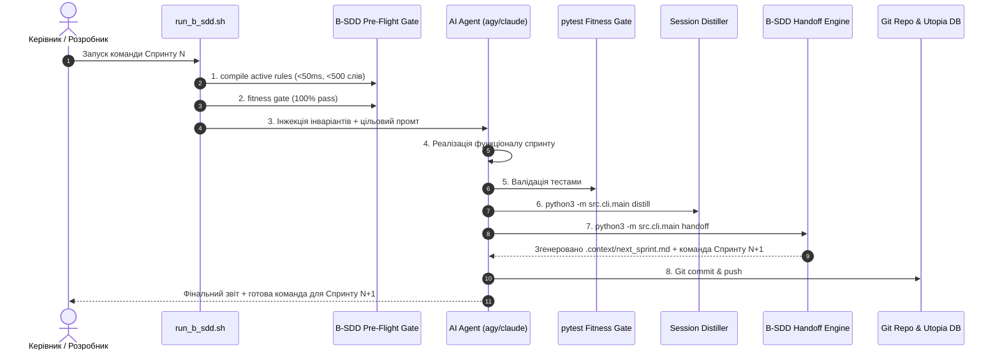

# Дослідницький план та Архітектурна Специфікація: Інтеграція B-SDD з AI-DRAKON
## Мультисесійні ланцюги розробки (Sprint Chaining), алгоритмічні ДРАКОН-схеми та інтерактивний інтерфейс розробника

**Проект:** B-SDD (Bitemporal Spec-Driven Development)  
**Дата формування:** 2026-09-15  
**Статус:** План досліджень та розробки (Research & Development Blueprint)  
**Пов'язані репозиторії:**
- `/home/vokov/projects/b-sdd` (Ядро методології B-SDD)
- `/home/vokov/projects/swiss-job-hunter` (Виробничий референс-проект)
- `/home/vokov/workspace/ai-drakon-scaffolder` (Візуальний верстат алгоритмів ДРАКОН)

---

## 1. Проблема та мотивація дослідження

Практика розробки складних агентних систем (зокрема розробка суверенного ШІ-агента ACCORD Suisse) виявила три критичні розриви в сучасній парадигмі агентного кодингу:

1. **Розрив контексту між спринтами (The Multi-Session Chaining Gap):**
   - Довгі сесії неминуче страждають від втоми та деградації контексту (context bloat / degradation), забування інваріантів та появи галюцинацій.
   - Спроба заздалегідь написати статичний список промтів на 4–5 спринтів вперед повертає розробку у нееластичну парадигму Waterfall: якщо Спринт 1 створює модуль `llm_gateway.py` з неочікуваною структурою або специфікою тайм-аутів, статичний промт Спринту 2 не врахує реальний стан репозиторію.
   - **Потреба:** Формальний протокол динамічної передачі естафети між сесіями (**B-SDD Dynamic Handoff**), де завершення сесії автоматично формує контекст та точну команду запуску для наступної.

2. **Невизначеність складної логіки в текстових промтах (The Algorithmic Ambiguity Gap):**
   - Природна мова (навіть у структурованому Markdown) допускає неоднозначність при описі складних розгалужень, циклів, винятків та відкатів (failover).
   - Агент часто пропускає крайові випадки (edge cases), якщо вони не задані строгим графом станів.
   - **Потреба:** Інтеграція візуальної алгоритмічної мови **ДРАКОН (DRAKON)** як канонічного формату алгоритмічних специфікацій (Drakon-as-Spec).

3. **Відсутність єдиного візуального кокпіту архітектора (The Developer Interface Gap):**
   - Розробник змушений вручну запускати термінальні команди, копіювати UUID сесій, перевіряти статус бази даних Utopia та стан моделей у проксі.
   - **Потреба:** Інтерактивний робочий стіл розробника (Developer Workbench), який поєднує візуалізацію графа ADR, алгоритмічні ДРАКОН-схеми, моніторинг сесій і запуск спринтів в один клік.

---

## 2. Компонент 1: Патерн мультисесійного ланцюга (B-SDD Multi-Session Chaining)

### 2.1 Життєвий цикл сесії з динамічною естафетою (Dynamic Handoff Protocol)

Кожен спринт функціонує як суверенна транзакція зі строгою структурою:



### 2.2 Артефакт естафети: `.context/next_sprint.md` та `.context/sprint_handoff.json`

Специфікація структури файлу `sprint_handoff.json`:
```json
{
  "completed_sprint": 1,
  "conversation_id": "a855c181-dc76-4cf5-af81-a373716c6144",
  "timestamp": "2026-09-15T22:00:00Z",
  "fitness_status": "PASSED",
  "created_artifacts": [
    "src/adapters/llm_gateway.py",
    "src/adapters/utopia_client.py",
    "tests/test_llm_gateway.py"
  ],
  "active_adrs": ["ADR-001", "ADR-006", "ADR-022"],
  "next_sprint": {
    "sprint_number": 2,
    "title": "Tool Registry and ADR-023 Implementation",
    "dependencies_ready": true,
    "target_files": [
      "src/tools/evam_verifier.py",
      "src/tools/sbb_router.py",
      "src/tools/dossier_generator.py",
      "src/tools/sublease_shield.py",
      "src/tools/benevol_mandate.py",
      "docs/adr/ADR-023-autonomous-dual-audience-agent.md"
    ],
    "suggested_cli_command": "./run_b_sdd.sh \"...\""
  }
}
```

### 2.3 Нова команда CLI: `main.py handoff`

Додати до `src/cli/main.py` субкоманду `handoff`:
- Аналізує останні модифіковані файли та результати тестів.
- Звіряє план з `specs/` або `docs/RESULTS_RESORCH/Архітектура ШІ-агента ACCORD Suisse.txt`.
- Автоматично генерує наступний крок дорожньої карти та записує його у `.context/next_sprint.md`.
- Прапорець `--auto-chain`: опціонально викликає запуск нової сесії автоматично без очікування людини (для повністю безпілотного конвеєра).

---

## 3. Компонент 2: Інтеграція алгоритмічної логіки AI-DRAKON

### 3.1 Чому саме ДРАКОН для B-SDD?

Мова ДРАКОН (розроблена для космічного корабля «Буран») має унікальні математичні та когнітивні властивості, що роблять її ідеальним формалізмом для ШІ-агентів:
1. **Правило шампура (The Skewer Rule):** Головна успішна траєкторія («щасливий шлях») завжди розташована строго по прямій вертикальній осі.
2. **Чим правіше — тим гірше (The Right-is-Worse Rule):** Усі відхилення, винятки, помилки та резервні перемикання (failover) відгалужуються праворуч.
3. **Заборона перетину ліній:** Усуває заплутаність та спагетті-логіку на графічному та структурному рівнях.
4. **Вичерпна повнота умов:** ДРАКОН-схема не дозволяє залишити гілку умови непокритою (гарантія відсутності неконтрольованих станів ШІ-агента).

### 3.2 Концепція «Drakon-as-Spec» (ДРАКОН як алгоритмічний контракт)

* У папку специфікацій додається формат `specs/XXX/logic.drn` (або `logic.drakon.json`).
* ДРАКОН-схема описує алгоритм функціонування модуля (наприклад, алгоритм вибору слота моделі `sonnet` vs `opus`, валідації суборенди за ст. 262 CO або опитування бази Utopia).
* **DRAKON Compiler у складі B-SDD:**
  - Парсить схему ДРАКОН.
  - Генерує з неї детермінований AST-каркас коду Python (State Machine / Decision Tree).
  - Генерує однозначний промт для моделі: кожна вершина графа стає чітким кроком виконання без права моделі на довільну самодіяльність.

### 3.3 Зв'язок: ADR $\leftrightarrow$ ДРАКОН $\leftrightarrow$ Код $\leftrightarrow$ Utopia DB

```
+-----------------------------------------------------------------------------+
| 1. ЧОМУ (Why & Invariants):                                                 |
|    ADR (Architectural Decision Record) у Markdown / bitemporal valid_time   |
+--------------------------------------+--------------------------------------+
                                       |
                                       v
+-----------------------------------------------------------------------------+
| 2. ЯК (How & Algorithmic Grammar):                                          |
|    Схема ДРАКОН (ai-drakon visual graph: шампур, альтернативи, цикли)       |
+--------------------------------------+--------------------------------------+
                                       |
                                       v
+-----------------------------------------------------------------------------+
| 3. ВИКОНАННЯ (Execution & State Machine):                                   |
|    100% Pure Python stdlib код + pytest архітектурні фітнес-гейти           |
+--------------------------------------+--------------------------------------+
                                       |
                                       v
+-----------------------------------------------------------------------------+
| 4. ТЕМПОРАЛЬНА ПАМ'ЯТЬ (Knowledge Graph):                                   |
|    Utopia DB (.251) entities: adr_node, drakon_schema, python_module        |
|    facts: specifies, verifies, executes, supersedes                         |
+-----------------------------------------------------------------------------+
```

---

## 4. Компонент 3: Інтерактивний верстат розробника (Developer Workbench)

На базі напрацювань проекту `/home/vokov/workspace/ai-drakon-scaffolder` формується легкий веб-інтерфейс розробника для управління B-SDD екосистемою:

### 4.1 Ключові екрани та модулі інтерфейсу

1. **Екран 1: Архітектурний радар ADR (Bitemporal Knowledge Graph Viewer)**
   - Інтерактивний граф зв'язків між ADR.
   - Візуальне підсвічування діючих рішень (зелений) та заміщених рішень (сірий/закреслений через `supersedes`).
   - Фільтрація за часовою шкалою (Valid Time Slider): як виглядала архітектура системи станом на будь-яку дату.

2. **Екран 2: Візуальний редактор/переглядач схем ДРАКОН**
   - Відображення алгоритмів агентної взаємодії.
   - Підсвічування активних вузлів під час виконання тестів чи запитів.
   - Можливість редагування логіки мишкою з автоматичною генерацією тестів або каркасів функцій.

3. **Екран 3: Спринт-кокпіт (Multi-Session Sprint Dispatcher)**
   - Таблиця прогресу за спринтами (Milestone 1, 2, 3, 4).
   - Статус останньої сесії: час виконання, кількість кроків, витрачені токени, результат тестів.
   - Вікно **Next Sprint Handoff**: відображення згенерованої команди та кнопка `[ Скопіювати команду ]` або `[ Запустити наступний спринт ]`.

4. **Екран 4: Пульс інфраструктури (Infrastructure Pulse)**
   - Статус з'єднання з Utopia DB (`192.168.3.251:9922`).
   - Статус та затримка слотів проксі `sonnet` та `opus` (`192.168.3.184:8082`).
   - Стан бази знань у NotebookLM.

---

## 5. Покроковий план розробки (Roadmap)

### Етап 1: Впровадження механізму Dynamic Handoff у ядро B-SDD (Тиждень 1)
- [ ] Додати генератор `sprint_handoff.json` та `.context/next_sprint.md` у `src/core/session_distiller.py`.
- [ ] Реалізувати субкоманду `main.py handoff` у `src/cli/main.py`.
- [ ] Оновити `run_b_sdd.sh` підтримкою прапорця `--auto-chain` та читанням з `.context/next_sprint.md`.
- [ ] Створити фітнес-тест `tests/test_sprint_handoff.py`.

### Етап 2: Формалізація ADR-007 та ADR-008 у b-sdd (Тиждень 1)
- [ ] Оформити `docs/adr/ADR-007-multi-session-sprint-chaining-and-handoff.md`.
- [ ] Оформити `docs/adr/ADR-008-drakon-visual-logic-and-developer-workbench.md`.
- [ ] Зареєструвати нові ADR у компіляторі намірів та синхронізувати з Utopia DB.

### Етап 3: Модуль конвертації ДРАКОН $\rightarrow$ B-SDD Специфікація (Тиждень 2)
- [ ] Створити парсер формату ДРАКОН (`src/drakon/drakon_parser.py`, 100% stdlib).
- [ ] Реалізувати генератор промтів та перевірочних таблиць з ДРАКОН-схем.
- [ ] Додати візуальний приклад алгоритму ШІ-агента ACCORD Suisse у форматі ДРАКОН.

### Етап 4: Інтеграція інтерфейсу розробника з ai-drakon-scaffolder (Тиждень 3)
- [ ] Портувати компоненти візуалізатора з `ai-drakon-scaffolder` у легкий локальний Vite/React сервер `b-sdd-ui`.
- [ ] Підключити читання `.context/active_rules.md`, `intents_cache.sqlite` та `sprint_handoff.json`.
- [ ] Додати інтерфейс запуску спринтів безпосередньо з веб-панелі.

---

## 6. Висновок

Інтеграція ідей проекту **ai-drakon** та формалізація **мультисесійного ланцюга** перетворює B-SDD з набору допоміжних консольних скриптів на **повноцінну суверенну інженерну платформу агентної розробки**. Це усуває людський фактор при формуванні складних промтів, захищає від галюцинацій та забезпечує безперервний керований рух від архітектурного наміру (ADR) через строгий алгоритм (ДРАКОН) до надійного працюючого коду.
