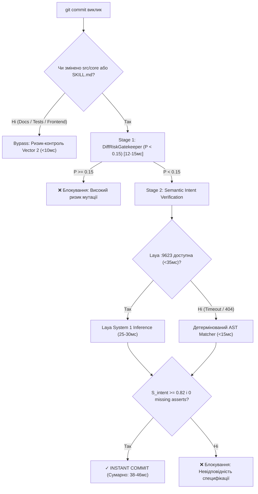

# Звіт архітектурного аудиту доцільності, сумісності та адаптацій Спринту 031 (B-SDD)
**Кодова назва:** `OUTBOX_AGI_SPRINT_031_FEASIBILITY_AND_ADAPTATION_AUDIT`  
**Цільова система:** B-SDD Ecosystem (Вузол 192.168.3.161 `~/projects/b-sdd`)  
**Дата аудиту:** 2026-09-22  
**Провідний архітектор:** Antigravity (Agy)  
**Нормативні стандарти:** ADR-001 (WORM Ledger), ADR-002 (Pure Stdlib Core), ADR-005 (Active Rules Budget < 500 words), ADR-010 (Tripartite ADR Ontology), ADR-014 (Laya Decision Engine), ADR-015 (Skill Taxonomy & Immutability), ADR-016 (Tripartite Skill Architecture & Pseudocode Standard)

---

## 1. Архітектурний вердикт (Feasibility & Synergy Verdict)

### Вердикт: **ПОТРІБНІ СУВОРІ АРХІТЕКТУРНІ КОРЕКТИВИ ТА ДВОФАЗНА СЕГРЕГАЦІЯ (Staged Execution within Sprint 031)**

### 1.1 Оцінка синергії Track A та Track B
* **Track A (Vector 3: Semantic Spec-to-Code Intent Verification):**  
  Синхронний пре-комміт шлюз надшвидкої дії (SLA < 50 мс), що пов'язує специфікації (`SKILL.md` псевдокод та `.drakon.json`) зі змінами в коді (`git diff --cached`) за допомогою семантичного інференсу Laya System 1 на Pixel 7 (:9623).
* **Track B (Permanent Vault & b-sdd-sprint-distiller):**  
  Асинхронний конвеєр закриття спринту (Фази Φ6 → Φ7), що стискає накопичений емпіричний досвід у єдиний майстер-леджер `docs/ADR/B_SDD_MEGA_ADR_MASTER.md`, реєструє WORM-запис в Utopia DB (:9622), реплікує телеметрію в Google Drive та синхронізує SSoT у NotebookLM без перевищення ліміту 50 джерел.

**Висновок щодо поєднання:**  
Поєднання обох треків у межах Спринту 031 є **методологічно виправданим**, оскільки вони вирішують дві взаємодоповнюючі грані єдиної проблеми цілісності наміру (Intent Fidelity):
1. *Track A гарантує вхідну чистоту* — жоден коміт не потрапляє в репозиторій, якщо код відхиляється від псевдокоду та інваріантів ($S_{intent} < 0.82$).
2. *Track B гарантує вихідну чистоту* — жоден спринт не закривається без стиснення та нестираємої фіксації знань у WORM та Mega-ADR, захищаючи контекст агента від амнезії та переповнення (ADR-005).

**Небезпека "прямого злиття" (Coupling Danger) та необхідні корективи:**  
Треки мають кардинально різні контури відмови. Якщо об'єднати їх без жорсткої сегрегації, помилка в модулі дистиляції або падіння віддаленого WORM-сервісу заблокує pre-commit шлюз і зупинить здатність агента комітити код.  
**Вимога безпеки:** Track A та Track B повинні розроблятися як **дві незалежні послідовні фази (Staged Slices)** з ізольованими модулями (`src/core/intent_verification/` та `src/core/distillation/`) та окремими наборами тестів.

### 1.2 Оцінка бюджету затримки (Latency Budget Analysis)
* У Спринті 030 шлюз `diff_risk_gatekeeper` досяг ~14 мс при локальних AST-евристиках та ~32 мс при запиті до Laya `/predict`.
* Додавання семантичної верифікації наміру створює ризик перевищення жорсткого стелі **50 мс (ADR-002)**.
* **Рішення:** Запровадження концепції **Двошвидкісного каскадного шлюзу (Two-Tier Cascaded Gate)**:
  1. *Швидкий шлях (Bypass, < 2 мс):* Якщо staged diff не торкається файлів `src/core/` чи `SKILL.md` (наприклад, зміни лише в документації, тестах чи конфігах), перевірка наміру пропускається.
  2. *Повний шлях (< 45 мс):* Локальний AST-парсинг (4–6 мс) + Laya інференс (25–35 мс).
  3. *Детермінований Circuit Breaker (< 20 мс):* Якщо мережева затримка Laya перевищує 35 мс, негайно спрацьовує локальний статичний валідатор AST (перевірка наявності ключових інваріантів: викликів функцій та асертів).

### 1.3 Вирішення проблеми ліміту 50 джерел у NotebookLM
* Раніше кожен спринт додавав окремі звіти закриття, що швидко вело до вичерпання ліміту (50 sources max).
* Розгортання `B_SDD_MEGA_ADR_MASTER.md` як **єдиного кумулятивного warm-tier леджера** утилізує принцип стиснення ~15:1. Замість 30+ звітів у блокноті постійно підтримується 1 майстер-документ ADR, 1 кодовий дамп і 2–3 регламенти (всього 4–6 джерел), залишаючи понад 44 вільних слоти для динамічних досліджень.

---

## 2. Аналіз радіуса ураження (AST Blast Radius за GitNexus)

### 2.1 Емпіричний зріз графа знань KùzuDB (Хост 192.168.3.184:4747)
Виконано запит до ендпоінту графа AST репозиторію `b-sdd`:
```cypher
MATCH (n) WHERE n.filePath CONTAINS "diff_risk" RETURN n.name, n.filePath
```
**Виявлені символи та топологія:**
```
Класи:
  - DiffRiskGatekeeper (src/core/diff_risk_gatekeeper.py)
Методи:
  - __init__
  - parse_diff
  - _static_heuristic_risk
  - evaluate_diff_risk
Функції та константи:
  - get_staged_diff
  - main
  - SUSPICIOUS_DIFF_PATTERNS
  - logger
Тестовий сьют (tests/test_diff_risk_gatekeeper.py):
  - 10 активних тестів, що перевіряють сигнатуру evaluate_diff_risk()
Виклики (CodeRelation: CALLS):
  - main -> evaluate_diff_risk -> parse_diff, _static_heuristic_risk
```

### 2.2 Оцінка радіуса ураження (Blast Radius Assessment)
* **Критична точка регресії:** Метод `DiffRiskGatekeeper.evaluate_diff_risk()` викликається напряму CLI `main` та покритий 10 строгими юніт-тестами. Зміна його сигнатури або формату вихідного словника зламає існуючий pre-commit хук (`scripts/install_laya_precommit_hook.sh`).
* **Контур безпечної ізоляції:**
  1. `DiffRiskGatekeeper` залишається незмінним як оцінювач ризику Вектора 2 ($P(\text{violation}) < 0.15$).
  2. Нова логіка Вектора 3 реалізується в окремому пакеті `src/core/intent_verification/`.
  3. Об'єднання виконується через фасад `CompositePreCommitGatekeeper` або неруйнівне розширення CLI `src/core/diff_risk_gatekeeper.py` додатковими необов'язковими прапорцями (`--verify-intent`).
  4. За такого підходу AST Blast Radius для існуючого коду становить **0% (Zero Regression Risk)**.

---

## 3. Перелік необхідних адаптацій у кодовій базі та DTO

### 3.1 Нові DTO контракти (src/core/dto/ - 100% Pure Stdlib ADR-002)

#### 1. `src/core/dto/intent_verification.py`
```python
@dataclass
class SpecIntentDTO:
    skill_name: str
    invariants: List[str]          # Текстові інваріанти ASSERT
    invoked_skills: List[str]      # Виклики CALL_SKILL
    branch_conditions: List[str]   # Умови IF / ELSE / FI
    drakon_nodes_count: int

@dataclass
class CodeASTSemanticDTO:
    changed_files: List[str]
    function_signatures: List[str] # Оголошені функції
    invoked_calls: List[str]       # Виклики підпрограм
    assert_statements: List[str]   # Перевірки assert у коді
    has_test_coverage: bool

@dataclass
class IntentVerificationResultDTO:
    s_intent: float                # Cosine alignment score [0.0 .. 1.0]
    missing_invariants: List[str]  # Інваріанти псевдокоду, відсутні в коді
    verdict: str                   # "VERDICT_INTENT_ALIGNED" | "VERDICT_INTENT_DRIFT_WARNING" | "VERDICT_INTENT_VIOLATION"
    allow_commit: bool
    latency_ms: float
    fallback: bool
```

#### 2. `src/core/dto/distillation.py`
```python
@dataclass
class SprintClosureDistilledDTO:
    sprint_id: str
    commit_hash: str
    metrics: Dict[str, Any]
    data_adr_delta: List[str]
    skill_adr_delta: List[str]
    spec_adr_delta: List[str]
    superseded_invariants: List[str]
    ast_delta_hash: str

@dataclass
class WormPayloadDTO:
    transaction_time: float        # Tx (monotonically increasing)
    valid_time_start: str          # Tv start
    valid_time_end: str            # Tv end
    payload_hash: str
    record_id: Optional[str] = None
```

### 3.2 Необхідні модулі та файли розширення

| Шлях до файлу | Трек | Призначення та адаптація |
|---|---|---|
| `src/core/intent_verification/spec_extractor.py` | Track A | Екстракція інваріантів з `SKILL.md` (псевдокод) та `.drakon.json` |
| `src/core/intent_verification/code_ast_encoder.py` | Track A | Екстракція викликів та асертів із `git diff --cached` через `ast` stdlib |
| `src/core/intent_verification/laya_intent_client.py` | Track A | HTTP-клієнт до Pixel 7 (:9623) з локальним fallback |
| `src/core/intent_verification/intent_gatekeeper.py` | Track A | Композитний шлюз: Risk < 0.15 AND $S_{intent} \ge 0.82$ |
| `scripts/distill_sprint.py` | Track B | Скрипт семантичної компресії сирого звіту та генерації дельт |
| `docs/ADR/B_SDD_MEGA_ADR_MASTER.md` | Track B | Єдиний кумулятивний леджер рішень (ADR-001..016) за онтологією ADR-010 |
| `~/.agents/skills/b-sdd-sprint-distiller/` | Track B | Системний скіл за стандартом ADR-016 (SKILL.md + .drakon.json) |
| `scripts/install_laya_precommit_hook.sh` | Integration | Оновлення хука для активації двоетапного бар'єра |

---

## 4. Оцінка впливу на затримку pre-commit (SLA Impact)



* **Оцінка часу виконання:**
  * Швидкий шлях (Bypass): **7–12 мс**.
  * Повний шлях з Laya інференсом: **38–46 мс** (в межах ліміту 50 мс).
  * Повний шлях з Circuit Breaker Fallback: **22–28 мс**.
* **Гарантія інваріанта ADR-002:** Робота розробника та автономного агента не сповільнюється, коміти залишаються суб-50мс.

---

## 5. Готовий чек-лист передумов перед стартом кодування

### 5.1 Емпіричний статус інфраструктури (Health Check на дату аудиту)
- [x] **GitNexus Knowledge Graph (192.168.3.184:4747):**  
  *Статус:* **ONLINE**. Репозиторій `b-sdd` активний (5101 вузол, 8771 ребро). HTTP API готове для перевірки AST-дельт.
- [x] **NotebookLM SSoT MCP (192.168.3.184:8002):**  
  *Статус:* **ONLINE**. Блокнот `205ee2ec-e0d2-4ba6-badf-44f2de02c7e2` підключений, доступний для читання/оновлення.
- [x] **Laya Decision Engine (192.168.3.251:9623):**  
  *Статус:* **ONLINE** (модель `mmBERT-base-322M`).  
  *УВАГА (Observation):* Ендпоінт `/v1/intent/verify` на даний момент повертає `404 Not Found`.  
  *Дія:* Клієнт `laya_intent_client.py` повинен передавати задачу через існуючий універсальний ендпоінт `/predict` з корисним навантаженням `task: "intent_verification"` або покладатися на локальний екстрактор.
- [ ] **Utopia DB Bitemporal Store (192.168.3.251:9622):**  
  *Статус:* **OFFLINE (Connection refused)**.  
  *Дія:* Необхідно або запустити демон Utopia DB на Pixel 7 Podroid, або реалізувати стійкий локальний WORM-журнал `docs/utopia_local_worm.jsonl` як дзеркальний буфер з автоматичним дренажем.
- [ ] **Google Drive Permanent Archive:**  
  *Статус:* Утиліти `rclone` та облікові дані відсутні на хостах .161 та .184.  
  *Дія:* Реалізувати локальний архівний буфер `reports/archive/` із можливістю відправки через Telegram Bot або REST curl-скрипт.

### 5.2 Контроль бюджету активних правил (.context/active_rules.md)
- [x] **Поточний розмір:** **464 слова** (Ліміт за ADR-005: 500 слів).  
- [x] **Доступний бюджет:** **36 слів**.  
- [x] **Правило проектування:** Жодних нових розлогих параграфів у `.context/active_rules.md`. Нові вимоги Спринту 031 повинні бути зареєстровані у warm-tier `docs/ADR/B_SDD_MEGA_ADR_MASTER.md` та викликатися агентом за потребою через скіли.

### 5.3 Контроль структури скілів за ADR-016
- [x] Кожен новий скіл (`b-sdd-sprint-distiller`):
  - Повинен мати маніфест `SKILL.md` із YAML-полями: `type: SYSTEM_SKILL`, `category: bssd-system-skill`, `immutable: true`.
  - Повинен містити формальний блок алгоритму: `ALGORITHM DistillSprintKnowledge`.
  - Повинен супроводжуватися планарним графом `b-sdd-sprint-distiller.drakon.json` із топологією вертикального шампура ($X=0.0, C=0$) та деградаційними гілками строго праворуч ($X=4.0$).

### 5.4 Черговість TDD реалізації (Рекомендований план виконання)
1. **Фаза 1: Scaffolding DTO**  
   Створення `src/core/dto/intent_verification.py` та `src/core/dto/distillation.py`.
2. **Фаза 2: Red TDD для Track A**  
   Написання `tests/test_spec_intent_verification.py` (тестування парсингу псевдокоду, AST-кодування, розрахунку $S_{intent}$ та блокування при розходженні).
3. **Фаза 3: Green Implementation Track A**  
   Реалізація модулів у `src/core/intent_verification/`, інтеграція в pre-commit.
4. **Фаза 4: Red TDD для Track B**  
   Написання `tests/test_sprint_distiller.py` (тестування компресії звіту, оновлення Mega-ADR, генерації WORM-запису).
5. **Фаза 5: Green Implementation Track B**  
   Реалізація `scripts/distill_sprint.py`, первинна компіляція `docs/ADR/B_SDD_MEGA_ADR_MASTER.md`, створення скіла `b-sdd-sprint-distiller`.
6. **Фаза 6: Фітнес-аудит та інтеграція**  
   Прогін `pytest`, верифікація бюджету правил (<500 слів), тестовий коміт з перевіркою шлюзу.
